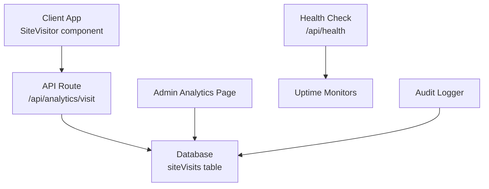
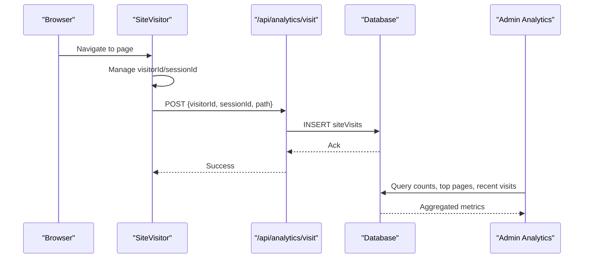
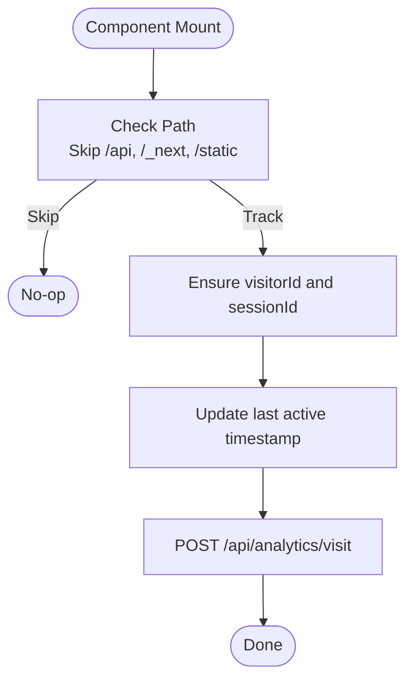
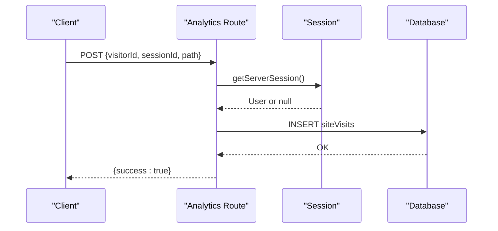
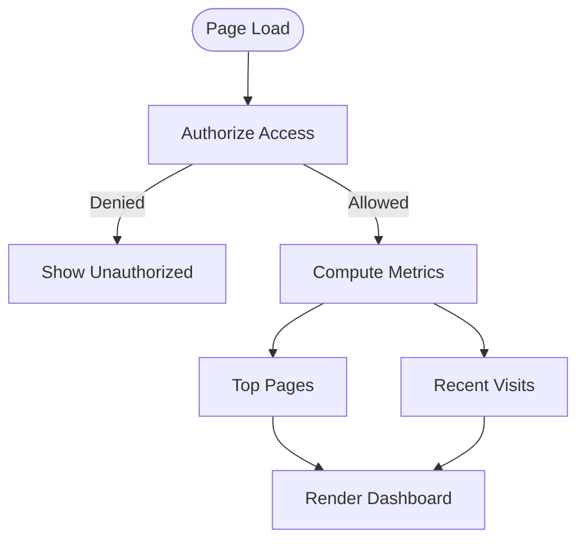
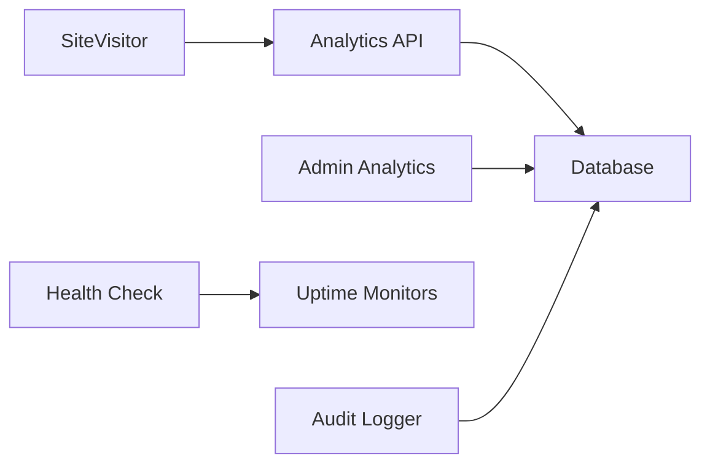

# Monitoring & Logging Strategy

<cite>
**Referenced Files in This Document**
- [package.json](file://package.json)
- [site-visitor.tsx](file://components/analytics/site-visitor.tsx)
- [route.ts (analytics visit)](file://app/api/analytics/visit/route.ts)
- [page.tsx (admin analytics)](file://app/dashboard/admin/analytics/page.tsx)
- [route.ts (health check)](file://app/api/health/route.ts)
- [audit.ts](file://lib/audit.ts)
- [members.ts](file://lib/actions/members.ts)
</cite>

## Table of Contents
1. Introduction
2. Project Structure
3. Core Components
4. Architecture Overview
5. Detailed Component Analysis
6. Dependency Analysis
7. Performance Considerations
8. Troubleshooting Guide
9. Conclusion
10. Appendices

## Introduction
This document defines the monitoring and logging strategy for the TMC Portal with a focus on observability and operational insights. It covers application performance monitoring (request tracing, database query optimization, memory usage tracking), structured logging strategies, error tracking and alerting, analytics implementation for user behavior and business KPIs, infrastructure monitoring (server metrics, disk space alerts, service health checks), dashboard creation guidance, log analysis queries, incident response procedures, scaling monitoring infrastructure, and log retention policies.

## Project Structure
The monitoring and analytics capabilities are implemented across client-side tracking, server-side API endpoints, admin dashboards, and audit logging utilities:
- Client-side visitor tracking component that records page visits and session lifecycle events.
- Server-side analytics endpoint to persist visits and enrich them with session context.
- Admin analytics dashboard to visualize traffic and engagement metrics.
- Health check endpoint for service uptime monitoring.
- Audit logging utility to record administrative actions and system events.
- Database interactions for analytics and statistics.

**Diagram sources**
- [site-visitor.tsx:1-71](file://components/analytics/site-visitor.tsx#L1-L71)
- [route.ts (analytics visit):1-33](file://app/api/analytics/visit/route.ts#L1-L33)
- [page.tsx (admin analytics):1-161](file://app/dashboard/admin/analytics/page.tsx#L1-L161)
- [route.ts (health check):1-6](file://app/api/health/route.ts#L1-L6)
- [audit.ts:1-48](file://lib/audit.ts#L1-L48)

**Section sources**
- [package.json:1-127](file://package.json#L1-L127)

## Core Components
- SiteVisitor (client): Tracks unique visitors and sessions, manages timeouts, and posts visit events to the analytics endpoint without blocking page load.
- Analytics Visit API (server): Accepts visit payloads, resolves authenticated user if available, captures IP and user agent, and persists visit records.
- Admin Analytics Dashboard: Displays total page views, unique visitors, total sessions, views per session, top pages, and recent activity.
- Health Check Endpoint: Returns a simple status for uptime monitors and load balancers.
- Audit Logger: Provides robust insertion of audit logs with error handling to avoid disrupting core flows.

**Section sources**
- [site-visitor.tsx:1-71](file://components/analytics/site-visitor.tsx#L1-L71)
- [route.ts (analytics visit):1-33](file://app/api/analytics/visit/route.ts#L1-L33)
- [page.tsx (admin analytics):1-161](file://app/dashboard/admin/analytics/page.tsx#L1-L161)
- [route.ts (health check):1-6](file://app/api/health/route.ts#L1-L6)
- [audit.ts:1-48](file://lib/audit.ts#L1-L48)

## Architecture Overview
The observability architecture integrates client telemetry, server-side persistence, and admin visualization:
- The client component emits lightweight visit events after a short delay to avoid impacting critical rendering paths.
- The server endpoint enriches events with session context and network metadata before storing them.
- The admin dashboard aggregates metrics using SQL functions and joins to present actionable insights.
- A dedicated health endpoint supports external uptime checks.
- Audit logs provide an immutable trail for compliance and troubleshooting.

**Diagram sources**
- [site-visitor.tsx:1-71](file://components/analytics/site-visitor.tsx#L1-L71)
- [route.ts (analytics visit):1-33](file://app/api/analytics/visit/route.ts#L1-L33)
- [page.tsx (admin analytics):1-161](file://app/dashboard/admin/analytics/page.tsx#L1-L161)

## Detailed Component Analysis

### Client-Side Visitor Tracking
- Maintains persistent visitor identifiers and session IDs with a 30-minute inactivity timeout.
- Skips tracking for internal routes and static assets to reduce noise.
- Posts visit data asynchronously with a small delay to prevent blocking.
- Handles failures gracefully without disrupting UX.

**Diagram sources**
- [site-visitor.tsx:1-71](file://components/analytics/site-visitor.tsx#L1-L71)

**Section sources**
- [site-visitor.tsx:1-71](file://components/analytics/site-visitor.tsx#L1-L71)

### Analytics API Endpoint
- Parses request body and extracts visitor and session identifiers.
- Resolves current session to attach userId when available.
- Captures IP address from proxy headers or defaults to localhost for development.
- Persists visit records and returns success; logs errors and returns 500 on failure.

**Diagram sources**
- [route.ts (analytics visit):1-33](file://app/api/analytics/visit/route.ts#L1-L33)

**Section sources**
- [route.ts (analytics visit):1-33](file://app/api/analytics/visit/route.ts#L1-L33)

### Admin Analytics Dashboard
- Enforces authorization for sensitive analytics access.
- Computes key metrics: total page views, unique visitors, total sessions, views per session.
- Retrieves top pages by visit count and recent visits with optional user context.

**Diagram sources**
- [page.tsx (admin analytics):1-161](file://app/dashboard/admin/analytics/page.tsx#L1-L161)

**Section sources**
- [page.tsx (admin analytics):1-161](file://app/dashboard/admin/analytics/page.tsx#L1-L161)

### Health Check Endpoint
- Simple GET returning a status payload for uptime monitors and load balancer probes.

**Section sources**
- [route.ts (health check):1-6](file://app/api/health/route.ts#L1-L6)

### Audit Logging Utility
- Inserts audit entries with rich context (user, entity, organization, IP, user agent, metadata).
- Wraps insertions in try/catch to ensure audit failures do not disrupt application flow.
- Supports filtering and pagination for retrieval operations.

**Section sources**
- [audit.ts:1-48](file://lib/audit.ts#L1-L48)

## Dependency Analysis
- Client dependency on Next.js navigation hooks and UUID generation for stable identifiers.
- Server dependencies on authentication session resolution and database ORM for analytics storage.
- Dashboard depends on ORM aggregation functions and SQL expressions for efficient metric computation.
- Health endpoint is self-contained with minimal dependencies.

**Diagram sources**
- [site-visitor.tsx:1-71](file://components/analytics/site-visitor.tsx#L1-L71)
- [route.ts (analytics visit):1-33](file://app/api/analytics/visit/route.ts#L1-L33)
- [page.tsx (admin analytics):1-161](file://app/dashboard/admin/analytics/page.tsx#L1-L161)
- [route.ts (health check):1-6](file://app/api/health/route.ts#L1-L6)
- [audit.ts:1-48](file://lib/audit.ts#L1-L48)

**Section sources**
- [package.json:1-127](file://package.json#L1-L127)

## Performance Considerations
- Request Tracing:
  - Use correlation IDs propagated from client to server to trace requests end-to-end.
  - Add timing metadata at entry points and database calls to measure latency.
- Database Query Optimization:
  - Leverage indexed columns for visitorId, sessionId, path, and createdAt to speed up aggregations.
  - Use SQL COUNT(DISTINCT ...) and GROUP BY efficiently; consider materialized views for heavy dashboards.
  - For large datasets, implement time-bounded queries and caching layers for frequently accessed metrics.
- Memory Usage Tracking:
  - Monitor Node.js heap growth and GC pauses via process metrics.
  - Avoid retaining large objects in closures; offload heavy computations to background workers.
  - Profile hot paths in analytics aggregation to identify bottlenecks.

[No sources needed since this section provides general guidance]

## Troubleshooting Guide
- Analytics Failures:
  - If client-side tracking fails silently, verify CORS and network connectivity to /api/analytics/visit.
  - Inspect server logs for parsing errors or database write failures.
- Authorization Errors:
  - Ensure users have required roles to access the analytics dashboard.
  - Validate session resolution and role checks in the server component.
- Health Checks:
  - Confirm /api/health responds with expected status codes for uptime monitors.
  - Investigate upstream issues if health checks fail intermittently.
- Audit Logs:
  - If audit inserts fail, review database permissions and connection pools.
  - Ensure metadata fields remain within size limits to avoid truncation.

**Section sources**
- [route.ts (analytics visit):1-33](file://app/api/analytics/visit/route.ts#L1-L33)
- [page.tsx (admin analytics):1-161](file://app/dashboard/admin/analytics/page.tsx#L1-L161)
- [route.ts (health check):1-6](file://app/api/health/route.ts#L1-L6)
- [audit.ts:1-48](file://lib/audit.ts#L1-L48)

## Conclusion
The TMC Portal implements a practical observability foundation with client-side tracking, server-side persistence, admin dashboards, health checks, and audit logging. To enhance reliability and insight, adopt standardized request tracing, optimize database queries for analytics workloads, monitor memory and CPU, and integrate centralized logging and alerting. These practices will improve incident detection, performance tuning, and operational decision-making.

[No sources needed since this section summarizes without analyzing specific files]

## Appendices

### A. Application Performance Monitoring
- Request Tracing:
  - Introduce a request ID header passed through client and server layers.
  - Log start/end timestamps and span durations for each handler.
- Database Query Optimization:
  - Index frequently filtered columns (visitorId, sessionId, path, createdAt).
  - Use EXPLAIN to analyze slow queries and refactor where necessary.
- Memory Usage Tracking:
  - Track heap usage and set alerts for sustained high memory consumption.
  - Offload batch analytics jobs to workers to reduce peak memory pressure.

[No sources needed since this section provides general guidance]

### B. Logging Strategy
- Structured Logging:
  - Emit JSON logs with consistent fields: timestamp, level, requestId, message, context.
  - Include contextual metadata such as userId, ip, userAgent, and operation type.
- Log Levels:
  - Use levels: DEBUG, INFO, WARN, ERROR.
  - Filter DEBUG in production; retain INFO and above for operational visibility.
- Log Rotation Policies:
  - Rotate logs daily or by size thresholds.
  - Retain logs for 30–90 days depending on compliance needs; archive older logs to cold storage.

[No sources needed since this section provides general guidance]

### C. Error Tracking and Alerting
- Exception Tracking:
  - Centralize error reporting with stack traces and contextual metadata.
  - Correlate errors with request IDs for faster triage.
- Uptime Monitoring:
  - Poll /api/health at regular intervals; alert on consecutive failures.
- Notifications:
  - Configure alerts via email, Slack, or PagerDuty for critical errors and downtime.

[No sources needed since this section provides general guidance]

### D. Analytics Implementation
- User Behavior Tracking:
  - Capture page views, sessions, referrers, and device types.
  - Respect privacy by excluding sensitive paths and anonymizing IPs where required.
- Feature Usage Metrics:
  - Instrument feature flags and track adoption rates.
- Business KPIs:
  - Define KPIs such as conversion rate, average session duration, and top-performing content.

[No sources needed since this section provides general guidance]

### E. Infrastructure Monitoring
- Server Metrics:
  - Monitor CPU, memory, disk I/O, and network throughput.
- Disk Space Alerts:
  - Alert when disk usage exceeds thresholds (e.g., 80%).
- Service Health Checks:
  - Implement readiness and liveness probes for container orchestration.

[No sources needed since this section provides general guidance]

### F. Dashboard Creation and Log Analysis
- Dashboard Examples:
  - Traffic overview: total page views, unique visitors, sessions, views per session.
  - Top pages and recent activity with user context.
- Log Analysis Queries:
  - Filter by time range, severity, and request ID.
  - Aggregate errors by endpoint and user agent to identify trends.

[No sources needed since this section provides general guidance]

### G. Incident Response Procedures
- Detection:
  - Use health checks and error alerts to detect anomalies early.
- Triage:
  - Correlate logs and metrics with request IDs to isolate affected users.
- Resolution:
  - Roll back recent changes, scale resources, or restart services as needed.
- Postmortem:
  - Document root cause, impact, and preventive measures.

[No sources needed since this section provides general guidance]

### H. Scaling Monitoring Infrastructure
- Horizontal Scaling:
  - Distribute logs to centralized collectors; shard databases for analytics tables.
- Vertical Scaling:
  - Increase instance sizes during peak loads; use auto-scaling policies.
- Caching:
  - Cache aggregated metrics for dashboards to reduce database load.

[No sources needed since this section provides general guidance]

### I. Managing Log Retention Policies
- Retention Windows:
  - Hot logs: 7–30 days; warm logs: 30–90 days; cold archives: 90+ days.
- Compliance:
  - Ensure PII is masked or removed before long-term storage.
- Cost Control:
  - Compress logs and tier storage based on access frequency.

[No sources needed since this section provides general guidance]