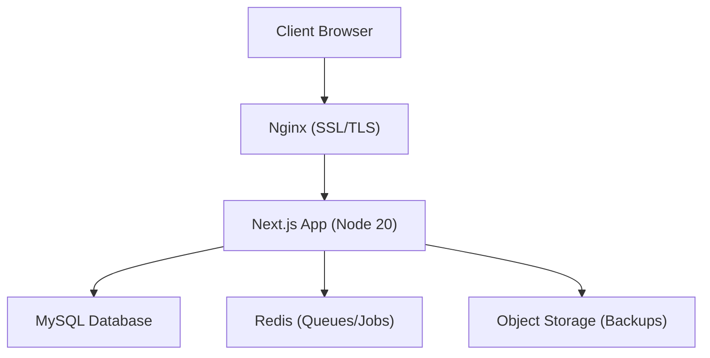
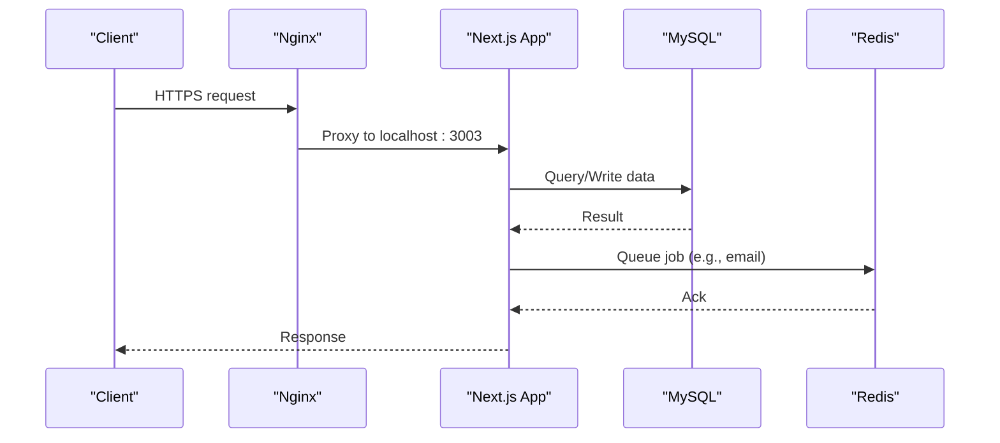
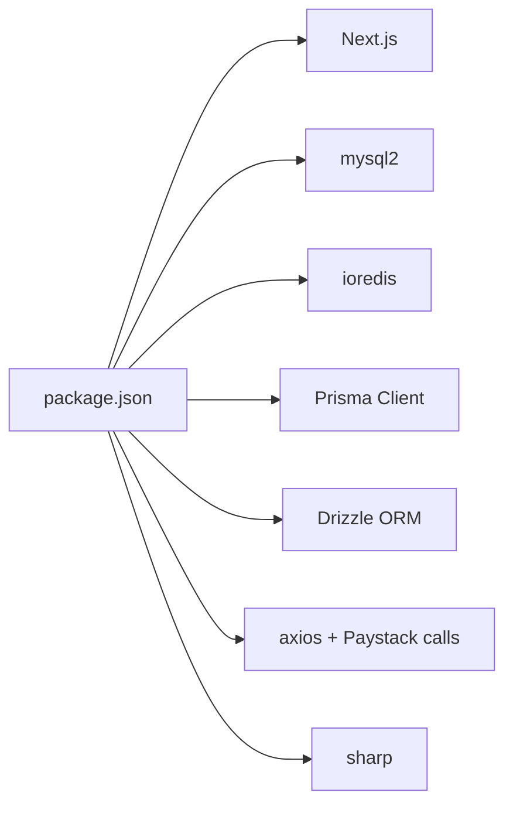

# Production Deployment & Configuration

<cite>
**Referenced Files in This Document**
- [package.json](file://package.json)
- [Dockerfile](file://Dockerfile)
- [docker-compose.yml](file://docker-compose.yml)
- [next.config.ts](file://next.config.ts)
- [DEPLOYMENT_GUIDE_SERVER.md](file://DEPLOYMENT_GUIDE_SERVER.md)
- [MYSQL_SETUP.md](file://MYSQL_SETUP.md)
- [lib/auth.config.ts](file://lib/auth.config.ts)
- [lib/payments.ts](file://lib/payments.ts)
- [lib/redis.ts](file://lib/redis.ts)
- [nginx_full_remote.conf](file://nginx_full_remote.conf)
- [nginx_tmcng.conf](file://nginx_tmcng.conf)
- [app/api/health/route.ts](file://app/api/health/route.ts)
- [scripts/automated-backup.ts](file://scripts/automated-backup.ts)
- [scripts/backup-db-tables.ts](file://scripts/backup-db-tables.ts)
- [drizzle.config.ts](file://drizzle.config.ts)
</cite>

## Table of Contents
1. [Introduction](#introduction)
2. [Project Structure](#project-structure)
3. [Core Components](#core-components)
4. [Architecture Overview](#architecture-overview)
5. [Detailed Component Analysis](#detailed-component-analysis)
6. [Dependency Analysis](#dependency-analysis)
7. [Performance Considerations](#performance-considerations)
8. [Troubleshooting Guide](#troubleshooting-guide)
9. [Conclusion](#conclusion)
10. [Appendices](#appendices)

## Introduction
This document provides production deployment and configuration guidance for the TMC Portal. It covers server requirements, environment variables (database, authentication, payments, third-party APIs), database provisioning with MySQL, SSL and reverse proxy setup with Nginx, monitoring via health checks and backups, step-by-step deployment procedures, rollback strategies, security hardening, performance tuning, and capacity planning.

## Project Structure
The application is a Next.js app built as a standalone Node server inside Docker. It uses:
- MySQL for persistence (via Prisma and Drizzle configurations)
- Redis for queues and background jobs
- Nginx as a reverse proxy with SSL termination
- Automated backup scripts to local archives and object storage

**Diagram sources**
- [docker-compose.yml:4-35](file://docker-compose.yml#L4-L35)
- [nginx_full_remote.conf:129-165](file://nginx_full_remote.conf#L129-L165)
- [Dockerfile:4-11](file://Dockerfile#L4-L11)

**Section sources**
- [package.json:17-102](file://package.json#L17-L102)
- [Dockerfile:4-11](file://Dockerfile#L4-L11)
- [docker-compose.yml:4-35](file://docker-compose.yml#L4-L35)

## Core Components
- Application runtime: Next.js standalone server on Node.js 20
- Database: MySQL with Prisma migrations and Drizzle config
- Authentication: NextAuth v5 with JWT strategy and secret from environment
- Payments: Paystack integration using secret/public keys
- Background jobs: Redis-backed workers for email and scheduled tasks
- Reverse proxy: Nginx with SSL managed by Certbot
- Backups: Automated mysqldump and uploads archival to local archive and object storage

Key environment variables used across components:
- DATABASE_URL, AUTH_SECRET, NEXT_PUBLIC_APP_URL
- PAYSTACK_SECRET_KEY, PAYSTACK_PUBLIC_KEY, NEXT_PUBLIC_PAYSTACK_PUBLIC_KEY
- REDIS_URL
- WASABI_* or AWS_* for object storage credentials and endpoint

**Section sources**
- [Dockerfile:4-11](file://Dockerfile#L4-L11)
- [DEPLOYMENT_GUIDE_SERVER.md:28-58](file://DEPLOYMENT_GUIDE_SERVER.md#L28-L58)
- [MYSQL_SETUP.md:53-60](file://MYSQL_SETUP.md#L53-L60)
- [lib/auth.config.ts:1-12](file://lib/auth.config.ts#L1-L12)
- [lib/payments.ts:1-8](file://lib/payments.ts#L1-L8)
- [lib/redis.ts:1-9](file://lib/redis.ts#L1-L9)
- [scripts/automated-backup.ts:12-29](file://scripts/automated-backup.ts#L12-L29)

## Architecture Overview
End-to-end request flow through Nginx to the Next.js app, then to MySQL and Redis. Health checks are exposed at /api/health.

**Diagram sources**
- [nginx_full_remote.conf:129-165](file://nginx_full_remote.conf#L129-L165)
- [docker-compose.yml:4-35](file://docker-compose.yml#L4-L35)
- [app/api/health/route.ts:1-6](file://app/api/health/route.ts#L1-L6)

## Detailed Component Analysis

### Environment Variables and Secrets
- Database connection: DATABASE_URL must point to MySQL host/port/database; ensure network connectivity if DB is containerized.
- Authentication: AUTH_SECRET is required for NextAuth JWT sessions; set NEXT_PUBLIC_APP_URL for correct origin handling.
- Payments: PAYSTACK_SECRET_KEY and PAYSTACK_PUBLIC_KEY enable payment flows; NEXT_PUBLIC_PAYSTACK_PUBLIC_KEY is passed into the build for client-side use.
- Redis: REDIS_URL connects to Redis for queueing and background jobs.
- Object storage: WASABI_* or AWS_* variables configure backups upload.

Operational notes:
- The Docker Compose file injects NODE_ENV, HOSTNAME, REDIS_URL, and SKIP_IMAGE_COMPRESSION.
- The Dockerfile sets PORT=3000 and exposes it; Nginx proxies to port 3003 on the host.

**Section sources**
- [DEPLOYMENT_GUIDE_SERVER.md:28-58](file://DEPLOYMENT_GUIDE_SERVER.md#L28-L58)
- [MYSQL_SETUP.md:53-60](file://MYSQL_SETUP.md#L53-L60)
- [lib/auth.config.ts:1-12](file://lib/auth.config.ts#L1-L12)
- [lib/payments.ts:1-8](file://lib/payments.ts#L1-L8)
- [lib/redis.ts:1-9](file://lib/redis.ts#L1-L9)
- [docker-compose.yml:14-22](file://docker-compose.yml#L14-L22)
- [Dockerfile:51-94](file://Dockerfile#L51-L94)

### Server Requirements and System Dependencies
- Runtime: Node.js 20 (base image node:20-bookworm-slim).
- Build-time dependencies installed in image: openssl, ca-certificates, wget, default-mysql-client, zip.
- Output mode: Standalone Next.js server for efficient production runs.

**Section sources**
- [Dockerfile:4-11](file://Dockerfile#L4-L11)
- [Dockerfile:64-94](file://Dockerfile#L64-L94)
- [next.config.ts:11-19](file://next.config.ts#L11-L19)

### Database Provisioning (MySQL)
- Provider: MySQL configured via Prisma and Drizzle.
- Migration tooling: prisma migrate deploy in production; Drizzle config reads DATABASE_URL.
- Connection pooling: Managed by the underlying driver; ensure appropriate pool sizing based on workload.
- Backup strategy: Automated mysqldump to local archive and optional object storage with retention cleanup.

Steps:
- Ensure DATABASE_URL points to a reachable MySQL instance.
- Run migrations after container start.
- Seed initial data if needed.

**Section sources**
- [MYSQL_SETUP.md:19-60](file://MYSQL_SETUP.md#L19-L60)
- [drizzle.config.ts:1-13](file://drizzle.config.ts#L1-L13)
- [DEPLOYMENT_GUIDE_SERVER.md:92-107](file://DEPLOYMENT_GUIDE_SERVER.md#L92-L107)
- [scripts/automated-backup.ts:122-134](file://scripts/automated-backup.ts#L122-L134)

### Authentication Setup
- Strategy: JWT-based sessions with NextAuth v5.
- Secret: AUTH_SECRET must be set; trustHost enabled for proxied environments.
- Pages: Sign-in page configured under /auth/signin.

Security considerations:
- Rotate AUTH_SECRET regularly.
- Enforce HTTPS via Nginx and secure cookies when applicable.

**Section sources**
- [lib/auth.config.ts:1-12](file://lib/auth.config.ts#L1-L12)

### Payment Gateway Integration (Paystack)
- Initialization and verification endpoints call Paystack API using PAYSTACK_SECRET_KEY.
- Public key exposure: NEXT_PUBLIC_PAYSTACK_PUBLIC_KEY is injected at build time for client-side interactions.
- Subaccount creation and bank listing utilities are provided.

Operational tips:
- Validate webhook signatures server-side before updating payment status.
- Log reference IDs for traceability.

**Section sources**
- [lib/payments.ts:1-96](file://lib/payments.ts#L1-L96)
- [docker-compose.yml:9-11](file://docker-compose.yml#L9-L11)

### Redis and Background Workers
- Redis URL configured via REDIS_URL; shared connection created for BullMQ.
- Worker service runs email worker process; depends on Redis.
- Use Redis for durable queues and scheduling.

Best practices:
- Monitor Redis memory and connections.
- Configure retries and dead-letter policies in your queue implementation.

**Section sources**
- [lib/redis.ts:1-9](file://lib/redis.ts#L1-L9)
- [docker-compose.yml:37-52](file://docker-compose.yml#L37-L52)

### SSL and Reverse Proxy (Nginx)
- Nginx terminates TLS using Let’s Encrypt certificates and proxies to the Next.js app on port 3003.
- Uploads are served directly from a mounted directory for performance.
- HTTP to HTTPS redirect enforced.

Configuration highlights:
- Proxy headers include Host, X-Real-IP, X-Forwarded-For, X-Forwarded-Proto.
- WebSocket upgrade support included for real-time features.

**Section sources**
- [nginx_full_remote.conf:129-165](file://nginx_full_remote.conf#L129-L165)
- [nginx_tmcng.conf:1-59](file://nginx_tmcng.conf#L1-L59)

### Monitoring and Health Checks
- Health endpoint: GET /api/health returns a simple status response.
- Docker healthcheck probes the health endpoint to detect unhealthy containers.
- Audit logging utility available for tracking user actions.

Recommendations:
- Integrate structured logging and metrics collection (e.g., Prometheus exporter) for deeper observability.
- Set up alerting on health check failures and error rate spikes.

**Section sources**
- [app/api/health/route.ts:1-6](file://app/api/health/route.ts#L1-L6)
- [docker-compose.yml:31-35](file://docker-compose.yml#L31-L35)
- [lib/audit.ts:17-34](file://lib/audit.ts#L17-L34)

### Backups and Disaster Recovery
- Automated backup script performs:
  - mysqldump to a temporary SQL file
  - Zip uploads directory
  - Copy to persistent local archive
  - Optional upload to object storage (Wasabi/AWS S3-compatible)
  - Retention cleanup for both local and cloud backups
  - Record backup metadata in the database
- Additional script backs up specific tables to JSON files.

Retention policy:
- Local archive and cloud retain backups for 5 days by default.

Recovery steps:
- Restore database from latest .sql dump.
- Restore uploaded assets from the corresponding .zip.

**Section sources**
- [scripts/automated-backup.ts:31-84](file://scripts/automated-backup.ts#L31-L84)
- [scripts/automated-backup.ts:86-202](file://scripts/automated-backup.ts#L86-L202)
- [scripts/backup-db-tables.ts:13-57](file://scripts/backup-db-tables.ts#L13-L57)

## Dependency Analysis
Runtime and build-time dependencies relevant to deployment:
- Next.js 16.x with standalone output
- MySQL driver (mysql2)
- Redis client (ioredis)
- Prisma client and Drizzle ORM configs
- Paystack SDK usage via axios
- Image processing (sharp) and PDF generation libraries

**Diagram sources**
- [package.json:17-102](file://package.json#L17-L102)

**Section sources**
- [package.json:17-102](file://package.json#L17-L102)

## Performance Considerations
- Use Nginx to serve static assets and uploads directly to reduce app load.
- Enable gzip/brotli compression in Nginx for text responses.
- Tune MySQL connection limits and query cache settings according to workload.
- Scale horizontally behind Nginx by running multiple app instances and balancing traffic.
- Cache frequently accessed data in Redis where appropriate.
- Monitor memory and CPU usage; adjust container resource limits accordingly.

[No sources needed since this section provides general guidance]

## Troubleshooting Guide
Common issues and resolutions:
- Port conflicts: Ensure the app listens on the expected port and Nginx proxies correctly.
- Database connectivity: Verify DATABASE_URL, firewall rules, and network reachability.
- Migrations failing: Confirm schema compatibility and run migrations in production mode.
- Health check failures: Inspect container logs and verify /api/health responds.
- Backup failures: Check mysqldump permissions, disk space, and object storage credentials.

Operational commands:
- View logs: docker-compose logs -f tmcportal
- Restart services: docker-compose restart tmcportal redis worker
- Test Nginx config: nginx -t && systemctl reload nginx

**Section sources**
- [DEPLOYMENT_GUIDE_SERVER.md:109-145](file://DEPLOYMENT_GUIDE_SERVER.md#L109-L145)
- [app/api/health/route.ts:1-6](file://app/api/health/route.ts#L1-L6)
- [scripts/automated-backup.ts:211-237](file://scripts/automated-backup.ts#L211-L237)

## Conclusion
This guide consolidates production deployment practices for the TMC Portal, covering environment configuration, database setup, SSL/proxy, monitoring, backups, and operational best practices. Follow the step-by-step procedures, enforce security hardening, and implement robust monitoring and backup strategies to ensure reliable operation at scale.

[No sources needed since this section summarizes without analyzing specific files]

## Appendices

### Step-by-Step Deployment Procedure
1. Prepare server and install Docker and Nginx.
2. Clone repository and create .env with required variables.
3. Build and start services with docker-compose.
4. Run database migrations and seed data.
5. Configure Nginx virtual host and obtain SSL certificate.
6. Verify health endpoint and test core flows.
7. Schedule automated backups and monitor logs.

**Section sources**
- [DEPLOYMENT_GUIDE_SERVER.md:5-107](file://DEPLOYMENT_GUIDE_SERVER.md#L5-L107)
- [docker-compose.yml:4-35](file://docker-compose.yml#L4-L35)

### Rollback Strategy
- Keep previous container images tagged and available.
- On failure, revert to last known good image tag and redeploy.
- Maintain database migration history; avoid destructive changes without backups.
- Use blue/green deployments behind Nginx to minimize downtime during rollbacks.

[No sources needed since this section provides general guidance]

### Security Hardening Guidelines
- Restrict access to admin routes and enforce strong authentication.
- Rotate secrets regularly (AUTH_SECRET, PAYSTACK keys, DB credentials).
- Limit exposed ports; only allow 80/443 externally.
- Use least privilege for database users and object storage buckets.
- Enable audit logging and review sensitive operations.

**Section sources**
- [lib/auth.config.ts:1-12](file://lib/auth.config.ts#L1-L12)
- [nginx_full_remote.conf:129-165](file://nginx_full_remote.conf#L129-L165)
- [scripts/automated-backup.ts:160-181](file://scripts/automated-backup.ts#L160-L181)

### Capacity Planning Considerations
- Estimate concurrent users and peak traffic to size CPU/memory.
- Right-size MySQL instance and tune connection pools.
- Plan Redis memory for queue backlog and session stores.
- Size object storage for backups and uploads growth.
- Establish scaling thresholds and auto-scaling policies.

[No sources needed since this section provides general guidance]