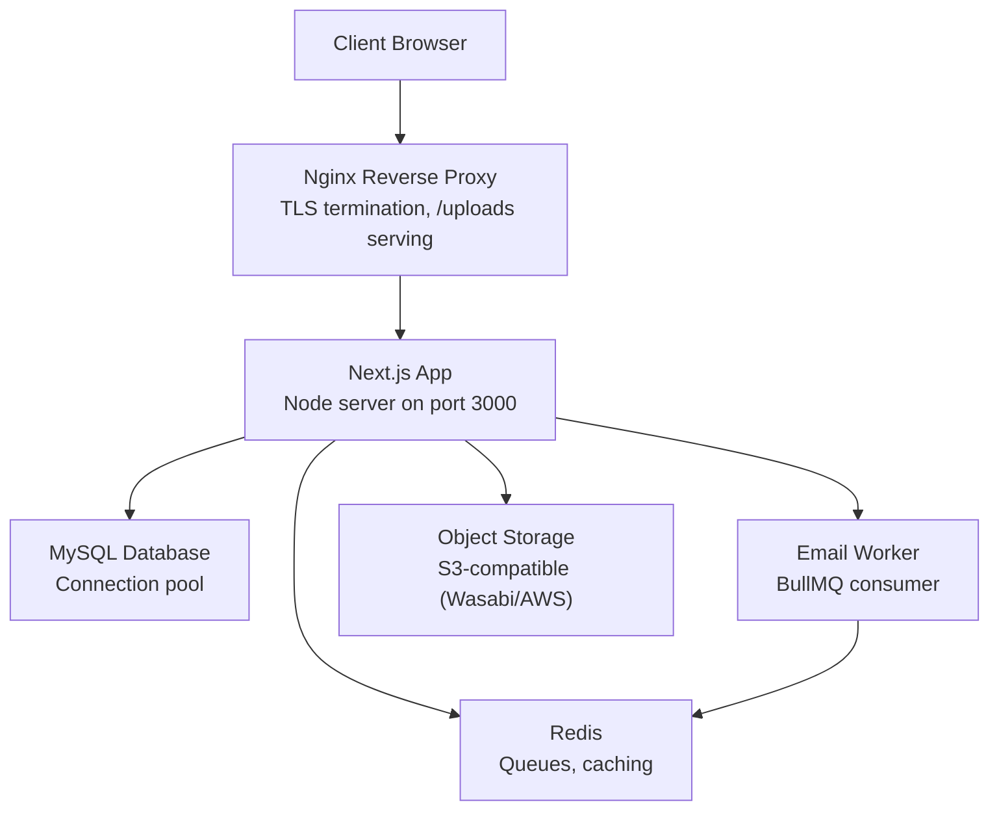
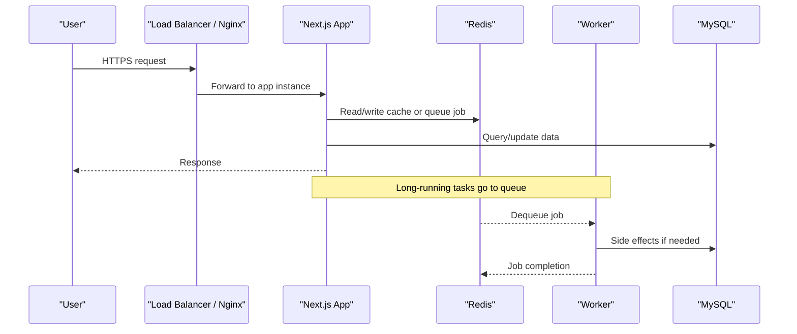
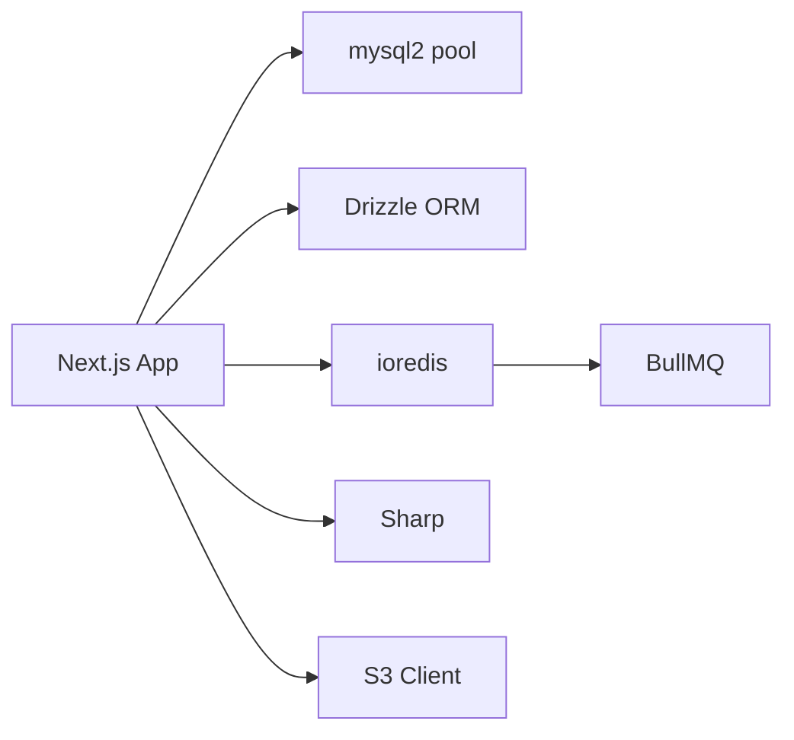

# Scaling & Performance Optimization

<cite>
**Referenced Files in This Document**
- [docker-compose.yml](file://docker-compose.yml)
- [Dockerfile](file://Dockerfile)
- [next.config.ts](file://next.config.ts)
- [lib/redis.ts](file://lib/redis.ts)
- [lib/db/index.ts](file://lib/db/index.ts)
- [nginx_full_remote.conf](file://nginx_full_remote.conf)
- [app/api/health/route.ts](file://app/api/health/route.ts)
- [workers/email-worker.ts](file://workers/email-worker.ts)
- [package.json](file://package.json)
- [DEPLOYMENT_GUIDE_SERVER.md](file://DEPLOYMENT_GUIDE_SERVER.md)
</cite>

## Table of Contents
1. Introduction
2. Project Structure
3. Core Components
4. Architecture Overview
5. Detailed Component Analysis
6. Dependency Analysis
7. Performance Considerations
8. Troubleshooting Guide
9. Conclusion

## Introduction
This document provides comprehensive guidance for horizontally scaling and optimizing the TMC Portal for high-traffic scenarios. It covers load balancing, session management, stateless application design, database scaling with read replicas and connection pooling, caching strategies using Redis, CDN configuration for static assets and images, performance monitoring, auto-scaling, capacity planning, load testing, and benchmarking best practices.

## Project Structure
The TMC Portal is a Next.js application deployed as a standalone server inside Docker, backed by MySQL (via Drizzle ORM), Redis for queues and caching, and served through Nginx. A dedicated email worker processes background jobs via BullMQ. Static uploads are served directly by Nginx to reduce application load.

**Diagram sources**
- [nginx_full_remote.conf:129-165](file://nginx_full_remote.conf#L129-L165)
- [docker-compose.yml:3-35](file://docker-compose.yml#L3-L35)
- [docker-compose.yml:37-52](file://docker-compose.yml#L37-L52)
- [docker-compose.yml:54-61](file://docker-compose.yml#L54-L61)
- [lib/db/index.ts:1-16](file://lib/db/index.ts#L1-L16)
- [lib/redis.ts:1-9](file://lib/redis.ts#L1-L9)
- [next.config.ts:20-36](file://next.config.ts#L20-L36)

**Section sources**
- [docker-compose.yml:3-69](file://docker-compose.yml#L3-L69)
- [Dockerfile:1-95](file://Dockerfile#L1-L95)
- [next.config.ts:1-41](file://next.config.ts#L1-L41)
- [nginx_full_remote.conf:129-165](file://nginx_full_remote.conf#L129-L165)

## Core Components
- Application runtime: Next.js standalone server built and run via Docker.
- Reverse proxy: Nginx terminates TLS, proxies requests, and serves uploads directly.
- Data layer: Drizzle ORM over mysql2 with a connection pool.
- Caching and queues: Redis via ioredis; BullMQ workers for background tasks.
- Object storage: S3-compatible client for image/file uploads with optional compression.
- Health endpoint: Lightweight route used for container health checks.

**Section sources**
- [Dockerfile:45-95](file://Dockerfile#L45-L95)
- [nginx_full_remote.conf:129-165](file://nginx_full_remote.conf#L129-L165)
- [lib/db/index.ts:1-16](file://lib/db/index.ts#L1-L16)
- [lib/redis.ts:1-9](file://lib/redis.ts#L1-L9)
- [lib/storage.ts:1-63](file://lib/storage.ts#L1-L63)
- [app/api/health/route.ts:1-6](file://app/api/health/route.ts#L1-L6)

## Architecture Overview
Horizontal scaling is enabled by running multiple stateless Next.js instances behind a reverse proxy or load balancer. Shared state is externalized to Redis and the database. Background work is offloaded to independent workers.

**Diagram sources**
- [nginx_full_remote.conf:129-165](file://nginx_full_remote.conf#L129-L165)
- [docker-compose.yml:3-35](file://docker-compose.yml#L3-L35)
- [docker-compose.yml:37-52](file://docker-compose.yml#L37-L52)
- [lib/redis.ts:1-9](file://lib/redis.ts#L1-L9)
- [lib/db/index.ts:1-16](file://lib/db/index.ts#L1-L16)

## Detailed Component Analysis

### Horizontal Scaling Strategy
- Stateless app design: The Next.js app runs as a standalone Node server without in-process state. All shared state is stored in Redis or the database.
- Load distribution: Use a reverse proxy (Nginx) or an external load balancer to distribute traffic across multiple app instances.
- Containerization: Each instance runs in a Docker container with consistent environment variables and dependencies.

Implementation anchors:
- Standalone build and runtime: [Dockerfile:45-95](file://Dockerfile#L45-L95)
- External Redis dependency: [docker-compose.yml:16-35](file://docker-compose.yml#L16-L35), [lib/redis.ts:1-9](file://lib/redis.ts#L1-L9)
- Nginx proxy pass to app: [nginx_full_remote.conf:129-165](file://nginx_full_remote.conf#L129-L165)

Best practices:
- Run multiple containers per host or across hosts and place them behind a load balancer.
- Ensure sticky sessions are not required; if needed, use Redis-backed sessions.
- Scale workers independently from the app tier.

**Section sources**
- [Dockerfile:45-95](file://Dockerfile#L45-L95)
- [docker-compose.yml:3-35](file://docker-compose.yml#L3-L35)
- [lib/redis.ts:1-9](file://lib/redis.ts#L1-L9)
- [nginx_full_remote.conf:129-165](file://nginx_full_remote.conf#L129-L165)

### Session Management
- Server-side sessions: NextAuth v5 uses an async auth() function; ensure it is awaited in server contexts.
- Statelessness: Store session data in Redis to support horizontal scaling and multi-instance deployments.
- Cookie and domain settings: Configure secure cookies and domains appropriate for your deployment.

Implementation anchors:
- Session helper usage: [lib/session.ts:1-16](file://lib/session.ts#L1-L16)
- Redis connection for queues/caching: [lib/redis.ts:1-9](file://lib/redis.ts#L1-L9)

Operational notes:
- Validate that session store is externalized when running multiple app instances.
- Rotate secrets and manage token lifetimes securely.

**Section sources**
- [lib/session.ts:1-16](file://lib/session.ts#L1-L16)
- [lib/redis.ts:1-9](file://lib/redis.ts#L1-L9)

### Database Scaling
- Connection pooling: The data layer uses mysql2’s connection pool to efficiently reuse connections under load.
- Read replicas: For read-heavy workloads, consider routing read queries to replicas while writes go to the primary.
- Query optimization: Index frequently filtered columns, avoid N+1 queries, and paginate large result sets.

Implementation anchors:
- Pool creation and Drizzle integration: [lib/db/index.ts:1-16](file://lib/db/index.ts#L1-L16)

Recommendations:
- Monitor pool utilization and adjust pool size based on CPU and memory headroom.
- Use EXPLAIN on slow queries and add targeted indexes.
- Partition or archive historical data where applicable.

**Section sources**
- [lib/db/index.ts:1-16](file://lib/db/index.ts#L1-L16)

### Caching Strategy with Redis
- Queues: BullMQ uses a shared Redis connection for reliable job processing.
- Cache layers: Use Redis for API response caching, rate limiting, feature flags, and short-lived session stores.
- TTLs and invalidation: Set appropriate expiration times and implement cache invalidation on writes.

Implementation anchors:
- Redis connection for BullMQ: [lib/redis.ts:1-9](file://lib/redis.ts#L1-L9)
- Worker consuming from Redis: [workers/email-worker.ts:1-32](file://workers/email-worker.ts#L1-L32)

Guidance:
- Separate caches by feature and namespace keys to avoid collisions.
- Monitor hit rates and memory usage; tune eviction policies as needed.

**Section sources**
- [lib/redis.ts:1-9](file://lib/redis.ts#L1-L9)
- [workers/email-worker.ts:1-32](file://workers/email-worker.ts#L1-L32)

### CDN and Static Assets
- Direct upload serving: Nginx serves uploaded files directly with long cache headers, bypassing the app server.
- Image handling: The app compresses images before upload to object storage; configure CDN to cache optimized assets.
- Remote images: Next.js remotePatterns allow serving images from approved origins.

Implementation anchors:
- Nginx /uploads alias with caching: [nginx_full_remote.conf:137-142](file://nginx_full_remote.conf#L137-L142)
- Next.js image remote patterns and unoptimized mode: [next.config.ts:20-36](file://next.config.ts#L20-L36)
- Upload pipeline with compression: [lib/storage.ts:25-63](file://lib/storage.ts#L25-L63)

Recommendations:
- Place a CDN in front of Nginx to cache static assets and images globally.
- Enable gzip/brotli at the edge and enforce modern image formats.

**Section sources**
- [nginx_full_remote.conf:137-142](file://nginx_full_remote.conf#L137-L142)
- [next.config.ts:20-36](file://next.config.ts#L20-L36)
- [lib/storage.ts:25-63](file://lib/storage.ts#L25-L63)

### Background Jobs and Workers
- Decoupled processing: Email sending and other heavy tasks are queued and processed by dedicated workers.
- Resilience: Workers connect to Redis and handle retries/failures gracefully.

Implementation anchors:
- Worker definition and graceful shutdown: [workers/email-worker.ts:1-32](file://workers/email-worker.ts#L1-L32)
- Redis connection for BullMQ: [lib/redis.ts:1-9](file://lib/redis.ts#L1-L9)

Scaling tips:
- Scale worker count based on queue depth and SLAs.
- Monitor job latency and error rates; alert on failures.

**Section sources**
- [workers/email-worker.ts:1-32](file://workers/email-worker.ts#L1-L32)
- [lib/redis.ts:1-9](file://lib/redis.ts#L1-L9)

### Health Checks and Observability
- Health endpoint: A minimal route returns status for readiness/liveness probes.
- Container health check: Docker Compose uses the health route to monitor service availability.

Implementation anchors:
- Health route: [app/api/health/route.ts:1-6](file://app/api/health/route.ts#L1-L6)
- Compose healthcheck: [docker-compose.yml:31-35](file://docker-compose.yml#L31-L35)

Monitoring recommendations:
- Instrument APM metrics around DB calls, Redis operations, and external APIs.
- Track p95/p99 latencies and error rates per route.

**Section sources**
- [app/api/health/route.ts:1-6](file://app/api/health/route.ts#L1-L6)
- [docker-compose.yml:31-35](file://docker-compose.yml#L31-L35)

## Dependency Analysis
Key runtime dependencies relevant to scaling and performance:
- Next.js server runtime and standalone output for efficient deployment.
- mysql2 connection pooling via Drizzle ORM.
- ioredis for Redis connectivity and BullMQ for job queues.
- Sharp for image compression during uploads.

**Diagram sources**
- [package.json:17-102](file://package.json#L17-L102)
- [lib/db/index.ts:1-16](file://lib/db/index.ts#L1-L16)
- [lib/redis.ts:1-9](file://lib/redis.ts#L1-L9)
- [lib/storage.ts:1-63](file://lib/storage.ts#L1-L63)

**Section sources**
- [package.json:17-102](file://package.json#L17-L102)
- [lib/db/index.ts:1-16](file://lib/db/index.ts#L1-L16)
- [lib/redis.ts:1-9](file://lib/redis.ts#L1-L9)
- [lib/storage.ts:1-63](file://lib/storage.ts#L1-L63)

## Performance Considerations
- Stateless architecture: Keep app instances stateless; externalize sessions and caches to Redis.
- Connection pools: Tune mysql2 pool size based on workload and available resources; monitor saturation.
- Caching: Cache expensive queries and API responses in Redis with appropriate TTLs; invalidate on writes.
- Static assets: Serve uploads via Nginx with long cache headers; use a CDN for global distribution.
- Image optimization: Compress images server-side before upload; leverage CDN caching for optimal formats.
- Background jobs: Offload heavy work to workers; scale workers independently.
- Monitoring: Add APM instrumentation for DB, Redis, and external services; track slow endpoints and queries.
- Auto-scaling: Use container orchestrators or cloud autoscaling groups to scale app and worker tiers based on CPU, memory, and queue depth.
- Capacity planning: Model peak traffic, measure baseline throughput, and plan headroom for spikes.

[No sources needed since this section provides general guidance]

## Troubleshooting Guide
Common issues and diagnostics:
- Health checks failing: Verify the health endpoint responds and the container command executes migrations before starting the server.
  - Reference: [app/api/health/route.ts:1-6](file://app/api/health/route.ts#L1-L6), [docker-compose.yml:21-35](file://docker-compose.yml#L21-L35)
- Redis connectivity errors: Confirm REDIS_URL and network reachability between app and Redis.
  - Reference: [lib/redis.ts:1-9](file://lib/redis.ts#L1-L9), [docker-compose.yml:16-35](file://docker-compose.yml#L16-L35)
- Database connection issues: Validate DATABASE_URL and pool configuration; ensure network access to MySQL.
  - Reference: [lib/db/index.ts:1-16](file://lib/db/index.ts#L1-L16), [DEPLOYMENT_GUIDE_SERVER.md:43-46](file://DEPLOYMENT_GUIDE_SERVER.md#L43-L46)
- Upload bottlenecks: Ensure Nginx serves /uploads directly and CDN caches are effective.
  - Reference: [nginx_full_remote.conf:137-142](file://nginx_full_remote.conf#L137-L142)
- Worker stalls: Check Redis queue depth and worker logs; scale workers as needed.
  - Reference: [workers/email-worker.ts:1-32](file://workers/email-worker.ts#L1-L32)

**Section sources**
- [app/api/health/route.ts:1-6](file://app/api/health/route.ts#L1-L6)
- [docker-compose.yml:21-35](file://docker-compose.yml#L21-L35)
- [lib/redis.ts:1-9](file://lib/redis.ts#L1-L9)
- [lib/db/index.ts:1-16](file://lib/db/index.ts#L1-L16)
- [DEPLOYMENT_GUIDE_SERVER.md:43-46](file://DEPLOYMENT_GUIDE_SERVER.md#L43-L46)
- [nginx_full_remote.conf:137-142](file://nginx_full_remote.conf#L137-L142)
- [workers/email-worker.ts:1-32](file://workers/email-worker.ts#L1-L32)

## Conclusion
By designing the TMC Portal as a stateless application, externalizing state to Redis and MySQL, leveraging Nginx for static asset delivery, and offloading heavy work to workers, you can scale horizontally with confidence. Combine these foundations with robust monitoring, caching, CDN usage, and disciplined capacity planning to sustain high-traffic performance and reliability.

[No sources needed since this section summarizes without analyzing specific files]