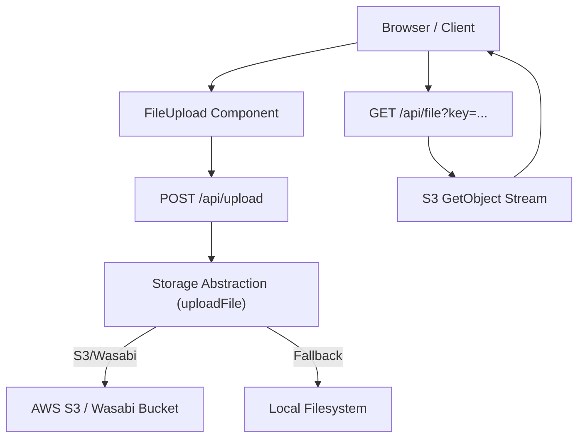
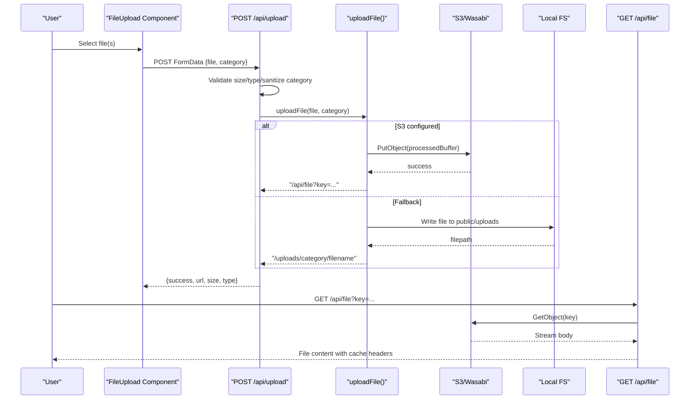
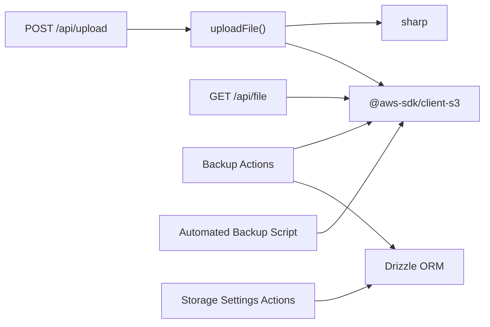
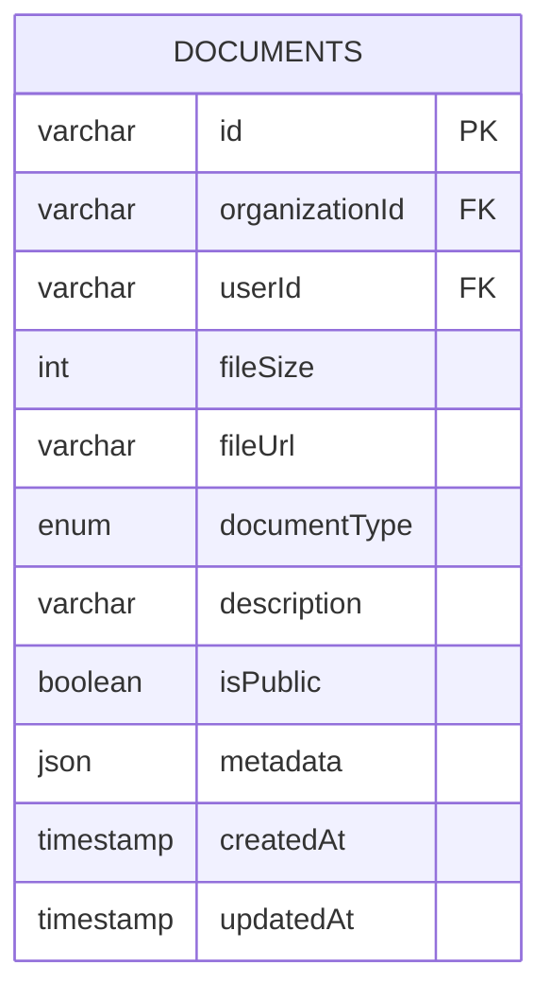
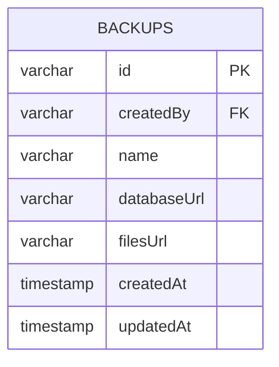

# File Management

<cite>
**Referenced Files in This Document**
- [storage.ts](file://lib/storage.ts)
- [route.ts (upload)](file://app/api/upload/route.ts)
- [route.ts (file)](file://app/api/file/route.ts)
- [file-upload.tsx](file://components/ui/file-upload.tsx)
- [schema.ts](file://lib/db/schema.ts)
- [backup.ts](file://lib/actions/backup.ts)
- [automated-backup.ts](file://scripts/automated-backup.ts)
- [check-s3.ts](file://scripts/check-s3.ts)
- [settings.ts](file://lib/actions/settings.ts)
- [storage-settings-card.tsx](file://components/admin/settings/storage-settings-card.tsx)
</cite>

## Table of Contents
1. [Introduction](#introduction)
2. [Project Structure](#project-structure)
3. [Core Components](#core-components)
4. [Architecture Overview](#architecture-overview)
5. [Detailed Component Analysis](#detailed-component-analysis)
6. [Dependency Analysis](#dependency-analysis)
7. [Performance Considerations](#performance-considerations)
8. [Troubleshooting Guide](#troubleshooting-guide)
9. [Conclusion](#conclusion)
10. [Appendices](#appendices)

## Introduction
This document explains the TMC Portal file management system with a focus on secure upload, storage abstraction, retrieval, processing, and operational concerns such as backups, retention, and performance. The system provides:
- A unified upload API that validates files and routes them to cloud or local storage
- A storage abstraction layer supporting AWS S3-compatible backends (including Wasabi) and local filesystem fallback
- Image optimization during upload using server-side image processing
- A secure proxy endpoint for retrieving stored files from private buckets
- Administrative backup workflows and automated retention policies
- Configuration UI for storage settings

## Project Structure
The file management functionality spans several layers:
- Frontend component for selecting and uploading files
- Server API route for validation and orchestration
- Storage abstraction for backend selection and processing
- Retrieval API for streaming files securely
- Database schema for metadata and backups
- Admin actions and scripts for backups and retention

**Diagram sources**
- [file-upload.tsx:22-107](file://components/ui/file-upload.tsx#L22-L107)
- [route.ts (upload):4-65](file://app/api/upload/route.ts#L4-L65)
- [storage.ts:25-99](file://lib/storage.ts#L25-L99)
- [route.ts (file):22-60](file://app/api/file/route.ts#L22-L60)

**Section sources**
- [file-upload.tsx:22-107](file://components/ui/file-upload.tsx#L22-L107)
- [route.ts (upload):4-65](file://app/api/upload/route.ts#L4-L65)
- [storage.ts:25-99](file://lib/storage.ts#L25-L99)
- [route.ts (file):22-60](file://app/api/file/route.ts#L22-L60)

## Core Components
- Upload API: Validates incoming files (size, type), sanitizes category, and delegates to storage abstraction. Returns a URL suitable for retrieval.
- Storage Abstraction: Handles image compression, naming, and writes to either S3-compatible storage or local filesystem. Returns a stable URL pattern for retrieval.
- Retrieval API: Streams files from S3-compatible storage via a secure proxy endpoint with caching headers.
- Frontend Upload Component: Provides single/multiple uploads, client-side size checks, and user feedback.
- Backup Actions and Scripts: Create database and file backups, store them in S3-compatible storage, and enforce retention policies.
- Settings Integration: Allows administrators to configure storage endpoints and credentials through the admin UI.

**Section sources**
- [route.ts (upload):4-65](file://app/api/upload/route.ts#L4-L65)
- [storage.ts:25-99](file://lib/storage.ts#L25-L99)
- [route.ts (file):22-60](file://app/api/file/route.ts#L22-L60)
- [file-upload.tsx:22-107](file://components/ui/file-upload.tsx#L22-L107)
- [backup.ts:35-161](file://lib/actions/backup.ts#L35-L161)
- [automated-backup.ts:41-70](file://scripts/automated-backup.ts#L41-L70)
- [settings.ts:332-369](file://lib/actions/settings.ts#L332-L369)
- [storage-settings-card.tsx:12-30](file://components/admin/settings/storage-settings-card.tsx#L12-L30)

## Architecture Overview
The architecture separates concerns into clear layers:
- Presentation: React component handles user interactions and progress feedback.
- API Layer: Next.js routes validate inputs and coordinate operations.
- Storage Layer: Encapsulates backend differences and image processing.
- Data Layer: Stores metadata and backup records in the database.
- Operations: Admin actions and scripts manage lifecycle tasks like backups and cleanup.

**Diagram sources**
- [file-upload.tsx:37-107](file://components/ui/file-upload.tsx#L37-L107)
- [route.ts (upload):4-65](file://app/api/upload/route.ts#L4-L65)
- [storage.ts:25-99](file://lib/storage.ts#L25-L99)
- [route.ts (file):22-60](file://app/api/file/route.ts#L22-L60)

## Detailed Component Analysis

### Upload API (/api/upload)
Responsibilities:
- Parse form data and extract file and category
- Enforce maximum file size
- Validate MIME types and extensions against an allowlist
- Sanitize category to prevent directory traversal
- Delegate to storage abstraction and return structured response

Error handling:
- Returns 400 for missing file, oversized file, or disallowed type
- Returns 500 for unexpected errors during upload

**Section sources**
- [route.ts (upload):4-65](file://app/api/upload/route.ts#L4-L65)

### Storage Abstraction (uploadFile)
Responsibilities:
- Convert uploaded file to buffer
- Compress images to WebP with resizing and EXIF rotation when enabled
- Generate safe filenames with timestamps and sanitized names
- Choose backend: S3-compatible if configured; otherwise write locally
- Return a stable URL for retrieval

Processing logic highlights:
- Image compression is optional via environment flag
- Content type and extension are updated after conversion
- Category pathing supports subdirectories

**Section sources**
- [storage.ts:25-99](file://lib/storage.ts#L25-L99)

### Retrieval API (/api/file)
Responsibilities:
- Accept a key parameter and fetch the object from S3-compatible storage
- Stream the response to the client with appropriate content type
- Set long-lived cache headers for immutable assets

Error handling:
- Returns 400 if key is missing
- Returns 404 if object not found
- Returns 500 for configuration or internal errors

**Section sources**
- [route.ts (file):22-60](file://app/api/file/route.ts#L22-L60)

### Frontend Upload Component (FileUpload)
Responsibilities:
- Provide single or multiple file selection
- Enforce client-side size limits and show user feedback
- Build FormData with file and inferred category
- Send requests to upload API and handle responses
- Notify users of success or failure

Progress tracking:
- Uses loading state to indicate upload progress
- Displays toast notifications for outcomes

**Section sources**
- [file-upload.tsx:22-107](file://components/ui/file-upload.tsx#L22-L107)

### Backup Workflows and Retention
Responsibilities:
- Create database dumps and archive files, then upload to S3-compatible storage under a unique backup folder
- Record backup metadata in the database
- Delete old local backups based on retention policy
- Periodically clean up old cloud backups by age

Operational notes:
- Uses child process execution for database dump commands
- Cleans temporary directories after completion
- Supports listing and deleting backups via admin actions

**Section sources**
- [backup.ts:35-161](file://lib/actions/backup.ts#L35-L161)
- [automated-backup.ts:41-70](file://scripts/automated-backup.ts#L41-L70)

### Storage Settings Integration
Responsibilities:
- Provide a UI to view and update storage configuration values
- Persist settings to the database under integration category
- Surface errors and confirmations to users

**Section sources**
- [settings.ts:332-369](file://lib/actions/settings.ts#L332-L369)
- [storage-settings-card.tsx:12-30](file://components/admin/settings/storage-settings-card.tsx#L12-L30)

## Dependency Analysis
Key dependencies and relationships:
- Upload API depends on storage abstraction for backend-agnostic uploads
- Storage abstraction depends on S3 SDK and image processing library
- Retrieval API depends on S3 SDK to stream objects
- Backup actions depend on database ORM and S3 SDK
- Automated backup script depends on S3 SDK for listing and deletion
- Settings actions depend on database ORM to persist configuration

**Diagram sources**
- [route.ts (upload):4-65](file://app/api/upload/route.ts#L4-L65)
- [storage.ts:25-99](file://lib/storage.ts#L25-L99)
- [route.ts (file):22-60](file://app/api/file/route.ts#L22-L60)
- [backup.ts:35-161](file://lib/actions/backup.ts#L35-L161)
- [automated-backup.ts:41-70](file://scripts/automated-backup.ts#L41-L70)
- [settings.ts:332-369](file://lib/actions/settings.ts#L332-L369)

**Section sources**
- [route.ts (upload):4-65](file://app/api/upload/route.ts#L4-L65)
- [storage.ts:25-99](file://lib/storage.ts#L25-L99)
- [route.ts (file):22-60](file://app/api/file/route.ts#L22-L60)
- [backup.ts:35-161](file://lib/actions/backup.ts#L35-L161)
- [automated-backup.ts:41-70](file://scripts/automated-backup.ts#L41-L70)
- [settings.ts:332-369](file://lib/actions/settings.ts#L332-L369)

## Performance Considerations
- Image optimization reduces bandwidth and improves load times by converting to WebP and limiting dimensions
- Streaming retrieval avoids loading entire files into memory
- Long-lived cache headers enable CDN and browser caching for immutable assets
- Local filesystem fallback can be used for development or low-cost environments
- Consider enabling compression only for images and skipping for large media where appropriate

[No sources needed since this section provides general guidance]

## Troubleshooting Guide
Common issues and resolutions:
- Missing key parameter on retrieval: Ensure the key query parameter is provided and valid
- S3 not configured: Verify environment variables for region, bucket, access keys, and optional endpoint
- Upload failures: Check file size limits, allowed types/extensions, and network connectivity
- Compression errors: If image processing fails, original content is used; review logs for details
- Backup failures: Confirm database dump command availability and S3 credentials; check temporary directory permissions

Operational checks:
- Use the S3 check script to list objects and verify connectivity
- Review backup records and recent entries to ensure successful runs

**Section sources**
- [route.ts (file):22-60](file://app/api/file/route.ts#L22-L60)
- [storage.ts:25-99](file://lib/storage.ts#L25-L99)
- [check-s3.ts:1-12](file://scripts/check-s3.ts#L1-L12)
- [backup.ts:35-161](file://lib/actions/backup.ts#L35-L161)

## Conclusion
The TMC Portal file management system provides a robust, extensible foundation for secure uploads, efficient processing, and reliable retrieval. Its storage abstraction supports multiple backends, while administrative tools ensure data durability through backups and retention policies. For production deployments, integrate CDN caching at the retrieval endpoint and consider additional security controls such as signed URLs and virus scanning to meet stricter requirements.

[No sources needed since this section summarizes without analyzing specific files]

## Appendices

### Metadata Model for Documents
The documents table stores metadata associated with uploaded files, including identifiers, sizes, URLs, types, descriptions, visibility flags, and JSON metadata fields.

**Diagram sources**
- [schema.ts:1900-1953](file://lib/db/schema.ts#L1900-L1953)

**Section sources**
- [schema.ts:1900-1953](file://lib/db/schema.ts#L1900-L1953)

### Backup Model
Backups are tracked in the database with references to creators and timestamps.

**Diagram sources**
- [schema.ts:589-613](file://lib/db/schema.ts#L589-L613)

**Section sources**
- [schema.ts:589-613](file://lib/db/schema.ts#L589-L613)

### Example Workflows

#### Implementing File Uploads
- Use the FileUpload component to select one or more files
- Attach a category derived from file type or provide a custom category
- Handle the callback to receive the uploaded URL and proceed with your workflow

**Section sources**
- [file-upload.tsx:22-107](file://components/ui/file-upload.tsx#L22-L107)
- [route.ts (upload):4-65](file://app/api/upload/route.ts#L4-L65)

#### Retrieving Stored Files
- Construct a GET request to the retrieval endpoint with the key returned by the upload flow
- The server streams the file from storage with appropriate headers for caching

**Section sources**
- [route.ts (file):22-60](file://app/api/file/route.ts#L22-L60)

#### Managing File Metadata
- Store or associate metadata in the documents table alongside file URLs
- Use the isPublic flag and metadata JSON to control visibility and attach contextual information

**Section sources**
- [schema.ts:1900-1953](file://lib/db/schema.ts#L1900-L1953)

### Security, Sharing, and Access Controls
Current implementation:
- Files are stored in private buckets and accessed via a server-side proxy endpoint
- Public visibility can be controlled via metadata and application-level checks

Recommended enhancements:
- Implement signed URLs for time-limited access
- Add role-based checks before serving files
- Integrate virus scanning and content filtering prior to storage
- Apply download restrictions based on user roles or sharing permissions

[No sources needed since this section provides general guidance]

### Versioning, Backups, and Disaster Recovery
Versioning:
- Application-level versioning exists for related entities (e.g., meeting notes versions); similar patterns can be applied to files by maintaining versioned keys and metadata

Backups:
- Database and files are archived to S3-compatible storage with recorded metadata
- Automated scripts enforce retention policies for both local and cloud artifacts

Disaster recovery:
- Restore databases and files from backups using recorded URLs and standard procedures
- Validate integrity post-restore and reindex or regenerate thumbnails if necessary

**Section sources**
- [backup.ts:35-161](file://lib/actions/backup.ts#L35-L161)
- [automated-backup.ts:41-70](file://scripts/automated-backup.ts#L41-L70)

### CDN Integration
- Configure CDN to cache the retrieval endpoint with immutable cache headers for optimal performance
- Use origin shielding or edge caching rules to protect backend resources
- Invalidate caches selectively when replacing or updating critical assets

[No sources needed since this section provides general guidance]