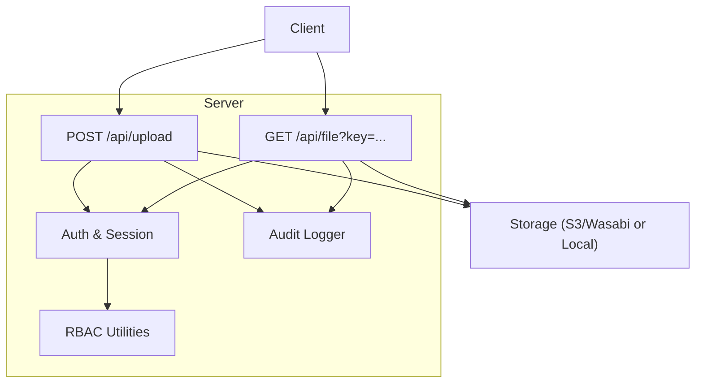
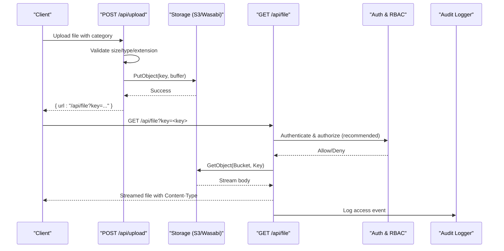
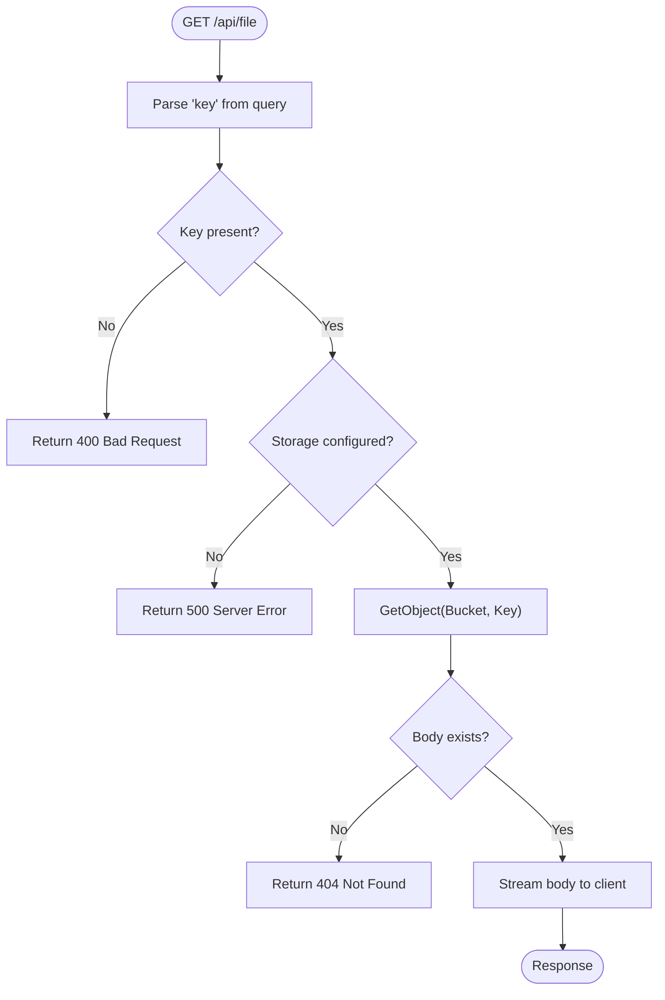
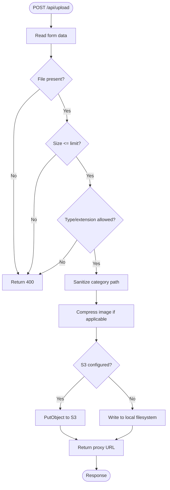
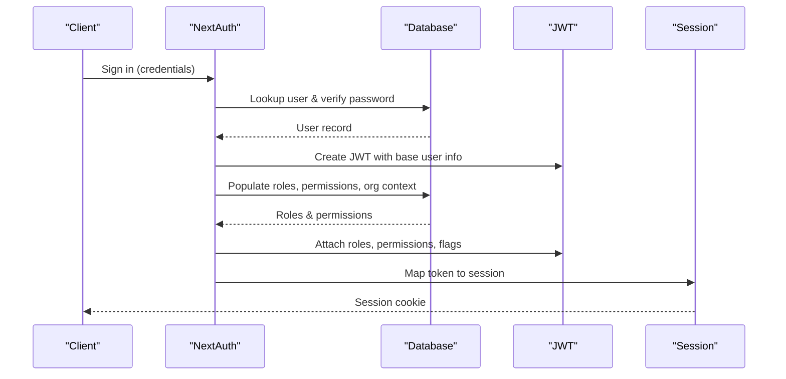
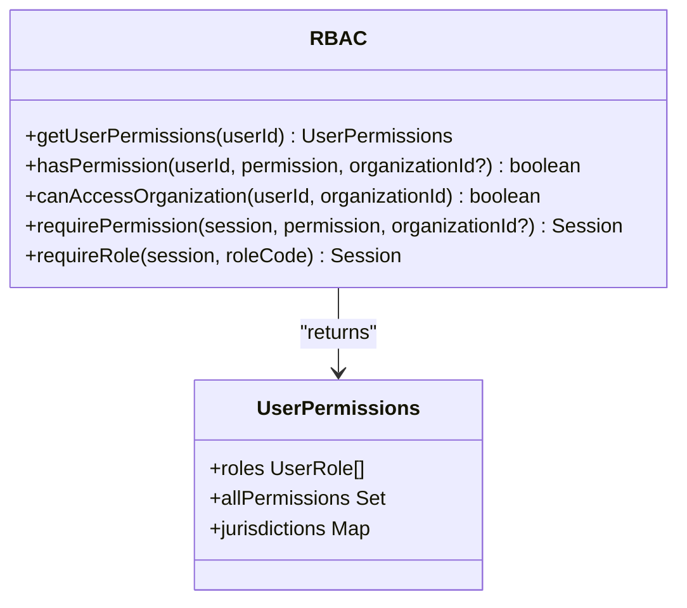
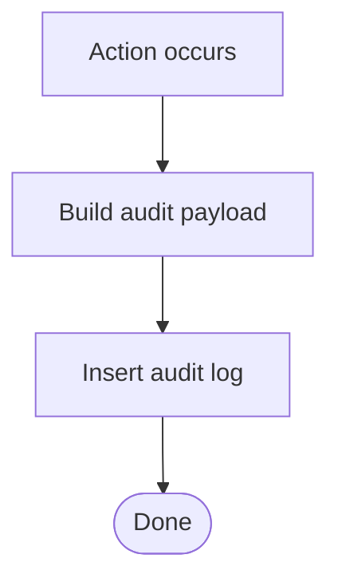
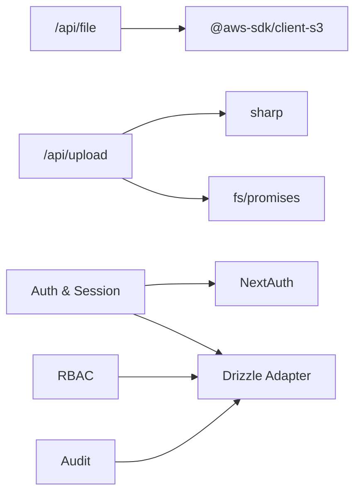

# File Security & Access Control

<cite>
**Referenced Files in This Document**
- [route.ts](file://app/api/file/route.ts)
- [storage.ts](file://lib/storage.ts)
- [auth.ts](file://lib/auth.ts)
- [rbac-v2.ts](file://lib/rbac-v2.ts)
- [audit.ts](file://lib/audit.ts)
- [route.ts](file://app/api/upload/route.ts)
- [session.ts](file://lib/session.ts)
- [auth.ts](file://auth.ts)
- [next.config.ts](file://next.config.ts)
</cite>

## Table of Contents
1. Introduction
2. Project Structure
3. Core Components
4. Architecture Overview
5. Detailed Component Analysis
6. Dependency Analysis
7. Performance Considerations
8. Troubleshooting Guide
9. Conclusion
10. Appendices

## Introduction
This document explains the TMC Portal’s file security and access control system with a focus on secure file serving through the /api/file endpoint, authentication and authorization checks, role-based and organization-scoped permissions, file sharing mechanisms, virus scanning integration points, content filtering, versioning considerations, access logging and audit trails, and web security measures such as CORS, CSRF, and XSS prevention. It provides actionable guidance for implementing custom access policies, integrating external scanners, and monitoring file access patterns.

## Project Structure
The file security surface is implemented across:
- A secure file streaming API that proxies private storage objects via a server-side endpoint.
- An upload handler that validates and sanitizes inputs before persisting to storage.
- Authentication and session utilities that populate roles, permissions, and organizational context into sessions.
- Role-based access control (RBAC) utilities for permission and jurisdiction checks.
- Audit logging utilities for recording actions and metadata.
- Next.js configuration for image remote sources and service worker behavior.

**Diagram sources**
- [route.ts:22-60](file://app/api/file/route.ts#L22-L60)
- [route.ts:4-65](file://app/api/upload/route.ts#L4-L65)
- [storage.ts:25-99](file://lib/storage.ts#L25-L99)
- [auth.ts:131-256](file://lib/auth.ts#L131-L256)
- [rbac-v2.ts:141-165](file://lib/rbac-v2.ts#L141-L165)
- [audit.ts:17-34](file://lib/audit.ts#L17-L34)

**Section sources**
- [route.ts:22-60](file://app/api/file/route.ts#L22-L60)
- [route.ts:4-65](file://app/api/upload/route.ts#L4-L65)
- [storage.ts:25-99](file://lib/storage.ts#L25-L99)
- [auth.ts:131-256](file://lib/auth.ts#L131-L256)
- [rbac-v2.ts:141-165](file://lib/rbac-v2.ts#L141-L165)
- [audit.ts:17-34](file://lib/audit.ts#L17-L34)

## Core Components
- Secure file streaming endpoint (/api/file): Proxies private storage objects using server credentials and streams content back to clients. Currently does not enforce per-request authentication or authorization; it trusts the key parameter.
- Upload endpoint (/api/upload): Validates file size, type, and extension; sanitizes category paths; compresses images; uploads to S3-compatible storage or local filesystem; returns a proxy URL for secure retrieval.
- Authentication and session: Centralized auth configuration populates user roles, permissions, membership, official roles, and jurisdictional context into JWT and session objects.
- RBAC utilities: Provide functions to check permissions and organization access based on roles and jurisdiction levels.
- Audit logger: Records actions with contextual metadata for compliance and forensics.

**Section sources**
- [route.ts:22-60](file://app/api/file/route.ts#L22-L60)
- [route.ts:4-65](file://app/api/upload/route.ts#L4-L65)
- [storage.ts:25-99](file://lib/storage.ts#L25-L99)
- [auth.ts:131-256](file://lib/auth.ts#L131-L256)
- [rbac-v2.ts:141-165](file://lib/rbac-v2.ts#L141-L165)
- [audit.ts:17-34](file://lib/audit.ts#L17-L34)

## Architecture Overview
The system uses a private storage model where files are stored in a secure bucket and served exclusively through a server-side proxy. The upload pipeline enforces input validation and optional image compression before storing files. Access to files is intended to be governed by authentication and authorization layers integrated into the file streaming endpoint.

**Diagram sources**
- [route.ts:4-65](file://app/api/upload/route.ts#L4-L65)
- [storage.ts:25-99](file://lib/storage.ts#L25-L99)
- [route.ts:22-60](file://app/api/file/route.ts#L22-L60)
- [auth.ts:131-256](file://lib/auth.ts#L131-L256)
- [rbac-v2.ts:141-165](file://lib/rbac-v2.ts#L141-L165)
- [audit.ts:17-34](file://lib/audit.ts#L17-L34)

## Detailed Component Analysis

### Secure File Streaming Endpoint (/api/file)
- Purpose: Streams files from a private storage bucket without exposing direct object URLs.
- Behavior: Reads a key query parameter, fetches the object from storage, converts the response body to a Web ReadableStream, and returns it with appropriate headers.
- Current gaps: No authentication or authorization checks are enforced at this endpoint; access is controlled solely by the key value. To secure it, integrate session-based checks and RBAC before fetching the object.

**Diagram sources**
- [route.ts:22-60](file://app/api/file/route.ts#L22-L60)

**Section sources**
- [route.ts:22-60](file://app/api/file/route.ts#L22-L60)

### Upload Handler (/api/upload)
- Purpose: Accepts file uploads, validates them, optionally compresses images, and stores them securely.
- Validation: Enforces maximum file size, allows specific MIME types and extensions, and sanitizes category paths to prevent directory traversal.
- Storage: Uses an S3-compatible client when configured; otherwise falls back to local filesystem under public/uploads. Returns a proxy URL for secure retrieval.
- Image processing: Compresses images to WebP with resizing and EXIF rotation unless disabled via environment flag.

**Diagram sources**
- [route.ts:4-65](file://app/api/upload/route.ts#L4-L65)
- [storage.ts:25-99](file://lib/storage.ts#L25-L99)

**Section sources**
- [route.ts:4-65](file://app/api/upload/route.ts#L4-L65)
- [storage.ts:25-99](file://lib/storage.ts#L25-L99)

### Authentication and Session
- JWT population: During sign-in, the system enriches the token with roles, permissions, membership, official roles, and jurisdictional information.
- Session propagation: The session callback attaches these fields to the session object for use in route handlers.
- Server session helper: Provides a NextAuth v5 compatible way to retrieve the current session in server contexts.

**Diagram sources**
- [auth.ts:131-256](file://lib/auth.ts#L131-L256)
- [session.ts:8-15](file://lib/session.ts#L8-L15)

**Section sources**
- [auth.ts:131-256](file://lib/auth.ts#L131-L256)
- [session.ts:8-15](file://lib/session.ts#L8-L15)

### Role-Based Access Control (RBAC)
- Permission checks: Functions determine whether a user has a required permission, optionally scoped to an organization.
- Organization access: Jurisdiction-aware checks ensure users can only access organizations within their hierarchy.
- Helpers: Require permission or role helpers throw errors when access is denied, suitable for middleware or route guards.

**Diagram sources**
- [rbac-v2.ts:47-136](file://lib/rbac-v2.ts#L47-L136)
- [rbac-v2.ts:141-165](file://lib/rbac-v2.ts#L141-L165)
- [rbac-v2.ts:170-213](file://lib/rbac-v2.ts#L170-L213)
- [rbac-v2.ts:313-358](file://lib/rbac-v2.ts#L313-L358)

**Section sources**
- [rbac-v2.ts:47-136](file://lib/rbac-v2.ts#L47-L136)
- [rbac-v2.ts:141-165](file://lib/rbac-v2.ts#L141-L165)
- [rbac-v2.ts:170-213](file://lib/rbac-v2.ts#L170-L213)
- [rbac-v2.ts:313-358](file://lib/rbac-v2.ts#L313-L358)

### Audit Logging
- Purpose: Record user actions with entity context, IP, user agent, and metadata for compliance and auditing.
- Usage: Integrate into upload and file access flows to capture who accessed what and when.

**Diagram sources**
- [audit.ts:17-34](file://lib/audit.ts#L17-L34)

**Section sources**
- [audit.ts:17-34](file://lib/audit.ts#L17-L34)

### Configuration and Remote Resources
- Next.js config: Declares allowed remote image hosts and disables optimization for images.
- Service Worker: Configured via Serwist for caching strategies; excludes certain routes.

**Section sources**
- [next.config.ts:11-39](file://next.config.ts#L11-L39)

## Dependency Analysis
- The file streaming endpoint depends on AWS SDK for S3 and environment variables for region, bucket, credentials, and endpoint.
- The upload handler depends on sharp for image processing and fs/promises for local fallback.
- Authentication relies on NextAuth with Drizzle adapter and database schema for users, roles, permissions, and organizations.
- RBAC utilities depend on Drizzle ORM queries to compute permissions and jurisdictional access.
- Audit logging depends on Drizzle ORM to persist logs.

**Diagram sources**
- [route.ts:22-60](file://app/api/file/route.ts#L22-L60)
- [route.ts:4-65](file://app/api/upload/route.ts#L4-L65)
- [storage.ts:25-99](file://lib/storage.ts#L25-L99)
- [auth.ts:131-256](file://lib/auth.ts#L131-L256)
- [rbac-v2.ts:47-136](file://lib/rbac-v2.ts#L47-L136)
- [audit.ts:17-34](file://lib/audit.ts#L17-L34)

**Section sources**
- [route.ts:22-60](file://app/api/file/route.ts#L22-L60)
- [route.ts:4-65](file://app/api/upload/route.ts#L4-L65)
- [storage.ts:25-99](file://lib/storage.ts#L25-L99)
- [auth.ts:131-256](file://lib/auth.ts#L131-L256)
- [rbac-v2.ts:47-136](file://lib/rbac-v2.ts#L47-L136)
- [audit.ts:17-34](file://lib/audit.ts#L17-L34)

## Performance Considerations
- Streaming: The file endpoint streams responses directly from storage to minimize memory usage.
- Image compression: Images are compressed to WebP with resizing to reduce bandwidth and improve load times. Compression can be skipped via environment configuration.
- Caching: The file endpoint sets long-lived cache headers; consider adjusting for sensitive content.
- Database queries: RBAC and audit operations perform joins and hierarchical lookups; ensure indexes exist for frequently queried fields.

[No sources needed since this section provides general guidance]

## Troubleshooting Guide
- Missing key parameter: The file endpoint returns a bad request error if the key is absent.
- Storage misconfiguration: If S3 credentials or bucket are missing, the endpoints return server errors.
- Upload failures: Invalid file types, oversized files, or storage write errors result in explicit error responses.
- Session issues: Use the provided server session helper to safely retrieve sessions in server contexts.

**Section sources**
- [route.ts:22-60](file://app/api/file/route.ts#L22-L60)
- [route.ts:4-65](file://app/api/upload/route.ts#L4-L65)
- [session.ts:8-15](file://lib/session.ts#L8-L15)

## Conclusion
The TMC Portal implements a secure-by-default file serving pattern by proxying private storage objects through a server endpoint and validating uploads before storage. Authentication and RBAC are well-defined but need to be explicitly integrated into the file streaming endpoint to enforce per-request authorization. Audit logging is available to support compliance and monitoring. For enhanced security, add authenticated access controls, temporary tokens for sharing, virus scanning, and stricter caching policies.

[No sources needed since this section summarizes without analyzing specific files]

## Appendices

### Implementing Custom Access Policies for /api/file
- Add session-based authentication to the file endpoint using the server session helper.
- Use RBAC helpers to require specific permissions or roles before retrieving the object.
- Scope access by organization using jurisdiction checks to ensure users can only access files belonging to their permitted scope.

**Section sources**
- [session.ts:8-15](file://lib/session.ts#L8-L15)
- [rbac-v2.ts:313-358](file://lib/rbac-v2.ts#L313-L358)
- [rbac-v2.ts:170-213](file://lib/rbac-v2.ts#L170-L213)

### Integrating External Virus Scanners
- Hook into the upload pipeline to scan files before storing them.
- Reject or quarantine files flagged as malicious; log results via the audit logger.
- Optionally re-scan on download for high-risk environments.

[No sources needed since this section provides general guidance]

### Temporary Access Tokens and Expiring URLs
- Generate short-lived tokens for file downloads using HMAC-based time-bound schemes similar to attendance tokens.
- Validate tokens on the file endpoint and revoke after use or expiration.
- Combine with RBAC to restrict token issuance to authorized scopes.

**Section sources**
- [attendance-token.ts:7-17](file://lib/attendance-token.ts#L7-L17)
- [attendance-token.ts:23-41](file://lib/attendance-token.ts#L23-L41)

### Download Restrictions and Content Filtering
- Enforce MIME type and extension allowlists during upload.
- Apply additional filters (e.g., block executable or script files) based on policy.
- Sanitize filenames and categories to prevent path traversal.

**Section sources**
- [route.ts:22-46](file://app/api/upload/route.ts#L22-L46)
- [route.ts:49-53](file://app/api/upload/route.ts#L49-L53)

### File Versioning Security
- Maintain version metadata alongside stored objects to track revisions.
- Restrict overwrites to authorized roles; log all version changes via audit logs.
- Ensure read access respects current version permissions.

[No sources needed since this section provides general guidance]

### Monitoring File Access Patterns
- Log file access events with user identity, IP, user agent, and resource identifiers.
- Aggregate logs to detect anomalies such as repeated failed attempts or unusual download volumes.
- Integrate with alerting systems for suspicious activity.

**Section sources**
- [audit.ts:17-34](file://lib/audit.ts#L17-L34)

### CORS, CSRF, and XSS Prevention
- CORS: Configure allowed origins and methods at the reverse proxy or application level to restrict cross-origin requests to trusted domains.
- CSRF: Use SameSite cookies and validate Origin/Referer headers for state-changing endpoints like uploads.
- XSS: Sanitize any user-supplied content rendered in the UI; leverage existing DOM sanitization libraries where applicable.

[No sources needed since this section provides general guidance]