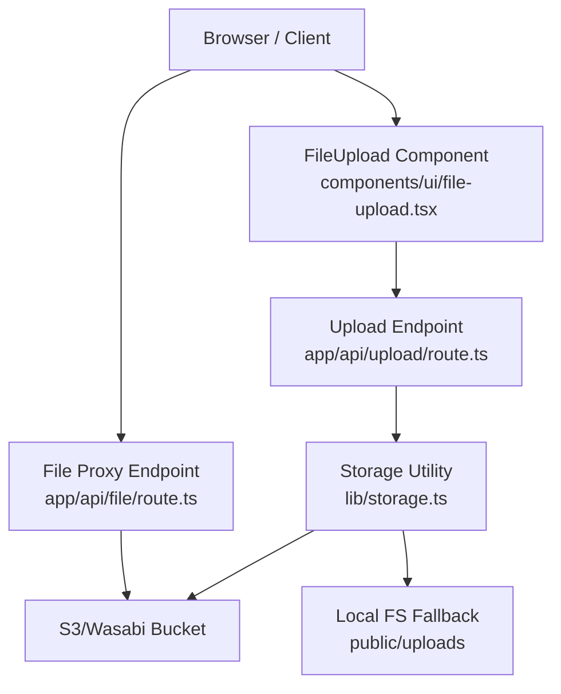
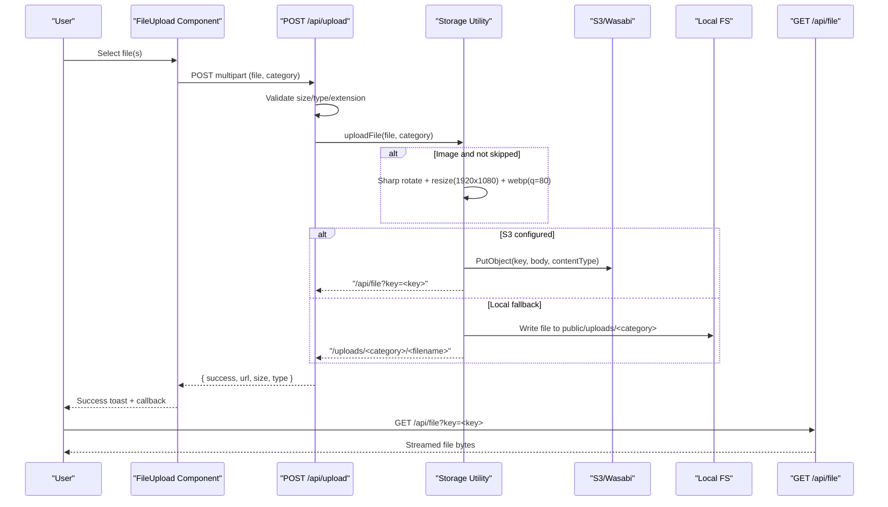
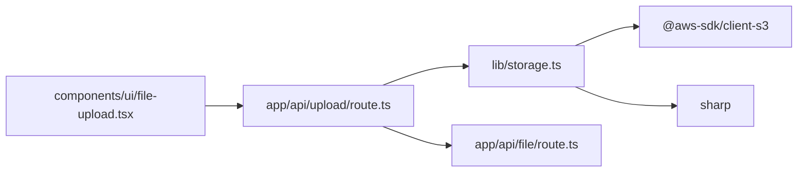

# File Upload & Processing

<cite>
**Referenced Files in This Document**
- [app/api/upload/route.ts](file://app/api/upload/route.ts)
- [lib/storage.ts](file://lib/storage.ts)
- [components/ui/file-upload.tsx](file://components/ui/file-upload.tsx)
- [app/api/file/route.ts](file://app/api/file/route.ts)
</cite>

## Table of Contents
1. [Introduction](#introduction)
2. [Project Structure](#project-structure)
3. [Core Components](#core-components)
4. [Architecture Overview](#architecture-overview)
5. [Detailed Component Analysis](#detailed-component-analysis)
6. [Dependency Analysis](#dependency-analysis)
7. [Performance Considerations](#performance-considerations)
8. [Troubleshooting Guide](#troubleshooting-guide)
9. [Conclusion](#conclusion)
10. [Appendices](#appendices)

## Introduction
This document explains the TMC Portal file upload and processing system, covering the end-to-end workflow from client-side selection to server-side validation, image compression with Sharp, storage to S3 or local fallback, and secure retrieval via a proxy endpoint. It also documents API contracts, error handling, and practical guidance for extending the system (e.g., custom handlers, large files, sessions).

## Project Structure
The upload feature is implemented as:
- A Next.js App Router POST endpoint that accepts multipart uploads, validates inputs, and delegates processing to a storage utility.
- A storage utility that compresses images using Sharp, generates safe filenames, and stores files to S3 (with a local proxy URL) or falls back to the local filesystem.
- A reusable React component that handles single/multiple uploads, basic client-side size checks, and user feedback.
- A GET proxy endpoint to stream stored files securely when S3 is configured.

**Diagram sources**
- [components/ui/file-upload.tsx:1-142](file://components/ui/file-upload.tsx#L1-L142)
- [app/api/upload/route.ts:1-66](file://app/api/upload/route.ts#L1-L66)
- [lib/storage.ts:1-100](file://lib/storage.ts#L1-L100)
- [app/api/file/route.ts:1-61](file://app/api/file/route.ts#L1-L61)

**Section sources**
- [components/ui/file-upload.tsx:1-142](file://components/ui/file-upload.tsx#L1-L142)
- [app/api/upload/route.ts:1-66](file://app/api/upload/route.ts#L1-L66)
- [lib/storage.ts:1-100](file://lib/storage.ts#L1-L100)
- [app/api/file/route.ts:1-61](file://app/api/file/route.ts#L1-L61)

## Core Components
- Client upload component: Handles file selection, optional multiple uploads, category detection, size gating, and calls the upload endpoint. Returns success/error UI via toast notifications.
- Upload API route: Parses FormData, enforces size limits, validates MIME types and extensions, sanitizes category, and invokes storage utility.
- Storage utility: Converts images to WebP at 1920x1080 max with quality 80 using Sharp; generates unique filenames; uploads to S3 (returns a proxy URL) or writes to local filesystem.
- File proxy endpoint: Streams files from S3 with appropriate headers and caching when S3 is configured.

Key behaviors:
- Image compression pipeline: EXIF-aware rotation, resize to fit within 1920x1080 without enlargement, convert to WebP at 80% quality.
- Storage modes:
  - S3 mode: Uses environment-configured credentials/endpoint; returns a proxied URL for secure access.
  - Local fallback: Writes to public/uploads/<category>/<filename>.
- Security: Allowed MIME types and extensions are enforced; category is sanitized to prevent directory traversal.

**Section sources**
- [components/ui/file-upload.tsx:22-107](file://components/ui/file-upload.tsx#L22-L107)
- [app/api/upload/route.ts:4-65](file://app/api/upload/route.ts#L4-L65)
- [lib/storage.ts:25-99](file://lib/storage.ts#L25-L99)
- [app/api/file/route.ts:22-60](file://app/api/file/route.ts#L22-L60)

## Architecture Overview
End-to-end flow for a typical upload:

**Diagram sources**
- [components/ui/file-upload.tsx:37-107](file://components/ui/file-upload.tsx#L37-L107)
- [app/api/upload/route.ts:4-65](file://app/api/upload/route.ts#L4-L65)
- [lib/storage.ts:25-99](file://lib/storage.ts#L25-L99)
- [app/api/file/route.ts:22-60](file://app/api/file/route.ts#L22-L60)

## Detailed Component Analysis

### Client Upload Component (FileUpload)
Responsibilities:
- Accepts single or multiple files with optional accept filter.
- Enforces maxSizeMB on the client side and filters out oversized files.
- Auto-detects category based on MIME type and appends it to FormData.
- Sends sequential uploads to the configured endpoint and aggregates results.
- Provides loading state and user feedback via toast notifications.

Error handling:
- Catches network or server errors and surfaces them to the user.
- Resets input value after completion to allow re-uploads.

Progress tracking:
- The component uses a simple loading indicator. For detailed progress, integrate XMLHttpRequest or fetch with streaming and update a progress bar accordingly.

Extensibility:
- Supports custom endpoint and accept attributes.
- Callbacks provide URLs and original files for further processing.

**Section sources**
- [components/ui/file-upload.tsx:9-107](file://components/ui/file-upload.tsx#L9-L107)

### Upload API Route (POST /api/upload)
Responsibilities:
- Parses multipart form data and extracts file and category.
- Validates file presence and size (max 50 MB).
- Validates MIME types and file extensions against an allowlist.
- Sanitizes category to prevent path traversal while allowing subdirectories.
- Delegates to storage utility and returns a JSON response with success status, URL, size, and type.

Error handling:
- Returns 400 for missing file, size exceeded, or disallowed type.
- Returns 500 for unexpected server errors.

Rate limiting and authentication:
- Not implemented in this route. Add middleware or per-route guards as needed.

**Section sources**
- [app/api/upload/route.ts:4-65](file://app/api/upload/route.ts#L4-L65)

### Storage Utility (Image Compression and Persistence)
Responsibilities:
- Reads file buffer and conditionally processes images:
  - Skips if environment flag indicates so.
  - Applies EXIF-based auto-rotation.
  - Resizes to fit within 1920x1080 without enlarging smaller images.
  - Converts to WebP at 80% quality.
- Generates a safe filename by stripping unsafe characters and prepending a timestamp.
- Persists to S3 when configured, returning a proxied URL; otherwise writes to local filesystem under public/uploads.

Security and robustness:
- Category is sanitized upstream; filename sanitization prevents injection.
- Graceful fallback on compression failure retains original content.

Environment configuration:
- S3 region, bucket, credentials, and optional endpoint are read from environment variables.

**Section sources**
- [lib/storage.ts:6-23](file://lib/storage.ts#L6-L23)
- [lib/storage.ts:25-99](file://lib/storage.ts#L25-L99)

### File Proxy Endpoint (GET /api/file)
Responsibilities:
- Retrieves a file from S3 by key and streams it back to the client.
- Sets Content-Type from S3 metadata and caches responses for long periods.

Error handling:
- Returns 400 if key is missing.
- Returns 500 if S3 is not configured or on internal errors.
- Returns 404 if file not found.

Use case:
- Enables serving files from private buckets through a controlled server-side proxy.

**Section sources**
- [app/api/file/route.ts:22-60](file://app/api/file/route.ts#L22-L60)

## Dependency Analysis
High-level dependencies:
- Next.js App Router routes depend on the storage utility for persistence and transformation.
- Storage utility depends on AWS SDK for S3 and Sharp for image processing.
- Client component depends on browser APIs (FormData, fetch) and UI primitives.

**Diagram sources**
- [components/ui/file-upload.tsx:1-142](file://components/ui/file-upload.tsx#L1-L142)
- [app/api/upload/route.ts:1-66](file://app/api/upload/route.ts#L1-L66)
- [lib/storage.ts:1-100](file://lib/storage.ts#L1-L100)
- [app/api/file/route.ts:1-61](file://app/api/file/route.ts#L1-L61)

**Section sources**
- [lib/storage.ts:1-100](file://lib/storage.ts#L1-L100)
- [package-lock.json:17595-17638](file://package-lock.json#L17595-L17638)

## Performance Considerations
- Image compression reduces bandwidth and improves rendering performance. Sharp operations run server-side to avoid client overhead.
- S3 mode centralizes storage and enables CDN-friendly caching via the proxy endpoint’s cache headers.
- Local fallback is suitable for development but may not scale; prefer S3 in production.
- Avoid unnecessary recompression by skipping SVG and honoring the skip-compression flag when needed.

[No sources needed since this section provides general guidance]

## Troubleshooting Guide
Common issues and resolutions:
- Upload rejected due to size: Ensure files are under 50 MB. Adjust limits if necessary.
- Disallowed file type: Confirm MIME type or extension is in the allowlist.
- Compression failures: Check Sharp availability and environment; compression failure falls back to original content.
- S3 upload errors: Verify environment variables (region, bucket, credentials, endpoint). If misconfigured, the system falls back to local storage.
- File not found on retrieval: Ensure the key matches the uploaded object and S3 is configured.

Operational tips:
- Log upload errors and compression outcomes for diagnostics.
- Monitor S3 connectivity and permissions.
- Use the proxy endpoint to serve files from private buckets.

**Section sources**
- [app/api/upload/route.ts:10-20](file://app/api/upload/route.ts#L10-L20)
- [app/api/upload/route.ts:22-46](file://app/api/upload/route.ts#L22-L46)
- [lib/storage.ts:35-56](file://lib/storage.ts#L35-L56)
- [lib/storage.ts:66-83](file://lib/storage.ts#L66-L83)
- [app/api/file/route.ts:27-59](file://app/api/file/route.ts#L27-L59)

## Conclusion
The TMC Portal upload system provides a secure, efficient pipeline for handling diverse file types with automatic image optimization and flexible storage backends. The design separates concerns across client, API, and storage layers, enabling easy extension for authentication, rate limiting, and advanced features like resumable uploads and background processing.

[No sources needed since this section summarizes without analyzing specific files]

## Appendices

### API Endpoints

- POST /api/upload
  - Purpose: Accept and process file uploads.
  - Request:
    - Content-Type: multipart/form-data
    - Fields:
      - file: binary file
      - category: string (e.g., images, audio, video, documents; sanitized server-side)
  - Response:
    - success: boolean
    - url: string (proxied or local path)
    - size: number (bytes)
    - type: string (MIME type)
  - Status codes:
    - 200: Success
    - 400: Missing file, size exceeded, or disallowed type
    - 500: Server error

- GET /api/file?key=<key>
  - Purpose: Stream a stored file from S3 securely.
  - Query parameters:
    - key: string (object key in S3)
  - Response: Binary stream with Content-Type from S3 metadata and long-lived cache headers.
  - Status codes:
    - 200: Success
    - 400: Missing key
    - 404: File not found
    - 500: S3 not configured or internal error

Authentication and authorization:
- Not enforced in these endpoints. Add middleware or route guards to require authentication and role-based permissions where appropriate.

Rate limiting:
- Not implemented. Integrate a rate limiter (e.g., per-IP or per-user) to protect endpoints from abuse.

**Section sources**
- [app/api/upload/route.ts:4-65](file://app/api/upload/route.ts#L4-L65)
- [app/api/file/route.ts:22-60](file://app/api/file/route.ts#L22-L60)

### Image Compression Details
- Library: Sharp
- Pipeline:
  - EXIF auto-rotate
  - Resize to fit within 1920x1080 without enlarging smaller images
  - Convert to WebP at 80% quality
- Skip behavior:
  - Controlled by environment variable to bypass compression when needed
- Output:
  - Content-Type set to image/webp for processed images
  - Extension updated to .webp

**Section sources**
- [lib/storage.ts:32-56](file://lib/storage.ts#L32-L56)

### Validation Rules
- Size limit: 50 MB maximum
- Allowed MIME types:
  - image/*, audio/*, video/*
  - application/pdf, text/plain, text/csv
  - Microsoft Office formats (Word, Excel, PowerPoint)
  - Archives: zip, rar
  - application/octet-stream
- Allowed extensions:
  - .pdf, .doc, .docx, .xls, .xlsx, .ppt, .pptx, .txt, .csv, .zip, .rar
- Category sanitization:
  - Only alphanumeric, underscore, hyphen, and slash allowed to prevent directory traversal

**Section sources**
- [app/api/upload/route.ts:16-50](file://app/api/upload/route.ts#L16-L50)

### Error Handling Strategies
- Client:
  - Show toast messages for success and errors
  - Reset input to allow retries
- Server:
  - Return descriptive error messages with appropriate HTTP status codes
  - Log errors for debugging
- Storage:
  - On compression failure, continue with original content
  - On S3 failure, throw an error that bubbles up to the API layer

**Section sources**
- [components/ui/file-upload.tsx:97-107](file://components/ui/file-upload.tsx#L97-L107)
- [app/api/upload/route.ts:61-65](file://app/api/upload/route.ts#L61-L65)
- [lib/storage.ts:51-56](file://lib/storage.ts#L51-L56)
- [lib/storage.ts:79-83](file://lib/storage.ts#L79-L83)

### Extending the System

Custom upload handlers:
- Create a new Next.js route following the pattern in the upload endpoint.
- Reuse the storage utility for consistent processing and persistence.

Large files:
- Implement chunked uploads with a session ID to track parts.
- Use the existing storage utility to assemble chunks into a final file.
- Provide progress updates via server events or polling.

Upload sessions:
- Maintain a server-side store (e.g., Redis) keyed by session ID.
- Track chunk index, total chunks, and metadata (original name, category).
- On completion, finalize and return the same response shape as the standard upload.

Retry mechanisms:
- On client errors, retry with exponential backoff.
- On server errors, surface actionable messages and allow manual retry.

Browser compatibility:
- Uses standard FormData and fetch; compatible with modern browsers.
- For older browsers, consider polyfills for fetch and Blob.

Mobile considerations:
- Respect device constraints (camera capture, file picker).
- Consider pre-processing on-device for very large images to reduce upload time.

Offline capabilities:
- Queue uploads locally using IndexedDB or localStorage.
- Sync when online by replaying queued requests to the upload endpoint.

[No sources needed since this section provides general guidance]