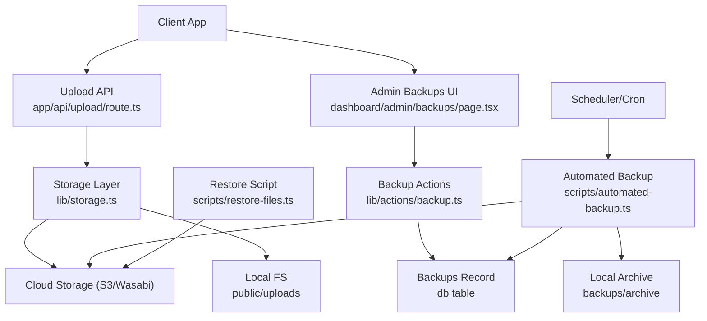
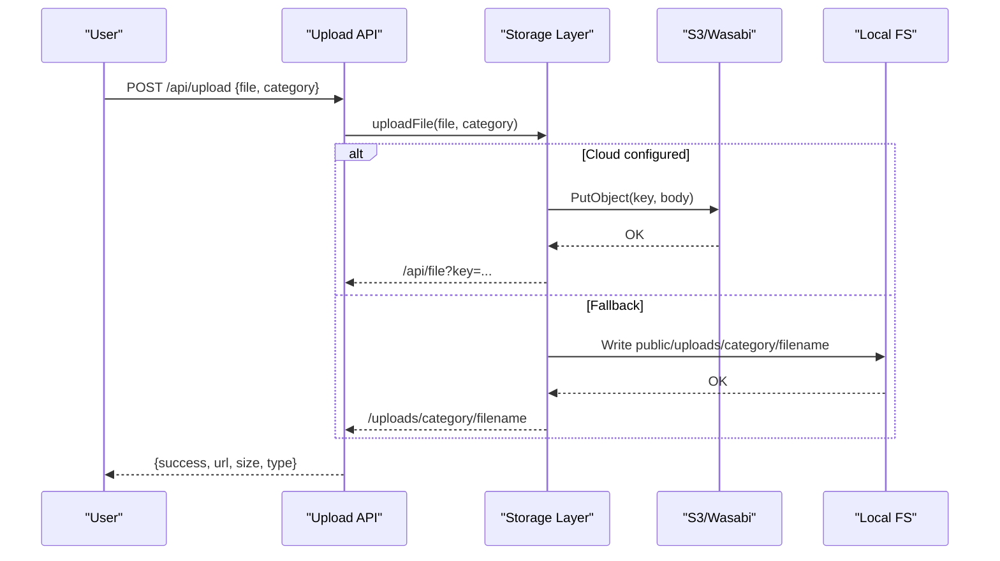
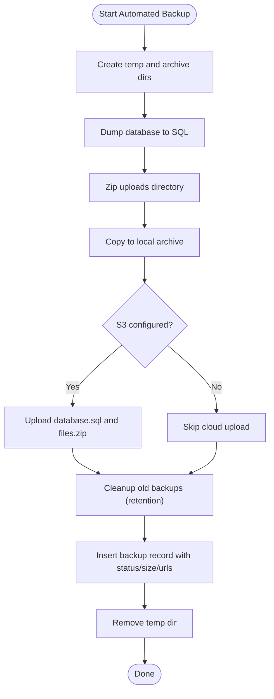
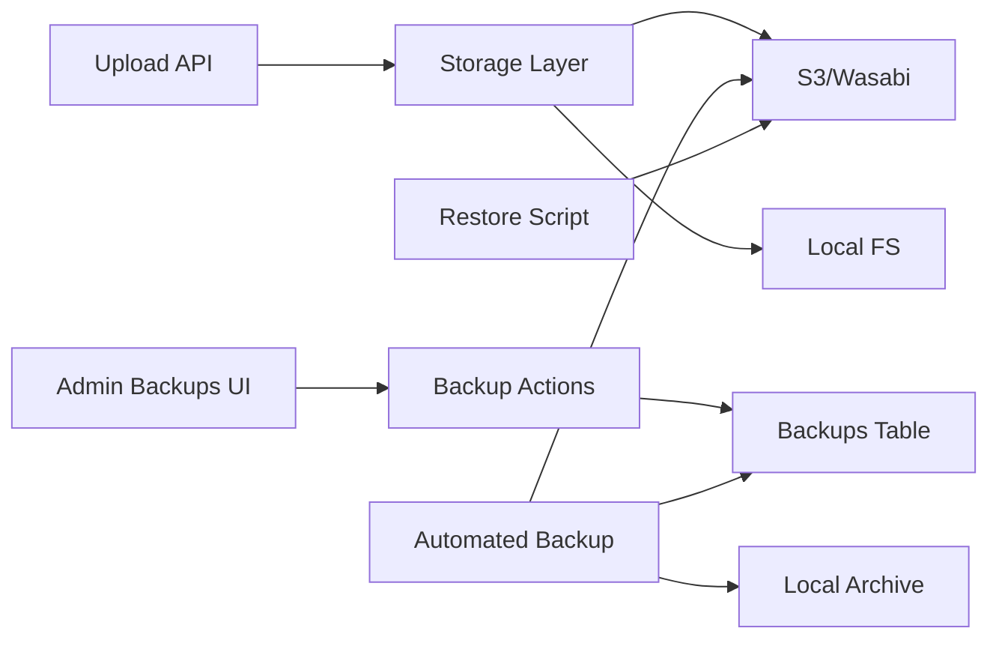

# File Versioning & Backup

<cite>
**Referenced Files in This Document**
- [automated-backup.ts](file://scripts/automated-backup.ts)
- [backup-db-tables.ts](file://scripts/backup-db-tables.ts)
- [restore-files.ts](file://scripts/restore-files.ts)
- [check-backups.ts](file://scripts/check-backups.ts)
- [create-backups-table.ts](file://scripts/create-backups-table.ts)
- [storage.ts](file://lib/storage.ts)
- [upload route](file://app/api/upload/route.ts)
- [file proxy route](file://app/api/file/route.ts)
- [backup actions](file://lib/actions/backup.ts)
- [backups page](file://app/dashboard/admin/backups/page.tsx)
- [schema (backups table)](file://drizzle/meta/0002_snapshot.json)
</cite>

## Table of Contents
1. Introduction
2. Project Structure
3. Core Components
4. Architecture Overview
5. Detailed Component Analysis
6. Dependency Analysis
7. Performance Considerations
8. Troubleshooting Guide
9. Conclusion
10. Appendices

## Introduction
This document explains the TMC Portal’s file versioning and backup system, including how uploads are stored with unique identifiers, how full backups are created and retained, and how to restore data. It covers automated and manual backup flows, retention policies, storage options (local and cloud), monitoring, verification, and recovery procedures. Where applicable, it also outlines best practices for encryption, integrity checks, cross-region replication, scheduling, rotation, cost optimization, compliance, and archival strategies.

## Project Structure
The backup and versioning features span several areas:
- Upload handling and storage abstraction
- Automated and manual backup scripts
- Cloud storage integration (S3-compatible)
- Admin UI for backup management
- Database schema for backup records
- Restore utilities

**Diagram sources**
- [upload route:1-66](file://app/api/upload/route.ts#L1-L66)
- [storage.ts:25-99](file://lib/storage.ts#L25-L99)
- [backup actions:1-161](file://lib/actions/backup.ts#L1-L161)
- [automated-backup.ts:86-202](file://scripts/automated-backup.ts#L86-L202)
- [restore-files.ts:14-29](file://scripts/restore-files.ts#L14-L29)
- [backups page:30-73](file://app/dashboard/admin/backups/page.tsx#L30-L73)

**Section sources**
- [upload route:1-66](file://app/api/upload/route.ts#L1-L66)
- [storage.ts:25-99](file://lib/storage.ts#L25-L99)
- [backup actions:1-161](file://lib/actions/backup.ts#L1-L161)
- [automated-backup.ts:86-202](file://scripts/automated-backup.ts#L86-L202)
- [restore-files.ts:14-29](file://scripts/restore-files.ts#L14-L29)
- [backups page:30-73](file://app/dashboard/admin/backups/page.tsx#L30-L73)

## Core Components
- File upload and storage: Accepts files, validates types/sizes, compresses images, writes to local or S3, returns a stable URL or proxy link.
- Automated backups: Dumps database, zips uploads, persists locally and optionally to cloud, enforces retention, records metadata.
- Manual backups: Server action to trigger on-demand backups via admin UI.
- Backup registry: Tracks backup identity, type, size, status, and URLs.
- Restore utilities: Download specific backups from cloud for recovery.

Key implementation references:
- Upload flow: [upload route:1-66](file://app/api/upload/route.ts#L1-L66), [storage.ts:25-99](file://lib/storage.ts#L25-L99)
- Automated backup: [automated-backup.ts:86-202](file://scripts/automated-backup.ts#L86-L202)
- Manual backup: [backup actions:1-161](file://lib/actions/backup.ts#L1-L161)
- Backup records: [create-backups-table.ts:1-27](file://scripts/create-backups-table.ts#L1-L27), [schema (backups table):611-661](file://drizzle/meta/0002_snapshot.json#L611-L661)
- Restore: [restore-files.ts:14-29](file://scripts/restore-files.ts#L14-L29)

**Section sources**
- [upload route:1-66](file://app/api/upload/route.ts#L1-L66)
- [storage.ts:25-99](file://lib/storage.ts#L25-L99)
- [automated-backup.ts:86-202](file://scripts/automated-backup.ts#L86-L202)
- [backup actions:1-161](file://lib/actions/backup.ts#L1-L161)
- [create-backups-table.ts:1-27](file://scripts/create-backups-table.ts#L1-L27)
- [schema (backups table):611-661](file://drizzle/meta/0002_snapshot.json#L611-L661)
- [restore-files.ts:14-29](file://scripts/restore-files.ts#L14-L29)

## Architecture Overview
The system supports two primary storage backends:
- Cloud (S3-compatible, e.g., Wasabi/AWS)
- Local filesystem fallback

File versioning is achieved by generating unique filenames per upload using timestamps and sanitized names. Backups capture both database state and uploaded files as consistent snapshots, recorded in the database for traceability.

**Diagram sources**
- [upload route:1-66](file://app/api/upload/route.ts#L1-L66)
- [storage.ts:25-99](file://lib/storage.ts#L25-L99)

**Section sources**
- [upload route:1-66](file://app/api/upload/route.ts#L1-L66)
- [storage.ts:25-99](file://lib/storage.ts#L25-L99)

## Detailed Component Analysis

### File Versioning Strategy
- Unique keys: Each upload receives a timestamped, sanitized filename to ensure uniqueness and avoid collisions.
- Image compression: Images are resized and converted to WebP to reduce storage costs while preserving quality.
- Storage routing: If S3 credentials are present, files go to cloud; otherwise, they are written locally under public/uploads.
- Access control: When stored in private buckets, files are served through a secure proxy endpoint that streams content.

References:
- [storage.ts:25-99](file://lib/storage.ts#L25-L99)
- [file proxy route:22-55](file://app/api/file/route.ts#L22-L55)

**Section sources**
- [storage.ts:25-99](file://lib/storage.ts#L25-L99)
- [file proxy route:22-55](file://app/api/file/route.ts#L22-L55)

### Automated Backup Flow
- Prerequisites: Requires a superadmin user to attribute creation.
- Steps:
  - Create temp directory and archive directory.
  - Dump MySQL to SQL file.
  - Zip public/uploads into a single archive.
  - Copy artifacts to persistent local archive.
  - Optionally upload to S3/Wasabi under backups/<id>/database.sql and files.zip.
  - Enforce retention cleanup for local and cloud.
  - Persist backup record with status, size, and URLs.
  - Clean up temporary work directory.

**Diagram sources**
- [automated-backup.ts:86-202](file://scripts/automated-backup.ts#L86-L202)

**Section sources**
- [automated-backup.ts:86-202](file://scripts/automated-backup.ts#L86-L202)

### Manual Backup via Admin UI
- The admin page triggers server-side backup creation, zips uploads, optionally uploads to cloud, and updates the UI after completion.
- Errors are captured and surfaced to users.

References:
- [backups page:30-73](file://app/dashboard/admin/backups/page.tsx#L30-L73)
- [backup actions:1-161](file://lib/actions/backup.ts#L1-L161)

**Section sources**
- [backups page:30-73](file://app/dashboard/admin/backups/page.tsx#L30-L73)
- [backup actions:1-161](file://lib/actions/backup.ts#L1-L161)

### Backup Records Schema
- The backups table tracks:
  - id, name, type (MANUAL/AUTOMATED)
  - databaseUrl, filesUrl
  - size, backupStatus (PENDING/COMPLETED/FAILED)
  - error, createdAt, createdBy

References:
- [create-backups-table.ts:1-27](file://scripts/create-backups-table.ts#L1-L27)
- [schema (backups table):611-661](file://drizzle/meta/0002_snapshot.json#L611-L661)

**Section sources**
- [create-backups-table.ts:1-27](file://scripts/create-backups-table.ts#L1-L27)
- [schema (backups table):611-661](file://drizzle/meta/0002_snapshot.json#L611-L661)

### Backup Monitoring and Health Checks
- List recent backups for quick health checks.
- Use these queries to verify latest statuses and sizes.

References:
- [check-backups.ts:1-10](file://scripts/check-backups.ts#L1-L10)

**Section sources**
- [check-backups.ts:1-10](file://scripts/check-backups.ts#L1-L10)

### Selective Table Backups
- A script backs up specific tables (e.g., system_settings, site_visits) to JSON files for targeted recovery or analysis.

References:
- [backup-db-tables.ts:13-55](file://scripts/backup-db-tables.ts#L13-L55)

**Section sources**
- [backup-db-tables.ts:13-55](file://scripts/backup-db-tables.ts#L13-L55)

### Disaster Recovery and Restoration
- Full file restoration: Download a specific files.zip from cloud and extract to restore uploads.
- Database restoration: Use the backed-up SQL dump to restore the database.

References:
- [restore-files.ts:14-29](file://scripts/restore-files.ts#L14-L29)

**Section sources**
- [restore-files.ts:14-29](file://scripts/restore-files.ts#L14-L29)

## Dependency Analysis

**Diagram sources**
- [upload route:1-66](file://app/api/upload/route.ts#L1-L66)
- [storage.ts:25-99](file://lib/storage.ts#L25-L99)
- [backup actions:1-161](file://lib/actions/backup.ts#L1-L161)
- [automated-backup.ts:86-202](file://scripts/automated-backup.ts#L86-L202)
- [restore-files.ts:14-29](file://scripts/restore-files.ts#L14-L29)

**Section sources**
- [upload route:1-66](file://app/api/upload/route.ts#L1-L66)
- [storage.ts:25-99](file://lib/storage.ts#L25-L99)
- [backup actions:1-161](file://lib/actions/backup.ts#L1-L161)
- [automated-backup.ts:86-202](file://scripts/automated-backup.ts#L86-L202)
- [restore-files.ts:14-29](file://scripts/restore-files.ts#L14-L29)

## Performance Considerations
- Image compression reduces storage and bandwidth usage for image uploads.
- Zipping uploads consolidates many small files into one archive for efficient transfer and storage.
- Using cloud storage offloads disk pressure and enables scalable retention.
- Retention cleanup prevents unbounded growth of backups.

[No sources needed since this section provides general guidance]

## Troubleshooting Guide
Common issues and mitigations:
- Missing uploads directory during backup: Handled gracefully by writing a placeholder file and continuing.
- S3 not configured: Backups still persist locally; cloud upload is skipped.
- Failed backups: Status set to FAILED with optional error details; monitor via check-backups.
- Large databases or uploads: Ensure sufficient disk space and consider increasing timeouts for zip/dump operations.

Operational tips:
- Verify environment variables for S3/Wasabi before enabling cloud backups.
- Periodically run check-backups to confirm recent successful runs.
- Validate restored archives by extracting and checking file counts and sizes.

**Section sources**
- [automated-backup.ts:136-157](file://scripts/automated-backup.ts#L136-L157)
- [automated-backup.ts:159-182](file://scripts/automated-backup.ts#L159-L182)
- [automated-backup.ts:211-222](file://scripts/automated-backup.ts#L211-L222)
- [check-backups.ts:1-10](file://scripts/check-backups.ts#L1-L10)

## Conclusion
The TMC Portal implements robust file versioning and backup capabilities:
- Unique, compressed, and securely accessible files
- Automated and manual full backups of database and uploads
- Local and cloud persistence with configurable retention
- Clear tracking and monitoring of backup health
- Straightforward restore procedures for disaster recovery

Adopt additional measures such as encryption at rest/in transit, integrity checksums, cross-region replication, scheduled automation, and compliance-aligned retention to meet organizational requirements.

[No sources needed since this section summarizes without analyzing specific files]

## Appendices

### Backup Procedures Summary
- Automated full backup: Runs on schedule, dumps DB, zips uploads, persists locally and optionally to cloud, enforces retention, records metadata.
- Manual full backup: Triggered from admin UI, same steps as automated but initiated on demand.
- Selective table backup: Export critical tables to JSON for targeted recovery.

References:
- [automated-backup.ts:86-202](file://scripts/automated-backup.ts#L86-L202)
- [backup actions:1-161](file://lib/actions/backup.ts#L1-L161)
- [backup-db-tables.ts:13-55](file://scripts/backup-db-tables.ts#L13-L55)

**Section sources**
- [automated-backup.ts:86-202](file://scripts/automated-backup.ts#L86-L202)
- [backup actions:1-161](file://lib/actions/backup.ts#L1-L161)
- [backup-db-tables.ts:13-55](file://scripts/backup-db-tables.ts#L13-L55)

### Data Restoration Procedures
- Restore uploads: Download files.zip from cloud and extract to public/uploads.
- Restore database: Import the SQL dump into the target database.

References:
- [restore-files.ts:14-29](file://scripts/restore-files.ts#L14-L29)

**Section sources**
- [restore-files.ts:14-29](file://scripts/restore-files.ts#L14-L29)

### Backup Verification Methods
- Check recent backups and statuses.
- Validate archive contents by downloading and inspecting sizes and structure.
- Spot-check database dump integrity by running a dry-run import.

References:
- [check-backups.ts:1-10](file://scripts/check-backups.ts#L1-L10)

**Section sources**
- [check-backups.ts:1-10](file://scripts/check-backups.ts#L1-L10)

### Automation and Scheduling
- Schedule automated backups via system cron or task scheduler to run the automated backup script at desired intervals.
- Combine with retention cleanup to manage storage costs.

[No sources needed since this section provides general guidance]

### Encryption, Integrity, and Cross-Region Replication
- Encryption: Configure bucket-level encryption and use HTTPS endpoints; ensure credentials are secured in environment variables.
- Integrity: Compute checksums (e.g., SHA-256) for archives and store alongside backups; verify on restore.
- Cross-region replication: Enable S3/Wasabi cross-region replication policies to maintain geographically redundant copies.

[No sources needed since this section provides general guidance]

### Compliance, Retention, and Archival
- Retention: Enforce retention windows for local and cloud backups; archive older backups to cold storage if required.
- Compliance: Align retention and deletion policies with regulatory requirements; audit backup lifecycle events.
- Archival: Move long-term backups to low-cost archival tiers and maintain index records for retrieval.

[No sources needed since this section provides general guidance]