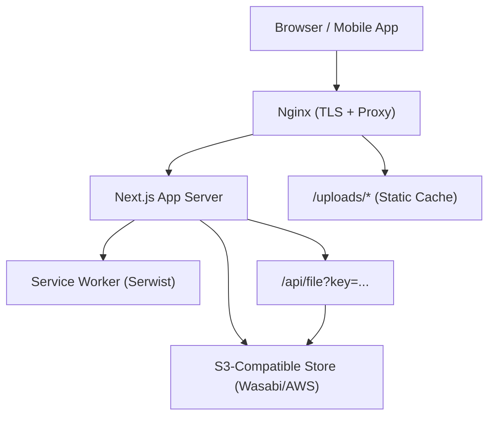
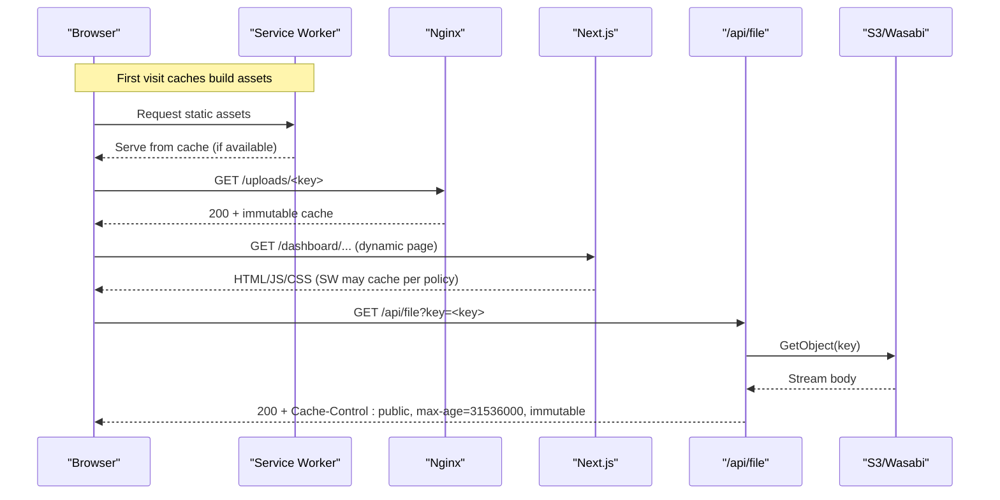
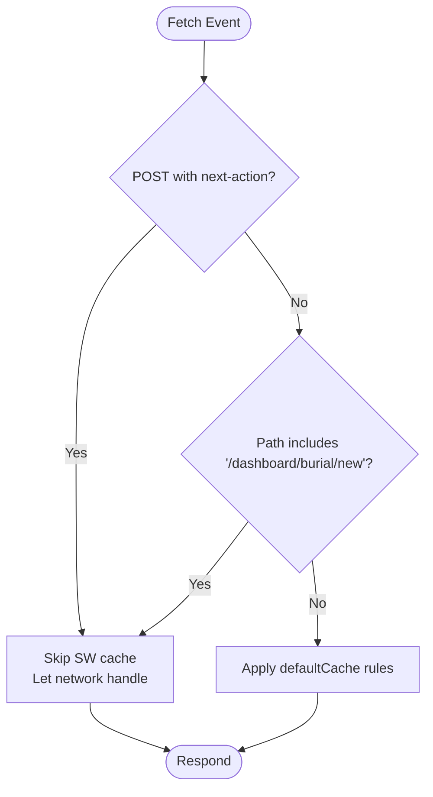
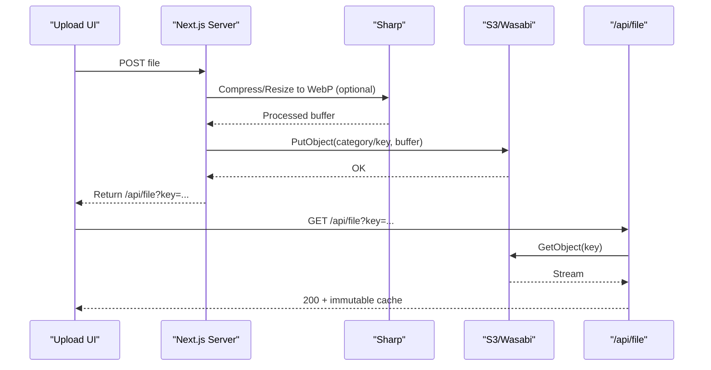
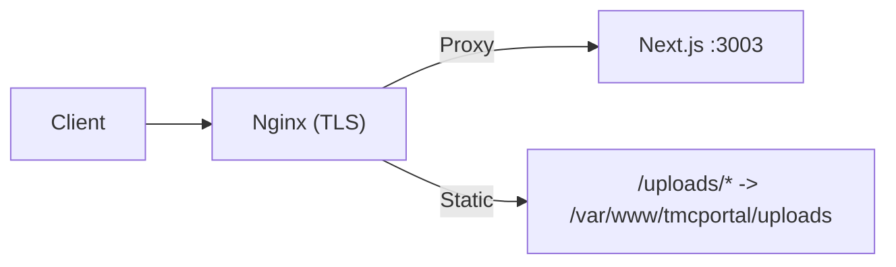
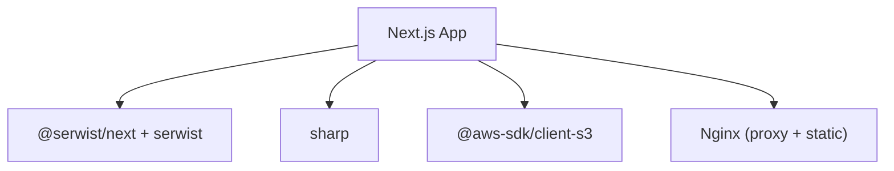

# Performance Optimization & CDN Integration

<cite>
**Referenced Files in This Document**
- [next.config.ts](file://next.config.ts)
- [sw.ts](file://app/sw.ts)
- [storage.ts](file://lib/storage.ts)
- [route.ts](file://app/api/file/route.ts)
- [nginx_full_remote.conf](file://nginx_full_remote.conf)
- [nginx_tmcng.conf](file://nginx_tmcng.conf)
- [site-visitor.tsx](file://components/analytics/site-visitor.tsx)
- [layout.tsx](file://app/layout.tsx)
- [manifest.ts](file://app/manifest.ts)
- [hero-slider.tsx](file://components/cms/hero-slider.tsx)
</cite>

## Table of Contents
1. Introduction
2. Project Structure
3. Core Components
4. Architecture Overview
5. Detailed Component Analysis
6. Dependency Analysis
7. Performance Considerations
8. Troubleshooting Guide
9. Conclusion
10. Appendices

## Introduction
This document explains how to optimize file performance and integrate a CDN for the TMC Portal. It covers static asset caching, image optimization, service worker-based offline support, server-side streaming from object storage, and Nginx configuration for secure delivery with long-lived caching. It also provides guidance on monitoring, cache invalidation strategies, mobile optimization, and testing methodologies.

## Project Structure
The TMC Portal uses Next.js with a service worker for runtime caching, server-side image compression and upload to an S3-compatible store (Wasabi/AWS), a streaming API route for secure file access, and Nginx as a reverse proxy with long-lived caching for uploads. The app is configured to allow remote images from specific domains and to disable Next’s built-in image optimization pipeline in favor of server-side processing.

**Diagram sources**
- [nginx_full_remote.conf:129-165](file://nginx_full_remote.conf#L129-L165)
- [next.config.ts:20-36](file://next.config.ts#L20-L36)
- [sw.ts:13-19](file://app/sw.ts#L13-L19)
- [storage.ts:25-83](file://lib/storage.ts#L25-L83)
- [route.ts:22-55](file://app/api/file/route.ts#L22-L55)

**Section sources**
- [next.config.ts:1-41](file://next.config.ts#L1-L41)
- [sw.ts:1-33](file://app/sw.ts#L1-L33)
- [storage.ts:1-100](file://lib/storage.ts#L1-L100)
- [route.ts:1-61](file://app/api/file/route.ts#L1-L61)
- [nginx_full_remote.conf:129-165](file://nginx_full_remote.conf#L129-L165)

## Core Components
- Service Worker Runtime Caching: Serwist precaches build assets and applies default runtime caching rules while excluding sensitive requests.
- Image Optimization Pipeline: Server-side compression and conversion to WebP using Sharp before upload; optional skip flag for development.
- Secure File Streaming: A Next.js API route streams files from S3-compatible storage with immutable cache headers.
- Nginx Static Caching: Long-lived caching for uploaded assets served directly by Nginx.
- PWA Manifest and Metadata: Defines icons and theme colors for progressive web app behavior.

**Section sources**
- [sw.ts:13-30](file://app/sw.ts#L13-L30)
- [storage.ts:32-56](file://lib/storage.ts#L32-L56)
- [route.ts:46-55](file://app/api/file/route.ts#L46-L55)
- [nginx_full_remote.conf:137-142](file://nginx_full_remote.conf#L137-L142)
- [manifest.ts:3-38](file://app/manifest.ts#L3-L38)

## Architecture Overview
The request flow for user-facing assets and uploads is optimized across layers:
- Static uploads are served directly by Nginx with immutable caching.
- Dynamic or private assets stream through a Next.js API route that fetches from S3-compatible storage and returns with long-lived cache headers.
- Build-time assets are cached via the service worker with runtime policies that avoid intercepting mutations.

**Diagram sources**
- [sw.ts:13-30](file://app/sw.ts#L13-L30)
- [nginx_full_remote.conf:137-142](file://nginx_full_remote.conf#L137-L142)
- [route.ts:22-55](file://app/api/file/route.ts#L22-L55)

## Detailed Component Analysis

### Service Worker and Offline Support
- Precaches build artifacts and enables navigation preload for faster first paint.
- Excludes POST requests carrying Next Actions and specific admin pages from default caching to prevent stale mutations.
- Works alongside Next.js output mode for efficient deployment.

**Diagram sources**
- [sw.ts:21-30](file://app/sw.ts#L21-L30)

**Section sources**
- [sw.ts:1-33](file://app/sw.ts#L1-L33)
- [next.config.ts:4-9](file://next.config.ts#L4-L9)

### Image Optimization and Upload Flow
- On upload, images are compressed and converted to WebP at up to 1920x1080 with quality 80, unless explicitly skipped via environment variable.
- Files are stored in an S3-compatible bucket and returned via a secure proxy URL to bypass public access restrictions.
- Local fallback writes to a public directory when cloud storage is not configured.

**Diagram sources**
- [storage.ts:25-83](file://lib/storage.ts#L25-L83)
- [route.ts:22-55](file://app/api/file/route.ts#L22-L55)

**Section sources**
- [storage.ts:1-100](file://lib/storage.ts#L1-L100)
- [route.ts:1-61](file://app/api/file/route.ts#L1-L61)

### Nginx Reverse Proxy and Static Asset Caching
- Proxies application traffic to the Next.js server with proper headers for TLS and client IP forwarding.
- Serves uploaded assets under /uploads with long expiration and immutable cache control to maximize browser and CDN caching.
- Manages SSL certificates via Let’s Encrypt and enforces HTTPS redirects.

**Diagram sources**
- [nginx_full_remote.conf:129-165](file://nginx_full_remote.conf#L129-L165)
- [nginx_tmcng.conf:9-14](file://nginx_tmcng.conf#L9-L14)

**Section sources**
- [nginx_full_remote.conf:129-165](file://nginx_full_remote.conf#L129-L165)
- [nginx_tmcng.conf:1-59](file://nginx_tmcng.conf#L1-L59)

### PWA Manifest and Root Layout
- Declares app name, theme color, background color, and multiple icon sizes for installability and consistent branding.
- Integrates analytics visitor tracking component into the root layout.

**Section sources**
- [manifest.ts:1-40](file://app/manifest.ts#L1-L40)
- [layout.tsx:20-40](file://app/layout.tsx#L20-L40)
- [layout.tsx:42-63](file://app/layout.tsx#L42-L63)

### Analytics and Monitoring Hooks
- Tracks visits asynchronously with a short delay to avoid blocking critical rendering.
- Skips internal routes and static resources to reduce noise.

**Section sources**
- [site-visitor.tsx:1-70](file://components/analytics/site-visitor.tsx#L1-L70)

### Hero Slider Images
- Uses standard  elements for hero backgrounds; consider adding lazy loading and responsive srcset for further gains.

**Section sources**
- [hero-slider.tsx:48-61](file://components/cms/hero-slider.tsx#L48-L61)

## Dependency Analysis
Key runtime dependencies influencing performance:
- Serwist for service worker lifecycle and caching policies.
- Sharp for high-performance image processing.
- AWS SDK for S3-compatible storage interactions.
- Nginx for TLS termination and static asset caching.

**Diagram sources**
- [next.config.ts:1-9](file://next.config.ts#L1-L9)
- [sw.ts:1-4](file://app/sw.ts#L1-L4)
- [storage.ts:1-5](file://lib/storage.ts#L1-L5)
- [route.ts:1-3](file://app/api/file/route.ts#L1-L3)
- [nginx_full_remote.conf:129-165](file://nginx_full_remote.conf#L129-L165)

**Section sources**
- [package-lock.json:17513-17539](file://package-lock.json#L17513-L17539)
- [package-lock.json:17595-17620](file://package-lock.json#L17595-L17620)

## Performance Considerations
- Static Assets and CDN
  - Use Nginx to serve /uploads with immutable cache headers for maximum browser and CDN reuse.
  - Place a CDN in front of Nginx to cache these responses globally.
- Caching Strategy
  - SW precaches build artifacts; default runtime caching applies to common assets.
  - Exclude mutating requests (Next Actions) and sensitive paths from SW caching.
  - Set immutable cache headers on streamed files from the API route.
- Image Optimization
  - Server-side compression to WebP reduces payload size significantly.
  - Consider responsive images (srcset/sizes) and lazy loading in components for large visuals.
- Load Time Optimization
  - Navigation preload improves initial load times.
  - Keep bundle sizes small; defer non-critical scripts and analytics.
- Bandwidth Usage
  - Prefer WebP and appropriate dimensions to minimize bandwidth.
  - Leverage immutable caching to avoid re-downloads.
- Mobile Optimization
  - Ensure viewport settings and PWA manifest are present for better mobile experience.
  - Avoid heavy computations on the main thread during initial render.
- Network Throttling Handling
  - Use SW runtime caching to improve perceived performance on slow networks.
  - Defer analytics and non-essential calls to avoid blocking.
- Offline Availability
  - SW precache ensures core shell works offline; ensure critical assets are included.

[No sources needed since this section provides general guidance]

## Troubleshooting Guide
- Images not optimizing
  - Verify Sharp is installed and environment variables for S3 are set correctly.
  - Confirm SKIP_IMAGE_COMPRESSION is not enabled unintentionally.
- Files returning 404 from /api/file
  - Ensure key parameter is present and the object exists in the configured bucket.
  - Check S3 credentials and endpoint configuration.
- SW not caching expected resources
  - Confirm fetch events are not being intercepted for POST with next-action or excluded paths.
  - Validate that build artifacts are included in the SW manifest.
- Nginx not serving uploads
  - Verify alias path exists and permissions allow reading.
  - Ensure Cache-Control and expires directives are applied.

**Section sources**
- [storage.ts:32-56](file://lib/storage.ts#L32-L56)
- [route.ts:22-55](file://app/api/file/route.ts#L22-L55)
- [sw.ts:21-30](file://app/sw.ts#L21-L30)
- [nginx_full_remote.conf:137-142](file://nginx_full_remote.conf#L137-L142)

## Conclusion
The TMC Portal combines server-side image optimization, service worker caching, secure streaming from object storage, and Nginx static caching to deliver fast, reliable performance. By extending these patterns with CDN integration, responsive images, and robust cache invalidation, you can achieve excellent load times and bandwidth efficiency across devices and networks.

[No sources needed since this section summarizes without analyzing specific files]

## Appendices

### CDN Provider Integration Examples
- CloudFlare
  - Point your domain DNS to CloudFlare and enable “Proxied” status.
  - Configure Page Rules or Cache Rules to cache /uploads/** with long TTL and immutable flags.
  - Enable Auto Minify for CSS/JS if desired, and ensure Brotli/Gzip is enabled.
- AWS CloudFront
  - Create a distribution with origin pointing to your Nginx host or CDN edge.
  - Define behaviors to cache /uploads/** with long TTL and immutable headers.
  - Restrict viewer protocol to HTTPS and configure custom SSL certificate.

[No sources needed since this section provides general guidance]

### Custom Domain Configuration and SSL
- Use Nginx with Let’s Encrypt-managed certificates for HTTPS termination.
- Redirect HTTP to HTTPS and enforce modern TLS settings.
- If placing a CDN in front, configure its custom domain and SSL to terminate at the edge.

**Section sources**
- [nginx_full_remote.conf:129-165](file://nginx_full_remote.conf#L129-L165)
- [nginx_tmcng.conf:28-33](file://nginx_tmcng.conf#L28-L33)

### Progressive Loading, Prefetching, and Resource Prioritization
- Add loading="lazy" to below-the-fold images and use srcset for responsive images.
- Use <link rel="prefetch"> for likely-next resources where appropriate.
- Prioritize critical CSS and fonts; defer non-essential scripts.

[No sources needed since this section provides general guidance]

### Cache Invalidation Policies
- For immutable assets, use content hashing in filenames to invalidate automatically on change.
- For dynamic assets, rely on versioned URLs or query parameters and adjust CDN/TTL accordingly.
- Implement cache warming scripts to pre-populate CDN edges after deployments.

[No sources needed since this section provides general guidance]

### Performance Testing Methodologies
- Use Lighthouse, WebPageTest, and Chrome DevTools Network panel to measure load times and waterfalls.
- Simulate throttled networks to validate SW caching effectiveness.
- Monitor real-user metrics via analytics hooks and dashboard insights.

[No sources needed since this section provides general guidance]