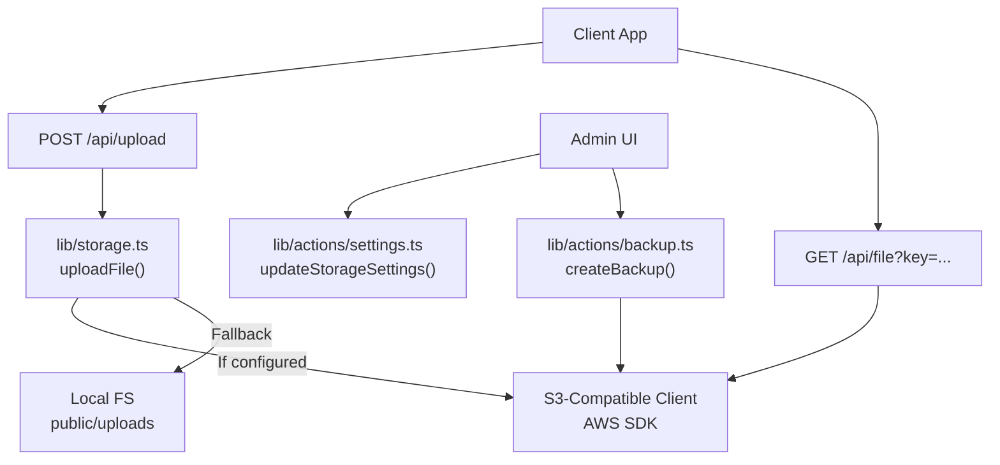
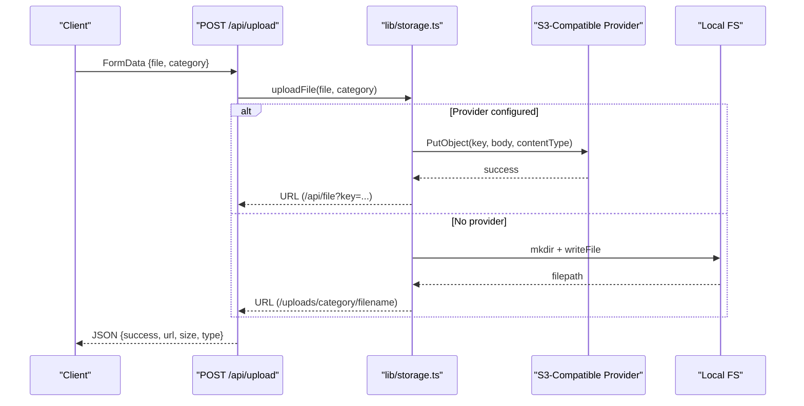
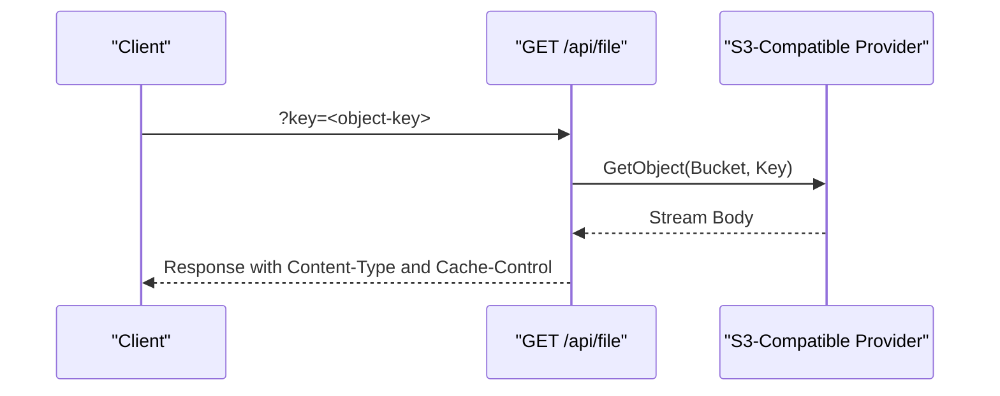
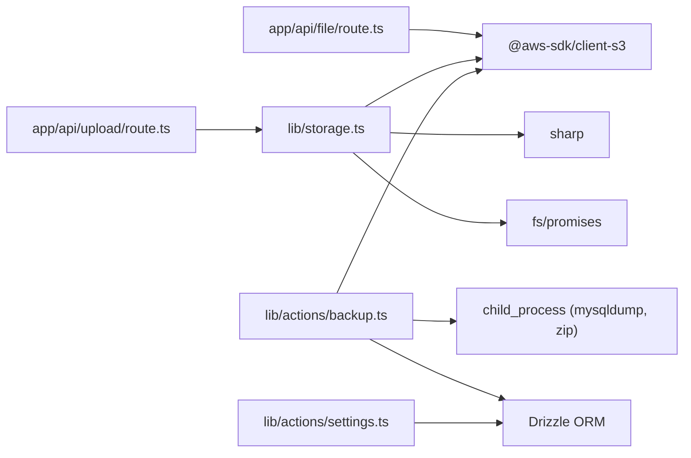

# Storage Backend Integration

<cite>
**Referenced Files in This Document**
- [storage.ts](file://lib/storage.ts)
- [route.ts (File API)](file://app/api/file/route.ts)
- [route.ts (Upload API)](file://app/api/upload/route.ts)
- [backup.ts](file://lib/actions/backup.ts)
- [automated-backup.ts](file://scripts/automated-backup.ts)
- [settings.ts](file://lib/actions/settings.ts)
- [schema.ts](file://lib/db/schema.ts)
</cite>

## Table of Contents
1. Introduction
2. Project Structure
3. Core Components
4. Architecture Overview
5. Detailed Component Analysis
6. Dependency Analysis
7. Performance Considerations
8. Troubleshooting Guide
9. Conclusion
10. Appendices

## Introduction
This document explains the TMC Portal storage backend abstraction layer that supports multiple object storage providers and a local file fallback. It covers how uploads are processed, how files are served securely via a proxy endpoint, environment configuration for different backends, backup and restore workflows, and operational guidance for performance tuning and disaster recovery.

The current implementation provides:
- A unified upload path that writes to cloud object storage when configured or falls back to local disk storage
- A secure file retrieval endpoint that streams objects from the configured provider
- Backup routines that export database dumps and zip application files, with optional upload to object storage
- Administrative settings to persist storage configuration values

## Project Structure
The storage subsystem spans several modules:
- Upload processing and image optimization live in a server-only module
- File serving is exposed as an API route that proxies requests to the configured object store
- Backups are implemented as server actions that create archives and optionally upload them to object storage
- System settings allow administrators to update storage configuration at runtime
- Database schema tracks backup records and system settings

**Diagram sources**
- [storage.ts:25-99](file://lib/storage.ts#L25-L99)
- [route.ts (File API):22-60](file://app/api/file/route.ts#L22-L60)
- [route.ts (Upload API):4-65](file://app/api/upload/route.ts#L4-L65)
- [backup.ts:41-148](file://lib/actions/backup.ts#L41-L148)
- [settings.ts:347-399](file://lib/actions/settings.ts#L347-L399)

**Section sources**
- [storage.ts:1-99](file://lib/storage.ts#L1-L99)
- [route.ts (File API):1-61](file://app/api/file/route.ts#L1-L61)
- [route.ts (Upload API):1-66](file://app/api/upload/route.ts#L1-L66)
- [backup.ts:1-162](file://lib/actions/backup.ts#L1-L162)
- [settings.ts:332-399](file://lib/actions/settings.ts#L332-L399)

## Core Components
- Upload pipeline: Validates input, compresses images, generates unique keys, and writes to either cloud storage or local filesystem.
- File proxy: Streams stored objects from the configured provider with appropriate headers and caching.
- Backup service: Dumps the database, zips uploaded files, and optionally uploads artifacts to object storage; persists metadata.
- Settings persistence: Stores integration credentials and endpoints in the database for runtime use by other services.

Key responsibilities:
- Environment-driven configuration with provider fallbacks
- Secure streaming of private objects through a controlled endpoint
- Robust error handling and logging throughout the pipeline
- Auditability via backup records and status tracking

**Section sources**
- [storage.ts:25-99](file://lib/storage.ts#L25-L99)
- [route.ts (File API):22-60](file://app/api/file/route.ts#L22-L60)
- [backup.ts:41-148](file://lib/actions/backup.ts#L41-L148)
- [settings.ts:347-399](file://lib/actions/settings.ts#L347-L399)

## Architecture Overview
The storage layer abstracts the underlying provider behind a simple interface. When credentials and bucket are present, uploads go to the configured S3-compatible service; otherwise, they fall back to local disk. Reads are always proxied through a secure endpoint that fetches content from the configured provider.

**Diagram sources**
- [route.ts (Upload API):4-65](file://app/api/upload/route.ts#L4-L65)
- [storage.ts:25-99](file://lib/storage.ts#L25-L99)

**Diagram sources**
- [route.ts (File API):22-60](file://app/api/file/route.ts#L22-L60)

## Detailed Component Analysis

### Upload Pipeline (lib/storage.ts)
Responsibilities:
- Read incoming file into memory buffer
- Optionally compress images using a library, convert to a web-friendly format, and adjust extension
- Sanitize filenames and generate unique keys based on timestamp and category
- Attempt upload to configured S3-compatible provider if credentials and bucket exist
- Fall back to writing to public/uploads directory structure if provider is not configured
- Return a stable URL for clients to access the file

Error handling:
- Logs compression failures and continues with original data
- Throws a generic error on upload failure
- Ensures directories exist before writing locally

Performance notes:
- Image compression reduces bandwidth and storage costs
- Skipping compression can be enabled via an environment flag for specific workflows

Configuration:
- Region, bucket, access key, secret key, and optional custom endpoint are read from environment variables
- Endpoint presence enables path-style addressing for compatibility with MinIO or other S3-compatible services

**Section sources**
- [storage.ts:6-23](file://lib/storage.ts#L6-L23)
- [storage.ts:25-99](file://lib/storage.ts#L25-L99)

### File Proxy Endpoint (app/api/file/route.ts)
Responsibilities:
- Validate request parameters
- Initialize a client using environment-based configuration
- Fetch object stream from the provider and return it with proper headers
- Handle missing keys and unavailable providers gracefully

Security considerations:
- Access is controlled via this endpoint rather than exposing direct object URLs
- Uses cache headers suitable for immutable assets

Error handling:
- Returns appropriate HTTP status codes for missing keys and internal errors

**Section sources**
- [route.ts (File API):4-20](file://app/api/file/route.ts#L4-L20)
- [route.ts (File API):22-60](file://app/api/file/route.ts#L22-L60)

### Upload API (app/api/upload/route.ts)
Responsibilities:
- Parse form data and validate file presence
- Enforce maximum file size
- Validate allowed MIME types and extensions
- Sanitize category to prevent directory traversal
- Delegate to the storage library for upload logic
- Return structured JSON response with metadata

Error handling:
- Returns clear error messages for validation failures and upload errors

**Section sources**
- [route.ts (Upload API):4-65](file://app/api/upload/route.ts#L4-L65)

### Backup Service (lib/actions/backup.ts)
Responsibilities:
- Create a timestamped backup name and temporary workspace
- Dump the MySQL database to a SQL file
- Zip application files under public/uploads
- Optionally upload both artifacts to the configured object storage under a backups prefix
- Persist backup metadata including URLs, size, and status
- Clean up temporary files after completion

Operational details:
- Uses command-line tools for database dump and archiving
- Tracks creator and timestamps for auditability
- Provides functions to list and delete backup records

Error handling:
- Captures and logs errors during dump and zip operations
- Writes informative placeholders when tools fail
- Ensures cleanup even on failure paths

**Section sources**
- [backup.ts:15-33](file://lib/actions/backup.ts#L15-L33)
- [backup.ts:41-148](file://lib/actions/backup.ts#L41-L148)
- [backup.ts:150-161](file://lib/actions/backup.ts#L150-L161)

### Automated Retention Script (scripts/automated-backup.ts)
Responsibilities:
- Enforces retention policies for local and cloud backups
- Lists objects under a backups prefix and deletes those older than a threshold
- Integrates with the configured provider using environment-based credentials

Operational notes:
- Designed to run periodically to manage storage lifecycle
- Uses provider APIs to enumerate and remove old artifacts

**Section sources**
- [automated-backup.ts:41-70](file://scripts/automated-backup.ts#L41-L70)

### Settings Persistence (lib/actions/settings.ts)
Responsibilities:
- Load and update storage-related settings from the database
- Provide default values when configuration is missing
- Revalidate admin UI paths after updates

Use cases:
- Allows administrators to change provider endpoints, buckets, regions, and credentials without redeploying code
- Centralizes integration configuration for features that depend on storage

**Section sources**
- [settings.ts:332-399](file://lib/actions/settings.ts#L332-L399)

### Data Model for Backups (lib/db/schema.ts)
Responsibilities:
- Defines the backups table schema with fields for name, type, URLs, size, status, error, and timestamps
- Establishes relationships to users for auditing

Operational impact:
- Enables tracking of manual and automated backups
- Supports UI listing and management of backup records

**Section sources**
- [schema.ts:589-618](file://lib/db/schema.ts#L589-L618)

## Dependency Analysis
The storage layer depends on:
- AWS SDK for S3-compatible operations
- Sharp for image processing
- Node.js filesystem utilities for local fallback
- Command-line tools for database dump and archive creation
- Database ORM for settings and backup metadata

Coupling and cohesion:
- The upload function encapsulates provider selection and fallback logic, improving cohesion
- API routes remain thin, delegating to the storage library
- Backup actions are self-contained and only depend on environment configuration and DB

Potential circular dependencies:
- None observed between storage components; each module has a clear responsibility boundary

External integrations:
- Object storage providers via AWS SDK
- MySQL via command-line tools
- Redis queues elsewhere in the app (not part of storage layer)

**Diagram sources**
- [storage.ts:1-23](file://lib/storage.ts#L1-L23)
- [route.ts (File API):1-20](file://app/api/file/route.ts#L1-L20)
- [backup.ts:1-33](file://lib/actions/backup.ts#L1-L33)
- [settings.ts:347-399](file://lib/actions/settings.ts#L347-L399)

**Section sources**
- [storage.ts:1-23](file://lib/storage.ts#L1-L23)
- [route.ts (File API):1-20](file://app/api/file/route.ts#L1-L20)
- [backup.ts:1-33](file://lib/actions/backup.ts#L1-L33)
- [settings.ts:347-399](file://lib/actions/settings.ts#L347-L399)

## Performance Considerations
- Image compression: Enabled by default for non-SVG images to reduce payload sizes; can be disabled via an environment flag when needed.
- Streaming responses: File reads stream directly from the provider to minimize memory usage.
- Local fallback: Useful for development or when provider is unavailable; consider moving to object storage for production scale.
- Retention automation: Periodic cleanup prevents unbounded growth of backup artifacts.

Connection pooling and timeouts:
- The AWS SDK manages connection pooling internally; no explicit pool configuration is present in the storage layer.
- Timeouts and retry policies are not explicitly set in the current implementation; rely on SDK defaults. For high-throughput environments, consider configuring retries and timeouts at the SDK level where supported.

Provider-specific notes:
- Path-style addressing is enabled when a custom endpoint is provided, aiding compatibility with MinIO or other S3-compatible services.
- Public ACLs are used for uploads in the storage library; ensure bucket policies align with security requirements.

[No sources needed since this section provides general guidance]

## Troubleshooting Guide
Common issues and resolutions:
- Missing provider configuration: If credentials or bucket are absent, uploads fall back to local storage. Verify environment variables for region, bucket, access key, secret key, and endpoint.
- Upload failures: Check logs for upload errors and ensure the provider is reachable and permissions are correct.
- File retrieval errors: Ensure the key exists and the provider is configured; verify network connectivity and credentials.
- Backup tool failures: If mysqldump or zip commands fail, the backup process writes diagnostic content and still records metadata; inspect logs and environment for tool availability.

Operational checks:
- Use utility scripts to list objects and verify connectivity to the configured provider.
- Monitor backup records and statuses to detect failed operations early.

**Section sources**
- [storage.ts:66-83](file://lib/storage.ts#L66-L83)
- [route.ts (File API):22-60](file://app/api/file/route.ts#L22-L60)
- [backup.ts:55-98](file://lib/actions/backup.ts#L55-L98)
- [backup.ts:139-147](file://lib/actions/backup.ts#L139-L147)

## Conclusion
The TMC Portal storage abstraction provides a practical multi-backend approach with automatic fallback to local storage, secure file streaming, and robust backup capabilities. While the current implementation relies on environment variables and SDK defaults for connectivity, it offers a solid foundation for extending support to additional providers and fine-tuning performance characteristics such as timeouts and retries. Administrators can manage storage configuration and backups through the application, enabling operational flexibility without code changes.

[No sources needed since this section summarizes without analyzing specific files]

## Appendices

### Environment Variables Reference
- Region: Used to select the provider region; defaults to a safe value if unset.
- Bucket: Target bucket name for uploads and backups.
- Access Key and Secret Key: Credentials required to authenticate with the provider.
- Endpoint: Optional custom endpoint for S3-compatible services; presence enables path-style addressing.
- Skip Compression: Flag to bypass image compression during uploads.

Notes:
- The application supports both Wasabi-prefixed and AWS-prefixed environment variable names, selecting the first available.
- For MinIO or similar services, set the endpoint and ensure path-style addressing is enabled.

**Section sources**
- [storage.ts:6-23](file://lib/storage.ts#L6-L23)
- [route.ts (File API):4-20](file://app/api/file/route.ts#L4-L20)
- [backup.ts:17-33](file://lib/actions/backup.ts#L17-L33)

### Backup and Restore Procedures
- Manual backup: Triggered via administrative actions; creates a database dump and zips uploaded files, then optionally uploads to object storage and records metadata.
- Automated retention: Runs periodically to enforce retention windows and remove old backups locally and in the cloud.
- Restore workflow: Download artifacts from object storage or local archives, restore the database from the SQL dump, and extract files to the application’s uploads directory. Validate integrity post-restore.

Operational tips:
- Schedule automated backups regularly and monitor their status.
- Keep retention policies aligned with compliance and storage cost targets.
- Test restore procedures periodically to ensure recoverability.

**Section sources**
- [backup.ts:41-148](file://lib/actions/backup.ts#L41-L148)
- [automated-backup.ts:41-70](file://scripts/automated-backup.ts#L41-L70)

### Switching Between Storage Providers
- Update environment variables to point to the desired provider (region, bucket, credentials, endpoint).
- If using a custom endpoint, ensure path-style addressing is enabled.
- Verify uploads and retrievals through the API endpoints.
- For runtime configuration, update storage settings via the administrative interface to persist provider details.

**Section sources**
- [storage.ts:6-23](file://lib/storage.ts#L6-L23)
- [settings.ts:347-399](file://lib/actions/settings.ts#L347-L399)

### Custom Storage Backend Implementation
To implement a new backend:
- Extend the upload function to detect a new provider and perform write operations accordingly.
- Add a corresponding read path in the file proxy endpoint or extend it to support the new provider.
- Integrate backup routines to handle the new backend for artifact uploads.
- Update environment variable parsing and settings persistence to support new configuration keys.

Guidance:
- Maintain consistent error handling and logging patterns.
- Ensure secure streaming and proper content-type handling.
- Validate inputs and sanitize paths to prevent traversal attacks.

[No sources needed since this section provides general guidance]