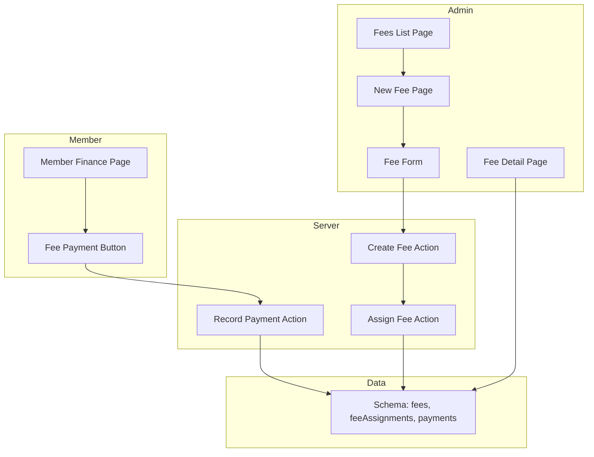
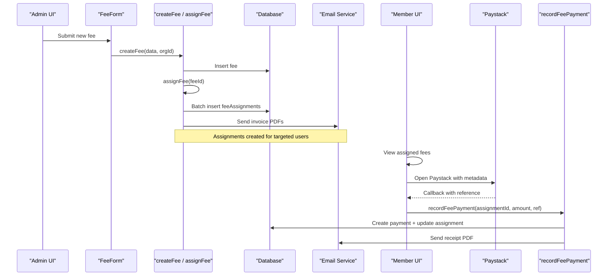
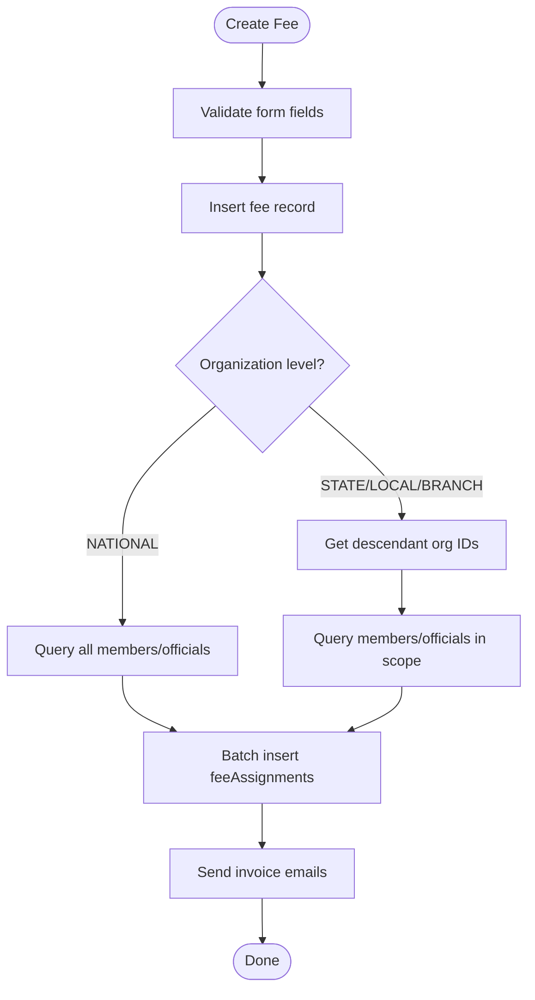
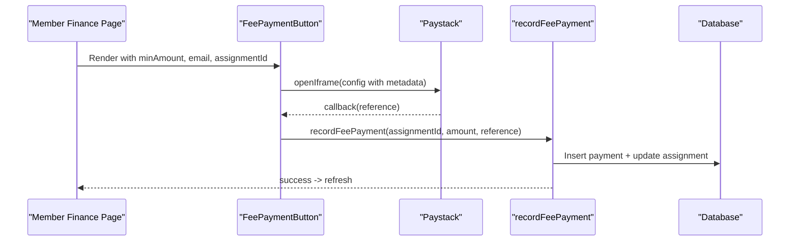
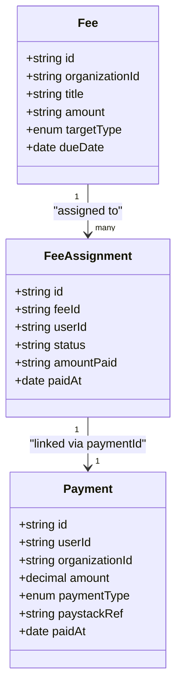
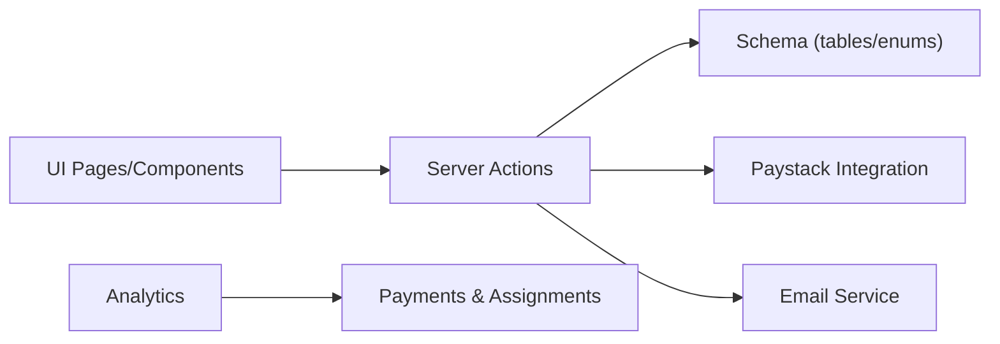

# Fee Management & Pricing Configuration

<cite>
**Referenced Files in This Document**
- [fee-form.tsx](file://components/admin/finance/fee-form.tsx)
- [fees.ts (actions)](file://lib/actions/fees.ts)
- [schema.ts](file://lib/db/schema.ts)
- [page.tsx (New Fee)](file://app/dashboard/admin/finance/fees/new/page.tsx)
- [page.tsx (Fees Admin)](file://app/dashboard/admin/finance/fees/page.tsx)
- [page.tsx (Fee Detail)](file://app/dashboard/admin/finance/fees/[id]/page.tsx)
- [fee-payment-button.tsx](file://components/finance/fee-payment-button.tsx)
- [page.tsx (Member Finance)](file://app/dashboard/member/finance/page.tsx)
- [analytics.ts](file://lib/actions/analytics.ts)
- [ADMIN_MANUAL.md](file://docs/ADMIN_MANUAL.md)
</cite>

## Table of Contents
1. Introduction
2. Project Structure
3. Core Components
4. Architecture Overview
5. Detailed Component Analysis
6. Dependency Analysis
7. Performance Considerations
8. Troubleshooting Guide
9. Conclusion

## Introduction
This document explains the fee management and pricing configuration system in the TMC Portal. It covers how to create and manage fees such as membership dues, program registration fees, and service charges; how jurisdiction-specific pricing is applied; how recurring and one-time fees are handled; how the fee payment button integrates into workflows; and how reporting and audit trails support financial accountability.

## Project Structure
The fee system spans server actions, UI forms, pages, and a reusable payment button component:
- Admin pages for creating and managing fees within a selected organization/jurisdiction
- A form that validates inputs and triggers fee creation with automatic assignment
- Server-side logic to assign fees to members or officials based on target type and hierarchy
- A member-facing finance page that displays assigned fees and provides a payment button
- Analytics endpoints that aggregate revenue by payment type and compliance status

**Diagram sources**
- [page.tsx (New Fee):1-40](file://app/dashboard/admin/finance/fees/new/page.tsx#L1-L40)
- [fee-form.tsx:1-224](file://components/admin/finance/fee-form.tsx#L1-L224)
- [fees.ts (actions):38-172](file://lib/actions/fees.ts#L38-L172)
- [fee-payment-button.tsx:1-129](file://components/finance/fee-payment-button.tsx#L1-L129)
- [page.tsx (Member Finance):1-34](file://app/dashboard/member/finance/page.tsx#L1-L34)
- [schema.ts:352-370](file://lib/db/schema.ts#L352-L370)

**Section sources**
- [page.tsx (New Fee):1-40](file://app/dashboard/admin/finance/fees/new/page.tsx#L1-L40)
- [page.tsx (Fees Admin):1-37](file://app/dashboard/admin/finance/fees/page.tsx#L1-L37)
- [page.tsx (Fee Detail):1-136](file://app/dashboard/admin/finance/fees/[id]/page.tsx#L1-L136)
- [fee-form.tsx:1-224](file://components/admin/finance/fee-form.tsx#L1-L224)
- [fees.ts (actions):38-172](file://lib/actions/fees.ts#L38-L172)
- [fee-payment-button.tsx:1-129](file://components/finance/fee-payment-button.tsx#L1-L129)
- [page.tsx (Member Finance):1-34](file://app/dashboard/member/finance/page.tsx#L1-L34)
- [schema.ts:352-370](file://lib/db/schema.ts#L352-L370)

## Core Components
- Fee creation form: Validates title, amount, target group, due date, and description; submits to server action to create a fee and auto-assign to eligible users.
- Fee assignment engine: Determines target users based on target type (all members vs officials) and organization level (national vs state/local/branch), then creates assignments and sends invoices via email.
- Member finance view: Lists assigned fees with status and amounts; renders the fee payment button per assignment.
- Fee payment button: Enforces minimum amount, opens Paystack checkout with metadata linking to the assignment, and records payment on callback.
- Analytics and reporting: Aggregates revenue by payment type and tracks compliance (paid vs pending) across organizations.

Key behaviors:
- Jurisdiction scoping: Fees created at National apply to all members; State/Local/Branch fees apply to members within that jurisdiction’s subtree.
- Targeting: All Members or Officials Only.
- Minimum payment enforcement: Payments below the stipulated amount are blocked; overpayments are allowed and recorded as additional contributions.
- Email notifications: Invoices on assignment; receipts on successful payment.

**Section sources**
- [fee-form.tsx:39-92](file://components/admin/finance/fee-form.tsx#L39-L92)
- [fees.ts (actions):38-172](file://lib/actions/fees.ts#L38-L172)
- [page.tsx (Member Finance):17-34](file://app/dashboard/member/finance/page.tsx#L17-L34)
- [fee-payment-button.tsx:21-89](file://components/finance/fee-payment-button.tsx#L21-L89)
- [analytics.ts:100-130](file://lib/actions/analytics.ts#L100-L130)

## Architecture Overview
The fee system follows a clear separation between UI, server actions, and data models:
- Admin UI collects fee parameters and triggers creation
- Server actions enforce business rules, perform DB writes, and orchestrate emails
- Member UI surfaces assignments and integrates a payment button
- Analytics compute revenue and compliance metrics

**Diagram sources**
- [fee-form.tsx:75-92](file://components/admin/finance/fee-form.tsx#L75-L92)
- [fees.ts (actions):38-172](file://lib/actions/fees.ts#L38-L172)
- [fee-payment-button.tsx:32-89](file://components/finance/fee-payment-button.tsx#L32-L89)
- [page.tsx (Member Finance):17-34](file://app/dashboard/member/finance/page.tsx#L17-L34)

## Detailed Component Analysis

### Fee Creation and Assignment
- The New Fee page loads organizations and presents the FeeForm bound to an organization context.
- The FeeForm validates inputs and calls createFee, which inserts a fee and triggers assignment.
- Assignment determines target users:
  - ALL_MEMBERS: selects members from the selected org and its descendants unless NATIONAL.
  - OFFICIALS: selects officials similarly scoped.
- Assignments are inserted in batches and invoices emailed to each user.

**Diagram sources**
- [fee-form.tsx:75-92](file://components/admin/finance/fee-form.tsx#L75-L92)
- [fees.ts (actions):38-172](file://lib/actions/fees.ts#L38-L172)

**Section sources**
- [page.tsx (New Fee):1-40](file://app/dashboard/admin/finance/fees/new/page.tsx#L1-L40)
- [fee-form.tsx:39-92](file://components/admin/finance/fee-form.tsx#L39-L92)
- [fees.ts (actions):38-172](file://lib/actions/fees.ts#L38-L172)

### Fee Payment Flow
- The Member Finance page fetches assignments joined with fees and organizations to display payable items.
- The FeePaymentButton enforces minimum amount, opens Paystack with metadata including assignment ID, and records payment on callback.
- Recording updates the assignment to PAID, stores a payment record, and emails a receipt.

**Diagram sources**
- [page.tsx (Member Finance):17-34](file://app/dashboard/member/finance/page.tsx#L17-L34)
- [fee-payment-button.tsx:32-89](file://components/finance/fee-payment-button.tsx#L32-L89)
- [fees.ts (actions):192-279](file://lib/actions/fees.ts#L192-L279)

**Section sources**
- [page.tsx (Member Finance):17-34](file://app/dashboard/member/finance/page.tsx#L17-L34)
- [fee-payment-button.tsx:21-129](file://components/finance/fee-payment-button.tsx#L21-L129)
- [fees.ts (actions):192-279](file://lib/actions/fees.ts#L192-L279)

### Fee Detail and Compliance Tracking
- The Fee Detail page shows totals for assigned, paid, and pending counts, plus a table of member assignments with status and dates.
- This supports monitoring compliance and identifying overdue payers.

**Diagram sources**
- [schema.ts:352-370](file://lib/db/schema.ts#L352-L370)
- [page.tsx (Fee Detail):15-136](file://app/dashboard/admin/finance/fees/[id]/page.tsx#L15-L136)

**Section sources**
- [page.tsx (Fee Detail):15-136](file://app/dashboard/admin/finance/fees/[id]/page.tsx#L15-L136)

### Program Registration Pricing Tiers (Related Feature)
While distinct from levies, program registrations use configurable pricing tiers to set category-based amounts. This demonstrates the system’s broader capability to handle tiered pricing beyond flat fees.

**Section sources**
- [page.tsx (Program Register):370-423](file://app/programmes/[id]/register/page.tsx#L370-L423)
- [page.tsx (Program Register):453-473](file://app/programmes/[id]/register/page.tsx#L453-L473)

## Dependency Analysis
- UI components depend on server actions for mutations and queries.
- Server actions depend on schema definitions for tables and enums.
- Payment flows depend on Paystack integration and environment keys.
- Analytics depend on aggregated queries across payments and feeAssignments.

**Diagram sources**
- [fee-form.tsx:75-92](file://components/admin/finance/fee-form.tsx#L75-L92)
- [fees.ts (actions):38-172](file://lib/actions/fees.ts#L38-L172)
- [schema.ts:352-370](file://lib/db/schema.ts#L352-L370)
- [analytics.ts:100-130](file://lib/actions/analytics.ts#L100-L130)

**Section sources**
- [fees.ts (actions):38-172](file://lib/actions/fees.ts#L38-L172)
- [schema.ts:352-370](file://lib/db/schema.ts#L352-L370)
- [analytics.ts:100-130](file://lib/actions/analytics.ts#L100-L130)

## Performance Considerations
- Assignment insertion uses batching to avoid large single transactions.
- Queries filter by organization hierarchy to limit result sets.
- Payment recording runs within a transaction to ensure consistency between payment creation and assignment updates.
- Email sending occurs post-assignment/payment; consider background jobs if volume increases.

[No sources needed since this section provides general guidance]

## Troubleshooting Guide
Common issues and checks:
- Unauthorized errors when creating fees or recording payments: Ensure the session is active and the user has appropriate permissions.
- Assignment not generated: Verify the organization exists and the target type matches available members/officials; check logs for assignment failures.
- Payment below minimum: The system blocks payments under the stipulated amount; adjust the amount or fee definition accordingly.
- Paystack script not loaded: The payment button requires the Paystack inline script; retry after ensuring it loads successfully.
- Missing subaccount routing: For jurisdiction-specific settlement, ensure the organization has a Paystack subaccount configured; otherwise funds route to the default account.

Operational references:
- Jurisdiction payment routing and subaccount setup are managed in settings for decentralized fund collection.

**Section sources**
- [fees.ts (actions):38-74](file://lib/actions/fees.ts#L38-L74)
- [fee-payment-button.tsx:32-47](file://components/finance/fee-payment-button.tsx#L32-L47)
- [ADMIN_MANUAL.md:187-211](file://docs/ADMIN_MANUAL.md#L187-L211)

## Conclusion
The TMC Portal’s fee management system enables administrators to define jurisdiction-scoped fees, automatically assign them to eligible users, and collect payments through a robust, auditable flow. Members can view their obligations and pay directly via an integrated payment button. Reporting and analytics provide visibility into revenue and compliance, while audit and email trails support accountability. For advanced scenarios like recurring memberships, leverage annual fee cycles and re-assignment processes aligned with organizational policies.

[No sources needed since this section summarizes without analyzing specific files]