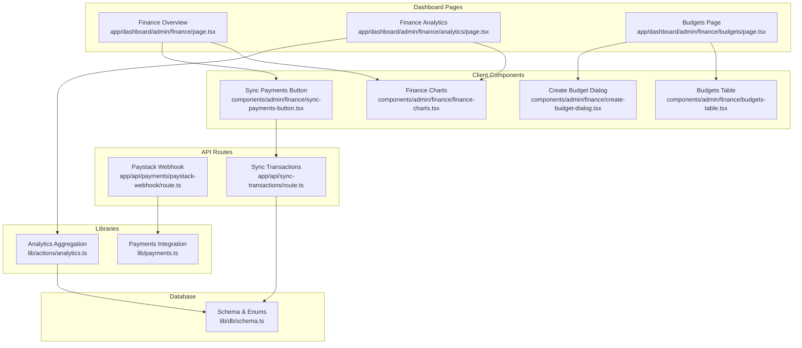
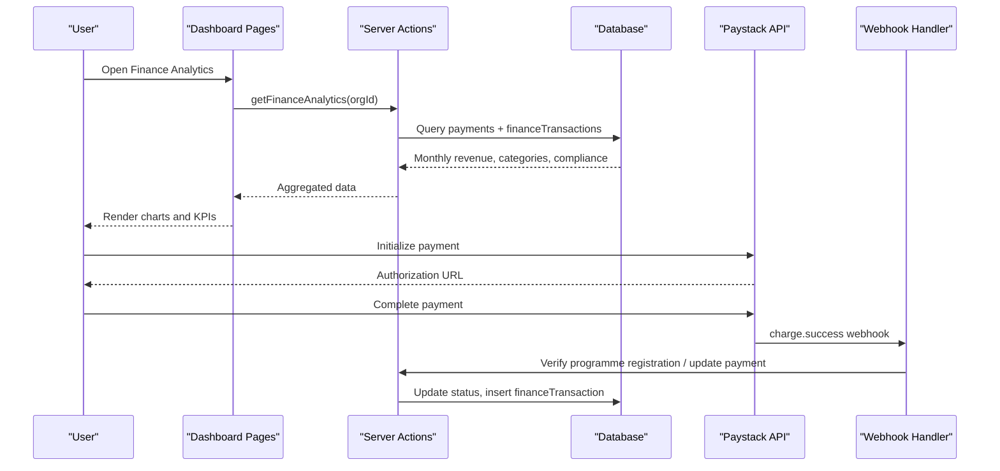
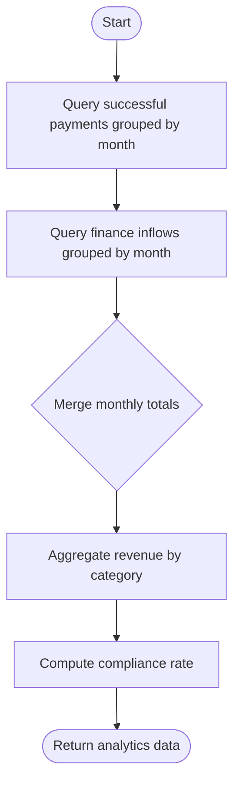
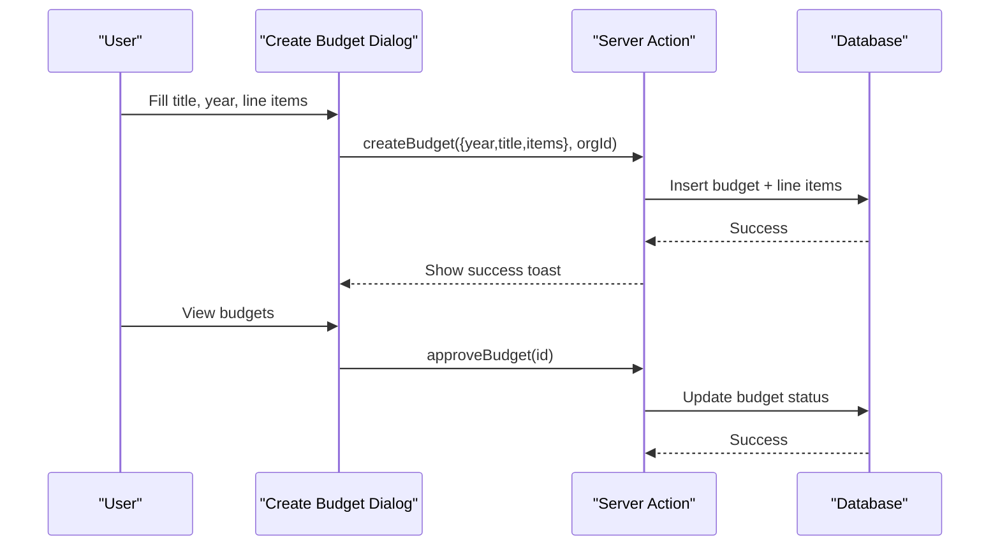
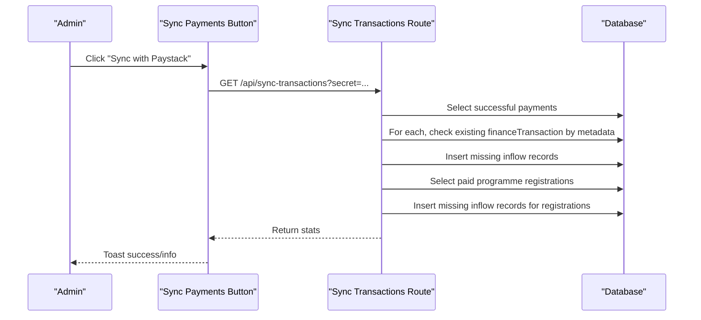
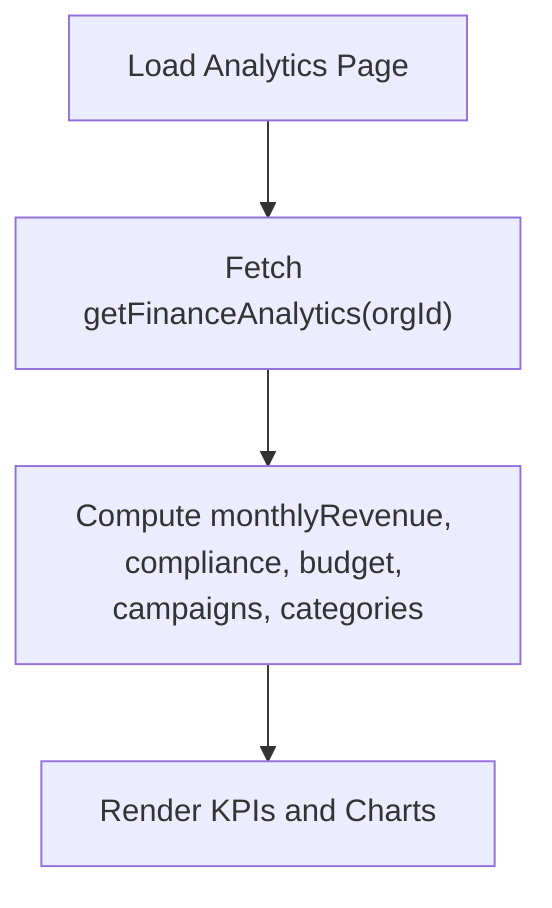
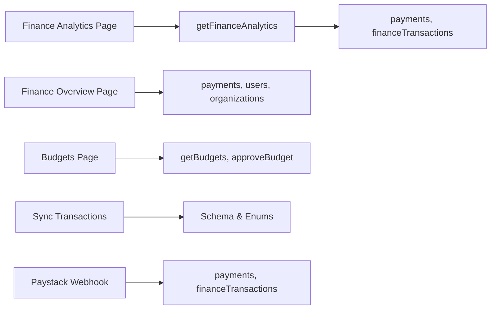

# Financial Reporting & Analytics

<cite>
**Referenced Files in This Document**
- [finance-charts.tsx](file://components/admin/finance/finance-charts.tsx)
- [page.tsx (Finance Overview)](file://app/dashboard/admin/finance/page.tsx)
- [route.ts (Paystack Webhook)](file://app/api/payments/paystack-webhook/route.ts)
- [route.ts (Sync Transactions)](file://app/api/sync-transactions/route.ts)
- [budgets-table.tsx](file://components/admin/finance/budgets-table.tsx)
- [create-budget-dialog.tsx](file://components/admin/finance/create-budget-dialog.tsx)
- [page.tsx (Budgets Page)](file://app/dashboard/admin/finance/budgets/page.tsx)
- [payments.ts](file://lib/payments.ts)
- [sync-payments-button.tsx](file://components/admin/finance/sync-payments-button.tsx)
- [page.tsx (Finance Analytics Page)](file://app/dashboard/admin/finance/analytics/page.tsx)
- [analytics.ts](file://lib/actions/analytics.ts)
- [schema.ts](file://lib/db/schema.ts)
</cite>

## Table of Contents
1. Introduction
2. Project Structure
3. Core Components
4. Architecture Overview
5. Detailed Component Analysis
6. Dependency Analysis
7. Performance Considerations
8. Troubleshooting Guide
9. Conclusion

## Introduction
This document explains the financial reporting and analytics dashboard in the TMC Portal. It covers revenue tracking across categories and time periods, visualization components for income trends and budget utilization, budget management workflows, payment synchronization with Paystack, analytics features such as compliance rates and campaign progress, and export capabilities for budgets and transactions. It also provides guidance on interpreting key metrics to support data-driven decisions.

## Project Structure
The finance module spans server-side routes, client-side dashboards, reusable chart components, and database schemas:
- Dashboard pages present summaries, charts, and tables for finance operations.
- API routes handle payment webhooks and transaction synchronization.
- Reusable chart components visualize monthly revenue, category breakdowns, budget vs actual, and campaign progress.
- Budget management includes creation, listing, approval, and export.
- Payment integration initializes payments, verifies status, updates records, and creates inflow entries.
- Database schema defines enums and tables used by finance flows.



**Diagram sources**
- [page.tsx (Finance Overview):1-143](file://app/dashboard/admin/finance/page.tsx#L1-L143)
- [page.tsx (Finance Analytics Page):1-141](file://app/dashboard/admin/finance/analytics/page.tsx#L1-L141)
- [page.tsx (Budgets Page):1-79](file://app/dashboard/admin/finance/budgets/page.tsx#L1-L79)
- [finance-charts.tsx:1-217](file://components/admin/finance/finance-charts.tsx#L1-L217)
- [budgets-table.tsx:1-123](file://components/admin/finance/budgets-table.tsx#L1-L123)
- [create-budget-dialog.tsx:1-168](file://components/admin/finance/create-budget-dialog.tsx#L1-L168)
- [sync-payments-button.tsx:1-50](file://components/admin/finance/sync-payments-button.tsx#L1-L50)
- [route.ts (Paystack Webhook):1-42](file://app/api/payments/paystack-webhook/route.ts#L1-L42)
- [route.ts (Sync Transactions):1-121](file://app/api/sync-transactions/route.ts#L1-L121)
- [payments.ts:1-248](file://lib/payments.ts#L1-L248)
- [analytics.ts:74-194](file://lib/actions/analytics.ts#L74-L194)
- [schema.ts:20-71](file://lib/db/schema.ts#L20-L71)

**Section sources**
- [page.tsx (Finance Overview):1-143](file://app/dashboard/admin/finance/page.tsx#L1-L143)
- [page.tsx (Finance Analytics Page):1-141](file://app/dashboard/admin/finance/analytics/page.tsx#L1-L141)
- [page.tsx (Budgets Page):1-79](file://app/dashboard/admin/finance/budgets/page.tsx#L1-L79)
- [finance-charts.tsx:1-217](file://components/admin/finance/finance-charts.tsx#L1-L217)
- [budgets-table.tsx:1-123](file://components/admin/finance/budgets-table.tsx#L1-L123)
- [create-budget-dialog.tsx:1-168](file://components/admin/finance/create-budget-dialog.tsx#L1-L168)
- [sync-payments-button.tsx:1-50](file://components/admin/finance/sync-payments-button.tsx#L1-L50)
- [route.ts (Paystack Webhook):1-42](file://app/api/payments/paystack-webhook/route.ts#L1-L42)
- [route.ts (Sync Transactions):1-121](file://app/api/sync-transactions/route.ts#L1-L121)
- [payments.ts:1-248](file://lib/payments.ts#L1-L248)
- [analytics.ts:74-194](file://lib/actions/analytics.ts#L74-L194)
- [schema.ts:20-71](file://lib/db/schema.ts#L20-L71)

## Core Components
- Finance overview page displays recent payments, totals, and a transaction table with organization and user context.
- Finance analytics page aggregates monthly revenue, compliance rate, budget utilization, active campaigns, and category breakdowns using reusable chart components.
- Budget management allows creating budgets with line items, viewing budgets, approving them, and exporting to Excel.
- Payment integration initializes Paystack payments, verifies success, updates payment status, and records inflows into finance transactions.
- Sync endpoints reconcile external payment events and program registrations into finance transactions.

Key responsibilities:
- Data aggregation for analytics (monthly revenue, categories, compliance).
- Visualization via charts (bar, pie, progress).
- Budget lifecycle (create, list, approve, export).
- Payment sync and reconciliation.

**Section sources**
- [page.tsx (Finance Overview):16-143](file://app/dashboard/admin/finance/page.tsx#L16-L143)
- [page.tsx (Finance Analytics Page):22-141](file://app/dashboard/admin/finance/analytics/page.tsx#L22-L141)
- [finance-charts.tsx:20-217](file://components/admin/finance/finance-charts.tsx#L20-L217)
- [budgets-table.tsx:17-123](file://components/admin/finance/budgets-table.tsx#L17-L123)
- [create-budget-dialog.tsx:22-168](file://components/admin/finance/create-budget-dialog.tsx#L22-L168)
- [payments.ts:18-190](file://lib/payments.ts#L18-L190)
- [route.ts (Sync Transactions):8-121](file://app/api/sync-transactions/route.ts#L8-L121)

## Architecture Overview
The system integrates frontend dashboards, backend actions, and external payment services:
- Dashboards request aggregated analytics from server actions.
- Server actions query payments and finance transactions to compute metrics.
- Payment webhooks verify signatures and update program registrations or payment statuses.
- Sync endpoints reconcile successful payments and paid program registrations into finance transactions.
- Budgets are created and approved via server actions and UI dialogs.



**Diagram sources**
- [page.tsx (Finance Analytics Page):22-141](file://app/dashboard/admin/finance/analytics/page.tsx#L22-L141)
- [analytics.ts:74-194](file://lib/actions/analytics.ts#L74-L194)
- [route.ts (Paystack Webhook):7-42](file://app/api/payments/paystack-webhook/route.ts#L7-L42)
- [payments.ts:18-190](file://lib/payments.ts#L18-L190)

## Detailed Component Analysis

### Revenue Tracking System
- Aggregates payments and finance transactions by month and category to produce monthly revenue series and category breakdowns.
- Merges multiple sources (payments and finance transactions) to ensure completeness.
- Computes compliance metrics based on paid vs pending assignments.



**Diagram sources**
- [analytics.ts:74-194](file://lib/actions/analytics.ts#L74-L194)

**Section sources**
- [analytics.ts:74-194](file://lib/actions/analytics.ts#L74-L194)
- [page.tsx (Finance Analytics Page):22-141](file://app/dashboard/admin/finance/analytics/page.tsx#L22-L141)

### Finance Charts Component
- Monthly Revenue Trends: Bar chart showing total revenue per month.
- Fee Compliance: Pie chart with overall compliance rate.
- Budget vs Actual: Progress indicator for spent vs allocated.
- Revenue by Category: Pie chart with category-wise values.
- Fundraising Performance: Progress bars per campaign.

```mermaid
classDiagram
class RevenueChart {
+props data : any[]
}
class ComplianceChart {
+props data : {paid : number;pending : number;rate : number}
}
class BudgetActualChart {
+props data : {allocated : number;spent : number}
}
class CategoryChart {
+props data : any[]
}
class CampaignProgressBoard {
+props campaigns : any[]
}
```

**Diagram sources**
- [finance-charts.tsx:20-217](file://components/admin/finance/finance-charts.tsx#L20-L217)

**Section sources**
- [finance-charts.tsx:20-217](file://components/admin/finance/finance-charts.tsx#L20-L217)

### Budget Management System
- Creation: Users create budgets with title, year, and line items (category, description, amount).
- Listing and Approval: View budgets, inspect line items, and approve when eligible.
- Export: Export budgets to Excel with key fields flattened.



**Diagram sources**
- [create-budget-dialog.tsx:46-76](file://components/admin/finance/create-budget-dialog.tsx#L46-L76)
- [budgets-table.tsx:17-123](file://components/admin/finance/budgets-table.tsx#L17-L123)
- [page.tsx (Budgets Page):17-79](file://app/dashboard/admin/finance/budgets/page.tsx#L17-L79)

**Section sources**
- [create-budget-dialog.tsx:22-168](file://components/admin/finance/create-budget-dialog.tsx#L22-L168)
- [budgets-table.tsx:17-123](file://components/admin/finance/budgets-table.tsx#L17-L123)
- [page.tsx (Budgets Page):17-79](file://app/dashboard/admin/finance/budgets/page.tsx#L17-L79)

### Payment Synchronization Process
- Webhook handling verifies Paystack signature and processes successful charges for programme registrations.
- Sync endpoint reconciles successful payments and paid programme registrations into finance transactions, ensuring no duplicates via metadata checks.
- Client button triggers sync and shows feedback.



**Diagram sources**
- [sync-payments-button.tsx:9-50](file://components/admin/finance/sync-payments-button.tsx#L9-L50)
- [route.ts (Sync Transactions):8-121](file://app/api/sync-transactions/route.ts#L8-L121)

**Section sources**
- [route.ts (Paystack Webhook):7-42](file://app/api/payments/paystack-webhook/route.ts#L7-L42)
- [route.ts (Sync Transactions):8-121](file://app/api/sync-transactions/route.ts#L8-L121)
- [sync-payments-button.tsx:9-50](file://components/admin/finance/sync-payments-button.tsx#L9-L50)

### Analytics Dashboard Features
- Monthly revenue trend with percentage change from last month.
- Compliance rate indicating paid vs pending assignments.
- Budget utilization comparing actual spending against approved allocations.
- Active fundraising campaigns with progress toward targets.
- Revenue by category breakdown.



**Diagram sources**
- [page.tsx (Finance Analytics Page):22-141](file://app/dashboard/admin/finance/analytics/page.tsx#L22-L141)
- [analytics.ts:74-194](file://lib/actions/analytics.ts#L74-L194)

**Section sources**
- [page.tsx (Finance Analytics Page):22-141](file://app/dashboard/admin/finance/analytics/page.tsx#L22-L141)
- [analytics.ts:74-194](file://lib/actions/analytics.ts#L74-L194)

### Export Capabilities and Accounting Integration
- Budgets can be exported to Excel with key fields flattened for further analysis or accounting import.
- Finance transactions and payments serve as the source of truth for accounting systems; use the sync endpoint to ensure records are up-to-date before export.

**Section sources**
- [budgets-table.tsx:17-35](file://components/admin/finance/budgets-table.tsx#L17-L35)
- [route.ts (Sync Transactions):8-121](file://app/api/sync-transactions/route.ts#L8-L121)

### Interpreting Financial Metrics and Decision Guidance
- Monthly Revenue Trend: Use month-over-month changes to identify growth or decline patterns. Investigate anomalies by reviewing category contributions.
- Compliance Rate: Higher rates indicate better fee collection; low rates suggest outreach or process improvements.
- Budget Utilization: Compare spent vs allocated to assess pacing; overutilization may require cost controls, underutilization may indicate delayed execution.
- Campaign Progress: Track raised vs target to prioritize fundraising efforts and resource allocation.
- Category Breakdown: Identify top revenue sources and consider strategic focus areas.

[No sources needed since this section provides general guidance]

## Dependency Analysis
- Dashboard pages depend on server actions for analytics and on reusable chart components for rendering.
- Payment flows depend on Paystack API and webhook verification logic.
- Sync endpoint depends on database schema enums and tables for payments and finance transactions.
- Budget UI depends on server actions for creation and approval.



**Diagram sources**
- [page.tsx (Finance Analytics Page):22-141](file://app/dashboard/admin/finance/analytics/page.tsx#L22-L141)
- [analytics.ts:74-194](file://lib/actions/analytics.ts#L74-L194)
- [page.tsx (Finance Overview):16-143](file://app/dashboard/admin/finance/page.tsx#L16-L143)
- [page.tsx (Budgets Page):17-79](file://app/dashboard/admin/finance/budgets/page.tsx#L17-L79)
- [route.ts (Sync Transactions):8-121](file://app/api/sync-transactions/route.ts#L8-L121)
- [route.ts (Paystack Webhook):7-42](file://app/api/payments/paystack-webhook/route.ts#L7-L42)
- [schema.ts:20-71](file://lib/db/schema.ts#L20-L71)

**Section sources**
- [page.tsx (Finance Analytics Page):22-141](file://app/dashboard/admin/finance/analytics/page.tsx#L22-L141)
- [analytics.ts:74-194](file://lib/actions/analytics.ts#L74-L194)
- [page.tsx (Finance Overview):16-143](file://app/dashboard/admin/finance/page.tsx#L16-L143)
- [page.tsx (Budgets Page):17-79](file://app/dashboard/admin/finance/budgets/page.tsx#L17-L79)
- [route.ts (Sync Transactions):8-121](file://app/api/sync-transactions/route.ts#L8-L121)
- [route.ts (Paystack Webhook):7-42](file://app/api/payments/paystack-webhook/route.ts#L7-L42)
- [schema.ts:20-71](file://lib/db/schema.ts#L20-L71)

## Performance Considerations
- Aggregation queries group by month and category; ensure indexes on date and organization columns for faster analytics.
- Avoid redundant computations by caching frequently accessed aggregates where appropriate.
- Sync operations iterate over large sets; consider batching or pagination if datasets grow significantly.
- Chart rendering uses responsive containers; keep dataset sizes reasonable to maintain interactivity.

[No sources needed since this section provides general guidance]

## Troubleshooting Guide
- Webhook signature mismatch: Ensure the secret key matches and payload is not modified; invalid signatures return unauthorized responses.
- Missing default entities: Sync requires a national organization and at least one user; otherwise it returns an error.
- Duplicate transactions: Sync checks metadata to avoid inserting duplicate finance transactions.
- Payment status updates: On first-time success, inflow records are inserted; verify that organization and performer fallbacks are set correctly.

**Section sources**
- [route.ts (Paystack Webhook):7-42](file://app/api/payments/paystack-webhook/route.ts#L7-L42)
- [route.ts (Sync Transactions):13-34](file://app/api/sync-transactions/route.ts#L13-L34)
- [route.ts (Sync Transactions):40-60](file://app/api/sync-transactions/route.ts#L40-L60)
- [payments.ts:133-190](file://lib/payments.ts#L133-L190)

## Conclusion
The TMC Portal’s financial reporting and analytics dashboard provides comprehensive visibility into revenue, compliance, budgeting, and fundraising performance. With robust payment synchronization, clear visualizations, and exportable budget data, administrators can monitor financial health across jurisdictions and make informed decisions. Regularly run sync operations to keep records current, interpret trends and compliance metrics to guide strategy, and use budget approvals and exports to align planning with actual spending.

[No sources needed since this section summarizes without analyzing specific files]