# Financial System

<cite>
**Referenced Files in This Document**
- [route.ts](file://app/api/payments/initialize/route.ts)
- [route.ts](file://app/api/payments/paystack-webhook/route.ts)
- [route.ts](file://app/api/payments/verify/route.ts)
- [payments.ts](file://lib/payments.ts)
- [pricing.ts](file://lib/pricing.ts)
- [page.tsx](file://app/dashboard/admin/finance/page.tsx)
- [route.ts](file://app/api/sync-transactions/route.ts)
- [fee-form.tsx](file://components/admin/finance/fee-form.tsx)
- [create-campaign-dialog.tsx](file://components/admin/finance/create-campaign-dialog.tsx)
- [donation-form.tsx](file://components/donation/donation-form.tsx)
- [route.ts](file://app/api/donate/route.ts)
- [fee-payment-button.tsx](file://components/finance/fee-payment-button.tsx)
- [subaccount-hierarchy.tsx](file://components/admin/settings/subaccount-hierarchy.tsx)
- [subaccount-manager.tsx](file://components/admin/settings/subaccount-manager.tsx)
- [page.tsx](file://app/dashboard/admin/settings/payments/page.tsx)
- [payment-settings.ts](file://lib/actions/payment-settings.ts)
</cite>

## Table of Contents
1. Introduction
2. Project Structure
3. Core Components
4. Architecture Overview
5. Detailed Component Analysis
6. Dependency Analysis
7. Performance Considerations
8. Troubleshooting Guide
9. Conclusion

## Introduction
This document explains the TMC Portal financial system with a focus on payment processing, fee management, and financial reporting. It covers Paystack integration for Nigerian payments (webhooks, verification, transaction management), configurable fees and campaigns, end-to-end payment workflows, reconciliation, subaccount routing for multi-organization billing, security considerations, and troubleshooting guidance.

## Project Structure
The financial system is implemented as Next.js API routes and server/client components:
- Payment initiation, verification, and webhook endpoints under app/api/payments
- Donation capture endpoint under app/api/donate
- Admin finance dashboard and sync utilities under app/dashboard/admin/finance and app/api/sync-transactions
- Fee and campaign UI under components/admin/finance
- Subaccount management UI and actions under components/admin/settings and lib/actions/payment-settings.ts
- Shared payment library under lib/payments.ts and pricing helpers under lib/pricing.ts

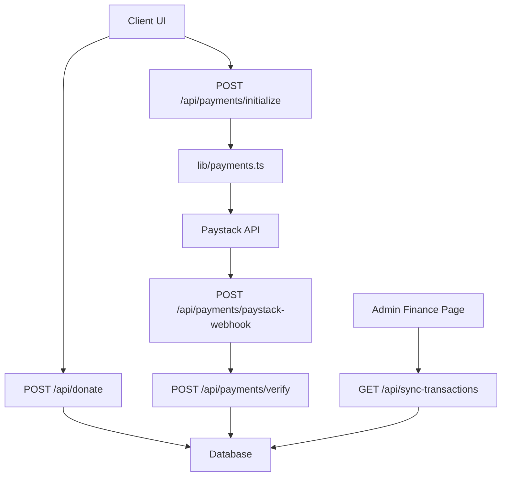

**Diagram sources**
- [route.ts:11-85](file://app/api/payments/initialize/route.ts#L11-L85)
- [route.ts:7-40](file://app/api/payments/paystack-webhook/route.ts#L7-L40)
- [route.ts:10-92](file://app/api/payments/verify/route.ts#L10-L92)
- [payments.ts:18-96](file://lib/payments.ts#L18-L96)
- [route.ts:6-59](file://app/api/donate/route.ts#L6-L59)
- [page.tsx:15-48](file://app/dashboard/admin/finance/page.tsx#L15-L48)
- [route.ts:8-114](file://app/api/sync-transactions/route.ts#L8-L114)

**Section sources**
- [route.ts:11-85](file://app/api/payments/initialize/route.ts#L11-L85)
- [route.ts:7-40](file://app/api/payments/paystack-webhook/route.ts#L7-L40)
- [route.ts:10-92](file://app/api/payments/verify/route.ts#L10-L92)
- [payments.ts:18-96](file://lib/payments.ts#L18-L96)
- [route.ts:6-59](file://app/api/donate/route.ts#L6-L59)
- [page.tsx:15-48](file://app/dashboard/admin/finance/page.tsx#L15-L48)
- [route.ts:8-114](file://app/api/sync-transactions/route.ts#L8-L114)

## Core Components
- Payment initialization: Creates a local payment record, resolves organization subaccount, initializes Paystack, and returns an authorization URL.
- Payment verification: Verifies against Paystack, updates status, sends receipt email, and logs audit events.
- Webhook handling: Validates signature, processes successful charges, and triggers program registration verification when applicable.
- Donation capture: Records donation payments and associates them with organizations based on jurisdiction metadata.
- Fee management: UI to create fees with target groups and due dates; client-side button to collect payments with minimum amounts and optional extra contributions.
- Campaigns: UI to create fundraising campaigns with targets and date ranges; payments update raised amounts on success.
- Reconciliation: Server utility to sync successful payments and paid programme registrations into finance transactions.
- Subaccounts: Admin UI and actions to manage bank details and link Paystack subaccounts per organization for revenue routing.

**Section sources**
- [route.ts:11-85](file://app/api/payments/initialize/route.ts#L11-L85)
- [route.ts:10-92](file://app/api/payments/verify/route.ts#L10-L92)
- [route.ts:7-40](file://app/api/payments/paystack-webhook/route.ts#L7-L40)
- [route.ts:6-59](file://app/api/donate/route.ts#L6-L59)
- [fee-form.tsx:75-91](file://components/admin/finance/fee-form.tsx#L75-L91)
- [create-campaign-dialog.tsx:64-86](file://components/admin/finance/create-campaign-dialog.tsx#L64-L86)
- [route.ts:8-114](file://app/api/sync-transactions/route.ts#L8-L114)
- [payment-settings.ts:44-79](file://lib/actions/payment-settings.ts#L44-L79)

## Architecture Overview
The system uses a hybrid flow:
- Server-side initialization via API route to securely call Paystack and persist payment records.
- Client-side inline checkout for donations and fees using Paystack JS, then server recording or verification.
- Webhook-driven event processing for reliable state changes.
- Admin reconciliation to ensure all inflows are recorded in finance transactions.

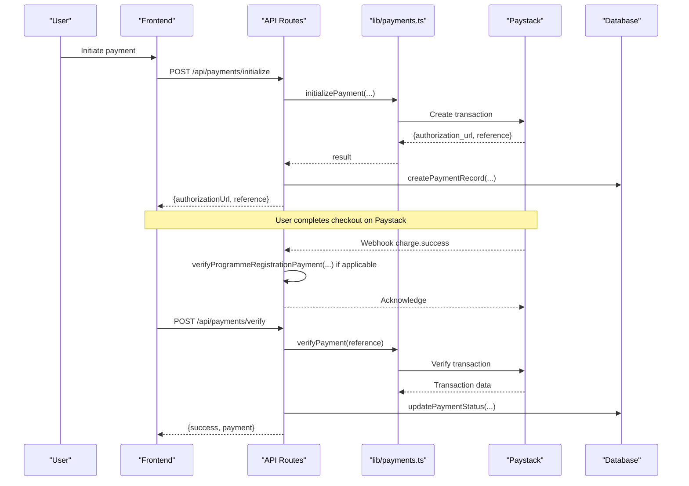

**Diagram sources**
- [route.ts:11-85](file://app/api/payments/initialize/route.ts#L11-L85)
- [payments.ts:18-96](file://lib/payments.ts#L18-L96)
- [route.ts:7-40](file://app/api/payments/paystack-webhook/route.ts#L7-L40)
- [route.ts:10-92](file://app/api/payments/verify/route.ts#L10-L92)

## Detailed Component Analysis

### Payment Initialization
- Resolves organization and optional Paystack subaccount code from organization settings.
- Persists a PENDING payment record with type, amount, description, and user/member context.
- Calls Paystack to initialize a transaction with callback URL and metadata.
- Updates the record with Paystack reference and logs an audit event.

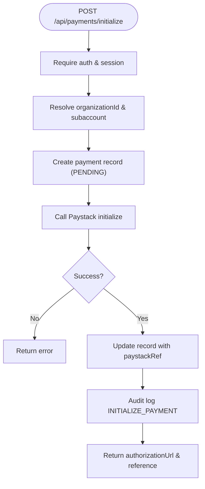

**Diagram sources**
- [route.ts:11-85](file://app/api/payments/initialize/route.ts#L11-L85)

**Section sources**
- [route.ts:11-85](file://app/api/payments/initialize/route.ts#L11-L85)

### Payment Verification
- Accepts a Paystack reference, verifies with Paystack, locates the local payment, and updates status to SUCCESS or FAILED.
- On success, generates and emails a PDF receipt and creates an audit log entry.

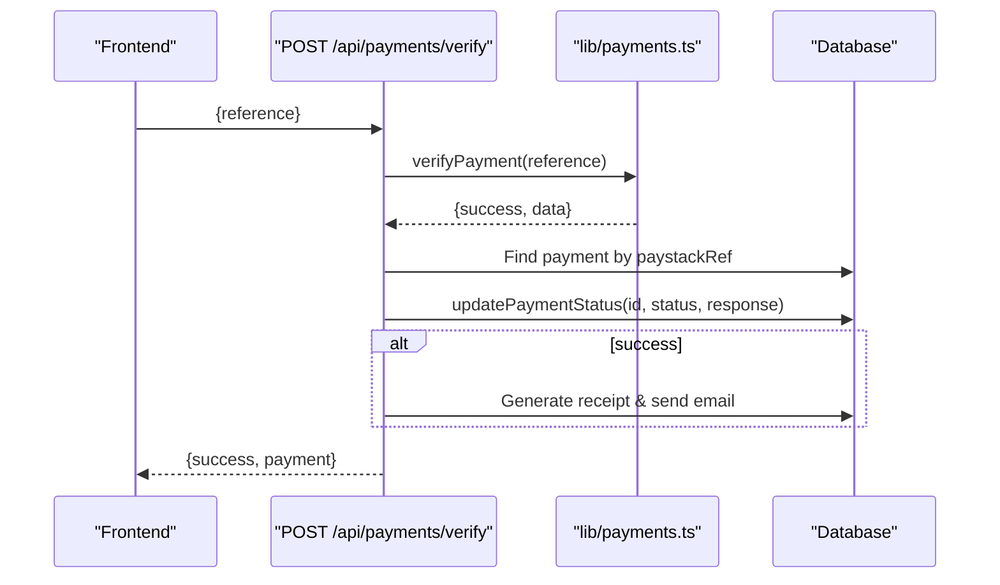

**Diagram sources**
- [route.ts:10-92](file://app/api/payments/verify/route.ts#L10-L92)
- [payments.ts:60-96](file://lib/payments.ts#L60-L96)

**Section sources**
- [route.ts:10-92](file://app/api/payments/verify/route.ts#L10-L92)

### Paystack Webhook Handling
- Validates request signature using HMAC-SHA512 and secret key.
- Processes charge.success events; for programme registrations with specific metadata, triggers verification logic.
- Returns success acknowledgment; logs errors for debugging.

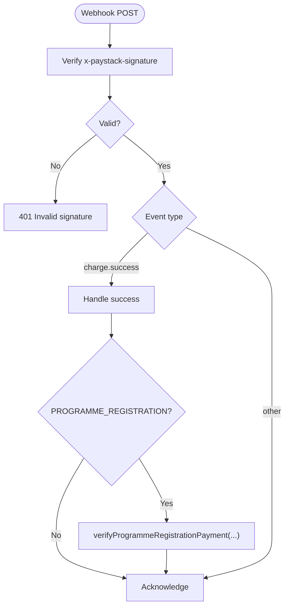

**Diagram sources**
- [route.ts:7-40](file://app/api/payments/paystack-webhook/route.ts#L7-L40)

**Section sources**
- [route.ts:7-40](file://app/api/payments/paystack-webhook/route.ts#L7-L40)

### Donation Processing
- Client collects donor info, jurisdiction, and amount; opens Paystack inline.
- On callback, posts reference and metadata to server to record donation and associate with organization.

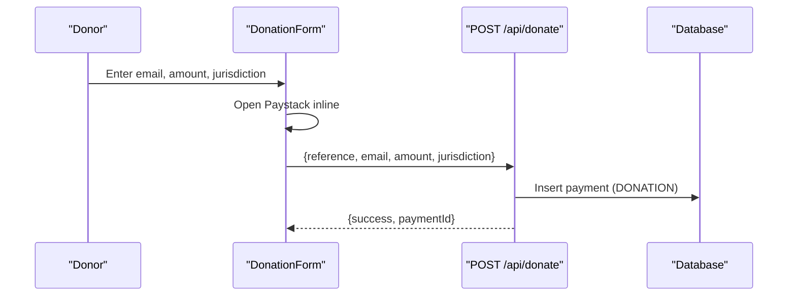

**Diagram sources**
- [donation-form.tsx:38-103](file://components/donation/donation-form.tsx#L38-L103)
- [route.ts:6-59](file://app/api/donate/route.ts#L6-L59)

**Section sources**
- [donation-form.tsx:38-103](file://components/donation/donation-form.tsx#L38-L103)
- [route.ts:6-59](file://app/api/donate/route.ts#L6-L59)

### Fee Management
- Admin creates fees with title, amount, target group, due date, and description.
- Frontend fee payment button enforces minimum amount, supports extra contributions, and records payment via action after Paystack callback.

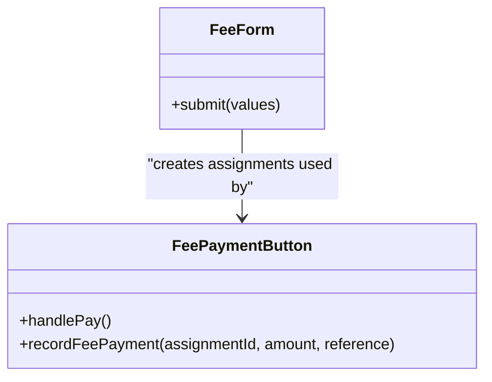

**Diagram sources**
- [fee-form.tsx:75-91](file://components/admin/finance/fee-form.tsx#L75-L91)
- [fee-payment-button.tsx:32-88](file://components/finance/fee-payment-button.tsx#L32-L88)

**Section sources**
- [fee-form.tsx:75-91](file://components/admin/finance/fee-form.tsx#L75-L91)
- [fee-payment-button.tsx:32-88](file://components/finance/fee-payment-button.tsx#L32-L88)

### Campaigns and Revenue Tracking
- Admin creates fundraising campaigns with target amounts and date ranges.
- Successful payments linked to campaigns increment raisedAmount; inflow entries created for accounting.

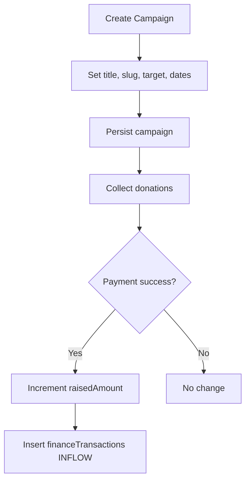

**Diagram sources**
- [create-campaign-dialog.tsx:64-86](file://components/admin/finance/create-campaign-dialog.tsx#L64-L86)
- [payments.ts:133-189](file://lib/payments.ts#L133-L189)

**Section sources**
- [create-campaign-dialog.tsx:64-86](file://components/admin/finance/create-campaign-dialog.tsx#L64-L86)
- [payments.ts:133-189](file://lib/payments.ts#L133-L189)

### Pricing and Early Bird Discounts
- Utility functions compute effective amount based on early bird deadline and provide labels for UI.

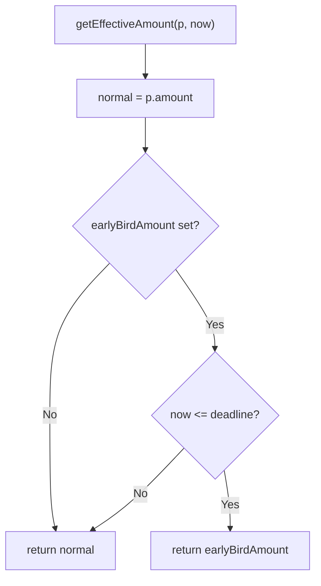

**Diagram sources**
- [pricing.ts:7-16](file://lib/pricing.ts#L7-L16)

**Section sources**
- [pricing.ts:7-16](file://lib/pricing.ts#L7-L16)

### Subaccount Management for Multi-Organization Billing
- Admin views hierarchy of organizations and their Paystack subaccount linkage status.
- Managers can save bank details and sync to create Paystack subaccounts; organization-level subaccount codes are used during payment initialization to route funds.

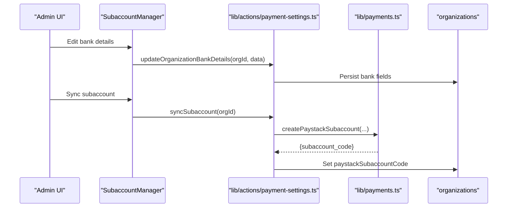

**Diagram sources**
- [subaccount-hierarchy.tsx:10-121](file://components/admin/settings/subaccount-hierarchy.tsx#L10-L121)
- [subaccount-manager.tsx:27-41](file://components/admin/settings/subaccount-manager.tsx#L27-L41)
- [payment-settings.ts:14-79](file://lib/actions/payment-settings.ts#L14-L79)
- [payments.ts:192-231](file://lib/payments.ts#L192-L231)

**Section sources**
- [subaccount-hierarchy.tsx:10-121](file://components/admin/settings/subaccount-hierarchy.tsx#L10-L121)
- [subaccount-manager.tsx:27-41](file://components/admin/settings/subaccount-manager.tsx#L27-L41)
- [page.tsx:15-75](file://app/dashboard/admin/settings/payments/page.tsx#L15-L75)
- [payment-settings.ts:14-79](file://lib/actions/payment-settings.ts#L14-L79)

### Reconciliation and Reporting
- Admin finance page displays recent payments, totals, and transaction history.
- Sync utility reconciles successful payments and paid programme registrations into finance transactions, preventing duplicates via metadata checks.

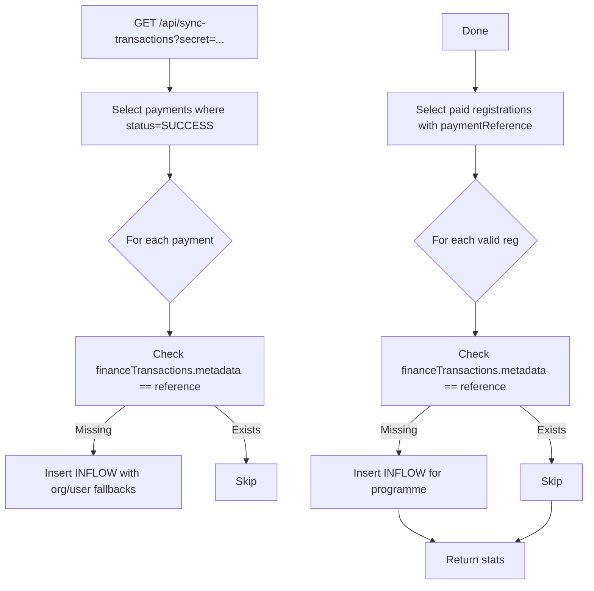

**Diagram sources**
- [route.ts:8-114](file://app/api/sync-transactions/route.ts#L8-L114)

**Section sources**
- [page.tsx:15-48](file://app/dashboard/admin/finance/page.tsx#L15-L48)
- [route.ts:8-114](file://app/api/sync-transactions/route.ts#L8-L114)

## Dependency Analysis
- API routes depend on lib/payments.ts for Paystack calls and database operations.
- Webhook handler depends on programme verification actions and database schema.
- Donation route depends on organizations and payments schemas.
- Admin finance page depends on payments, users, and organizations schemas.
- Sync utility depends on payments, programmeRegistrations, programmes, organizations, and users schemas.
- Subaccount management depends on organizations schema and lib/payments.ts.

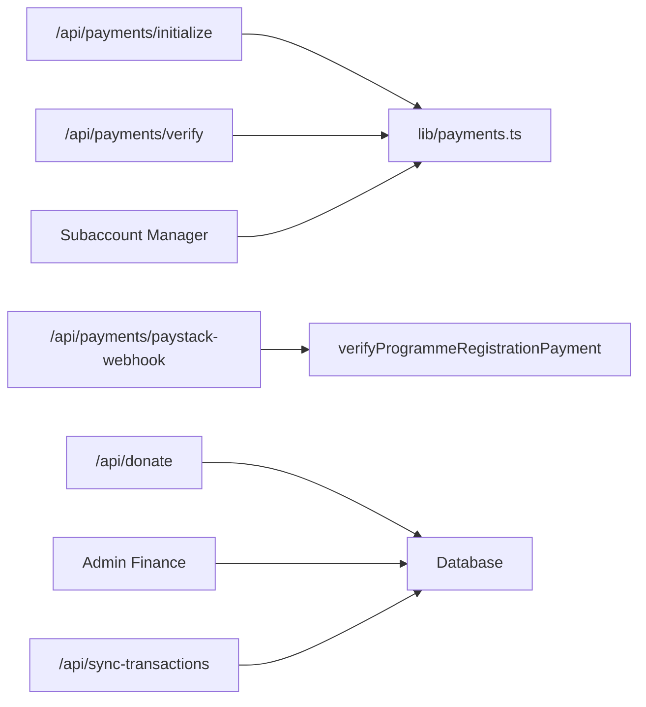

**Diagram sources**
- [route.ts:11-85](file://app/api/payments/initialize/route.ts#L11-L85)
- [route.ts:10-92](file://app/api/payments/verify/route.ts#L10-L92)
- [route.ts:7-40](file://app/api/payments/paystack-webhook/route.ts#L7-L40)
- [route.ts:6-59](file://app/api/donate/route.ts#L6-L59)
- [page.tsx:15-48](file://app/dashboard/admin/finance/page.tsx#L15-L48)
- [route.ts:8-114](file://app/api/sync-transactions/route.ts#L8-L114)
- [payment-settings.ts:44-79](file://lib/actions/payment-settings.ts#L44-L79)

**Section sources**
- [route.ts:11-85](file://app/api/payments/initialize/route.ts#L11-L85)
- [route.ts:10-92](file://app/api/payments/verify/route.ts#L10-L92)
- [route.ts:7-40](file://app/api/payments/paystack-webhook/route.ts#L7-L40)
- [route.ts:6-59](file://app/api/donate/route.ts#L6-L59)
- [page.tsx:15-48](file://app/dashboard/admin/finance/page.tsx#L15-L48)
- [route.ts:8-114](file://app/api/sync-transactions/route.ts#L8-L114)
- [payment-settings.ts:44-79](file://lib/actions/payment-settings.ts#L44-L79)

## Performance Considerations
- Use server-side initialization to minimize client exposure of secrets and reduce retry loops.
- Keep webhook handlers idempotent; rely on references and metadata to avoid duplicate processing.
- Batch queries in admin pages and sync jobs to reduce N+1 issues; current implementation filters IDs and fetches related entities in sets.
- Avoid heavy operations in webhooks; delegate long-running tasks (e.g., receipts) to background workers if needed.

[No sources needed since this section provides general guidance]

## Troubleshooting Guide
- Payment failures during initialization:
  - Check Paystack credentials and network connectivity.
  - Validate amount conversion to kobo and required fields.
  - Inspect error messages returned by Paystack and log them.

- Webhook signature mismatch:
  - Ensure the correct secret key is configured and that the raw body is hashed exactly as sent.
  - Confirm headers include x-paystack-signature.

- Duplicate or missing finance transactions:
  - Run the sync utility with the correct secret to reconcile.
  - Verify metadata uniqueness checks prevent duplicates.

- Receipt generation or email delivery issues:
  - Review error logs around receipt creation and email sending; these are non-fatal to verification but should be addressed.

- Subaccount linking problems:
  - Ensure organization has complete bank details before syncing.
  - Check Paystack API responses and organization paystackSubaccountCode updates.

**Section sources**
- [payments.ts:18-96](file://lib/payments.ts#L18-L96)
- [route.ts:7-40](file://app/api/payments/paystack-webhook/route.ts#L7-L40)
- [route.ts:8-114](file://app/api/sync-transactions/route.ts#L8-L114)
- [payment-settings.ts:44-79](file://lib/actions/payment-settings.ts#L44-L79)

## Conclusion
The TMC Portal financial system integrates Paystack for secure Nigerian payments, supports configurable fees and campaigns, and provides robust reconciliation and reporting. Subaccount routing enables multi-organization billing and revenue sharing. The architecture balances client convenience with server-side security and reliability, while offering tools for auditing, receipts, and administrative oversight.

[No sources needed since this section summarizes without analyzing specific files]