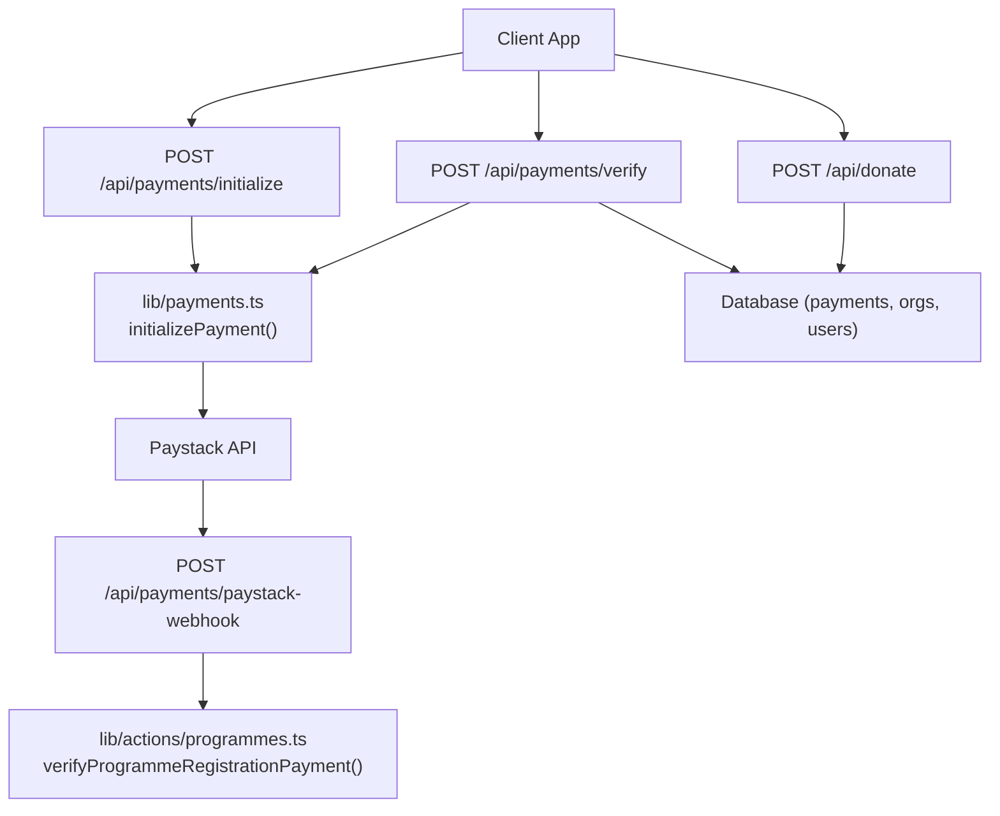
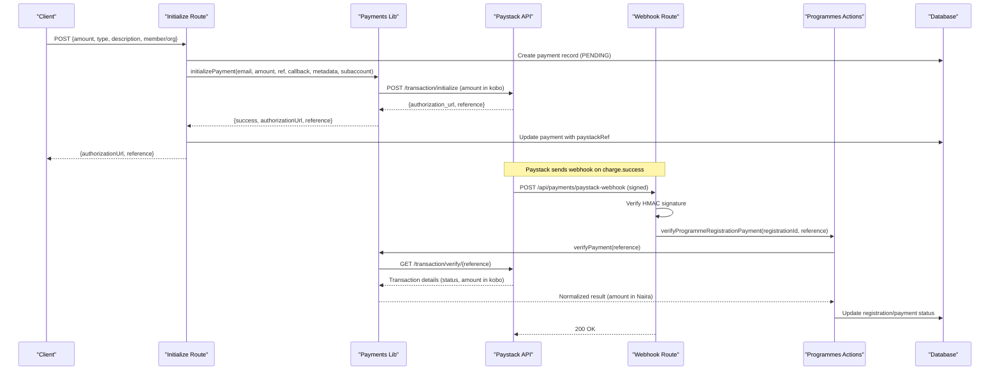
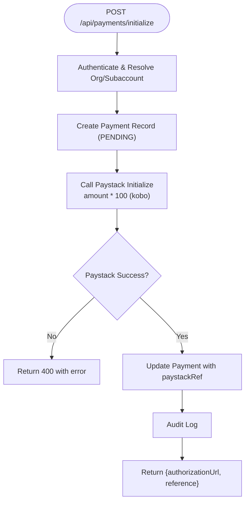
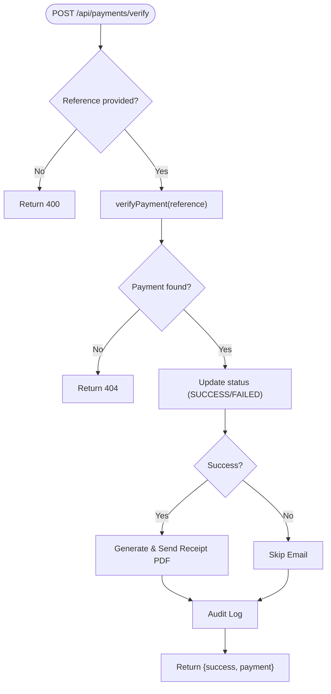
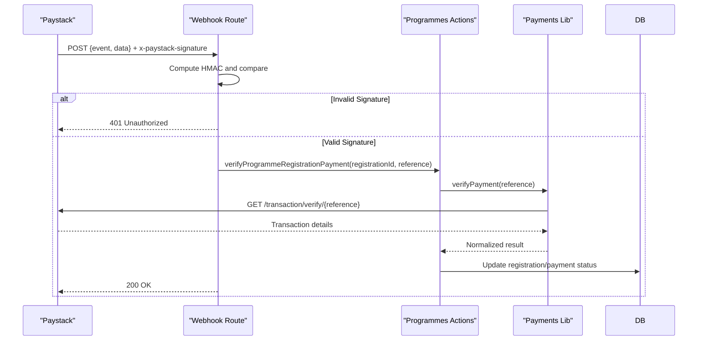
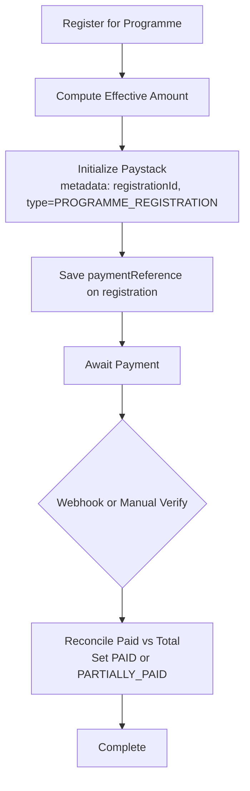
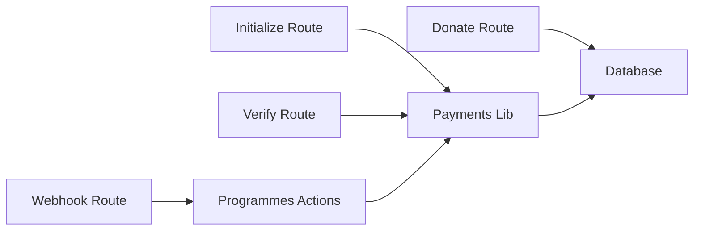

# Payment Processing & Paystack Integration

<cite>
**Referenced Files in This Document**
- [route.ts](file://app/api/payments/initialize/route.ts)
- [route.ts](file://app/api/payments/paystack-webhook/route.ts)
- [route.ts](file://app/api/payments/verify/route.ts)
- [payments.ts](file://lib/payments.ts)
- [programmes.ts](file://lib/actions/programmes.ts)
- [route.ts](file://app/api/payments/receipt/[id]/route.ts)
- [route.ts](file://app/api/donate/route.ts)
</cite>

## Table of Contents
1. Introduction
2. Project Structure
3. Core Components
4. Architecture Overview
5. Detailed Component Analysis
6. Dependency Analysis
7. Performance Considerations
8. Troubleshooting Guide
9. Conclusion
10. Appendices

## Introduction
This document explains the TMC Portal’s payment processing system integrated with Paystack. It covers the full lifecycle from payment initialization to verification and real-time webhook handling, including amount conversion between Naira and kobo, metadata usage, callback URLs, subaccount routing for multi-organization billing, error handling patterns, retry strategies, transaction state management, and security considerations such as API key management, webhook signature verification, and PCI compliance guidance.

## Project Structure
The payment system is implemented as a set of Next.js API routes and shared server-side logic:
- Initialization: app/api/payments/initialize
- Verification: app/api/payments/verify
- Webhooks: app/api/paycasts/paystack-webhook
- Receipts: app/api/payments/receipt/[id]
- Donation recording: app/api/donate
- Shared payment utilities: lib/payments.ts
- Programme registration integration: lib/actions/programmes.ts

**Diagram sources**
- [route.ts:11-88](file://app/api/payments/initialize/route.ts#L11-L88)
- [route.ts:10-92](file://app/api/payments/verify/route.ts#L10-L92)
- [route.ts:7-40](file://app/api/payments/paystack-webhook/route.ts#L7-L40)
- [payments.ts:18-96](file://lib/payments.ts#L18-L96)
- [programmes.ts:1343-1399](file://lib/actions/programmes.ts#L1343-L1399)
- [programmes.ts:1405-1430](file://lib/actions/programmes.ts#L1405-L1430)
- [route.ts:6-59](file://app/api/donate/route.ts#L6-L59)

**Section sources**
- [route.ts:11-88](file://app/api/payments/initialize/route.ts#L11-L88)
- [route.ts:10-92](file://app/api/payments/verify/route.ts#L10-L92)
- [route.ts:7-40](file://app/api/payments/paystack-webhook/route.ts#L7-L40)
- [payments.ts:18-96](file://lib/payments.ts#L18-L96)
- [programmes.ts:1343-1399](file://lib/actions/programmes.ts#L1343-L1399)
- [programmes.ts:1405-1430](file://lib/actions/programmes.ts#L1405-L1430)
- [route.ts:6-59](file://app/api/donate/route.ts#L6-L59)

## Core Components
- initializePayment: Creates a Paystack transaction, converting amounts from Naira to kobo, attaching metadata, optional subaccount, and callback URL.
- verifyPayment: Verifies a transaction by reference and returns normalized data, converting amounts back to Naira.
- createPaymentRecord/updatePaymentStatus: Persists payments, updates status on success, records finance inflows, and timestamps paidAt only once.
- paystack-webhook handler: Validates signatures and dispatches event handling (e.g., programme registration verification).
- Donation endpoint: Records donations with jurisdiction context and marks them as successful at ingestion time.

Key behaviors:
- Amount conversion: Naira to kobo on send; kobo to Naira on receive.
- Subaccount routing: Optional per organization or programme to route funds correctly.
- Metadata: Carries internal IDs (paymentId, userId, memberId, registrationId) across flows.
- Audit logging: Actions are logged for traceability.

**Section sources**
- [payments.ts:18-96](file://lib/payments.ts#L18-L96)
- [payments.ts:100-190](file://lib/payments.ts#L100-L190)
- [route.ts:11-88](file://app/api/payments/initialize/route.ts#L11-L88)
- [route.ts:10-92](file://app/api/payments/verify/route.ts#L10-L92)
- [route.ts:7-40](file://app/api/payments/paystack-webhook/route.ts#L7-L40)
- [route.ts:6-59](file://app/api/donate/route.ts#L6-L59)

## Architecture Overview
The payment flow spans client actions, server endpoints, Paystack API, database, and webhooks.

**Diagram sources**
- [route.ts:11-88](file://app/api/payments/initialize/route.ts#L11-L88)
- [payments.ts:18-96](file://lib/payments.ts#L18-L96)
- [route.ts:7-40](file://app/api/payments/paystack-webhook/route.ts#L7-L40)
- [programmes.ts:1343-1399](file://lib/actions/programmes.ts#L1343-L1399)
- [programmes.ts:1405-1430](file://lib/actions/programmes.ts#L1405-L1430)

## Detailed Component Analysis

### Initialize Payment Endpoint
Responsibilities:
- Authenticate user and resolve target organization/subaccount.
- Create a pending payment record.
- Call Paystack to initialize a transaction with amount converted to kobo.
- Attach metadata (paymentId, userId, memberId) and optional subaccount code.
- Persist Paystack reference and return authorization URL.

Error handling:
- Returns 400 on initialization failure with message.
- Returns 500 on unexpected errors.

Security:
- Requires authenticated session and RBAC guard.
- Uses environment-based secret key for Paystack.

**Diagram sources**
- [route.ts:11-88](file://app/api/payments/initialize/route.ts#L11-L88)
- [payments.ts:18-58](file://lib/payments.ts#L18-L58)

**Section sources**
- [route.ts:11-88](file://app/api/payments/initialize/route.ts#L11-L88)
- [payments.ts:18-58](file://lib/payments.ts#L18-L58)

### Verify Payment Endpoint
Responsibilities:
- Accept a Paystack reference.
- Verify via Paystack API and normalize response (convert kobo to Naira).
- Locate local payment by reference and update status to SUCCESS or FAILED.
- On success, generate and email a receipt PDF.
- Log audit action.

Error handling:
- 400 if missing reference or verification fails.
- 404 if payment not found.
- 500 on unexpected errors.

**Diagram sources**
- [route.ts:10-92](file://app/api/payments/verify/route.ts#L10-L92)
- [payments.ts:60-96](file://lib/payments.ts#L60-L96)

**Section sources**
- [route.ts:10-92](file://app/api/payments/verify/route.ts#L10-L92)
- [payments.ts:60-96](file://lib/payments.ts#L60-L96)

### Paystack Webhook Handler
Responsibilities:
- Validate request signature using HMAC-SHA512 with secret key.
- Handle specific events (e.g., charge.success).
- For programme registrations, call verification function to reconcile payment and update registration status.

Security:
- Rejects requests with invalid signatures (401).
- Uses environment variable for secret key.

**Diagram sources**
- [route.ts:7-40](file://app/api/payments/paystack-webhook/route.ts#L7-L40)
- [programmes.ts:1405-1430](file://lib/actions/programmes.ts#L1405-L1430)
- [payments.ts:60-96](file://lib/payments.ts#L60-L96)

**Section sources**
- [route.ts:7-40](file://app/api/payments/paystack-webhook/route.ts#L7-L40)
- [programmes.ts:1405-1430](file://lib/actions/programmes.ts#L1405-L1430)

### Donation Recording Endpoint
Responsibilities:
- Accept donation payload with reference, email, amount, and jurisdiction.
- Resolve organization based on jurisdiction level/name.
- Insert a payment record marked as SUCCESS with DONATION type.
- Store metadata including email and jurisdiction.

Notes:
- Assumes client-side confirmation; backend verification against Paystack can be added for stronger assurance.

**Section sources**
- [route.ts:6-59](file://app/api/donate/route.ts#L6-L59)

### Programme Registration Payment Flow
Responsibilities:
- Calculate effective amount (early bird, waivers, installments).
- Initialize Paystack with metadata indicating PROGRAMME_REGISTRATION and current installment amount.
- Store payment reference on registration.
- On webhook or manual verify, reconcile partial/full payments and update status accordingly.

**Diagram sources**
- [programmes.ts:1343-1399](file://lib/actions/programmes.ts#L1343-L1399)
- [programmes.ts:1405-1430](file://lib/actions/programmes.ts#L1405-L1430)

**Section sources**
- [programmes.ts:1343-1399](file://lib/actions/programmes.ts#L1343-L1399)
- [programmes.ts:1405-1430](file://lib/actions/programmes.ts#L1405-L1430)

### Receipt Generation
Responsibilities:
- Generate PDF receipts for successful payments.
- Enforce access control (user owns payment or admin).
- Only allow download for SUCCESS payments.

**Section sources**
- [route.ts:8-68](file://app/api/payments/receipt/[id]/route.ts#L8-L68)

## Dependency Analysis
- API routes depend on shared payment library for Paystack interactions and database operations.
- Webhook handler depends on programmes actions to reconcile registration payments.
- Donation endpoint directly inserts into payments table with contextual metadata.
- All components rely on environment variables for Paystack keys and application URLs.

**Diagram sources**
- [route.ts:11-88](file://app/api/payments/initialize/route.ts#L11-L88)
- [route.ts:10-92](file://app/api/payments/verify/route.ts#L10-L92)
- [route.ts:7-40](file://app/api/payments/paystack-webhook/route.ts#L7-L40)
- [payments.ts:18-96](file://lib/payments.ts#L18-L96)
- [programmes.ts:1343-1399](file://lib/actions/programmes.ts#L1343-L1399)
- [route.ts:6-59](file://app/api/donate/route.ts#L6-L59)

**Section sources**
- [route.ts:11-88](file://app/api/payments/initialize/route.ts#L11-L88)
- [route.ts:10-92](file://app/api/payments/verify/route.ts#L10-L92)
- [route.ts:7-40](file://app/api/payments/paystack-webhook/route.ts#L7-L40)
- [payments.ts:18-96](file://lib/payments.ts#L18-L96)
- [programmes.ts:1343-1399](file://lib/actions/programmes.ts#L1343-L1399)
- [route.ts:6-59](file://app/api/donate/route.ts#L6-L59)

## Performance Considerations
- Use idempotent handlers: Ensure webhook processing is safe to retry (e.g., verify before updating).
- Batch reconciliation: For high volume, consider periodic sync jobs to verify pending payments.
- Minimize external calls: Cache Paystack bank lists or other static data if frequently accessed.
- Avoid blocking: Offload heavy tasks like PDF generation and email sending to background workers where possible.

[No sources needed since this section provides general guidance]

## Troubleshooting Guide
Common issues and resolutions:
- Invalid webhook signature: Ensure PAYSTACK_SECRET_KEY is correctly set and that the HMAC computation matches Paystack’s expected format.
- Missing reference in verify: Validate client input and ensure reference is persisted during initialization.
- Payment not found: Confirm that paystackRef was saved during initialization and query uses correct field.
- Duplicate payments: Implement idempotency checks in webhook handler to avoid double-updates.
- Amount mismatch: Verify kobo/Naira conversions in both directions and ensure consistent currency handling.

Operational tips:
- Enable detailed logging around Paystack calls and database updates.
- Add retries with exponential backoff for transient network failures when calling Paystack.
- Monitor failed webhooks and provide a mechanism to reprocess.

**Section sources**
- [route.ts:7-40](file://app/api/payments/paystack-webhook/route.ts#L7-L40)
- [route.ts:10-92](file://app/api/payments/verify/route.ts#L10-L92)
- [payments.ts:18-96](file://lib/payments.ts#L18-L96)

## Conclusion
The TMC Portal integrates Paystack through a robust set of endpoints and shared utilities that handle initialization, verification, webhooks, receipts, and donations. The system converts amounts appropriately, supports multi-organization billing via subaccounts, and maintains clear transaction states. Security measures include signature verification and environment-scoped secrets. For production resilience, add idempotency, retries, and background processing for non-critical tasks.

[No sources needed since this section summarizes without analyzing specific files]

## Appendices

### Implementation Examples by Scenario

- Membership Fees
  - Initialize: Call POST /api/payments/initialize with amount in Naira, type MEMBERSHIP_FEE, and optional organizationId to route via subaccount.
  - Verify: Call POST /api/payments/verify with the returned reference.
  - Receipt: Download PDF from /api/payments/receipt/{id} after success.

- Programme Registrations
  - Register: Use programme registration flow to compute effective amount and initialize payment with metadata type PROGRAMME_REGISTRATION.
  - Webhook: Paystack triggers webhook; handler verifies and reconciles partial/full payments.
  - Manual Verify: Use /programmes/registrations/{id}/verify?reference={ref} to reconcile manually.

- Donations
  - Record: POST /api/donate with reference, email, amount, and jurisdiction context.
  - Note: Backend assumes success from client; consider adding server-side verification for stronger assurance.

**Section sources**
- [route.ts:11-88](file://app/api/payments/initialize/route.ts#L11-L88)
- [route.ts:10-92](file://app/api/payments/verify/route.ts#L10-L92)
- [route.ts:8-68](file://app/api/payments/receipt/[id]/route.ts#L8-L68)
- [programmes.ts:1343-1399](file://lib/actions/programmes.ts#L1343-L1399)
- [programmes.ts:1405-1430](file://lib/actions/programmes.ts#L1405-L1430)
- [route.ts:6-59](file://app/api/donate/route.ts#L6-L59)

### Error Handling Patterns and Retry Mechanisms
- Initialization: Return structured errors with messages; log exceptions for diagnostics.
- Verification: Return appropriate HTTP codes (400, 404, 500) and log errors.
- Webhook: Validate signatures early; return 401 on invalid; handle known events gracefully; log unknown events.
- Retries: Implement exponential backoff for Paystack API calls; mark transient failures for later retry.

**Section sources**
- [payments.ts:18-96](file://lib/payments.ts#L18-L96)
- [route.ts:10-92](file://app/api/payments/verify/route.ts#L10-L92)
- [route.ts:7-40](file://app/api/payments/paystack-webhook/route.ts#L7-L40)

### Transaction State Management
- States: PENDING -> SUCCESS/FAILED; for programmes, also PARTIALLY_PAID -> PAID.
- First-time success: Set paidAt only once; record finance inflow and update campaign totals if applicable.
- Idempotency: Ensure updates do not duplicate inflows or change paidAt multiple times.

**Section sources**
- [payments.ts:100-190](file://lib/payments.ts#L100-L190)
- [programmes.ts:1405-1430](file://lib/actions/programmes.ts#L1405-L1430)

### Security Considerations
- API Key Management: Store Paystack keys in environment variables; never expose secrets in client code.
- Webhook Signature Verification: Use HMAC-SHA512 with secret key to validate incoming webhooks.
- PCI Compliance: Do not handle raw card data; rely on Paystack-hosted checkout and tokens; ensure HTTPS everywhere; restrict access to sensitive endpoints; maintain audit logs.

**Section sources**
- [route.ts:7-40](file://app/api/payments/paystack-webhook/route.ts#L7-L40)
- [payments.ts:18-96](file://lib/payments.ts#L18-L96)