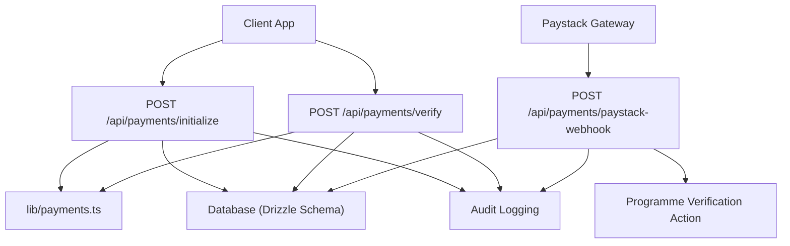
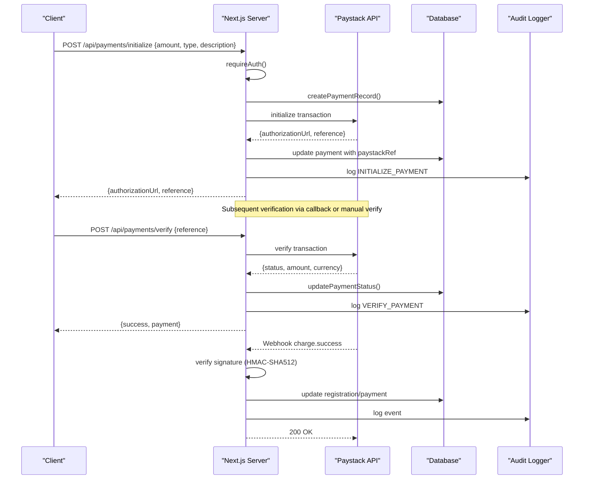
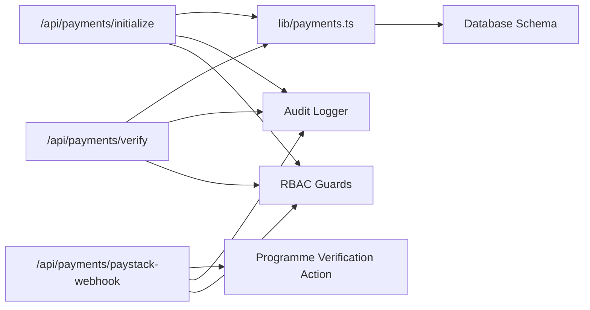

# Security & Compliance

<cite>
**Referenced Files in This Document**
- [route.ts](file://app/api/payments/paystack-webhook/route.ts)
- [route.ts](file://app/api/payments/initialize/route.ts)
- [route.ts](file://app/api/payments/verify/route.ts)
- [payments.ts](file://lib/payments.ts)
- [crypto.ts](file://lib/crypto.ts)
- [auth.config.ts](file://lib/auth.config.ts)
- [audit.ts](file://lib/audit.ts)
- [schema.ts](file://lib/db/schema.ts)
- [route.ts](file://app/api/auth/keys/route.ts)
- [rbac.ts](file://lib/rbac.ts)
- [rbac-v2.ts](file://lib/rbac-v2.ts)
- [validators.ts](file://lib/validators.ts)
- [DEPLOYMENT_GUIDE_SERVER.md](file://DEPLOYMENT_GUIDE_SERVER.md)
</cite>

## Table of Contents
1. Introduction
2. Project Structure
3. Core Components
4. Architecture Overview
5. Detailed Component Analysis
6. Dependency Analysis
7. Performance Considerations
8. Troubleshooting Guide
9. Conclusion
10. Appendices

## Introduction
This document provides comprehensive security and compliance guidance for the TMC Portal’s financial system. It focuses on secure payment processing, webhook integrity, environment and secret management, sensitive data handling, encryption practices, fraud prevention, Nigerian regulatory considerations, developer best practices, and incident response procedures. The content is grounded in the repository’s implementation details and highlights where additional controls are recommended to meet PCI DSS and data protection requirements.

## Project Structure
The financial system centers around Next.js API routes for payments, a shared payment library, cryptographic utilities, authentication configuration, RBAC enforcement, audit logging, and database schema definitions. Key areas include:
- Payment initialization and verification endpoints
- Paystack webhook handler with signature verification
- Secure storage and retrieval of E2EE keys
- Audit logging for financial actions
- RBAC guards for authorization
- Environment-based secrets for third-party integrations

**Diagram sources**
- [route.ts:11-89](file://app/api/payments/initialize/route.ts#L11-L89)
- [route.ts:10-92](file://app/api/payments/verify/route.ts#L10-L92)
- [route.ts:7-40](file://app/api/payments/paystack-webhook/route.ts#L7-L40)
- [payments.ts:18-96](file://lib/payments.ts#L18-L96)
- [audit.ts:17-34](file://lib/audit.ts#L17-L34)
- [schema.ts:149-188](file://lib/db/schema.ts#L149-L188)

**Section sources**
- [route.ts:11-89](file://app/api/payments/initialize/route.ts#L11-L89)
- [route.ts:10-92](file://app/api/payments/verify/route.ts#L10-L92)
- [route.ts:7-40](file://app/api/payments/paystack-webhook/route.ts#L7-L40)
- [payments.ts:18-96](file://lib/payments.ts#L18-L96)
- [audit.ts:17-34](file://lib/audit.ts#L17-L34)
- [schema.ts:149-188](file://lib/db/schema.ts#L149-L188)

## Core Components
- Payment Initialization: Authenticates user, resolves organization subaccount, creates a payment record, initializes Paystack transaction, updates record with provider reference, and logs audit events.
- Payment Verification: Verifies against Paystack, updates status, sends receipt email, and logs audit events.
- Webhook Handler: Validates Paystack webhook signature using HMAC-SHA512 and processes successful charge events to update programme registrations.
- Encryption Utilities: Provides E2EE key generation, PIN-derived key wrapping/unwrapping, message encryption/decryption, and file encryption helpers.
- Authentication and Authorization: JWT session strategy with secrets from environment; RBAC guards enforce access control.
- Audit Logging: Records financial actions with context such as user, entity, IP, and metadata.

**Section sources**
- [route.ts:11-89](file://app/api/payments/initialize/route.ts#L11-L89)
- [route.ts:10-92](file://app/api/payments/verify/route.ts#L10-L92)
- [route.ts:7-40](file://app/api/payments/paystack-webhook/route.ts#L7-L40)
- [crypto.ts:53-185](file://lib/crypto.ts#L53-L185)
- [auth.config.ts:3-11](file://lib/auth.config.ts#L3-L11)
- [rbac.ts:162-192](file://lib/rbac.ts#L162-L192)
- [audit.ts:17-34](file://lib/audit.ts#L17-L34)

## Architecture Overview
The payment flow integrates client requests, server-side validation, Paystack gateway interactions, and internal state updates with robust auditing and security checks.

**Diagram sources**
- [route.ts:11-89](file://app/api/payments/initialize/route.ts#L11-L89)
- [route.ts:10-92](file://app/api/payments/verify/route.ts#L10-L92)
- [route.ts:7-40](file://app/api/payments/paystack-webhook/route.ts#L7-L40)
- [payments.ts:18-96](file://lib/payments.ts#L18-L96)
- [audit.ts:17-34](file://lib/audit.ts#L17-L34)

## Detailed Component Analysis

### Payment Initialization Endpoint
- Enforces authentication and authorization before creating payment records.
- Resolves organization-level Paystack subaccount routing when configured.
- Creates an internal payment record with initial PENDING status.
- Initializes Paystack transaction with amount conversion to smallest currency unit and includes metadata for traceability.
- Updates the payment record with provider reference and logs audit events.

Security considerations:
- Ensure environment variables for Paystack keys are not exposed to clients.
- Validate amounts and types server-side to prevent tampering.
- Use HTTPS and restrict CORS to trusted origins.

**Section sources**
- [route.ts:11-89](file://app/api/payments/initialize/route.ts#L11-L89)
- [payments.ts:18-58](file://lib/payments.ts#L18-L58)
- [audit.ts:17-34](file://lib/audit.ts#L17-L34)

### Payment Verification Endpoint
- Accepts a payment reference and verifies it with Paystack.
- Updates local payment status based on provider response.
- Generates and emails receipts upon success.
- Logs verification actions for auditability.

Security considerations:
- Do not expose raw provider error messages to clients; sanitize responses.
- Avoid logging sensitive fields like full card numbers or CVV.
- Ensure idempotency by checking existing statuses before updates.

**Section sources**
- [route.ts:10-92](file://app/api/payments/verify/route.ts#L10-L92)
- [payments.ts:60-96](file://lib/payments.ts#L60-L96)
- [audit.ts:17-34](file://lib/audit.ts#L17-L34)

### Paystack Webhook Handler
- Reads request body and extracts signature header.
- Computes HMAC-SHA512 hash using the secret key and compares to the provided signature.
- Processes only expected events (e.g., charge.success) and validates metadata to target specific business entities.
- Returns appropriate HTTP status codes and logs errors without leaking internals.

Security considerations:
- Reject requests with invalid signatures immediately.
- Implement rate limiting and IP allowlisting at the edge (reverse proxy/WAF).
- Validate payload structure and enforce strict field expectations.

**Section sources**
- [route.ts:7-40](file://app/api/payments/paystack-webhook/route.ts#L7-L40)

### Encryption and Key Management
- Uses Web Crypto API for RSA-OAEP key pairs and AES-GCM symmetric encryption.
- Derives encryption keys from user PINs using PBKDF2 with high iteration counts.
- Wraps/unwraps private keys with derived keys and supports recovery key hashing.
- Encrypts messages and files with per-message random IVs.

Security considerations:
- Store only encrypted private keys and salts; never store plaintext secrets.
- Rotate recovery mechanisms securely and limit access.
- Ensure client-side crypto operations run in secure contexts (HTTPS).

**Section sources**
- [crypto.ts:53-185](file://lib/crypto.ts#L53-L185)
- [crypto.ts:191-284](file://lib/crypto.ts#L191-L284)
- [route.ts:16-41](file://app/api/auth/keys/route.ts#L16-L41)
- [schema.ts:84-105](file://lib/db/schema.ts#L84-L105)

### Authentication and Authorization
- Configures NextAuth with JWT sessions and a server-side secret from environment.
- Enforces authentication and role/permission checks via RBAC functions.
- Restricts access to financial endpoints to authenticated users with appropriate roles.

Security considerations:
- Generate strong secrets and rotate periodically.
- Limit session lifetime and enforce secure cookie settings.
- Apply least privilege principles across roles and permissions.

**Section sources**
- [auth.config.ts:3-11](file://lib/auth.config.ts#L3-L11)
- [rbac.ts:162-192](file://lib/rbac.ts#L162-L192)
- [rbac-v2.ts:315-360](file://lib/rbac-v2.ts#L315-L360)

### Audit Logging
- Captures critical financial actions with contextual metadata.
- Ensures failures in audit logging do not break core flows.
- Supports querying logs for compliance and investigations.

Security considerations:
- Protect audit logs with strict access controls.
- Avoid including sensitive data in descriptions or metadata.
- Retain logs per retention policies and ensure integrity.

**Section sources**
- [audit.ts:17-34](file://lib/audit.ts#L17-L34)
- [audit.ts:36-71](file://lib/audit.ts#L36-L71)

## Dependency Analysis
The financial module depends on:
- External payment provider (Paystack) for transaction lifecycle
- Database schema for payments, organizations, and finance transactions
- Authentication and RBAC for access control
- Cryptographic utilities for secure key handling
- Audit logging for compliance and traceability

**Diagram sources**
- [route.ts:11-89](file://app/api/payments/initialize/route.ts#L11-L89)
- [route.ts:10-92](file://app/api/payments/verify/route.ts#L10-L92)
- [route.ts:7-40](file://app/api/payments/paystack-webhook/route.ts#L7-L40)
- [payments.ts:18-96](file://lib/payments.ts#L18-L96)
- [audit.ts:17-34](file://lib/audit.ts#L17-L34)
- [rbac.ts:162-192](file://lib/rbac.ts#L162-L192)

**Section sources**
- [payments.ts:18-96](file://lib/payments.ts#L18-L96)
- [schema.ts:149-188](file://lib/db/schema.ts#L149-L188)
- [rbac.ts:162-192](file://lib/rbac.ts#L162-L192)
- [audit.ts:17-34](file://lib/audit.ts#L17-L34)

## Performance Considerations
- Minimize network calls by batching verification where possible and caching non-sensitive results.
- Use connection pooling for database queries and external APIs.
- Implement idempotent handlers for webhooks to avoid duplicate processing under retries.
- Monitor latency and error rates for Paystack integration and set timeouts/retries appropriately.

[No sources needed since this section provides general guidance]

## Troubleshooting Guide
Common issues and mitigations:
- Invalid webhook signature: Ensure correct secret key usage and consistent JSON serialization for HMAC computation.
- Payment verification failures: Check provider connectivity, reference validity, and status mapping logic.
- Receipt generation/email failures: Fail gracefully without breaking verification flow; log errors for review.
- Unauthorized access: Confirm session validity and RBAC checks; enforce minimum required roles.

Operational steps:
- Inspect audit logs for action traces and timestamps.
- Validate environment variables and secrets configuration.
- Review error responses and sanitize any sensitive details before exposing to clients.

**Section sources**
- [route.ts:7-40](file://app/api/payments/paystack-webhook/route.ts#L7-L40)
- [route.ts:10-92](file://app/api/payments/verify/route.ts#L10-L92)
- [audit.ts:17-34](file://lib/audit.ts#L17-L34)

## Conclusion
The TMC Portal’s financial system implements foundational security measures including authenticated payment flows, webhook signature verification, encryption utilities for key management, and audit logging. To strengthen compliance and resilience, adopt input validation, rate limiting, strict error handling, PCI DSS-aligned data handling, and robust incident response procedures aligned with Nigerian regulations.

[No sources needed since this section summarizes without analyzing specific files]

## Appendices

### Secure API Key Management and Environment Variables
- Store Paystack secret/public keys and authentication secrets exclusively in environment variables; never commit them to version control.
- Use deployment configurations that isolate secrets per environment and restrict access to authorized personnel.
- Rotate secrets regularly and maintain a secure vault for production deployments.

**Section sources**
- [DEPLOYMENT_GUIDE_SERVER.md:28-56](file://DEPLOYMENT_GUIDE_SERVER.md#L28-L56)
- [auth.config.ts:3-11](file://lib/auth.config.ts#L3-L11)
- [payments.ts:6-8](file://lib/payments.ts#L6-L8)

### Webhook Security Practices
- Signature verification: Compute HMAC-SHA512 over the exact request body using the secret key and compare to the provided signature header.
- Rate limiting: Enforce limits at the reverse proxy or WAF to mitigate abuse.
- Input validation: Strictly validate payload fields and reject unexpected structures.

**Section sources**
- [route.ts:7-40](file://app/api/payments/paystack-webhook/route.ts#L7-L40)

### PCI DSS Compliance Considerations
- Do not store sensitive authentication data (full PAN, CVV, track data) in application databases or logs.
- Rely on tokenization and provider-hosted payment pages; store only references and minimal metadata.
- Encrypt data in transit (TLS) and at rest where applicable; minimize data retention.

[No sources needed since this section provides general guidance]

### Error Handling Guidelines
- Return generic error messages to clients; log detailed errors server-side.
- Avoid echoing provider error payloads directly to clients.
- Ensure audit logs capture sufficient context without sensitive data.

**Section sources**
- [route.ts:10-92](file://app/api/payments/verify/route.ts#L10-L92)
- [audit.ts:17-34](file://lib/audit.ts#L17-L34)

### Encryption Practices for Sensitive Data
- Use E2EE for storing and managing cryptographic keys; derive keys from user-provided secrets with strong KDF parameters.
- Encrypt messages and files with per-operation random IVs and secure algorithms.
- Store only encrypted artifacts and hashes for recovery mechanisms.

**Section sources**
- [crypto.ts:53-185](file://lib/crypto.ts#L53-L185)
- [crypto.ts:191-284](file://lib/crypto.ts#L191-L284)
- [route.ts:16-41](file://app/api/auth/keys/route.ts#L16-L41)
- [schema.ts:84-105](file://lib/db/schema.ts#L84-L105)

### Fraud Prevention Measures
- Transaction monitoring: Track anomalies in amounts, frequencies, and patterns; alert on suspicious activity.
- Duplicate payment detection: Enforce idempotency and deduplicate webhook events using unique references.
- Suspicious activity alerts: Integrate thresholds and rules to flag potential fraud for review.

[No sources needed since this section provides general guidance]

### Nigerian Regulatory Compliance
- Align with Central Bank of Nigeria guidelines for electronic payments and remittance services.
- Comply with the Nigeria Data Protection Regulation (NDPR) for personal data handling, consent, and breach notification.
- Maintain clear records and audit trails for financial transactions and data processing activities.

[No sources needed since this section provides general guidance]

### Developer Best Practices
- Validate all inputs using schemas and enforce server-side checks.
- Apply least privilege access controls and require authentication for financial endpoints.
- Log actions for auditability while avoiding sensitive data exposure.
- Test webhook handlers thoroughly, including failure and retry scenarios.

**Section sources**
- [validators.ts:1-19](file://lib/validators.ts#L1-L19)
- [rbac.ts:162-192](file://lib/rbac.ts#L162-L192)
- [audit.ts:17-34](file://lib/audit.ts#L17-L34)

### Incident Response Procedures
- Detection: Monitor logs and alerts for anomalies in payment flows and webhook processing.
- Containment: Isolate affected components, revoke compromised credentials, and block malicious IPs.
- Eradication: Patch vulnerabilities, rotate secrets, and remediate misconfigurations.
- Recovery: Restore services from verified backups and validate data integrity.
- Post-incident: Conduct root cause analysis, update controls, and notify stakeholders as required by regulations.

[No sources needed since this section provides general guidance]