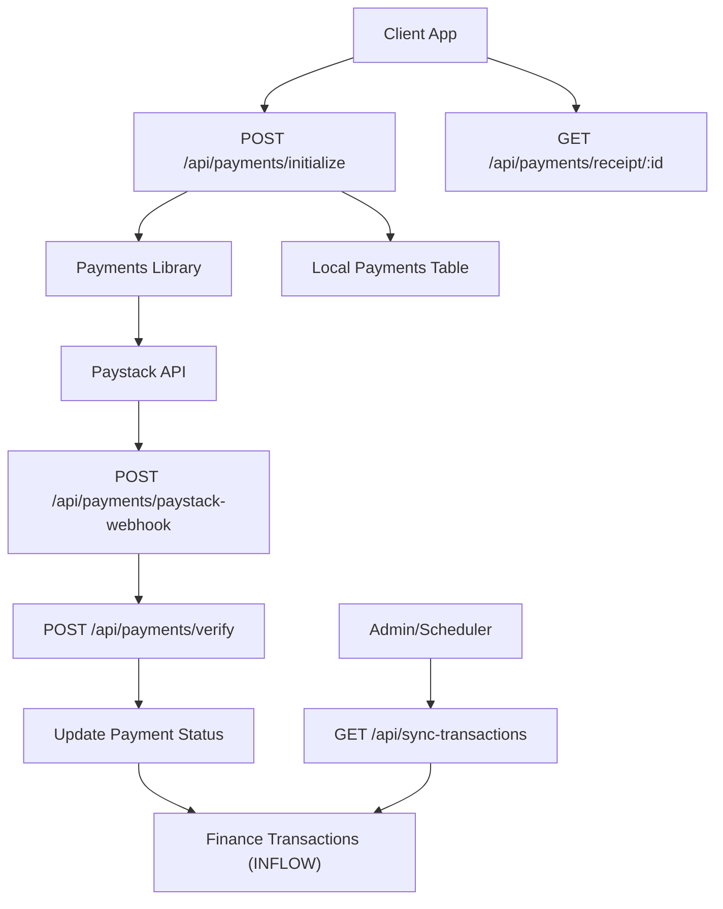
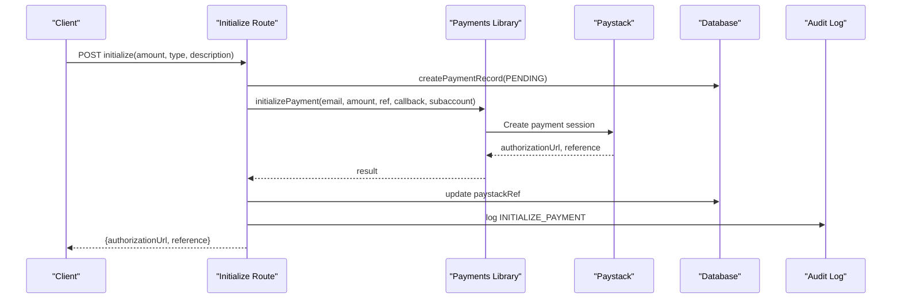
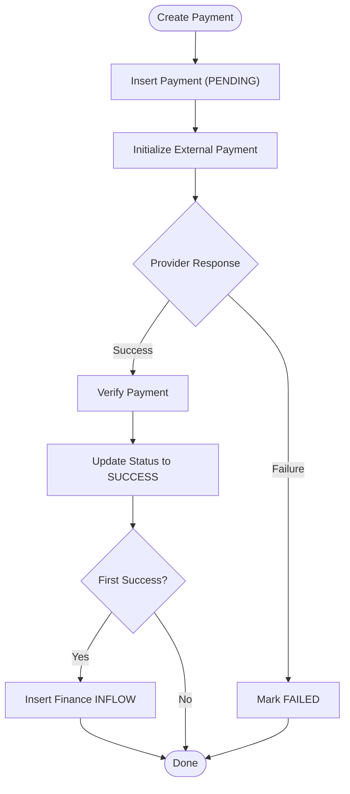
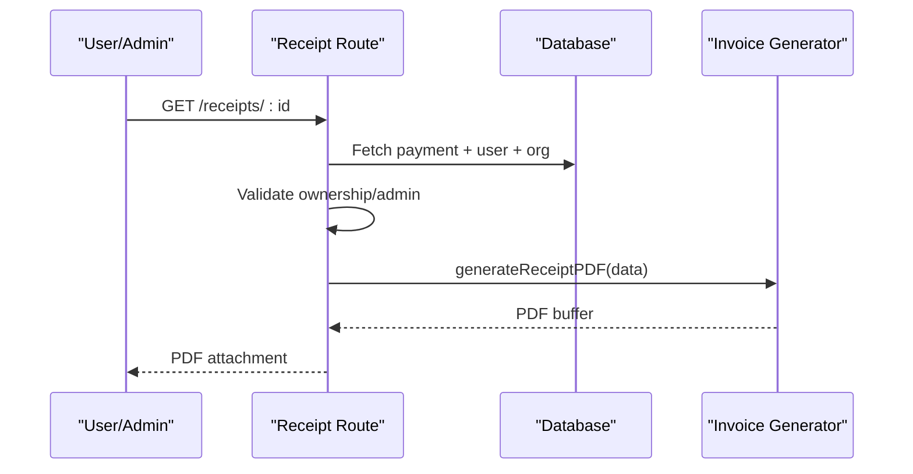
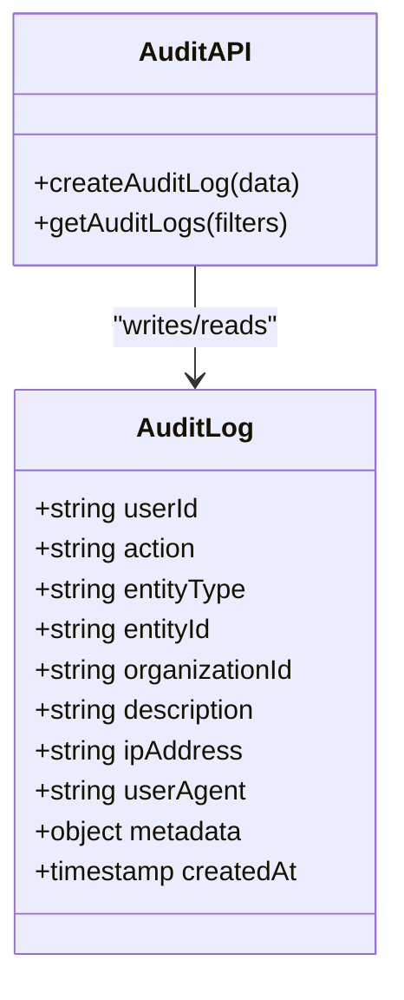
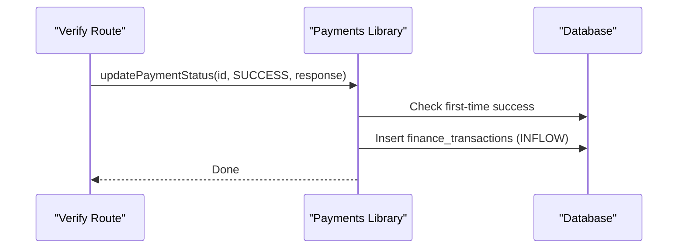
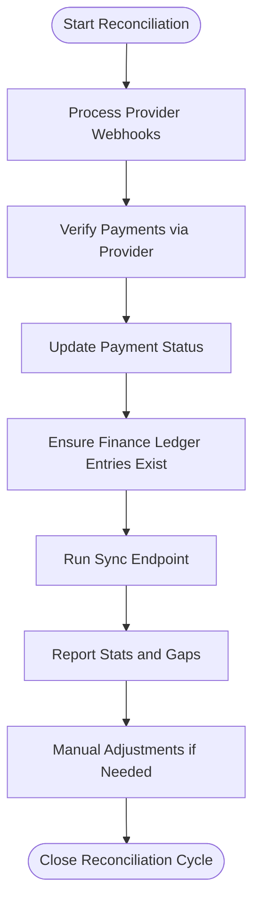
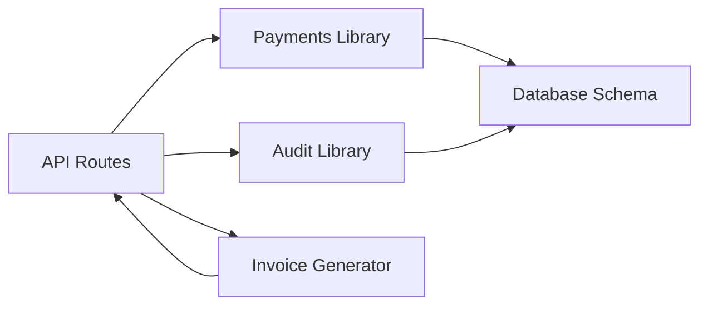

# Transaction Reconciliation & Audit

<cite>
**Referenced Files in This Document**
- [initialize route](file://app/api/payments/initialize/route.ts)
- [paystack webhook route](file://app/api/payments/paystack-webhook/route.ts)
- [receipt route](file://app/api/payments/receipt/[id]/route.ts)
- [verify route](file://app/api/payments/verify/route.ts)
- [payments library](file://lib/payments.ts)
- [audit library](file://lib/audit.ts)
- [invoice generator](file://lib/invoice-generator.ts)
- [sync transactions route](file://app/api/sync-transactions/route.ts)
- [database schema](file://lib/db/schema.ts)
</cite>

## Table of Contents
1. Introduction
2. Project Structure
3. Core Components
4. Architecture Overview
5. Detailed Component Analysis
6. Dependency Analysis
7. Performance Considerations
8. Troubleshooting Guide
9. Conclusion
10. Appendices

## Introduction
This document explains the TMC Portal’s financial transaction reconciliation and audit capabilities. It covers how payment records are created with unique identifiers and metadata, how payment status transitions from PENDING to SUCCESS or FAILED are tracked, how verifiable receipts are generated for users and administrators, and how finance inflows are automatically recorded when payments succeed. It also provides guidance on reconciling internal records with external payment systems, auditing all financial operations, and handling disputes, reversals, and manual adjustments.

## Project Structure
The financial flow is implemented via Next.js API routes that orchestrate a payment provider (Paystack), local persistence, receipt generation, audit logging, and integration with the finance ledger. A background sync utility ensures completeness by reconciling successful payments and programme registrations into the finance ledger.

**Diagram sources**
- [initialize route:11-85](file://app/api/payments/initialize/route.ts#L11-L85)
- [payments library:18-96](file://lib/payments.ts#L18-L96)
- [paystack webhook route:7-36](file://app/api/payments/paystack-webhook/route.ts#L7-L36)
- [verify route:10-93](file://app/api/payments/verify/route.ts#L10-L93)
- [receipt route:8-63](file://app/api/payments/receipt/[id]/route.ts#L8-L63)
- [sync transactions route:8-114](file://app/api/sync-transactions/route.ts#L8-L114)

**Section sources**
- [initialize route:11-85](file://app/api/payments/initialize/route.ts#L11-L85)
- [paystack webhook route:7-36](file://app/api/payments/paystack-webhook/route.ts#L7-L36)
- [verify route:10-93](file://app/api/payments/verify/route.ts#L10-L93)
- [receipt route:8-63](file://app/api/payments/receipt/[id]/route.ts#L8-L63)
- [sync transactions route:8-114](file://app/api/sync-transactions/route.ts#L8-L114)

## Core Components
- Payment initialization and record creation: Creates a payment entity with a unique ID, initial PENDING status, and optional Paystack reference; initializes an external payment session and logs the action.
- Payment verification and status updates: Verifies against the provider, updates status to SUCCESS or FAILED, sets paid timestamp on first success, and triggers downstream effects.
- Receipt generation: Produces a PDF receipt for successful payments with organization, member, and item details.
- Finance ledger integration: On first-time success, inserts an INFLOW record into the finance ledger with performer and category metadata.
- Audit trail: Logs key actions (initialization, verification) with actor identity and context.
- Reconciliation sync: Scans successful payments and paid programme registrations to ensure every inflow exists in the finance ledger.

**Section sources**
- [payments library:100-190](file://lib/payments.ts#L100-L190)
- [audit library:17-71](file://lib/audit.ts#L17-L71)
- [invoice generator:86-147](file://lib/invoice-generator.ts#L86-L147)
- [sync transactions route:36-108](file://app/api/sync-transactions/route.ts#L36-L108)

## Architecture Overview
The system follows a clear separation of concerns:
- API layer handles HTTP requests and orchestrates flows.
- Domain logic resides in libraries for payment operations and audit logging.
- Data persistence uses Drizzle ORM over MySQL tables for payments, finance transactions, and audit logs.
- External integrations include Paystack for payment processing and email delivery for receipts.

**Diagram sources**
- [initialize route:11-85](file://app/api/payments/initialize/route.ts#L11-L85)
- [payments library:18-58](file://lib/payments.ts#L18-L58)

## Detailed Component Analysis

### Payment Record Creation and Lifecycle
- Unique identifiers: Each payment gets a UUID-based id used as the primary key and as part of receipts and references.
- Metadata: The payment record stores rich metadata including user, organization, member, campaign, and provider response snapshots.
- Status lifecycle: Starts as PENDING; moves to SUCCESS or FAILED upon verification. On first-time SUCCESS, paidAt is set and finance inflow is recorded.

**Diagram sources**
- [payments library:100-190](file://lib/payments.ts#L100-L190)
- [verify route:10-93](file://app/api/payments/verify/route.ts#L10-L93)

**Section sources**
- [payments library:100-190](file://lib/payments.ts#L100-L190)
- [verify route:10-93](file://app/api/payments/verify/route.ts#L10-L93)

### Receipt Generation System
- Access control: Only the paying user or authorized admins can download receipts.
- Content: Includes receipt number derived from provider reference or payment id, payment method, date, organization details, member info, line items, and total.
- Delivery: Returns a PDF attachment suitable for download or email attachment.

**Diagram sources**
- [receipt route:8-63](file://app/api/payments/receipt/[id]/route.ts#L8-L63)
- [invoice generator:86-147](file://lib/invoice-generator.ts#L86-L147)

**Section sources**
- [receipt route:8-63](file://app/api/payments/receipt/[id]/route.ts#L8-L63)
- [invoice generator:86-147](file://lib/invoice-generator.ts#L86-L147)

### Audit Trail Functionality
- Captures critical financial events such as payment initialization and verification.
- Stores actor identity, action type, entity type/id, descriptive notes, and optional IP/user agent.
- Provides filtered retrieval by user, organization, entity, and date ranges for reporting and investigations.

**Diagram sources**
- [audit library:17-71](file://lib/audit.ts#L17-L71)

**Section sources**
- [audit library:17-71](file://lib/audit.ts#L17-L71)

### Integration with Finance Transactions (Inflows)
- Automatic recording: When a payment transitions to SUCCESS for the first time, an INFLOW record is inserted into the finance ledger with category, performer, and metadata linking back to the payment and provider reference.
- Fallbacks: If organization or performer are missing, defaults to national organization and earliest user to ensure ledger integrity.

**Diagram sources**
- [payments library:133-190](file://lib/payments.ts#L133-L190)
- [verify route:38-43](file://app/api/payments/verify/route.ts#L38-L43)

**Section sources**
- [payments library:133-190](file://lib/payments.ts#L133-L190)

### Reconciliation and Dispute Handling
- Reconciliation endpoints:
  - Provider webhook verifies specific flows (e.g., programme registration).
  - General verification endpoint updates payment status and emits audit logs.
  - Sync endpoint scans successful payments and paid programme registrations to ensure finance ledger completeness.
- Dispute resolution and reversals:
  - For incorrect or disputed transactions, use the sync endpoint to re-synchronize inflows.
  - Manual adjustments can be performed via finance request workflows and outflow entries linked to related requests.
  - Maintain detailed descriptions and metadata to trace origin and corrective actions.

**Diagram sources**
- [paystack webhook route:7-36](file://app/api/payments/paystack-webhook/route.ts#L7-L36)
- [verify route:10-93](file://app/api/payments/verify/route.ts#L10-L93)
- [sync transactions route:8-114](file://app/api/sync-transactions/route.ts#L8-L114)

**Section sources**
- [paystack webhook route:7-36](file://app/api/payments/paystack-webhook/route.ts#L7-L36)
- [verify route:10-93](file://app/api/payments/verify/route.ts#L10-L93)
- [sync transactions route:8-114](file://app/api/sync-transactions/route.ts#L8-L114)

## Dependency Analysis
Key dependencies and their roles:
- Next.js API routes coordinate user interactions and external services.
- Payments library encapsulates provider calls and database mutations for payments and finance ledger.
- Audit library centralizes immutable logging for compliance and troubleshooting.
- Invoice generator produces standardized PDF receipts.
- Database schema defines entities for payments, finance transactions, organizations, users, and audit logs.

**Diagram sources**
- [initialize route:1-85](file://app/api/payments/initialize/route.ts#L1-L85)
- [payments library:1-248](file://lib/payments.ts#L1-L248)
- [audit library:1-74](file://lib/audit.ts#L1-L74)
- [invoice generator:1-148](file://lib/invoice-generator.ts#L1-L148)
- [database schema:1247-1264](file://lib/db/schema.ts#L1247-L1264)

**Section sources**
- [database schema:1247-1264](file://lib/db/schema.ts#L1247-L1264)

## Performance Considerations
- Idempotency: Use provider references and payment ids to avoid duplicate inflows during retries.
- Batching: For large reconciliation runs, consider paginating queries and batching inserts to reduce load.
- Indexing: Ensure indexes on paystackRef, status, and timestamps to speed up lookups and sync operations.
- Asynchronous work: Offload heavy tasks like PDF generation and email sending to background jobs where possible.

[No sources needed since this section provides general guidance]

## Troubleshooting Guide
Common issues and resolutions:
- Signature mismatch in webhooks: Verify environment secret keys and payload hashing.
- Missing finance entries: Run the sync endpoint to reconcile missing inflows from successful payments and paid registrations.
- Unauthorized receipt access: Confirm user ownership or admin privileges before downloading receipts.
- Audit gaps: Review audit logs filtered by entity type and date range to identify missing steps.

**Section sources**
- [paystack webhook route:7-36](file://app/api/payments/paystack-webhook/route.ts#L7-L36)
- [receipt route:12-40](file://app/api/payments/receipt/[id]/route.ts#L12-L40)
- [sync transactions route:36-108](file://app/api/sync-transactions/route.ts#L36-L108)
- [audit library:36-71](file://lib/audit.ts#L36-L71)

## Conclusion
The TMC Portal’s financial system provides robust transaction reconciliation and audit capabilities through well-defined payment flows, reliable receipt generation, comprehensive audit logging, and automated finance ledger integration. The sync endpoint ensures consistency between internal records and external providers, while audit trails support transparency and dispute resolution. Following the recommended practices will help maintain accurate financial records and streamline reconciliation efforts.

[No sources needed since this section summarizes without analyzing specific files]

## Appendices

### Transaction Lookup Examples for Reconciliation
- By reference: Query payments using the provider reference or payment id to retrieve full history and status.
- By user: Filter payments by user id to review individual payment histories and receipts.
- By date range: Use audit logs and payments filters to analyze activity within specific periods.

[No sources needed since this section provides conceptual guidance]

### Dispute Resolution and Manual Adjustments
- Disputes: Investigate via audit logs and payment metadata; verify with provider if necessary.
- Reversals: Create corresponding OUTFLOW entries linked to related requests with clear descriptions and evidence.
- Manual adjustments: Use finance request workflows to adjust balances and maintain traceability.

[No sources needed since this section provides conceptual guidance]