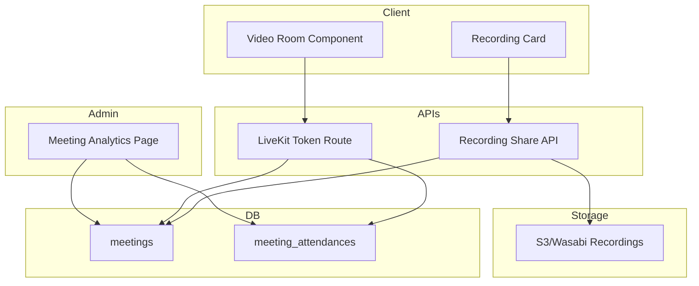
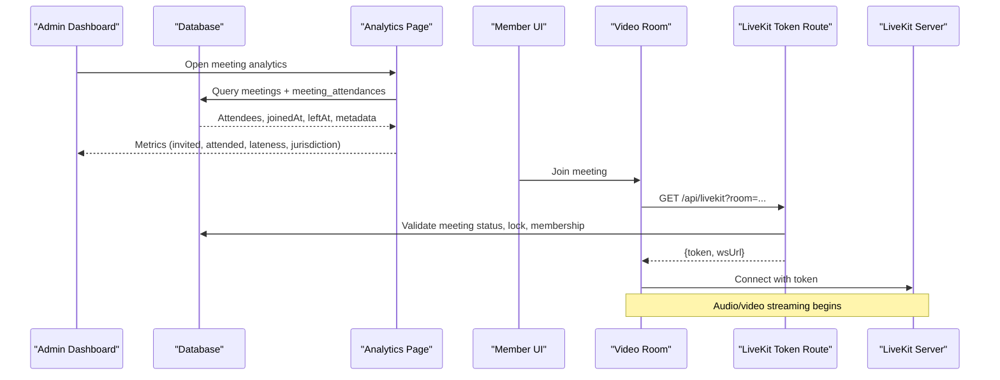
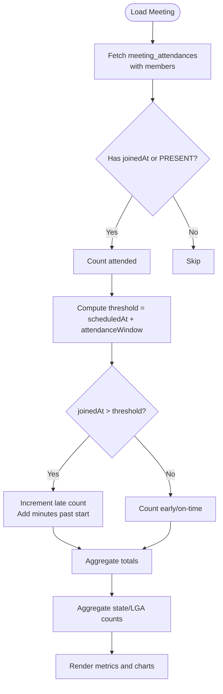
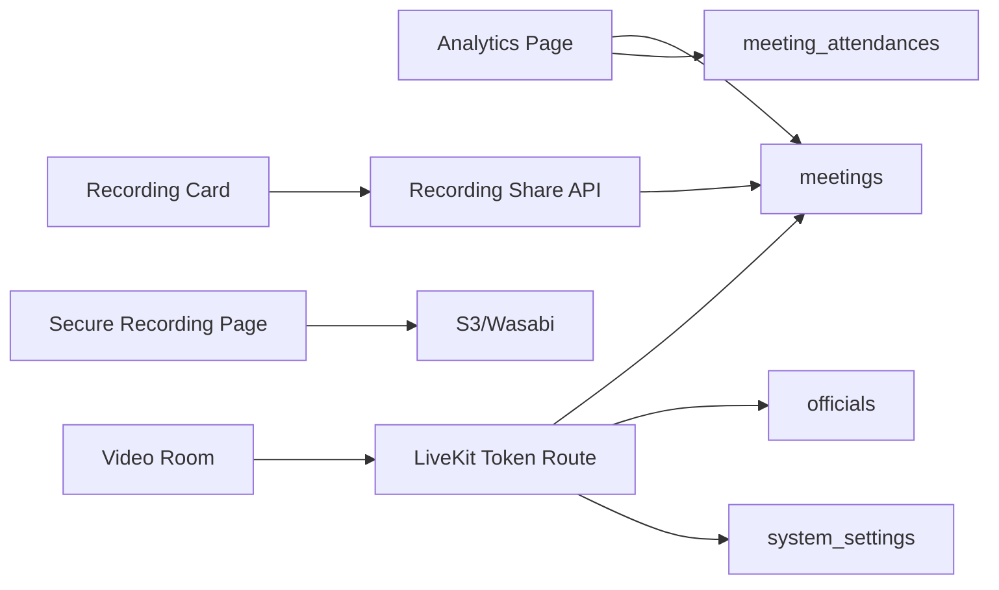
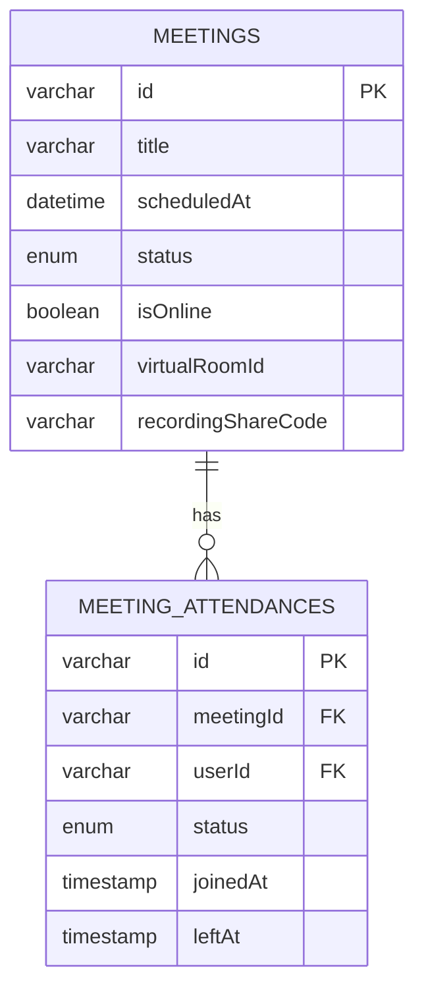

# Meeting Analytics & Monitoring

<cite>
**Referenced Files in This Document**
- [meeting analytics page](file://app/dashboard/admin/meetings/[id]/analytics/page.tsx)
- [video room component](file://components/meetings/video-room.tsx)
- [livekit token route](file://app/api/livekit/route.ts)
- [secure recording page](file://app/recordings/[shareCode]/page.tsx)
- [recording share API](file://app/api/meetings/[id]/recording/share/route.ts)
- [meeting recording card](file://components/meetings/meeting-recording-card.tsx)
- [create meeting tables SQL](file://scripts/create_meeting_tables.sql)
- [drizzle snapshot 0000](file://drizzle/meta/0000_snapshot.json)
- [drizzle snapshot 0001](file://drizzle/meta/0001_snapshot.json)
- [drizzle snapshot 0002](file://drizzle/meta/0002_snapshot.json)
- [drizzle snapshot 0003](file://drizzle/meta/0003_snapshot.json)
- [member meetings list](file://app/dashboard/member/meetings/page.tsx)
- [live public join page](file://app/live/[shareCode]/page.tsx)
- [meeting module user guide](file://meeting_module_user_guide.md)
</cite>

## Table of Contents
1. Introduction
2. Project Structure
3. Core Components
4. Architecture Overview
5. Detailed Component Analysis
6. Dependency Analysis
7. Performance Considerations
8. Troubleshooting Guide
9. Conclusion
10. Appendices

## Introduction
This document explains the TMC Portal’s meeting analytics and monitoring capabilities with a focus on attendance tracking, participation duration, engagement metrics, performance analytics, reporting, real-time monitoring, data privacy, and troubleshooting. It maps features to concrete implementation points in the codebase and provides diagrams for clarity.

## Project Structure
The meeting analytics system spans server-side pages, client components, APIs, and database schema:
- Admin analytics dashboard per meeting (attendance, lateness, jurisdiction representation)
- Live video integration via LiveKit with secure token issuance
- Recording playback with secure share codes and presigned URLs
- Database models for meetings and attendance with timestamps for check-in/check-out
- Public and member flows for joining meetings

**Diagram sources**
- [meeting analytics page:1-184](file://app/dashboard/admin/meetings/[id]/analytics/page.tsx#L1-L184)
- [video room component:1-135](file://components/meetings/video-room.tsx#L1-L135)
- [livekit token route:1-112](file://app/api/livekit/route.ts#L1-L112)
- [secure recording page:1-103](file://app/recordings/[shareCode]/page.tsx#L1-L103)
- [recording share API:1-28](file://app/api/meetings/[id]/recording/share/route.ts#L1-L28)
- [drizzle snapshot 0000:3311-3399](file://drizzle/meta/0000_snapshot.json#L3311-L3399)

**Section sources**
- [meeting analytics page:1-184](file://app/dashboard/admin/meetings/[id]/analytics/page.tsx#L1-L184)
- [video room component:1-135](file://components/meetings/video-room.tsx#L1-L135)
- [livekit token route:1-112](file://app/api/livekit/route.ts#L1-L112)
- [secure recording page:1-103](file://app/recordings/[shareCode]/page.tsx#L1-L103)
- [recording share API:1-28](file://app/api/meetings/[id]/recording/share/route.ts#L1-L28)
- [create meeting tables SQL:29-48](file://scripts/create_meeting_tables.sql#L29-L48)

## Core Components
- Attendance and Lateness Analytics: Computes total invited, attended, lateness rate, average lateness, and jurisdiction breakdown by state and LGA using joined queries against meetings and meeting_attendances.
- Live Video Integration: Client requests a token from the LiveKit route; server validates meeting status, lock state, and permissions before issuing a scoped token.
- Secure Recording Playback: Generates share codes and presigned URLs for S3/Wasabi recordings with time-bound access.
- Data Model: Meetings and meeting_attendances store scheduling, status, and precise join/left timestamps used for analytics.

Key responsibilities:
- Admin analytics page: aggregate metrics and present insights.
- LiveKit route: enforce security and issue tokens.
- Video room: connect to LiveKit, mark join/leave events, and optimize bandwidth.
- Recording flow: generate share links and serve secure playback.

**Section sources**
- [meeting analytics page:10-70](file://app/dashboard/admin/meetings/[id]/analytics/page.tsx#L10-L70)
- [livekit token route:22-73](file://app/api/livekit/route.ts#L22-L73)
- [video room component:83-130](file://components/meetings/video-room.tsx#L83-L130)
- [secure recording page:12-88](file://app/recordings/[shareCode]/page.tsx#L12-L88)
- [drizzle snapshot 0000:3311-3399](file://drizzle/meta/0000_snapshot.json#L3311-L3399)

## Architecture Overview
End-to-end flow for analytics and live sessions:

**Diagram sources**
- [meeting analytics page:16-28](file://app/dashboard/admin/meetings/[id]/analytics/page.tsx#L16-L28)
- [livekit token route:31-73](file://app/api/livekit/route.ts#L31-L73)
- [video room component:28-44](file://components/meetings/video-room.tsx#L28-L44)

## Detailed Component Analysis

### Attendance Tracking and Lateness Analytics
- Computes attendance rate and lateness based on joinedAt vs scheduledAt plus an attendance window threshold.
- Aggregates jurisdiction representation by extracting state and LGA from member metadata.
- Displays summary cards for invited, attended, lateness rate, and average lateness.

**Diagram sources**
- [meeting analytics page:30-70](file://app/dashboard/admin/meetings/[id]/analytics/page.tsx#L30-L70)

**Section sources**
- [meeting analytics page:16-70](file://app/dashboard/admin/meetings/[id]/analytics/page.tsx#L16-L70)
- [drizzle snapshot 0000:3311-3399](file://drizzle/meta/0000_snapshot.json#L3311-L3399)

### Participation Duration and Engagement
- Duration is derived from joinedAt and leftAt when available; currently, joinedAt is consistently recorded on connect and leave is handled on disconnect.
- Engagement signals include presence (joined/left), latency indicators via connection success/failure, and optional bandwidth settings.

Implementation notes:
- On connect, the client calls joinMeeting; on disconnect, it calls leaveMeeting to update attendance records.
- Bandwidth optimization toggles affect video resolution and encoding parameters.

**Section sources**
- [video room component:83-130](file://components/meetings/video-room.tsx#L83-L130)
- [create meeting tables SQL:29-48](file://scripts/create_meeting_tables.sql#L29-L48)

### Meeting Performance Analytics
- Connection quality and media stats are not directly captured in the current analytics page; however, the video room config includes adaptive streaming and audio capture defaults that influence perceived quality.
- Dropout rates can be inferred from leftAt vs joinedAt if leftAt is populated; otherwise, rely on session termination events.

Recommendations:
- Extend analytics to compute average session duration and dropout rate using leftAt.
- Add telemetry hooks to capture reconnection events and bitrate changes for deeper performance insights.

**Section sources**
- [video room component:95-124](file://components/meetings/video-room.tsx#L95-L124)
- [drizzle snapshot 0000:3311-3399](file://drizzle/meta/0000_snapshot.json#L3311-L3399)

### Participant Behavior Analysis
- Speaking time and interaction patterns are not tracked in the current codebase.
- Engagement levels can be approximated by presence duration and punctuality metrics already computed.

Future enhancements:
- Integrate LiveKit data tracks or server-side events to measure speaking time and interaction frequency.
- Store and analyze event logs for turn-taking and chat interactions if enabled.

[No sources needed since this section proposes future enhancements without analyzing specific files]

### Reporting Features
- Per-meeting analytics provide attendance rate, lateness rate, average lateness, and jurisdiction representation.
- The admin guide references viewing analytics including attendance and punctuality breakdowns.

Examples of custom reports:
- Board summaries: attendance rate and lateness trends across meetings.
- Operational dashboards: top LGAs represented and average lateness per region.

**Section sources**
- [meeting analytics page:80-178](file://app/dashboard/admin/meetings/[id]/analytics/page.tsx#L80-L178)
- [meeting module user guide:50-57](file://meeting_module_user_guide.md#L50-L57)

### Real-Time Monitoring
- The LiveKit token route enforces meeting status checks and lock states to control access.
- The video room triggers join/leave actions upon connection/disconnection, enabling near-real-time updates to attendance.

Operational visibility:
- Monitor token issuance errors and meeting status transitions.
- Track connection failures and unauthorized access attempts via API responses.

**Section sources**
- [livekit token route:31-73](file://app/api/livekit/route.ts#L31-L73)
- [video room component:28-44](file://components/meetings/video-room.tsx#L28-L44)

### Data Privacy Considerations
- Recording playback uses secure share codes and time-limited presigned URLs to protect media assets.
- Access to recordings requires valid share codes and server-side validation.

Privacy safeguards:
- Presigned URLs expire after a set duration.
- Only authenticated users or guests with valid codes can retrieve recordings.

**Section sources**
- [secure recording page:12-88](file://app/recordings/[shareCode]/page.tsx#L12-L88)
- [recording share API:7-28](file://app/api/meetings/[id]/recording/share/route.ts#L7-L28)

### Integration with Organizational KPIs
- Attendance rate and lateness metrics can feed into organizational KPIs such as participation compliance and punctuality targets.
- Jurisdiction representation supports equity and inclusion goals.

Integration approach:
- Export aggregated metrics from the analytics page for periodic reporting.
- Combine with programmatic reports and grading logic where applicable.

[No sources needed since this section provides general guidance]

## Dependency Analysis
Core dependencies and relationships:
- Analytics page depends on meetings and meeting_attendances schemas.
- LiveKit token route depends on meetings, officials, and system settings for configuration.
- Video room depends on LiveKit SDK and server URL/token.
- Recording playback depends on storage settings and S3/Wasabi credentials.

**Diagram sources**
- [meeting analytics page:1-24](file://app/dashboard/admin/meetings/[id]/analytics/page.tsx#L1-L24)
- [livekit token route:1-112](file://app/api/livekit/route.ts#L1-L112)
- [secure recording page:1-103](file://app/recordings/[shareCode]/page.tsx#L1-L103)
- [recording share API:1-28](file://app/api/meetings/[id]/recording/share/route.ts#L1-L28)

**Section sources**
- [meeting analytics page:1-24](file://app/dashboard/admin/meetings/[id]/analytics/page.tsx#L1-L24)
- [livekit token route:1-112](file://app/api/livekit/route.ts#L1-L112)
- [secure recording page:1-103](file://app/recordings/[shareCode]/page.tsx#L1-L103)
- [recording share API:1-28](file://app/api/meetings/[id]/recording/share/route.ts#L1-L28)

## Performance Considerations
- Use adaptive streaming and optimized video/audio capture defaults to reduce bandwidth usage.
- Limit data payload in analytics queries by filtering to specific meetings and avoiding unnecessary joins.
- Cache frequently accessed meeting details and settings where appropriate.

[No sources needed since this section provides general guidance]

## Troubleshooting Guide
Common issues and resolutions:
- Missing room parameter: Ensure the video room passes a valid room name to the token endpoint.
- Meeting not started or locked: Verify meeting status is ONGOING and not locked for non-admin users.
- LiveKit misconfiguration: Confirm API keys, secret, and WebSocket URL are set in system settings.
- Recording not found: Check that the recording file exists in storage and the share code matches a meeting.

Diagnostic steps:
- Inspect token route error responses for missing parameters or authorization failures.
- Validate database entries for meetings and attendance records.
- Confirm storage credentials and bucket configuration for recording playback.

**Section sources**
- [livekit token route:18-20](file://app/api/livekit/route.ts#L18-L20)
- [livekit token route:43-53](file://app/api/livekit/route.ts#L43-L53)
- [livekit token route:92-95](file://app/api/livekit/route.ts#L92-L95)
- [secure recording page:72-88](file://app/recordings/[shareCode]/page.tsx#L72-L88)

## Conclusion
The TMC Portal provides robust meeting analytics focused on attendance, punctuality, and jurisdiction representation, integrated with secure live video and recording playback. While advanced performance and behavior analytics are not fully implemented, the foundation supports extensions for richer insights. Security and privacy are enforced through token-based access and time-limited presigned URLs for recordings.

## Appendices

### Data Models

**Diagram sources**
- [drizzle snapshot 0000:3311-3399](file://drizzle/meta/0000_snapshot.json#L3311-L3399)
- [create meeting tables SQL:29-48](file://scripts/create_meeting_tables.sql#L29-L48)

### Example Report Scenarios
- Board Summary: Attendance rate and lateness trends across recent meetings.
- Operational Dashboard: Top LGAs represented and average lateness per region.
- Compliance Report: Percentage of participants arriving within the attendance window.

[No sources needed since this section provides conceptual examples]