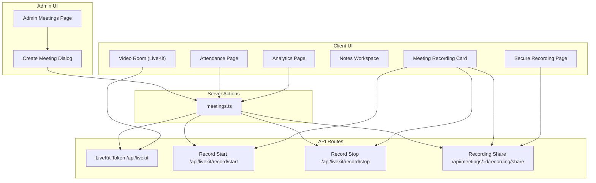
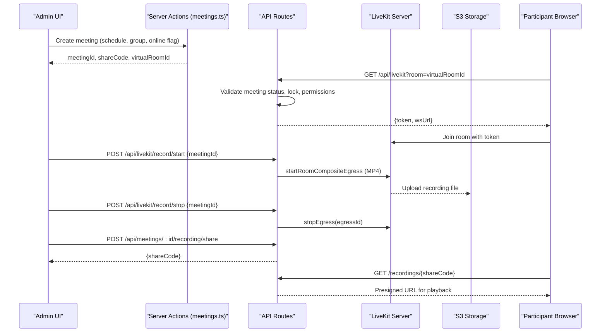
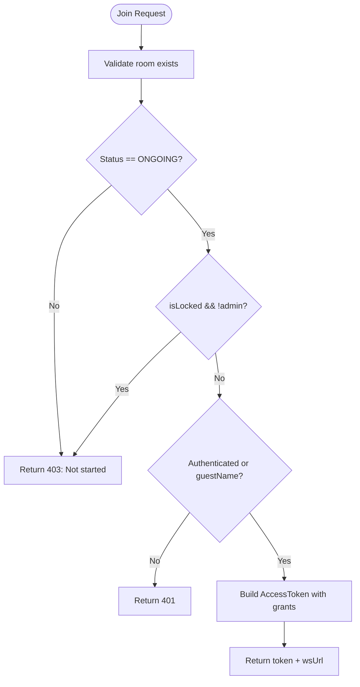
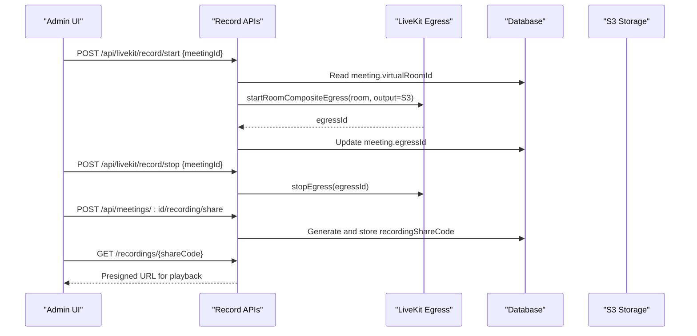
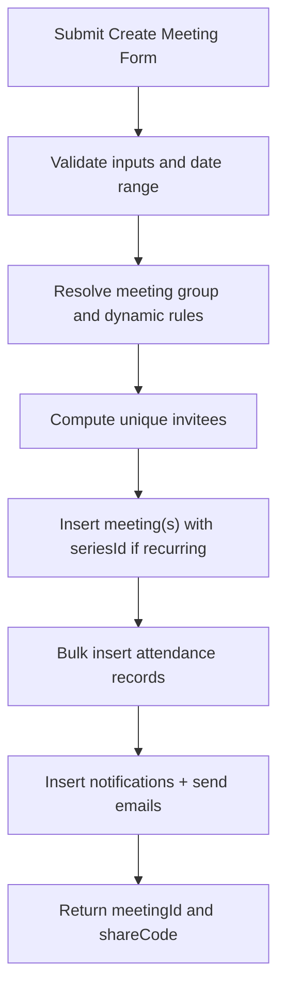
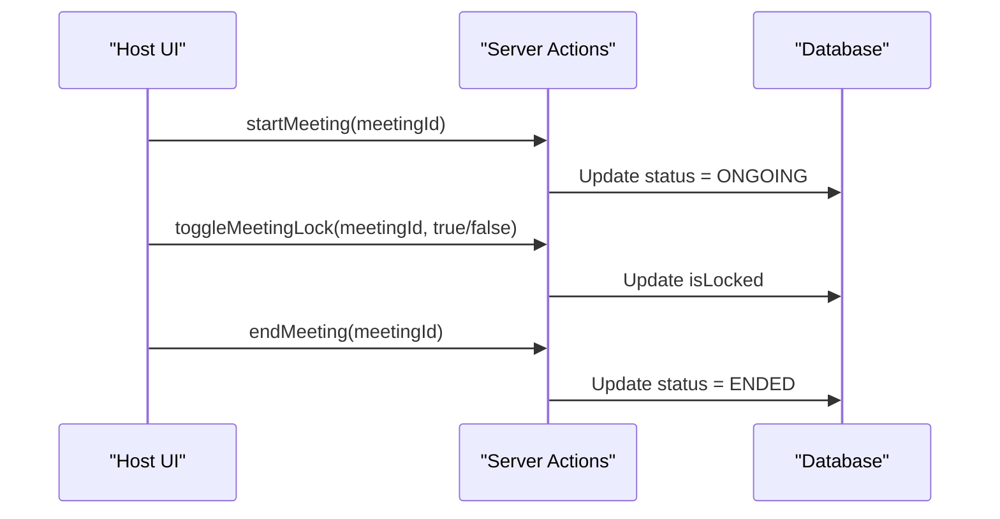
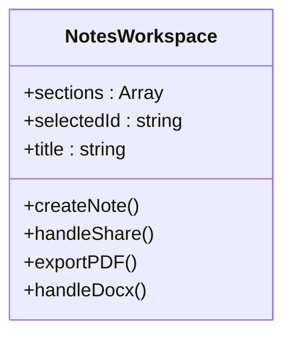
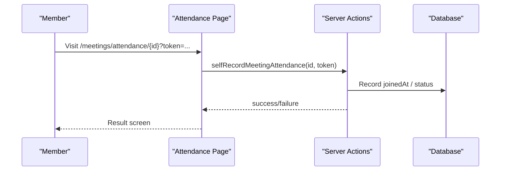
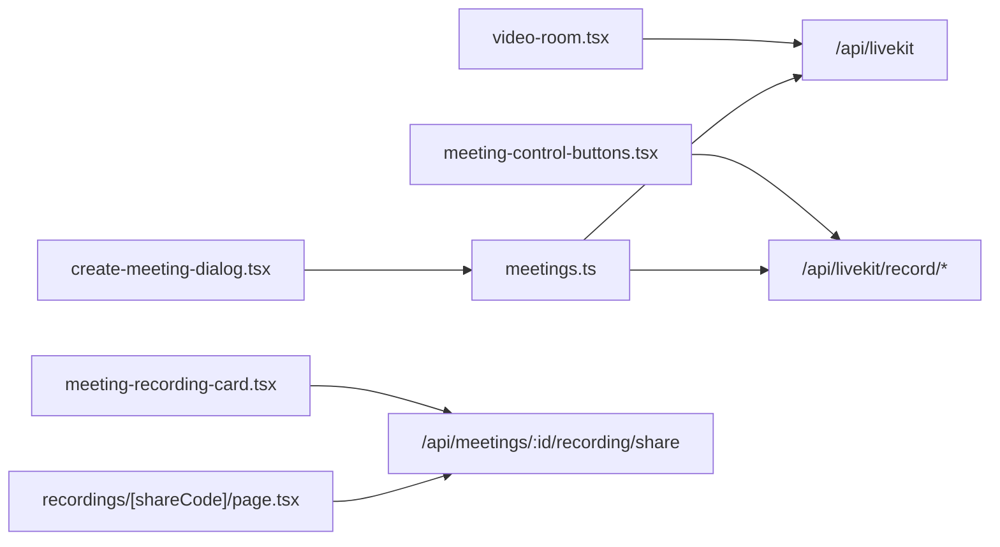

# Meeting Management

<cite>
**Referenced Files in This Document**
- [app/api/livekit/route.ts](file://app/api/livekit/route.ts)
- [components/meetings/video-room.tsx](file://components/meetings/video-room.tsx)
- [app/api/livekit/record/start/route.ts](file://app/api/livekit/record/start/route.ts)
- [app/api/livekit/record/stop/route.ts](file://app/api/livekit/record/stop/route.ts)
- [app/api/meetings/[id]/recording/share/route.ts](file://app/api/meetings/[id]/recording/share/route.ts)
- [app/recordings/[shareCode]/page.tsx](file://app/recordings/[shareCode]/page.tsx)
- [components/meetings/meeting-recording-card.tsx](file://components/meetings/meeting-recording-card.tsx)
- [components/meetings/create-meeting-dialog.tsx](file://components/meetings/create-meeting-dialog.tsx)
- [lib/actions/meetings.ts](file://lib/actions/meetings.ts)
- [app/dashboard/admin/meetings/page.tsx](file://app/dashboard/admin/meetings/page.tsx)
- [app/dashboard/meetings/[id]/notes/page.tsx](file://app/dashboard/meetings/[id]/notes/page.tsx)
- [components/meeting-notes/notes-workspace.tsx](file://components/meeting-notes/notes-workspace.tsx)
- [app/meetings/attendance/[id]/page.tsx](file://app/meetings/attendance/[id]/page.tsx)
- [app/dashboard/admin/meetings/[id]/analytics/page.tsx](file://app/dashboard/admin/meetings/[id]/analytics/page.tsx)
- [components/meetings/meeting-control-buttons.tsx](file://components/meetings/meeting-control-buttons.tsx)
</cite>

## Table of Contents
1. Introduction
2. Project Structure
3. Core Components
4. Architecture Overview
5. Detailed Component Analysis
6. Dependency Analysis
7. Performance Considerations
8. Troubleshooting Guide
9. Conclusion

## Introduction
This document explains the TMC Portal meeting management system with a focus on video conferencing integration, meeting coordination, recording and playback, collaborative notes, analytics, security, and troubleshooting. It covers LiveKit-based real-time calls, scheduling and invitations, room controls, secure recording sharing, attendance tracking, and analytics for participation and engagement.

## Project Structure
The meeting module spans server actions, API routes, Next.js pages, and React components:
- Scheduling and invitations are handled via server actions and UI dialogs.
- LiveKit token issuance and room access control are implemented in API routes.
- Recording start/stop uses LiveKit Egress to store MP4 files to S3-compatible storage.
- Secure playback is provided through share codes and presigned URLs.
- Notes workspace supports collaborative documentation with sections and export.
- Attendance and analytics provide presence tracking and insights.

**Diagram sources**
- [app/dashboard/admin/meetings/page.tsx:1-201](file://app/dashboard/admin/meetings/page.tsx#L1-L201)
- [components/meetings/create-meeting-dialog.tsx:1-448](file://components/meetings/create-meeting-dialog.tsx#L1-L448)
- [lib/actions/meetings.ts:1-800](file://lib/actions/meetings.ts#L1-L800)
- [app/api/livekit/route.ts:1-112](file://app/api/livekit/route.ts#L1-L112)
- [app/api/livekit/record/start/route.ts:1-82](file://app/api/livekit/record/start/route.ts#L1-L82)
- [app/api/livekit/record/stop/route.ts:1-34](file://app/api/livekit/record/stop/route.ts#L1-L34)
- [app/api/meetings/[id]/recording/share/route.ts:1-29](file://app/api/meetings/[id]/recording/share/route.ts#L1-L29)
- [components/meetings/video-room.tsx:1-135](file://components/meetings/video-room.tsx#L1-L135)
- [components/meetings/meeting-recording-card.tsx:1-88](file://components/meetings/meeting-recording-card.tsx#L1-L88)
- [app/recordings/[shareCode]/page.tsx:1-29](file://app/recordings/[shareCode]/page.tsx#L1-L29)
- [app/meetings/attendance/[id]/page.tsx:1-95](file://app/meetings/attendance/[id]/page.tsx#L1-L95)
- [app/dashboard/admin/meetings/[id]/analytics/page.tsx:1-123](file://app/dashboard/admin/meetings/[id]/analytics/page.tsx#L1-L123)

**Section sources**
- [app/dashboard/admin/meetings/page.tsx:1-201](file://app/dashboard/admin/meetings/page.tsx#L1-L201)
- [components/meetings/create-meeting-dialog.tsx:1-448](file://components/meetings/create-meeting-dialog.tsx#L1-L448)
- [lib/actions/meetings.ts:1-800](file://lib/actions/meetings.ts#L1-L800)

## Core Components
- LiveKit Integration: Token generation, room validation, admin lock enforcement, and guest flows.
- Video Room Client: Connects to LiveKit with adaptive streaming and data saver mode; tracks join/leave events.
- Recording Pipeline: Starts/stops recordings via LiveKit Egress to S3-compatible storage; generates secure share links.
- Scheduling & Invitations: Creates meetings (including recurring), resolves invitees from groups, sends notifications and emails.
- Notes Workspace: Sectioned rich-text editor with auto-save, sharing, AI summary, and export to PDF/DOCX.
- Attendance & Analytics: Check-in/out endpoints and analytics for lateness, representation, and participation.

**Section sources**
- [app/api/livekit/route.ts:1-112](file://app/api/livekit/route.ts#L1-L112)
- [components/meetings/video-room.tsx:1-135](file://components/meetings/video-room.tsx#L1-L135)
- [app/api/livekit/record/start/route.ts:1-82](file://app/api/livekit/record/start/route.ts#L1-L82)
- [app/api/livekit/record/stop/route.ts:1-34](file://app/api/livekit/record/stop/route.ts#L1-L34)
- [app/api/meetings/[id]/recording/share/route.ts:1-29](file://app/api/meetings/[id]/recording/share/route.ts#L1-L29)
- [app/recordings/[shareCode]/page.tsx:1-29](file://app/recordings/[shareCode]/page.tsx#L1-L29)
- [components/meetings/meeting-recording-card.tsx:1-88](file://components/meetings/meeting-recording-card.tsx#L1-L88)
- [lib/actions/meetings.ts:1-800](file://lib/actions/meetings.ts#L1-L800)
- [components/meeting-notes/notes-workspace.tsx:1-270](file://components/meeting-notes/notes-workspace.tsx#L1-L270)
- [app/meetings/attendance/[id]/page.tsx:1-95](file://app/meetings/attendance/[id]/page.tsx#L1-L95)
- [app/dashboard/admin/meetings/[id]/analytics/page.tsx:1-123](file://app/dashboard/admin/meetings/[id]/analytics/page.tsx#L1-L123)

## Architecture Overview
End-to-end flow for creating a meeting, joining a live call, recording, and securely sharing playback.

**Diagram sources**
- [lib/actions/meetings.ts:33-303](file://lib/actions/meetings.ts#L33-L303)
- [app/api/livekit/route.ts:9-112](file://app/api/livekit/route.ts#L9-L112)
- [app/api/livekit/record/start/route.ts:9-82](file://app/api/livekit/record/start/route.ts#L9-L82)
- [app/api/livekit/record/stop/route.ts:9-34](file://app/api/livekit/record/stop/route.ts#L9-L34)
- [app/api/meetings/[id]/recording/share/route.ts:7-29](file://app/api/meetings/[id]/recording/share/route.ts#L7-L29)
- [app/recordings/[shareCode]/page.tsx:12-29](file://app/recordings/[shareCode]/page.tsx#L12-L29)

## Detailed Component Analysis

### LiveKit Integration and Real-Time Calls
- Token issuance validates meeting existence, ongoing status, host lock, and admin privileges.
- Supports authenticated users and guests; sets publish/subscribe/data permissions and room admin flags.
- Client connects using LiveKit components with adaptive streaming and data saver options.

**Diagram sources**
- [app/api/livekit/route.ts:9-112](file://app/api/livekit/route.ts#L9-L112)

**Section sources**
- [app/api/livekit/route.ts:1-112](file://app/api/livekit/route.ts#L1-L112)
- [components/meetings/video-room.tsx:1-135](file://components/meetings/video-room.tsx#L1-L135)

### Recording Pipeline (Start, Stop, Playback)
- Start recording creates an Egress job writing MP4 to S3-compatible storage; stores egressId on the meeting.
- Stop recording terminates the Egress job.
- Playback page verifies share code and issues presigned URLs for secure viewing.

**Diagram sources**
- [app/api/livekit/record/start/route.ts:1-82](file://app/api/livekit/record/start/route.ts#L1-L82)
- [app/api/livekit/record/stop/route.ts:1-34](file://app/api/livekit/record/stop/route.ts#L1-L34)
- [app/api/meetings/[id]/recording/share/route.ts:1-29](file://app/api/meetings/[id]/recording/share/route.ts#L1-L29)
- [app/recordings/[shareCode]/page.tsx:1-29](file://app/recordings/[shareCode]/page.tsx#L1-L29)

**Section sources**
- [app/api/livekit/record/start/route.ts:1-82](file://app/api/livekit/record/start/route.ts#L1-L82)
- [app/api/livekit/record/stop/route.ts:1-34](file://app/api/livekit/record/stop/route.ts#L1-L34)
- [app/api/meetings/[id]/recording/share/route.ts:1-29](file://app/api/meetings/[id]/recording/share/route.ts#L1-L29)
- [app/recordings/[shareCode]/page.tsx:1-29](file://app/recordings/[shareCode]/page.tsx#L1-L29)
- [components/meetings/meeting-recording-card.tsx:1-88](file://components/meetings/meeting-recording-card.tsx#L1-L88)

### Meeting Scheduling, Calendar Integration, and Invitations
- Create meeting supports one-time and recurring schedules (weekly, bi-weekly, monthly, custom RRULE).
- Resolves invitees from dynamic rules and meeting groups; inserts attendance records per occurrence.
- Sends in-app notifications and email invitations with dashboard and guest links.

**Diagram sources**
- [lib/actions/meetings.ts:33-303](file://lib/actions/meetings.ts#L33-L303)
- [components/meetings/create-meeting-dialog.tsx:1-448](file://components/meetings/create-meeting-dialog.tsx#L1-L448)

**Section sources**
- [lib/actions/meetings.ts:33-303](file://lib/actions/meetings.ts#L33-L303)
- [components/meetings/create-meeting-dialog.tsx:1-448](file://components/meetings/create-meeting-dialog.tsx#L1-L448)
- [app/dashboard/admin/meetings/page.tsx:1-201](file://app/dashboard/admin/meetings/page.tsx#L1-L201)

### Meeting Room Management and Controls
- Host can start/end meetings and toggle lock to prevent unauthorized joins.
- Control buttons trigger server actions to update meeting state and record presence.

**Diagram sources**
- [lib/actions/meetings.ts:487-528](file://lib/actions/meetings.ts#L487-L528)
- [components/meetings/meeting-control-buttons.tsx:35-73](file://components/meetings/meeting-control-buttons.tsx#L35-L73)

**Section sources**
- [lib/actions/meetings.ts:487-528](file://lib/actions/meetings.ts#L487-L528)
- [components/meetings/meeting-control-buttons.tsx:35-73](file://components/meetings/meeting-control-buttons.tsx#L35-L73)

### Collaborative Notes Workspace
- Sectioned editor (Agenda, Minutes, Decisions, Actions, Follow-up) with auto-save and search.
- Share notes with attendees; export to PDF/DOCX; optional AI summary.

**Diagram sources**
- [components/meeting-notes/notes-workspace.tsx:1-270](file://components/meeting-notes/notes-workspace.tsx#L1-L270)
- [app/dashboard/meetings/[id]/notes/page.tsx:1-29](file://app/dashboard/meetings/[id]/notes/page.tsx#L1-L29)

**Section sources**
- [components/meeting-notes/notes-workspace.tsx:1-270](file://components/meeting-notes/notes-workspace.tsx#L1-L270)
- [app/dashboard/meetings/[id]/notes/page.tsx:1-29](file://app/dashboard/meetings/[id]/notes/page.tsx#L1-L29)

### Attendance Tracking and Analytics
- Attendance page validates session and processes check-ins via token.
- Analytics computes attendance counts, lateness metrics, and jurisdiction representation.

**Diagram sources**
- [app/meetings/attendance/[id]/page.tsx:1-95](file://app/meetings/attendance/[id]/page.tsx#L1-L95)
- [lib/actions/meetings.ts:669-718](file://lib/actions/meetings.ts#L669-L718)

**Section sources**
- [app/meetings/attendance/[id]/page.tsx:1-95](file://app/meetings/attendance/[id]/page.tsx#L1-L95)
- [app/dashboard/admin/meetings/[id]/analytics/page.tsx:1-123](file://app/dashboard/admin/meetings/[id]/analytics/page.tsx#L1-L123)

## Dependency Analysis
Key dependencies and relationships:
- UI components depend on server actions for persistence and notifications.
- LiveKit client depends on token API for secure room access.
- Recording pipeline depends on LiveKit Egress and S3-compatible storage settings.
- Notes workspace depends on server actions for upsert/delete operations and exports.

**Diagram sources**
- [components/meetings/video-room.tsx:1-135](file://components/meetings/video-room.tsx#L1-L135)
- [components/meetings/meeting-control-buttons.tsx:35-73](file://components/meetings/meeting-control-buttons.tsx#L35-L73)
- [components/meetings/create-meeting-dialog.tsx:1-448](file://components/meetings/create-meeting-dialog.tsx#L1-L448)
- [lib/actions/meetings.ts:1-800](file://lib/actions/meetings.ts#L1-L800)
- [components/meetings/meeting-recording-card.tsx:1-88](file://components/meetings/meeting-recording-card.tsx#L1-L88)
- [app/recordings/[shareCode]/page.tsx:1-29](file://app/recordings/[shareCode]/page.tsx#L1-L29)

**Section sources**
- [components/meetings/video-room.tsx:1-135](file://components/meetings/video-room.tsx#L1-L135)
- [components/meetings/meeting-control-buttons.tsx:35-73](file://components/meetings/meeting-control-buttons.tsx#L35-L73)
- [components/meetings/create-meeting-dialog.tsx:1-448](file://components/meetings/create-meeting-dialog.tsx#L1-L448)
- [lib/actions/meetings.ts:1-800](file://lib/actions/meetings.ts#L1-L800)
- [components/meetings/meeting-recording-card.tsx:1-88](file://components/meetings/meeting-recording-card.tsx#L1-L88)
- [app/recordings/[shareCode]/page.tsx:1-29](file://app/recordings/[shareCode]/page.tsx#L1-L29)

## Performance Considerations
- Use Data Saver Mode in the video room to reduce bandwidth by lowering resolution and bitrate.
- Enable adaptive streaming and audio enhancements (echo cancellation, noise suppression) for better quality under variable networks.
- Bulk insert attendance records during meeting creation to minimize database round-trips.
- Store recordings directly to S3-compatible storage via LiveKit Egress to avoid server-side I/O bottlenecks.
- Auto-save notes with debounced writes to reduce write load while editing.

[No sources needed since this section provides general guidance]

## Troubleshooting Guide
Common issues and resolutions:
- Cannot join meeting room:
  - Ensure meeting status is ONGOING and not locked by host.
  - Verify LiveKit configuration (URL, API key, secret) in system settings.
- Recording fails to start:
  - Confirm meeting has a virtualRoomId and LiveKit settings are configured.
  - Ensure S3 storage credentials and bucket are set; endpoint must be valid.
- Playback link not working:
  - Generate a new recording share code and verify the share code matches the meeting.
  - Confirm the recording file exists in storage before issuing presigned URLs.
- Attendance not recorded:
  - Ensure user is authenticated and visits the attendance page with a valid token.
  - Check that the meeting exists and the token is correct.
- Analytics missing data:
  - Verify attendance records exist for the meeting and that joinedAt/status fields are populated.

**Section sources**
- [app/api/livekit/route.ts:9-112](file://app/api/livekit/route.ts#L9-L112)
- [app/api/livekit/record/start/route.ts:9-82](file://app/api/livekit/record/start/route.ts#L9-L82)
- [app/api/livekit/record/stop/route.ts:9-34](file://app/api/livekit/record/stop/route.ts#L9-L34)
- [app/api/meetings/[id]/recording/share/route.ts:7-29](file://app/api/meetings/[id]/recording/share/route.ts#L7-L29)
- [app/recordings/[shareCode]/page.tsx:12-29](file://app/recordings/[shareCode]/page.tsx#L12-L29)
- [app/meetings/attendance/[id]/page.tsx:1-95](file://app/meetings/attendance/[id]/page.tsx#L1-L95)
- [app/dashboard/admin/meetings/[id]/analytics/page.tsx:1-123](file://app/dashboard/admin/meetings/[id]/analytics/page.tsx#L1-L123)

## Conclusion
The TMC Portal meeting management system integrates LiveKit for secure, scalable video conferencing, robust scheduling with automated invitations, reliable recording with secure playback, collaborative notes, and comprehensive analytics. The architecture balances performance and usability through adaptive streaming, bulk operations, and cloud storage offloading. Security is enforced via room locks, permission checks, and presigned URLs for recordings.

[No sources needed since this section summarizes without analyzing specific files]