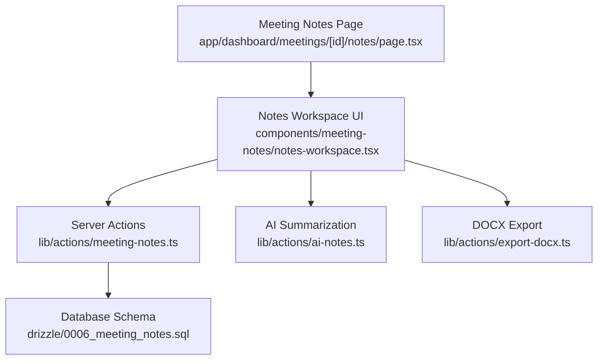
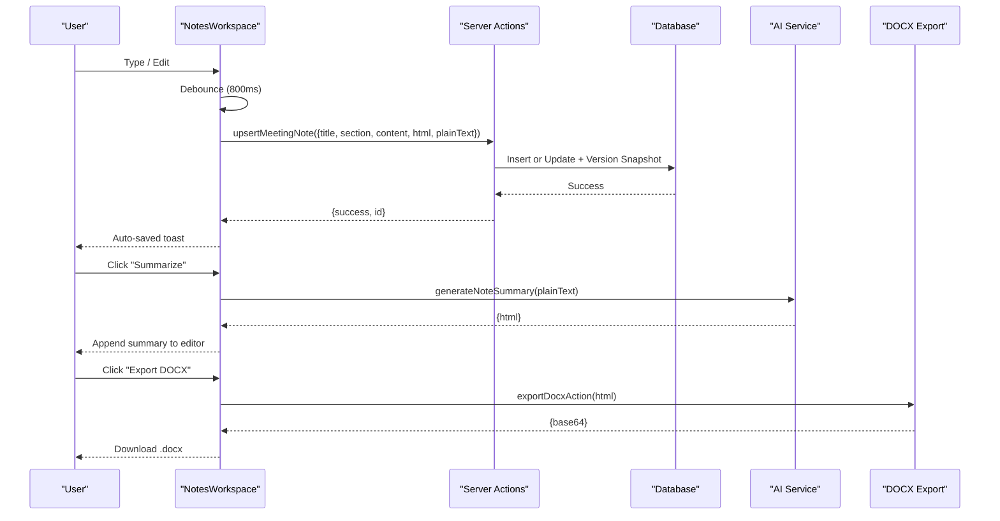
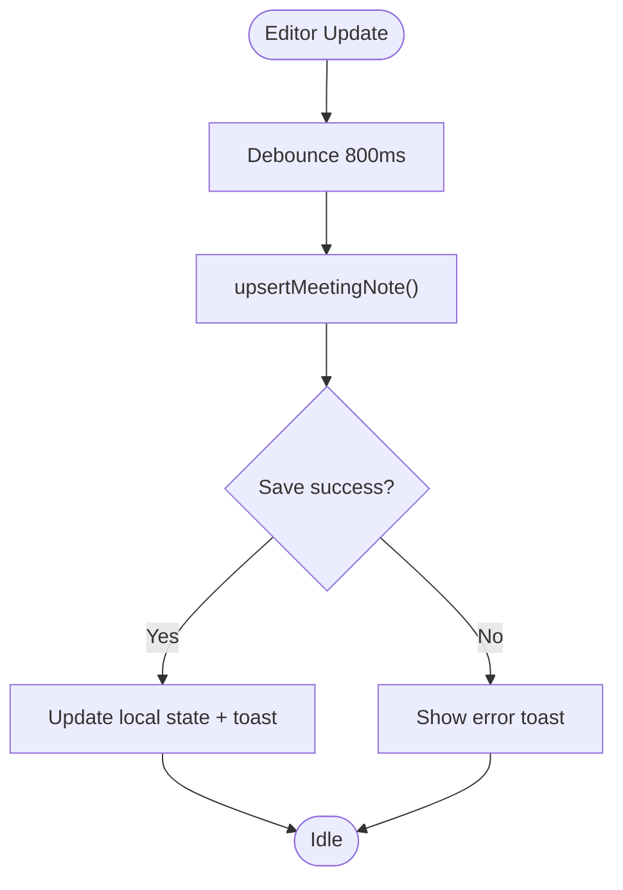
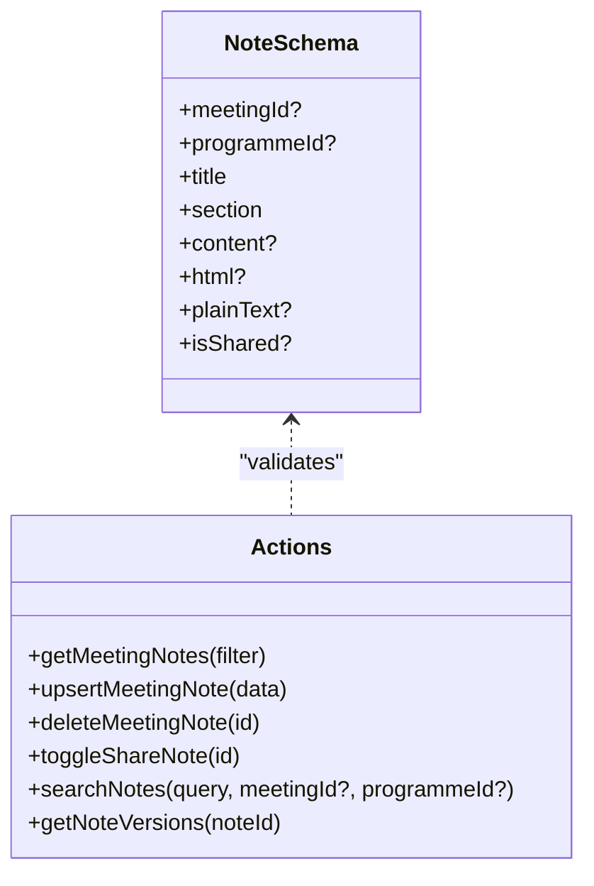
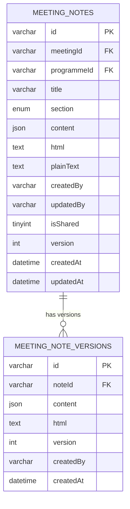
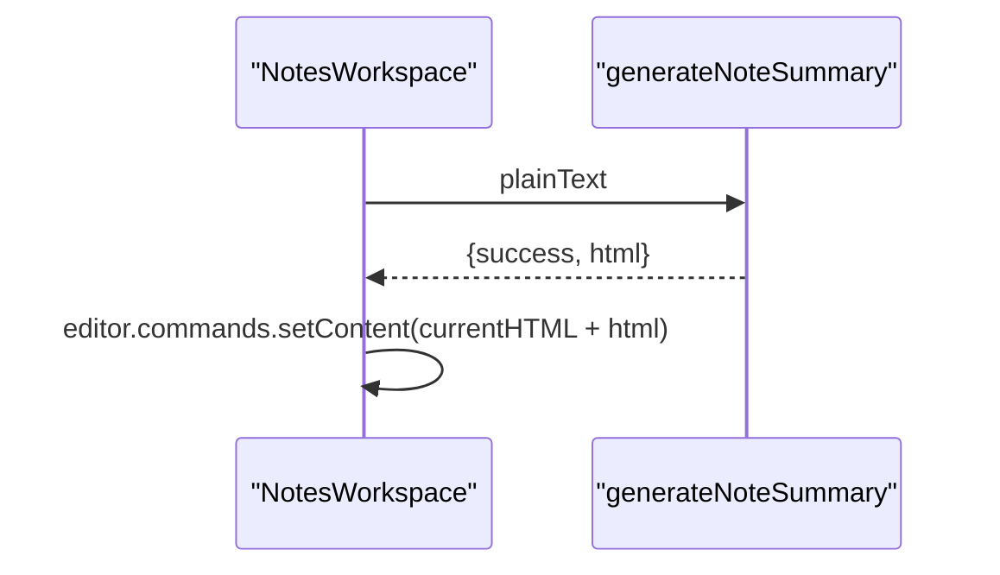
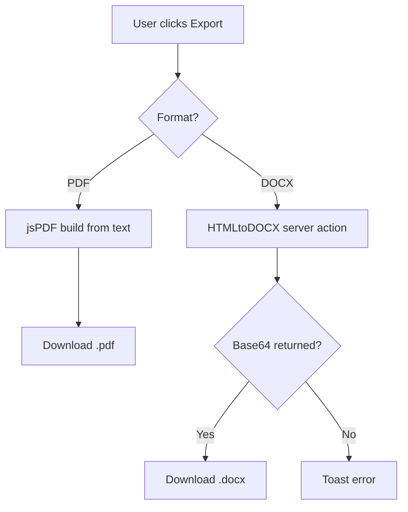
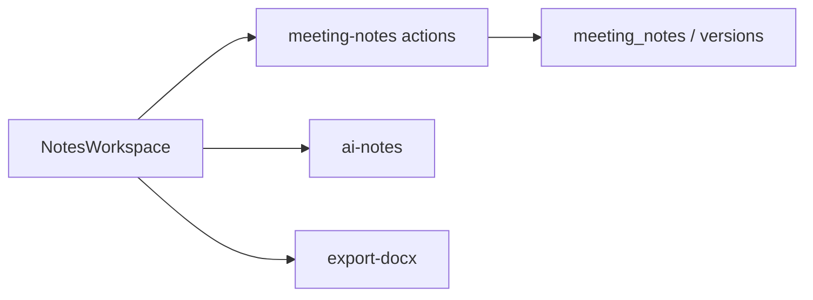

# Meeting Notes & Collaboration

<cite>
**Referenced Files in This Document**
- [notes-workspace.tsx](file://components/meeting-notes/notes-workspace.tsx)
- [page.tsx](file://app/dashboard/meetings/[id]/notes/page.tsx)
- [meeting-notes.ts](file://lib/actions/meeting-notes.ts)
- [0006_meeting_notes.sql](file://drizzle/0006_meeting_notes.sql)
- [ai-notes.ts](file://lib/actions/ai-notes.ts)
- [export-docx.ts](file://lib/actions/export-docx.ts)
- [schema.ts](file://lib/db/schema.ts)
</cite>

## Table of Contents
1. Introduction
2. Project Structure
3. Core Components
4. Architecture Overview
5. Detailed Component Analysis
6. Dependency Analysis
7. Performance Considerations
8. Troubleshooting Guide
9. Conclusion
10. Appendices

## Introduction
This document explains the collaborative meeting notes workspace in the TMC Portal. It covers real-time editing workflows, rich text capabilities, note organization by sections and search, action item tracking, version history with rollback support, permissions for editing and sharing, export to PDF and Word, and integration points with AI summarization and reporting. The goal is to enable teams to capture agendas, minutes, decisions, and action items during live meetings and refine them afterward into official records.

## Project Structure
The meeting notes feature spans a Next.js page that loads a client-side workspace component. The workspace provides a OneNote-like interface with sections, pages, auto-save, sharing, AI summarization, and exports. Server actions handle persistence, versioning, and search. Database migrations define the note schema and version history tables.

**Diagram sources**
- [page.tsx:11-28](file://app/dashboard/meetings/[id]/notes/page.tsx#L11-L28)
- [notes-workspace.tsx:32-95](file://components/meeting-notes/notes-workspace.tsx#L32-L95)
- [meeting-notes.ts:21-145](file://lib/actions/meeting-notes.ts#L21-L145)
- [0006_meeting_notes.sql:2-32](file://drizzle/0006_meeting_notes.sql#L2-L32)
- [ai-notes.ts:6-26](file://lib/actions/ai-notes.ts#L6-L26)
- [export-docx.ts:6-19](file://lib/actions/export-docx.ts#L6-L19)

**Section sources**
- [page.tsx:11-28](file://app/dashboard/meetings/[id]/notes/page.tsx#L11-L28)
- [notes-workspace.tsx:32-95](file://components/meeting-notes/notes-workspace.tsx#L32-L95)
- [meeting-notes.ts:21-145](file://lib/actions/meeting-notes.ts#L21-L145)
- [0006_meeting_notes.sql:2-32](file://drizzle/0006_meeting_notes.sql#L2-L32)

## Core Components
- Notes Workspace (client): Provides sections (General, Agenda, Minutes, Decisions, Action Items, Follow-up), page list, search, editor, share toggle, AI summary, and exports (PDF, DOCX). Auto-saves on edits with debounced server upserts.
- Server Actions: CRUD for notes, scoped visibility (user’s own notes plus shared notes in meeting context), search, version snapshotting, and share toggling.
- Database: Two tables—meeting_notes and meeting_note_versions—support content storage, metadata, sharing flags, and version history.
- Integrations: AI summarization via an external model; DOCX generation from HTML; PDF generation client-side.

Key responsibilities:
- Real-time editing experience with optimistic UI and debounced persistence.
- Section-based organization and filtering.
- Search across titles and plain text.
- Sharing within meeting context.
- Version snapshots for rollback capability.
- Exports for official records.

**Section sources**
- [notes-workspace.tsx:23-30](file://components/meeting-notes/notes-workspace.tsx#L23-L30)
- [notes-workspace.tsx:56-95](file://components/meeting-notes/notes-workspace.tsx#L56-L95)
- [notes-workspace.tsx:108-178](file://components/meeting-notes/notes-workspace.tsx#L108-L178)
- [notes-workspace.tsx:180-190](file://components/meeting-notes/notes-workspace.tsx#L180-L190)
- [meeting-notes.ts:21-145](file://lib/actions/meeting-notes.ts#L21-L145)
- [0006_meeting_notes.sql:2-32](file://drizzle/0006_meeting_notes.sql#L2-L32)

## Architecture Overview
The architecture follows a client-server pattern:
- Client renders the workspace and handles user interactions (typing, section switching, search, share, export).
- Debounced updates call server actions to persist notes and create version snapshots.
- Server enforces session checks, validates inputs, scopes queries, and persists data.
- Optional integrations: AI summarization and DOCX export.

**Diagram sources**
- [notes-workspace.tsx:67-95](file://components/meeting-notes/notes-workspace.tsx#L67-L95)
- [notes-workspace.tsx:145-178](file://components/meeting-notes/notes-workspace.tsx#L145-L178)
- [meeting-notes.ts:59-112](file://lib/actions/meeting-notes.ts#L59-L112)
- [ai-notes.ts:6-26](file://lib/actions/ai-notes.ts#L6-L26)
- [export-docx.ts:6-19](file://lib/actions/export-docx.ts#L6-L19)

## Detailed Component Analysis

### Notes Workspace (Client)
- Sections: Fixed set of sections for structured note-taking.
- Editor: Rich text with links, images, task lists, and nested tasks.
- Auto-save: Debounced upsert to server with JSON, HTML, and plain text.
- Search: Local filter by title and plain text within current section.
- Share: Toggle visibility flag for meeting participants.
- AI Summary: Appends structured HTML summary to current note.
- Exports: PDF (client-side) and DOCX (server-generated).

**Diagram sources**
- [notes-workspace.tsx:67-95](file://components/meeting-notes/notes-workspace.tsx#L67-L95)

**Section sources**
- [notes-workspace.tsx:23-30](file://components/meeting-notes/notes-workspace.tsx#L23-L30)
- [notes-workspace.tsx:56-95](file://components/meeting-notes/notes-workspace.tsx#L56-L95)
- [notes-workspace.tsx:108-178](file://components/meeting-notes/notes-workspace.tsx#L108-L178)
- [notes-workspace.tsx:180-190](file://components/meeting-notes/notes-workspace.tsx#L180-L190)

### Server Actions (Persistence, Search, Sharing, Versions)
- getMeetingNotes: Scopes results by meetingId or programmeId; shows user’s notes plus shared notes in context; supports query filter on plain text.
- upsertMeetingNote: Validates input, creates version snapshot before update, increments version, sets updatedBy and updatedAt.
- deleteMeetingNote: Removes note and revalidates paths.
- toggleShareNote: Flips isShared flag.
- searchNotes: Full-text style search across plain text with optional scoping.
- getNoteVersions: Returns version history ordered by version.

**Diagram sources**
- [meeting-notes.ts:10-19](file://lib/actions/meeting-notes.ts#L10-L19)
- [meeting-notes.ts:21-145](file://lib/actions/meeting-notes.ts#L21-L145)

**Section sources**
- [meeting-notes.ts:21-145](file://lib/actions/meeting-notes.ts#L21-L145)

### Database Schema and Versioning
- meeting_notes: Stores note content in multiple formats (JSON, HTML, plain text), section, sharing flag, creator/updater, version counter, timestamps.
- meeting_note_versions: Stores snapshots of previous versions with createdBy and createdAt for rollback.

**Diagram sources**
- [0006_meeting_notes.sql:2-32](file://drizzle/0006_meeting_notes.sql#L2-L32)

**Section sources**
- [0006_meeting_notes.sql:2-32](file://drizzle/0006_meeting_notes.sql#L2-L32)

### AI Summarization Integration
- Generates concise summaries and action items from plain text using an external model.
- Returns HTML appended to the current note content.

**Diagram sources**
- [notes-workspace.tsx:145-157](file://components/meeting-notes/notes-workspace.tsx#L145-L157)
- [ai-notes.ts:6-26](file://lib/actions/ai-notes.ts#L6-L26)

**Section sources**
- [ai-notes.ts:6-26](file://lib/actions/ai-notes.ts#L6-L26)
- [notes-workspace.tsx:145-157](file://components/meeting-notes/notes-workspace.tsx#L145-L157)

### Export Capabilities
- PDF: Client-side generation using jsPDF with title, section, and note text.
- DOCX: Server-side conversion from HTML to DOCX with table options and headers/footers.

**Diagram sources**
- [notes-workspace.tsx:159-190](file://components/meeting-notes/notes-workspace.tsx#L159-L190)
- [export-docx.ts:6-19](file://lib/actions/export-docx.ts#L6-L19)

**Section sources**
- [notes-workspace.tsx:159-190](file://components/meeting-notes/notes-workspace.tsx#L159-L190)
- [export-docx.ts:6-19](file://lib/actions/export-docx.ts#L6-L19)

## Dependency Analysis
- Client depends on server actions for persistence, search, sharing, and version retrieval.
- Server actions depend on database schema and session validation.
- AI and DOCX are optional integrations invoked from the client.

**Diagram sources**
- [notes-workspace.tsx:19-21](file://components/meeting-notes/notes-workspace.tsx#L19-L21)
- [meeting-notes.ts:1-145](file://lib/actions/meeting-notes.ts#L1-L145)
- [ai-notes.ts:1-26](file://lib/actions/ai-notes.ts#L1-L26)
- [export-docx.ts:1-19](file://lib/actions/export-docx.ts#L1-L19)

**Section sources**
- [notes-workspace.tsx:19-21](file://components/meeting-notes/notes-workspace.tsx#L19-L21)
- [meeting-notes.ts:1-145](file://lib/actions/meeting-notes.ts#L1-L145)

## Performance Considerations
- Debounced saves reduce server load while maintaining responsiveness.
- Storing both JSON and HTML enables efficient rendering and export without repeated conversions.
- Plain text is truncated for search indexing to balance size and performance.
- Version snapshots occur only on updates, preserving history without excessive writes.
- Client-side PDF avoids server round-trips for quick exports.

[No sources needed since this section provides general guidance]

## Troubleshooting Guide
- Unauthorized errors: Ensure a valid session exists when calling server actions.
- Note not found: Verify the note ID exists before updating or deleting.
- AI summarization failures: Check network and API availability; ensure sufficient plain text length.
- DOCX export failures: Validate HTML structure; check server logs for conversion errors.
- Search returns empty: Confirm plain text is populated and query matches content.

**Section sources**
- [meeting-notes.ts:21-57](file://lib/actions/meeting-notes.ts#L21-L57)
- [ai-notes.ts:6-26](file://lib/actions/ai-notes.ts#L6-L26)
- [export-docx.ts:6-19](file://lib/actions/export-docx.ts#L6-L19)

## Conclusion
The meeting notes workspace provides a robust, sectioned, and searchable environment for collaborative documentation. It supports rich editing, sharing within meeting contexts, AI-assisted summarization, and exports for official records. Version snapshots enable change tracking and rollback. While approval workflows and advanced permission models are not fully implemented here, the foundation allows extension for role-based access and multi-step approvals.

[No sources needed since this section summarizes without analyzing specific files]

## Appendices

### Real-Time Editing and Conflict Resolution
- Current implementation uses optimistic UI with debounced server upserts. Conflicts are mitigated by version increments and snapshots; future enhancements can add conflict detection and merge strategies.

**Section sources**
- [notes-workspace.tsx:67-95](file://components/meeting-notes/notes-workspace.tsx#L67-L95)
- [meeting-notes.ts:59-112](file://lib/actions/meeting-notes.ts#L59-L112)

### Rich Text Formatting Capabilities
- Headings, bold, italic, underline, strikethrough, lists (ordered/unordered), blockquotes, links, images, and task lists with nesting.

**Section sources**
- [notes-workspace.tsx:56-64](file://components/meeting-notes/notes-workspace.tsx#L56-L64)

### Note Organization: Sections, Tags, and Search
- Sections: General, Agenda, Minutes, Decisions, Action Items, Follow-up.
- Tags: Not currently implemented; could be added to schema and UI.
- Search: Filters by title and plain text within the selected section; global search available via server action.

**Section sources**
- [notes-workspace.tsx:23-30](file://components/meeting-notes/notes-workspace.tsx#L23-L30)
- [notes-workspace.tsx:213-244](file://components/meeting-notes/notes-workspace.tsx#L213-L244)
- [meeting-notes.ts:21-52](file://lib/actions/meeting-notes.ts#L21-L52)
- [meeting-notes.ts:129-141](file://lib/actions/meeting-notes.ts#L129-L141)

### Action Item Tracking
- Use the “Action Items” section to record tasks. AI summarization can extract action items automatically. Status monitoring can be extended by adding status fields and UI controls.

**Section sources**
- [notes-workspace.tsx:23-30](file://components/meeting-notes/notes-workspace.tsx#L23-L30)
- [ai-notes.ts:6-26](file://lib/actions/ai-notes.ts#L6-L26)

### Permissions Model
- Current behavior: In meeting/programme context, users see their own notes plus shared notes. Global notes are scoped to the current user. Sharing toggles visibility for attendees.

**Section sources**
- [meeting-notes.ts:21-52](file://lib/actions/meeting-notes.ts#L21-L52)
- [notes-workspace.tsx:136-143](file://components/meeting-notes/notes-workspace.tsx#L136-L143)

### Export Functionality
- PDF: Client-side generation with title, section, and note text.
- DOCX: Server-side conversion from HTML to DOCX with table handling and headers/footers.

**Section sources**
- [notes-workspace.tsx:159-190](file://components/meeting-notes/notes-workspace.tsx#L159-L190)
- [export-docx.ts:6-19](file://lib/actions/export-docx.ts#L6-L19)

### Template System
- No formal template system is implemented. Teams can standardize by creating reusable note structures per section and leveraging AI summaries to append consistent formats.

[No sources needed since this section doesn't analyze specific files]

### Integration with Decision Logs and Action Item Follow-up
- Decisions and action items can be captured in dedicated sections. Future integrations can link these entries to decision logs and follow-up systems via IDs or references.

**Section sources**
- [notes-workspace.tsx:23-30](file://components/meeting-notes/notes-workspace.tsx#L23-L30)

### Version History and Rollback
- Each update creates a version snapshot. Rollback can be implemented by restoring a prior version’s content and HTML to the current note.

**Section sources**
- [meeting-notes.ts:59-112](file://lib/actions/meeting-notes.ts#L59-L112)
- [0006_meeting_notes.sql:22-32](file://drizzle/0006_meeting_notes.sql#L22-L32)