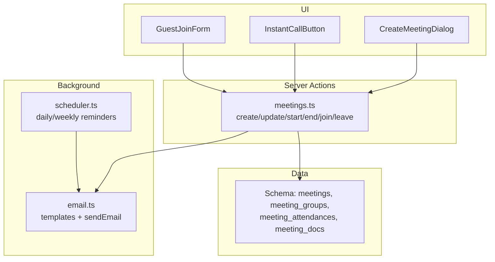
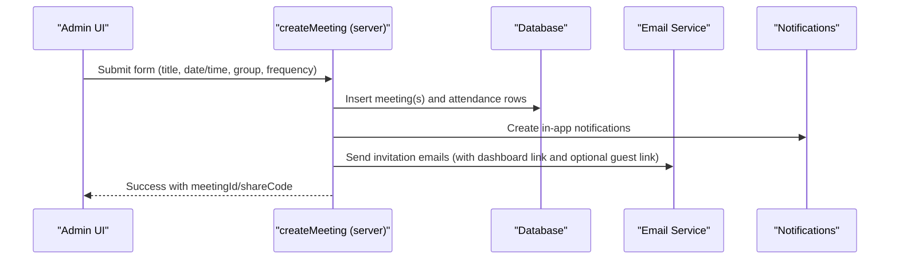
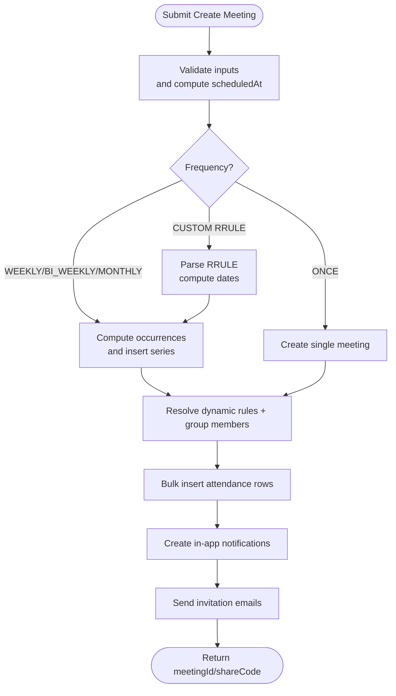
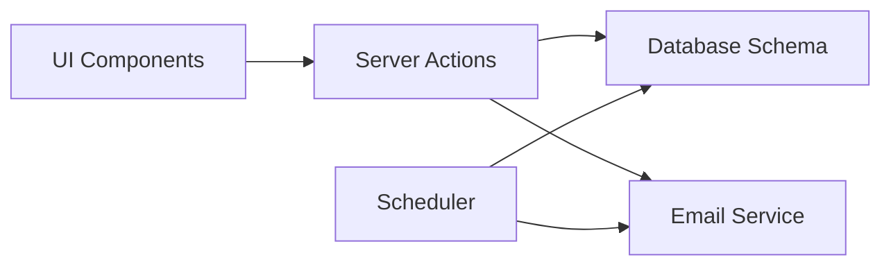

# Meeting Scheduling & Coordination

<cite>
**Referenced Files in This Document**
- [meetings.ts](file://lib/actions/meetings.ts)
- [create-meeting-dialog.tsx](file://components/meetings/create-meeting-dialog.tsx)
- [instant-call-button.tsx](file://components/meetings/instant-call-button.tsx)
- [guest-join-form.tsx](file://components/meetings/guest-join-form.tsx)
- [schema.ts](file://lib/db/schema.ts)
- [scheduler.ts](file://workers/scheduler.ts)
- [email.ts](file://lib/email.ts)
- [PROGRAMMES_MEETINGS_GUIDE.md](file://PROGRAMMES_MEETINGS_GUIDE.md)
- [meeting_module_user_guide.md](file://meeting_module_user_guide.md)
</cite>

## Table of Contents
1. Introduction
2. Project Structure
3. Core Components
4. Architecture Overview
5. Detailed Component Analysis
6. Dependency Analysis
7. Performance Considerations
8. Troubleshooting Guide
9. Conclusion
10. Appendices

## Introduction
This document explains the meeting scheduling and coordination system in the TMC Portal. It covers how meetings are created, how recurring schedules are generated, how invitations and notifications are sent, how attendees join and track presence, and how instant calls and virtual rooms work. It also outlines automated reminders, guest access via share codes, and integration with LiveKit for video rooms. Where applicable, it references concrete implementation files to ensure traceability.

## Project Structure
The meeting module spans server actions (business logic), UI components (scheduling forms and controls), database schema definitions, background schedulers (reminders), and email templates. Key areas:
- Server actions handle creation, updates, attendance, and instant calls.
- UI components provide forms for scheduling, instant calling, and guest joining.
- Database schema defines meetings, groups, attendance, and documents.
- Scheduler runs periodic tasks for reminders and weekly digests.
- Email service sends invitations and reminders using templates.

**Diagram sources**
- [create-meeting-dialog.tsx:110-158](file://components/meetings/create-meeting-dialog.tsx#L110-L158)
- [instant-call-button.tsx:14-30](file://components/meetings/instant-call-button.tsx#L14-L30)
- [guest-join-form.tsx:28-66](file://components/meetings/guest-join-form.tsx#L28-L66)
- [meetings.ts:33-303](file://lib/actions/meetings.ts#L33-L303)
- [schema.ts:918-1000](file://lib/db/schema.ts#L918-L1000)
- [scheduler.ts:12-51](file://workers/scheduler.ts#L12-L51)
- [email.ts:21-92](file://lib/email.ts#L21-L92)

**Section sources**
- [create-meeting-dialog.tsx:1-448](file://components/meetings/create-meeting-dialog.tsx#L1-L448)
- [instant-call-button.tsx:1-39](file://components/meetings/instant-call-button.tsx#L1-L39)
- [guest-join-form.tsx:1-89](file://components/meetings/guest-join-form.tsx#L1-L89)
- [meetings.ts:1-959](file://lib/actions/meetings.ts#L1-L959)
- [schema.ts:918-1000](file://lib/db/schema.ts#L918-L1000)
- [scheduler.ts:1-337](file://workers/scheduler.ts#L1-L337)
- [email.ts:1-423](file://lib/email.ts#L1-L423)

## Core Components
- Meeting creation and recurrence: supports one-time, weekly, bi-weekly, monthly, and custom RRULE-based recurrence; generates multiple instances up to a cap per series.
- Invitation management: resolves dynamic rules from meeting groups, bulk-inserts attendance records, creates in-app notifications, and sends emails with dashboard links and optional guest links.
- Instant group calls: creates an immediate online meeting, invites group members, and redirects to the room.
- Attendance tracking: digital check-in/out timestamps; late detection based on configured window.
- Automated reminders: daily scheduler sends 3-2-1 day reminders for upcoming events and weekly digests.
- Guest access: share codes enable direct guest joining to live rooms without login.

**Section sources**
- [meetings.ts:33-303](file://lib/actions/meetings.ts#L33-L303)
- [meetings.ts:530-618](file://lib/actions/meetings.ts#L530-L618)
- [meetings.ts:669-718](file://lib/actions/meetings.ts#L669-L718)
- [scheduler.ts:199-285](file://workers/scheduler.ts#L199-L285)
- [email.ts:253-321](file://lib/email.ts#L253-L321)

## Architecture Overview
The system follows a Next.js server actions pattern:
- Client UI triggers server actions for create/update/start/end/join/leave.
- Server actions persist data via Drizzle ORM against MySQL tables defined in schema.
- Invitations trigger in-app notifications and emails via Resend.
- Background scheduler periodically scans upcoming events and sends reminders.
- Virtual rooms use LiveKit; guests obtain tokens via API routes.

**Diagram sources**
- [create-meeting-dialog.tsx:110-158](file://components/meetings/create-meeting-dialog.tsx#L110-L158)
- [meetings.ts:33-303](file://lib/actions/meetings.ts#L33-L303)
- [email.ts:253-321](file://lib/email.ts#L253-L321)

## Detailed Component Analysis

### Meeting Creation Workflow
- Date/time selection: The form collects date and time fields and combines them into an ISO timestamp before submission.
- Recurrence support:
  - One-time, weekly, bi-weekly, monthly: calculates subsequent occurrences by adding days or months.
  - Custom RRULE: parses iCalendar RRULE strings and computes occurrences up to year-end or a maximum count.
- Series handling: Non-one-time meetings get a shared seriesId; all instances share the same virtualRoomId and shareCode for consistent links.
- Attendee resolution:
  - Dynamic rules from meeting groups can include all jurisdiction members, officials, and child admins.
  - Group members are resolved and merged with any manual attendees.
  - Bulk attendance rows are inserted for each occurrence.
- Notifications and emails:
  - In-app notifications are created for invitees.
  - Emails are sent asynchronously with meeting details and links.

**Diagram sources**
- [meetings.ts:33-303](file://lib/actions/meetings.ts#L33-L303)
- [create-meeting-dialog.tsx:110-158](file://components/meetings/create-meeting-dialog.tsx#L110-L158)

**Section sources**
- [meetings.ts:33-303](file://lib/actions/meetings.ts#L33-L303)
- [create-meeting-dialog.tsx:34-47](file://components/meetings/create-meeting-dialog.tsx#L34-L47)
- [create-meeting-dialog.tsx:110-158](file://components/meetings/create-meeting-dialog.tsx#L110-L158)

### Timezone Handling
- Dates are stored as timestamps; the UI uses local date/time inputs which are converted to ISO strings before submission.
- No explicit timezone conversion is performed in the creation flow; times are treated as provided by the client.
- For cross-timezone scenarios, consider storing both UTC and display timezone metadata at the user level and converting when rendering.

[No sources needed since this section provides general guidance]

### Recurring Meetings Support
- Built-in frequencies: ONCE, WEEKLY, BI_WEEKLY, MONTHLY.
- Custom RRULE: Supports complex rules like “second Saturday of every month.”
- Occurrence limits: Defaults to a configurable number (up to 52) and capped by year-end for custom rules.
- Shared resources: All instances in a series share virtualRoomId and shareCode for consistent access.

**Section sources**
- [meetings.ts:55-156](file://lib/actions/meetings.ts#L55-L156)
- [create-meeting-dialog.tsx:323-392](file://components/meetings/create-meeting-dialog.tsx#L323-L392)

### Invitation Management
- Dynamic rules: Include all active members, officials, and child admins based on organization hierarchy.
- Group membership: Pulls users from meeting_group_members.
- Manual attendees: Additional user IDs can be included.
- Notifications: In-app notifications created for each invitee.
- Emails: Asynchronous sending with meeting details and links; includes guest link for online meetings.

**Section sources**
- [meetings.ts:172-294](file://lib/actions/meetings.ts#L172-L294)
- [email.ts:253-321](file://lib/email.ts#L253-L321)

### Guest Access Codes
- Share code generation: Randomized code used for guest join URLs.
- Guest join flow: Guests enter name and request token; token grants access to the LiveKit room.
- Reuse across series: Share code is shared per series for convenience.

**Section sources**
- [meetings.ts:59-61](file://lib/actions/meetings.ts#L59-L61)
- [guest-join-form.tsx:28-66](file://components/meetings/guest-join-form.tsx#L28-L66)

### Attendee Coordination and RSVP Tracking
- Status model: INVITED, ACCEPTED, DECLINED, PRESENT, ABSENT.
- Digital attendance: Joining sets status to PRESENT with joinedAt; leaving sets leftAt.
- Late detection: Configurable attendanceWindow determines minutes after start considered late.
- Capacity limits and waitlist: Not implemented in current codebase; would require additional fields and logic.

**Section sources**
- [schema.ts:973-987](file://lib/db/schema.ts#L973-L987)
- [meetings.ts:669-718](file://lib/actions/meetings.ts#L669-L718)

### Instant Meeting Creation
- Instant group call: Creates an immediate online meeting with a virtual room and share code, invites group members, and redirects to the room.
- Notifications and emails: Immediate in-app notifications and emails are sent to group members.

**Section sources**
- [instant-call-button.tsx:14-30](file://components/meetings/instant-call-button.tsx#L14-L30)
- [meetings.ts:530-618](file://lib/actions/meetings.ts#L530-L618)

### Scheduled Meetings and Automated Reminders
- Daily reminders: Scheduler runs daily to notify about upcoming events 3, 2, and 1 day ahead.
- Weekly digest: Sends a weekly summary of upcoming events to all users.
- Integration: Uses email queue and in-app notifications.

**Section sources**
- [scheduler.ts:12-51](file://workers/scheduler.ts#L12-L51)
- [scheduler.ts:199-285](file://workers/scheduler.ts#L199-L285)
- [email.ts:21-92](file://lib/email.ts#L21-L92)

### External Calendar Systems and Mobile Push Notifications
- External calendar systems: No explicit calendar export or ICS generation found in the referenced files.
- Mobile push notifications: No mobile push implementation identified in the referenced files; only in-app notifications and emails are present.

[No sources needed since this section provides general guidance]

### Meeting Templates and Bulk Scheduling
- Templates: No dedicated meeting template feature found; recurring meetings serve as reusable patterns via frequency and RRULE.
- Bulk scheduling: Recurrence engine generates multiple instances automatically; no separate bulk import tool for meetings was identified.

**Section sources**
- [meetings.ts:55-156](file://lib/actions/meetings.ts#L55-L156)

### Conflict Detection and Resource Availability
- Conflict detection: Not implemented in the referenced code; no overlap checks during creation.
- Resource availability: No resource booking or capacity enforcement beyond virtual room size hints.

[No sources needed since this section provides general guidance]

## Dependency Analysis
Key dependencies and relationships:
- UI components depend on server actions for state changes.
- Server actions depend on database schema and email service.
- Scheduler depends on database queries and email queue.
- Guest join depends on LiveKit token issuance via API route (not shown here).

**Diagram sources**
- [create-meeting-dialog.tsx:110-158](file://components/meetings/create-meeting-dialog.tsx#L110-L158)
- [meetings.ts:33-303](file://lib/actions/meetings.ts#L33-L303)
- [scheduler.ts:12-51](file://workers/scheduler.ts#L12-L51)
- [email.ts:21-92](file://lib/email.ts#L21-L92)

**Section sources**
- [meetings.ts:1-959](file://lib/actions/meetings.ts#L1-L959)
- [scheduler.ts:1-337](file://workers/scheduler.ts#L1-L337)
- [email.ts:1-423](file://lib/email.ts#L1-L423)

## Performance Considerations
- Bulk inserts: Attendance rows are inserted in chunks to avoid large transaction sizes.
- Asynchronous emails: Sending emails is done concurrently to reduce latency.
- Recurrence limits: Cap occurrences to prevent excessive series generation.
- Indexing: Ensure indexes on frequently queried fields (e.g., scheduledAt, organizationId) for performance.

[No sources needed since this section provides general guidance]

## Troubleshooting Guide
Common issues and resolutions:
- Unauthorized errors: Ensure session is valid when calling server actions.
- Invalid RRULE: Check RRULE syntax; invalid rules will be logged and skipped.
- Email delivery failures: Check email logs and provider configuration; development mode logs instead of sending.
- Guest join token failure: Verify LiveKit configuration and API route availability.

**Section sources**
- [meetings.ts:34-35](file://lib/actions/meetings.ts#L34-L35)
- [meetings.ts:108-110](file://lib/actions/meetings.ts#L108-L110)
- [email.ts:21-92](file://lib/email.ts#L21-L92)
- [guest-join-form.tsx:28-66](file://components/meetings/guest-join-form.tsx#L28-L66)

## Conclusion
The TMC Portal’s meeting module provides robust scheduling with flexible recurrence, automated reminders, and integrated virtual rooms. Invitations are managed through dynamic rules and group memberships, with notifications and emails ensuring participants are informed. While features like conflict detection, capacity limits, and external calendar integrations are not present in the referenced code, the foundation supports future enhancements.

[No sources needed since this section summarizes without analyzing specific files]

## Appendices

### Example Scenarios
- Board meeting (monthly):
  - Use MONTHLY frequency with a default number of occurrences; attach previous minutes if needed.
  - Invite via meeting group that includes board members.
- Committee session (weekly):
  - Use WEEKLY frequency; set venue or enable online mode for native room.
  - Attach agenda and minutes as needed.
- Training session (custom recurrence):
  - Use CUSTOM RRULE to define specific days (e.g., second Saturday monthly).
  - Enable online mode and share guest link for non-members.

[No sources needed since this section provides general guidance]