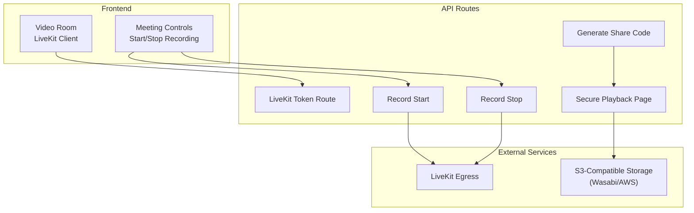
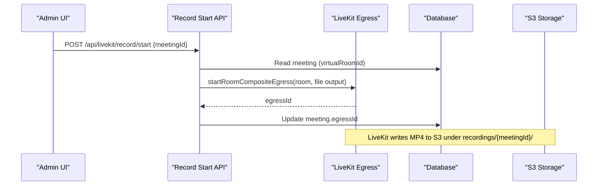
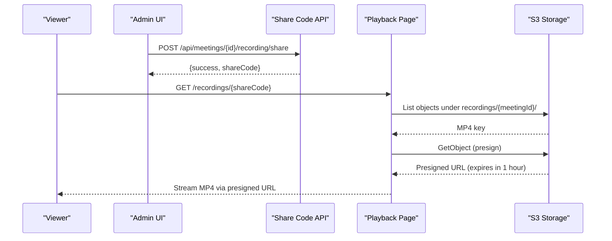
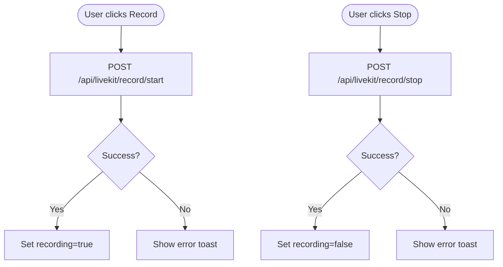
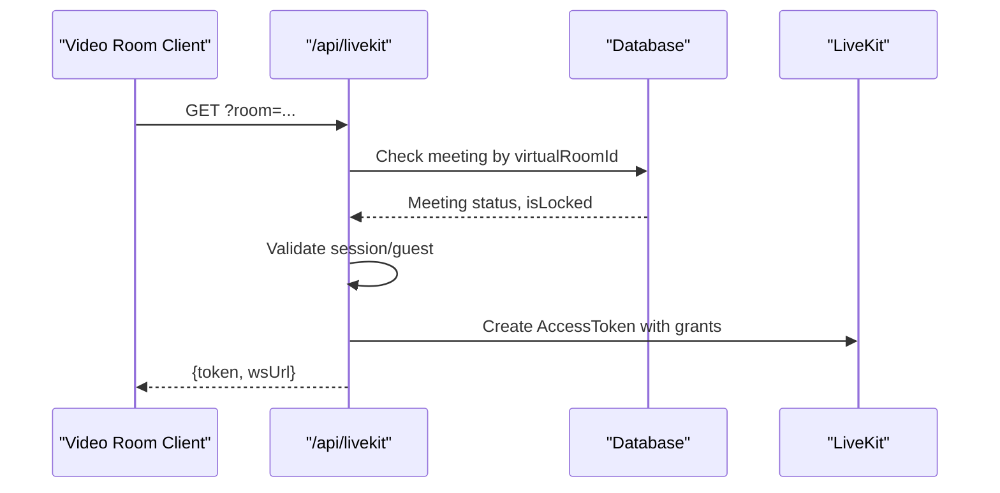
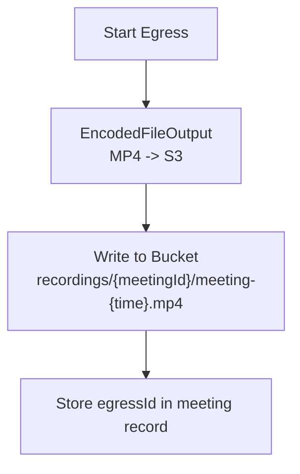
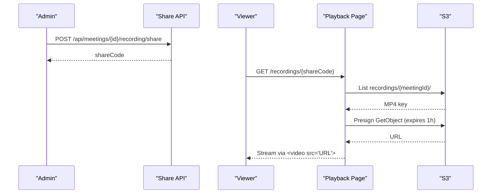
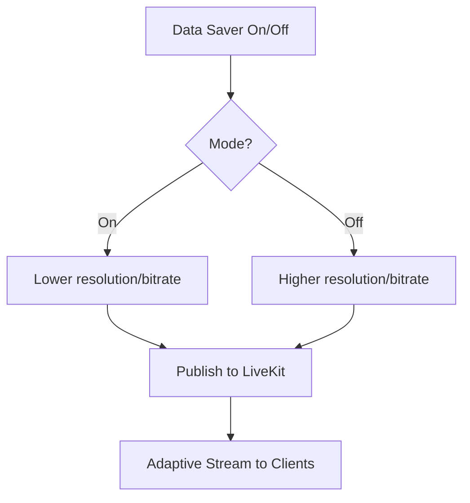
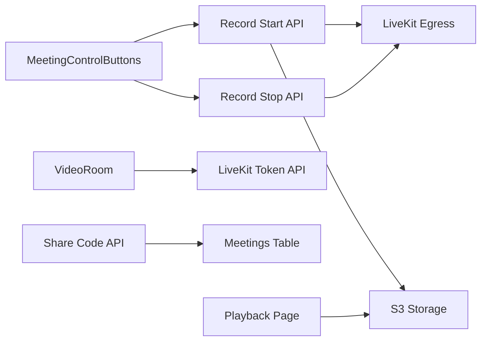

# Recording & Playback Management

<cite>
**Referenced Files in This Document**
- [meeting-control-buttons.tsx](file://components/meetings/meeting-control-buttons.tsx)
- [video-room.tsx](file://components/meetings/video-room.tsx)
- [livekit route.ts](file://app/api/livekit/route.ts)
- [record start route.ts](file://app/api/livekit/record/start/route.ts)
- [record stop route.ts](file://app/api/livekit/record/stop/route.ts)
- [recording share route.ts](file://app/api/meetings/[id]/recording/share/route.ts)
- [secure recording page.tsx](file://app/recordings/[shareCode]/page.tsx)
- [settings actions.ts](file://lib/actions/settings.ts)
- [storage settings card.tsx](file://components/admin/settings/storage-settings-card.tsx)
- [livekit settings card.tsx](file://components/admin/settings/livekit-settings-card.tsx)
- [automated backup.ts](file://scripts/automated-backup.ts)
- [make-public.ts](file://scripts/make-public.ts)
- [unblock-public.ts](file://scripts/unblock-public.ts)
- [file route.ts](file://app/api/file/route.ts)
</cite>

## Table of Contents
1. Introduction
2. Project Structure
3. Core Components
4. Architecture Overview
5. Detailed Component Analysis
6. Dependency Analysis
7. Performance Considerations
8. Troubleshooting Guide
9. Conclusion

## Introduction
This document explains the meeting recording and playback system, including how recordings are initiated, stored, shared, and played back. It covers automatic and manual recording controls, cloud storage integration with S3-compatible providers (e.g., Wasabi), secure playback via time-limited presigned URLs, and administrative configuration for storage and LiveKit. It also provides guidance on privacy, analytics, and troubleshooting common issues.

## Project Structure
The recording and playback feature spans several layers:
- Frontend controls for starting/stopping recordings and joining video rooms
- API routes to manage LiveKit sessions, record start/stop, and generate secure playback links
- Server-side logic to configure LiveKit and S3-compatible storage
- A public-facing playback page that generates temporary access to recorded MP4 files

**Diagram sources**
- [meeting-control-buttons.tsx:65-107](file://components/meetings/meeting-control-buttons.tsx#L65-L107)
- [video-room.tsx:28-44](file://components/meetings/video-room.tsx#L28-L44)
- [livekit route.ts:9-106](file://app/api/livekit/route.ts#L9-L106)
- [record start route.ts:9-76](file://app/api/livekit/record/start/route.ts#L9-L76)
- [record stop route.ts:9-39](file://app/api/livekit/record/stop/route.ts#L9-L39)
- [recording share route.ts:7-24](file://app/api/meetings/[id]/recording/share/route.ts#L7-L24)
- [secure recording page.tsx:12-88](file://app/recordings/[shareCode]/page.tsx#L12-L88)

**Section sources**
- [meeting-control-buttons.tsx:1-177](file://components/meetings/meeting-control-buttons.tsx#L1-L177)
- [video-room.tsx:1-135](file://components/meetings/video-room.tsx#L1-L135)
- [livekit route.ts:1-112](file://app/api/livekit/route.ts#L1-L112)
- [record start route.ts:1-82](file://app/api/livekit/record/start/route.ts#L1-L82)
- [record stop route.ts:1-45](file://app/api/livekit/record/stop/route.ts#L1-L45)
- [recording share route.ts:1-29](file://app/api/meetings/[id]/recording/share/route.ts#L1-L29)
- [secure recording page.tsx:1-137](file://app/recordings/[shareCode]/page.tsx#L1-L137)

## Core Components
- Meeting control buttons: Provide manual start/stop recording controls during an ongoing meeting and display current recording state.
- Video room client: Joins a LiveKit room, fetches a token from the server, and configures adaptive streaming and bandwidth optimization.
- LiveKit token endpoint: Validates meeting status, enforces lock/access rules, and issues tokens with publish/subscribe permissions.
- Record start/stop endpoints: Use LiveKit Egress to write MP4 files directly to S3-compatible storage under per-meeting folders.
- Secure playback: Generates a share code per meeting; viewers use it to obtain a time-limited presigned URL to stream the MP4.

Key responsibilities:
- Authentication and authorization checks before recording or playback
- Configuration of LiveKit and S3 credentials from system settings
- Secure, time-bound access to recordings without exposing bucket policies publicly

**Section sources**
- [meeting-control-buttons.tsx:65-107](file://components/meetings/meeting-control-buttons.tsx#L65-L107)
- [video-room.tsx:28-44](file://components/meetings/video-room.tsx#L28-L44)
- [livekit route.ts:22-73](file://app/api/livekit/route.ts#L22-L73)
- [record start route.ts:22-76](file://app/api/livekit/record/start/route.ts#L22-L76)
- [record stop route.ts:22-39](file://app/api/livekit/record/stop/route.ts#L22-L39)
- [recording share route.ts:12-24](file://app/api/meetings/[id]/recording/share/route.ts#L12-L24)
- [secure recording page.tsx:46-88](file://app/recordings/[shareCode]/page.tsx#L46-L88)

## Architecture Overview
The system integrates LiveKit for real-time media and S3-compatible storage for durable recording retention.

**Diagram sources**
- [record start route.ts:17-76](file://app/api/livekit/record/start/route.ts#L17-L76)

Playback flow:

**Diagram sources**
- [recording share route.ts:12-24](file://app/api/meetings/[id]/recording/share/route.ts#L12-L24)
- [secure recording page.tsx:46-88](file://app/recordings/[shareCode]/page.tsx#L46-L88)

## Detailed Component Analysis

### Manual Recording Controls
- The admin UI exposes Start/Stop recording buttons when a meeting is ONGOING.
- Start calls the record start API; Stop calls the record stop API.
- UI updates based on success responses and persists recording state locally until refresh.

**Diagram sources**
- [meeting-control-buttons.tsx:65-107](file://components/meetings/meeting-control-buttons.tsx#L65-L107)

**Section sources**
- [meeting-control-buttons.tsx:65-107](file://components/meetings/meeting-control-buttons.tsx#L65-L107)

### LiveKit Session and Access Control
- The token endpoint validates that the meeting exists and is ONGOING.
- Enforces meeting lock: non-admin users cannot join locked meetings.
- Issues tokens with publish/subscribe permissions; supports guest joins with a name.

**Diagram sources**
- [livekit route.ts:9-106](file://app/api/livekit/route.ts#L9-L106)

**Section sources**
- [livekit route.ts:22-73](file://app/api/livekit/route.ts#L22-L73)
- [livekit route.ts:76-106](file://app/api/livekit/route.ts#L76-L106)

### Recording Storage and File Organization
- Recordings are written by LiveKit Egress as MP4 files into S3-compatible storage.
- File path pattern organizes files per meeting: recordings/{meetingId}/meeting-{time}.mp4.
- Credentials can be provided via LiveKit-specific settings or general storage settings; region and endpoint are configurable.

**Diagram sources**
- [record start route.ts:43-76](file://app/api/livekit/record/start/route.ts#L43-L76)

**Section sources**
- [record start route.ts:29-64](file://app/api/livekit/record/start/route.ts#L29-L64)
- [settings actions.ts:276-282](file://lib/actions/settings.ts#L276-L282)

### Playback and Sharing
- Admins generate a share code per meeting.
- Viewers open /recordings/{shareCode}, which locates the latest MP4 under the meeting’s folder and returns a 1-hour presigned URL for streaming.
- The player disables download controls to reduce casual sharing.

**Diagram sources**
- [recording share route.ts:12-24](file://app/api/meetings/[id]/recording/share/route.ts#L12-L24)
- [secure recording page.tsx:66-83](file://app/recordings/[shareCode]/page.tsx#L66-L83)

**Section sources**
- [recording share route.ts:12-24](file://app/api/meetings/[id]/recording/share/route.ts#L12-L24)
- [secure recording page.tsx:90-133](file://app/recordings/[shareCode]/page.tsx#L90-L133)

### Bandwidth Optimization and Quality Settings
- Data saver mode reduces resolution and bitrate for both capture and publishing.
- Adaptive streaming is enabled to adjust quality dynamically.

**Diagram sources**
- [video-room.tsx:95-121](file://components/meetings/video-room.tsx#L95-L121)

**Section sources**
- [video-room.tsx:95-121](file://components/meetings/video-room.tsx#L95-L121)

### Administrative Configuration
- LiveKit and S3 settings are managed via admin settings cards and persisted to system settings.
- Supports optional dedicated S3 bucket for LiveKit recordings; otherwise falls back to general storage bucket.

**Section sources**
- [livekit settings card.tsx:90-111](file://components/admin/settings/livekit-settings-card.tsx#L90-L111)
- [storage settings card.tsx:32-61](file://components/admin/settings/storage-settings-card.tsx#L32-L61)
- [settings actions.ts:290-324](file://lib/actions/settings.ts#L290-L324)

## Dependency Analysis
- Frontend components depend on API routes for token generation and recording control.
- Recording APIs depend on LiveKit SDK and S3 client configuration from system settings.
- Playback page depends on S3 listing and presigning to serve secure streams.

**Diagram sources**
- [meeting-control-buttons.tsx:65-107](file://components/meetings/meeting-control-buttons.tsx#L65-L107)
- [video-room.tsx:28-44](file://components/meetings/video-room.tsx#L28-L44)
- [record start route.ts:22-76](file://app/api/livekit/record/start/route.ts#L22-L76)
- [record stop route.ts:22-39](file://app/api/livekit/record/stop/route.ts#L22-L39)
- [recording share route.ts:12-24](file://app/api/meetings/[id]/recording/share/route.ts#L12-L24)
- [secure recording page.tsx:46-88](file://app/recordings/[shareCode]/page.tsx#L46-L88)

**Section sources**
- [record start route.ts:22-76](file://app/api/livekit/record/start/route.ts#L22-L76)
- [record stop route.ts:22-39](file://app/api/livekit/record/stop/route.ts#L22-L39)
- [secure recording page.tsx:46-88](file://app/recordings/[shareCode]/page.tsx#L46-L88)

## Performance Considerations
- Enable adaptive streaming and data saver mode to reduce bandwidth usage during live sessions.
- Prefer S3-compatible storage in regions close to participants to minimize latency.
- Keep recording resolutions and bitrates aligned with network conditions; lower values improve reliability on constrained networks.
- Use presigned URLs with short expiration to limit exposure and reduce load on storage.

[No sources needed since this section provides general guidance]

## Troubleshooting Guide
Common issues and resolutions:
- Storage not configured: Ensure LiveKit or general storage settings include bucket, region, endpoint, and credentials. Errors will surface at record start or playback.
- LiveKit misconfigured: Verify LiveKit URL, API key, and secret are set in system settings; token generation will fail otherwise.
- Recording unavailable: If no MP4 is found under the meeting folder, the recording may still be processing or failed; retry later or check LiveKit Egress status.
- Playback errors: Confirm the share code matches a meeting and that the storage bucket is reachable; presigned URL generation requires valid credentials.
- Public access concerns: Avoid making buckets publicly readable; rely on presigned URLs for secure playback.

Operational scripts:
- Automated backups: Retention cleanup for local and cloud backups can be scheduled to manage storage consumption.
- Public access helpers: Scripts exist to apply/remove public access blocks or bucket policies; use cautiously and only when necessary.

**Section sources**
- [secure recording page.tsx:31-44](file://app/recordings/[shareCode]/page.tsx#L31-L44)
- [livekit route.ts:92-95](file://app/api/livekit/route.ts#L92-L95)
- [automated backup.ts:31-84](file://scripts/automated-backup.ts#L31-L84)
- [make-public.ts:12-23](file://scripts/make-public.ts#L12-L23)
- [unblock-public.ts:12-23](file://scripts/unblock-public.ts#L12-L23)

## Conclusion
The system provides robust meeting recording via LiveKit Egress to S3-compatible storage, with secure playback through time-limited presigned URLs. Administrators control recording lifecycle and sharing via simple UI actions, while privacy is enforced by requiring a share code and expiring links. Proper configuration of LiveKit and storage settings ensures reliable operation, and performance can be tuned using adaptive streaming and data saver modes. For long-term management, automated retention scripts help maintain storage hygiene.

[No sources needed since this section summarizes without analyzing specific files]