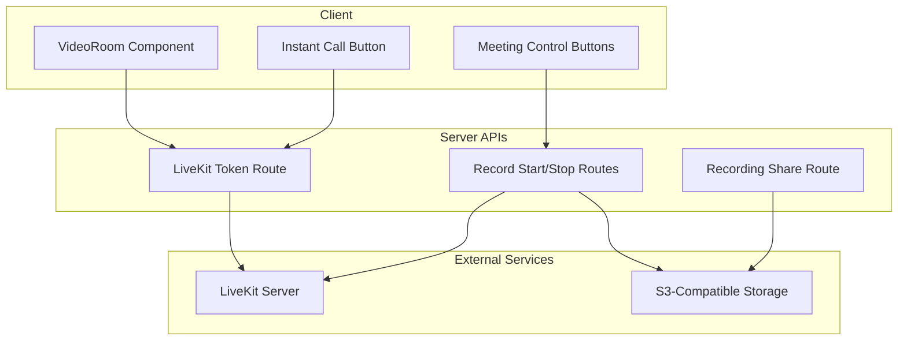
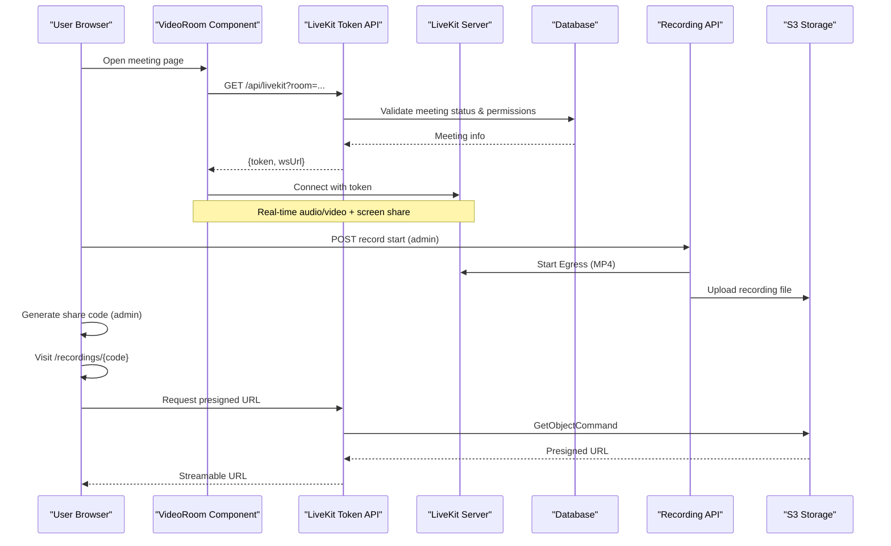
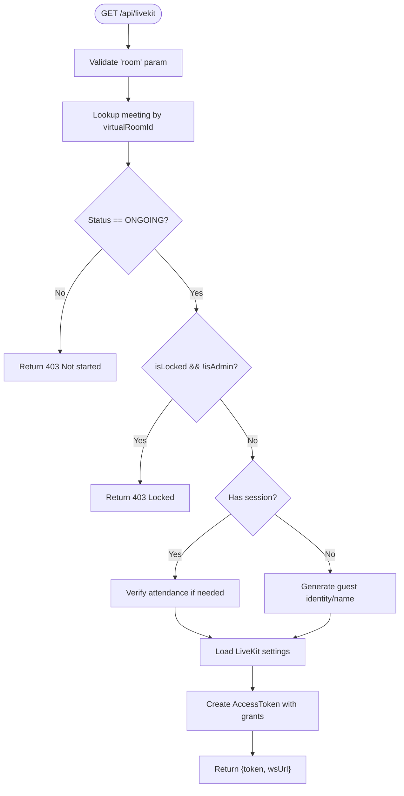
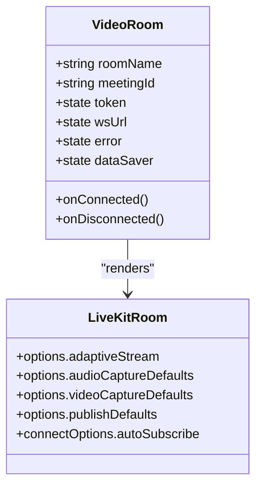
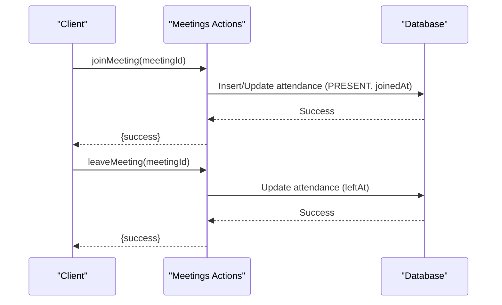
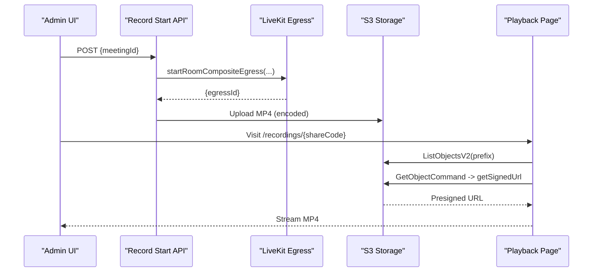
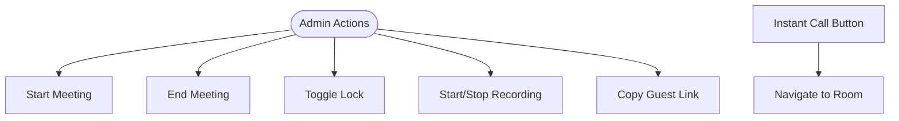
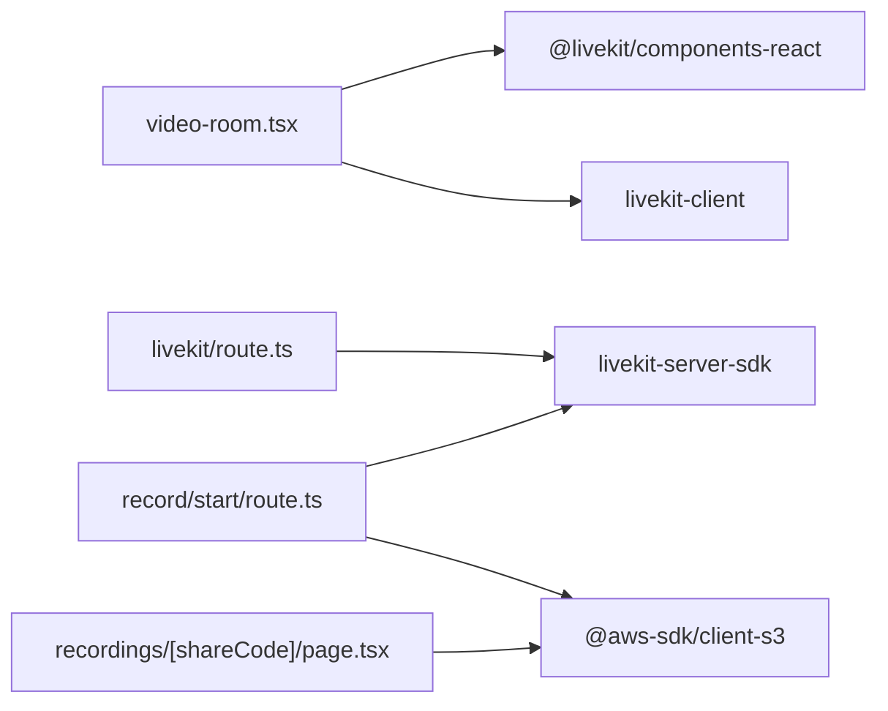

# Video Conferencing & LiveKit Integration

<cite>
**Referenced Files in This Document**
- [route.ts](file://app/api/livekit/route.ts)
- [video-room.tsx](file://components/meetings/video-room.tsx)
- [livekit-settings-card.tsx](file://components/admin/settings/livekit-settings-card.tsx)
- [start route.ts](file://app/api/livekit/record/start/route.ts)
- [share route.ts](file://app/api/meetings/[id]/recording/share/route.ts)
- [page.tsx](file://app/recordings/[shareCode]/page.tsx)
- [meeting-control-buttons.tsx](file://components/meetings/meeting-control-buttons.tsx)
- [instant-call-button.tsx](file://components/meetings/instant-call-button.tsx)
- [meetings actions](file://lib/actions/meetings.ts)
- [contest-live-room.tsx](file://components/contests-live/contest-live-room.tsx)
</cite>

## Table of Contents
1. Introduction
2. Project Structure
3. Core Components
4. Architecture Overview
5. Detailed Component Analysis
6. Dependency Analysis
7. Performance Considerations
8. Troubleshooting Guide
9. Conclusion

## Introduction
This document explains the TMC Portal’s video conferencing system powered by LiveKit. It covers real-time WebRTC connections, media stream handling, peer-to-peer communication patterns via LiveKit rooms, server-side token issuance and room access control, participant lifecycle management, screen sharing, recording to cloud storage with secure playback, audio/video quality controls, accessibility features, security measures, and troubleshooting guidance for common issues.

## Project Structure
The video conferencing feature spans Next.js API routes (server), React components (client), and server actions for meeting state:
- Client UI renders a LiveKitRoom and manages connection options and data saver mode.
- Server API validates meeting status and permissions, then issues a signed LiveKit token.
- Recording is initiated via an Egress job that writes MP4 files to S3-compatible storage.
- Secure playback uses presigned URLs gated by a share code.

**Diagram sources**
- [video-room.tsx:28-44](file://components/meetings/video-room.tsx#L28-L44)
- [route.ts:9-106](file://app/api/livekit/route.ts#L9-L106)
- [start route.ts:9-76](file://app/api/livekit/record/start/route.ts#L9-L76)
- [share route.ts:7-24](file://app/api/meetings/[id]/recording/share/route.ts#L7-L24)
- [page.tsx:12-84](file://app/recordings/[shareCode]/page.tsx#L12-L84)

**Section sources**
- [video-room.tsx:28-44](file://components/meetings/video-room.tsx#L28-L44)
- [route.ts:9-106](file://app/api/livekit/route.ts#L9-L106)
- [start route.ts:9-76](file://app/api/livekit/record/start/route.ts#L9-L76)
- [share route.ts:7-24](file://app/api/meetings/[id]/recording/share/route.ts#L7-L24)
- [page.tsx:12-84](file://app/recordings/[shareCode]/page.tsx#L12-L84)

## Core Components
- LiveKit Room Access: The client requests a token from the server using the room name; the server validates meeting state and permissions before issuing a token with publish/subscribe grants.
- Media Handling: The client configures capture and publishing options including adaptive streaming, noise suppression, echo cancellation, auto gain control, and resolution/bitrate limits. Data saver mode reduces bandwidth usage.
- Participant Lifecycle: Joining triggers attendance check-in; leaving updates attendance records. Admins can start/end meetings and lock/unlock rooms.
- Recording: Admins start/stop recordings via API; LiveKit Egress writes MP4 to S3-compatible storage. Playback pages generate time-limited presigned URLs behind a share code.

**Section sources**
- [route.ts:22-106](file://app/api/livekit/route.ts#L22-L106)
- [video-room.tsx:83-130](file://components/meetings/video-room.tsx#L83-L130)
- [meetings actions:676-718](file://lib/actions/meetings.ts#L676-L718)
- [meeting-control-buttons.tsx:65-107](file://components/meetings/meeting-control-buttons.tsx#L65-L107)
- [start route.ts:29-76](file://app/api/livekit/record/start/route.ts#L29-L76)
- [page.tsx:22-84](file://app/recordings/[shareCode]/page.tsx#L22-L84)

## Architecture Overview
End-to-end flow from browser to LiveKit and storage:

**Diagram sources**
- [video-room.tsx:28-44](file://components/meetings/video-room.tsx#L28-L44)
- [route.ts:9-106](file://app/api/livekit/route.ts#L9-L106)
- [start route.ts:9-76](file://app/api/livekit/record/start/route.ts#L9-L76)
- [share route.ts:7-24](file://app/api/meetings/[id]/recording/share/route.ts#L7-L24)
- [page.tsx:12-84](file://app/recordings/[shareCode]/page.tsx#L12-L84)

## Detailed Component Analysis

### LiveKit Token Issuance and Room Access Control
- Validates presence of room parameter and session context.
- Ensures the meeting exists, is ongoing, and not locked unless user is admin.
- Supports authenticated members and guest flows (guest identity/name).
- Reads LiveKit credentials from settings or environment variables.
- Issues a JWT token with room join, publish, subscribe, and optional roomAdmin grant.

**Diagram sources**
- [route.ts:9-106](file://app/api/livekit/route.ts#L9-L106)

**Section sources**
- [route.ts:18-106](file://app/api/livekit/route.ts#L18-L106)

### Client-Side Video Room and Media Controls
- Fetches token and WebSocket URL on mount.
- Renders LiveKitRoom with adaptive streaming, noise suppression, echo cancellation, auto gain control.
- Data saver mode toggles video off, lowers resolution, bitrate, and frame rates for both camera and screen share.
- On connected/disconnected, updates attendance via server actions.

**Diagram sources**
- [video-room.tsx:22-130](file://components/meetings/video-room.tsx#L22-L130)

**Section sources**
- [video-room.tsx:28-130](file://components/meetings/video-room.tsx#L28-L130)
- [contest-live-room.tsx:40-65](file://components/contests-live/contest-live-room.tsx#L40-L65)

### Participant Lifecycle Management
- Joining a meeting marks attendance as present and sets joinedAt timestamp.
- Leaving updates leftAt timestamp.
- Revalidation ensures UI reflects current state.

**Diagram sources**
- [meetings actions:676-718](file://lib/actions/meetings.ts#L676-L718)

**Section sources**
- [meetings actions:676-718](file://lib/actions/meetings.ts#L676-L718)

### Recording to Cloud Storage and Secure Playback
- Admin starts recording via API; server creates an Egress job to encode and upload MP4 to S3-compatible storage.
- Egress ID is stored on the meeting record for tracking.
- Playback requires a generated share code; the playback page finds the meeting by code, lists objects under the meeting folder, and returns a presigned URL for the MP4.

**Diagram sources**
- [start route.ts:9-76](file://app/api/livekit/record/start/route.ts#L9-L76)
- [page.tsx:12-84](file://app/recordings/[shareCode]/page.tsx#L12-L84)

**Section sources**
- [start route.ts:22-76](file://app/api/livekit/record/start/route.ts#L22-L76)
- [share route.ts:7-24](file://app/api/meetings/[id]/recording/share/route.ts#L7-L24)
- [page.tsx:12-84](file://app/recordings/[shareCode]/page.tsx#L12-L84)

### Admin Controls and Instant Calls
- Start/End meeting states are managed via server actions.
- Lock/Unlock prevents non-admin participants from joining when locked.
- Instant call button initiates a group call and navigates directly to the room.

**Diagram sources**
- [meeting-control-buttons.tsx:16-107](file://components/meetings/meeting-control-buttons.tsx#L16-L107)
- [instant-call-button.tsx:14-30](file://components/meetings/instant-call-button.tsx#L14-L30)

**Section sources**
- [meeting-control-buttons.tsx:16-107](file://components/meetings/meeting-control-buttons.tsx#L16-L107)
- [instant-call-button.tsx:14-30](file://components/meetings/instant-call-button.tsx#L14-L30)

### LiveKit Settings and Storage Configuration
- Admin settings card allows configuring LiveKit URL, API key, secret, and optional S3 bucket details dedicated to recordings.
- If S3 fields are blank, the system falls back to general storage integration settings.

**Section sources**
- [livekit-settings-card.tsx:20-160](file://components/admin/settings/livekit-settings-card.tsx#L20-L160)

## Dependency Analysis
Key dependencies and relationships:
- Client components depend on @livekit/components-react and livekit-client for WebRTC and media handling.
- Server routes depend on livekit-server-sdk for token generation and Egress operations.
- Database schema includes meetings and meetingAttendances used for access control and attendance tracking.
- Storage integration supports S3-compatible endpoints (e.g., Wasabi) with path-style configuration.

**Diagram sources**
- [video-room.tsx:5-12](file://components/meetings/video-room.tsx#L5-L12)
- [route.ts:1-7](file://app/api/livekit/route.ts#L1-L7)
- [start route.ts:1-7](file://app/api/livekit/record/start/route.ts#L1-L7)
- [page.tsx:1-7](file://app/recordings/[shareCode]/page.tsx#L1-L7)

**Section sources**
- [video-room.tsx:5-12](file://components/meetings/video-room.tsx#L5-L12)
- [route.ts:1-7](file://app/api/livekit/route.ts#L1-L7)
- [start route.ts:1-7](file://app/api/livekit/record/start/route.ts#L1-L7)
- [page.tsx:1-7](file://app/recordings/[shareCode]/page.tsx#L1-L7)

## Performance Considerations
- Adaptive streaming enabled to optimize bandwidth and quality based on network conditions.
- Data saver mode reduces video resolution, bitrate, and frame rate for both camera and screen share to conserve bandwidth.
- Audio capture defaults include echo cancellation, noise suppression, and auto gain control for better audio quality.
- Screen share encoding is tuned separately to balance clarity and performance.
- Use presigned URLs for playback to avoid exposing long-lived storage credentials.

[No sources needed since this section provides general guidance]

## Troubleshooting Guide
Common issues and resolutions:
- Missing room parameter: Ensure the room query parameter is provided when requesting a token.
- Meeting not found or not started: Verify the meeting exists and has status ONGOING; admins must start the meeting before participants can join.
- Meeting locked: Non-admin users cannot join a locked meeting; unlock via admin controls.
- Unauthorized guest access: Provide a guest name when accessing without authentication.
- LiveKit misconfiguration: Confirm LiveKit URL, API key, and secret are set in system settings or environment variables.
- Recording failures: Ensure S3 credentials and bucket are configured; verify Egress job creation and storage connectivity.
- Playback unavailable: Wait for recording to finish uploading; ensure share code matches a meeting with recorded content.

**Section sources**
- [route.ts:18-95](file://app/api/livekit/route.ts#L18-L95)
- [start route.ts:22-41](file://app/api/livekit/record/start/route.ts#L22-L41)
- [page.tsx:31-84](file://app/recordings/[shareCode]/page.tsx#L31-L84)

## Conclusion
The TMC Portal integrates LiveKit to deliver secure, scalable video conferencing with robust access control, flexible media settings, and reliable recording to cloud storage. Admins can manage meetings, control participant access, and enable secure playback through share codes. Clients benefit from adaptive streaming and data saver modes to maintain quality across varying network conditions. Proper configuration of LiveKit and storage settings is essential for seamless operation.

[No sources needed since this section summarizes without analyzing specific files]