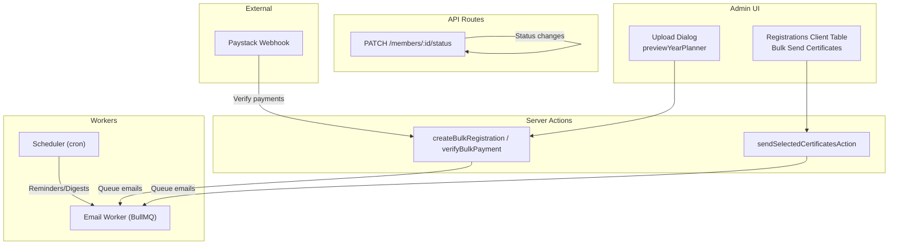
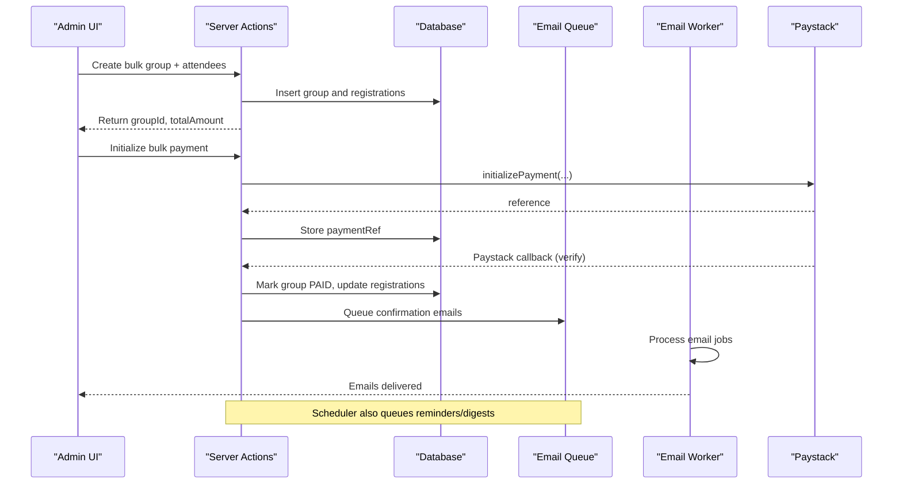
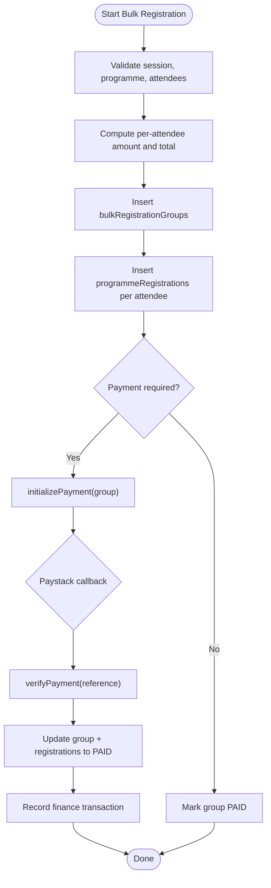
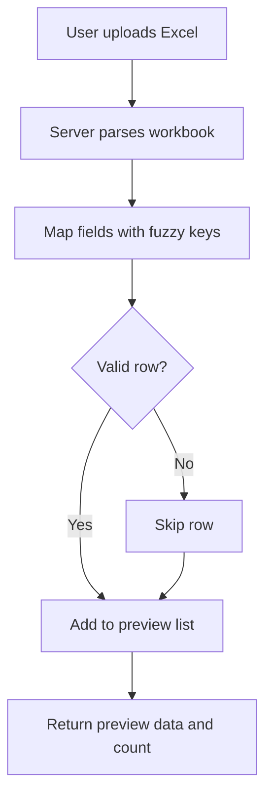
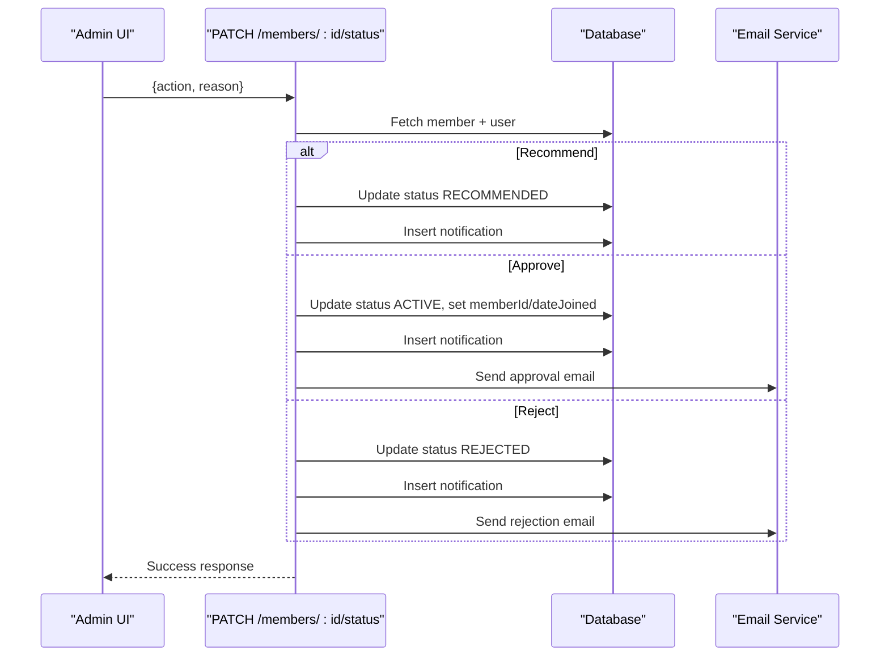
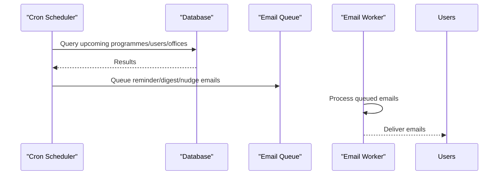
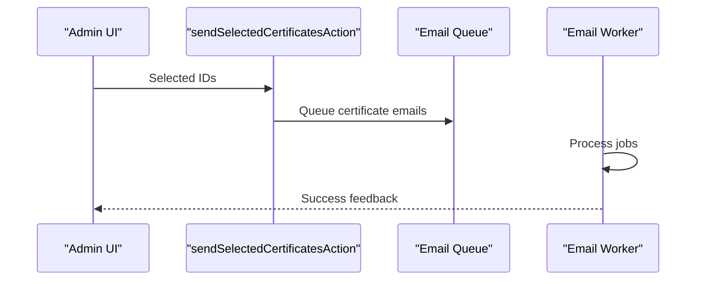
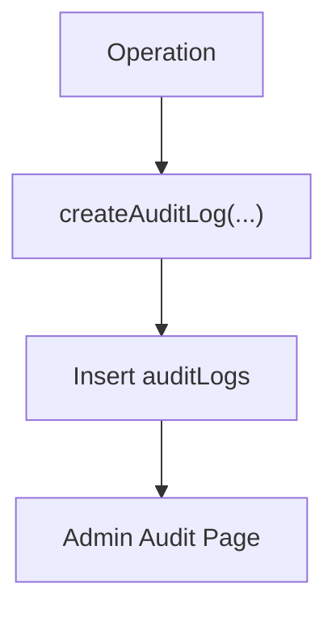
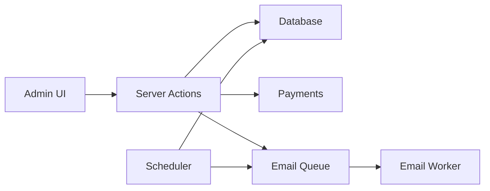

# Bulk Operations & Automation

<cite>
**Referenced Files in This Document**
- [workers/scheduler.ts](file://workers/scheduler.ts)
- [workers/email-worker.ts](file://workers/email-worker.ts)
- [lib/actions/programme-bulk.ts](file://lib/actions/programme-bulk.ts)
- [components/admin/planner/upload-dialog.tsx](file://components/admin/planner/upload-dialog.tsx)
- [lib/actions/planner.ts](file://lib/actions/planner.ts)
- [app/api/members/[id]/status/route.ts](file://app/api/members/[id]/status/route.ts)
- [lib/audit.ts](file://lib/audit.ts)
- [app/dashboard/admin/audit/page.tsx](file://app/dashboard/admin/audit/page.tsx)
- [scripts/resend-registration-emails.ts](file://scripts/resend-registration-emails.ts)
- [components/admin/programmes/registrations-client-table.tsx](file://components/admin/programmes/registrations-client-table.tsx)
- [lib/actions/programmes.ts](file://lib/actions/programmes.ts)
</cite>

## Table of Contents
1. Introduction
2. Project Structure
3. Core Components
4. Architecture Overview
5. Detailed Component Analysis
6. Dependency Analysis
7. Performance Considerations
8. Troubleshooting Guide
9. Conclusion
10. Appendices

## Introduction
This document explains bulk member operations and automation features in the TMC Portal with a focus on:
- Bulk registration for programmes (CSV/Excel import patterns, validation, duplicate handling, error handling)
- Bulk status updates and mass communications
- Batch certificate generation
- Automated workflows (renewal-like transitions, expiration notifications, scheduled maintenance)
- Background job processing, progress tracking, and audit logging for large-scale operations
- Integration points with external systems and webhook handlers

## Project Structure
The bulk and automation capabilities span server actions, API routes, workers, and admin UI components:
- Bulk registration and payment flows are implemented as server actions
- Member status transitions are exposed via Next.js API routes
- Scheduled tasks run via cron-based scheduler and email worker
- Admin UI provides bulk actions like sending certificates and importing data

**Diagram sources**
- [components/admin/planner/upload-dialog.tsx:102-188](file://components/admin/planner/upload-dialog.tsx#L102-L188)
- [lib/actions/planner.ts:48-240](file://lib/actions/planner.ts#L48-L240)
- [lib/actions/programme-bulk.ts:37-208](file://lib/actions/programme-bulk.ts#L37-L208)
- [components/admin/programmes/registrations-client-table.tsx:81-160](file://components/admin/programmes/registrations-client-table.tsx#L81-L160)
- [lib/actions/programmes.ts:1898-1936](file://lib/actions/programmes.ts#L1898-L1936)
- [workers/scheduler.ts:1-51](file://workers/scheduler.ts#L1-L51)
- [workers/email-worker.ts:1-32](file://workers/email-worker.ts#L1-L32)

**Section sources**
- [components/admin/planner/upload-dialog.tsx:102-188](file://components/admin/planner/upload-dialog.tsx#L102-L188)
- [lib/actions/planner.ts:48-240](file://lib/actions/planner.ts#L48-L240)
- [lib/actions/programme-bulk.ts:37-208](file://lib/actions/programme-bulk.ts#L37-L208)
- [components/admin/programmes/registrations-client-table.tsx:81-160](file://components/admin/programmes/registrations-client-table.tsx#L81-L160)
- [lib/actions/programmes.ts:1898-1936](file://lib/actions/programmes.ts#L1898-L1936)
- [workers/scheduler.ts:1-51](file://workers/scheduler.ts#L1-L51)
- [workers/email-worker.ts:1-32](file://workers/email-worker.ts#L1-L32)

## Core Components
- Bulk registration creation and group payment: createBulkRegistration initializes a group and per-attendee registrations; verifyBulkPayment confirms payment and marks all attendees paid.
- Bulk certificate sending: UI triggers sendSelectedCertificatesAction which queues or sends certificates to selected participants.
- Member status transitions: PATCH route supports recommend/approve/reject with notifications and emails.
- Scheduler and email worker: Cron jobs queue weekly digests, daily reminders, and monthly report nudges; email worker processes queued emails.
- Import preview and mapping: Excel upload dialog previews rows and maps fields using fuzzy matching before import.

**Section sources**
- [lib/actions/programme-bulk.ts:37-208](file://lib/actions/programme-bulk.ts#L37-L208)
- [components/admin/programmes/registrations-client-table.tsx:81-160](file://components/admin/programmes/registrations-client-table.tsx#L81-L160)
- [lib/actions/programmes.ts:1898-1936](file://lib/actions/programmes.ts#L1898-L1936)
- [app/api/members/[id]/status/route.ts:11-183](file://app/api/members/[id]/status/route.ts#L11-L183)
- [workers/scheduler.ts:12-51](file://workers/scheduler.ts#L12-L51)
- [workers/email-worker.ts:10-32](file://workers/email-worker.ts#L10-L32)
- [components/admin/planner/upload-dialog.tsx:102-188](file://components/admin/planner/upload-dialog.tsx#L102-L188)
- [lib/actions/planner.ts:48-240](file://lib/actions/planner.ts#L48-L240)

## Architecture Overview
End-to-end flow for bulk operations and automation:

**Diagram sources**
- [lib/actions/programme-bulk.ts:37-208](file://lib/actions/programme-bulk.ts#L37-L208)
- [workers/scheduler.ts:53-197](file://workers/scheduler.ts#L53-L197)
- [workers/email-worker.ts:10-32](file://workers/email-worker.ts#L10-L32)

## Detailed Component Analysis

### Bulk Registration Flow
- Creates a bulk group and per-attendee registrations with claim tokens.
- Enforces programme approval and payment rules; computes effective amount per attendee.
- Initializes group-level payment; upon verification, marks group and all registrations paid and records finance inflow.

**Diagram sources**
- [lib/actions/programme-bulk.ts:37-208](file://lib/actions/programme-bulk.ts#L37-L208)

**Section sources**
- [lib/actions/programme-bulk.ts:37-208](file://lib/actions/programme-bulk.ts#L37-L208)

### CSV/Excel Import Preview and Mapping
- Upload dialog accepts .xlsx/.xls files and previews parsed rows.
- Server-side preview uses XLSX to parse sheets and map columns with fuzzy key matching.
- Skips invalid rows and returns a count of valid items for confirmation.

**Diagram sources**
- [components/admin/planner/upload-dialog.tsx:102-188](file://components/admin/planner/upload-dialog.tsx#L102-L188)
- [lib/actions/planner.ts:48-240](file://lib/actions/planner.ts#L48-L240)

**Section sources**
- [components/admin/planner/upload-dialog.tsx:102-188](file://components/admin/planner/upload-dialog.tsx#L102-L188)
- [lib/actions/planner.ts:48-240](file://lib/actions/planner.ts#L48-L240)

### Bulk Status Updates and Mass Communications
- Member status transitions (recommend, approve, reject) via API route with permission checks, notifications, and emails.
- Bulk certificate sending from admin table triggers action that queues or sends certificates to selected participants.

**Diagram sources**
- [app/api/members/[id]/status/route.ts:11-183](file://app/api/members/[id]/status/route.ts#L11-L183)

**Section sources**
- [app/api/members/[id]/status/route.ts:11-183](file://app/api/members/[id]/status/route.ts#L11-L183)
- [components/admin/programmes/registrations-client-table.tsx:81-160](file://components/admin/programmes/registrations-client-table.tsx#L81-L160)
- [lib/actions/programmes.ts:1898-1936](file://lib/actions/programmes.ts#L1898-L1936)

### Automation Workflows (Scheduler)
- Weekly programme digest and officer reminders
- Daily continuous reminders for upcoming events (1–3 days out)
- Monthly office report reminders and nudges
- Automated system backup trigger

**Diagram sources**
- [workers/scheduler.ts:12-51](file://workers/scheduler.ts#L12-L51)
- [workers/scheduler.ts:53-197](file://workers/scheduler.ts#L53-L197)
- [workers/scheduler.ts:199-337](file://workers/scheduler.ts#L199-L337)
- [workers/email-worker.ts:10-32](file://workers/email-worker.ts#L10-L32)

**Section sources**
- [workers/scheduler.ts:12-51](file://workers/scheduler.ts#L12-L51)
- [workers/scheduler.ts:53-197](file://workers/scheduler.ts#L53-L197)
- [workers/scheduler.ts:199-337](file://workers/scheduler.ts#L199-L337)
- [workers/email-worker.ts:10-32](file://workers/email-worker.ts#L10-L32)

### Batch Certificate Generation
- Admin selects multiple registrations and triggers bulk send.
- Action builds email content and queues or sends certificates to each participant.

**Diagram sources**
- [components/admin/programmes/registrations-client-table.tsx:81-160](file://components/admin/programmes/registrations-client-table.tsx#L81-L160)
- [lib/actions/programmes.ts:1898-1936](file://lib/actions/programmes.ts#L1898-L1936)

**Section sources**
- [components/admin/programmes/registrations-client-table.tsx:81-160](file://components/admin/programmes/registrations-client-table.tsx#L81-L160)
- [lib/actions/programmes.ts:1898-1936](file://lib/actions/programmes.ts#L1898-L1936)

### Data Validation, Duplicate Detection, Error Handling
- Bulk registration enforces minimum attendees, maximum limit, programme approval, and payment requirements.
- Import preview skips invalid rows and reports counts; errors return structured failures.
- Member status route validates inputs and permissions, handles missing members, and returns appropriate HTTP codes.

**Section sources**
- [lib/actions/programme-bulk.ts:37-120](file://lib/actions/programme-bulk.ts#L37-L120)
- [lib/actions/planner.ts:48-240](file://lib/actions/planner.ts#L48-L240)
- [app/api/members/[id]/status/route.ts:11-183](file://app/api/members/[id]/status/route.ts#L11-L183)

### Audit Logging for Large-Scale Operations
- Centralized audit logging utility writes logs without breaking application flow on errors.
- Admin audit page displays recent logs with user context and filtering.

**Diagram sources**
- [lib/audit.ts:17-34](file://lib/audit.ts#L17-L34)
- [app/dashboard/admin/audit/page.tsx:13-35](file://app/dashboard/admin/audit/page.tsx#L13-L35)

**Section sources**
- [lib/audit.ts:17-34](file://lib/audit.ts#L17-L34)
- [app/dashboard/admin/audit/page.tsx:13-35](file://app/dashboard/admin/audit/page.tsx#L13-L35)

### Integration Points and Webhooks
- Paystack integration for bulk group payments: initialization and verification flows.
- Email worker consumes BullMQ jobs to deliver emails reliably.
- Scheduler integrates with email templates and queues to automate reminders and digests.

**Section sources**
- [lib/actions/programme-bulk.ts:122-208](file://lib/actions/programme-bulk.ts#L122-L208)
- [workers/email-worker.ts:10-32](file://workers/email-worker.ts#L10-L32)
- [workers/scheduler.ts:53-197](file://workers/scheduler.ts#L53-L197)

## Dependency Analysis
Key dependencies between modules:
- UI components depend on server actions for bulk operations and certificate sending.
- Server actions depend on database schema and payment utilities.
- Scheduler depends on database queries and email queue.
- Email worker depends on Redis connection and email service.

**Diagram sources**
- [lib/actions/programme-bulk.ts:37-208](file://lib/actions/programme-bulk.ts#L37-L208)
- [workers/scheduler.ts:12-51](file://workers/scheduler.ts#L12-L51)
- [workers/email-worker.ts:10-32](file://workers/email-worker.ts#L10-L32)

**Section sources**
- [lib/actions/programme-bulk.ts:37-208](file://lib/actions/programme-bulk.ts#L37-L208)
- [workers/scheduler.ts:12-51](file://workers/scheduler.ts#L12-L51)
- [workers/email-worker.ts:10-32](file://workers/email-worker.ts#L10-L32)

## Performance Considerations
- Bulk registration limits: enforce max attendees per batch to avoid oversized transactions.
- Use server actions for efficient batching and revalidation only where needed.
- Offload email delivery to background workers to keep request latency low.
- Scheduler batches queries and queues emails rather than sending synchronously.
- For very large datasets, consider pagination in scheduler loops and chunked updates.

[No sources needed since this section provides general guidance]

## Troubleshooting Guide
- Bulk registration errors: check programme approval, payment configuration, and attendee validation.
- Payment verification failures: ensure Paystack callback URL is correct and reference matches.
- Email delivery issues: inspect email worker logs and queue status; retry logic is configured in scheduler jobs.
- Member status updates: confirm permissions and required recommendation settings; validate input reason for rejections.
- Import failures: review preview output for skipped rows and field mapping mismatches.

**Section sources**
- [lib/actions/programme-bulk.ts:37-208](file://lib/actions/programme-bulk.ts#L37-L208)
- [workers/scheduler.ts:53-197](file://workers/scheduler.ts#L53-L197)
- [app/api/members/[id]/status/route.ts:11-183](file://app/api/members/[id]/status/route.ts#L11-L183)
- [lib/actions/planner.ts:48-240](file://lib/actions/planner.ts#L48-L240)

## Conclusion
The TMC Portal provides robust bulk operations and automation:
- Bulk registration with secure group payments and per-attendee claim links
- Admin-driven bulk certificate distribution
- Automated reminders, digests, and monthly nudges via scheduler
- Reliable email delivery through a background worker
- Audit logging for traceability and compliance

These capabilities enable scalable management of large member datasets while maintaining performance and reliability.

[No sources needed since this section summarizes without analyzing specific files]

## Appendices

### Example Scripts and Utilities
- Resend registration emails script demonstrates querying paid registrations and sending emails in bulk.

**Section sources**
- [scripts/resend-registration-emails.ts:1-24](file://scripts/resend-registration-emails.ts#L1-L24)