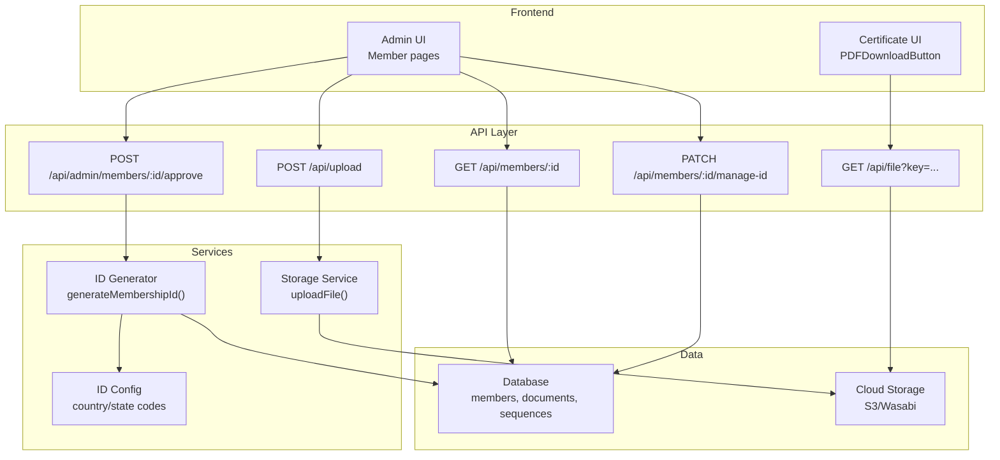
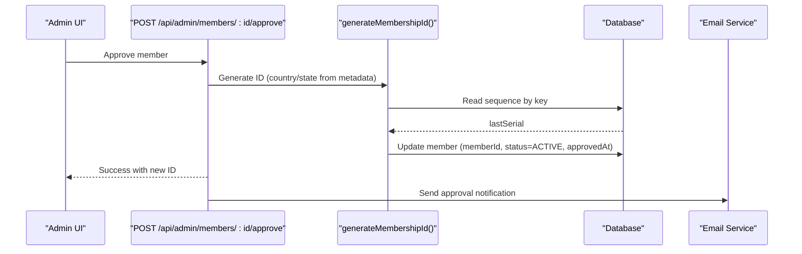
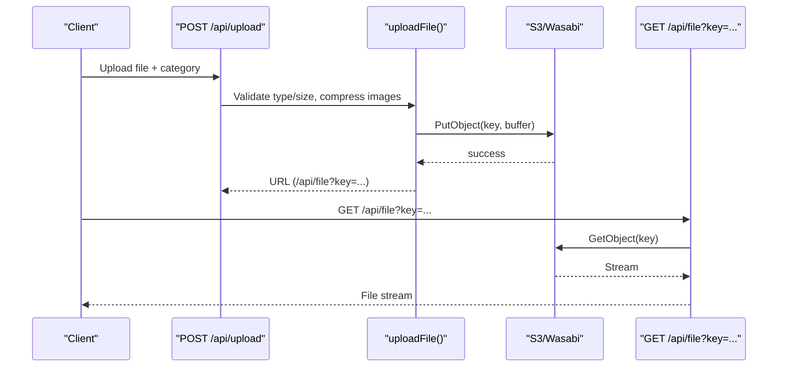
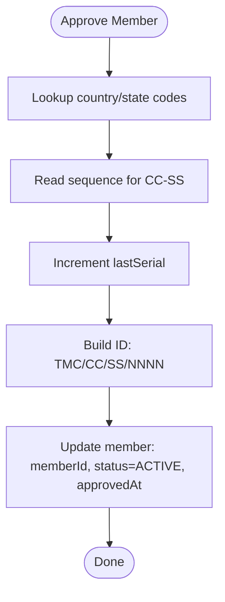
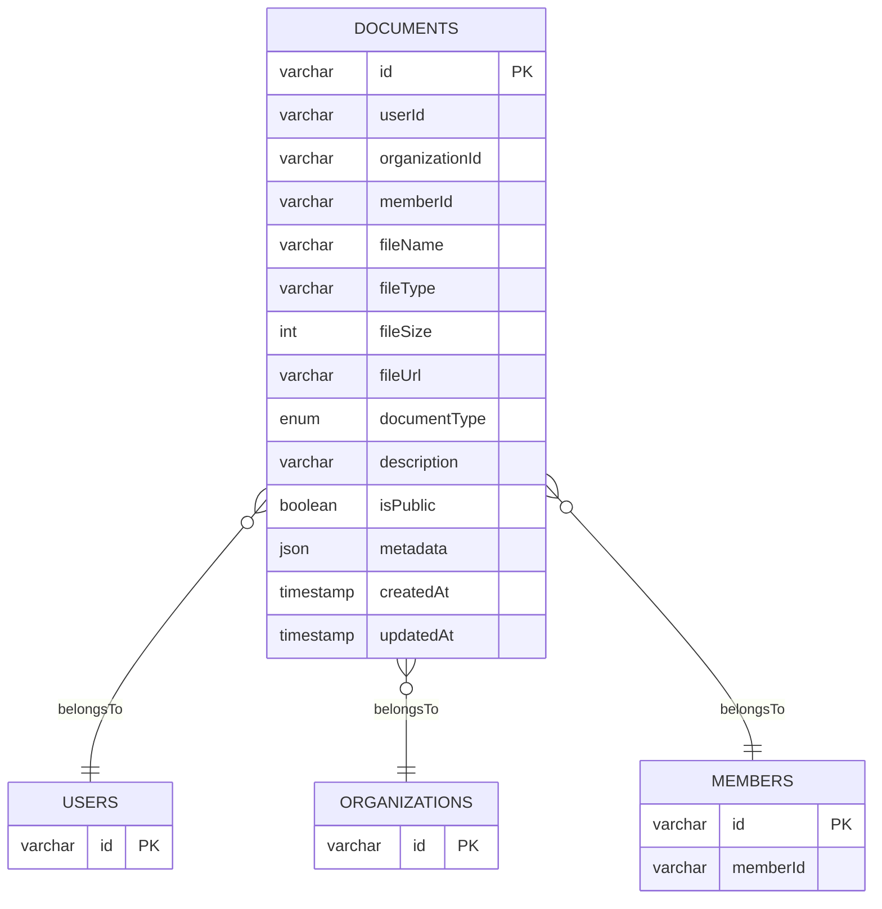
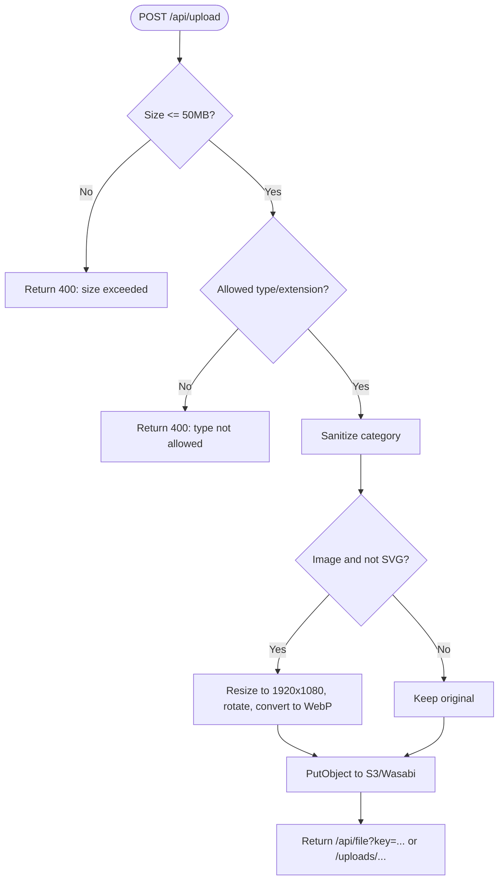
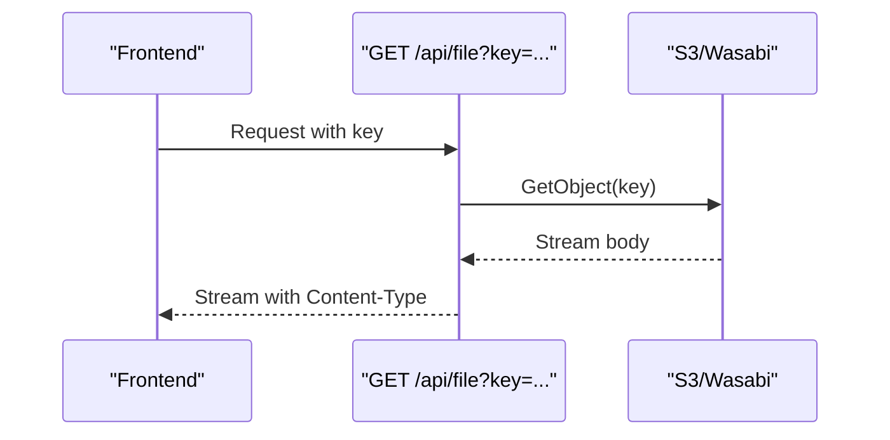
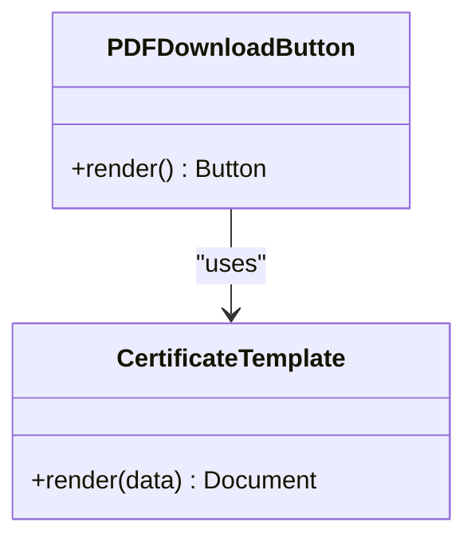
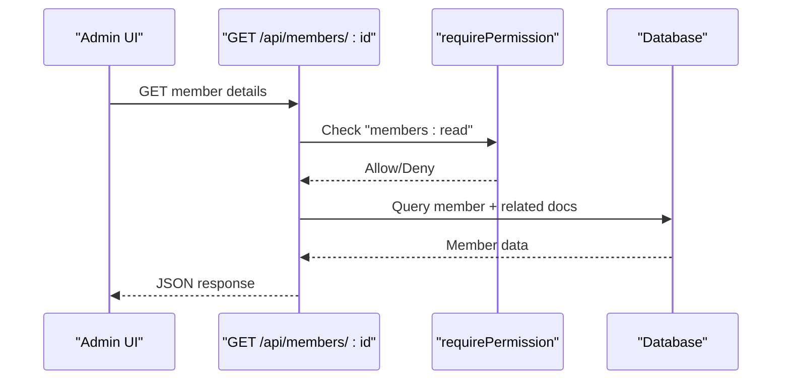
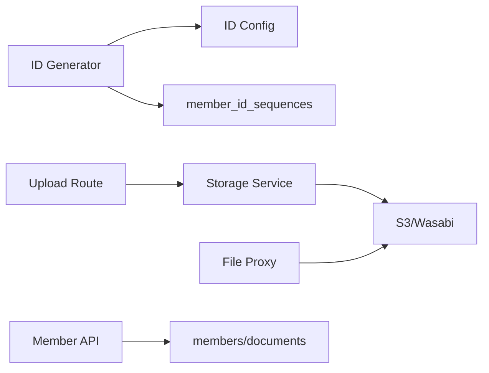

# Digital ID & Documentation

<cite>
**Referenced Files in This Document**
- [schema.ts](file://lib/db/schema.ts)
- [id-config.ts](file://lib/id-config.ts)
- [membership-id.ts](file://lib/actions/membership-id.ts)
- [id-generator.ts](file://lib/id-generator.ts)
- [storage.ts](file://lib/storage.ts)
- [upload route](file://app/api/upload/route.ts)
- [file proxy route](file://app/api/file/route.ts)
- [member GET route](file://app/api/members/[id]/route.ts)
- [approve member route](file://app/api/admin/members/[id]/approve/route.ts)
- [manage ID route](file://app/api/members/[id]/manage-id/route.ts)
- [certificate template](file://components/occasions/certificate-template.tsx)
- [pdf download button](file://components/occasions/pdf-download-button.tsx)
- [admin id manager component](file://components/admin/id-manager.tsx)
</cite>

## Table of Contents
1. Introduction
2. Project Structure
3. Core Components
4. Architecture Overview
5. Detailed Component Analysis
6. Dependency Analysis
7. Performance Considerations
8. Troubleshooting Guide
9. Conclusion

## Introduction
This document explains the digital ID card generation and member documentation system in the TMC Portal. It covers:
- How unique membership IDs are generated and assigned during approval
- How documents (ID_CARD, CERTIFICATE, PHOTO, CONTRACT, REPORT, MINUTES, OTHER) are uploaded, categorized, stored securely, and accessed with permissions
- The image processing pipeline, file validation, and cloud storage integration
- Template-based certificate generation and secure retrieval via a proxy endpoint
- Permission-based access controls and auditability for member records

## Project Structure
The system spans server routes, shared libraries, database schema definitions, and UI components:
- Server routes handle uploads, approvals, and secure file retrieval
- Shared libraries implement ID generation, storage, and configuration
- Database schema defines members, documents, sequences, and permissions
- UI components render templates and manage ID editing workflows

**Diagram sources**
- [upload route:1-66](file://app/api/upload/route.ts#L1-L66)
- [storage.ts:1-99](file://lib/storage.ts#L1-L99)
- [membership-id.ts:1-97](file://lib/actions/membership-id.ts#L1-L97)
- [id-config.ts:1-51](file://lib/id-config.ts#L1-L51)
- [member GET route:1-50](file://app/api/members/[id]/route.ts#L1-L50)
- [approve member route:63-84](file://app/api/admin/members/[id]/approve/route.ts#L63-L84)
- [file proxy route:1-61](file://app/api/file/route.ts#L1-L61)

**Section sources**
- [upload route:1-66](file://app/api/upload/route.ts#L1-L66)
- [storage.ts:1-99](file://lib/storage.ts#L1-L99)
- [membership-id.ts:1-97](file://lib/actions/membership-id.ts#L1-L97)
- [id-config.ts:1-51](file://lib/id-config.ts#L1-L51)
- [member GET route:1-50](file://app/api/members/[id]/route.ts#L1-L50)
- [approve member route:63-84](file://app/api/admin/members/[id]/approve/route.ts#L63-L84)
- [file proxy route:1-61](file://app/api/file/route.ts#L1-L61)

## Core Components
- Membership ID generation: deterministic format TMC/CC/SS/#### using jurisdiction codes and per-country-state sequences
- Document management: typed enum categories, metadata, public/private flags, and relationships to users, organizations, and members
- Secure storage: image compression, S3 upload, and private-file streaming via a proxy endpoint
- Certificate templates: client-side PDF generation for certificates and slips
- Access control: permission checks on member endpoints and admin-only ID management

Key implementation references:
- ID generation and assignment: [membership-id.ts:1-97](file://lib/actions/membership-id.ts#L1-L97), [id-config.ts:1-51](file://lib/id-config.ts#L1-L51)
- Document schema and enums: [schema.ts:393-409](file://lib/db/schema.ts#L393-L409)
- Upload pipeline and validation: [upload route:1-66](file://app/api/upload/route.ts#L1-L66), [storage.ts:1-99](file://lib/storage.ts#L1-L99)
- Secure file retrieval: [file proxy route:1-61](file://app/api/file/route.ts#L1-L61)
- Member data and documents retrieval: [member GET route:1-50](file://app/api/members/[id]/route.ts#L1-L50)
- Admin ID management: [manage ID route:1-41](file://app/api/members/[id]/manage-id/route.ts#L1-L41), [admin id manager component:1-37](file://components/admin/id-manager.tsx#L1-L37)
- Certificate templates: [certificate template:1-368](file://components/occasions/certificate-template.tsx#L1-L368), [pdf download button:1-31](file://components/occasions/pdf-download-button.tsx#L1-L31)

**Section sources**
- [membership-id.ts:1-97](file://lib/actions/membership-id.ts#L1-L97)
- [id-config.ts:1-51](file://lib/id-config.ts#L1-L51)
- [schema.ts:393-409](file://lib/db/schema.ts#L393-L409)
- [upload route:1-66](file://app/api/upload/route.ts#L1-L66)
- [storage.ts:1-99](file://lib/storage.ts#L1-L99)
- [file proxy route:1-61](file://app/api/file/route.ts#L1-L61)
- [member GET route:1-50](file://app/api/members/[id]/route.ts#L1-L50)
- [manage ID route:1-41](file://app/api/members/[id]/manage-id/route.ts#L1-L41)
- [admin id manager component:1-37](file://components/admin/id-manager.tsx#L1-L37)
- [certificate template:1-368](file://components/occasions/certificate-template.tsx#L1-L368)
- [pdf download button:1-31](file://components/occasions/pdf-download-button.tsx#L1-L31)

## Architecture Overview
End-to-end flows for ID generation and document handling:

**Diagram sources**
- [approve member route:63-84](file://app/api/admin/members/[id]/approve/route.ts#L63-L84)
- [membership-id.ts:1-97](file://lib/actions/membership-id.ts#L1-L97)
- [id-config.ts:1-51](file://lib/id-config.ts#L1-L51)

**Diagram sources**
- [upload route:1-66](file://app/api/upload/route.ts#L1-L66)
- [storage.ts:1-99](file://lib/storage.ts#L1-L99)
- [file proxy route:1-61](file://app/api/file/route.ts#L1-L61)

## Detailed Component Analysis

### Membership ID Generation and Assignment
- Format: TMC/{CountryCode}/{StateCode}/{Serial}
- Country/state code mapping is centralized; unknown values default to safe fallbacks
- Sequence tracking ensures uniqueness per country-state pair
- On approval, the member record is updated with the generated ID and set to ACTIVE

**Diagram sources**
- [membership-id.ts:1-97](file://lib/actions/membership-id.ts#L1-L97)
- [id-config.ts:1-51](file://lib/id-config.ts#L1-L51)

**Section sources**
- [membership-id.ts:1-97](file://lib/actions/membership-id.ts#L1-L97)
- [id-config.ts:1-51](file://lib/id-config.ts#L1-L51)
- [id-generator.ts:1-39](file://lib/id-generator.ts#L1-L39)

### Document Management System
- Supported types: ID_CARD, CERTIFICATE, PHOTO, CONTRACT, REPORT, MINUTES, OTHER
- Each document stores file metadata, URL, type, description, visibility flag, and optional JSON metadata
- Documents are linked to users, organizations, and members for scoped access

**Diagram sources**
- [schema.ts:393-409](file://lib/db/schema.ts#L393-L409)

**Section sources**
- [schema.ts:393-409](file://lib/db/schema.ts#L393-L409)

### Image Processing Pipeline and File Validation
- Allowed types include images, audio, video, PDFs, Office docs, text, CSV, archives
- Size limit enforced at the upload endpoint
- Images are compressed and converted to WebP when possible; EXIF rotation applied
- Category sanitization prevents directory traversal
- Cloud-first storage with local fallback

**Diagram sources**
- [upload route:1-66](file://app/api/upload/route.ts#L1-L66)
- [storage.ts:1-99](file://lib/storage.ts#L1-L99)

**Section sources**
- [upload route:1-66](file://app/api/upload/route.ts#L1-L66)
- [storage.ts:1-99](file://lib/storage.ts#L1-L99)

### Secure Document Storage and Retrieval
- Uploaded files are stored in a configured S3-compatible bucket
- Public URLs are proxied through a server endpoint that streams content directly from storage
- Streaming response includes appropriate content-type and caching headers

**Diagram sources**
- [file proxy route:1-61](file://app/api/file/route.ts#L1-L61)

**Section sources**
- [file proxy route:1-61](file://app/api/file/route.ts#L1-L61)
- [storage.ts:1-99](file://lib/storage.ts#L1-L99)

### Template Customization and Certificate Generation
- Certificate templates are defined as React components using a PDF renderer
- Templates support multiple types (e.g., marriage, naming ceremony) with conditional fields
- Clients can generate downloadable PDFs directly from the browser

**Diagram sources**
- [certificate template:1-368](file://components/occasions/certificate-template.tsx#L1-L368)
- [pdf download button:1-31](file://components/occasions/pdf-download-button.tsx#L1-L31)

**Section sources**
- [certificate template:1-368](file://components/occasions/certificate-template.tsx#L1-L368)
- [pdf download button:1-31](file://components/occasions/pdf-download-button.tsx#L1-L31)

### Permission-Based Access Controls
- Member read operations enforce required permissions
- Admin-only endpoints protect ID updates and approvals
- Audit logging is available for sensitive actions

**Diagram sources**
- [member GET route:1-50](file://app/api/members/[id]/route.ts#L1-L50)

**Section sources**
- [member GET route:1-50](file://app/api/members/[id]/route.ts#L1-L50)
- [manage ID route:1-41](file://app/api/members/[id]/manage-id/route.ts#L1-L41)

### Bulk Operations and Workflows
- While bulk endpoints are not shown here, the same upload and document model supports batched operations by repeating the upload flow and associating each document with the relevant entity (user, organization, member)
- For program-related materials, similar patterns apply using the shared upload and storage services

[No sources needed since this section provides general guidance]

## Dependency Analysis
- ID generation depends on jurisdiction codes and sequence tables
- Document storage depends on environment configuration for S3/Wasabi
- File retrieval depends on the proxy endpoint to enforce controlled access
- UI components depend on server routes for data and file streaming

**Diagram sources**
- [id-generator.ts:1-39](file://lib/id-generator.ts#L1-L39)
- [id-config.ts:1-51](file://lib/id-config.ts#L1-L51)
- [upload route:1-66](file://app/api/upload/route.ts#L1-L66)
- [storage.ts:1-99](file://lib/storage.ts#L1-L99)
- [file proxy route:1-61](file://app/api/file/route.ts#L1-L61)
- [member GET route:1-50](file://app/api/members/[id]/route.ts#L1-L50)

**Section sources**
- [id-generator.ts:1-39](file://lib/id-generator.ts#L1-L39)
- [id-config.ts:1-51](file://lib/id-config.ts#L1-L51)
- [upload route:1-66](file://app/api/upload/route.ts#L1-L66)
- [storage.ts:1-99](file://lib/storage.ts#L1-L99)
- [file proxy route:1-61](file://app/api/file/route.ts#L1-L61)
- [member GET route:1-50](file://app/api/members/[id]/route.ts#L1-L50)

## Performance Considerations
- Image compression reduces bandwidth and storage costs; consider toggling via environment variable if needed
- Use WebP conversion for better compression without quality loss
- Stream large files via the proxy endpoint to avoid buffering in memory
- Cache immutable assets with long-lived cache headers where appropriate
- Index frequently queried fields such as documentType and memberId for faster lookups

[No sources needed since this section provides general guidance]

## Troubleshooting Guide
- Upload failures: check allowed types/extensions and size limits; verify environment variables for storage
- Missing files: ensure the key parameter is present and matches the stored object key; confirm S3 credentials and bucket configuration
- Permission errors: validate user session and required permissions before accessing member data or updating IDs
- ID conflicts: when manually updating IDs, ensure uniqueness across members

**Section sources**
- [upload route:1-66](file://app/api/upload/route.ts#L1-L66)
- [file proxy route:1-61](file://app/api/file/route.ts#L1-L61)
- [member GET route:1-50](file://app/api/members/[id]/route.ts#L1-L50)
- [manage ID route:1-41](file://app/api/members/[id]/manage-id/route.ts#L1-L41)

## Conclusion
The TMC Portal implements a robust system for generating unique membership IDs and managing diverse document types with secure storage and controlled access. The combination of server-side validation, image processing, cloud storage, and permission checks ensures reliable, scalable, and compliant handling of member records and official documents.

[No sources needed since this section summarizes without analyzing specific files]