# Member Analytics & Reporting

<cite>
**Referenced Files in This Document**
- [analytics/page.tsx](file://app/dashboard/admin/analytics/page.tsx)
- [visit/route.ts](file://app/api/analytics/visit/route.ts)
- [members.ts](file://lib/actions/members.ts)
- [member-stats-dialog.tsx](file://components/admin/members/member-stats-dialog.tsx)
- [members/page.tsx](file://app/dashboard/admin/members/page.tsx)
- [reports.ts](file://lib/actions/reports.ts)
- [office-rollup-generator.tsx](file://components/admin/reports/office-rollup-generator.tsx)
- [report-export.tsx](file://components/admin/programmes/reports/report-export.tsx)
- [audit.ts](file://lib/audit.ts)
- [scheduler.ts](file://workers/scheduler.ts)
- [email-worker.ts](file://workers/email-worker.ts)
- [programme analytics page.tsx](file://app/dashboard/admin/programmes/[id]/analytics/page.tsx)
- [finance reports page.tsx](file://app/dashboard/admin/finance/reports/page.tsx)
- [finance-charts.tsx](file://components/admin/finance/finance-charts.tsx)
</cite>

## Table of Contents
1. Introduction
2. Project Structure
3. Core Components
4. Architecture Overview
5. Detailed Component Analysis
6. Dependency Analysis
7. Performance Considerations
8. Troubleshooting Guide
9. Conclusion

## Introduction
This document explains the member analytics and reporting capabilities in the TMC Portal. It covers the member statistics dashboard, advanced filtering and search for members, report generation (CSV/PDF), data visualization, real-time analytics updates, automated scheduling, compliance reporting, and audit trails. The goal is to help administrators understand how to query, visualize, export, and schedule reports while maintaining compliance and performance.

## Project Structure
The analytics and reporting features span server-side pages, API routes, reusable components, and background workers:
- Admin analytics dashboards and member management UIs
- Server actions that aggregate membership and reporting data
- Export utilities for CSV and PDF
- Audit logging helpers
- Scheduled tasks for reminders and automated backups

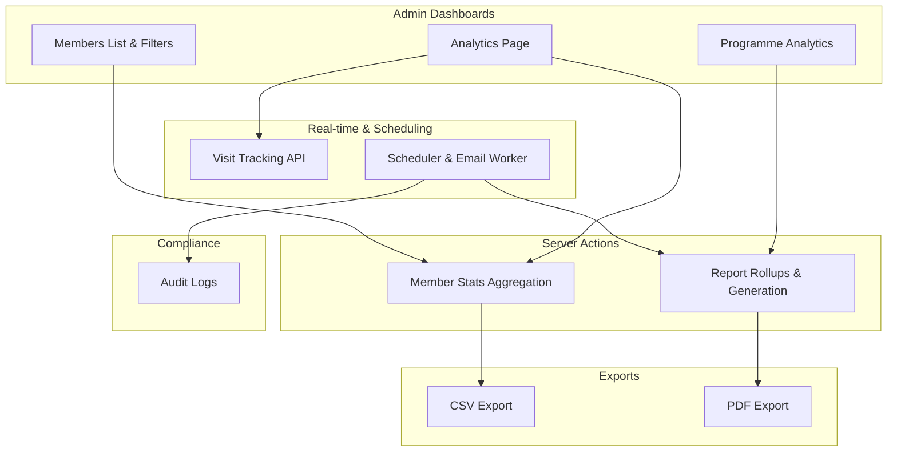

**Diagram sources**
- [analytics/page.tsx:12-160](file://app/dashboard/admin/analytics/page.tsx#L12-L160)
- [members/page.tsx:24-329](file://app/dashboard/admin/members/page.tsx#L24-L329)
- [members.ts:37-94](file://lib/actions/members.ts#L37-L94)
- [reports.ts:216-397](file://lib/actions/reports.ts#L216-L397)
- [report-export.tsx:6-53](file://components/admin/programmes/reports/report-export.tsx#L6-L53)
- [visit/route.ts:6-32](file://app/api/analytics/visit/route.ts#L6-L32)
- [scheduler.ts:12-51](file://workers/scheduler.ts#L12-L51)
- [audit.ts:17-71](file://lib/audit.ts#L17-L71)

**Section sources**
- [analytics/page.tsx:12-160](file://app/dashboard/admin/analytics/page.tsx#L12-L160)
- [members/page.tsx:24-329](file://app/dashboard/admin/members/page.tsx#L24-L329)
- [members.ts:37-94](file://lib/actions/members.ts#L37-L94)
- [reports.ts:216-397](file://lib/actions/reports.ts#L216-L397)
- [report-export.tsx:6-53](file://components/admin/programmes/reports/report-export.tsx#L6-L53)
- [visit/route.ts:6-32](file://app/api/analytics/visit/route.ts#L6-L32)
- [scheduler.ts:12-51](file://workers/scheduler.ts#L12-L51)
- [audit.ts:17-71](file://lib/audit.ts#L17-L71)

## Core Components
- Member Statistics Dashboard: Displays total members and state-level breakdown via a dialog that calls a server action to aggregate counts from the members table and JSON metadata.
- Advanced Filtering and Search: Members list supports filtering by state, LGA, branch keyword, and name/email search with pagination and CSV export.
- Report Generation: Office rollup generator previews and creates quarterly/annual reports; programme reports support CSV and PDF exports.
- Real-time Analytics Updates: Visit tracking API records page views and sessions for site analytics.
- Automated Scheduling: Cron-based scheduler sends monthly office report reminders and runs daily backups; email worker processes queued emails.
- Compliance and Auditing: Audit log helper records entity changes and provides filtered retrieval for compliance reviews.

**Section sources**
- [member-stats-dialog.tsx:17-99](file://components/admin/members/member-stats-dialog.tsx#L17-L99)
- [members.ts:37-94](file://lib/actions/members.ts#L37-L94)
- [members/page.tsx:24-329](file://app/dashboard/admin/members/page.tsx#L24-L329)
- [office-rollup-generator.tsx:13-135](file://components/admin/reports/office-rollup-generator.tsx#L13-L135)
- [report-export.tsx:6-53](file://components/admin/programmes/reports/report-export.tsx#L6-L53)
- [visit/route.ts:6-32](file://app/api/analytics/visit/route.ts#L6-L32)
- [scheduler.ts:26-50](file://workers/scheduler.ts#L26-L50)
- [audit.ts:17-71](file://lib/audit.ts#L17-L71)

## Architecture Overview
The system combines Next.js server components and API routes with server actions for data aggregation, client components for interactive UI, and background workers for scheduled tasks.

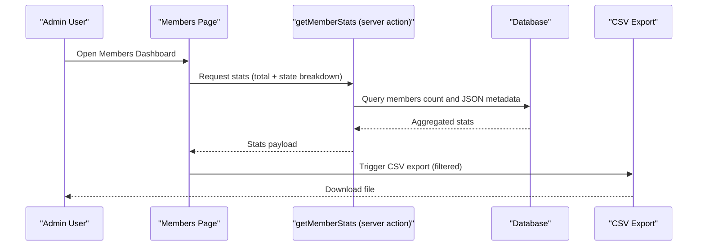

**Diagram sources**
- [members/page.tsx:24-329](file://app/dashboard/admin/members/page.tsx#L24-L329)
- [members.ts:37-94](file://lib/actions/members.ts#L37-L94)

**Section sources**
- [members/page.tsx:24-329](file://app/dashboard/admin/members/page.tsx#L24-L329)
- [members.ts:37-94](file://lib/actions/members.ts#L37-L94)

## Detailed Component Analysis

### Member Statistics Dashboard
- Purpose: Provide a quick overview of total members and distribution by state.
- Implementation: A dialog component triggers a server action that computes totals and groups by state using JSON extraction or fallback grouping.
- Visualization: Shows total count and a scrollable state breakdown with percentage bars.

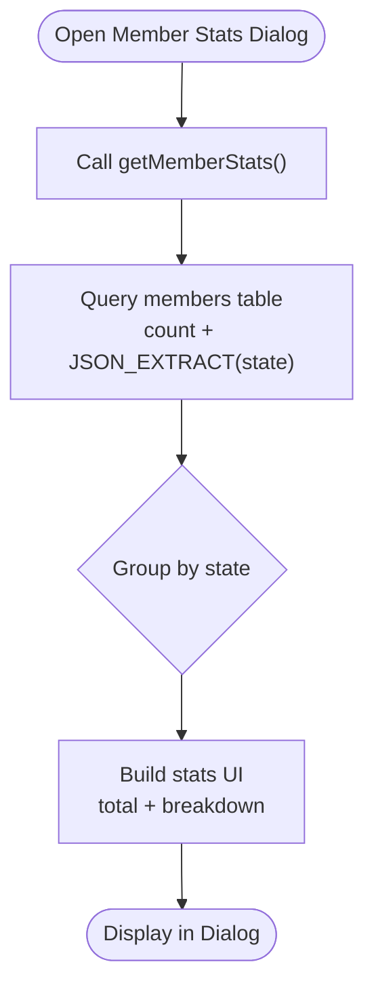

**Diagram sources**
- [member-stats-dialog.tsx:17-99](file://components/admin/members/member-stats-dialog.tsx#L17-L99)
- [members.ts:37-94](file://lib/actions/members.ts#L37-L94)

**Section sources**
- [member-stats-dialog.tsx:17-99](file://components/admin/members/member-stats-dialog.tsx#L17-L99)
- [members.ts:37-94](file://lib/actions/members.ts#L37-L94)

### Advanced Filtering and Search for Members
- Capabilities: Filter by state, LGA, branch keyword; search by name or email; paginate results; export filtered set to CSV.
- Data Access: Builds SQL conditions using JSON extraction for hierarchical fields and joins with users for identity info.
- Export: Generates CSV with key member attributes and metadata.

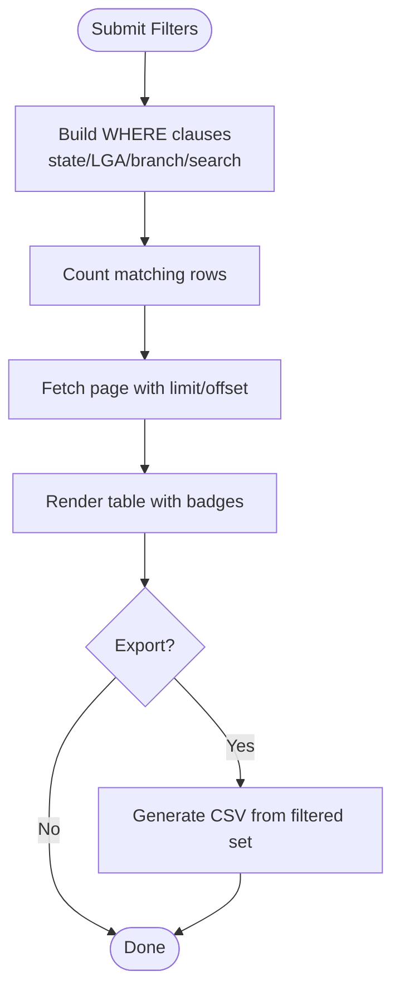

**Diagram sources**
- [members/page.tsx:24-329](file://app/dashboard/admin/members/page.tsx#L24-L329)

**Section sources**
- [members/page.tsx:24-329](file://app/dashboard/admin/members/page.tsx#L24-L329)

### Report Generation: Quarterly and Annual Rollups
- Preview: Select year, office scope, and quarter to preview coverage and approvals.
- Generation: Create quarterly or annual reports by aggregating monthly reports across hierarchy if needed.
- Output: Stored as approved reports; can be viewed and exported.

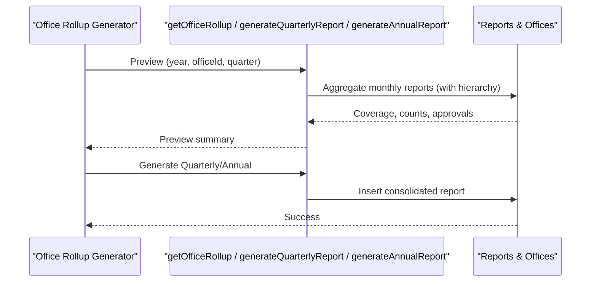

**Diagram sources**
- [office-rollup-generator.tsx:13-135](file://components/admin/reports/office-rollup-generator.tsx#L13-L135)
- [reports.ts:216-397](file://lib/actions/reports.ts#L216-L397)

**Section sources**
- [office-rollup-generator.tsx:13-135](file://components/admin/reports/office-rollup-generator.tsx#L13-L135)
- [reports.ts:216-397](file://lib/actions/reports.ts#L216-L397)

### Programme Analytics and Demographics
- Metrics: Attendance lateness, early arrivals, jurisdiction representation (state/LGA).
- Use Case: Understand participation patterns and geographic reach per programme.

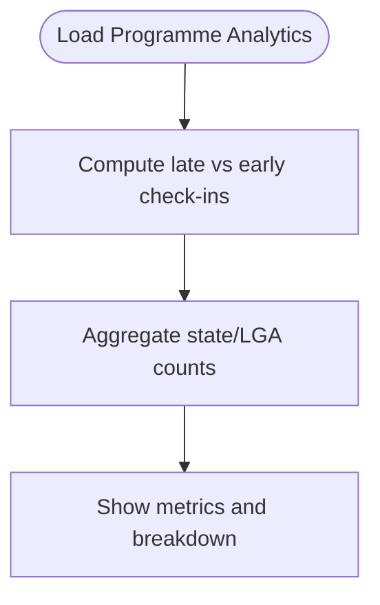

**Diagram sources**
- [programme analytics page.tsx:27-65](file://app/dashboard/admin/programmes/[id]/analytics/page.tsx#L27-L65)

**Section sources**
- [programme analytics page.tsx:27-65](file://app/dashboard/admin/programmes/[id]/analytics/page.tsx#L27-L65)

### CSV and PDF Exports
- CSV: Client-side generation from current view data with headers and formatted values.
- PDF: Uses jsPDF and autoTable to produce printable reports with summaries and tables.

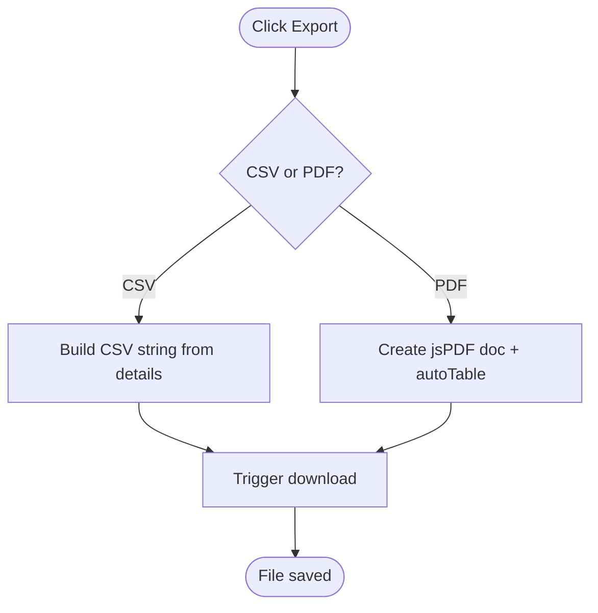

**Diagram sources**
- [report-export.tsx:6-53](file://components/admin/programmes/reports/report-export.tsx#L6-L53)

**Section sources**
- [report-export.tsx:6-53](file://components/admin/programmes/reports/report-export.tsx#L6-L53)

### Real-time Analytics Updates
- Mechanism: POST endpoint records visitorId, sessionId, path, user agent, and IP; optional userId when authenticated.
- Dashboard: Aggregates total page views, unique visitors, sessions, and views per session; shows top pages and recent activity.

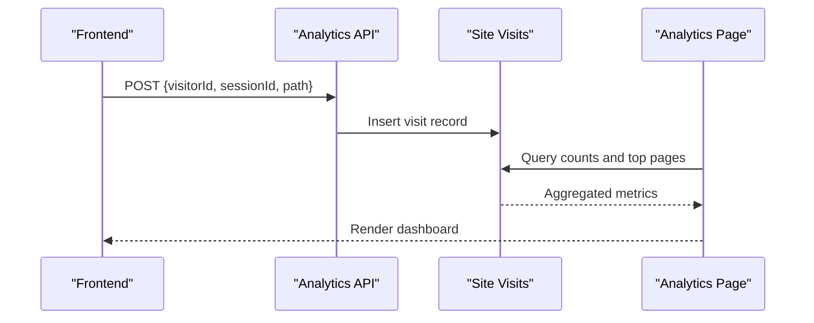

**Diagram sources**
- [visit/route.ts:6-32](file://app/api/analytics/visit/route.ts#L6-L32)
- [analytics/page.tsx:12-160](file://app/dashboard/admin/analytics/page.tsx#L12-L160)

**Section sources**
- [visit/route.ts:6-32](file://app/api/analytics/visit/route.ts#L6-L32)
- [analytics/page.tsx:12-160](file://app/dashboard/admin/analytics/page.tsx#L12-L160)

### Automated Report Scheduling and Reminders
- Scheduler: Runs weekly programme notifications, daily event reminders, monthly office report reminders, and daily backups.
- Email Worker: Processes queued emails asynchronously.

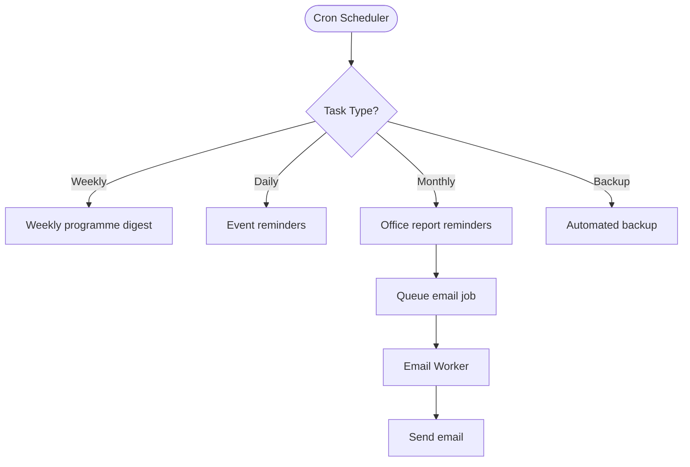

**Diagram sources**
- [scheduler.ts:12-51](file://workers/scheduler.ts#L12-L51)
- [scheduler.ts:26-50](file://workers/scheduler.ts#L26-L50)
- [email-worker.ts:10-31](file://workers/email-worker.ts#L10-L31)

**Section sources**
- [scheduler.ts:12-51](file://workers/scheduler.ts#L12-L51)
- [scheduler.ts:26-50](file://workers/scheduler.ts#L26-L50)
- [email-worker.ts:10-31](file://workers/email-worker.ts#L10-L31)

### Compliance Reporting and Audit Trails
- Audit Logging: Centralized helper to create and retrieve audit logs with filters for user, organization, entity type/id, and date ranges.
- Usage: Integrate into critical flows to maintain an immutable trail for regulatory requirements.

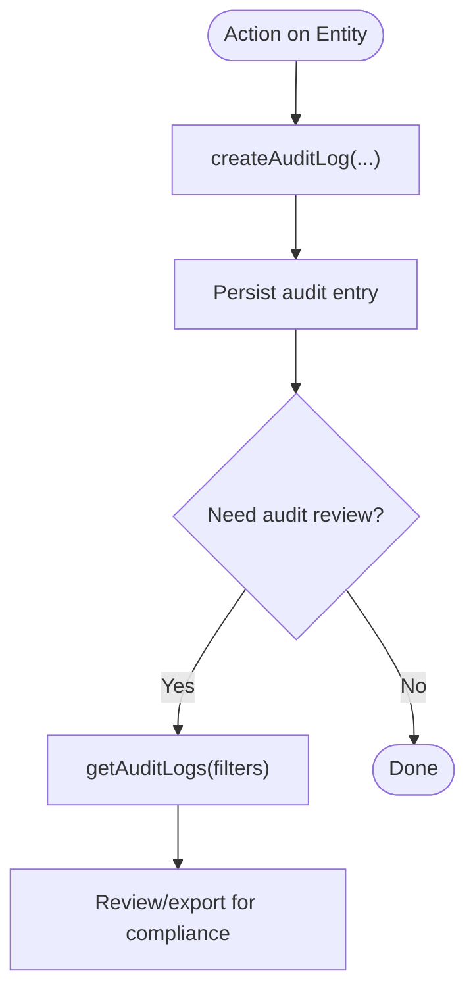

**Diagram sources**
- [audit.ts:17-71](file://lib/audit.ts#L17-L71)

**Section sources**
- [audit.ts:17-71](file://lib/audit.ts#L17-L71)

### Financial Reporting Integration
- Financial Reports Page: Provides financial summaries and export options.
- Charts: Visualizes revenue trends, compliance rates, and budget vs actual spending.

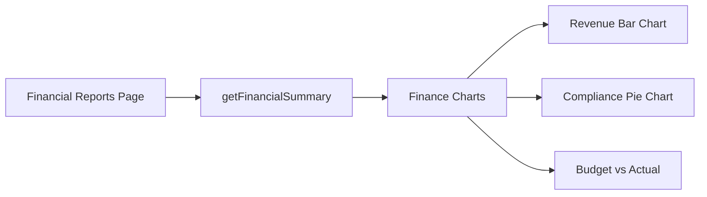

**Diagram sources**
- [finance reports page.tsx:10-32](file://app/dashboard/admin/finance/reports/page.tsx#L10-L32)
- [finance-charts.tsx:40-125](file://components/admin/finance/finance-charts.tsx#L40-L125)

**Section sources**
- [finance reports page.tsx:10-32](file://app/dashboard/admin/finance/reports/page.tsx#L10-L32)
- [finance-charts.tsx:40-125](file://components/admin/finance/finance-charts.tsx#L40-L125)

## Dependency Analysis
Key dependencies and relationships:
- UI components depend on server actions for data aggregation and report generation.
- Server actions depend on database schemas and Drizzle ORM queries.
- Scheduler depends on cron and queues to trigger periodic tasks and email delivery.
- Audit logging is independent but used across modules to ensure compliance.

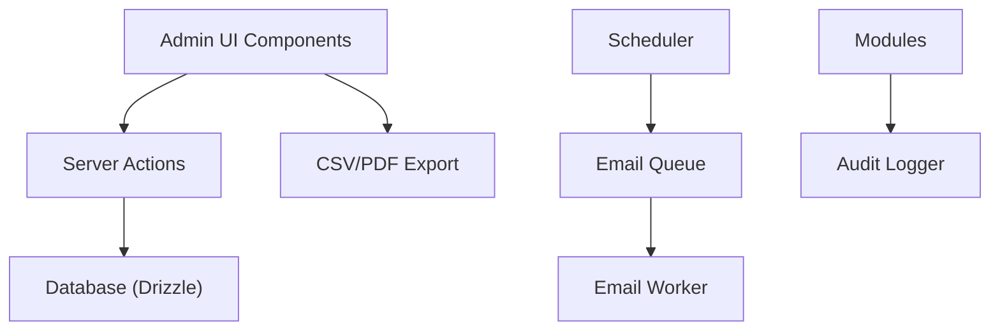

**Diagram sources**
- [members.ts:37-94](file://lib/actions/members.ts#L37-L94)
- [reports.ts:216-397](file://lib/actions/reports.ts#L216-L397)
- [scheduler.ts:12-51](file://workers/scheduler.ts#L12-L51)
- [email-worker.ts:10-31](file://workers/email-worker.ts#L10-L31)
- [audit.ts:17-71](file://lib/audit.ts#L17-L71)

**Section sources**
- [members.ts:37-94](file://lib/actions/members.ts#L37-L94)
- [reports.ts:216-397](file://lib/actions/reports.ts#L216-L397)
- [scheduler.ts:12-51](file://workers/scheduler.ts#L12-L51)
- [email-worker.ts:10-31](file://workers/email-worker.ts#L10-L31)
- [audit.ts:17-71](file://lib/audit.ts#L17-L71)

## Performance Considerations
- Prefer server-side aggregation for large datasets (e.g., member stats, report rollups) to minimize client load.
- Use pagination and limits in member listing to avoid heavy payloads.
- Leverage JSON extraction functions where supported; include fallback grouping for compatibility.
- Offload heavy tasks (emails, backups) to background workers and cron jobs.
- Cache frequently accessed aggregates at the application layer if appropriate.

[No sources needed since this section provides general guidance]

## Troubleshooting Guide
- Unauthorized access to analytics: Ensure the user has required roles or permissions before rendering analytics pages.
- Empty or slow stats: Check database connectivity and JSON field availability; verify fallback logic for metadata grouping.
- Export failures: Validate data formatting and handle special characters in CSV; confirm browser permissions for downloads.
- Missing scheduled tasks: Verify cron expressions and environment configuration; inspect worker logs for errors.
- Audit gaps: Confirm audit logging is invoked in critical flows and that write operations succeed.

**Section sources**
- [analytics/page.tsx:15-32](file://app/dashboard/admin/analytics/page.tsx#L15-L32)
- [members.ts:37-94](file://lib/actions/members.ts#L37-L94)
- [report-export.tsx:6-53](file://components/admin/programmes/reports/report-export.tsx#L6-L53)
- [scheduler.ts:12-51](file://workers/scheduler.ts#L12-L51)
- [audit.ts:17-71](file://lib/audit.ts#L17-L71)

## Conclusion
The TMC Portal provides robust member analytics and reporting through a cohesive mix of server-side aggregation, interactive dashboards, export utilities, and scheduled automation. Administrators can analyze enrollment trends, demographic distributions, membership types, and organizational hierarchies, while generating compliant reports with full audit trails. The architecture supports scalability and reliability by offloading heavy workloads and leveraging efficient data access patterns.

[No sources needed since this section summarizes without analyzing specific files]