# Member Management

<cite>
**Referenced Files in This Document**
- [schema.ts](file://lib/db/schema.ts)
- [route.ts](file://app/api/members/route.ts)
- [apply route.ts](file://app/api/members/apply/route.ts)
- [member detail route.ts](file://app/api/members/[id]/route.ts)
- [status route.ts](file://app/api/members/[id]/status/route.ts)
- [manage-id route.ts](file://app/api/members/[id]/manage-id/route.ts)
- [id-generator.ts](file://lib/id-generator.ts)
- [email.ts](file://lib/email.ts)
- [payments initialize route.ts](file://app/api/payments/initialize/route.ts)
- [paystack webhook route.ts](file://app/api/payments/paystack-webhook/route.ts)
- [admin members page.tsx](file://app/dashboard/admin/members/page.tsx)
- [official members page.tsx](file://app/dashboard/official/members/page.tsx)
- [member stats dialog.tsx](file://components/admin/members/member-stats-dialog.tsx)
- [analytics actions.ts](file://lib/actions/analytics.ts)
- [reports actions.ts](file://lib/actions/reports.ts)
- [scheduler worker.ts](file://workers/scheduler.ts)
</cite>

## Table of Contents
1. Introduction
2. Project Structure
3. Core Components
4. Architecture Overview
5. Detailed Component Analysis
6. Dependency Analysis
7. Performance Considerations
8. Troubleshooting Guide
9. Conclusion
10. Appendices

## Introduction
This document explains the TMC Portal member management system covering the full lifecycle from registration to expiration. It details the member model, profile and organizational affiliations, registration workflow with validation and approval, payment integration for membership fees, status transitions (pending, recommended, active, suspended, expired), digital ID generation, search/filtering, bulk operations, export/import patterns, analytics and reporting, and automation features such as reminders and scheduled updates.

## Project Structure
The member management feature spans API routes, database schema, UI dashboards, utilities, and background workers:
- API routes handle listing, creation, retrieval, updates, deletion, application submission, status changes, and ID management.
- Database schema defines core entities including users, organizations, members, payments, documents, notifications, and audit logs.
- Dashboards provide admin and official views for searching, filtering, exporting, and managing members.
- Utilities generate membership IDs and send emails; payments integrate with Paystack via initialization and webhooks.
- Workers implement scheduling for reminders and periodic tasks.

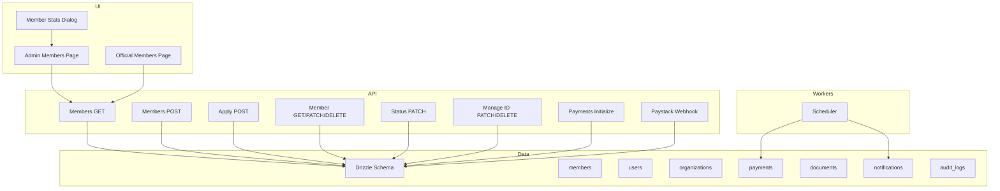

**Diagram sources**
- [route.ts:11-76](file://app/api/members/route.ts#L11-L76)
- [apply route.ts:48-203](file://app/api/members/apply/route.ts#L48-L203)
- [member detail route.ts:9-98](file://app/api/members/[id]/route.ts#L9-L98)
- [status route.ts:11-184](file://app/api/members/[id]/status/route.ts#L11-L184)
- [manage-id route.ts:8-75](file://app/api/members/[id]/manage-id/route.ts#L8-L75)
- [payments initialize route.ts:11-91](file://app/api/payments/initialize/route.ts#L11-L91)
- [paystack webhook route.ts:7-42](file://app/api/payments/paystack-webhook/route.ts#L7-L42)
- [admin members page.tsx:275-328](file://app/dashboard/admin/members/page.tsx#L275-L328)
- [official members page.tsx:318-358](file://app/dashboard/official/members/page.tsx#L318-L358)
- [member stats dialog.tsx:17-101](file://components/admin/members/member-stats-dialog.tsx#L17-L101)
- [scheduler worker.ts:264-336](file://workers/scheduler.ts#L264-L336)

**Section sources**
- [schema.ts:247-271](file://lib/db/schema.ts#L247-L271)
- [route.ts:11-76](file://app/api/members/route.ts#L11-L76)
- [apply route.ts:48-203](file://app/api/members/apply/route.ts#L48-L203)
- [member detail route.ts:9-98](file://app/api/members/[id]/route.ts#L9-L98)
- [status route.ts:11-184](file://app/api/members/[id]/status/route.ts#L11-L184)
- [manage-id route.ts:8-75](file://app/api/members/[id]/manage-id/route.ts#L8-L75)
- [payments initialize route.ts:11-91](file://app/api/payments/initialize/route.ts#L11-L91)
- [paystack webhook route.ts:7-42](file://app/api/payments/paystack-webhook/route.ts#L7-L42)
- [admin members page.tsx:275-328](file://app/dashboard/admin/members/page.tsx#L275-L328)
- [official members page.tsx:318-358](file://app/dashboard/official/members/page.tsx#L318-L358)
- [member stats dialog.tsx:17-101](file://components/admin/members/member-stats-dialog.tsx#L17-L101)
- [scheduler worker.ts:264-336](file://workers/scheduler.ts#L264-L336)

## Core Components
- Member model: stores personal and affiliation data, status, dates, and metadata.
- Registration flow: form validation, organization resolution, and pending application creation.
- Approval workflow: recommend/approve/reject with notifications and email templates.
- Payment integration: initialize membership fee payments and process webhooks.
- Digital ID: generate unique membership IDs based on country/state codes.
- Search and filter: list members by organization, status, and metadata fields.
- Export: CSV export of filtered member lists.
- Analytics and reports: aggregated metrics and compliance tracking.
- Automation: scheduler-driven reminders and notifications.

**Section sources**
- [schema.ts:247-271](file://lib/db/schema.ts#L247-L271)
- [apply route.ts:48-203](file://app/api/members/apply/route.ts#L48-L203)
- [status route.ts:11-184](file://app/api/members/[id]/status/route.ts#L11-L184)
- [payments initialize route.ts:11-91](file://app/api/payments/initialize/route.ts#L11-L91)
- [id-generator.ts:1-39](file://lib/id-generator.ts#L1-L39)
- [route.ts:11-76](file://app/api/members/route.ts#L11-L76)
- [admin members page.tsx:275-328](file://app/dashboard/admin/members/page.tsx#L275-L328)
- [analytics actions.ts:41-130](file://lib/actions/analytics.ts#L41-L130)
- [scheduler worker.ts:264-336](file://workers/scheduler.ts#L264-L336)

## Architecture Overview
The member lifecycle is orchestrated through Next.js API routes backed by Drizzle ORM and MySQL. Public applications are validated and stored as pending until approved. Admins and officials manage members via dashboards that call APIs for CRUD, status changes, and exports. Payments are initiated via a dedicated endpoint and finalized through Paystack webhooks. Emails and notifications are sent on key events. A scheduler worker runs periodic tasks for reminders and nudges.

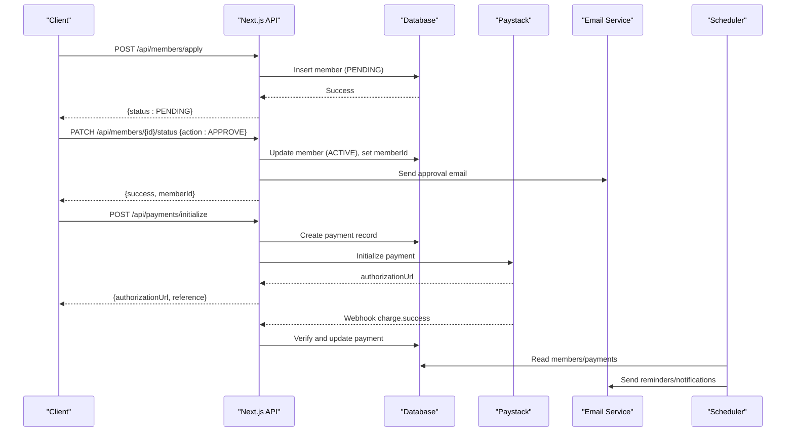

**Diagram sources**
- [apply route.ts:48-203](file://app/api/members/apply/route.ts#L48-L203)
- [status route.ts:11-184](file://app/api/members/[id]/status/route.ts#L11-L184)
- [payments initialize route.ts:11-91](file://app/api/payments/initialize/route.ts#L11-L91)
- [paystack webhook route.ts:7-42](file://app/api/payments/paystack-webhook/route.ts#L7-L42)
- [email.ts:21-92](file://lib/email.ts#L21-L92)
- [scheduler worker.ts:264-336](file://workers/scheduler.ts#L264-L336)

## Detailed Component Analysis

### Member Model and Relationships
The member entity links to a user, an organization, and optionally approvers/recommenders. It includes status, membership type, dates, and rich metadata for demographic and contact information. Related tables include payments and documents.

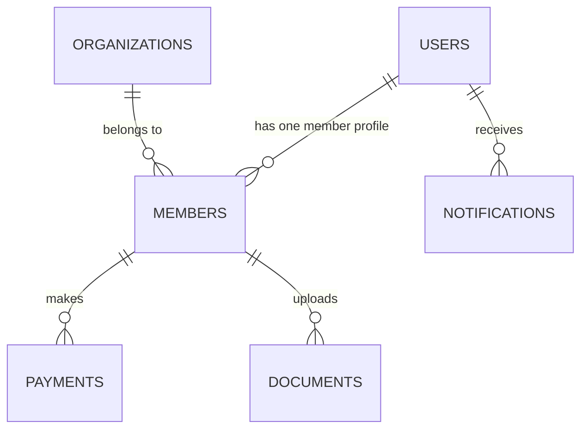

**Diagram sources**
- [schema.ts:247-271](file://lib/db/schema.ts#L247-L271)
- [schema.ts:352-370](file://lib/db/schema.ts#L352-L370)
- [schema.ts:393-409](file://lib/db/schema.ts#L393-L409)
- [schema.ts:482-494](file://lib/db/schema.ts#L482-L494)

**Section sources**
- [schema.ts:247-271](file://lib/db/schema.ts#L247-L271)

### Registration Workflow
Public registration validates input, checks if registration is enabled, resolves the appropriate organization (branch/LGA/state/national), and creates a pending member with extensive metadata.

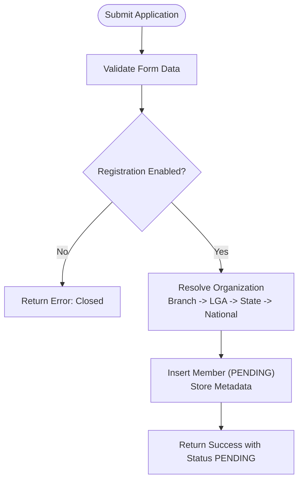

**Diagram sources**
- [apply route.ts:48-203](file://app/api/members/apply/route.ts#L48-L203)

**Section sources**
- [apply route.ts:48-203](file://app/api/members/apply/route.ts#L48-L203)

### Approval Workflow and Status Transitions
Administrators can recommend, approve, or reject applications. Approvals may require a recommendation depending on settings. On approval, a formal membership ID is generated, status becomes ACTIVE, and notifications/emails are sent. Rejection requires a reason and triggers notifications/emails.

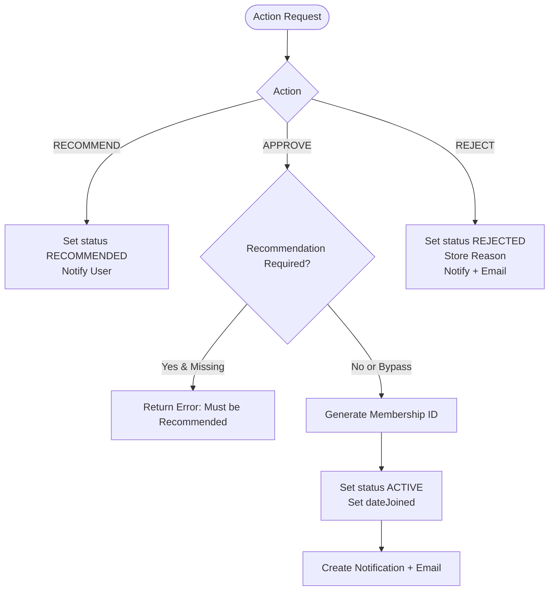

**Diagram sources**
- [status route.ts:11-184](file://app/api/members/[id]/status/route.ts#L11-L184)
- [id-generator.ts:1-39](file://lib/id-generator.ts#L1-L39)
- [email.ts:94-154](file://lib/email.ts#L94-L154)

**Section sources**
- [status route.ts:11-184](file://app/api/members/[id]/status/route.ts#L11-L184)
- [id-generator.ts:1-39](file://lib/id-generator.ts#L1-L39)
- [email.ts:94-154](file://lib/email.ts#L94-L154)

### Digital ID Card Generation
Membership IDs follow a structured format using country and state codes. The generator finds the last issued ID under the same prefix and increments the serial number. Administrators can also manually assign or reset IDs.

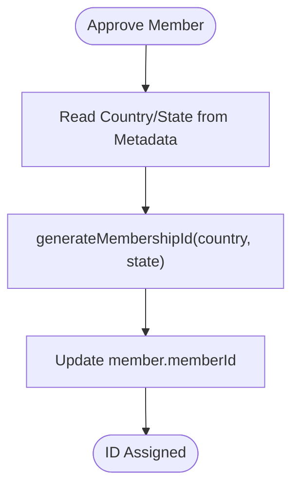

**Diagram sources**
- [id-generator.ts:1-39](file://lib/id-generator.ts#L1-L39)
- [status route.ts:95-110](file://app/api/members/[id]/status/route.ts#L95-L110)
- [manage-id route.ts:8-75](file://app/api/members/[id]/manage-id/route.ts#L8-L75)

**Section sources**
- [id-generator.ts:1-39](file://lib/id-generator.ts#L1-L39)
- [manage-id route.ts:8-75](file://app/api/members/[id]/manage-id/route.ts#L8-L75)

### Payment Integration for Membership Fees
Membership fees are initialized via an API that creates a payment record and obtains an authorization URL from Paystack. Webhooks verify successful charges and update records accordingly. Subaccounts can be used to route funds to jurisdictional accounts.

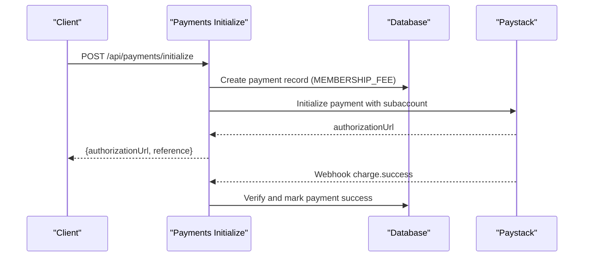

**Diagram sources**
- [payments initialize route.ts:11-91](file://app/api/payments/initialize/route.ts#L11-L91)
- [paystack webhook route.ts:7-42](file://app/api/payments/paystack-webhook/route.ts#L7-L42)

**Section sources**
- [payments initialize route.ts:11-91](file://app/api/payments/initialize/route.ts#L11-L91)
- [paystack webhook route.ts:7-42](file://app/api/payments/paystack-webhook/route.ts#L7-L42)

### Member Search, Filtering, and Bulk Operations
Admin and official dashboards support filtering by organization, status, state, LGA, branch, and keyword search. Results are paginated and exported to CSV. Bulk operations include exporting large datasets and viewing statistics.

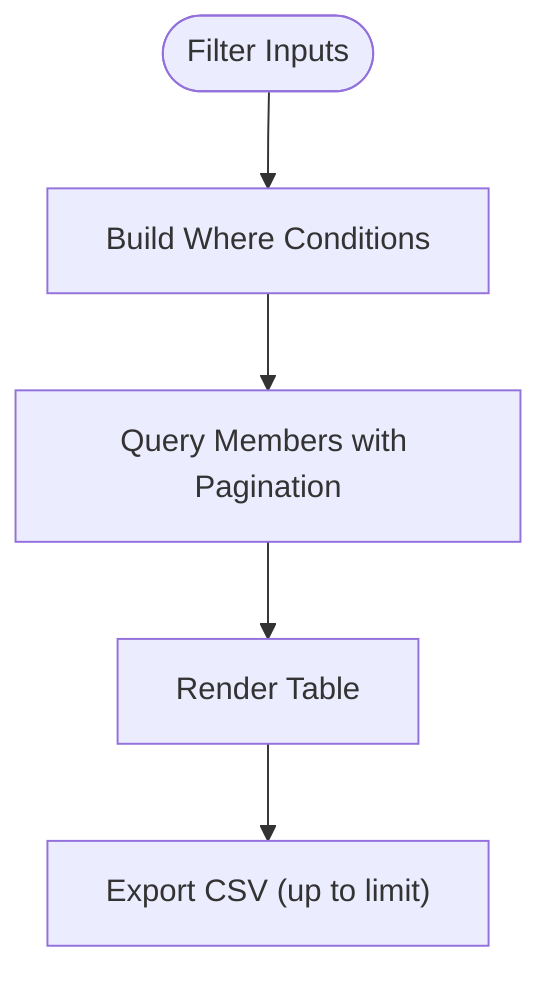

**Diagram sources**
- [route.ts:11-76](file://app/api/members/route.ts#L11-L76)
- [admin members page.tsx:275-328](file://app/dashboard/admin/members/page.tsx#L275-L328)
- [official members page.tsx:318-358](file://app/dashboard/official/members/page.tsx#L318-L358)

**Section sources**
- [route.ts:11-76](file://app/api/members/route.ts#L11-L76)
- [admin members page.tsx:275-328](file://app/dashboard/admin/members/page.tsx#L275-L328)
- [official members page.tsx:318-358](file://app/dashboard/official/members/page.tsx#L318-L358)

### Member Profile Management
Profiles include personal details, emergency contacts, demographics, and metadata. Users can view their status and details via dashboards. Documents and payments are associated with members for comprehensive history.

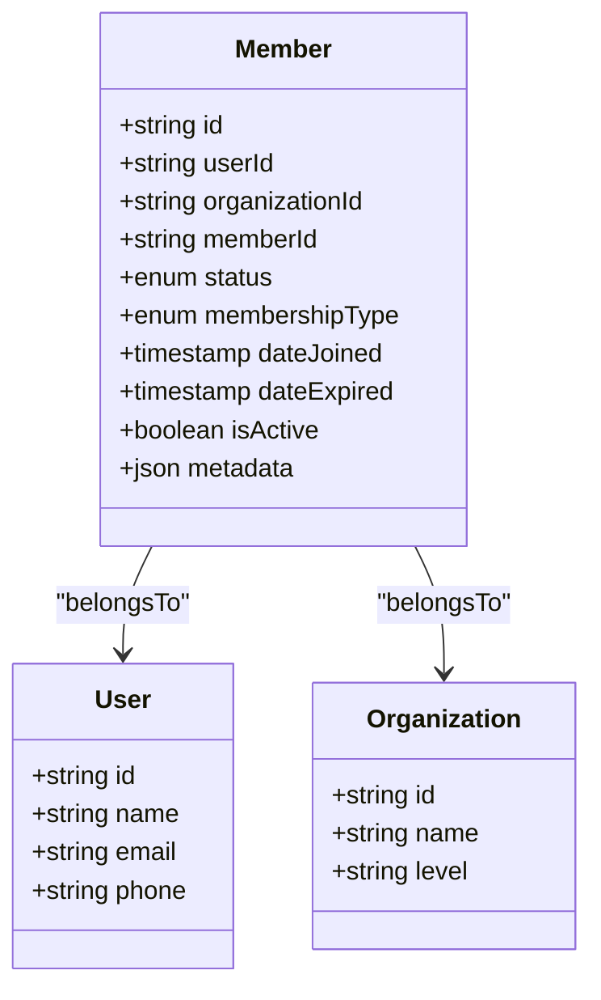

**Diagram sources**
- [schema.ts:247-271](file://lib/db/schema.ts#L247-L271)
- [schema.ts:84-105](file://lib/db/schema.ts#L84-L105)
- [schema.ts:149-188](file://lib/db/schema.ts#L149-L188)

**Section sources**
- [schema.ts:247-271](file://lib/db/schema.ts#L247-L271)
- [member detail route.ts:9-49](file://app/api/members/[id]/route.ts#L9-L49)

### Analytics, Reporting, and Compliance
Analytics aggregate revenue trends, category breakdowns, and compliance metrics. Reports roll up monthly activity across offices and jurisdictions. Member statistics provide total counts and state-level breakdowns.

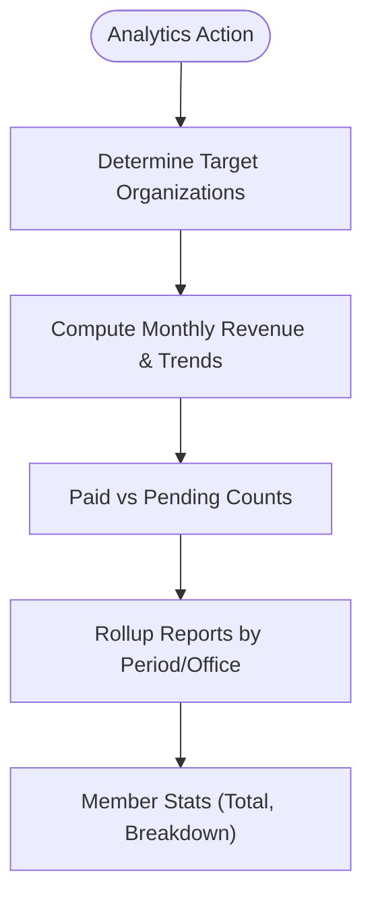

**Diagram sources**
- [analytics actions.ts:41-130](file://lib/actions/analytics.ts#L41-L130)
- [reports actions.ts:216-397](file://lib/actions/reports.ts#L216-L397)
- [member stats dialog.tsx:17-101](file://components/admin/members/member-stats-dialog.tsx#L17-L101)

**Section sources**
- [analytics actions.ts:41-130](file://lib/actions/analytics.ts#L41-L130)
- [reports actions.ts:216-397](file://lib/actions/reports.ts#L216-L397)
- [member stats dialog.tsx:17-101](file://components/admin/members/member-stats-dialog.tsx#L17-L101)

### Automation Features
Scheduled tasks send reminders for upcoming events and monthly office report submissions. They create in-app notifications and queue emails. While focused on programmes and reports, this pattern applies to member-related reminders (e.g., renewal notices).

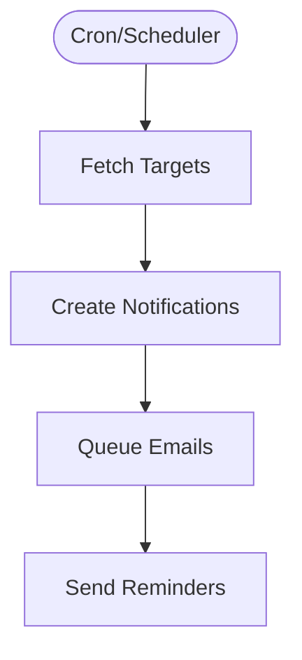

**Diagram sources**
- [scheduler worker.ts:264-336](file://workers/scheduler.ts#L264-L336)

**Section sources**
- [scheduler worker.ts:264-336](file://workers/scheduler.ts#L264-L336)

## Dependency Analysis
Key dependencies and coupling:
- API routes depend on session/auth, RBAC, Drizzle ORM, and schema definitions.
- Status changes depend on membership settings and email services.
- Payments depend on Paystack integration and webhook verification.
- Dashboards depend on API endpoints and export utilities.
- Scheduler depends on notification and email queues.

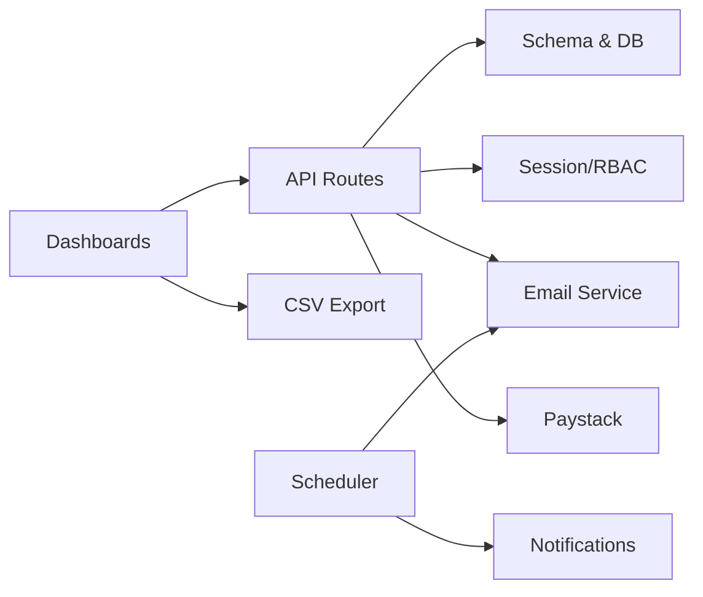

**Diagram sources**
- [route.ts:1-10](file://app/api/members/route.ts#L1-L10)
- [status route.ts:1-10](file://app/api/members/[id]/status/route.ts#L1-L10)
- [payments initialize route.ts:1-9](file://app/api/payments/initialize/route.ts#L1-L9)
- [paystack webhook route.ts:1-6](file://app/api/payments/paystack-webhook/route.ts#L1-L6)
- [admin members page.tsx:275-328](file://app/dashboard/admin/members/page.tsx#L275-L328)
- [scheduler worker.ts:264-336](file://workers/scheduler.ts#L264-L336)

**Section sources**
- [route.ts:1-10](file://app/api/members/route.ts#L1-L10)
- [status route.ts:1-10](file://app/api/members/[id]/status/route.ts#L1-L10)
- [payments initialize route.ts:1-9](file://app/api/payments/initialize/route.ts#L1-L9)
- [paystack webhook route.ts:1-6](file://app/api/payments/paystack-webhook/route.ts#L1-L6)
- [admin members page.tsx:275-328](file://app/dashboard/admin/members/page.tsx#L275-L328)
- [scheduler worker.ts:264-336](file://workers/scheduler.ts#L264-L336)

## Performance Considerations
- Use pagination and limits on list queries to avoid heavy payloads.
- Filter by organization and status at the database layer to reduce result sets.
- Batch operations like CSV export should cap limits (e.g., 1000 rows) to prevent timeouts.
- Leverage indexes on frequently queried columns (e.g., organizationId, status, createdAt).
- Offload email sending and reminders to background jobs where possible.

[No sources needed since this section provides general guidance]

## Troubleshooting Guide
Common issues and resolutions:
- Unauthorized access: Ensure valid session and required permissions are present before calling member APIs.
- Validation errors: Application submissions use strict schemas; ensure all required fields are provided.
- Recommendation requirement: If settings enforce recommendations, approvals will fail without a prior recommendation unless bypassed by admins.
- Duplicate member IDs: Manual ID assignment must check uniqueness before updating.
- Payment failures: Verify Paystack signature on webhooks and ensure references match payment records.
- Email delivery: Check email logs for failures and provider configuration.

**Section sources**
- [apply route.ts:48-203](file://app/api/members/apply/route.ts#L48-L203)
- [status route.ts:75-93](file://app/api/members/[id]/status/route.ts#L75-L93)
- [manage-id route.ts:24-31](file://app/api/members/[id]/manage-id/route.ts#L24-L31)
- [paystack webhook route.ts:7-42](file://app/api/payments/paystack-webhook/route.ts#L7-L42)
- [email.ts:21-92](file://lib/email.ts#L21-L92)

## Conclusion
The TMC Portal’s member management system provides a robust lifecycle from registration to active membership, supported by secure workflows, flexible approvals, integrated payments, and comprehensive administration tools. With analytics, reporting, and automation, it enables efficient oversight and engagement across jurisdictions. Future enhancements can include automated renewal reminders, expiry-based status transitions, and expanded bulk operations.

[No sources needed since this section summarizes without analyzing specific files]

## Appendices

### API Endpoints Summary
- GET /api/members: List members with filters and pagination.
- POST /api/members: Create a new member (admin).
- POST /api/members/apply: Submit public membership application.
- GET /api/members/:id: Retrieve member details with related payments/documents.
- PATCH /api/members/:id: Update member profile/status/type.
- DELETE /api/members/:id: Delete a member.
- PATCH /api/members/:id/status: Recommend, approve, or reject applications.
- PATCH /api/members/:id/manage-id: Manually assign/reset membership ID.
- POST /api/payments/initialize: Initialize membership fee payment.
- POST /api/payments/paystack-webhook: Handle Paystack payment events.

**Section sources**
- [route.ts:11-76](file://app/api/members/route.ts#L11-L76)
- [apply route.ts:48-203](file://app/api/members/apply/route.ts#L48-L203)
- [member detail route.ts:9-98](file://app/api/members/[id]/route.ts#L9-L98)
- [status route.ts:11-184](file://app/api/members/[id]/status/route.ts#L11-L184)
- [manage-id route.ts:8-75](file://app/api/members/[id]/manage-id/route.ts#L8-L75)
- [payments initialize route.ts:11-91](file://app/api/payments/initialize/route.ts#L11-L91)
- [paystack webhook route.ts:7-42](file://app/api/payments/paystack-webhook/route.ts#L7-L42)