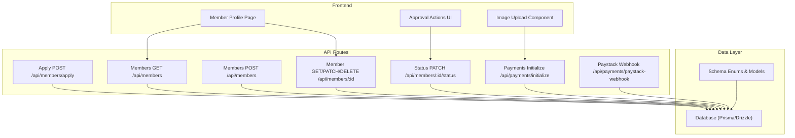
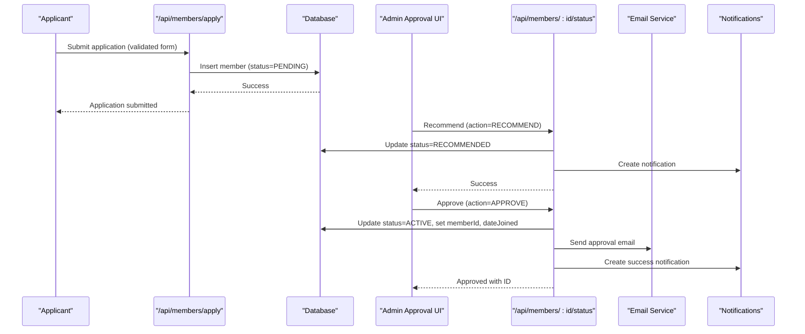
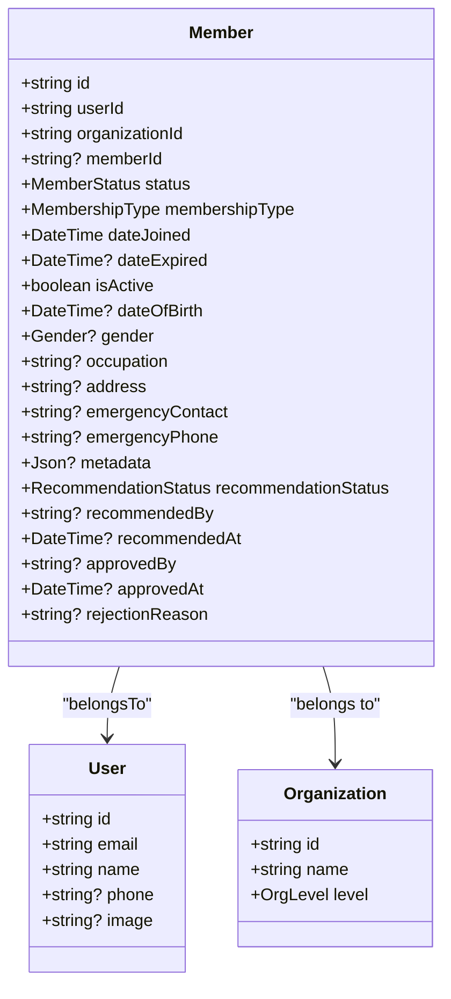
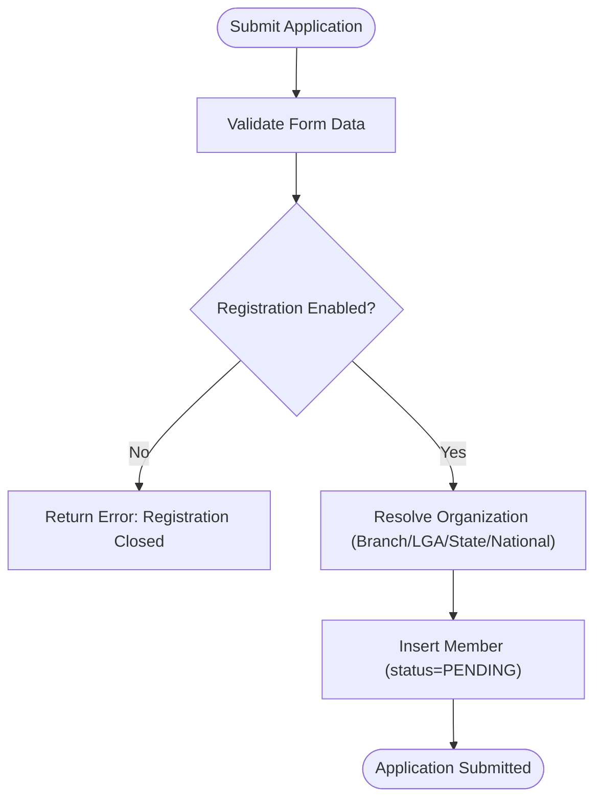
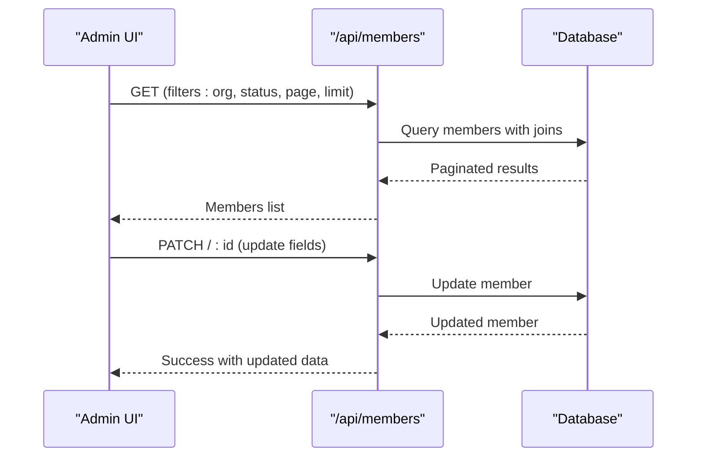
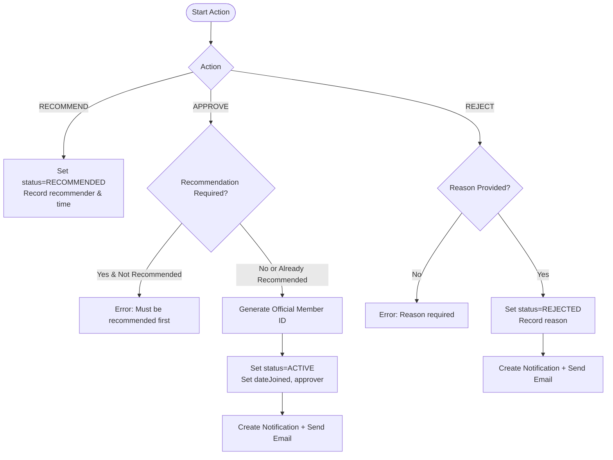
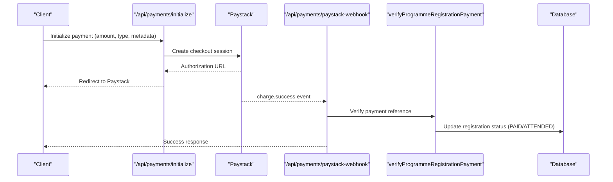
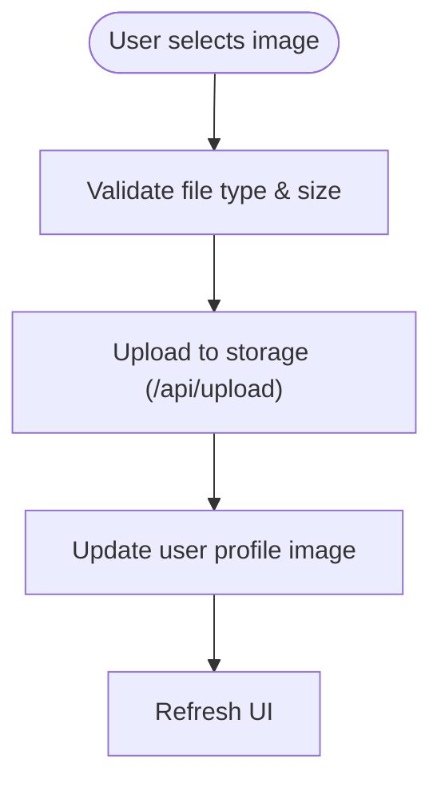
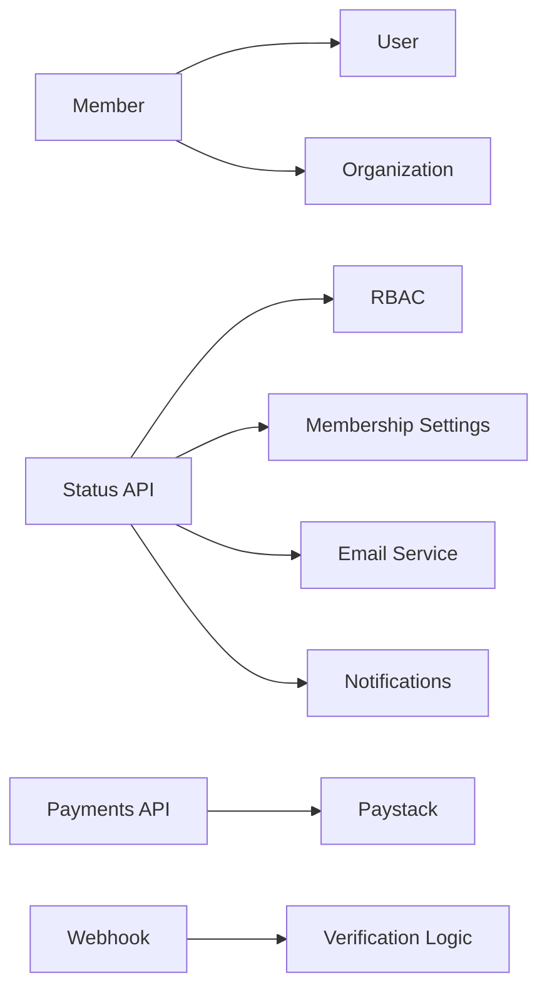

# Member Profile & Status Management

<cite>
**Referenced Files in This Document**
- [schema.prisma](file://prisma/schema.prisma)
- [members route.ts](file://app/api/members/route.ts)
- [member by id route.ts](file://app/api/members/[id]/route.ts)
- [member status route.ts](file://app/api/members/[id]/status/route.ts)
- [apply route.ts](file://app/api/members/apply/route.ts)
- [paystack webhook route.ts](file://app/api/payments/paystack-webhook/route.ts)
- [payments initialize route.ts](file://app/api/payments/initialize/route.ts)
- [member profile page.tsx](file://app/dashboard/member/profile/page.tsx)
- [image upload component.tsx](file://components/profile/image-upload.tsx)
- [approval actions component.tsx](file://components/admin/approval-actions.tsx)
- [db schema.ts](file://lib/db/schema.ts)
</cite>

## Table of Contents
1. Introduction
2. Project Structure
3. Core Components
4. Architecture Overview
5. Detailed Component Analysis
6. Dependency Analysis
7. Performance Considerations
8. Troubleshooting Guide
9. Conclusion

## Introduction
This document explains how the TMC Portal manages member profiles and membership status throughout their lifecycle. It covers:
- The member data model, including personal information, contact details, organizational affiliations, and membership type classifications (REGULAR, ASSOCIATE, HONORARY, LIFETIME).
- The comprehensive status management system with states: PENDING, RECOMMENDED, ACTIVE, SUSPENDED, EXPIRED, INACTIVE, REJECTED.
- Automated and administrative status transitions tied to payments, renewal dates, and admin actions.
- Member profile editing capabilities, document management, photo uploads, and preference settings.
- Workflows for status changes, bulk updates, and integrations with payments and programs.

## Project Structure
The member module spans database schemas, API routes, dashboards, and components:
- Data model and enums are defined centrally in the Prisma schema.
- Public application submission is handled via a dedicated API route.
- Administrative operations (list, update, delete, approve/recommend/reject) are exposed through REST endpoints.
- Dashboards render member profiles and administrative controls.
- File uploads support profile photos and documents.

**Diagram sources**
- [schema.prisma:207-275](file://prisma/schema.prisma#L207-L275)
- [members route.ts:11-76](file://app/api/members/route.ts#L11-L76)
- [member by id route.ts:9-49](file://app/api/members/[id]/route.ts#L9-L49)
- [member status route.ts:11-183](file://app/api/members/[id]/status/route.ts#L11-L183)
- [apply route.ts:48-203](file://app/api/members/apply/route.ts#L48-L203)
- [paystack webhook route.ts:7-41](file://app/api/payments/paystack-webhook/route.ts#L7-L41)
- [payments initialize route.ts:45-89](file://app/api/payments/initialize/route.ts#L45-L89)
- [member profile page.tsx:15-176](file://app/dashboard/member/profile/page.tsx#L15-L176)
- [image upload component.tsx:16-116](file://components/profile/image-upload.tsx#L16-L116)

**Section sources**
- [schema.prisma:207-275](file://prisma/schema.prisma#L207-L275)
- [members route.ts:11-76](file://app/api/members/route.ts#L11-L76)
- [member by id route.ts:9-49](file://app/api/members/[id]/route.ts#L9-L49)
- [member status route.ts:11-183](file://app/api/members/[id]/status/route.ts#L11-L183)
- [apply route.ts:48-203](file://app/api/members/apply/route.ts#L48-L203)
- [paystack webhook route.ts:7-41](file://app/api/payments/paystack-webhook/route.ts#L7-L41)
- [payments initialize route.ts:45-89](file://app/api/payments/initialize/route.ts#L45-L89)
- [member profile page.tsx:15-176](file://app/dashboard/member/profile/page.tsx#L15-L176)
- [image upload component.tsx:16-116](file://components/profile/image-upload.tsx#L16-L116)

## Core Components
- Member Model and Enums: Defines membership lifecycle, types, and related fields.
- Application Submission: Validates and stores new applications as PENDING.
- Administrative Operations: List, read, update, and delete members; manage IDs.
- Status Transitions: Recommend, Approve, Reject with notifications and emails.
- Payments Integration: Initialize payments and process webhooks for program registrations.
- Profile UI: Displays membership details, organization affiliation, and membership card preview.
- Photo Uploads: Securely upload and update profile images.

**Section sources**
- [schema.prisma:207-275](file://prisma/schema.prisma#L207-L275)
- [apply route.ts:48-203](file://app/api/members/apply/route.ts#L48-L203)
- [members route.ts:11-203](file://app/api/members/route.ts#L11-L203)
- [member by id route.ts:9-134](file://app/api/members/[id]/route.ts#L9-L134)
- [member status route.ts:11-183](file://app/api/members/[id]/status/route.ts#L11-L183)
- [paystack webhook route.ts:7-41](file://app/api/payments/paystack-webhook/route.ts#L7-L41)
- [payments initialize route.ts:45-89](file://app/api/payments/initialize/route.ts#L45-L89)
- [member profile page.tsx:15-176](file://app/dashboard/member/profile/page.tsx#L15-L176)
- [image upload component.tsx:16-116](file://components/profile/image-upload.tsx#L16-L116)

## Architecture Overview
The member lifecycle flows from application submission to approval or rejection, with optional recommendation steps and subsequent payment-driven renewals.

**Diagram sources**
- [apply route.ts:48-203](file://app/api/members/apply/route.ts#L48-L203)
- [member status route.ts:49-135](file://app/api/members/[id]/status/route.ts#L49-L135)

## Detailed Component Analysis

### Member Data Model and Classifications
- Membership Types: REGULAR, ASSOCIATE, HONORARY, LIFETIME.
- Status Enum: PENDING, RECOMMENDED, ACTIVE, SUSPENDED, EXPIRED, INACTIVE, REJECTED.
- Personal Information: Date of birth, gender, occupation, address, emergency contact and phone.
- Organizational Affiliation: Linked to an Organization via organizationId; metadata can store state/LGA/branch context.
- Approval Workflow Fields: recommendationStatus, recommendedBy/recommendedAt, approvedBy/approvedAt, rejectionReason.
- Relations: Payments, Documents, Programme Registrations.

**Diagram sources**
- [schema.prisma:207-275](file://prisma/schema.prisma#L207-L275)

**Section sources**
- [schema.prisma:207-275](file://prisma/schema.prisma#L207-L275)

### Application Submission Flow
- Validates application data using a strict schema.
- Checks if public registration is enabled via settings.
- Resolves the target organization based on branch/LGA/state selection with fallbacks.
- Inserts a new member record with status PENDING and stores extensive metadata.

**Diagram sources**
- [apply route.ts:48-203](file://app/api/members/apply/route.ts#L48-L203)

**Section sources**
- [apply route.ts:48-203](file://app/api/members/apply/route.ts#L48-L203)

### Administrative Member Management
- List members with filtering by organization and status, pagination, and includes user and organization details.
- Read, update, and delete individual members with audit logging.
- Manage membership IDs via a dedicated endpoint and UI component.

**Diagram sources**
- [members route.ts:11-76](file://app/api/members/route.ts#L11-L76)
- [member by id route.ts:52-98](file://app/api/members/[id]/route.ts#L52-L98)

**Section sources**
- [members route.ts:11-203](file://app/api/members/route.ts#L11-L203)
- [member by id route.ts:9-134](file://app/api/members/[id]/route.ts#L9-L134)

### Status Transition Logic
Supported actions:
- Recommend: Moves PENDING to RECOMMENDED, records recommender and timestamp, creates notification.
- Approve: Validates recommendation requirement (configurable), generates official membership ID, sets status to ACTIVE, records approver and join date, sends email and notification.
- Reject: Requires reason, sets status to REJECTED, records rejection reason, sends email and notification.

**Diagram sources**
- [member status route.ts:49-174](file://app/api/members/[id]/status/route.ts#L49-L174)

**Section sources**
- [member status route.ts:11-183](file://app/api/members/[id]/status/route.ts#L11-L183)
- [approval actions component.tsx:33-101](file://components/admin/approval-actions.tsx#L33-L101)

### Payment Integration and Renewal Considerations
- Payment initialization creates a payment record and returns authorization URL for Paystack.
- Webhook handler verifies signatures and processes successful charges for programme registrations.
- While membership fee payments are modeled, explicit automatic transition from payment success to membership status is not implemented in the referenced files; current automation focuses on programme registrations.

**Diagram sources**
- [payments initialize route.ts:45-89](file://app/api/payments/initialize/route.ts#L45-L89)
- [paystack webhook route.ts:7-41](file://app/api/payments/paystack-webhook/route.ts#L7-L41)

**Section sources**
- [payments initialize route.ts:45-89](file://app/api/payments/initialize/route.ts#L45-L89)
- [paystack webhook route.ts:7-41](file://app/api/payments/paystack-webhook/route.ts#L7-L41)

### Member Profile Editing, Documents, Photos, Preferences
- Profile Page: Displays member ID, membership type, join/expiry dates, organization affiliation, and a membership card preview.
- Photo Upload: Validates image type and size, uploads to storage, updates user profile image, and refreshes UI.
- Documents: Schema supports storing documents linked to users or members with types like ID_CARD, CERTIFICATE, PHOTO, CONTRACT, REPORT, MINUTES, OTHER.

**Diagram sources**
- [image upload component.tsx:22-68](file://components/profile/image-upload.tsx#L22-L68)
- [db schema.ts:398-409](file://lib/db/schema.ts#L398-L409)

**Section sources**
- [member profile page.tsx:15-176](file://app/dashboard/member/profile/page.tsx#L15-L176)
- [image upload component.tsx:16-116](file://components/profile/image-upload.tsx#L16-L116)
- [db schema.ts:398-409](file://lib/db/schema.ts#L398-L409)

### Bulk Status Updates
- The codebase provides per-member status actions via the status endpoint and UI.
- No dedicated bulk status update endpoint was found in the referenced files. Administrators can perform repeated single-member actions programmatically or via UI interactions.

[No sources needed since this section summarizes capability gaps without analyzing specific files]

## Dependency Analysis
Key dependencies and relationships:
- Member model depends on User and Organization relations.
- Status transitions depend on RBAC checks, membership settings, and email/notification services.
- Payments integration depends on Paystack and verification routines.
- Profile UI depends on storage and user profile update actions.

**Diagram sources**
- [schema.prisma:207-275](file://prisma/schema.prisma#L207-L275)
- [member status route.ts:11-183](file://app/api/members/[id]/status/route.ts#L11-L183)
- [payments initialize route.ts:45-89](file://app/api/payments/initialize/route.ts#L45-L89)
- [paystack webhook route.ts:7-41](file://app/api/payments/paystack-webhook/route.ts#L7-L41)

**Section sources**
- [schema.prisma:207-275](file://prisma/schema.prisma#L207-L275)
- [member status route.ts:11-183](file://app/api/members/[id]/status/route.ts#L11-L183)
- [payments initialize route.ts:45-89](file://app/api/payments/initialize/route.ts#L45-L89)
- [paystack webhook route.ts:7-41](file://app/api/payments/paystack-webhook/route.ts#L7-L41)

## Performance Considerations
- Pagination and filtering on member lists reduce payload sizes and improve dashboard responsiveness.
- Selective column projection in queries avoids unnecessary data transfer.
- Image validation on the client reduces server load from invalid uploads.
- Webhook handlers verify signatures before processing to prevent unnecessary computations.

[No sources needed since this section provides general guidance]

## Troubleshooting Guide
Common issues and resolutions:
- Unauthorized access: Ensure valid session and permissions when calling status or member endpoints.
- Missing recommendation: If recommendation is required by settings, ensure member status is RECOMMENDED before approving unless bypassed by admin privileges.
- Rejection errors: Provide a reason when rejecting applications.
- Payment webhook failures: Verify signature and event handling; check environment variables for secret keys.
- Upload failures: Confirm file type and size constraints; ensure storage endpoint responds successfully.

**Section sources**
- [member status route.ts:11-183](file://app/api/members/[id]/status/route.ts#L11-L183)
- [paystack webhook route.ts:7-41](file://app/api/payments/paystack-webhook/route.ts#L7-L41)
- [image upload component.tsx:22-68](file://components/profile/image-upload.tsx#L22-L68)

## Conclusion
The TMC Portal implements a robust member lifecycle with clear data models, controlled status transitions, and integrations for payments and communications. Applications start as PENDING, move through recommendation and approval workflows, and result in ACTIVE status with official IDs. Profile management supports photo uploads and document storage. While payment-driven automatic renewals are present for programmes, membership-specific automated transitions would require additional implementation beyond the referenced files.

[No sources needed since this section summarizes without analyzing specific files]