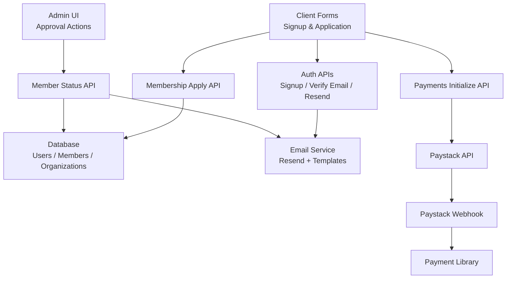
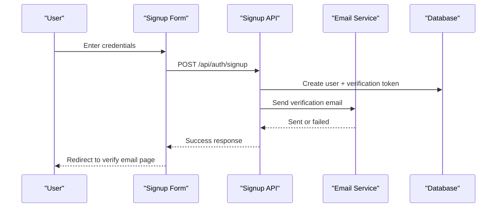
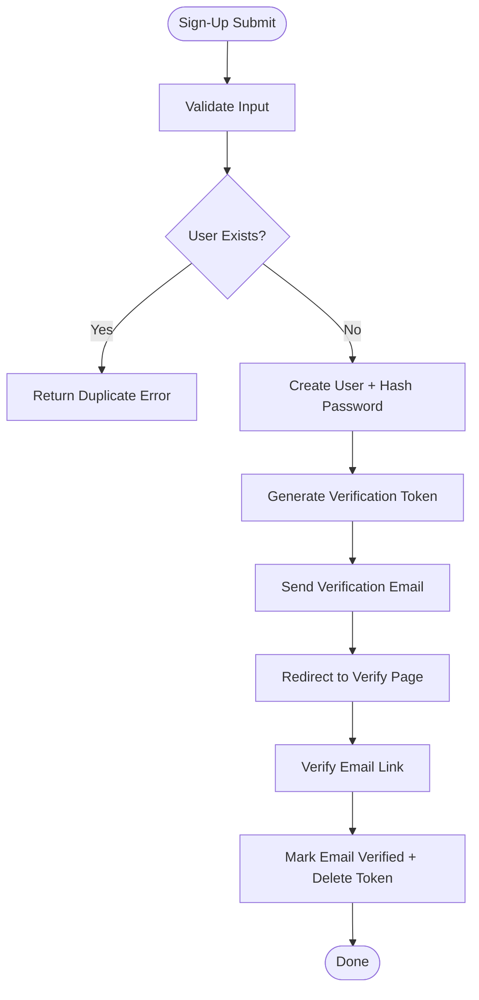
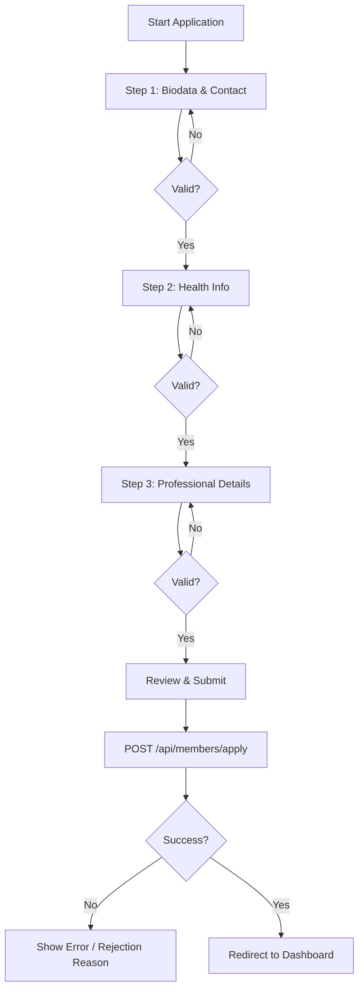
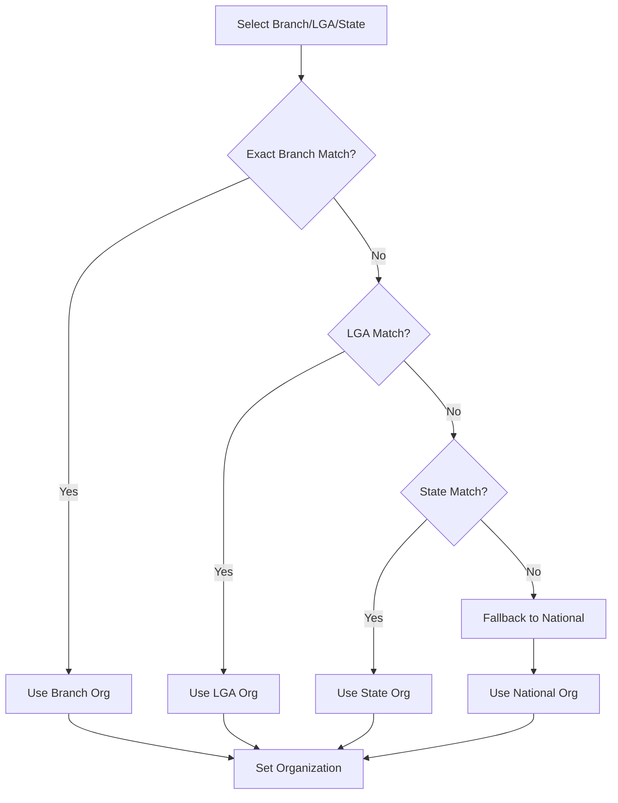
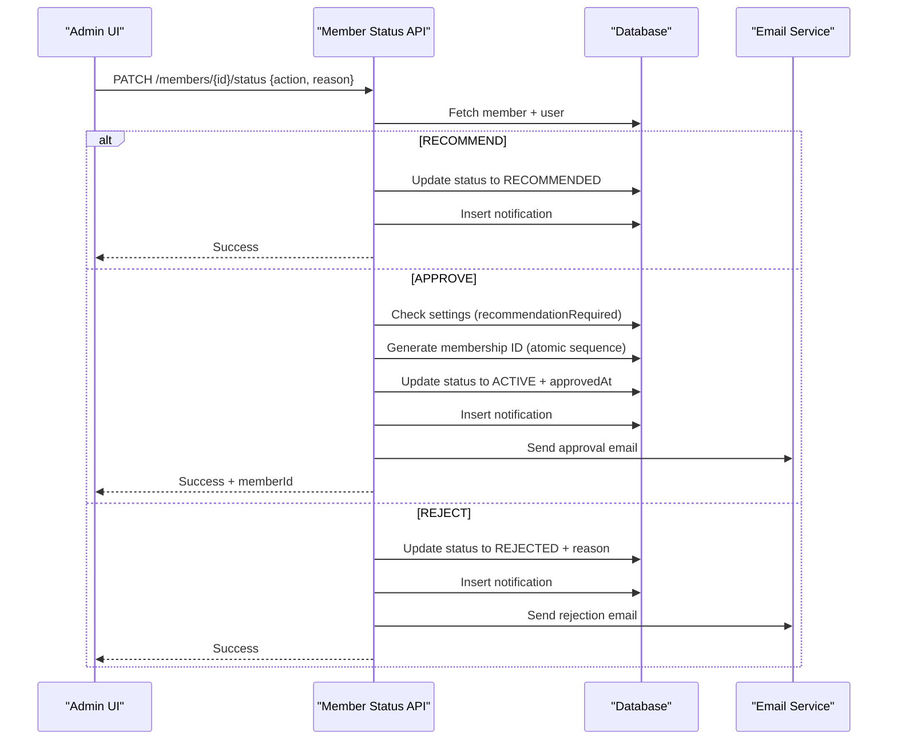
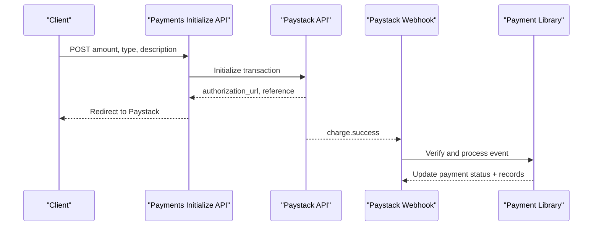
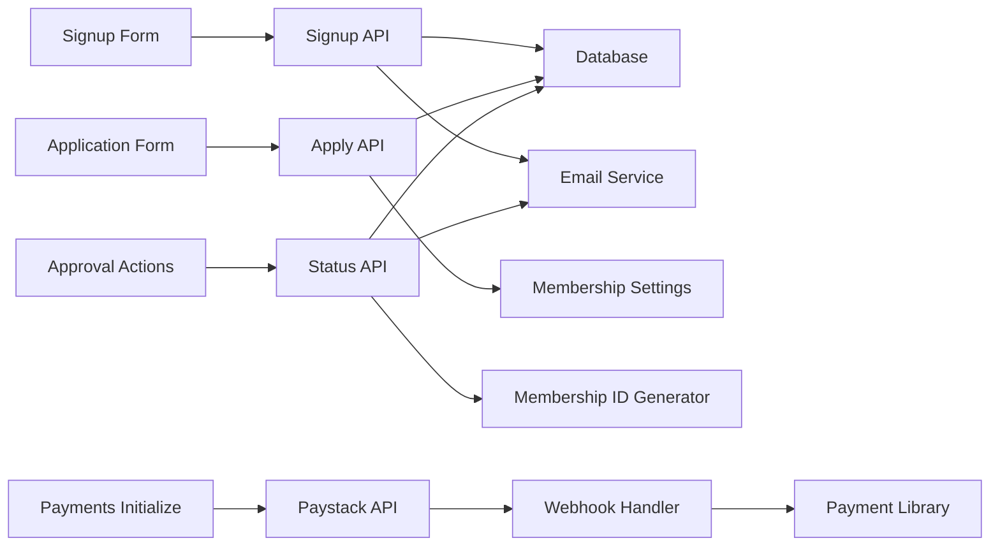

# Member Registration & Onboarding

<cite>
**Referenced Files in This Document**
- [signup-form.tsx](file://components/auth/signup-form.tsx)
- [route.ts](file://app/api/auth/signup/route.ts)
- [route.ts](file://app/api/auth/verify-email/route.ts)
- [route.ts](file://app/api/auth/resend-verification/route.ts)
- [client.tsx](file://app/dashboard/member/apply/client.tsx)
- [route.ts](file://app/api/members/apply/route.ts)
- [route.ts](file://app/api/members/[id]/status/route.ts)
- [approval-actions.tsx](file://components/admin/approval-actions.tsx)
- [route.ts](file://app/api/payments/initialize/route.ts)
- [route.ts](file://app/api/payments/paystack-webhook/route.ts)
- [payments.ts](file://lib/payments.ts)
- [email.ts](file://lib/email.ts)
- [membership-id.ts](file://lib/actions/membership-id.ts)
- [settings.ts](file://lib/actions/settings.ts)
</cite>

## Table of Contents
1. Introduction
2. Project Structure
3. Core Components
4. Architecture Overview
5. Detailed Component Analysis
6. Dependency Analysis
7. Performance Considerations
8. Troubleshooting Guide
9. Conclusion

## Introduction
This document explains the end-to-end member registration and onboarding workflow in the TMC Portal. It covers sign-up, email verification, multi-step membership application, organizational affiliation selection, review and approval workflows with role-based permissions, automated notifications, and payment processing integration with Paystack for membership fees. It also documents validation rules, error handling, status transitions, and manual review processes for complex cases.

## Project Structure
The registration and onboarding flow spans client-side forms, server API routes, database operations, email delivery, and payment integrations:
- Sign-up and email verification are handled by auth routes and a client form.
- The membership application is a multi-step client form that posts to an API route which validates data, selects an organization, and creates a pending member record.
- Approval actions update member status, generate official IDs, send notifications, and trigger emails.
- Payments are initialized via a dedicated route that integrates with Paystack; webhooks confirm successful payments.

**Diagram sources**
- [signup-form.tsx:68-140](file://components/auth/signup-form.tsx#L68-L140)
- [route.ts:25-140](file://app/api/auth/signup/route.ts#L25-L140)
- [route.ts:7-60](file://app/api/auth/verify-email/route.ts#L7-L60)
- [route.ts:8-67](file://app/api/auth/resend-verification/route.ts#L8-L67)
- [client.tsx:300-336](file://app/dashboard/member/apply/client.tsx#L300-L336)
- [route.ts:48-223](file://app/api/members/apply/route.ts#L48-L223)
- [route.ts:11-184](file://app/api/members/[id]/status/route.ts#L11-L184)
- [approval-actions.tsx:24-74](file://components/admin/approval-actions.tsx#L24-L74)
- [route.ts:11-91](file://app/api/payments/initialize/route.ts#L11-L91)
- [route.ts:7-42](file://app/api/payments/paystack-webhook/route.ts#L7-L42)
- [payments.ts:18-96](file://lib/payments.ts#L18-L96)
- [email.ts:21-92](file://lib/email.ts#L21-L92)

**Section sources**
- [signup-form.tsx:68-140](file://components/auth/signup-form.tsx#L68-L140)
- [route.ts:25-140](file://app/api/auth/signup/route.ts#L25-L140)
- [client.tsx:300-336](file://app/dashboard/member/apply/client.tsx#L300-L336)
- [route.ts:48-223](file://app/api/members/apply/route.ts#L48-L223)
- [route.ts:11-184](file://app/api/members/[id]/status/route.ts#L11-L184)
- [route.ts:11-91](file://app/api/payments/initialize/route.ts#L11-L91)
- [route.ts:7-42](file://app/api/payments/paystack-webhook/route.ts#L7-L42)
- [payments.ts:18-96](file://lib/payments.ts#L18-L96)
- [email.ts:21-92](file://lib/email.ts#L21-L92)

## Core Components
- Sign-up form and signup API: Validates user input, creates user account, generates verification token, sends verification email, and logs audit events.
- Email verification and resend: Verifies tokens, marks email as verified, deletes used tokens, and supports resending verification emails.
- Membership application form (multi-step): Captures biodata, health info, professional details, and location/branch selection; persists draft progress locally; submits validated data to backend.
- Membership apply API: Enforces settings (registration enabled), checks duplicates, resolves organization based on branch/LGA/state, stores application as PENDING.
- Approval workflow: Supports Recommend, Approve, Reject with permission checks, recommendation gating, ID generation, notifications, and email templates.
- Payments: Initializes Paystack transactions, records payments, verifies via webhook, updates statuses, and records financial inflows.

**Section sources**
- [signup-form.tsx:68-140](file://components/auth/signup-form.tsx#L68-L140)
- [route.ts:25-140](file://app/api/auth/signup/route.ts#L25-L140)
- [route.ts:7-60](file://app/api/auth/verify-email/route.ts#L7-L60)
- [route.ts:8-67](file://app/api/auth/resend-verification/route.ts#L8-L67)
- [client.tsx:56-118](file://app/dashboard/member/apply/client.tsx#L56-L118)
- [client.tsx:300-336](file://app/dashboard/member/apply/client.tsx#L300-L336)
- [route.ts:48-223](file://app/api/members/apply/route.ts#L48-L223)
- [route.ts:11-184](file://app/api/members/[id]/status/route.ts#L11-L184)
- [route.ts:11-91](file://app/api/payments/initialize/route.ts#L11-L91)
- [route.ts:7-42](file://app/api/payments/paystack-webhook/route.ts#L7-L42)
- [payments.ts:18-96](file://lib/payments.ts#L18-L96)
- [email.ts:95-195](file://lib/email.ts#L95-L195)

## Architecture Overview
The system orchestrates registration and onboarding across several layers:
- Frontend: React components handle user interactions, validation, and state management.
- Backend: Next.js API routes enforce business logic, authorization, and persistence.
- Data: Drizzle ORM interacts with MySQL tables for users, members, organizations, payments, and settings.
- Integrations: Email service (Resend) and payment gateway (Paystack).

**Diagram sources**
- [signup-form.tsx:68-140](file://components/auth/signup-form.tsx#L68-L140)
- [route.ts:25-140](file://app/api/auth/signup/route.ts#L25-L140)
- [email.ts:21-92](file://lib/email.ts#L21-L92)

## Detailed Component Analysis

### Sign-Up and Email Verification
- Validation: Server-side schema enforces required fields and password strength; client-side feedback guides users before submission.
- Flow: Creates user, generates time-bound verification token, sends email with verification link, logs audit event.
- Verification: Endpoint validates token and email, marks user verified, removes token.
- Resend: Generates new token, deletes old ones, and re-sends email.

**Diagram sources**
- [signup-form.tsx:68-140](file://components/auth/signup-form.tsx#L68-L140)
- [route.ts:25-140](file://app/api/auth/signup/route.ts#L25-L140)
- [route.ts:7-60](file://app/api/auth/verify-email/route.ts#L7-L60)
- [route.ts:8-67](file://app/api/auth/resend-verification/route.ts#L8-L67)

**Section sources**
- [signup-form.tsx:68-140](file://components/auth/signup-form.tsx#L68-L140)
- [route.ts:25-140](file://app/api/auth/signup/route.ts#L25-L140)
- [route.ts:7-60](file://app/api/auth/verify-email/route.ts#L7-L60)
- [route.ts:8-67](file://app/api/auth/resend-verification/route.ts#L8-L67)

### Multi-Step Membership Application
- Steps: Biodata (personal, contact, location), Health (medical info), Professional (work, education), Review and Submit.
- Validation: Zod schemas enforce required fields, conditional requirements (e.g., married fields), numeric ranges, and date constraints.
- Persistence: Auto-saves form progress to local storage; restores on load; clears after successful submission.
- Submission: Posts validated data to backend; handles rejection reasons and redirects to dashboard.

**Diagram sources**
- [client.tsx:56-118](file://app/dashboard/member/apply/client.tsx#L56-L118)
- [client.tsx:300-336](file://app/dashboard/member/apply/client.tsx#L300-L336)
- [route.ts:48-223](file://app/api/members/apply/route.ts#L48-L223)

**Section sources**
- [client.tsx:56-118](file://app/dashboard/member/apply/client.tsx#L56-L118)
- [client.tsx:300-336](file://app/dashboard/member/apply/client.tsx#L300-L336)
- [route.ts:48-223](file://app/api/members/apply/route.ts#L48-L223)

### Organizational Affiliation Selection
- Logic: Attempts exact match for Branch, then fuzzy match; falls back to LGA, State, National if needed; absolute fallback to any organization.
- Outcome: Associates the application with the resolved organization and stores metadata for later ID generation.

**Diagram sources**
- [route.ts:81-152](file://app/api/members/apply/route.ts#L81-L152)

**Section sources**
- [route.ts:81-152](file://app/api/members/apply/route.ts#L81-L152)

### Approval Workflow and Role-Based Permissions
- Actions: Recommend, Approve, Reject.
- Recommendation gating: If enabled, applications must be recommended before final approval unless bypassed by super admin or jurisdiction-level roles.
- ID Generation: On approval, generates official membership ID using country/state codes and atomic sequence increment.
- Notifications: Inserts in-app notifications and sends templated emails for approval/rejection.

**Diagram sources**
- [approval-actions.tsx:24-74](file://components/admin/approval-actions.tsx#L24-L74)
- [route.ts:11-184](file://app/api/members/[id]/status/route.ts#L11-L184)
- [membership-id.ts:13-98](file://lib/actions/membership-id.ts#L13-L98)
- [email.ts:104-154](file://lib/email.ts#L104-L154)

**Section sources**
- [approval-actions.tsx:24-74](file://components/admin/approval-actions.tsx#L24-L74)
- [route.ts:11-184](file://app/api/members/[id]/status/route.ts#L11-L184)
- [membership-id.ts:13-98](file://lib/actions/membership-id.ts#L13-L98)
- [email.ts:104-154](file://lib/email.ts#L104-L154)

### Payment Processing Integration with Paystack
- Initialization: Creates a payment record, resolves subaccount from organization, initializes Paystack transaction, and returns authorization URL.
- Webhook: Verifies signature, handles charge.success, and triggers verification for programme registrations (extensible for membership fees).
- Verification and Updates: Utility functions verify payments, update statuses, and record financial inflows.

**Diagram sources**
- [route.ts:11-91](file://app/api/payments/initialize/route.ts#L11-L91)
- [route.ts:7-42](file://app/api/payments/paystack-webhook/route.ts#L7-L42)
- [payments.ts:18-96](file://lib/payments.ts#L18-L96)

**Section sources**
- [route.ts:11-91](file://app/api/payments/initialize/route.ts#L11-L91)
- [route.ts:7-42](file://app/api/payments/paystack-webhook/route.ts#L7-L42)
- [payments.ts:18-96](file://lib/payments.ts#L18-L96)

### Automated Notifications and Email Templates
- Templates: Welcome, membership approved/rejected, payment received, verification, meeting invitations, programme receipts/certificates.
- Delivery: Uses Resend with logging; in dev mode, logs to console and database.

**Section sources**
- [email.ts:21-92](file://lib/email.ts#L21-L92)
- [email.ts:95-195](file://lib/email.ts#L95-L195)

## Dependency Analysis
Key dependencies and relationships:
- Signup flow depends on DB schema for users and verificationTokens, email service, and audit logging.
- Application flow depends on membership settings, organization resolution, and member creation.
- Approval flow depends on RBAC/session, membership ID generator, notifications, and email templates.
- Payments depend on Paystack SDK calls, webhook signature verification, and financial transaction recording.

**Diagram sources**
- [signup-form.tsx:68-140](file://components/auth/signup-form.tsx#L68-L140)
- [route.ts:25-140](file://app/api/auth/signup/route.ts#L25-L140)
- [client.tsx:300-336](file://app/dashboard/member/apply/client.tsx#L300-L336)
- [route.ts:48-223](file://app/api/members/apply/route.ts#L48-L223)
- [route.ts:11-184](file://app/api/members/[id]/status/route.ts#L11-L184)
- [membership-id.ts:13-98](file://lib/actions/membership-id.ts#L13-L98)
- [route.ts:11-91](file://app/api/payments/initialize/route.ts#L11-L91)
- [route.ts:7-42](file://app/api/payments/paystack-webhook/route.ts#L7-L42)
- [payments.ts:18-96](file://lib/payments.ts#L18-L96)

**Section sources**
- [settings.ts:110-143](file://lib/actions/settings.ts#L110-L143)
- [route.ts:48-223](file://app/api/members/apply/route.ts#L48-L223)
- [route.ts:11-184](file://app/api/members/[id]/status/route.ts#L11-L184)
- [payments.ts:18-96](file://lib/payments.ts#L18-L96)

## Performance Considerations
- Database queries: Use targeted lookups and indexes for users, members, organizations, and sequences to minimize latency during approval and ID generation.
- Atomic sequences: Ensure idempotent increments to avoid race conditions when generating membership IDs under concurrent approvals.
- Email reliability: Log all attempts and failures; consider retry mechanisms for transient email provider errors.
- Payment webhooks: Validate signatures promptly; process asynchronously if necessary to avoid timeouts.

[No sources needed since this section provides general guidance]

## Troubleshooting Guide
Common issues and resolutions:
- Duplicate email during signup: Ensure unique email constraint; guide users to login or reset password.
- Invalid or expired verification token: Confirm token exists and is not expired; allow resend functionality.
- Missing organization: Validate organization hierarchy and ensure national fallback exists; check configuration.
- Recommendation required but missing: Enforce recommendation step or allow super admin bypass per settings.
- Payment initialization failure: Check Paystack keys, amounts, and callback URLs; log detailed errors.
- Webhook signature mismatch: Verify secret key and payload integrity; reject invalid requests.

**Section sources**
- [route.ts:25-140](file://app/api/auth/signup/route.ts#L25-L140)
- [route.ts:7-60](file://app/api/auth/verify-email/route.ts#L7-L60)
- [route.ts:48-223](file://app/api/members/apply/route.ts#L48-L223)
- [route.ts:11-184](file://app/api/members/[id]/status/route.ts#L11-L184)
- [route.ts:11-91](file://app/api/payments/initialize/route.ts#L11-L91)
- [route.ts:7-42](file://app/api/payments/paystack-webhook/route.ts#L7-L42)

## Conclusion
The TMC Portal’s member registration and onboarding workflow integrates robust validation, multi-step data capture, organizational affiliation resolution, configurable approval flows with role-based permissions, automated notifications, and secure payment processing via Paystack. The design emphasizes reliability through atomic operations, comprehensive logging, and clear error handling, ensuring a smooth experience for applicants and administrators alike.