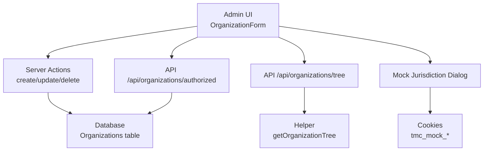
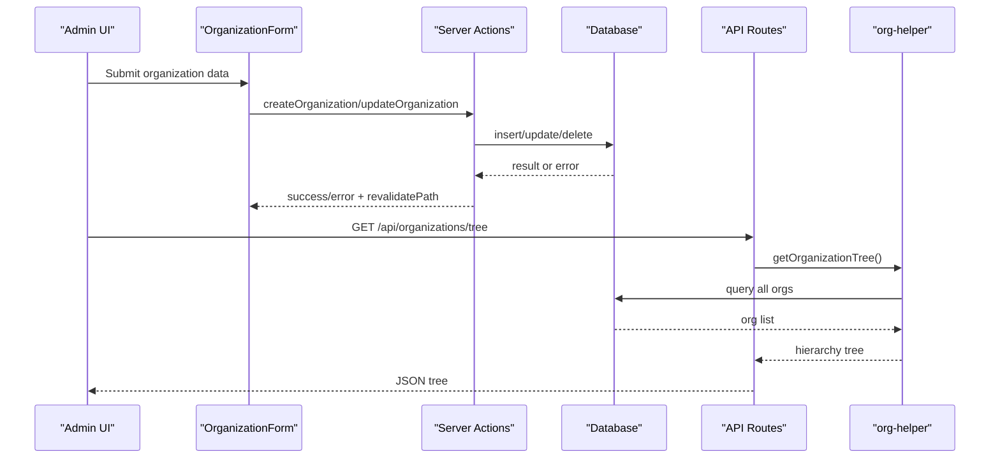
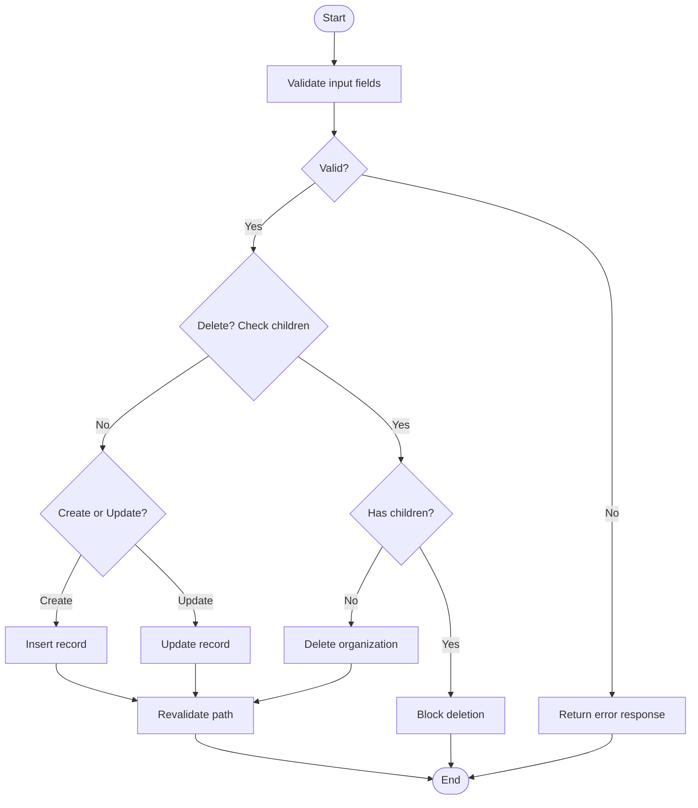
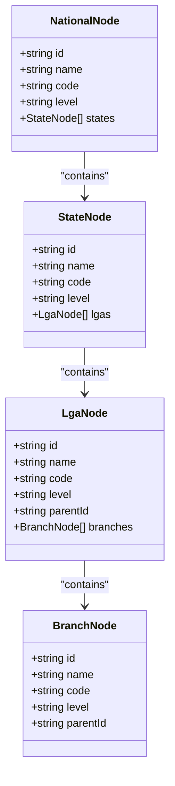
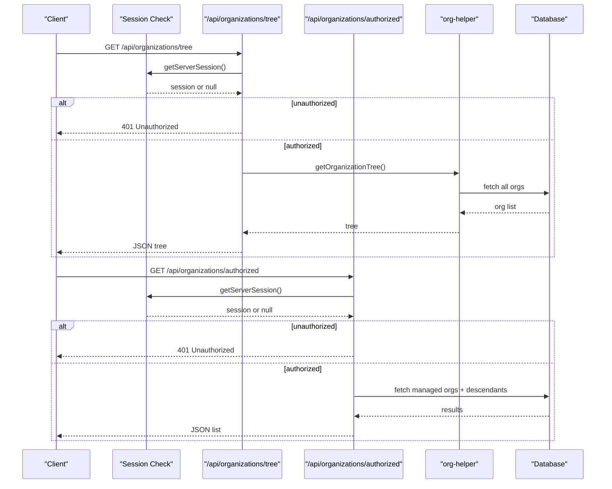
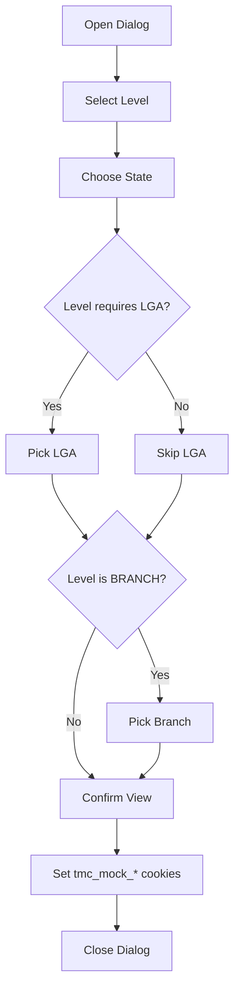
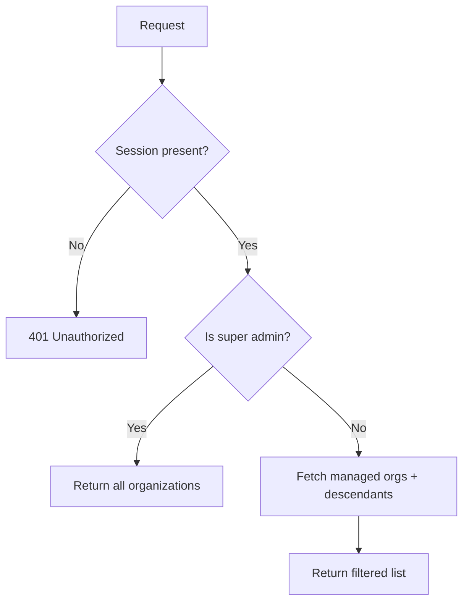
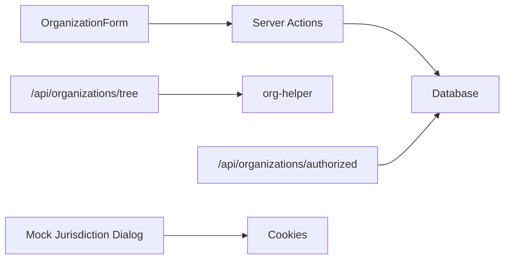

# Administrative Operations & Workflows

<cite>
**Referenced Files in This Document**
- [organization.ts](file://lib/actions/organization.ts)
- [organization-form.tsx](file://components/admin/organizations/organization-form.tsx)
- [mock-jurisdiction-dialog.tsx](file://components/admin/mock-jurisdiction-dialog.tsx)
- [mock-jurisdiction.ts](file://lib/mock-jurisdiction.ts)
- [org-helper.ts](file://lib/org-helper.ts)
- [tree route.ts](file://app/api/organizations/tree/route.ts)
- [authorized route.ts](file://app/api/organizations/authorized/route.ts)
</cite>

## Table of Contents
1. Introduction
2. Project Structure
3. Core Components
4. Architecture Overview
5. Detailed Component Analysis
6. Dependency Analysis
7. Performance Considerations
8. Troubleshooting Guide
9. Conclusion

## Introduction
This document explains administrative operations and workflows for organization management in the portal. It covers:
- Full CRUD operations for organizations (create, read, update, delete)
- Editing processes and data preservation strategies
- Mock jurisdiction dialog for testing and development
- Bulk operations guidance for large-scale changes (import/export and batch processing)
- Organization lifecycle management, status transitions, and audit trails
- Programmatic management via API endpoints and server actions
- Permission requirements and role-based access controls
- Error handling, transaction management, and rollback procedures
- Troubleshooting and performance optimization techniques for large datasets

## Project Structure
Organization administration spans client-side forms, server actions, API routes, and helper utilities:
- Client form: validates inputs, uploads images, and calls server actions
- Server actions: perform create/update/delete with validation and revalidation
- API routes: expose organization tree and authorized lists with session checks
- Helpers: build hierarchical trees and ancestry paths
- Mock jurisdiction: a dev tool to simulate jurisdiction context via cookies

**Diagram sources**
- [organization-form.tsx:119-155](file://components/admin/organizations/organization-form.tsx#L119-L155)
- [organization.ts:11-52](file://lib/actions/organization.ts#L11-L52)
- [organization.ts:80-117](file://lib/actions/organization.ts#L80-L117)
- [organization.ts:54-78](file://lib/actions/organization.ts#L54-L78)
- [tree route.ts:5-18](file://app/api/organizations/tree/route.ts#L5-L18)
- [authorized route.ts:7-66](file://app/api/organizations/authorized/route.ts#L7-L66)
- [org-helper.ts:38-98](file://lib/org-helper.ts#L38-L98)
- [mock-jurisdiction-dialog.tsx:30-60](file://components/admin/mock-jurisdiction-dialog.tsx#L30-L60)
- [mock-jurisdiction.ts:3-18](file://lib/mock-jurisdiction.ts#L3-L18)

**Section sources**
- [organization-form.tsx:1-325](file://components/admin/organizations/organization-form.tsx#L1-L325)
- [organization.ts:1-144](file://lib/actions/organization.ts#L1-L144)
- [tree route.ts:1-19](file://app/api/organizations/tree/route.ts#L1-L19)
- [authorized route.ts:1-67](file://app/api/organizations/authorized/route.ts#L1-L67)
- [org-helper.ts:1-118](file://lib/org-helper.ts#L1-L118)
- [mock-jurisdiction-dialog.tsx:1-128](file://components/admin/mock-jurisdiction-dialog.tsx#L1-L128)
- [mock-jurisdiction.ts:1-19](file://lib/mock-jurisdiction.ts#L1-L19)

## Core Components
- Organization Form (client): Validates fields, handles image upload, and invokes server actions for create/update. Supports parent selection based on level constraints.
- Server Actions: Implement create, update, delete, and planning settings updates with validation, error handling, and path revalidation.
- API Routes: Provide authenticated access to organization tree and authorized organizations list.
- Helper Utilities: Build hierarchical trees and compute ancestry paths for display and navigation.
- Mock Jurisdiction Dialog: Allows developers to simulate jurisdiction context by setting cookies.

**Section sources**
- [organization-form.tsx:23-35](file://components/admin/organizations/organization-form.tsx#L23-L35)
- [organization-form.tsx:71-79](file://components/admin/organizations/organization-form.tsx#L71-L79)
- [organization-form.tsx:83-117](file://components/admin/organizations/organization-form.tsx#L83-L117)
- [organization-form.tsx:119-155](file://components/admin/organizations/organization-form.tsx#L119-L155)
- [organization.ts:11-52](file://lib/actions/organization.ts#L11-L52)
- [organization.ts:80-117](file://lib/actions/organization.ts#L80-L117)
- [organization.ts:54-78](file://lib/actions/organization.ts#L54-L78)
- [org-helper.ts:38-98](file://lib/org-helper.ts#L38-L98)
- [mock-jurisdiction-dialog.tsx:30-60](file://components/admin/mock-jurisdiction-dialog.tsx#L30-L60)
- [mock-jurisdiction.ts:3-18](file://lib/mock-jurisdiction.ts#L3-L18)

## Architecture Overview
The system follows a layered architecture:
- Presentation layer: Admin UI components and dialogs
- Service layer: Server actions encapsulate business logic and persistence
- Data layer: Database queries via ORM helpers
- Integration points: API routes enforce authentication and return structured data
- Dev tooling: Mock jurisdiction dialog sets cookies to simulate scoped contexts

**Diagram sources**
- [organization-form.tsx:119-155](file://components/admin/organizations/organization-form.tsx#L119-L155)
- [organization.ts:11-52](file://lib/actions/organization.ts#L11-L52)
- [organization.ts:80-117](file://lib/actions/organization.ts#L80-L117)
- [organization.ts:54-78](file://lib/actions/organization.ts#L54-L78)
- [tree route.ts:5-18](file://app/api/organizations/tree/route.ts#L5-L18)
- [org-helper.ts:38-98](file://lib/org-helper.ts#L38-L98)

## Detailed Component Analysis

### Organization CRUD Operations
- Create: Validates required fields, inserts record, handles duplicate code errors, and revalidates admin page.
- Update: Validates fields, updates record, preserves optional fields, and revalidates detail page.
- Delete: Prevents deletion if children exist; otherwise deletes and revalidates admin page.
- Read: Provides listing and tree views via server actions and API routes.

**Diagram sources**
- [organization.ts:11-52](file://lib/actions/organization.ts#L11-L52)
- [organization.ts:80-117](file://lib/actions/organization.ts#L80-L117)
- [organization.ts:54-78](file://lib/actions/organization.ts#L54-L78)

**Section sources**
- [organization.ts:11-52](file://lib/actions/organization.ts#L11-L52)
- [organization.ts:80-117](file://lib/actions/organization.ts#L80-L117)
- [organization.ts:54-78](file://lib/actions/organization.ts#L54-L78)

### Organization Tree and Ancestry
- Tree builder groups organizations by level and constructs a nested structure (National -> State -> LGA -> Branch).
- Ancestry resolver walks up the hierarchy to produce a path from an organization to its root.

**Diagram sources**
- [org-helper.ts:5-36](file://lib/org-helper.ts#L5-L36)
- [org-helper.ts:38-98](file://lib/org-helper.ts#L38-L98)

**Section sources**
- [org-helper.ts:38-98](file://lib/org-helper.ts#L38-L98)
- [org-helper.ts:100-117](file://lib/org-helper.ts#L100-L117)

### API Endpoints for Organizations
- GET /api/organizations/tree: Returns full hierarchy after verifying session.
- GET /api/organizations/authorized: Returns organizations accessible to the current user based on roles and super-admin status.

**Diagram sources**
- [tree route.ts:5-18](file://app/api/organizations/tree/route.ts#L5-L18)
- [authorized route.ts:7-66](file://app/api/organizations/authorized/route.ts#L7-L66)
- [org-helper.ts:38-98](file://lib/org-helper.ts#L38-L98)

**Section sources**
- [tree route.ts:1-19](file://app/api/organizations/tree/route.ts#L1-L19)
- [authorized route.ts:1-67](file://app/api/organizations/authorized/route.ts#L1-L67)

### Mock Jurisdiction Dialog
- Purpose: Simulate jurisdiction context for development/testing by selecting state/LGA/branch and persisting selections in cookies.
- Behavior: Validates selection based on chosen level and triggers confirmation callback.

**Diagram sources**
- [mock-jurisdiction-dialog.tsx:30-60](file://components/admin/mock-jurisdiction-dialog.tsx#L30-L60)
- [mock-jurisdiction-dialog.tsx:71-123](file://components/admin/mock-jurisdiction-dialog.tsx#L71-L123)
- [mock-jurisdiction.ts:3-18](file://lib/mock-jurisdiction.ts#L3-L18)

**Section sources**
- [mock-jurisdiction-dialog.tsx:1-128](file://components/admin/mock-jurisdiction-dialog.tsx#L1-L128)
- [mock-jurisdiction.ts:1-19](file://lib/mock-jurisdiction.ts#L1-L19)

### Programmatic Management via Server Actions and APIs
- Create: Use server action to submit FormData with name, level, code, and optional fields.
- Update: Call update server action with orgId and modified fields.
- Delete: Call delete server action; ensure no child organizations exist.
- Read: Use API endpoints to retrieve tree or authorized list.

Examples of usage patterns:
- Client form submission triggers server actions that handle persistence and UI refresh.
- API endpoints provide read-only access to organization structures with authentication.

**Section sources**
- [organization-form.tsx:119-155](file://components/admin/organizations/organization-form.tsx#L119-L155)
- [organization.ts:11-52](file://lib/actions/organization.ts#L11-L52)
- [organization.ts:80-117](file://lib/actions/organization.ts#L80-L117)
- [organization.ts:54-78](file://lib/actions/organization.ts#L54-L78)
- [tree route.ts:5-18](file://app/api/organizations/tree/route.ts#L5-L18)
- [authorized route.ts:7-66](file://app/api/organizations/authorized/route.ts#L7-L66)

### Permissions and Role-Based Access Control
- Session enforcement: Both API routes check for a valid session before proceeding.
- Super-admin behavior: Super admins can access all organizations.
- Scoped access: Non-super-admin users receive only organizations they manage plus immediate descendants.

**Diagram sources**
- [authorized route.ts:7-66](file://app/api/organizations/authorized/route.ts#L7-L66)

**Section sources**
- [authorized route.ts:7-66](file://app/api/organizations/authorized/route.ts#L7-L66)

### Lifecycle Management, Status Transitions, and Audit Trails
- Current implementation: Organizations have creation and update timestamps; explicit status fields are not present in the analyzed files.
- Recommendations:
  - Introduce a status field (e.g., active, suspended, archived) and define allowed transitions.
  - Add audit logging for create/update/delete events to track who changed what and when.
  - Enforce transitions via server actions with validation rules.

[No sources needed since this section provides general guidance]

### Bulk Operations (Import/Export and Batch Processing)
- Import: Not implemented in the analyzed files. Recommended approach:
  - Accept CSV/JSON payloads via a dedicated endpoint.
  - Validate each record and process in batches using transactions.
  - Log partial failures and provide a summary report.
- Export: Not implemented in the analyzed files. Recommended approach:
  - Expose an endpoint to export organizations with hierarchy metadata.
  - Support pagination and filtering for large datasets.
- Batch processing:
  - Use background jobs or queues for long-running operations.
  - Implement idempotency keys to avoid duplicate work.

[No sources needed since this section provides general guidance]

## Dependency Analysis
Key dependencies and relationships:
- OrganizationForm depends on server actions for persistence and UI feedback.
- Server actions depend on database schema and ORM helpers.
- API routes depend on session utilities and helper functions.
- Mock jurisdiction dialog depends on location data and cookie storage.

**Diagram sources**
- [organization-form.tsx:119-155](file://components/admin/organizations/organization-form.tsx#L119-L155)
- [organization.ts:11-52](file://lib/actions/organization.ts#L11-L52)
- [tree route.ts:5-18](file://app/api/organizations/tree/route.ts#L5-L18)
- [authorized route.ts:7-66](file://app/api/organizations/authorized/route.ts#L7-L66)
- [mock-jurisdiction-dialog.tsx:30-60](file://components/admin/mock-jurisdiction-dialog.tsx#L30-L60)
- [mock-jurisdiction.ts:3-18](file://lib/mock-jurisdiction.ts#L3-L18)

**Section sources**
- [organization-form.tsx:119-155](file://components/admin/organizations/organization-form.tsx#L119-L155)
- [organization.ts:11-52](file://lib/actions/organization.ts#L11-L52)
- [tree route.ts:5-18](file://app/api/organizations/tree/route.ts#L5-L18)
- [authorized route.ts:7-66](file://app/api/organizations/authorized/route.ts#L7-L66)
- [mock-jurisdiction-dialog.tsx:30-60](file://components/admin/mock-jurisdiction-dialog.tsx#L30-L60)
- [mock-jurisdiction.ts:3-18](file://lib/mock-jurisdiction.ts#L3-L18)

## Performance Considerations
- Tree building: The current tree builder fetches all organizations and filters in memory. For large datasets, consider:
  - Using recursive CTEs or optimized queries to reduce memory usage.
  - Caching frequently accessed trees with short TTLs.
- Authorized list: Fetches managed orgs and multiple levels of descendants. Optimize with:
  - Single query with joins or recursive CTEs where supported.
  - Indexing on parentId and organizationId for faster lookups.
- Image uploads: Enforce size limits and compress images server-side to reduce storage and bandwidth.
- Pagination: For large lists, implement server-side pagination to reduce payload sizes.

[No sources needed since this section provides general guidance]

## Troubleshooting Guide
Common issues and resolutions:
- Duplicate organization code: Creation fails with a duplicate entry error. Ensure unique codes per organization.
- Deletion blocked due to children: Remove or reassign child organizations before deleting the parent.
- Unauthorized access: Verify session presence when calling API endpoints.
- Validation errors: Ensure required fields (name, level, code) are provided.
- Image upload failures: Check file size limits and server upload configuration.

**Section sources**
- [organization.ts:23-51](file://lib/actions/organization.ts#L23-L51)
- [organization.ts:54-78](file://lib/actions/organization.ts#L54-L78)
- [organization-form.tsx:83-117](file://components/admin/organizations/organization-form.tsx#L83-L117)
- [tree route.ts:5-18](file://app/api/organizations/tree/route.ts#L5-L18)
- [authorized route.ts:7-19](file://app/api/organizations/authorized/route.ts#L7-L19)

## Conclusion
The organization management module provides robust CRUD operations through a clear separation of concerns between UI, server actions, and API routes. Authentication and authorization are enforced at the API layer, while server actions handle business logic and persistence. The mock jurisdiction dialog supports development and testing by simulating jurisdiction contexts. To enhance scalability and governance, consider implementing status transitions, audit trails, bulk import/export, and optimized queries for large datasets.

[No sources needed since this section summarizes without analyzing specific files]