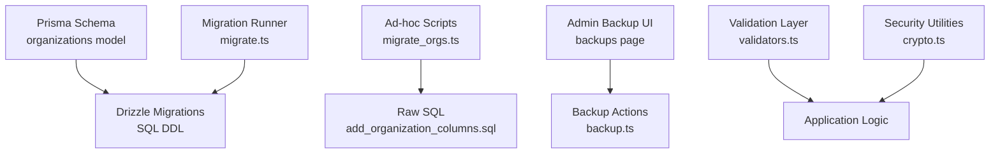
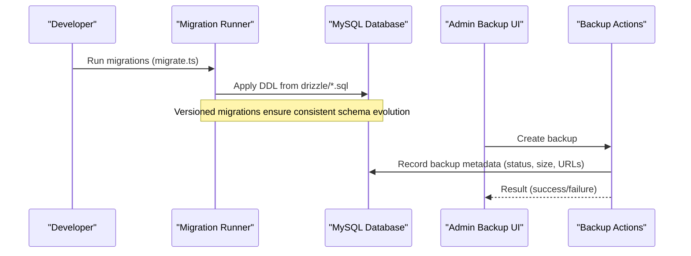
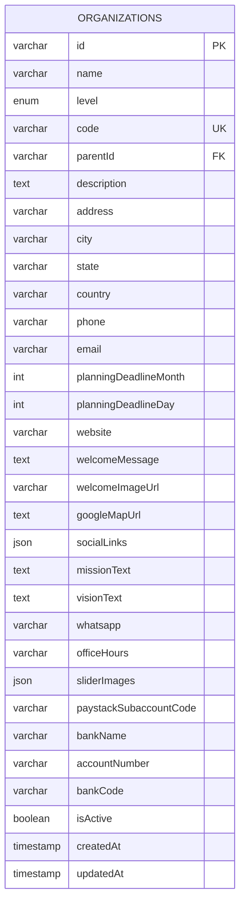
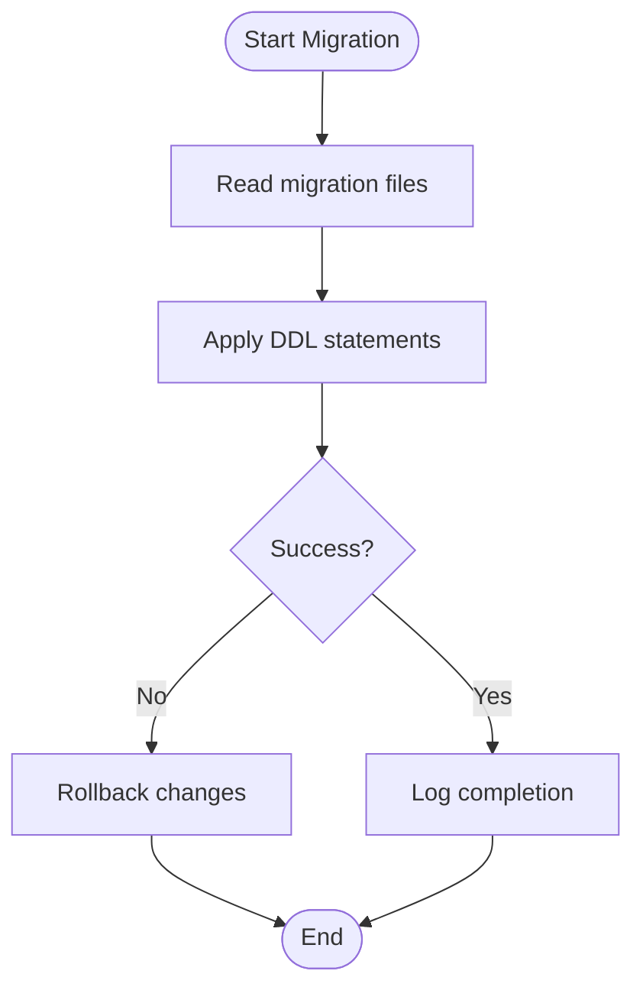
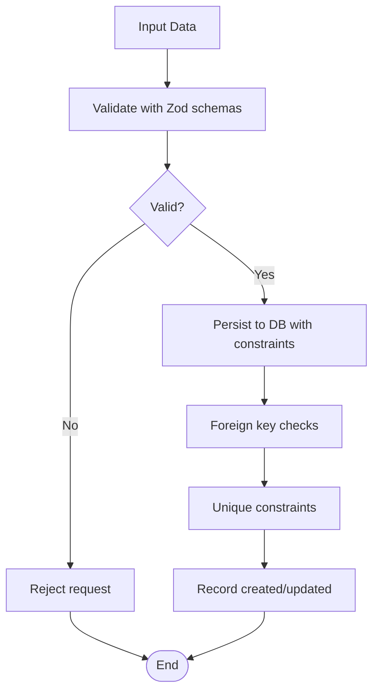
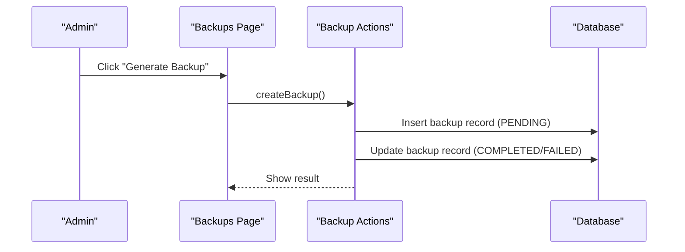
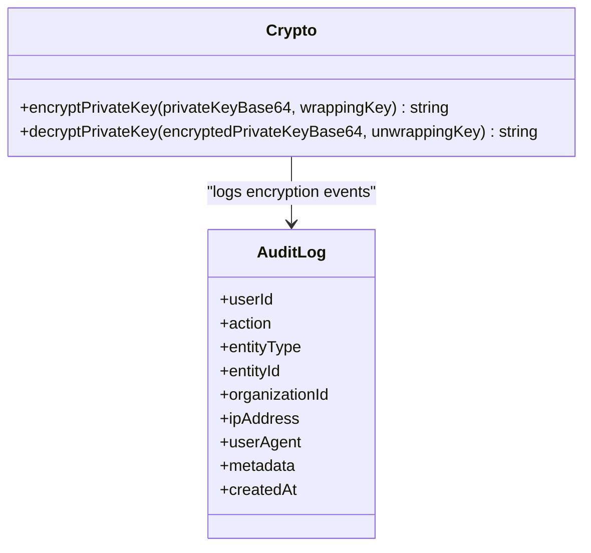
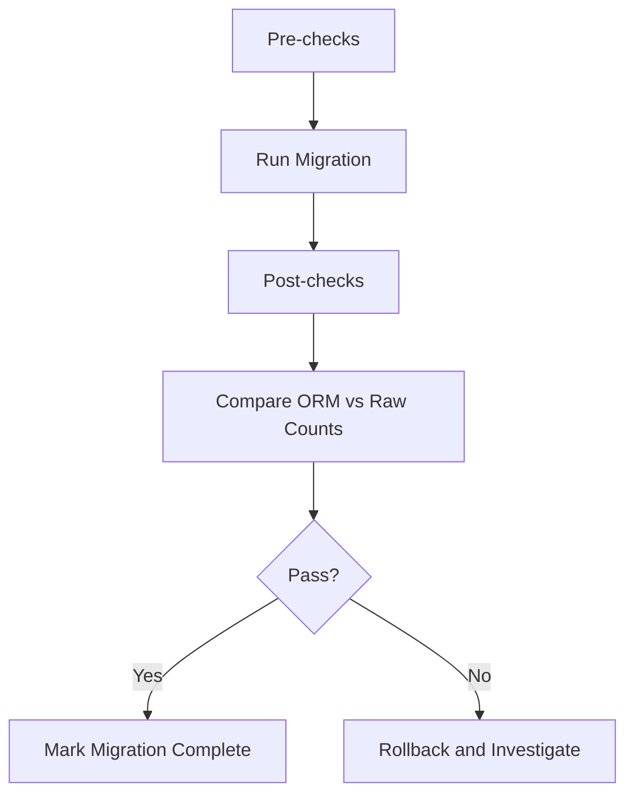
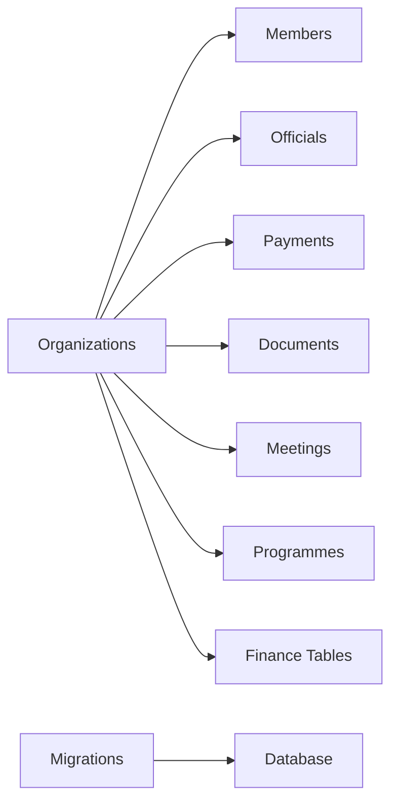

# Data Management & Migration

<cite>
**Referenced Files in This Document**
- [schema.prisma](file://prisma/schema.prisma)
- [drizzle.config.ts](file://drizzle.config.ts)
- [0000_giant_demogoblin.sql](file://drizzle/0000_giant_demogoblin.sql)
- [0001_bumpy_weapon_omega.sql](file://drizzle/0001_bumpy_weapon_omega.sql)
- [migrate.ts](file://migrate.ts)
- [migrate_orgs.ts](file://scripts/migrate_orgs.ts)
- [add_organization_columns.sql](file://scripts/add_organization_columns.sql)
- [backup.ts](file://lib/actions/backup.ts)
- [backups page](file://app/dashboard/admin/backups/page.tsx)
- [crypto.ts](file://lib/crypto.ts)
- [validators.ts](file://lib/validators.ts)
- [membership-id.ts](file://lib/actions/membership-id.ts)
- [debug-db-mismatch.ts](file://scripts/debug-db-mismatch.ts)
</cite>

## Table of Contents
1. [Introduction](#introduction)
2. [Project Structure](#project-structure)
3. [Core Components](#core-components)
4. [Architecture Overview](#architecture-overview)
5. [Detailed Component Analysis](#detailed-component-analysis)
6. [Dependency Analysis](#dependency-analysis)
7. [Performance Considerations](#performance-considerations)
8. [Troubleshooting Guide](#troubleshooting-guide)
9. [Conclusion](#conclusion)
10. [Appendices](#appendices)

## Introduction
This document explains data management and migration strategies for the organization management system with a focus on the organizations table, schema design, indexing, migrations, validation, integrity checks, backup and disaster recovery, performance considerations, privacy and security, testing, and troubleshooting. It is intended for developers and administrators who need to understand how organizational data is modeled, migrated, secured, and maintained at scale.

## Project Structure
The system uses both Prisma and Drizzle for database modeling and migrations:
- Prisma schema defines models and relationships (including Organization).
- Drizzle SQL migrations define concrete DDL statements executed against MySQL.
- Scripts provide ad-hoc migrations, data fixes, and utilities.
- Admin UI supports manual backups and monitoring.

**Diagram sources**
- [schema.prisma:125-197](file://prisma/schema.prisma#L125-L197)
- [0000_giant_demogoblin.sql:622-656](file://drizzle/0000_giant_demogoblin.sql#L622-L656)
- [migrate.ts:1-9](file://migrate.ts#L1-L9)
- [migrate_orgs.ts:21-49](file://scripts/migrate_orgs.ts#L21-L49)
- [add_organization_columns.sql:1-3](file://scripts/add_organization_columns.sql#L1-L3)
- [backups page:30-91](file://app/dashboard/admin/backups/page.tsx#L30-L91)
- [backup.ts:137-161](file://lib/actions/backup.ts#L137-L161)
- [validators.ts:1-19](file://lib/validators.ts#L1-L19)
- [crypto.ts:124-167](file://lib/crypto.ts#L124-L167)

**Section sources**
- [schema.prisma:125-197](file://prisma/schema.prisma#L125-L197)
- [0000_giant_demogoblin.sql:622-656](file://drizzle/0000_giant_demogoblin.sql#L622-L656)
- [migrate.ts:1-9](file://migrate.ts#L1-L9)
- [migrate_orgs.ts:21-49](file://scripts/migrate_orgs.ts#L21-L49)
- [add_organization_columns.sql:1-3](file://scripts/add_organization_columns.sql#L1-L3)
- [backups page:30-91](file://app/dashboard/admin/backups/page.tsx#L30-L91)
- [backup.ts:137-161](file://lib/actions/backup.ts#L137-L161)
- [validators.ts:1-19](file://lib/validators.ts#L1-L19)
- [crypto.ts:124-167](file://lib/crypto.ts#L124-L167)

## Core Components
- Organizations table and hierarchy:
  - Primary key: id (string, unique identifier).
  - Unique constraint: code (unique across all organizations).
  - Self-referential relationship via parentId to support hierarchical structures.
  - Index on parentId to optimize parent-child queries.
  - Additional fields include planning deadlines, CMS content, social links, payment subaccount info, and status flags.
- Related tables with foreign keys to organizations:
  - Members, Officials, Payments, Documents, Meetings, Programmes, Assets, Finance budgets/transactions, Fees, Offices, Reports, Competitions, etc.
- Audit logging and backups:
  - Audit logs track actions with entity context and timestamps.
  - Backups table records manual and automated backups with status and metadata.

**Section sources**
- [schema.prisma:125-197](file://prisma/schema.prisma#L125-L197)
- [0000_giant_demogoblin.sql:622-656](file://drizzle/0000_giant_demogoblin.sql#L622-L656)
- [0000_giant_demogoblin.sql:483-517](file://drizzle/0000_giant_demogoblin.sql#L483-L517)
- [0000_giant_demogoblin.sql:603-620](file://drizzle/0000_giant_demogoblin.sql#L603-L620)
- [0000_giant_demogoblin.sql:686-705](file://drizzle/0000_giant_demogoblin.sql#L686-L705)
- [0000_giant_demogoblin.sql:227-243](file://drizzle/0000_giant_demogoblin.sql#L227-L243)
- [0000_giant_demogoblin.sql:64-77](file://drizzle/0000_giant_demogoblin.sql#L64-L77)
- [0000_giant_demogoblin.sql:79-91](file://drizzle/0000_giant_demogoblin.sql#L79-L91)

## Architecture Overview
The data layer integrates multiple tools:
- Prisma defines high-level models and relations.
- Drizzle migrations generate and apply SQL DDL.
- Scripts execute targeted migrations or data fixes.
- Admin UI orchestrates backups and provides visibility into backup history.

**Diagram sources**
- [migrate.ts:1-9](file://migrate.ts#L1-L9)
- [0000_giant_demogoblin.sql:622-656](file://drizzle/0000_giant_demogoblin.sql#L622-L656)
- [backups page:30-91](file://app/dashboard/admin/backups/page.tsx#L30-L91)
- [backup.ts:137-161](file://lib/actions/backup.ts#L137-L161)

## Detailed Component Analysis

### Organizations Schema Design
- Primary Key: id (unique identifier).
- Unique Constraint: code ensures each organization has a distinct code.
- Foreign Keys:
  - parentId references organizations.id to build a tree structure.
  - Many-to-one relationships exist between organizations and related entities (e.g., members, officials, payments).
- Indexing Strategy:
  - Index on parentId accelerates hierarchical queries (parent -> children).
  - Unique index on code prevents duplicates and enables fast lookups by code.
- Data Types and Defaults:
  - Planning deadline month/day default values support scheduling workflows.
  - JSON fields store flexible metadata like socialLinks and sliderImages.

**Diagram sources**
- [schema.prisma:125-197](file://prisma/schema.prisma#L125-L197)
- [0000_giant_demogoblin.sql:622-656](file://drizzle/0000_giant_demogoblin.sql#L622-L656)

**Section sources**
- [schema.prisma:125-197](file://prisma/schema.prisma#L125-L197)
- [0000_giant_demogoblin.sql:622-656](file://drizzle/0000_giant_demogoblin.sql#L622-L656)

### Migration Scripts and Version Control
- Drizzle migrations are versioned under drizzle/*.sql and applied via migrate.ts.
- Ad-hoc scripts (e.g., migrate_orgs.ts) execute targeted SQL files (e.g., add_organization_columns.sql) for incremental changes.
- Rollback strategy:
  - Maintain reverse SQL statements alongside forward migrations.
  - Use transactional wrappers where supported to ensure atomicity.
  - Validate schema before applying migrations; rollback on failure.

**Diagram sources**
- [migrate.ts:1-9](file://migrate.ts#L1-L9)
- [migrate_orgs.ts:21-49](file://scripts/migrate_orgs.ts#L21-L49)
- [add_organization_columns.sql:1-3](file://scripts/add_organization_columns.sql#L1-L3)

**Section sources**
- [migrate.ts:1-9](file://migrate.ts#L1-L9)
- [migrate_orgs.ts:21-49](file://scripts/migrate_orgs.ts#L21-L49)
- [add_organization_columns.sql:1-3](file://scripts/add_organization_columns.sql#L1-L3)

### Data Validation Rules and Business Constraints
- Application-level validation:
  - Zod schemas enforce input constraints for requests (e.g., occasion types and request payloads).
- Database-level constraints:
  - Enums restrict allowed values (e.g., levels, statuses).
  - Unique constraints prevent duplicate codes and identifiers.
  - Foreign keys maintain referential integrity across related tables.
- Integrity checks:
  - Membership ID generation validates member existence and uniqueness.
  - Audit logs record actions for traceability.

**Diagram sources**
- [validators.ts:1-19](file://lib/validators.ts#L1-L19)
- [0000_giant_demogoblin.sql:622-656](file://drizzle/0000_giant_demogoblin.sql#L622-L656)
- [membership-id.ts:13-40](file://lib/actions/membership-id.ts#L13-L40)

**Section sources**
- [validators.ts:1-19](file://lib/validators.ts#L1-L19)
- [0000_giant_demogoblin.sql:622-656](file://drizzle/0000_giant_demogoblin.sql#L622-L656)
- [membership-id.ts:13-40](file://lib/actions/membership-id.ts#L13-L40)

### Data Export/Import Operations
- Export:
  - Use raw SQL execution through Drizzle to query and export datasets (e.g., organizations, members).
- Import:
  - Load CSV/JSON into staging tables, validate, then upsert into target tables using transactions.
- Best practices:
  - Batch operations to avoid memory pressure.
  - Log import progress and errors for auditability.

[No sources needed since this section provides general guidance]

### Backup Strategies and Disaster Recovery
- Manual backups:
  - Admin UI triggers backup creation; actions record metadata and status in the backups table.
- Automated backups:
  - Schedule periodic backups via cron jobs or workers; store artifacts securely.
- Disaster recovery:
  - Restore from latest verified backup; validate integrity post-restore.
  - Test restore procedures regularly to ensure RTO/RPO targets.

**Diagram sources**
- [backups page:30-91](file://app/dashboard/admin/backups/page.tsx#L30-L91)
- [backup.ts:137-161](file://lib/actions/backup.ts#L137-L161)

**Section sources**
- [backups page:30-91](file://app/dashboard/admin/backups/page.tsx#L30-L91)
- [backup.ts:137-161](file://lib/actions/backup.ts#L137-L161)

### Performance Considerations for Large Organizational Datasets
- Query optimization:
  - Leverage indexes on frequently filtered columns (e.g., parentId, code).
  - Use selective projections and pagination to reduce payload sizes.
- Caching strategies:
  - Cache read-heavy endpoints (e.g., organization trees) with short TTLs.
  - Invalidate caches on write operations to maintain consistency.
- Monitoring:
  - Track slow queries and adjust indexes accordingly.
  - Use connection pooling and batch operations to reduce overhead.

[No sources needed since this section provides general guidance]

### Data Privacy and Security Measures
- Encryption:
  - Private keys are wrapped/unwrapped using AES with random IVs stored alongside ciphertext.
- Access logging:
  - Audit logs capture user actions, entity context, IP addresses, and timestamps.
- Secure storage:
  - Sensitive fields (e.g., encrypted private keys) are stored as text with appropriate access controls.

**Diagram sources**
- [crypto.ts:124-167](file://lib/crypto.ts#L124-L167)
- [0000_giant_demogoblin.sql:64-77](file://drizzle/0000_giant_demogoblin.sql#L64-L77)

**Section sources**
- [crypto.ts:124-167](file://lib/crypto.ts#L124-L167)
- [0000_giant_demogoblin.sql:64-77](file://drizzle/0000_giant_demogoblin.sql#L64-L77)

### Testing Data Migrations and Validating Integrity
- Pre-migration checks:
  - Verify schema compatibility and dependencies.
  - Run dry-run validations where possible.
- Post-migration validation:
  - Compare ORM counts vs raw SQL counts to detect discrepancies.
  - Assert expected row counts and constraints after migration.
- Monitoring success rates:
  - Log migration steps and outcomes; alert on failures.

**Diagram sources**
- [debug-db-mismatch.ts:5-22](file://scripts/debug-db-mismatch.ts#L5-L22)
- [migrate.ts:1-9](file://migrate.ts#L1-L9)

**Section sources**
- [debug-db-mismatch.ts:5-22](file://scripts/debug-db-mismatch.ts#L5-L22)
- [migrate.ts:1-9](file://migrate.ts#L1-L9)

## Dependency Analysis
- The organizations table depends on:
  - Hierarchical relationships via parentId.
  - Referential integrity with members, officials, payments, documents, meetings, programmes, assets, finance tables, fees, offices, reports, competitions.
- Migrations depend on:
  - Drizzle configuration pointing to schema and output directory.
  - Migration runner executing SQL files in order.

**Diagram sources**
- [schema.prisma:125-197](file://prisma/schema.prisma#L125-L197)
- [drizzle.config.ts:6-13](file://drizzle.config.ts#L6-L13)
- [migrate.ts:1-9](file://migrate.ts#L1-L9)

**Section sources**
- [schema.prisma:125-197](file://prisma/schema.prisma#L125-L197)
- [drizzle.config.ts:6-13](file://drizzle.config.ts#L6-L13)
- [migrate.ts:1-9](file://migrate.ts#L1-L9)

## Performance Considerations
- Index usage:
  - Ensure queries filter on indexed columns (parentId, code).
  - Avoid full table scans by adding composite indexes for common query patterns.
- Query tuning:
  - Use EXPLAIN to analyze query plans.
  - Limit result sets and use pagination.
- Caching:
  - Implement application-level caching for static or infrequently changing data (e.g., organization trees).
  - Use cache invalidation strategies tied to write operations.

[No sources needed since this section provides general guidance]

## Troubleshooting Guide
- Common issues:
  - Migration failures due to existing constraints or missing columns.
  - Data inconsistencies between ORM and raw SQL results.
- Resolution steps:
  - Review error logs and revert problematic migrations if necessary.
  - Use diagnostic scripts to compare counts and identify mismatches.
  - Validate schema alignment between Prisma and Drizzle definitions.

**Section sources**
- [migrate_orgs.ts:21-49](file://scripts/migrate_orgs.ts#L21-L49)
- [debug-db-mismatch.ts:5-22](file://scripts/debug-db-mismatch.ts#L5-L22)

## Conclusion
The organization management system employs a robust data architecture combining Prisma and Drizzle for schema definition and migrations. The organizations table supports hierarchical structures with clear primary keys, unique constraints, and strategic indexing. Migrations are versioned and executable via standardized runners, while ad-hoc scripts enable targeted updates. Validation and integrity checks are enforced at both application and database layers. Backup and disaster recovery mechanisms are integrated into the admin interface, and security measures include encryption and comprehensive audit logging. Performance optimizations focus on indexing, query tuning, and caching. Regular testing and monitoring ensure reliable data operations and long-term health.

## Appendices
- Example migration workflow:
  - Add column to organizations via SQL script and execute using migration runner.
  - Validate changes with diagnostic scripts and update documentation accordingly.

[No sources needed since this section provides general guidance]