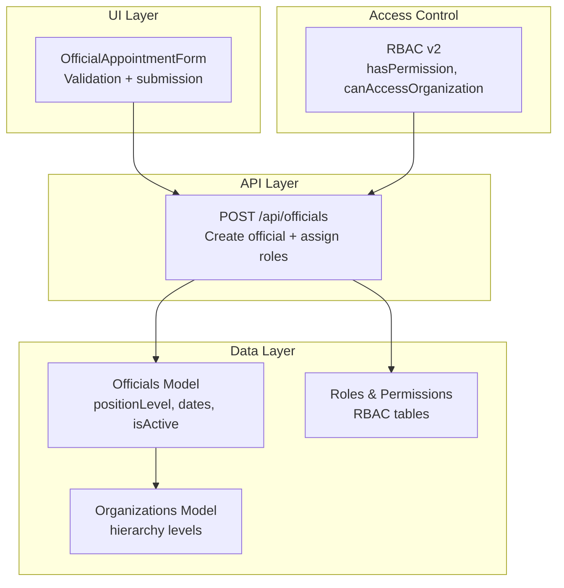
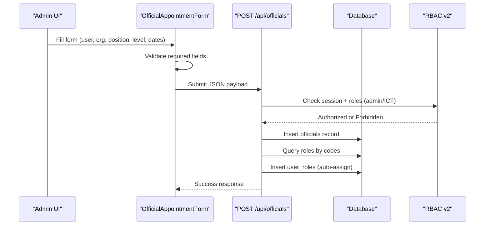
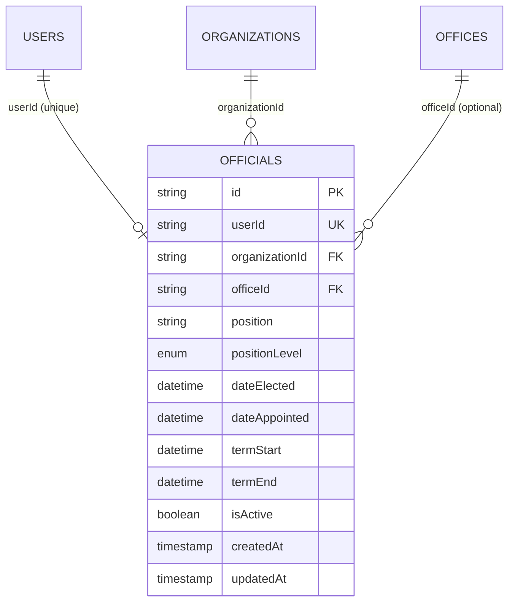
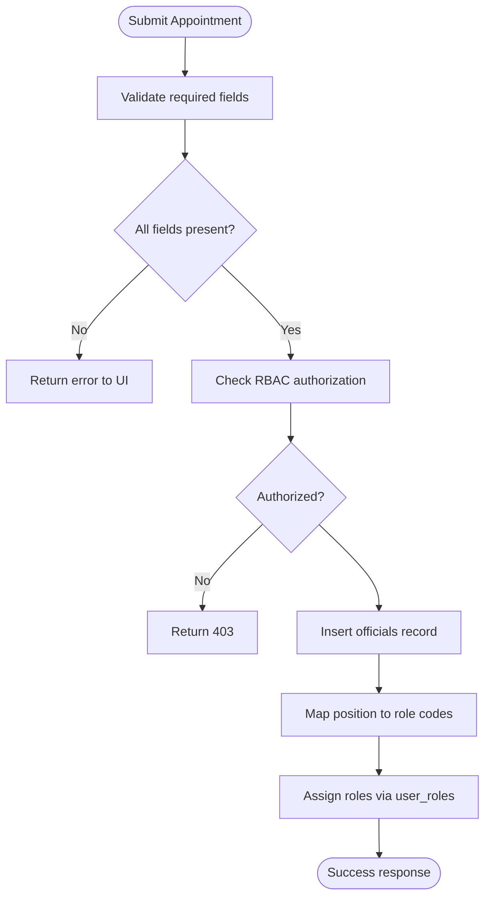
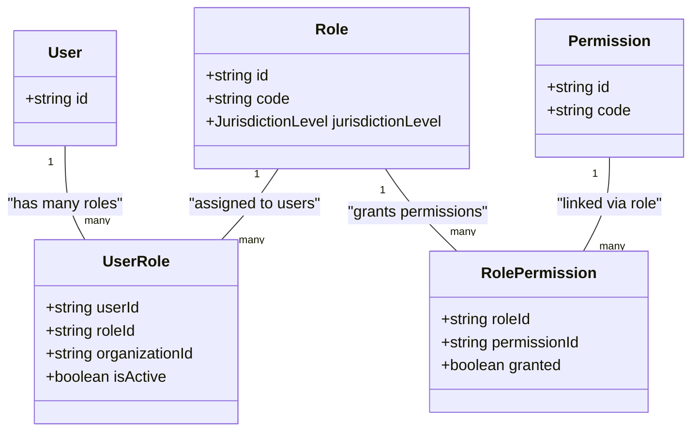
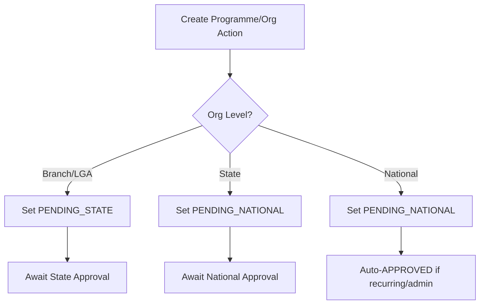
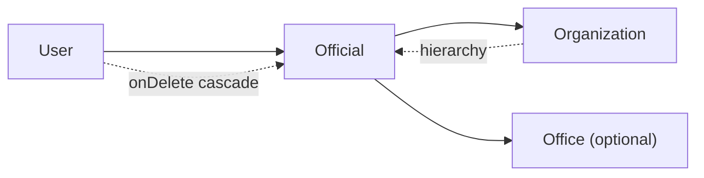
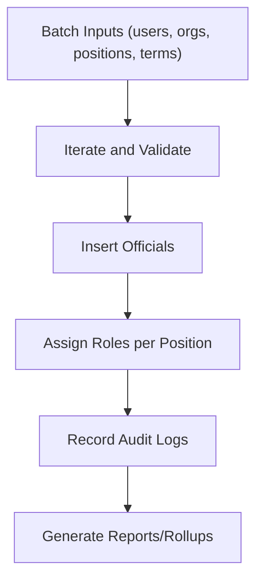
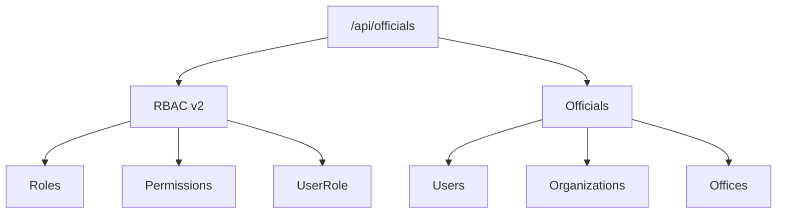

# Official Appointment System

<cite>
**Referenced Files in This Document**
- [schema.prisma](file://prisma/schema.prisma)
- [schema.ts](file://lib/db/schema.ts)
- [route.ts](file://app/api/officials/route.ts)
- [official-appointment-form.tsx](file://components/admin/officials/official-appointment-form.tsx)
- [rbac-v2.ts](file://lib/rbac-v2.ts)
- [RBAC_SYSTEM.md](file://RBAC_SYSTEM.md)
- [programme-workflow.ts](file://lib/actions/programmes.ts)
- [constitution-manager.tsx](file://app/dashboard/admin/constitution/constitution-manager.tsx)
- [constitution-actions.ts](file://lib/actions/constitution.ts)
- [org-helper.ts](file://lib/org-helper.ts)
- [reports.ts](file://lib/actions/reports.ts)
- [programme-reports-aggregate.ts](file://lib/actions/programme-reports-aggregate.ts)
</cite>

## Table of Contents
1. Introduction
2. Project Structure
3. Core Components
4. Architecture Overview
5. Detailed Component Analysis
6. Dependency Analysis
7. Performance Considerations
8. Troubleshooting Guide
9. Conclusion
10. Appendices

## Introduction
This document explains the official appointment system that manages user roles within organizational hierarchies. It covers the officials table structure, positionLevel enum, appointment dates, and status tracking. It also documents the end-to-end workflow from appointment creation to activation, form validation, approval processes, role-based access control (RBAC), inheritance of permissions by organizational level, and relationships with organizations including cascade operations and data integrity constraints. Finally, it provides guidance for common scenarios such as reassignment, suspension, historical tracking, bulk operations, and reporting.

## Project Structure
The official appointment system spans database schema definitions, API endpoints, admin UI forms, RBAC utilities, and related workflows:
- Database models define Officials, Organizations, Roles, Permissions, and their relationships.
- An API endpoint creates officials and auto-assigns roles based on position.
- The admin form validates inputs and orchestrates the creation flow.
- RBAC utilities enforce permission checks and jurisdictional access.
- Related workflows demonstrate approval patterns and hierarchical processing.

**Diagram sources**
- [schema.prisma:283-313](file://prisma/schema.prisma#L283-L313)
- [schema.ts:274-290](file://lib/db/schema.ts#L274-L290)
- [route.ts:7-121](file://app/api/officials/route.ts#L7-L121)
- [official-appointment-form.tsx:120-168](file://components/admin/officials/official-appointment-form.tsx#L120-L168)
- [rbac-v2.ts:47-165](file://lib/rbac-v2.ts#L47-L165)

**Section sources**
- [schema.prisma:125-313](file://prisma/schema.prisma#L125-L313)
- [schema.ts:274-350](file://lib/db/schema.ts#L274-L350)
- [route.ts:7-121](file://app/api/officials/route.ts#L7-L121)
- [official-appointment-form.tsx:22-168](file://components/admin/officials/official-appointment-form.tsx#L22-L168)
- [rbac-v2.ts:47-165](file://lib/rbac-v2.ts#L47-L165)

## Core Components
- Officials model and table: Stores appointment records with position, positionLevel, term dates, and active status.
- Organizations model and hierarchy: Defines levels (NATIONAL, STATE, LOCAL_GOVERNMENT, BRANCH) and parent-child relationships.
- RBAC models: Roles, Permissions, and UserRole assignments enable granular access control scoped by organization.
- API endpoint: Creates an official and auto-assigns roles based on position mapping.
- Admin form: Validates required fields and submits the appointment request.

Key behaviors:
- Each user can hold one official profile at a time due to unique constraint on userId in the officials table.
- PositionLevel enum constrains valid levels for appointments.
- Role assignment is automatic based on position keywords; multiple roles can be assigned per user via UserRole junction.

**Section sources**
- [schema.prisma:283-313](file://prisma/schema.prisma#L283-L313)
- [schema.ts:274-290](file://lib/db/schema.ts#L274-L290)
- [route.ts:25-106](file://app/api/officials/route.ts#L25-L106)
- [official-appointment-form.tsx:120-168](file://components/admin/officials/official-appointment-form.tsx#L120-L168)

## Architecture Overview
The system enforces structured appointment creation with validation, authorization, and RBAC integration.

**Diagram sources**
- [official-appointment-form.tsx:120-168](file://components/admin/officials/official-appointment-form.tsx#L120-L168)
- [route.ts:7-121](file://app/api/officials/route.ts#L7-L121)
- [rbac-v2.ts:313-358](file://lib/rbac-v2.ts#L313-L358)

## Detailed Component Analysis

### Officials Data Model and Constraints
- Fields include id, userId (unique), organizationId, officeId, position, positionLevel (enum), dateElected, dateAppointed, termStart (required), termEnd (optional), image, bio, isActive, timestamps.
- Relationships:
  - Users: onDelete cascade ensures cleanup when users are removed.
  - Organizations: Foreign key reference maintains hierarchy linkage.
  - Offices: Optional department linkage for reporting and permissions.
- Integrity:
  - Unique userId prevents multiple official profiles per user.
  - Required termStart ensures every appointment has a start date.
  - Enum positionLevel restricts values to NATIONAL, STATE, LOCAL_GOVERNMENT, BRANCH.

**Diagram sources**
- [schema.prisma:283-313](file://prisma/schema.prisma#L283-L313)
- [schema.ts:274-290](file://lib/db/schema.ts#L274-L290)

**Section sources**
- [schema.prisma:283-313](file://prisma/schema.prisma#L283-L313)
- [schema.ts:274-290](file://lib/db/schema.ts#L274-L290)

### Appointment Creation Workflow and Validation
- Admin UI collects:
  - Selected user via search.
  - Position level and specific organization (state/LGA/branch).
  - Office (department).
  - Position title.
  - Term start/end dates.
  - Optional portrait and biography.
- Client-side validation ensures required fields before submission.
- Server-side validation checks missing fields and uniqueness constraints.
- On success, roles are auto-assigned based on position keywords.

**Diagram sources**
- [official-appointment-form.tsx:120-168](file://components/admin/officials/official-appointment-form.tsx#L120-L168)
- [route.ts:25-106](file://app/api/officials/route.ts#L25-L106)

**Section sources**
- [official-appointment-form.tsx:22-168](file://components/admin/officials/official-appointment-form.tsx#L22-L168)
- [route.ts:7-121](file://app/api/officials/route.ts#L7-L121)

### RBAC Integration and Permission Inheritance
- RBAC supports:
  - Multiple roles per user via UserRole junction.
  - Jurisdiction-scoped roles (SYSTEM, NATIONAL, STATE, LOCAL_GOVERNMENT, BRANCH).
  - Dynamic permissions attached to roles.
- SuperAdmin (SYSTEM) bypasses all restrictions.
- Organization access checks traverse hierarchy to determine if a user’s role permits access to target organizations.
- Official appointments integrate with RBAC by auto-assigning roles based on position, enabling immediate access according to role permissions.

**Diagram sources**
- [schema.prisma:316-396](file://prisma/schema.prisma#L316-L396)
- [schema.ts:305-350](file://lib/db/schema.ts#L305-L350)
- [rbac-v2.ts:47-165](file://lib/rbac-v2.ts#L47-L165)

**Section sources**
- [rbac-v2.ts:47-165](file://lib/rbac-v2.ts#L47-L165)
- [RBAC_SYSTEM.md:1-301](file://RBAC_SYSTEM.md#L1-L301)

### Approval Processes and Status Transitions
While official appointments themselves do not have a multi-stage approval workflow in the current API, the system demonstrates hierarchical approval patterns in other modules:
- Programmes: Initial status depends on organization level (Branch/LGA -> PENDING_STATE; State/National -> PENDING_NATIONAL; some cases APPROVED).
- Constitution review: Sequential stages across Branch > LGA > State > National, with workshops and final approval.

These patterns inform how official-related actions could be extended to include approvals if needed.

**Diagram sources**
- [programme-workflow.ts:425-454](file://lib/actions/programmes.ts#L425-L454)
- [constitution-manager.tsx:267-279](file://app/dashboard/admin/constitution/constitution-manager.tsx#L267-L279)
- [constitution-actions.ts:97-121](file://lib/actions/constitution.ts#L97-L121)

**Section sources**
- [programme-workflow.ts:425-454](file://lib/actions/programmes.ts#L425-L454)
- [constitution-manager.tsx:267-279](file://app/dashboard/admin/constitution/constitution-manager.tsx#L267-L279)
- [constitution-actions.ts:97-121](file://lib/actions/constitution.ts#L97-L121)

### Relationship Between Officials and Organizations
- Officials link to organizations via organizationId, aligning appointments with the correct hierarchical level.
- Cascade behavior:
  - Deleting a user cascades to officials (onDelete cascade).
  - Organization deletions may cascade to related entities depending on schema configuration.
- Data integrity:
  - Unique userId ensures single official profile per user.
  - Required termStart enforces valid appointment periods.
  - Enum positionLevel constrains valid levels.

**Diagram sources**
- [schema.prisma:283-313](file://prisma/schema.prisma#L283-L313)
- [schema.ts:274-290](file://lib/db/schema.ts#L274-L290)

**Section sources**
- [schema.prisma:283-313](file://prisma/schema.prisma#L283-L313)
- [schema.ts:274-290](file://lib/db/schema.ts#L274-L290)

### Common Scenarios
- Reassignment:
  - Since each user can only have one official profile, reassignment involves updating the existing record (e.g., changing organizationId, position, term dates) rather than creating a new one.
- Suspension:
  - Set isActive to false to suspend an official without deleting history.
- Historical Tracking:
  - Maintain termStart and termEnd to track appointment periods.
  - Use audit logs to record changes to officials and roles.

[No sources needed since this section summarizes operational practices]

### Bulk Operations and Reporting Capabilities
- Bulk operations:
  - While no dedicated bulk official creation endpoint exists, administrators can create multiple appointments via repeated calls or by building a server-side batch process that loops over inputs and inserts officials plus roles.
- Reporting:
  - Reports module aggregates data across offices and organizations, which can be adapted to include official metrics (counts by level, active statuses).
  - Rollup functions compute summaries by period and office, useful for dashboards and audits.

**Diagram sources**
- [reports.ts:207-397](file://lib/actions/reports.ts#L207-L397)
- [programme-reports-aggregate.ts:1-61](file://lib/actions/programme-reports-aggregate.ts#L1-L61)

**Section sources**
- [reports.ts:207-397](file://lib/actions/reports.ts#L207-L397)
- [programme-reports-aggregate.ts:1-61](file://lib/actions/programme-reports-aggregate.ts#L1-L61)

## Dependency Analysis
- Officials depend on:
  - Users (unique relationship).
  - Organizations (hierarchical linkage).
  - Offices (optional department linkage).
- RBAC depends on:
  - Roles and Permissions.
  - UserRole assignments scoped by organization.
- API depends on:
  - Session and RBAC checks.
  - Database schema for insertion and role assignment.

**Diagram sources**
- [schema.prisma:283-396](file://prisma/schema.prisma#L283-L396)
- [route.ts:7-121](file://app/api/officials/route.ts#L7-L121)
- [rbac-v2.ts:47-165](file://lib/rbac-v2.ts#L47-L165)

**Section sources**
- [schema.prisma:283-396](file://prisma/schema.prisma#L283-L396)
- [route.ts:7-121](file://app/api/officials/route.ts#L7-L121)
- [rbac-v2.ts:47-165](file://lib/rbac-v2.ts#L47-L165)

## Performance Considerations
- Indexing:
  - Ensure indexes on frequently queried fields like organizationId, userId, and positionLevel for efficient lookups.
- Queries:
  - Avoid N+1 queries when fetching officials with roles and organizations; use joins or preloading where possible.
- Validation:
  - Client-side validation reduces unnecessary server requests.
- RBAC:
  - Cache user permissions in session to minimize repeated database checks.

[No sources needed since this section provides general guidance]

## Troubleshooting Guide
Common issues and resolutions:
- Missing required fields:
  - Ensure userId, organizationId, position, positionLevel, and termStart are provided.
- Unauthorized access:
  - Verify session and roles; only admins or ICT officers can create officials.
- Duplicate official:
  - Each user can only hold one official profile; update existing record instead of creating a new one.
- Role assignment failures:
  - Confirm role codes exist and are active; check role mappings for position keywords.

**Section sources**
- [route.ts:25-121](file://app/api/officials/route.ts#L25-L121)
- [official-appointment-form.tsx:120-168](file://components/admin/officials/official-appointment-form.tsx#L120-L168)

## Conclusion
The official appointment system provides a robust foundation for managing organizational roles through structured data models, validated workflows, and integrated RBAC. Officials are tied to organizations and levels, with automatic role assignment enabling immediate access control. While the current implementation focuses on creation and activation, the system’s design supports extensions for approvals, historical tracking, and reporting. Administrators can manage appointments efficiently while maintaining data integrity and security.

[No sources needed since this section summarizes without analyzing specific files]

## Appendices

### Example Workflows
- Creating an appointment:
  - Select a user, choose position level and organization, set term dates, and submit.
- Managing multiple roles per user:
  - Auto-assignment assigns roles based on position; additional roles can be added via RBAC APIs.
- Handling transitions:
  - Update termEnd to close a term; set isActive to false to suspend; update organizationId or position for reassignment.

[No sources needed since this section provides conceptual examples]