# Organization Management

<cite>
**Referenced Files in This Document**
- [schema.ts](file://lib/db/schema.ts)
- [org-helper.ts](file://lib/org-helper.ts)
- [organization-tree.tsx](file://components/admin/organizations/organization-tree.tsx)
- [organization-form.tsx](file://components/admin/organizations/organization-form.tsx)
- [route.ts (tree)](file://app/api/organizations/tree/route.ts)
- [actions.ts (jurisdictions)](file://app/dashboard/admin/jurisdictions/actions.ts)
- [organization-actions.ts](file://lib/actions/organization.ts)
- [official-appointment-form.tsx](file://components/admin/officials/official-appointment-form.tsx)
- [rbac-v2.ts](file://lib/rbac-v2.ts)
- [RBAC_SYSTEM.md](file://RBAC_SYSTEM.md)
- [migrate_orgs.ts](file://scripts/migrate_orgs.ts)
- [add_organization_columns.sql](file://scripts/add_organization_columns.sql)
</cite>

## Table of Contents
1. Introduction
2. Project Structure
3. Core Components
4. Architecture Overview
5. Detailed Component Analysis
6. Dependency Analysis
7. Performance Considerations
8. Troubleshooting Guide
9. Conclusion

## Introduction
This document explains the TMC Portal organization management system with a focus on the hierarchical multi-tiered structure supporting National, State, Local Government, and Branch organizations. It covers the data model, parent-child relationships, jurisdiction definitions, administrative boundaries, CRUD operations, official appointment workflows, planning settings, permissions, tree visualization, validation rules, integrity constraints, migration strategies, and bulk operation considerations.

## Project Structure
The organization system spans server actions, API routes, UI components, and database schema:
- Data model and enums are defined in the Drizzle schema.
- Tree building and ancestry utilities live in a helper module.
- Server-side CRUD and planning settings updates are implemented as Next.js server actions.
- A REST endpoint exposes the organization tree to clients.
- Admin UI components provide forms, tree navigation, and deletion controls.
- RBAC enforces jurisdiction-scoped access for roles and permissions.

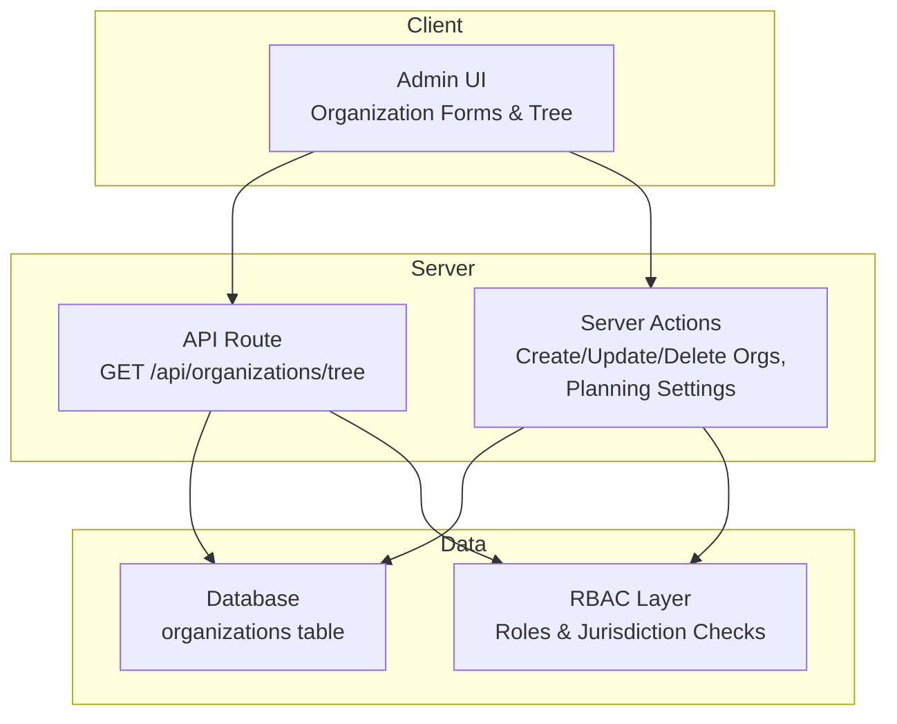

**Diagram sources**
- [route.ts (tree):1-19](file://app/api/organizations/tree/route.ts#L1-L19)
- [organization-actions.ts:11-52](file://lib/actions/organization.ts#L11-L52)
- [schema.ts:148-188](file://lib/db/schema.ts#L148-L188)
- [rbac-v2.ts:141-176](file://lib/rbac-v2.ts#L141-L176)

**Section sources**
- [schema.ts:148-188](file://lib/db/schema.ts#L148-L188)
- [org-helper.ts:38-98](file://lib/org-helper.ts#L38-L98)
- [route.ts (tree):1-19](file://app/api/organizations/tree/route.ts#L1-L19)
- [organization-actions.ts:11-144](file://lib/actions/organization.ts#L11-L144)

## Core Components
- Organization model and hierarchy:
  - The organizations table stores id, name, level, code, parentId, and administrative fields including planning deadlines and CMS metadata.
  - Levels include NATIONAL, STATE, LOCAL_GOVERNMENT, BRANCH.
  - Parent-child links are via parentId enabling a tree from National down to Branch.
- Tree builder:
  - Aggregates all organizations into a nested tree by level and parentId.
  - Provides ancestry traversal for any organization.
- CRUD server actions:
  - Create, update, delete organizations with validation and integrity checks.
  - Update planning deadline month/day per organization.
- Official appointments:
  - Link users to positions within an organization and office, with term dates and optional bio/image.
- RBAC integration:
  - Roles scoped by jurisdiction level; Super Admin has system-wide access.
  - Permission checks enforce organization-level access when needed.

**Section sources**
- [schema.ts:148-188](file://lib/db/schema.ts#L148-L188)
- [org-helper.ts:38-118](file://lib/org-helper.ts#L38-L118)
- [organization-actions.ts:11-144](file://lib/actions/organization.ts#L11-L144)
- [official-appointment-form.tsx:22-168](file://components/admin/officials/official-appointment-form.tsx#L22-L168)
- [rbac-v2.ts:141-176](file://lib/rbac-v2.ts#L141-L176)
- [RBAC_SYSTEM.md:49-92](file://RBAC_SYSTEM.md#L49-L92)

## Architecture Overview
End-to-end flows for organization management:

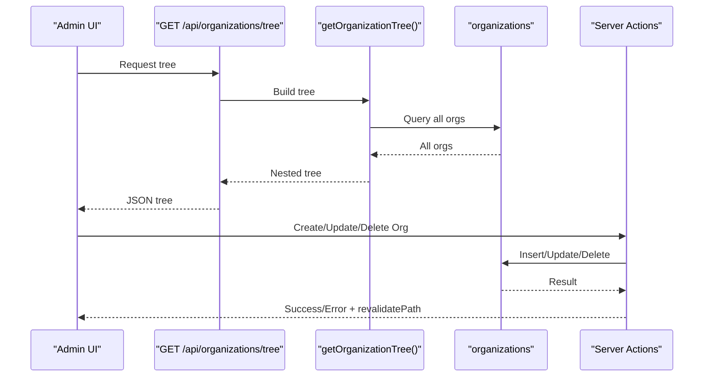

**Diagram sources**
- [route.ts (tree):1-19](file://app/api/organizations/tree/route.ts#L1-L19)
- [org-helper.ts:38-98](file://lib/org-helper.ts#L38-L98)
- [organization-actions.ts:11-144](file://lib/actions/organization.ts#L11-L144)

## Detailed Component Analysis

### Organization Model and Hierarchy
- Fields:
  - Identifier and identity: id, name, code (unique), level (enum).
  - Hierarchy: parentId linking to another organization.
  - Administrative: address, city, state, country, phone, email, website.
  - Planning: planningDeadlineMonth, planningDeadlineDay.
  - CMS: welcomeMessage, welcomeImageUrl, googleMapUrl, socialLinks, missionText, visionText, whatsapp, officeHours, sliderImages.
  - Financial: paystackSubaccountCode, bankName, accountNumber, bankCode.
  - Lifecycle: isActive, createdAt, updatedAt.
- Constraints:
  - code is unique at the database level.
  - parentId enables self-referencing hierarchy.
  - Defaults ensure consistent timestamps and active status.

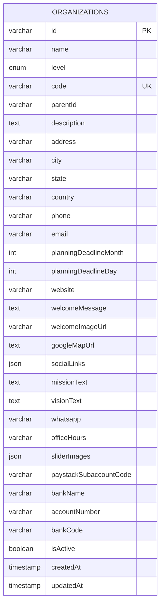

**Diagram sources**
- [schema.ts:148-188](file://lib/db/schema.ts#L148-L188)

**Section sources**
- [schema.ts:148-188](file://lib/db/schema.ts#L148-L188)

### Tree Building and Ancestry
- getOrganizationTree:
  - Fetches all organizations and groups them by level.
  - Builds a nested structure: National -> States -> LGAs -> Branches using parentId relationships.
- getOrganizationAncestry:
  - Traverses upward from a given orgId to build the path to root.

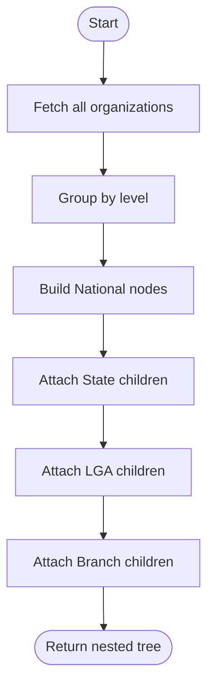

**Diagram sources**
- [org-helper.ts:38-98](file://lib/org-helper.ts#L38-L98)

**Section sources**
- [org-helper.ts:38-118](file://lib/org-helper.ts#L38-L118)

### CRUD Operations for Organizations
- Create:
  - Validates required fields (name, level, code).
  - Inserts new organization with defaults and timestamps.
  - Handles duplicate code errors.
- Update:
  - Validates inputs and updates fields including slider images.
  - Revalidates admin pages after changes.
- Delete:
  - Prevents deletion if child organizations exist.
  - Deletes organization otherwise.
- Planning Settings:
  - Updates month/day deadline per organization.

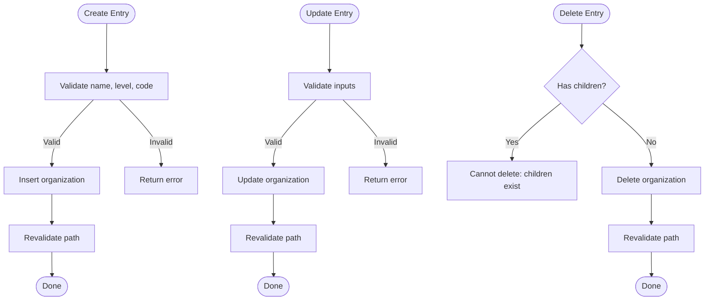

**Diagram sources**
- [organization-actions.ts:11-144](file://lib/actions/organization.ts#L11-L144)

**Section sources**
- [organization-actions.ts:11-144](file://lib/actions/organization.ts#L11-L144)

### Official Appointment System
- Purpose:
  - Links a user to a position within an organization and optionally an office (department).
  - Captures term start/end dates and optional profile image/bio.
- Workflow:
  - User searches members and selects one.
  - Chooses position level (NATIONAL/STATE/LOCAL_GOVERNMENT/BRANCH).
  - Selects specific organization based on level and hierarchy.
  - Optionally selects an office under that organization.
  - Submits to create an official record.

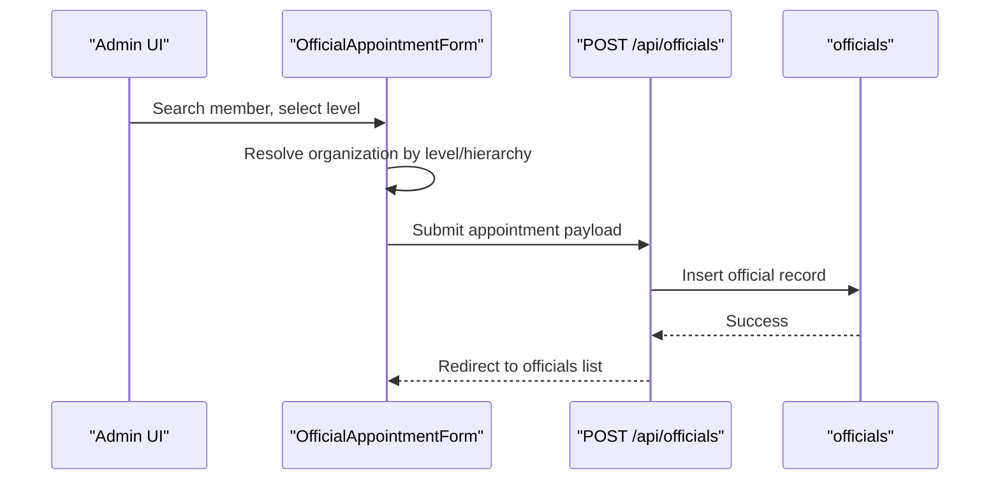

**Diagram sources**
- [official-appointment-form.tsx:22-168](file://components/admin/officials/official-appointment-form.tsx#L22-L168)

**Section sources**
- [official-appointment-form.tsx:22-168](file://components/admin/officials/official-appointment-form.tsx#L22-L168)

### Organization Settings and Planning Configurations
- Planning Deadline:
  - Per organization, configure month and day for program planning submission deadlines.
  - Updated via server action and reflected in the organization detail page.
- Migration:
  - Adds planningDeadlineMonth and planningDeadlineDay columns via SQL migration script executed by a Node script.

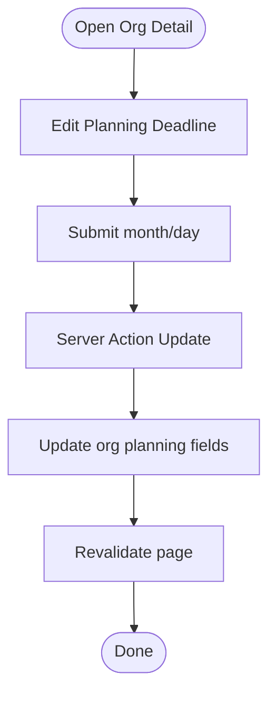

**Diagram sources**
- [organization-actions.ts:119-134](file://lib/actions/organization.ts#L119-L134)
- [add_organization_columns.sql:1-2](file://scripts/add_organization_columns.sql#L1-L2)
- [migrate_orgs.ts:21-50](file://scripts/migrate_orgs.ts#L21-L50)

**Section sources**
- [organization-actions.ts:119-134](file://lib/actions/organization.ts#L119-L134)
- [add_organization_columns.sql:1-2](file://scripts/add_organization_columns.sql#L1-L2)
- [migrate_orgs.ts:21-50](file://scripts/migrate_orgs.ts#L21-L50)

### Permissions and Jurisdiction-Aware Functionality
- Roles and jurisdictions:
  - Roles are scoped to levels: SYSTEM, NATIONAL, STATE, LOCAL_GOVERNMENT, BRANCH.
  - Super Admin bypasses jurisdiction limits.
- Permission checks:
  - Functions verify user permissions and can scope access to specific organizations.
- Usage:
  - Enforce read/write access on organization-related endpoints and admin features.

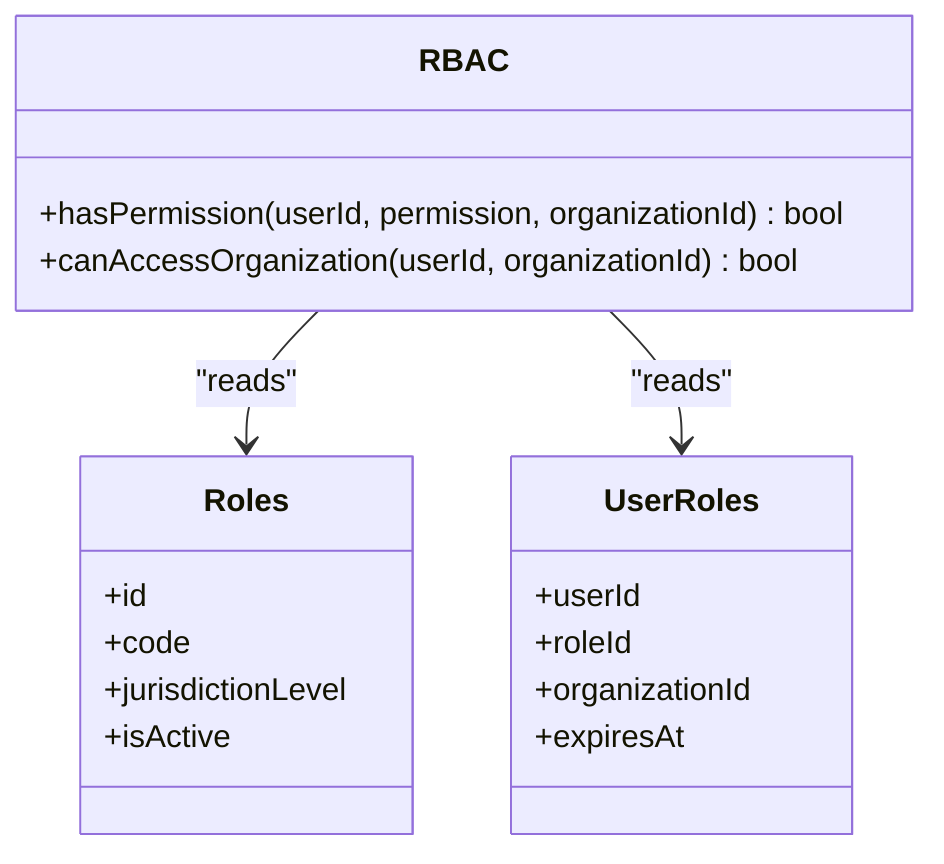

**Diagram sources**
- [rbac-v2.ts:141-176](file://lib/rbac-v2.ts#L141-L176)
- [RBAC_SYSTEM.md:49-92](file://RBAC_SYSTEM.md#L49-L92)

**Section sources**
- [rbac-v2.ts:141-176](file://lib/rbac-v2.ts#L141-L176)
- [RBAC_SYSTEM.md:49-92](file://RBAC_SYSTEM.md#L49-L92)

### Organization Tree Visualization and Navigation
- Client component renders a collapsible tree with nodes for each level.
- Supports editing and deleting nodes, with confirmation dialogs.
- Uses the tree API to load data and local actions to mutate.

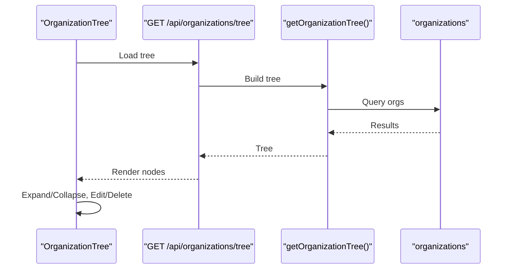

**Diagram sources**
- [route.ts (tree):1-19](file://app/api/organizations/tree/route.ts#L1-L19)
- [org-helper.ts:38-98](file://lib/org-helper.ts#L38-L98)
- [organization-tree.tsx:1-40](file://components/admin/organizations/organization-tree.tsx#L1-L40)

**Section sources**
- [organization-tree.tsx:1-40](file://components/admin/organizations/organization-tree.tsx#L1-L40)
- [route.ts (tree):1-19](file://app/api/organizations/tree/route.ts#L1-L19)
- [org-helper.ts:38-98](file://lib/org-helper.ts#L38-L98)

### Jurisdiction Management and Creation Workflows
- Jurisdiction creation:
  - Server action validates and creates jurisdiction entries with level and optional parent.
  - Retrieves jurisdictions filtered by level with parent info.
- Integration:
  - Used to manage states and LGAs consistently with organization hierarchy.

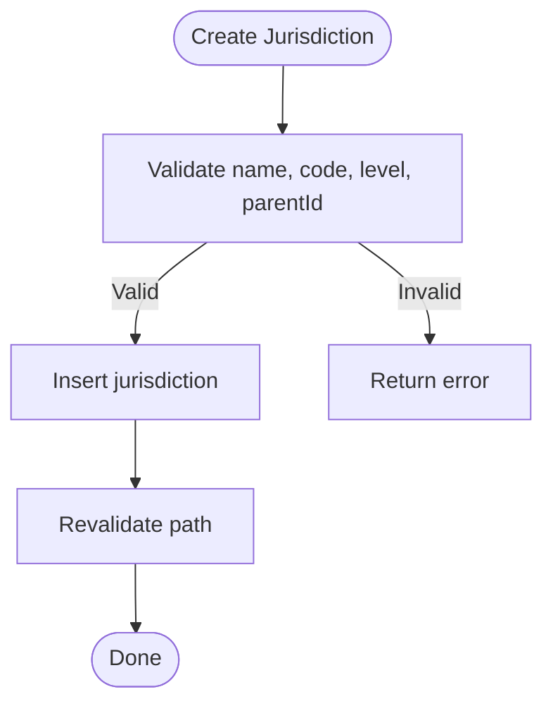

**Diagram sources**
- [actions.ts (jurisdictions):13-38](file://app/dashboard/admin/jurisdictions/actions.ts#L13-L38)

**Section sources**
- [actions.ts (jurisdictions):13-38](file://app/dashboard/admin/jurisdictions/actions.ts#L13-L38)

## Dependency Analysis
Key dependencies and coupling:
- UI depends on API route for tree and server actions for mutations.
- Tree builder depends on organizations table and uses level and parentId.
- RBAC layer integrates with roles and user_roles to enforce jurisdiction-based access.
- Planning settings depend on migrations adding new columns.

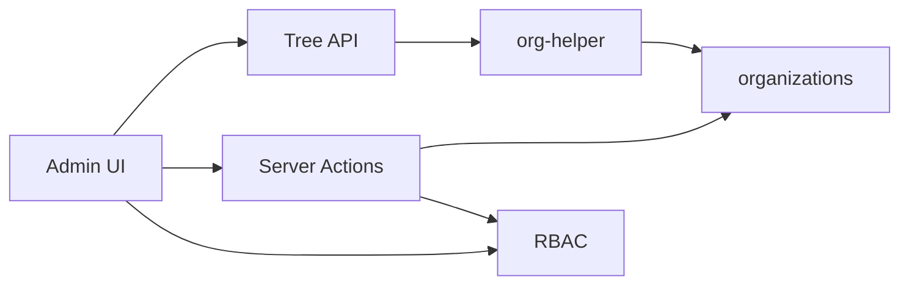

**Diagram sources**
- [route.ts (tree):1-19](file://app/api/organizations/tree/route.ts#L1-L19)
- [org-helper.ts:38-98](file://lib/org-helper.ts#L38-L98)
- [organization-actions.ts:11-144](file://lib/actions/organization.ts#L11-L144)
- [rbac-v2.ts:141-176](file://lib/rbac-v2.ts#L141-L176)

**Section sources**
- [route.ts (tree):1-19](file://app/api/organizations/tree/route.ts#L1-L19)
- [org-helper.ts:38-98](file://lib/org-helper.ts#L38-L98)
- [organization-actions.ts:11-144](file://lib/actions/organization.ts#L11-L144)
- [rbac-v2.ts:141-176](file://lib/rbac-v2.ts#L141-L176)

## Performance Considerations
- Tree construction:
  - Fetching all organizations and grouping in memory is efficient for small to medium datasets due to fixed depth (max 4 levels).
  - For very large datasets, consider database-level aggregation or caching the tree response.
- Deletion safety:
  - Checking for children before deletion avoids cascading failures but adds an extra query; batch operations should handle this carefully.
- RBAC checks:
  - Permission checks are lightweight; cache user permissions where appropriate to reduce repeated queries.

[No sources needed since this section provides general guidance]

## Troubleshooting Guide
Common issues and resolutions:
- Duplicate organization code:
  - Occurs when creating an organization with an existing code. Ensure uniqueness or choose a different code.
- Cannot delete organization:
  - If children exist, delete or reassign children first.
- Unauthorized access:
  - Verify session and permissions; ensure role jurisdiction matches target organization.
- Planning settings not updating:
  - Confirm migration added columns and server action is called with valid orgId and values.

**Section sources**
- [organization-actions.ts:23-52](file://lib/actions/organization.ts#L23-L52)
- [organization-actions.ts:54-78](file://lib/actions/organization.ts#L54-L78)
- [rbac-v2.ts:141-176](file://lib/rbac-v2.ts#L141-L176)

## Conclusion
The TMC Portal organization management system provides a robust, hierarchical model spanning National to Branch levels, with clear parent-child relationships and jurisdictional boundaries. It supports full CRUD operations, official appointments, planning configurations, and RBAC-enforced access control. The tree visualization and navigation streamline administration, while migrations and validation ensure data integrity. For large-scale changes, use migration scripts and careful handling of hierarchy constraints to maintain consistency across the system.