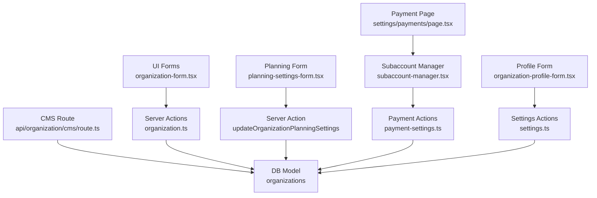
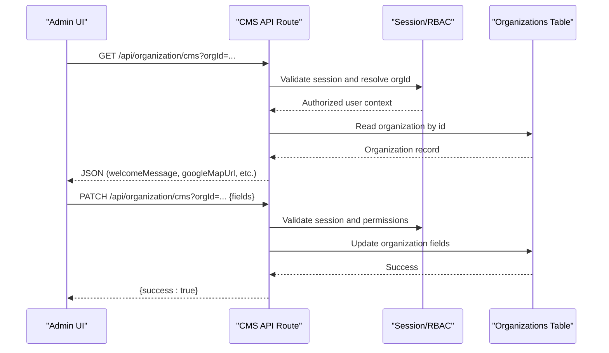
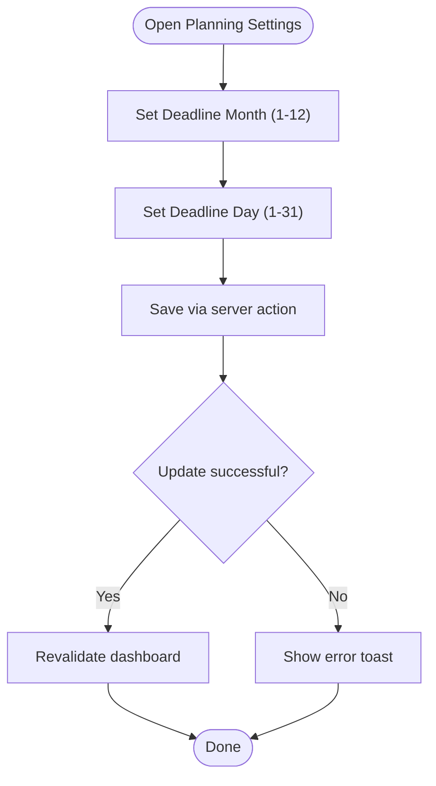
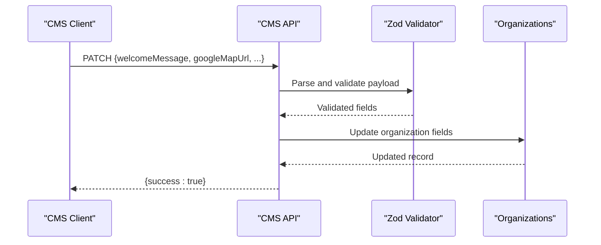
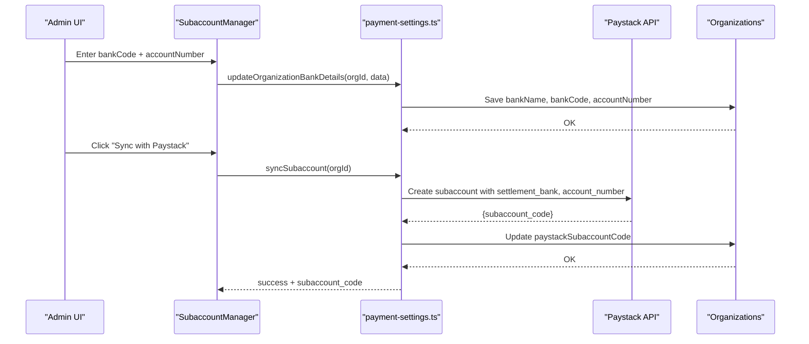
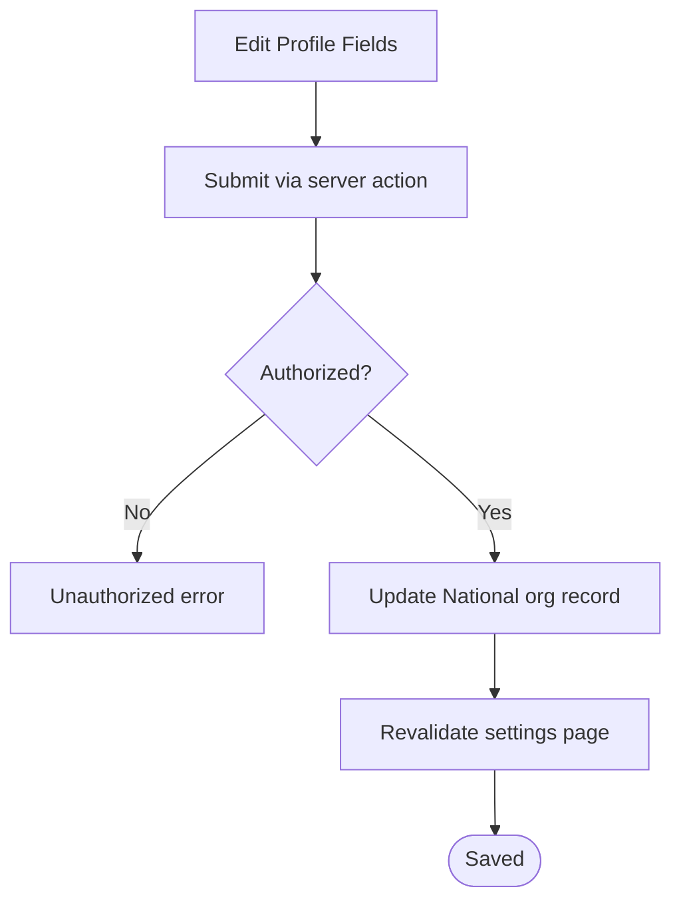
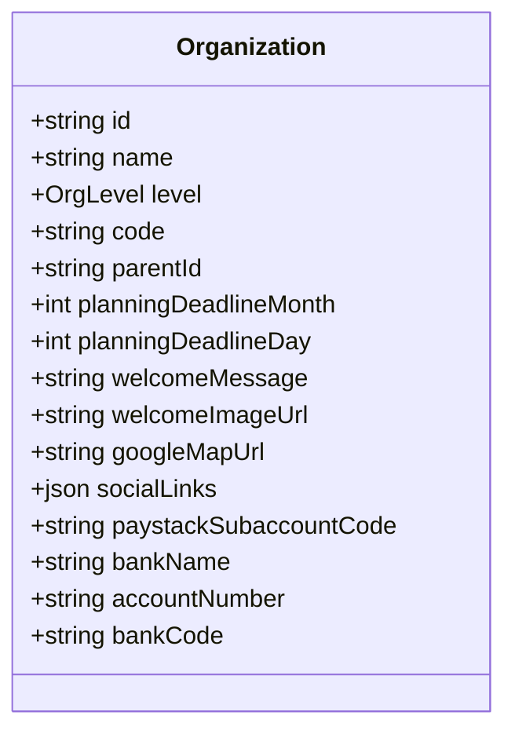
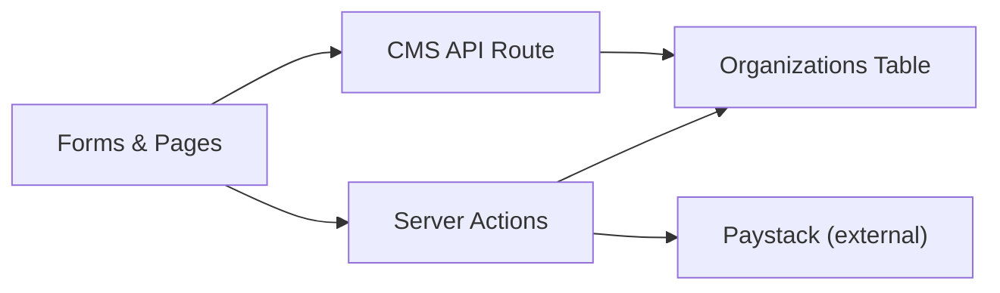

# Organization Settings & Configuration

<cite>
**Referenced Files in This Document**
- [schema.prisma](file://prisma/schema.prisma)
- [0000_giant_demogoblin.sql](file://drizzle/0000_giant_demogoblin.sql)
- [route.ts](file://app/api/organization/cms/route.ts)
- [organization-form.tsx](file://components/admin/organizations/organization-form.tsx)
- [planning-settings-form.tsx](file://components/admin/organizations/planning-settings-form.tsx)
- [organization-profile-form.tsx](file://components/admin/settings/organization-profile-form.tsx)
- [financial-settings-card.tsx](file://components/admin/settings/financial-settings-card.tsx)
- [subaccount-manager.tsx](file://components/admin/settings/subaccount-manager.tsx)
- [payment-settings.ts](file://lib/actions/payment-settings.ts)
- [settings.ts](file://lib/actions/settings.ts)
- [organization.ts](file://lib/actions/organization.ts)
- [page.tsx](file://app/dashboard/admin/settings/payments/page.tsx)
</cite>

## Table of Contents
1. Introduction
2. Project Structure
3. Core Components
4. Architecture Overview
5. Detailed Component Analysis
6. Dependency Analysis
7. Performance Considerations
8. Troubleshooting Guide
9. Conclusion
10. Appendices

## Introduction
This document explains how organization settings and configuration are managed across operational and CMS-related features. It covers:
- Planning configuration fields for workflow automation (planningDeadlineMonth, planningDeadlineDay)
- CMS settings for public-facing content (welcomeMessage, welcomeImageUrl, googleMapUrl, socialLinks)
- Financial integration settings for payment processing (paystackSubaccountCode, bankName, accountNumber, bankCode)
- Implementation details of organization profile forms, validation rules, and data persistence
- Examples for configuring different organization levels (National, State, Local Government)
- Relationship between organization settings and feature availability based on level
- Security considerations for sensitive configuration data and backup strategies

## Project Structure
Organization settings span multiple layers:
- Data model: stored in the organizations table with dedicated fields for planning, CMS, and financial integrations
- Server actions: update and read operations for organization profiles, planning deadlines, and financial settings
- API routes: secure endpoints to fetch and update CMS content per organization
- UI components: forms and cards to edit organization profile, planning deadlines, and payment subaccounts

**Diagram sources**
- [organization-form.tsx:119-155](file://components/admin/organizations/organization-form.tsx#L119-L155)
- [planning-settings-form.tsx:24-38](file://components/admin/organizations/planning-settings-form.tsx#L24-L38)
- [route.ts:47-129](file://app/api/organization/cms/route.ts#L47-L129)
- [payment-settings.ts:14-80](file://lib/actions/payment-settings.ts#L14-L80)
- [settings.ts:215-240](file://lib/actions/settings.ts#L215-L240)
- [schema.prisma:125-163](file://prisma/schema.prisma#L125-L163)

**Section sources**
- [schema.prisma:125-163](file://prisma/schema.prisma#L125-L163)
- [0000_giant_demogoblin.sql:626-656](file://drizzle/0000_giant_demogoblin.sql#L626-L656)

## Core Components
- Organizations model: holds all organization-level settings including planning deadlines, CMS content, and financial integration fields
- CMS API route: validates and persists CMS fields per organization with session-based authorization
- Planning settings form: updates deadline month/day used by workflows to tag late submissions
- Profile form: updates public-facing identity fields for the National organization
- Payment subaccount manager: stores bank details and syncs to Paystack to create a subaccount code

Key fields in the organizations model:
- Planning: planningDeadlineMonth, planningDeadlineDay
- CMS: welcomeMessage, welcomeImageUrl, googleMapUrl, socialLinks, missionText, visionText, whatsapp, officeHours, sliderImages
- Financial: paystackSubaccountCode, bankName, accountNumber, bankCode

**Section sources**
- [schema.prisma:125-163](file://prisma/schema.prisma#L125-L163)
- [0000_giant_demogoblin.sql:626-656](file://drizzle/0000_giant_demogoblin.sql#L626-L656)
- [route.ts:35-45](file://app/api/organization/cms/route.ts#L35-L45)
- [planning-settings-form.tsx:40-73](file://components/admin/organizations/planning-settings-form.tsx#L40-L73)
- [organization-profile-form.tsx:20-44](file://components/admin/settings/organization-profile-form.tsx#L20-L44)
- [subaccount-manager.tsx:33-68](file://components/admin/settings/subaccount-manager.tsx#L33-L68)

## Architecture Overview
The system uses a layered architecture:
- Presentation layer: React components render forms and dashboards
- Server actions: enforce authorization and persist changes to the database
- API routes: expose secure endpoints for CMS reads/writes scoped to an organization
- Database: single organizations table centralizes settings; some global settings live in a separate system settings store

**Diagram sources**
- [route.ts:47-129](file://app/api/organization/cms/route.ts#L47-L129)
- [schema.prisma:125-163](file://prisma/schema.prisma#L125-L163)

## Detailed Component Analysis

### Planning Configuration (Workflow Automation)
- Fields: planningDeadlineMonth, planningDeadlineDay
- Purpose: Define the cutoff date each year after which program submissions are tagged as late
- UI: Dedicated form to set month and day values
- Persistence: Server action updates the organizations table directly
- Workflow impact: Downstream processes compare current dates against these fields to mark submissions late

**Diagram sources**
- [planning-settings-form.tsx:24-38](file://components/admin/organizations/planning-settings-form.tsx#L24-L38)
- [organization.ts:119-134](file://lib/actions/organization.ts#L119-L134)

**Section sources**
- [planning-settings-form.tsx:1-76](file://components/admin/organizations/planning-settings-form.tsx#L1-L76)
- [organization.ts:119-134](file://lib/actions/organization.ts#L119-L134)
- [schema.prisma:146-148](file://prisma/schema.prisma#L146-L148)

### CMS Settings (Public-Facing Content)
- Fields: welcomeMessage, welcomeImageUrl, googleMapUrl, socialLinks, missionText, visionText, whatsapp, officeHours, sliderImages
- Access control: Session-based resolution of orgId; super admin fallback to National organization
- Validation: Zod schema enforces allowed fields before persisting
- Usage: Public pages consume these fields to render branding and contact info

**Diagram sources**
- [route.ts:35-45](file://app/api/organization/cms/route.ts#L35-L45)
- [route.ts:87-129](file://app/api/organization/cms/route.ts#L87-L129)
- [schema.prisma:141-159](file://prisma/schema.prisma#L141-L159)

**Section sources**
- [route.ts:47-129](file://app/api/organization/cms/route.ts#L47-L129)
- [schema.prisma:141-159](file://prisma/schema.prisma#L141-L159)

### Financial Integration Settings (Payments)
- Fields: paystackSubaccountCode, bankName, accountNumber, bankCode
- Flow:
  - Admin enters bank details in Subaccount Manager
  - Details saved locally to organizations table
  - Sync action calls Paystack to create a subaccount and stores the returned subaccount code
- UI: Bank list selection, account number input, save and sync buttons

**Diagram sources**
- [subaccount-manager.tsx:33-68](file://components/admin/settings/subaccount-manager.tsx#L33-L68)
- [payment-settings.ts:14-80](file://lib/actions/payment-settings.ts#L14-L80)
- [schema.prisma:157-161](file://prisma/schema.prisma#L157-L161)

**Section sources**
- [subaccount-manager.tsx:1-150](file://components/admin/settings/subaccount-manager.tsx#L1-L150)
- [payment-settings.ts:1-80](file://lib/actions/payment-settings.ts#L1-L80)
- [page.tsx:15-30](file://app/dashboard/admin/settings/payments/page.tsx#L15-L30)
- [schema.prisma:157-161](file://prisma/schema.prisma#L157-L161)

### Organization Profile Forms and Validation
- Profile form updates public identity fields for the National organization
- Server action enforces admin authorization and updates name, email, phone, website, welcomeMessage
- Organization creation/editing form includes hierarchy constraints and image uploads

**Diagram sources**
- [organization-profile-form.tsx:30-44](file://components/admin/settings/organization-profile-form.tsx#L30-L44)
- [settings.ts:215-240](file://lib/actions/settings.ts#L215-L240)

**Section sources**
- [organization-profile-form.tsx:1-113](file://components/admin/settings/organization-profile-form.tsx#L1-L113)
- [settings.ts:215-240](file://lib/actions/settings.ts#L215-L240)
- [organization-form.tsx:23-35](file://components/admin/organizations/organization-form.tsx#L23-L35)
- [organization-form.tsx:71-79](file://components/admin/organizations/organization-form.tsx#L71-L79)

### Organization Levels and Feature Availability
- Levels: NATIONAL, STATE, LOCAL_GOVERNMENT, BRANCH
- Hierarchy enforcement: Parent selection is filtered by level to prevent invalid relationships
- CMS access: Non-super admins can only manage their associated organization; super admins can target National by default
- Payments: Subaccount management applies per organization; linking enables payments at that jurisdiction level

**Diagram sources**
- [schema.prisma:125-163](file://prisma/schema.prisma#L125-L163)

**Section sources**
- [organization-form.tsx:71-79](file://components/admin/organizations/organization-form.tsx#L71-L79)
- [route.ts:56-65](file://app/api/organization/cms/route.ts#L56-L65)
- [subaccount-manager.tsx:86-117](file://components/admin/settings/subaccount-manager.tsx#L86-L117)

## Dependency Analysis
- UI components depend on server actions for persistence and on API routes for CMS reads/writes
- Server actions depend on the organizations model and sometimes on external services (Paystack)
- Authorization relies on session and RBAC checks before writes
- The organizations table is the single source of truth for organization-scoped settings

**Diagram sources**
- [organization.ts:11-51](file://lib/actions/organization.ts#L11-L51)
- [payment-settings.ts:44-80](file://lib/actions/payment-settings.ts#L44-L80)
- [route.ts:47-129](file://app/api/organization/cms/route.ts#L47-L129)

**Section sources**
- [organization.ts:11-51](file://lib/actions/organization.ts#L11-L51)
- [payment-settings.ts:44-80](file://lib/actions/payment-settings.ts#L44-L80)
- [route.ts:47-129](file://app/api/organization/cms/route.ts#L47-L129)

## Performance Considerations
- Prefer batching updates when editing multiple organization fields to reduce round trips
- Use revalidation strategically to refresh only affected pages after updates
- Cache CMS reads where appropriate to minimize repeated queries for public content
- Validate inputs early on the client to avoid unnecessary server requests

[No sources needed since this section provides general guidance]

## Troubleshooting Guide
- Unauthorized errors on CMS or settings updates: Ensure the user session is valid and has required roles; verify orgId resolution logic
- Missing organization association: Confirm the user’s official or member organization mapping; super admin fallback targets National
- Duplicate organization code: Creation fails if code already exists; choose a unique code
- Incomplete bank details for Paystack sync: Ensure bankCode and accountNumber are present before syncing
- Image upload limits: Slider images limited to 5 files with size constraints; handle errors gracefully

**Section sources**
- [route.ts:47-69](file://app/api/organization/cms/route.ts#L47-L69)
- [organization.ts:23-51](file://lib/actions/organization.ts#L23-L51)
- [payment-settings.ts:49-55](file://lib/actions/payment-settings.ts#L49-L55)
- [organization-form.tsx:83-117](file://components/admin/organizations/organization-form.tsx#L83-L117)

## Conclusion
Organization settings unify operational controls (planning deadlines), public-facing content (CMS), and financial integrations (payments) under a single model. The implementation enforces hierarchy, validates inputs, and secures updates through sessions and role checks. Proper configuration per organization level ensures consistent behavior across National, State, and Local Government jurisdictions.

[No sources needed since this section summarizes without analyzing specific files]

## Appendices

### Example Configurations by Organization Level
- National
  - Set welcomeMessage, welcomeImageUrl, googleMapUrl, socialLinks for brand-wide content
  - Configure planningDeadlineMonth and planningDeadlineDay to define annual submission cutoffs
  - Optionally configure global financial defaults via financial settings
- State
  - Link bank details and sync Paystack subaccount to enable local payments
  - Adjust planning deadlines if state-specific policies differ from national
- Local Government
  - Manage local CMS content such as address and office hours
  - Ensure parent hierarchy is correctly set to State

[No sources needed since this section provides conceptual examples]

### Security and Backup Strategies
- Security
  - All write operations require authenticated sessions and admin checks
  - Sensitive fields (bank details, Paystack codes) should be treated as confidential; restrict access to authorized administrators
  - Log and audit updates to critical settings where feasible
- Backups
  - Automated backups are supported and pushed to configured storage; retention follows policy
  - Maintain manual backups for critical configuration changes; keep versioned snapshots of organization settings

**Section sources**
- [page.tsx:110-127](file://app/dashboard/admin/backups/page.tsx#L110-L127)