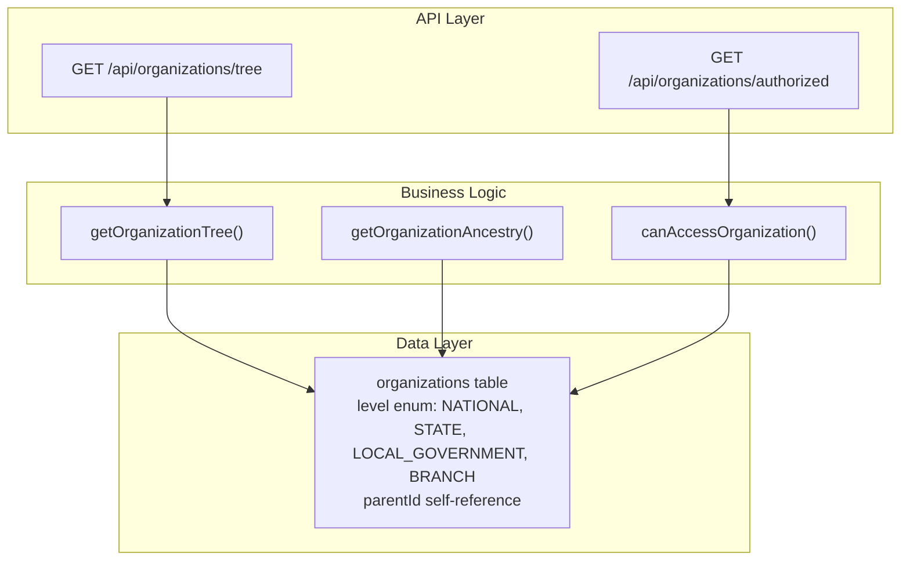
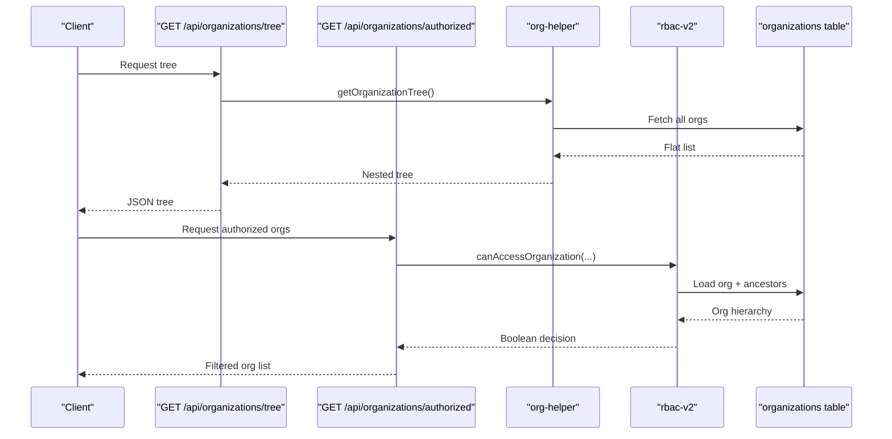
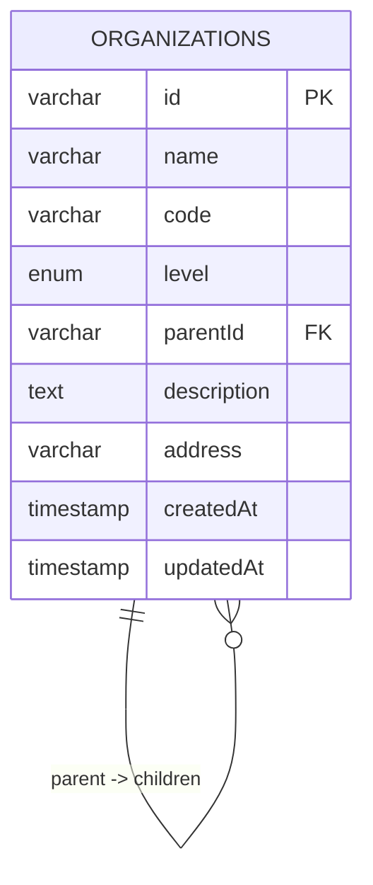
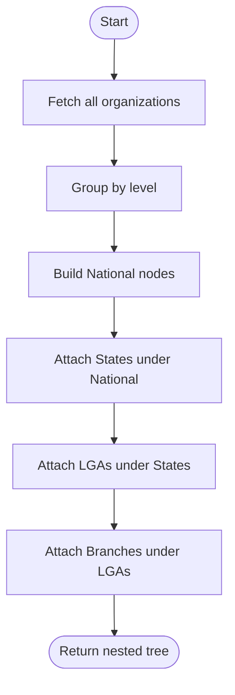
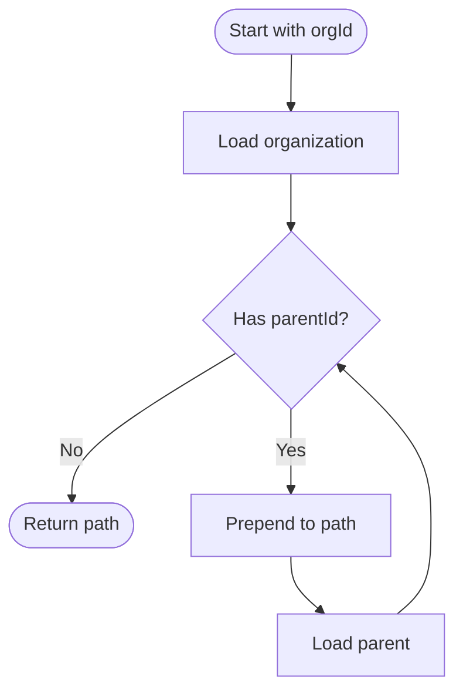
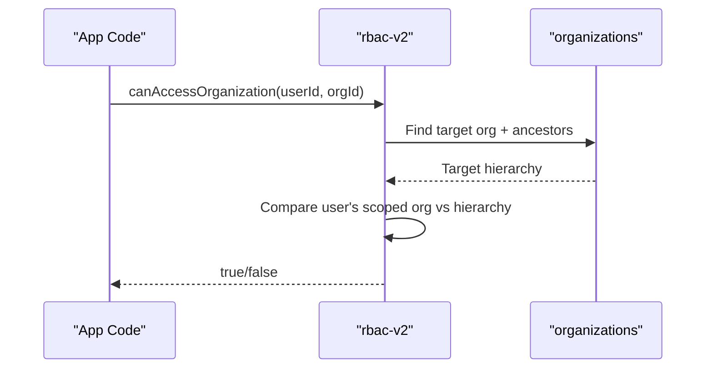
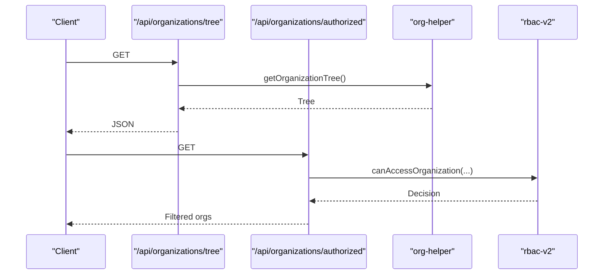
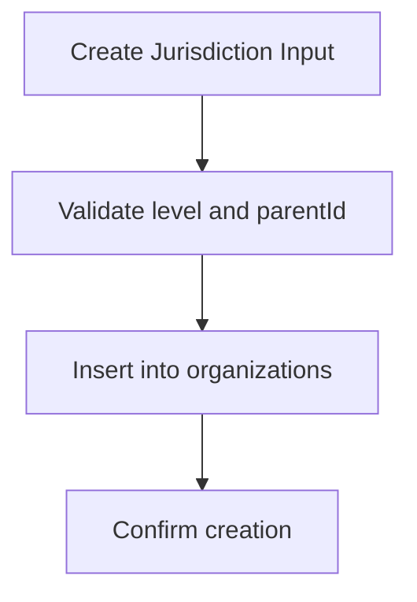
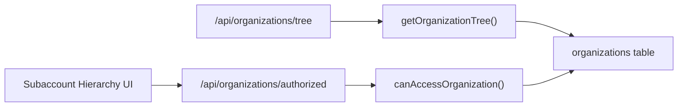

# Organizational Hierarchy & Structure

<cite>
**Referenced Files in This Document**
- [org-helper.ts](file://lib/org-helper.ts)
- [route.ts (tree)](file://app/api/organizations/tree/route.ts)
- [route.ts (authorized)](file://app/api/organizations/authorized/route.ts)
- [rbac-v2.ts](file://lib/rbac-v2.ts)
- [schema.ts](file://lib/db/schema.ts)
- [0003_snapshot.json](file://drizzle/meta/0003_snapshot.json)
- [actions.ts](file://app/dashboard/admin/jurisdictions/actions.ts)
- [subaccount-hierarchy.tsx](file://components/admin/settings/subaccount-hierarchy.tsx)
- [seed-community.ts](file://scripts/seed-community.ts)
</cite>

## Table of Contents
1. Introduction
2. Project Structure
3. Core Components
4. Architecture Overview
5. Detailed Component Analysis
6. Dependency Analysis
7. Performance Considerations
8. Troubleshooting Guide
9. Conclusion

## Introduction
This document explains the TMC Portal’s organizational hierarchy system that supports a multi-tiered structure across National, State, Local Government, and Branch levels. It covers the parent-child relationship model via the organizations table with a self-referencing parentId field, the orgLevelEnum values and their business implications, jurisdiction boundary enforcement through hierarchical relationships, data isolation across levels, tree traversal algorithms, depth calculations, path resolution, code generation and unique identifier management, and validation rules to prevent circular references and maintain hierarchy integrity.

## Project Structure
The organizational hierarchy is implemented across database schema definitions, helper utilities for building trees and ancestry paths, API routes for exposing organization data and authorized scopes, and RBAC logic that enforces jurisdiction-aware access control.

**Diagram sources**
- [route.ts (tree):1-19](file://app/api/organizations/tree/route.ts#L1-L19)
- [route.ts (authorized):1-67](file://app/api/organizations/authorized/route.ts#L1-L67)
- [org-helper.ts:38-117](file://lib/org-helper.ts#L38-L117)
- [rbac-v2.ts:170-259](file://lib/rbac-v2.ts#L170-L259)
- [0003_snapshot.json:5158-5206](file://drizzle/meta/0003_snapshot.json#L5158-L5206)

**Section sources**
- [route.ts (tree):1-19](file://app/api/organizations/tree/route.ts#L1-L19)
- [route.ts (authorized):1-67](file://app/api/organizations/authorized/route.ts#L1-L67)
- [org-helper.ts:38-117](file://lib/org-helper.ts#L38-L117)
- [rbac-v2.ts:170-259](file://lib/rbac-v2.ts#L170-L259)
- [0003_snapshot.json:5158-5206](file://drizzle/meta/0003_snapshot.json#L5158-L5206)

## Core Components
- Organizations table and level enumeration define the hierarchy backbone. The level column uses an enum with values NATIONAL, STATE, LOCAL_GOVERNMENT, BRANCH. The parentId field provides a self-referencing link to the parent organization.
- Organization tree builder aggregates all organizations into a nested structure by level and parentId.
- Ancestry resolver walks up the parent chain to produce a path from root to any node.
- Authorized scope endpoint returns organizations visible to the current user based on roles and jurisdiction.
- RBAC functions enforce jurisdiction boundaries when checking access to specific organizations.

**Section sources**
- [0003_snapshot.json:5158-5206](file://drizzle/meta/0003_snapshot.json#L5158-L5206)
- [org-helper.ts:38-117](file://lib/org-helper.ts#L38-L117)
- [route.ts (authorized):1-67](file://app/api/organizations/authorized/route.ts#L1-L67)
- [rbac-v2.ts:170-259](file://lib/rbac-v2.ts#L170-L259)

## Architecture Overview
The system exposes two primary APIs:
- Tree: Returns the full hierarchical organization tree.
- Authorized: Returns only those organizations the current session can see, considering role-scoped jurisdictions and hierarchy.

**Diagram sources**
- [route.ts (tree):1-19](file://app/api/organizations/tree/route.ts#L1-L19)
- [route.ts (authorized):1-67](file://app/api/organizations/authorized/route.ts#L1-L67)
- [org-helper.ts:38-117](file://lib/org-helper.ts#L38-L117)
- [rbac-v2.ts:170-259](file://lib/rbac-v2.ts#L170-L259)

## Detailed Component Analysis

### Data Model: Organizations and Levels
- The organizations table stores id, name, code, level, parentId, description, address, and timestamps.
- The level column is an enum with values: NATIONAL, STATE, LOCAL_GOVERNMENT, BRANCH.
- parentId is a self-referencing foreign key enabling hierarchical relationships.

**Diagram sources**
- [0003_snapshot.json:5158-5206](file://drizzle/meta/0003_snapshot.json#L5158-L5206)

**Section sources**
- [0003_snapshot.json:5158-5206](file://drizzle/meta/0003_snapshot.json#L5158-L5206)

### Organization Tree Builder
- Retrieves all organizations and groups them by level.
- Builds a nested tree: National -> States -> Local Governments -> Branches using parentId relationships.
- Returns a structured array suitable for UI rendering or further processing.

**Diagram sources**
- [org-helper.ts:38-98](file://lib/org-helper.ts#L38-L98)

**Section sources**
- [org-helper.ts:38-98](file://lib/org-helper.ts#L38-L98)

### Ancestry Path Resolution
- Walks up the parent chain from a given organization id to construct the path from root to the target node.
- Uses iterative lookups until no parent remains.

**Diagram sources**
- [org-helper.ts:100-117](file://lib/org-helper.ts#L100-L117)

**Section sources**
- [org-helper.ts:100-117](file://lib/org-helper.ts#L100-L117)

### Jurisdiction-Aware Access Control
- Determines if a user can access a specific organization by:
  - Checking for SYSTEM-level roles (superadmin) which bypass restrictions.
  - Loading the target organization and its ancestors.
  - Verifying whether the user’s scoped organization appears in the target’s hierarchy.
- Enforces data isolation so users only see and operate within their permitted jurisdictional scope.

**Diagram sources**
- [rbac-v2.ts:170-259](file://lib/rbac-v2.ts#L170-L259)

**Section sources**
- [rbac-v2.ts:170-259](file://lib/rbac-v2.ts#L170-L259)

### API Endpoints for Organization Data
- GET /api/organizations/tree: Requires authentication; returns the full hierarchical tree.
- GET /api/organizations/authorized: Requires authentication; returns organizations visible to the current user based on roles and jurisdiction.

**Diagram sources**
- [route.ts (tree):1-19](file://app/api/organizations/tree/route.ts#L1-L19)
- [route.ts (authorized):1-67](file://app/api/organizations/authorized/route.ts#L1-L67)
- [org-helper.ts:38-117](file://lib/org-helper.ts#L38-L117)
- [rbac-v2.ts:170-259](file://lib/rbac-v2.ts#L170-L259)

**Section sources**
- [route.ts (tree):1-19](file://app/api/organizations/tree/route.ts#L1-L19)
- [route.ts (authorized):1-67](file://app/api/organizations/authorized/route.ts#L1-L67)

### Creating Hierarchical Structures
- Server actions validate inputs for creating jurisdictions with level constraints and optional parentId.
- Seed scripts demonstrate inserting organizations at different levels with codes and parentId assignments.

**Diagram sources**
- [actions.ts:13-18](file://app/dashboard/admin/jurisdictions/actions.ts#L13-L18)
- [seed-community.ts:233-261](file://scripts/seed-community.ts#L233-L261)

**Section sources**
- [actions.ts:13-18](file://app/dashboard/admin/jurisdictions/actions.ts#L13-L18)
- [seed-community.ts:233-261](file://scripts/seed-community.ts#L233-L261)

### Querying Organizational Trees
- Use the tree API to retrieve the full hierarchy for UI components like admin dashboards or selectors.
- Use the authorized API to populate jurisdiction-aware lists for users with limited scopes.

**Section sources**
- [route.ts (tree):1-19](file://app/api/organizations/tree/route.ts#L1-L19)
- [route.ts (authorized):1-67](file://app/api/organizations/authorized/route.ts#L1-L67)

### Implementing Jurisdiction-Aware Access Controls
- Integrate RBAC checks before performing operations on organizations.
- For read operations, filter datasets using the authorized endpoint or server-side checks.
- For write operations, ensure the user has permission and jurisdiction over the target organization.

**Section sources**
- [rbac-v2.ts:170-259](file://lib/rbac-v2.ts#L170-L259)
- [route.ts (authorized):1-67](file://app/api/organizations/authorized/route.ts#L1-L67)

### Organization Code Generation and Unique Identifier Management
- Codes are generated per level during seeding and creation flows, often combining parent codes with branch identifiers.
- IDs are unique identifiers used for relationships and lookups; codes serve as human-readable, stable identifiers.

**Section sources**
- [seed-community.ts:233-261](file://scripts/seed-community.ts#L233-L261)
- [0003_snapshot.json:5158-5206](file://drizzle/meta/0003_snapshot.json#L5158-L5206)

### Validation Rules for Hierarchy Integrity
- Level constraints: Creation actions restrict allowed levels and require valid parentId where applicable.
- Circular reference prevention: Ensure parentId does not point to descendants; implement checks before insertion/update.
- Depth limits: Maintain a fixed maximum depth (e.g., four levels) to simplify queries and avoid deep recursion.

**Section sources**
- [actions.ts:13-18](file://app/dashboard/admin/jurisdictions/actions.ts#L13-L18)

## Dependency Analysis
The following diagram shows how components depend on each other to provide hierarchy services and access control.

**Diagram sources**
- [route.ts (tree):1-19](file://app/api/organizations/tree/route.ts#L1-L19)
- [route.ts (authorized):1-67](file://app/api/organizations/authorized/route.ts#L1-L67)
- [org-helper.ts:38-117](file://lib/org-helper.ts#L38-L117)
- [rbac-v2.ts:170-259](file://lib/rbac-v2.ts#L170-L259)
- [subaccount-hierarchy.tsx:22-42](file://components/admin/settings/subaccount-hierarchy.tsx#L22-L42)

**Section sources**
- [route.ts (tree):1-19](file://app/api/organizations/tree/route.ts#L1-L19)
- [route.ts (authorized):1-67](file://app/api/organizations/authorized/route.ts#L1-L67)
- [org-helper.ts:38-117](file://lib/org-helper.ts#L38-L117)
- [rbac-v2.ts:170-259](file://lib/rbac-v2.ts#L170-L259)
- [subaccount-hierarchy.tsx:22-42](file://components/admin/settings/subaccount-hierarchy.tsx#L22-L42)

## Performance Considerations
- Tree construction loads all organizations once and builds the hierarchy in memory; this is efficient for small to medium hierarchies.
- Ancestry resolution performs sequential lookups; consider recursive CTEs or materialized paths for large datasets.
- Authorized endpoint fetches managed orgs plus immediate children and grandchildren; optimize with recursive queries if deeper nesting is required.
- Cache frequently accessed trees and authorized lists to reduce database load.

[No sources needed since this section provides general guidance]

## Troubleshooting Guide
- Unauthorized access: Ensure sessions are present and permissions are correctly loaded before calling tree or authorized endpoints.
- Empty authorized results: Verify user roles have organizationId associations and that jurisdiction checks align with the target organization’s hierarchy.
- Incorrect hierarchy display: Confirm parentId relationships are set correctly and levels match expected values.
- Circular references: Validate parentId before insert/update to prevent cycles; add checks to ensure no descendant becomes a parent.

**Section sources**
- [route.ts (tree):1-19](file://app/api/organizations/tree/route.ts#L1-L19)
- [route.ts (authorized):1-67](file://app/api/organizations/authorized/route.ts#L1-L67)
- [rbac-v2.ts:170-259](file://lib/rbac-v2.ts#L170-L259)

## Conclusion
The TMC Portal’s organizational hierarchy leverages a clear parent-child model with a self-referencing parentId and a strict level enumeration to support National, State, Local Government, and Branch structures. Tree traversal and ancestry resolution enable robust navigation and reporting, while RBAC ensures jurisdiction-aware access control and data isolation. With careful validation and performance optimizations, the system scales effectively and maintains integrity across complex organizational graphs.