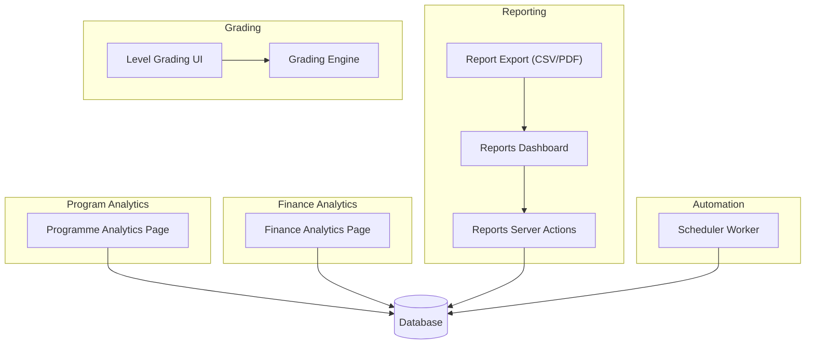
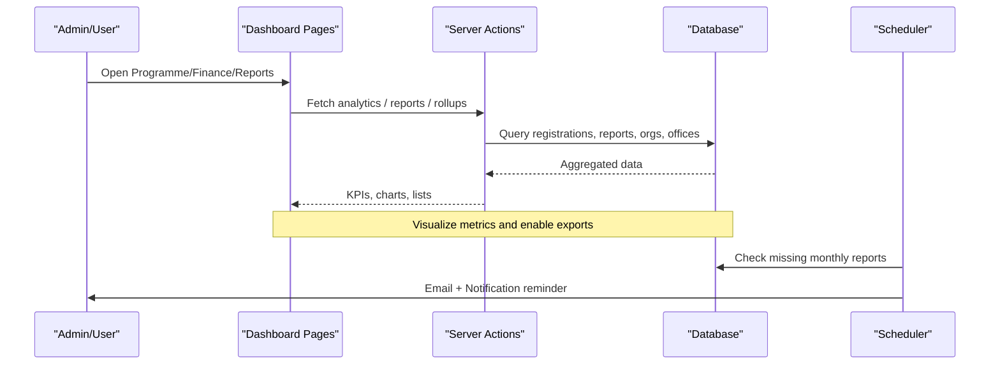
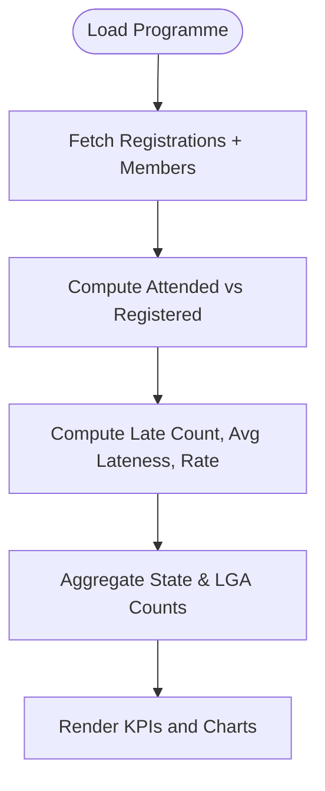
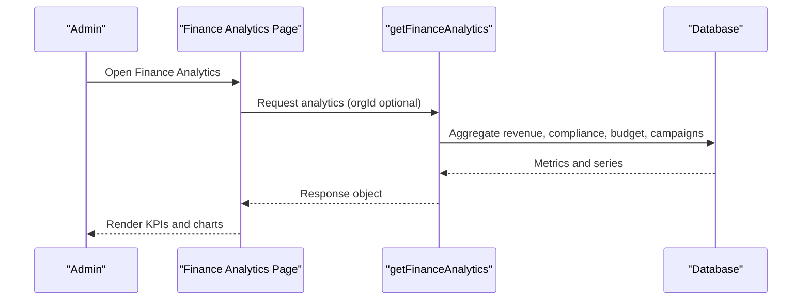
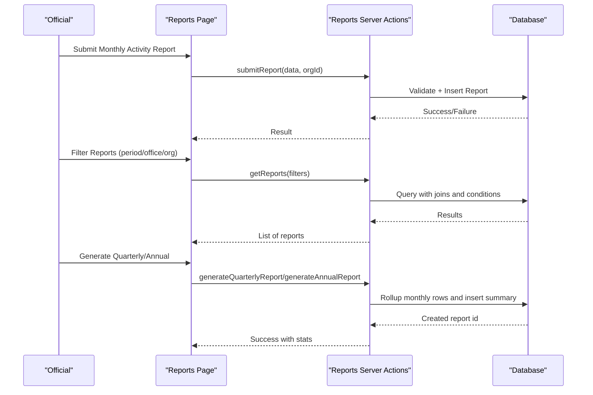
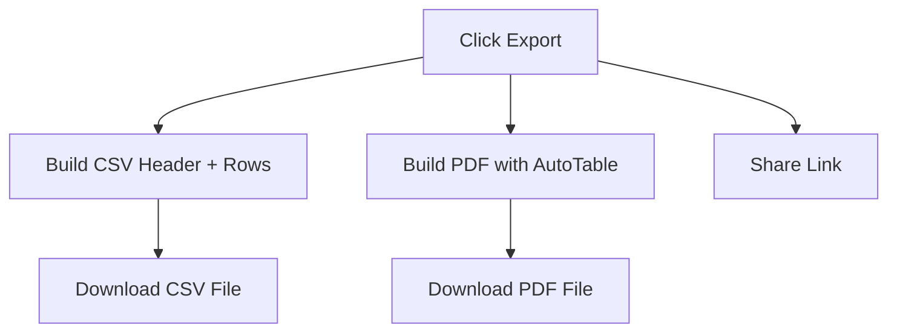
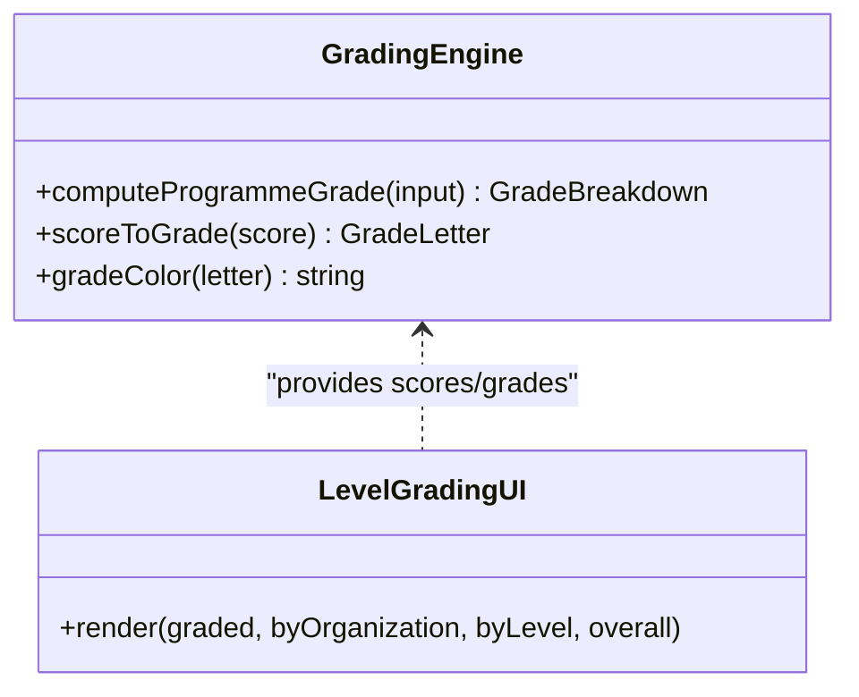
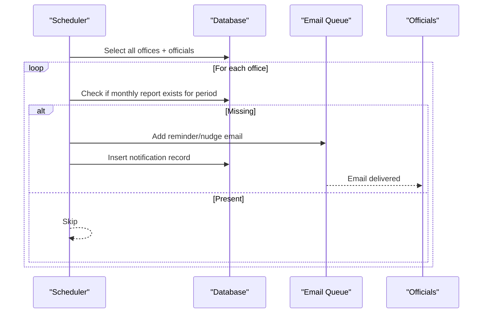
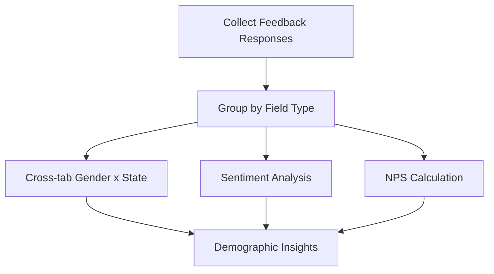
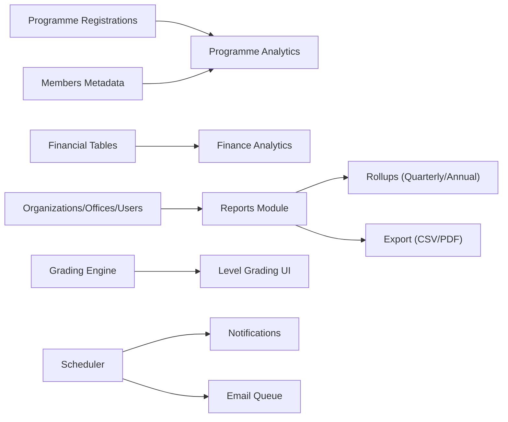

# Analytics & Reporting

<cite>
**Referenced Files in This Document**
- [app/dashboard/admin/programmes/[id]/analytics/page.tsx](file://app/dashboard/admin/programmes/[id]/analytics/page.tsx)
- [app/dashboard/admin/finance/analytics/page.tsx](file://app/dashboard/admin/finance/analytics/page.tsx)
- [lib/actions/reports.ts](file://lib/actions/reports.ts)
- [components/admin/programmes/reports/report-export.tsx](file://components/admin/programmes/reports/report-export.tsx)
- [app/dashboard/admin/reports/page.tsx](file://app/dashboard/admin/reports/page.tsx)
- [lib/grading.ts](file://lib/grading.ts)
- [components/admin/programmes/reports/level-grading.tsx](file://components/admin/programmes/reports/level-grading.tsx)
- [workers/scheduler.ts](file://workers/scheduler.ts)
- [tmsportalreal.sql](file://tmsportalreal.sql)
- [components/admin/programmes/monthly-submission-client.tsx](file://components/admin/programmes/monthly-submission-client.tsx)
</cite>

## Table of Contents
1. Introduction
2. Project Structure
3. Core Components
4. Architecture Overview
5. Detailed Component Analysis
6. Dependency Analysis
7. Performance Considerations
8. Troubleshooting Guide
9. Conclusion
10. Appendices

## Introduction
This document explains the analytics and reporting capabilities for programs, participation, finance, feedback, grading, and automated reporting. It covers:
- Participation metrics: registration rates, attendance percentages, lateness analysis, jurisdiction representation, and engagement tracking across program types and organizational levels.
- Financial analytics: revenue trends, compliance, budget utilization, campaign progress, and category breakdowns.
- Reporting features: exportable CSV/PDF reports, visual dashboards, monthly submission workflows, and scheduled reminders.
- Demographic and trend analysis: gender/state cross-tabs, geographic distribution (state/LGA), and time-based rollups.
- Performance measurement: virtual vs physical mode insights from feedback, outcome scoring via programme grading, and benchmarking against historical coverage.
- Custom report generation: filters by period, office, jurisdiction hierarchy; quarterly/annual rollups; and scheduled delivery via email and notifications.

## Project Structure
The analytics and reporting system spans server actions, dashboard pages, client components, database schema, and a scheduler worker:
- Program analytics page computes per-programme attendance, lateness, and geographic representation.
- Finance analytics page aggregates revenue, compliance, budget usage, and campaigns with charts.
- Reports module supports submission, approval, rollups (quarterly/annual), and filtering by organization hierarchy.
- Export utilities generate CSV and PDF summaries for programme reports.
- Grading engine scores programmes on completion, punctuality, attendance, budget discipline, and quality.
- Scheduler sends monthly reminders and nudges to officials for missing reports.

**Diagram sources**
- [app/dashboard/admin/programmes/[id]/analytics/page.tsx:11-182](file://app/dashboard/admin/programmes/[id]/analytics/page.tsx#L11-L182)
- [app/dashboard/admin/finance/analytics/page.tsx:22-141](file://app/dashboard/admin/finance/analytics/page.tsx#L22-L141)
- [lib/actions/reports.ts:45-161](file://lib/actions/reports.ts#L45-L161)
- [components/admin/programmes/reports/report-export.tsx:6-78](file://components/admin/programmes/reports/report-export.tsx#L6-L78)
- [lib/grading.ts:47-141](file://lib/grading.ts#L47-L141)
- [workers/scheduler.ts:293-336](file://workers/scheduler.ts#L293-L336)

**Section sources**
- [app/dashboard/admin/programmes/[id]/analytics/page.tsx:11-182](file://app/dashboard/admin/programmes/[id]/analytics/page.tsx#L11-L182)
- [app/dashboard/admin/finance/analytics/page.tsx:22-141](file://app/dashboard/admin/finance/analytics/page.tsx#L22-L141)
- [lib/actions/reports.ts:45-161](file://lib/actions/reports.ts#L45-L161)
- [components/admin/programmes/reports/report-export.tsx:6-78](file://components/admin/programmes/reports/report-export.tsx#L6-L78)
- [lib/grading.ts:47-141](file://lib/grading.ts#L47-L141)
- [workers/scheduler.ts:293-336](file://workers/scheduler.ts#L293-L336)

## Core Components
- Programme Analytics: Computes total registered, attended, attendance rate, lateness count/rate, average lateness, and state/LGA representation.
- Finance Analytics: Displays monthly revenue, compliance rate, budget utilization, active campaigns, and charts for revenue, compliance, categories, and budget vs actual.
- Reports Workflow: Submit monthly activity reports, approve/reject, filter by period/office/jurisdiction, generate quarterly/annual rollups, and view coverage stats.
- Report Export: Client-side CSV and PDF generation for programme reports with summary metrics.
- Grading Engine: Scores programmes using weighted criteria and maps to letter grades; UI shows overall, by level, by jurisdiction, and per-programme breakdowns.
- Scheduler: Sends monthly reminders/nudges to officials for missing reports and creates in-app notifications.

**Section sources**
- [app/dashboard/admin/programmes/[id]/analytics/page.tsx:17-121](file://app/dashboard/admin/programmes/[id]/analytics/page.tsx#L17-L121)
- [app/dashboard/admin/finance/analytics/page.tsx:39-137](file://app/dashboard/admin/finance/analytics/page.tsx#L39-L137)
- [lib/actions/reports.ts:45-161](file://lib/actions/reports.ts#L45-L161)
- [components/admin/programmes/reports/report-export.tsx:6-78](file://components/admin/programmes/reports/report-export.tsx#L6-L78)
- [lib/grading.ts:47-141](file://lib/grading.ts#L47-L141)
- [workers/scheduler.ts:293-336](file://workers/scheduler.ts#L293-L336)

## Architecture Overview
The system combines server-side data aggregation with interactive dashboards and automation:
- Data sources include programme registrations, members, reports, offices, organizations, meetings, and financial tables.
- Dashboards render KPIs and charts based on aggregated results.
- Automated scheduling triggers reminders and nudges for report submissions.
- Rollup functions aggregate monthly data into quarterly and annual summaries.

**Diagram sources**
- [app/dashboard/admin/programmes/[id]/analytics/page.tsx:11-182](file://app/dashboard/admin/programmes/[id]/analytics/page.tsx#L11-L182)
- [app/dashboard/admin/finance/analytics/page.tsx:22-141](file://app/dashboard/admin/finance/analytics/page.tsx#L22-L141)
- [lib/actions/reports.ts:207-303](file://lib/actions/reports.ts#L207-L303)
- [workers/scheduler.ts:293-336](file://workers/scheduler.ts#L293-L336)

## Detailed Component Analysis

### Programme Analytics
- Registration and Attendance: Counts total registered and attended; calculates attendance percentage.
- Lateness Analysis: Compares check-in times to programme start; computes late count, average lateness, and lateness rate.
- Geographic Representation: Aggregates participants by state and top local government areas (LGAs).

**Diagram sources**
- [app/dashboard/admin/programmes/[id]/analytics/page.tsx:17-68](file://app/dashboard/admin/programmes/[id]/analytics/page.tsx#L17-L68)
- [app/dashboard/admin/programmes/[id]/analytics/page.tsx:70-182](file://app/dashboard/admin/programmes/[id]/analytics/page.tsx#L70-L182)

**Section sources**
- [app/dashboard/admin/programmes/[id]/analytics/page.tsx:17-121](file://app/dashboard/admin/programmes/[id]/analytics/page.tsx#L17-L121)
- [app/dashboard/admin/programmes/[id]/analytics/page.tsx:123-182](file://app/dashboard/admin/programmes/[id]/analytics/page.tsx#L123-L182)

### Finance Analytics
- KPIs: Monthly revenue, compliance rate, budget utilization, active campaigns.
- Charts: Revenue trend, compliance visualization, category breakdown, budget vs actual, campaign progress board.
- Jurisdiction Filtering: Allows narrowing analytics by organization.

**Diagram sources**
- [app/dashboard/admin/finance/analytics/page.tsx:22-141](file://app/dashboard/admin/finance/analytics/page.tsx#L22-L141)

**Section sources**
- [app/dashboard/admin/finance/analytics/page.tsx:39-137](file://app/dashboard/admin/finance/analytics/page.tsx#L39-L137)

### Reporting Workflow and Rollups
- Submission: Validates and inserts monthly activity reports; prevents duplicates per office+period.
- Approval: Approve or reject reports; updates status and timestamps.
- Filtering: Supports filters by type, status, office, period, and organization hierarchy.
- Rollups: Generates quarterly and annual reports by aggregating monthly submissions; includes coverage stats and source references.

**Diagram sources**
- [lib/actions/reports.ts:45-161](file://lib/actions/reports.ts#L45-L161)
- [lib/actions/reports.ts:207-303](file://lib/actions/reports.ts#L207-L303)
- [app/dashboard/admin/reports/page.tsx:189-350](file://app/dashboard/admin/reports/page.tsx#L189-L350)

**Section sources**
- [lib/actions/reports.ts:45-161](file://lib/actions/reports.ts#L45-L161)
- [lib/actions/reports.ts:207-303](file://lib/actions/reports.ts#L207-L303)
- [app/dashboard/admin/reports/page.tsx:189-350](file://app/dashboard/admin/reports/page.tsx#L189-L350)

### Exportable Reports (CSV/PDF)
- CSV: Builds header and rows from programme report details; downloads via Blob URL.
- PDF: Uses jsPDF and autoTable to produce formatted tables with summary metrics.
- Share: Copies current page link for sharing.

**Diagram sources**
- [components/admin/programmes/reports/report-export.tsx:6-78](file://components/admin/programmes/reports/report-export.tsx#L6-L78)

**Section sources**
- [components/admin/programmes/reports/report-export.tsx:6-78](file://components/admin/programmes/reports/report-export.tsx#L6-L78)

### Programme Grading and Benchmarks
- Scoring Dimensions: Completion, punctuality, attendance, budget discipline, quality.
- Weighted Score: Combines dimensions using configurable weights; maps to letter grade.
- Benchmarking: Coverage stats (monthly submissions vs expected) and per-level/jurisdiction averages provide historical comparisons.

**Diagram sources**
- [lib/grading.ts:47-141](file://lib/grading.ts#L47-L141)
- [components/admin/programmes/reports/level-grading.tsx:10-114](file://components/admin/programmes/reports/level-grading.tsx#L10-L114)

**Section sources**
- [lib/grading.ts:47-141](file://lib/grading.ts#L47-L141)
- [components/admin/programmes/reports/level-grading.tsx:10-114](file://components/admin/programmes/reports/level-grading.tsx#L10-L114)

### Automated Monthly Submissions and Reminders
- Nudge Logic: Detects missing monthly reports per office and period; sends emails and in-app notifications.
- Reminder Flow: Iterates offices and their officials; constructs subject/html; enqueues email and inserts notification records.

**Diagram sources**
- [workers/scheduler.ts:293-336](file://workers/scheduler.ts#L293-L336)

**Section sources**
- [workers/scheduler.ts:293-336](file://workers/scheduler.ts#L293-L336)

### Demographics and Engagement Tracking
- Feedback Demographics: Cross-tabulation by gender and state for feedback fields; sentiment analysis and NPS derivation for choice/rating questions.
- Mode of Participation: Captures “Physically (On-site)” vs “Virtually (Online)” to compare performance and satisfaction across modes.

**Diagram sources**
- [app/dashboard/admin/programmes/[id]/feedback/page.tsx:165-182](file://app/dashboard/admin/programmes/[id]/feedback/page.tsx#L165-L182)
- [app/dashboard/admin/programmes/[id]/feedback/page.tsx:237-254](file://app/dashboard/admin/programmes/[id]/feedback/page.tsx#L237-L254)
- [app/dashboard/admin/programmes/[id]/feedback/page.tsx:491-500](file://app/dashboard/admin/programmes/[id]/feedback/page.tsx#L491-L500)

**Section sources**
- [app/dashboard/admin/programmes/[id]/feedback/page.tsx:165-182](file://app/dashboard/admin/programmes/[id]/feedback/page.tsx#L165-L182)
- [app/dashboard/admin/programmes/[id]/feedback/page.tsx:237-254](file://app/dashboard/admin/programmes/[id]/feedback/page.tsx#L237-L254)
- [app/dashboard/admin/programmes/[id]/feedback/page.tsx:491-500](file://app/dashboard/admin/programmes/[id]/feedback/page.tsx#L491-L500)

## Dependency Analysis
Key dependencies and relationships:
- Programme analytics depends on programme registrations and member metadata for geographic stats.
- Finance analytics relies on aggregated financial data and charts components.
- Reports depend on organizations/offices/users schemas and support hierarchical queries.
- Grading depends on report content and programme metadata; UI renders graded results.
- Scheduler depends on offices, officials, users, reports, and notifications tables.

**Diagram sources**
- [app/dashboard/admin/programmes/[id]/analytics/page.tsx:17-68](file://app/dashboard/admin/programmes/[id]/analytics/page.tsx#L17-L68)
- [app/dashboard/admin/finance/analytics/page.tsx:39-137](file://app/dashboard/admin/finance/analytics/page.tsx#L39-L137)
- [lib/actions/reports.ts:107-161](file://lib/actions/reports.ts#L107-L161)
- [lib/actions/reports.ts:207-303](file://lib/actions/reports.ts#L207-L303)
- [components/admin/programmes/reports/report-export.tsx:6-78](file://components/admin/programmes/reports/report-export.tsx#L6-L78)
- [lib/grading.ts:47-141](file://lib/grading.ts#L47-L141)
- [workers/scheduler.ts:293-336](file://workers/scheduler.ts#L293-L336)

**Section sources**
- [lib/actions/reports.ts:107-161](file://lib/actions/reports.ts#L107-L161)
- [lib/actions/reports.ts:207-303](file://lib/actions/reports.ts#L207-L303)
- [workers/scheduler.ts:293-336](file://workers/scheduler.ts#L293-L336)

## Performance Considerations
- Database Queries: Use selective joins and indexed columns where possible (e.g., programme_id, organization_id, period).
- Aggregation Efficiency: Pre-aggregate monthly rollups to reduce repeated computation for quarterly/annual views.
- Client Exports: Keep CSV/PDF generation lightweight; avoid large payloads by paginating or filtering before export.
- Scheduling: Batch reminders per office to minimize email queue load; deduplicate nudges when reports exist.

[No sources needed since this section provides general guidance]

## Troubleshooting Guide
Common issues and resolutions:
- Duplicate Monthly Reports: Prevented by server validation; if blocked, verify existing submission for office+period.
- Unauthorized Access: Ensure session is valid; server actions return unauthorized errors without user context.
- Missing Offices: Initialize default offices for an organization to enable reporting workflows.
- No Data for Rollups: Quarterly/annual generation requires at least one monthly report; ensure submissions exist for the period.
- Scheduler Errors: Check email queue and notifications table; validate office/official mappings.

**Section sources**
- [lib/actions/reports.ts:45-97](file://lib/actions/reports.ts#L45-L97)
- [lib/actions/reports.ts:171-205](file://lib/actions/reports.ts#L171-L205)
- [lib/actions/reports.ts:258-303](file://lib/actions/reports.ts#L258-L303)
- [workers/scheduler.ts:293-336](file://workers/scheduler.ts#L293-L336)

## Conclusion
The platform provides robust analytics and reporting across programmes, finance, and administrative workflows. Participation metrics, financial health indicators, and grading benchmarks enable data-driven decisions. Automated reminders and rollups streamline monthly reporting, while export tools facilitate external analysis and planning integration.

[No sources needed since this section summarizes without analyzing specific files]

## Appendices

### Key Performance Indicators (KPIs)
- Programme Analytics: Total Registered, Total Attended, Attendance Rate, Lateness Rate, Average Lateness, State/LGA Representation.
- Finance Analytics: Monthly Revenue, Compliance Rate, Budget Utilization %, Active Campaigns, Revenue Trend %.
- Reporting Coverage: Monthly submissions vs expected (quarterly/annual), Approved Count, By-Office counts.
- Grading: Overall Weighted Score, Letter Grade, Per-Dimension Scores (Completion, Punctuality, Attendance, Budget Discipline, Quality).

**Section sources**
- [app/dashboard/admin/programmes/[id]/analytics/page.tsx:78-121](file://app/dashboard/admin/programmes/[id]/analytics/page.tsx#L78-L121)
- [app/dashboard/admin/finance/analytics/page.tsx:76-125](file://app/dashboard/admin/finance/analytics/page.tsx#L76-L125)
- [lib/actions/reports.ts:247-255](file://lib/actions/reports.ts#L247-L255)
- [lib/grading.ts:123-139](file://lib/grading.ts#L123-L139)

### Reporting Templates and Filters
- Monthly Activity Report: Title, type, office, period, content JSON (summary, achievements, challenges, programmes, meetings).
- Filters: Period (YYYY-MM), Office, Jurisdiction (with hierarchy), Status (DRAFT/SUBMITTED/APPROVED/REJECTED), Type (MONTHLY_ACTIVITY/QUARTERLY_STATE/ANNUAL_CONGRESS/FINANCIAL).
- Rollups: Quarterly (Q1-Q4) and Annual generated from monthly submissions; includes stats and source references.

**Section sources**
- [lib/actions/reports.ts:37-97](file://lib/actions/reports.ts#L37-L97)
- [lib/actions/reports.ts:99-161](file://lib/actions/reports.ts#L99-L161)
- [lib/actions/reports.ts:207-303](file://lib/actions/reports.ts#L207-L303)
- [app/dashboard/admin/reports/page.tsx:281-310](file://app/dashboard/admin/reports/page.tsx#L281-L310)

### Integration with Organizational Planning Systems
- Programme Calendar: Monthly grouping and clash detection aid planning and rescheduling.
- Rollup Stats: Coverage and by-office metrics inform resource allocation and target setting.
- Exportable Outputs: CSV/PDF can be ingested by external planning tools for forecasting and benchmarking.

**Section sources**
- [components/admin/programmes/monthly-submission-client.tsx:29-124](file://components/admin/programmes/monthly-submission-client.tsx#L29-L124)
- [lib/actions/reports.ts:247-255](file://lib/actions/reports.ts#L247-L255)
- [components/admin/programmes/reports/report-export.tsx:6-78](file://components/admin/programmes/reports/report-export.tsx#L6-L78)

### Data Model References
- Programme Registrations: Tracks registration, payment reference, certificate info, and timestamps.
- Programme Reports: Stores summary, challenges, comments, attendee counts, amount spent, images, and submission metadata.

**Section sources**
- [tmsportalreal.sql:1328-1341](file://tmsportalreal.sql#L1328-L1341)
- [tmsportalreal.sql:1349-1361](file://tmsportalreal.sql#L1349-L1361)