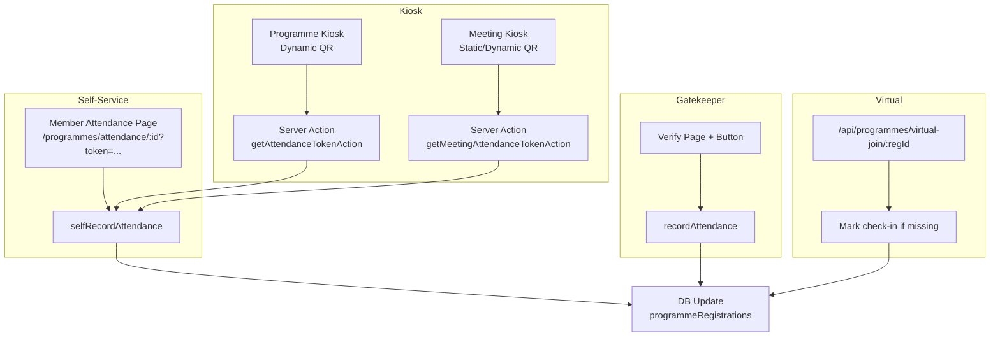
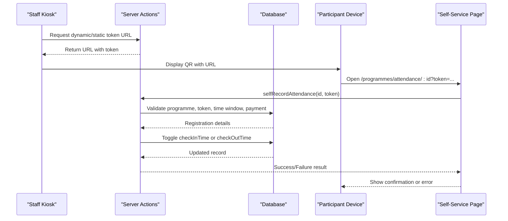
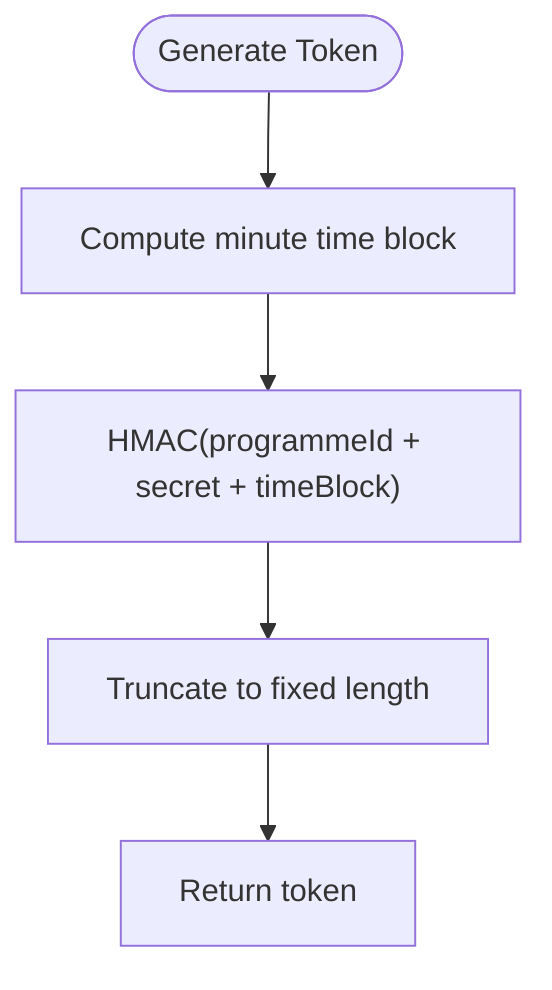
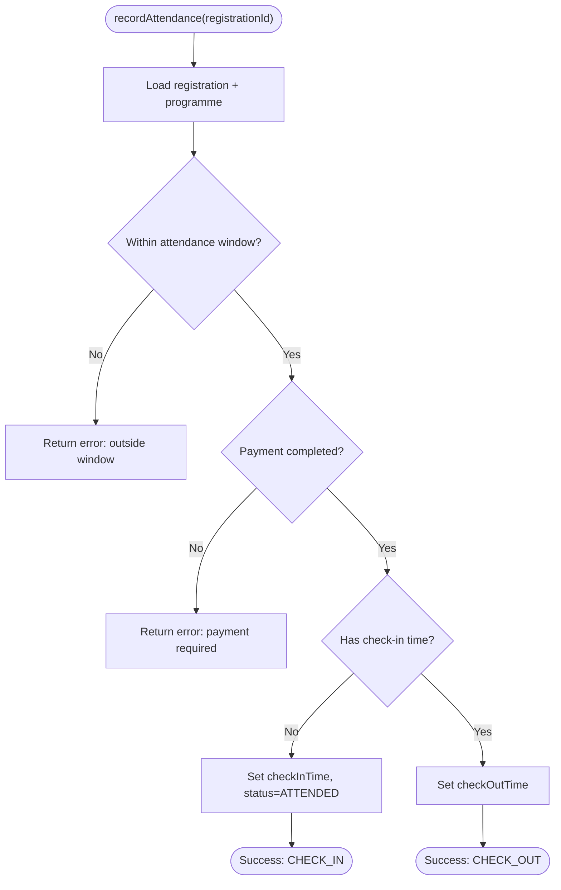
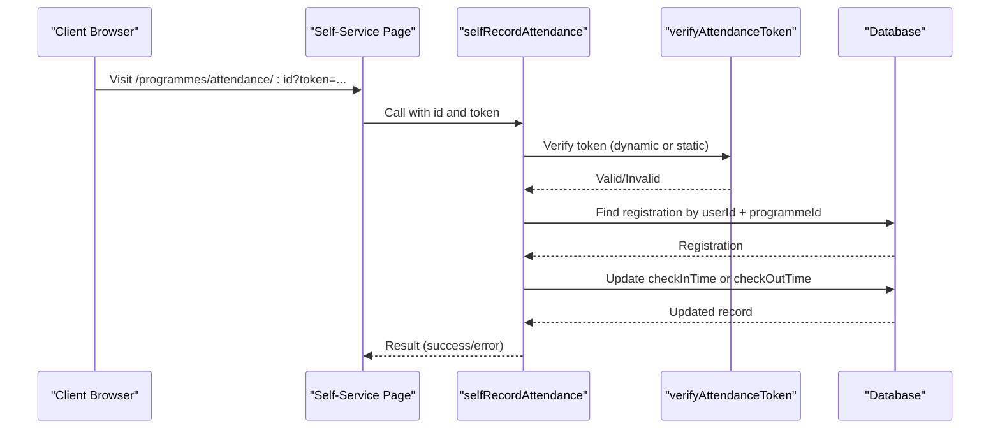
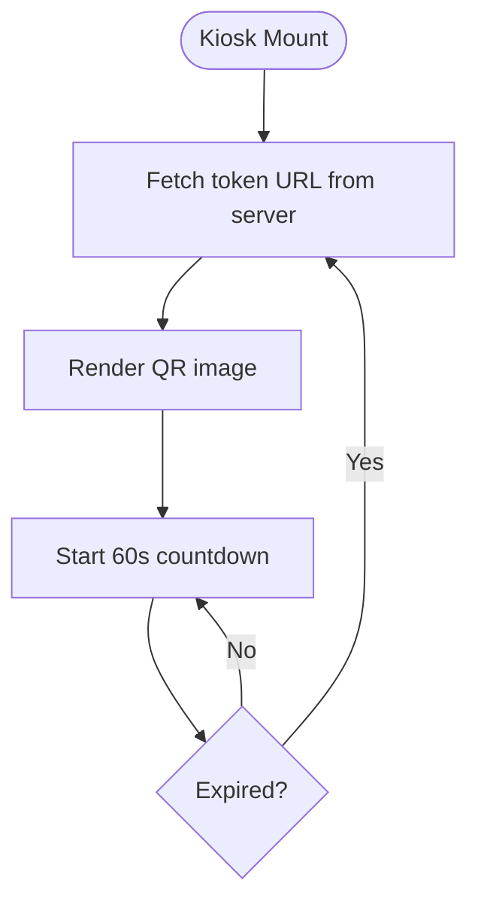
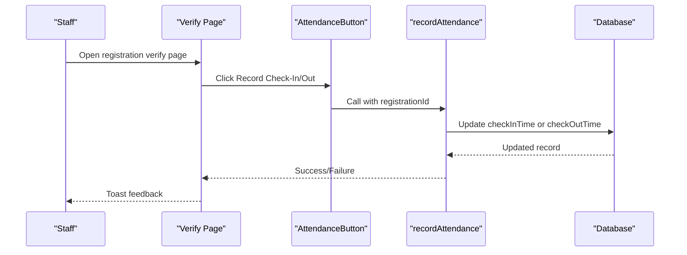
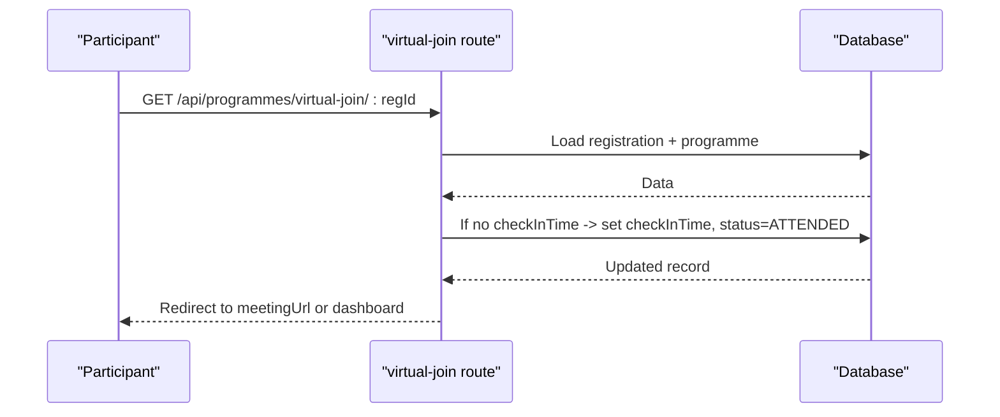
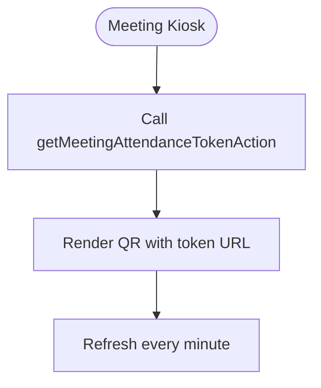
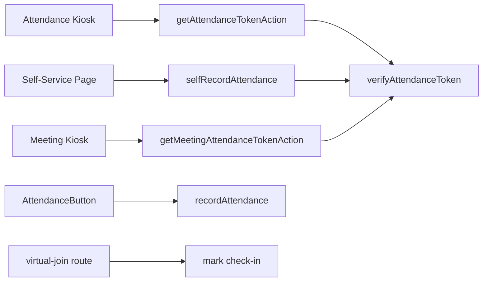

# Attendance Tracking & Check-in

<cite>
**Referenced Files in This Document**
- [lib/attendance-token.ts](file://lib/attendance-token.ts)
- [lib/actions/programmes.ts](file://lib/actions/programmes.ts)
- [components/admin/programmes/attendance-kiosk.tsx](file://components/admin/programmes/attendance-kiosk.tsx)
- [app/programmes/attendance/[id]/page.tsx](file://app/programmes/attendance/[id]/page.tsx)
- [components/programmes/attendance-button.tsx](file://components/programmes/attendance-button.tsx)
- [components/admin/programmes/reset-attendance-button.tsx](file://components/admin/programmes/reset-attendance-button.tsx)
- [components/admin/programmes/export-csv.tsx](file://components/admin/programmes/export-csv.tsx)
- [components/admin/programmes/qr-scanner.tsx](file://components/admin/programmes/qr-scanner.tsx)
- [app/api/programmes/virtual-join/[registrationId]/route.ts](file://app/api/programmes/virtual-join/[registrationId]/route.ts)
- [components/admin/meetings/meeting-attendance-kiosk.tsx](file://components/admin/meetings/meeting-attendance-kiosk.tsx)
- [lib/actions/meetings.ts](file://lib/actions/meetings.ts)
</cite>

## Table of Contents
1. Introduction
2. Project Structure
3. Core Components
4. Architecture Overview
5. Detailed Component Analysis
6. Dependency Analysis
7. Performance Considerations
8. Troubleshooting Guide
9. Conclusion

## Introduction
This document explains the attendance tracking and check-in system for programmes and meetings. It covers multiple recording methods (QR code scanning, manual check-in via gatekeeper UI, and self-service attendance using static tokens), the attendance window that controls when participants can check in/out, dual scan support for measuring actual participation duration, security features (token-based verification, time restrictions, payment verification), kiosk mode for staff, reset functionality, error handling, offline considerations, QR generation and scanner usage, reporting, and integration with virtual program attendance.

## Project Structure
The attendance system spans server actions, client components, API routes, and token utilities:
- Token generation and verification are centralized to ensure secure, time-bound access.
- Programme attendance is recorded through both gatekeeper flows and self-service flows.
- Kiosk components display rotating QR codes for dynamic tokens or static tokens for self-service.
- Virtual join flow automatically records attendance when users enter a virtual room.
- Meetings have their own kiosk and token generation aligned with programme patterns.

**Diagram sources**
- [components/admin/programmes/attendance-kiosk.tsx:12-21](file://components/admin/programmes/attendance-kiosk.tsx#L12-L21)
- [lib/actions/programmes.ts:218-227](file://lib/actions/programmes.ts#L218-L227)
- [lib/actions/meetings.ts:59-100](file://lib/actions/meetings.ts#L59-L100)
- [app/programmes/attendance/[id]/page.tsx:15-43](file://app/programmes/attendance/[id]/page.tsx#L15-L43)
- [lib/actions/programmes.ts:121-190](file://lib/actions/programmes.ts#L121-L190)
- [components/programmes/attendance-button.tsx:17-31](file://components/programmes/attendance-button.tsx#L17-L31)
- [lib/actions/programmes.ts:33-97](file://lib/actions/programmes.ts#L33-L97)
- [app/api/programmes/virtual-join/[registrationId]/route.ts:6-40](file://app/api/programmes/virtual-join/[registrationId]/route.ts#L6-L40)

**Section sources**
- [components/admin/programmes/attendance-kiosk.tsx:1-106](file://components/admin/programmes/attendance-kiosk.tsx#L1-L106)
- [lib/actions/programmes.ts:33-97](file://lib/actions/programmes.ts#L33-L97)
- [lib/actions/programmes.ts:121-190](file://lib/actions/programmes.ts#L121-L190)
- [app/api/programmes/virtual-join/[registrationId]/route.ts:6-40](file://app/api/programmes/virtual-join/[registrationId]/route.ts#L6-L40)

## Core Components
- Dynamic token generator and verifier: Produces minute-based HMAC tokens and validates them within a short window to prevent replay attacks.
- Programme attendance server actions: Enforce attendance windows, payment status, and toggle between check-in and check-out on repeated scans.
- Self-service attendance page: Validates session, token (dynamic or static), time window, and updates attendance accordingly.
- Gatekeeper button: Allows staff to manually record check-in/check-out for a registration.
- Kiosk components: Display rotating QR codes for dynamic tokens or static tokens; refresh every minute for security.
- Virtual join route: Automatically marks check-in when a registered user joins a virtual session.
- Reset attendance: Admin action to clear check-in/out timestamps and revert status.
- Reporting and export: CSV export includes attendance timestamps and responsible parties.

**Section sources**
- [lib/attendance-token.ts:1-41](file://lib/attendance-token.ts#L1-L41)
- [lib/actions/programmes.ts:33-97](file://lib/actions/programmes.ts#L33-L97)
- [lib/actions/programmes.ts:121-190](file://lib/actions/programmes.ts#L121-L190)
- [components/programmes/attendance-button.tsx:1-63](file://components/programmes/attendance-button.tsx#L1-L63)
- [components/admin/programmes/attendance-kiosk.tsx:1-106](file://components/admin/programmes/attendance-kiosk.tsx#L1-L106)
- [app/programmes/attendance/[id]/page.tsx:1-101](file://app/programmes/attendance/[id]/page.tsx#L1-L101)
- [app/api/programmes/virtual-join/[registrationId]/route.ts:1-46](file://app/api/programmes/virtual-join/[registrationId]/route.ts#L1-L46)
- [components/admin/programmes/reset-attendance-button.tsx:1-66](file://components/admin/programmes/reset-attendance-button.tsx#L1-L66)
- [components/admin/programmes/export-csv.tsx:1-64](file://components/admin/programmes/export-csv.tsx#L1-L64)

## Architecture Overview
The system supports three primary flows:
- Kiosk-driven QR scanning: Staff displays a dynamic or static QR; participants scan to open a self-service page that validates token and time window before recording attendance.
- Manual gatekeeper check-in/out: Staff uses a verify page and button to toggle attendance for a registration.
- Virtual join auto-check-in: When a registered participant enters a virtual room, the system marks them as attended if not already checked in.

Security and constraints:
- Tokens: Dynamic tokens change per minute using HMAC; static tokens are permanent but tied to a specific programme/meeting.
- Time window: Attendance is allowed only within a configurable window before start and until end date/time.
- Payment gate: Pending payments block attendance recording.
- Session checks: Self-service requires an authenticated session.

**Diagram sources**
- [components/admin/programmes/attendance-kiosk.tsx:12-21](file://components/admin/programmes/attendance-kiosk.tsx#L12-L21)
- [lib/actions/programmes.ts:218-227](file://lib/actions/programmes.ts#L218-L227)
- [app/programmes/attendance/[id]/page.tsx:15-43](file://app/programmes/attendance/[id]/page.tsx#L15-L43)
- [lib/actions/programmes.ts:121-190](file://lib/actions/programmes.ts#L121-L190)

## Detailed Component Analysis

### Dynamic Token System
- Generates a short-lived token based on programme ID and current minute using HMAC-SHA256.
- Verifies tokens against current and previous minute blocks to tolerate minor network delays.
- Used by kiosk to produce URLs that encode the token for self-service pages.

**Diagram sources**
- [lib/attendance-token.ts:7-17](file://lib/attendance-token.ts#L7-L17)
- [lib/attendance-token.ts:23-41](file://lib/attendance-token.ts#L23-L41)

**Section sources**
- [lib/attendance-token.ts:1-41](file://lib/attendance-token.ts#L1-L41)

### Programme Attendance Recording (Gatekeeper)
- Enforces attendance window relative to programme start/end.
- Requires payment completion before allowing check-in.
- First scan sets check-in time and status; second scan sets check-out time.

**Diagram sources**
- [lib/actions/programmes.ts:33-97](file://lib/actions/programmes.ts#L33-L97)

**Section sources**
- [lib/actions/programmes.ts:33-97](file://lib/actions/programmes.ts#L33-L97)

### Self-Service Attendance via Static/Dynamic Tokens
- Validates session and token (dynamic first, then static fallback).
- Confirms registration exists for the current user and programme.
- Applies same time window and payment checks as gatekeeper flow.
- Records either check-in or check-out depending on existing timestamps.

**Diagram sources**
- [app/programmes/attendance/[id]/page.tsx:15-43](file://app/programmes/attendance/[id]/page.tsx#L15-L43)
- [lib/actions/programmes.ts:121-190](file://lib/actions/programmes.ts#L121-L190)
- [lib/attendance-token.ts:23-41](file://lib/attendance-token.ts#L23-L41)

**Section sources**
- [app/programmes/attendance/[id]/page.tsx:1-101](file://app/programmes/attendance/[id]/page.tsx#L1-L101)
- [lib/actions/programmes.ts:121-190](file://lib/actions/programmes.ts#L121-L190)

### Kiosk Mode for Large-Scale Check-ins
- Displays a large, readable QR code that encodes a secure URL with a dynamic or static token.
- Refreshes token every minute to mitigate reuse risks.
- Provides visual countdown and status indicators for staff.

**Diagram sources**
- [components/admin/programmes/attendance-kiosk.tsx:12-35](file://components/admin/programmes/attendance-kiosk.tsx#L12-L35)
- [components/admin/meetings/meeting-attendance-kiosk.tsx:12-35](file://components/admin/meetings/meeting-attendance-kiosk.tsx#L12-L35)

**Section sources**
- [components/admin/programmes/attendance-kiosk.tsx:1-106](file://components/admin/programmes/attendance-kiosk.tsx#L1-L106)
- [components/admin/meetings/meeting-attendance-kiosk.tsx:1-68](file://components/admin/meetings/meeting-attendance-kiosk.tsx#L1-L68)

### Manual Check-In/Out via Gatekeeper
- On the verify page, authenticated staff see a button to toggle attendance for a registration.
- The button calls the server action to set check-in or check-out based on existing timestamps.

**Diagram sources**
- [components/programmes/attendance-button.tsx:17-31](file://components/programmes/attendance-button.tsx#L17-L31)
- [lib/actions/programmes.ts:33-97](file://lib/actions/programmes.ts#L33-L97)

**Section sources**
- [components/programmes/attendance-button.tsx:1-63](file://components/programmes/attendance-button.tsx#L1-L63)
- [lib/actions/programmes.ts:33-97](file://lib/actions/programmes.ts#L33-L97)

### Virtual Program Attendance Integration
- When a registered participant accesses the virtual join endpoint, the system marks them as attended if they haven’t checked in yet.
- Redirects to the meeting URL or dashboard fallback.

**Diagram sources**
- [app/api/programmes/virtual-join/[registrationId]/route.ts:6-40](file://app/api/programmes/virtual-join/[registrationId]/route.ts#L6-L40)

**Section sources**
- [app/api/programmes/virtual-join/[registrationId]/route.ts:1-46](file://app/api/programmes/virtual-join/[registrationId]/route.ts#L1-L46)

### Meeting Attendance Kiosk and Token Generation
- Meeting kiosk mirrors programme kiosk behavior, generating tokens via meeting-specific actions.
- Meetings store static attendance tokens and share codes for guest access.

**Diagram sources**
- [components/admin/meetings/meeting-attendance-kiosk.tsx:12-35](file://components/admin/meetings/meeting-attendance-kiosk.tsx#L12-L35)
- [lib/actions/meetings.ts:59-100](file://lib/actions/meetings.ts#L59-L100)

**Section sources**
- [components/admin/meetings/meeting-attendance-kiosk.tsx:1-68](file://components/admin/meetings/meeting-attendance-kiosk.tsx#L1-L68)
- [lib/actions/meetings.ts:59-100](file://lib/actions/meetings.ts#L59-L100)

### Attendance Reset Functionality
- Admin can reset attendance for a registration, clearing check-in/out times and reverting status to paid.
- Protected by authentication and confirmation dialog.

**Section sources**
- [components/admin/programmes/reset-attendance-button.tsx:1-66](file://components/admin/programmes/reset-attendance-button.tsx#L1-L66)
- [lib/actions/programmes.ts:101-119](file://lib/actions/programmes.ts#L101-L119)

### Reporting and Export
- CSV export includes attendance timestamps and who recorded them, enabling post-event analysis.

**Section sources**
- [components/admin/programmes/export-csv.tsx:1-64](file://components/admin/programmes/export-csv.tsx#L1-L64)

### Scanner Implementation
- QR scanner component decodes registration IDs or URLs and triggers verification flow.
- Supports resetting scanner state after processing.

**Section sources**
- [components/admin/programmes/qr-scanner.tsx:37-222](file://components/admin/programmes/qr-scanner.tsx#L37-L222)

## Dependency Analysis
Key dependencies and relationships:
- Kiosk components depend on server actions to generate token URLs.
- Self-service page depends on token verification and attendance actions.
- Gatekeeper button depends on attendance actions and database updates.
- Virtual join route depends on registration and programme data to mark attendance.
- Token utility is shared across programme and meeting flows.

**Diagram sources**
- [components/admin/programmes/attendance-kiosk.tsx:12-21](file://components/admin/programmes/attendance-kiosk.tsx#L12-L21)
- [components/admin/meetings/meeting-attendance-kiosk.tsx:12-35](file://components/admin/meetings/meeting-attendance-kiosk.tsx#L12-L35)
- [lib/actions/programmes.ts:218-227](file://lib/actions/programmes.ts#L218-L227)
- [lib/actions/meetings.ts:59-100](file://lib/actions/meetings.ts#L59-L100)
- [app/programmes/attendance/[id]/page.tsx:15-43](file://app/programmes/attendance/[id]/page.tsx#L15-L43)
- [lib/actions/programmes.ts:121-190](file://lib/actions/programmes.ts#L121-L190)
- [components/programmes/attendance-button.tsx:17-31](file://components/programmes/attendance-button.tsx#L17-L31)
- [lib/actions/programmes.ts:33-97](file://lib/actions/programmes.ts#L33-L97)
- [app/api/programmes/virtual-join/[registrationId]/route.ts:6-40](file://app/api/programmes/virtual-join/[registrationId]/route.ts#L6-L40)
- [lib/attendance-token.ts:23-41](file://lib/attendance-token.ts#L23-L41)

**Section sources**
- [lib/attendance-token.ts:1-41](file://lib/attendance-token.ts#L1-L41)
- [lib/actions/programmes.ts:33-97](file://lib/actions/programmes.ts#L33-L97)
- [lib/actions/programmes.ts:121-190](file://lib/actions/programmes.ts#L121-L190)
- [app/api/programmes/virtual-join/[registrationId]/route.ts:6-40](file://app/api/programmes/virtual-join/[registrationId]/route.ts#L6-L40)

## Performance Considerations
- Token rotation every minute reduces risk of replay while keeping QR usability high.
- Minimal client-side work: QR rendering relies on a lightweight external service; server handles validation and DB updates.
- Avoid redundant scans by toggling between check-in and check-out states; subsequent scans update only the missing timestamp.
- For large events, prefer kiosk mode with rotating QR to streamline throughput and reduce manual errors.

[No sources needed since this section provides general guidance]

## Troubleshooting Guide
Common issues and resolutions:
- Invalid or expired QR: Ensure the kiosk is displaying the current QR; tokens refresh every minute.
- Outside attendance window: Adjust programme start/end times or attendance window settings; attendance is blocked outside configured limits.
- Payment pending: Complete payment before attempting check-in; pending payments block attendance recording.
- Duplicate scans: After check-in, next scan records check-out; after both are set, further scans return an error indicating completion.
- Offline capability: Attendance recording requires network connectivity to validate tokens and update the database; plan for online-only operation at venue.

**Section sources**
- [lib/actions/programmes.ts:33-97](file://lib/actions/programmes.ts#L33-L97)
- [lib/actions/programmes.ts:121-190](file://lib/actions/programmes.ts#L121-L190)
- [app/programmes/attendance/[id]/page.tsx:25-43](file://app/programmes/attendance/[id]/page.tsx#L25-L43)

## Conclusion
The attendance system provides robust, secure, and flexible check-in/out capabilities for both physical and virtual programmes. It supports dynamic and static tokens, enforces time windows and payment requirements, and offers efficient kiosk and manual workflows. Dual scan tracking enables accurate measurement of participation duration, while reporting tools facilitate post-event analysis. Integrating virtual join flows ensures consistent attendance tracking across modalities.

[No sources needed since this section summarizes without analyzing specific files]