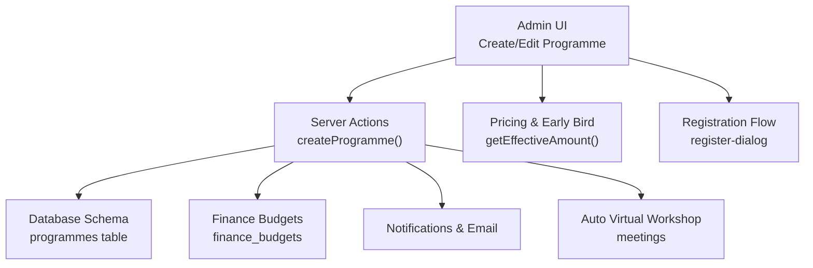
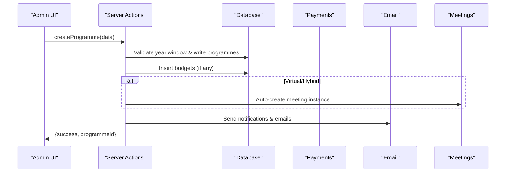
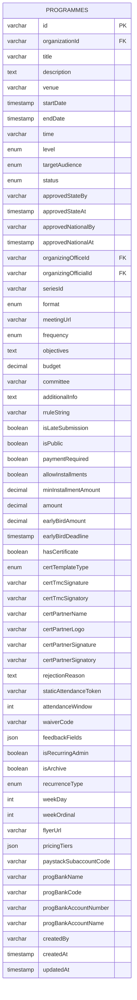
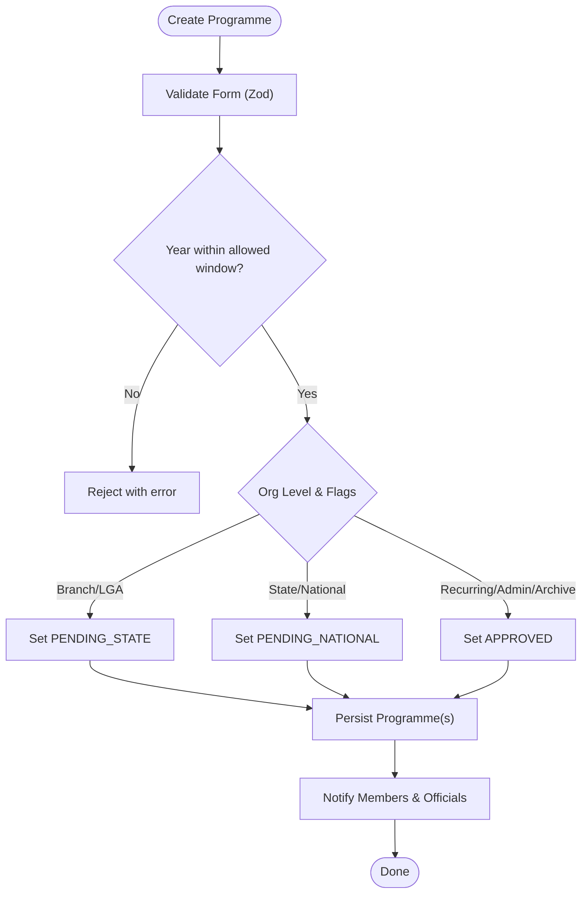
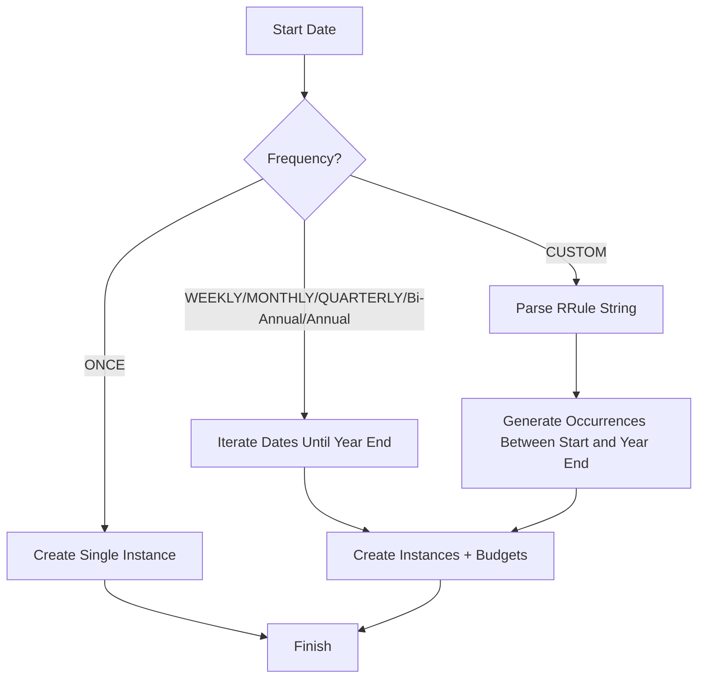
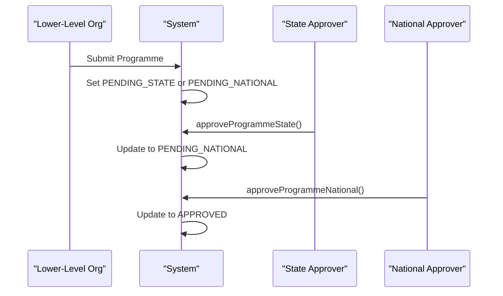
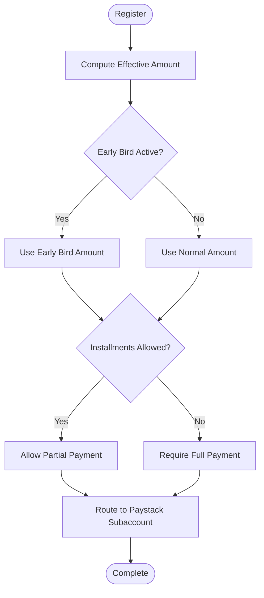
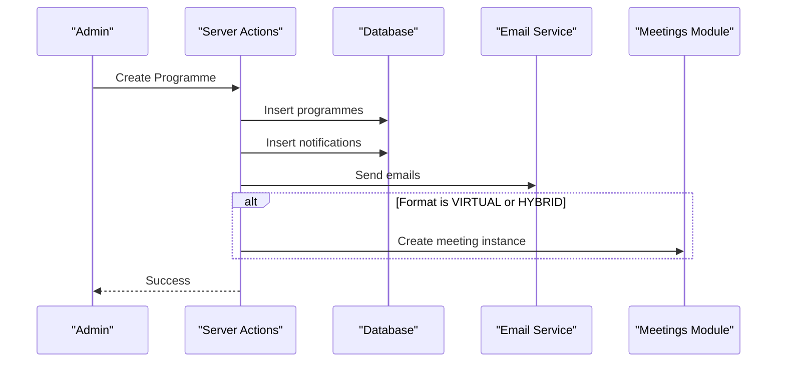
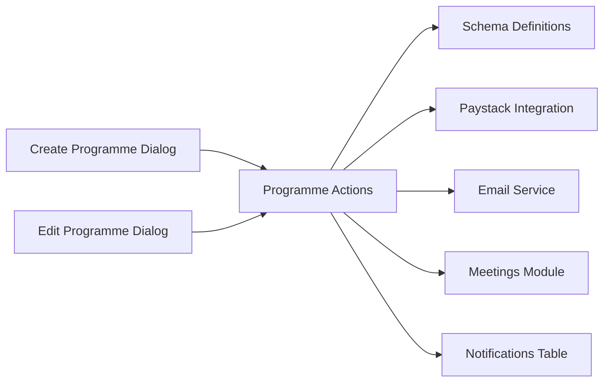

# Program Creation & Scheduling

<cite>
**Referenced Files in This Document**
- [schema.ts](file://lib/db/schema.ts)
- [programmes.ts](file://lib/actions/programmes.ts)
- [create-programme-dialog.tsx](file://components/admin/programmes/create-programme-dialog.tsx)
- [edit-programme-dialog.tsx](file://components/admin/programmes/edit-programme-dialog.tsx)
- [programme-grid.tsx](file://components/programmes/programme-grid.tsx)
- [register-dialog.tsx](file://components/programmes/register-dialog.tsx)
- [pricing.ts](file://lib/pricing.ts)
- [email.ts](file://lib/email.ts)
- [meetings.ts](file://lib/actions/meetings.ts)
- [create-meeting-dialog.tsx](file://components/meetings/create-meeting-dialog.tsx)
- [0012_programme_recurrence.sql](file://drizzle/0012_programme_recurrence.sql)
- [0005_add_early_bird.sql](file://drizzle/0005_add_early_bird.sql)
</cite>

## Table of Contents
1. Introduction
2. Project Structure
3. Core Components
4. Architecture Overview
5. Detailed Component Analysis
6. Dependency Analysis
7. Performance Considerations
8. Troubleshooting Guide
9. Conclusion

## Introduction
This document explains the program creation and scheduling system in TMC Portal end-to-end: from initial creation through approval workflows, recurring schedules using RRule, pricing with early bird and installments, budget allocation, notifications, calendar integration, validation rules, date constraints, and capacity management. It is designed for both technical and non-technical readers to understand how programs are modeled, approved across organizational levels (National, State, Local Government, Branch), and executed with payments and attendance controls.

## Project Structure
Programs are defined by a central schema and managed via server actions and admin UI components. Recurring programs use RRule-based generation. Payments integrate with Paystack, and virtual/hybrid formats auto-create meetings. Notifications are sent to members and officials upon creation.

**Diagram sources**
- [programmes.ts:400-756](file://lib/actions/programmes.ts#L400-L756)
- [schema.ts:1017-1089](file://lib/db/schema.ts#L1017-L1089)
- [create-programme-dialog.tsx:57-103](file://components/admin/programmes/create-programme-dialog.tsx#L57-L103)
- [pricing.ts:1-29](file://lib/pricing.ts#L1-L29)
- [register-dialog.tsx:148-187](file://components/programmes/register-dialog.tsx#L148-L187)

**Section sources**
- [schema.ts:1017-1089](file://lib/db/schema.ts#L1017-L1089)
- [programmes.ts:400-756](file://lib/actions/programmes.ts#L400-L756)
- [create-programme-dialog.tsx:57-103](file://components/admin/programmes/create-programme-dialog.tsx#L57-L103)

## Core Components
- Program model fields include title, description, venue, start/end dates, time, target audience, format (Physical/Virtual/Hybrid), frequency and recurrence (RRule), objectives, budget, committee, payment settings (amount, installments, early bird), certificate options, and metadata like organizer office/official and seriesId for recurring grouping.
- Approval workflow sets initial status based on organization level:
  - Branch or Local Government → PENDING_STATE
  - State or National → PENDING_NATIONAL
  - Recurring admin or archived past activities → APPROVED
- Recurring support uses RRule for weekly, monthly, quarterly, bi-annual, annual, and custom patterns; also supports “nth weekday of month” via BYSETPOS.
- Payment features:
  - Early bird amount and deadline with effective price calculation
  - Installment option with minimum installment amount
  - Per-programme Paystack subaccount routing when custom bank details are provided
- Notifications:
  - In-app notifications to members and officials within the organizing organization
  - Email invitations with programme details
- Calendar integration:
  - Virtual/Hybrid programmes auto-create a meeting instance linked to the programme
  - Meetings module supports RRule-based recurrence similar to Google Calendar

**Section sources**
- [schema.ts:1017-1089](file://lib/db/schema.ts#L1017-L1089)
- [programmes.ts:423-441](file://lib/actions/programmes.ts#L423-L441)
- [programmes.ts:577-673](file://lib/actions/programmes.ts#L577-L673)
- [programmes.ts:696-736](file://lib/actions/programmes.ts#L696-L736)
- [programmes.ts:778-813](file://lib/actions/programmes.ts#L778-L813)
- [pricing.ts:1-29](file://lib/pricing.ts#L1-L29)
- [create-meeting-dialog.tsx:323-350](file://components/meetings/create-meeting-dialog.tsx#L323-L350)

## Architecture Overview
The system follows a layered architecture:
- UI layer: Admin dialogs for creating/editing programmes and registration flows
- Server actions: Validation, business logic, database writes, notifications, and integrations
- Data layer: Drizzle ORM schema definitions and relational tables
- Integrations: Paystack for payments, email service for notifications, meetings module for virtual rooms

**Diagram sources**
- [programmes.ts:400-756](file://lib/actions/programmes.ts#L400-L756)
- [programmes.ts:778-813](file://lib/actions/programmes.ts#L778-L813)
- [email.ts:369-386](file://lib/email.ts#L369-L386)

## Detailed Component Analysis

### Program Model and Fields
The programmes table defines all core attributes required for lifecycle management, scheduling, payments, and reporting. Key fields include:
- Identification and ownership: id, organizationId, createdBy
- Content: title, description, venue, objectives, committee, additionalInfo
- Scheduling: startDate, endDate, time, format, meetingUrl, frequency, rruleString, recurrenceType, weekDay, weekOrdinal
- Status and approvals: status, approvedStateBy, approvedStateAt, approvedNationalBy, approvedNationalAt, rejectionReason
- Financials: paymentRequired, allowInstallments, minInstallmentAmount, amount, earlyBirdAmount, earlyBirdDeadline, pricingTiers, paystackSubaccountCode, bank details
- Operational: isPublic, isLateSubmission, isArchive, isRecurringAdmin, staticAttendanceToken, attendanceWindow, waiverCode, flyerUrl
- Metadata: seriesId for recurring grouping, certTemplateType and partner/TMC signature fields

**Diagram sources**
- [schema.ts:1017-1089](file://lib/db/schema.ts#L1017-L1089)

**Section sources**
- [schema.ts:1017-1089](file://lib/db/schema.ts#L1017-L1089)

### Creation Workflow and Validation
- Input validation via Zod schema ensures required fields such as title, description, venue, organizationId, startDate, and targetAudience are present and correctly typed.
- Year planner constraints enforce submission windows:
  - Active year submissions allowed (marked late if during the year)
  - Next year submissions allowed only when open and before deadline
  - Past activity archival restricted to authorized staff and within archive window
- Initial status assignment depends on organization level and flags:
  - Branch/LGA → PENDING_STATE
  - State/National → PENDING_NATIONAL
  - Recurring admin or archived → APPROVED

**Diagram sources**
- [create-programme-dialog.tsx:57-103](file://components/admin/programmes/create-programme-dialog.tsx#L57-L103)
- [programmes.ts:370-441](file://lib/actions/programmes.ts#L370-L441)

**Section sources**
- [create-programme-dialog.tsx:57-103](file://components/admin/programmes/create-programme-dialog.tsx#L57-L103)
- [programmes.ts:370-441](file://lib/actions/programmes.ts#L370-L441)

### Recurring Programs with RRule
- Supports ONCE, WEEKLY, MONTHLY, QUARTERLY, BI-ANNUALLY, ANNUALLY, and CUSTOM (RRule string).
- For “nth weekday of month,” uses RRule with BYDAY and BYSETPOS to generate occurrences up to the end of the programme’s year.
- Custom RRule strings are parsed and expanded into multiple programme instances, each with computed end times based on original duration.
- Budget entries are created per instance when budget > 0.

**Diagram sources**
- [programmes.ts:577-673](file://lib/actions/programmes.ts#L577-L673)
- [0012_programme_recurrence.sql](file://drizzle/0012_programme_recurrence.sql)

**Section sources**
- [programmes.ts:577-673](file://lib/actions/programmes.ts#L577-L673)
- [0012_programme_recurrence.sql](file://drizzle/0012_programme_recurrence.sql)

### Approval Workflow Across Organizational Levels
- Lower-level organizations submit programmes that require higher-level approval:
  - Branch/LGA → State approval (PENDING_STATE)
  - State/National → National approval (PENDING_NATIONAL)
- Approvals update status and record approver identity and timestamps.
- Self-approval prevention enforced at National level unless super admin.

**Diagram sources**
- [programmes.ts:423-441](file://lib/actions/programmes.ts#L423-L441)
- [programmes.ts:758-776](file://lib/actions/programmes.ts#L758-L776)
- [programmes.ts:815-853](file://lib/actions/programmes.ts#L815-L853)

**Section sources**
- [programmes.ts:423-441](file://lib/actions/programmes.ts#L423-L441)
- [programmes.ts:758-776](file://lib/actions/programmes.ts#L758-L776)
- [programmes.ts:815-853](file://lib/actions/programmes.ts#L815-L853)

### Pricing, Early Bird, and Installments
- Early bird pricing:
  - Effective amount determined by comparing current time to early bird deadline
  - UI shows early bird label and fallback to normal amount after deadline
- Installments:
  - Allow partial payments with configurable minimum installment amount
  - Registration UI offers full or installment options
- Per-programme payment routing:
  - Optional Paystack subaccount creation when custom bank details are provided

**Diagram sources**
- [pricing.ts:1-29](file://lib/pricing.ts#L1-L29)
- [register-dialog.tsx:148-187](file://components/programmes/register-dialog.tsx#L148-L187)
- [programmes.ts:471-488](file://lib/actions/programmes.ts#L471-L488)

**Section sources**
- [pricing.ts:1-29](file://lib/pricing.ts#L1-L29)
- [register-dialog.tsx:148-187](file://components/programmes/register-dialog.tsx#L148-L187)
- [programmes.ts:471-488](file://lib/actions/programmes.ts#L471-L488)

### Budget Allocation
- When a budget is specified for a programme, a corresponding finance budget entry is created per instance with an approved status.
- Budgets are tied to the organisation and year, enabling financial tracking per programme occurrence.

**Section sources**
- [programmes.ts:562-575](file://lib/actions/programmes.ts#L562-L575)
- [schema.ts:1195-1199](file://lib/db/schema.ts#L1195-L1199)

### Notifications and Calendar Integration
- On creation, in-app notifications are inserted for members and officials within the organizing organization.
- Emails are dispatched with programme details and links to view in dashboard.
- Virtual/Hybrid programmes automatically create a meeting instance with share codes and recording access.

**Diagram sources**
- [programmes.ts:696-736](file://lib/actions/programmes.ts#L696-L736)
- [programmes.ts:778-813](file://lib/actions/programmes.ts#L778-L813)
- [email.ts:369-386](file://lib/email.ts#L369-L386)

**Section sources**
- [programmes.ts:696-736](file://lib/actions/programmes.ts#L696-L736)
- [programmes.ts:778-813](file://lib/actions/programmes.ts#L778-L813)
- [email.ts:369-386](file://lib/email.ts#L369-L386)

### Attendance and Capacity Management
- Attendance window:
  - Check-in opens configured hours before start and closes at end date or day boundary
  - Requires payment completion before check-in
- Static vs dynamic tokens:
  - Supports static attendance token for self-check-in flows
  - Dynamic QR-based scanning supported via separate utilities
- Capacity:
  - No explicit capacity cap field in the programmes schema; capacity enforcement would be implemented via registration limits or external checks not shown here

**Section sources**
- [programmes.ts:33-97](file://lib/actions/programmes.ts#L33-L97)
- [programmes.ts:121-190](file://lib/actions/programmes.ts#L121-L190)
- [schema.ts:1069-1071](file://lib/db/schema.ts#L1069-L1071)

### Templates and Examples
- Program templates can be built using the create/edit dialogs with predefined tier labels and common configurations:
  - Target audiences: PUBLIC, MEMBERS, BROTHERS, SISTERS, CHILDREN, YOUTH, ELDERS
  - Formats: PHYSICAL, VIRTUAL, HYBRID
  - Frequencies: ONCE, WEEKLY, MONTHLY, QUARTERLY, BI-ANNUALLY, ANNUALLY, CUSTOM
  - Early bird and installment toggles
  - Certificate template types and partner branding
- Example usage paths:
  - Create new programme via admin dialog
  - Edit existing programme to adjust pricing, schedule, and approvals
  - View programme listings and quick actions

**Section sources**
- [create-programme-dialog.tsx:57-103](file://components/admin/programmes/create-programme-dialog.tsx#L57-L103)
- [edit-programme-dialog.tsx:49-68](file://components/admin/programmes/edit-programme-dialog.tsx#L49-L68)
- [programme-grid.tsx:59-80](file://components/programmes/programme-grid.tsx#L59-L80)

## Dependency Analysis
- UI components depend on server actions for data mutations and validations.
- Server actions depend on schema definitions for type-safe queries and inserts.
- Recurrence relies on RRule parsing and iteration to expand schedules.
- Payments depend on Paystack integration for subaccounts and verification.
- Notifications rely on internal notification table and email service.

**Diagram sources**
- [create-programme-dialog.tsx:57-103](file://components/admin/programmes/create-programme-dialog.tsx#L57-L103)
- [edit-programme-dialog.tsx:49-68](file://components/admin/programmes/edit-programme-dialog.tsx#L49-L68)
- [programmes.ts:400-756](file://lib/actions/programmes.ts#L400-L756)
- [schema.ts:1017-1089](file://lib/db/schema.ts#L1017-L1089)

**Section sources**
- [create-programme-dialog.tsx:57-103](file://components/admin/programmes/create-programme-dialog.tsx#L57-L103)
- [edit-programme-dialog.tsx:49-68](file://components/admin/programmes/edit-programme-dialog.tsx#L49-L68)
- [programmes.ts:400-756](file://lib/actions/programmes.ts#L400-L756)
- [schema.ts:1017-1089](file://lib/db/schema.ts#L1017-L1089)

## Performance Considerations
- Recurrence expansion:
  - Generating many instances can be CPU-intensive; ensure RRule bounds are reasonable (e.g., up to year end) and avoid overly dense schedules.
- Database writes:
  - Batch insertions for programme instances and budgets reduce round-trips.
- Notifications:
  - Asynchronous email dispatch avoids blocking creation flow.
- Payments:
  - Subaccount creation should be retried or logged on failure without halting programme creation.

[No sources needed since this section provides general guidance]

## Troubleshooting Guide
- Validation errors:
  - Ensure all required fields are filled and dates are valid; Zod errors will list missing or invalid fields.
- Year window restrictions:
  - If submissions are rejected, verify active year and next-year deadlines in year planner settings.
- Approval issues:
  - Self-approval at National level is blocked; assign another approver or use super admin.
- Recurrence failures:
  - Invalid RRule strings will be logged; correct the rule syntax or choose a supported frequency.
- Payment routing:
  - If custom bank details are provided but subaccount creation fails, payments may fall back to default routing; check logs and retry.

**Section sources**
- [programmes.ts:741-755](file://lib/actions/programmes.ts#L741-L755)
- [programmes.ts:815-853](file://lib/actions/programmes.ts#L815-L853)
- [programmes.ts:620-658](file://lib/actions/programmes.ts#L620-L658)

## Conclusion
The TMC Portal program creation and scheduling system provides a robust, hierarchical approval workflow, flexible recurring schedules via RRule, comprehensive pricing with early bird and installments, integrated budgeting, automated notifications, and calendar-friendly virtual workshop creation. The design balances usability in the admin UI with strong server-side validation and clear data models, ensuring reliable execution across National, State, Local Government, and Branch levels.