# Program Management

<cite>
**Referenced Files in This Document**
- [schema.prisma](file://prisma/schema.prisma)
- [programmes.ts](file://lib/actions/programmes.ts)
- [meetings.ts](file://lib/actions/meetings.ts)
- [scheduler.ts](file://workers/scheduler.ts)
- [programme-bulk.ts](file://lib/actions/programme-bulk.ts)
- [route.ts (certificate)](file://app/api/programmes/registrations/[id]/certificate/route.ts)
- [attendance-kiosk.tsx](file://components/admin/programmes/attendance-kiosk.tsx)
- [meeting-attendance-kiosk.tsx](file://components/admin/meetings/meeting-attendance-kiosk.tsx)
- [page.tsx (programmes attendance)](file://app/programmes/attendance/[id]/page.tsx)
- [page.tsx (meetings attendance)](file://app/meetings/attendance/[id]/page.tsx)
- [programme-materials-manager.tsx](file://components/admin/programmes/programme-materials-manager.tsx)
- [programme-materials-download.tsx](file://components/programme/programme-materials-download.tsx)
- [analytics.ts](file://lib/actions/analytics.ts)
- [page.tsx (feedback analytics)](file://app/dashboard/admin/programmes/[id]/feedback/page.tsx)
- [verify route.ts](file://app/api/payments/verify/route.ts)
- [client.tsx (payment callback)](file://app/dashboard/payments/callback/client.tsx)
- [resume-payment-button.tsx](file://components/programmes/resume-payment-button.tsx)
</cite>

## Table of Contents
1. Introduction
2. Project Structure
3. Core Components
4. Architecture Overview
5. Detailed Component Analysis
6. Dependency Analysis
7. Performance Considerations
8. Troubleshooting Guide
9. Conclusion
10. Appendices

## Introduction
This document explains the TMC Portal program management system with a focus on event scheduling, registration, and attendance tracking. It covers the program model including recurring events, capacity considerations, and resource allocation; the full lifecycle from creation to completion; registration flows for individuals and groups with payment integration; attendance via QR scanning and manual check-in; materials management; feedback collection; certificate generation; analytics; bulk operations; templates and recurring schedules; automated notifications; and integrations with calendar systems, email marketing tools, and external scheduling platforms.

## Project Structure
The program management feature spans server actions, API routes, database schema, admin UI components, and scheduled workers:
- Data model: Prisma schema defines programmes, registrations, reports, materials, feedback, and bulk groups.
- Server actions: Business logic for creating programmes, handling recurrence, recording attendance, managing materials, and bulk operations.
- API routes: Certificate generation, payment verification, and virtual join endpoints.
- Admin UI: Attendance kiosks, registration tables, materials manager, and feedback analytics.
- Scheduler: Automated reminders and weekly tasks.

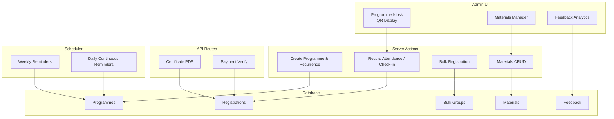

**Diagram sources**
- [programmes.ts:29-1547](file://lib/actions/programmes.ts#L29-L1547)
- [meetings.ts:57-84](file://lib/actions/meetings.ts#L57-L84)
- [programme-bulk.ts:48-277](file://lib/actions/programme-bulk.ts#L48-L277)
- [route.ts (certificate):1-261](file://app/api/programmes/registrations/[id]/certificate/route.ts#L1-L261)
- [verify route.ts:70-95](file://app/api/payments/verify/route.ts#L70-L95)
- [scheduler.ts:1-294](file://workers/scheduler.ts#L1-L294)

**Section sources**
- [schema.prisma:750-949](file://prisma/schema.prisma#L750-L949)
- [programmes.ts:29-1547](file://lib/actions/programmes.ts#L29-L1547)
- [meetings.ts:57-84](file://lib/actions/meetings.ts#L57-L84)
- [programme-bulk.ts:48-277](file://lib/actions/programme-bulk.ts#L48-L277)
- [scheduler.ts:1-294](file://workers/scheduler.ts#L1-L294)

## Core Components
- Programme model and lifecycle: Supports formats (physical/virtual/hybrid), approval workflow, budgeting, pricing tiers, early-bird pricing, certificates, and recurrence rules.
- Registrations: Individual and group (bulk) registrations with payment status, tier selection, and attendance timestamps.
- Attendance: Secure QR-based self-check-in with time windows, plus manual marking by admins.
- Materials: Upload and manage programme materials for post-event distribution.
- Feedback: Configurable fields and analytics with sentiment and NPS scoring.
- Certificates: On-demand PDF generation for attended participants.
- Bulk operations: Group registration, claim links, and attendee lists.
- Notifications: Weekly and daily automated reminders via scheduler.

**Section sources**
- [schema.prisma:750-949](file://prisma/schema.prisma#L750-L949)
- [programmes.ts:29-1547](file://lib/actions/programmes.ts#L29-L1547)
- [programme-bulk.ts:48-277](file://lib/actions/programme-bulk.ts#L48-L277)
- [route.ts (certificate):1-261](file://app/api/programmes/registrations/[id]/certificate/route.ts#L1-L261)
- [page.tsx (feedback analytics):146-554](file://app/dashboard/admin/programmes/[id]/feedback/page.tsx#L146-L554)

## Architecture Overview
The system uses Next.js App Router with server actions for business logic, Drizzle ORM for data access, and a cron-based worker for scheduled tasks. Attendees interact via public pages; admins use dashboard components. Payments integrate with an external provider and are verified server-side.

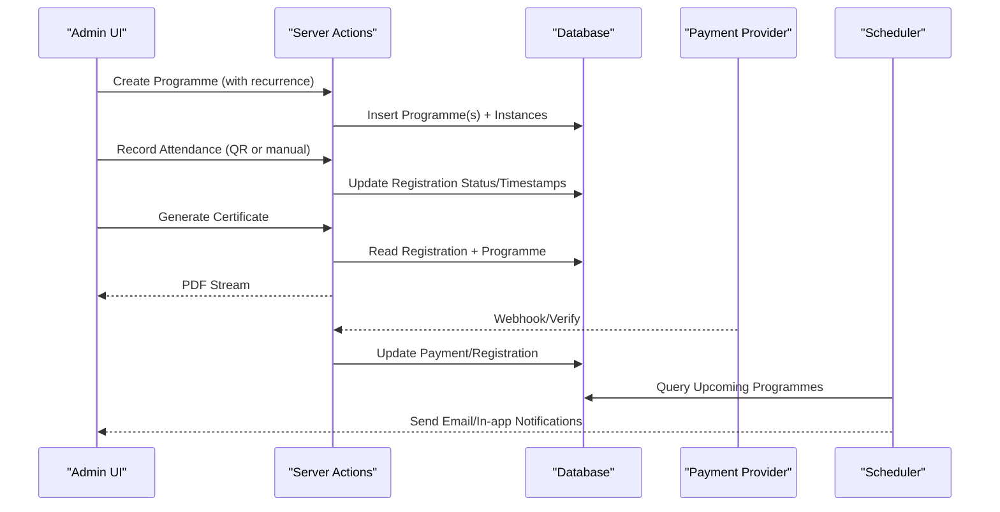

**Diagram sources**
- [programmes.ts:29-1547](file://lib/actions/programmes.ts#L29-L1547)
- [route.ts (certificate):1-261](file://app/api/programmes/registrations/[id]/certificate/route.ts#L1-L261)
- [verify route.ts:70-95](file://app/api/payments/verify/route.ts#L70-L95)
- [scheduler.ts:1-294](file://workers/scheduler.ts#L1-L294)

## Detailed Component Analysis

### Programme Model and Lifecycle
- Fields include format, frequency, objectives, budget, committee, payment settings, pricing tiers, early-bird deadline, certificate options, static attendance token, and attendance window.
- Approval workflow supports multiple levels and statuses; budgets can be auto-created per instance for recurring programmes.
- Recurrence supports standard frequencies and custom RRULE strings, generating instances up to year-end or a configured limit.

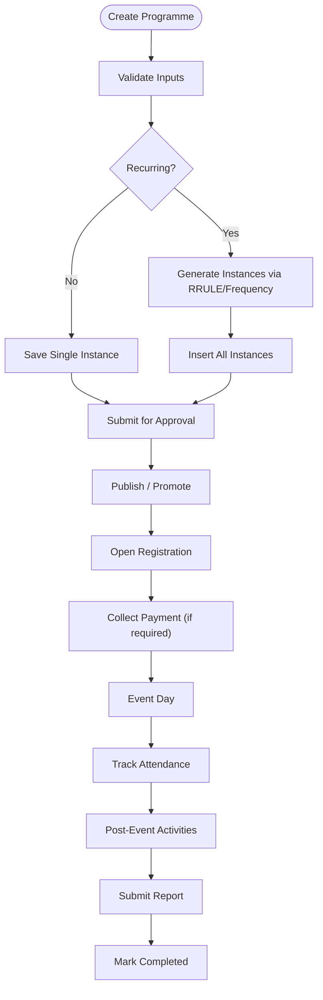

**Diagram sources**
- [programmes.ts:29-1547](file://lib/actions/programmes.ts#L29-L1547)
- [meetings.ts:57-84](file://lib/actions/meetings.ts#L57-L84)
- [schema.prisma:750-949](file://prisma/schema.prisma#L750-L949)

**Section sources**
- [schema.prisma:750-949](file://prisma/schema.prisma#L750-L949)
- [programmes.ts:29-1547](file://lib/actions/programmes.ts#L29-L1547)
- [meetings.ts:57-84](file://lib/actions/meetings.ts#L57-L84)

### Scheduling and Recurrence
- Frequency options include ONCE, WEEKLY, BI_WEEKLY, MONTHLY, and CUSTOM (RRULE).
- Custom rules compute occurrences between start date and end-of-year (or configured cap), preserving duration per occurrence.
- Recurrence also applies to meetings with similar logic.

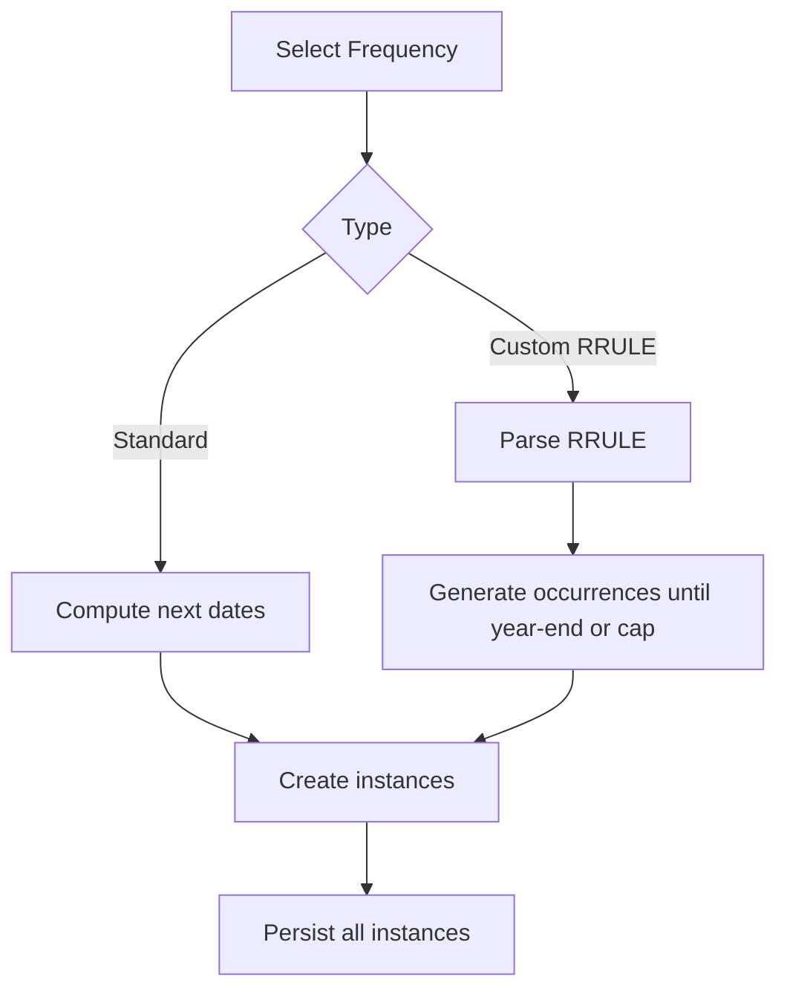

**Diagram sources**
- [programmes.ts:566-665](file://lib/actions/programmes.ts#L566-L665)
- [meetings.ts:57-84](file://lib/actions/meetings.ts#L57-L84)

**Section sources**
- [programmes.ts:566-665](file://lib/actions/programmes.ts#L566-L665)
- [meetings.ts:57-84](file://lib/actions/meetings.ts#L57-L84)

### Registration System (Individual and Group)
- Individual registration captures personal details, optional payment tier, and amount paid.
- Group (bulk) registration creates a paymaster record, computes total based on effective amount (early-bird aware), and issues unique claim tokens per seat.
- Claim flow allows attendees to complete profile and confirm their seat.

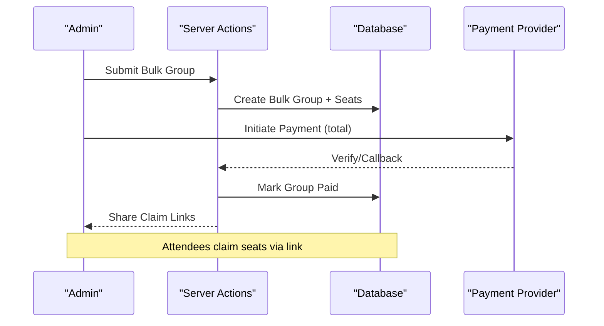

**Diagram sources**
- [programme-bulk.ts:48-277](file://lib/actions/programme-bulk.ts#L48-L277)
- [verify route.ts:70-95](file://app/api/payments/verify/route.ts#L70-L95)

**Section sources**
- [programme-bulk.ts:48-277](file://lib/actions/programme-bulk.ts#L48-L277)
- [verify route.ts:70-95](file://app/api/payments/verify/route.ts#L70-L95)

### Payment Integration and Confirmation Workflow
- Programmes can require payment with support for installments and early-bird pricing.
- Verification endpoint validates payments, attaches receipts, and updates records.
- Callback page provides user feedback and navigation after verification.

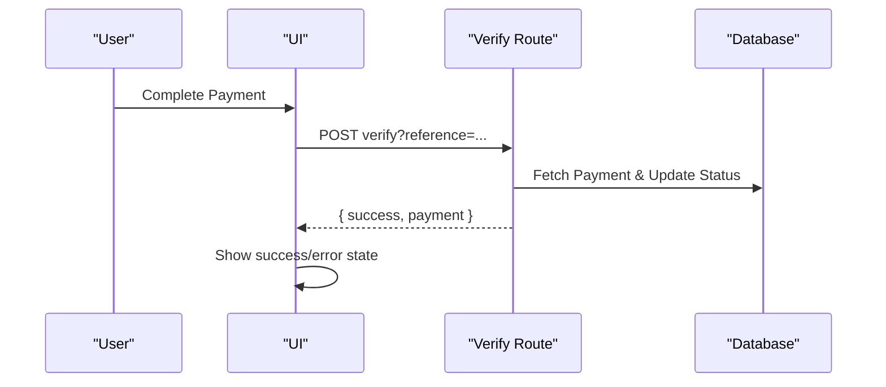

**Diagram sources**
- [verify route.ts:70-95](file://app/api/payments/verify/route.ts#L70-L95)
- [client.tsx (payment callback):34-90](file://app/dashboard/payments/callback/client.tsx#L34-L90)

**Section sources**
- [verify route.ts:70-95](file://app/api/payments/verify/route.ts#L70-L95)
- [client.tsx (payment callback):34-90](file://app/dashboard/payments/callback/client.tsx#L34-L90)
- [resume-payment-button.tsx:38-53](file://components/programmes/resume-payment-button.tsx#L38-L53)

### Attendance Tracking (QR Scanning and Manual Check-in)
- Self-service QR check-in: Venue displays a dynamic QR with a secure token that refreshes periodically. Attendees scan to record attendance within a configurable time window around the event start/end.
- Manual check-in: Admins can mark attendance directly for a registration.
- Attendance URLs support static tokens for posters and kiosks.

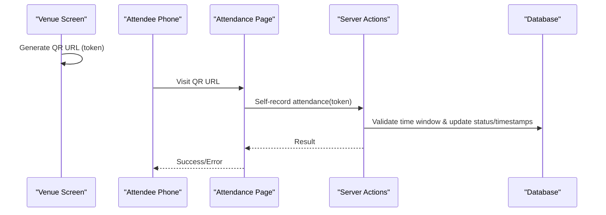

**Diagram sources**
- [attendance-kiosk.tsx:44-68](file://components/admin/programmes/attendance-kiosk.tsx#L44-L68)
- [meeting-attendance-kiosk.tsx:1-68](file://components/admin/meetings/meeting-attendance-kiosk.tsx#L1-L68)
- [page.tsx (programmes attendance):25-43](file://app/programmes/attendance/[id]/page.tsx#L25-L43)
- [page.tsx (meetings attendance):25-43](file://app/meetings/attendance/[id]/page.tsx#L25-L43)
- [programmes.ts:33-190](file://lib/actions/programmes.ts#L33-L190)

**Section sources**
- [programmes.ts:33-190](file://lib/actions/programmes.ts#L33-L190)
- [programmes.ts:192-212](file://lib/actions/programmes.ts#L192-L212)
- [page.tsx (programmes attendance):25-43](file://app/programmes/attendance/[id]/page.tsx#L25-L43)
- [page.tsx (meetings attendance):25-43](file://app/meetings/attendance/[id]/page.tsx#L25-L43)
- [attendance-kiosk.tsx:44-68](file://components/admin/programmes/attendance-kiosk.tsx#L44-L68)
- [meeting-attendance-kiosk.tsx:1-68](file://components/admin/meetings/meeting-attendance-kiosk.tsx#L1-L68)

### Program Materials Management
- Admins upload and manage materials per programme; materials are downloadable by attendees post-programme.
- Bulk upload supported; metadata includes title, URL, and file type.

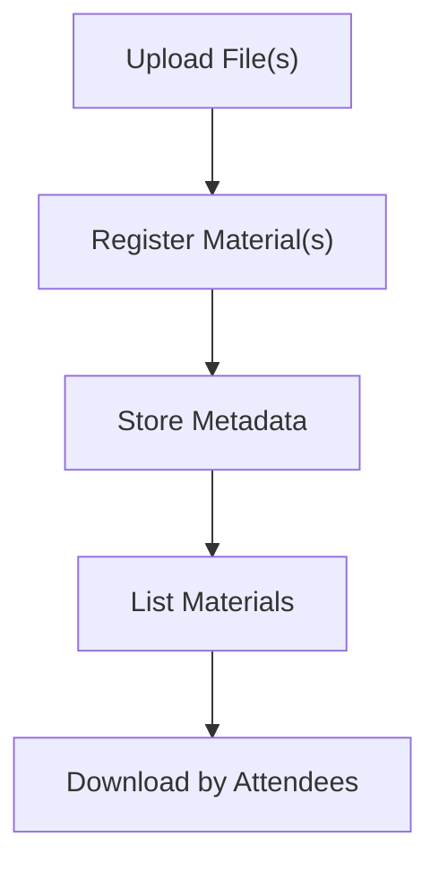

**Diagram sources**
- [programme-materials-manager.tsx:1-196](file://components/admin/programmes/programme-materials-manager.tsx#L1-L196)
- [programme-materials-download.tsx:1-43](file://components/programme/programme-materials-download.tsx#L1-L43)
- [programmes.ts:2063-2098](file://lib/actions/programmes.ts#L2063-L2098)

**Section sources**
- [programme-materials-manager.tsx:1-196](file://components/admin/programmes/programme-materials-manager.tsx#L1-L196)
- [programme-materials-download.tsx:1-43](file://components/programme/programme-materials-download.tsx#L1-L43)
- [programmes.ts:2063-2098](file://lib/actions/programmes.ts#L2063-L2098)

### Feedback Collection and Analytics
- Dynamic feedback fields per programme; submissions stored with JSON payloads.
- Analytics compute distributions, demographics cross-tabs, sentiment analysis, and NPS scores for choice/rating questions.

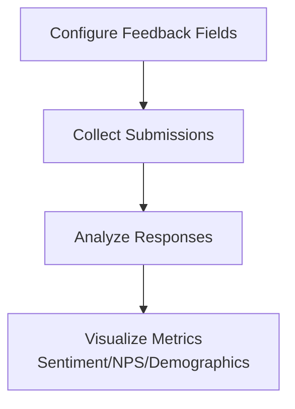

**Diagram sources**
- [page.tsx (feedback analytics):146-554](file://app/dashboard/admin/programmes/[id]/feedback/page.tsx#L146-L554)

**Section sources**
- [page.tsx (feedback analytics):146-554](file://app/dashboard/admin/programmes/[id]/feedback/page.tsx#L146-L554)

### Certificate Generation
- On-demand PDF generation for attended participants using jsPDF.
- Supports multiple certificate templates (TMC-only, Partner-only, Both) with logos and signatures.

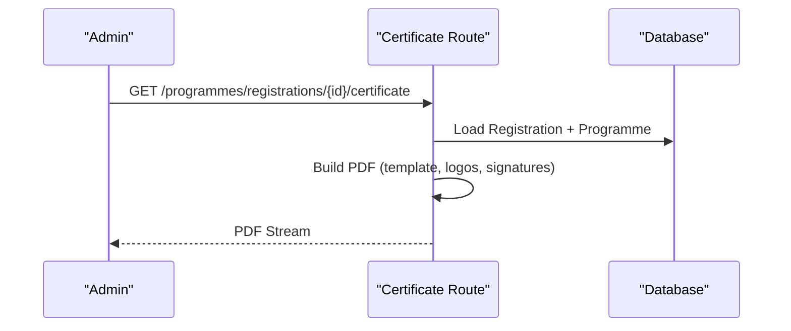

**Diagram sources**
- [route.ts (certificate):1-261](file://app/api/programmes/registrations/[id]/certificate/route.ts#L1-L261)

**Section sources**
- [route.ts (certificate):1-261](file://app/api/programmes/registrations/[id]/certificate/route.ts#L1-L261)

### Bulk Operations
- Bulk registration groups track paymaster info, attendee counts, amounts, and payment references.
- Claim flow enables attendees to finalize profiles via unique tokens.
- Admin views list groups and attendees per group.

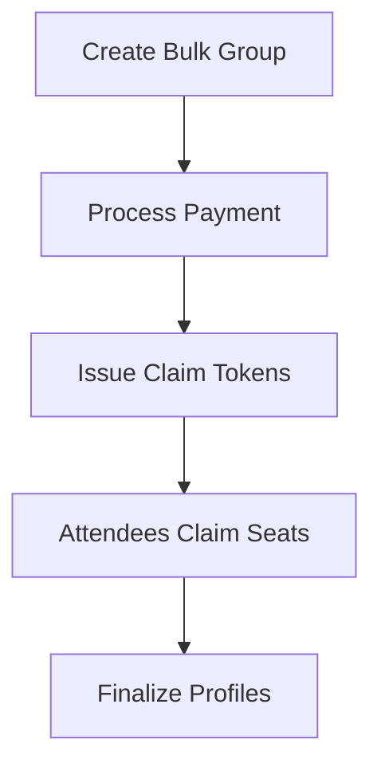

**Diagram sources**
- [programme-bulk.ts:48-277](file://lib/actions/programme-bulk.ts#L48-L277)

**Section sources**
- [programme-bulk.ts:48-277](file://lib/actions/programme-bulk.ts#L48-L277)

### Automated Notifications and Calendar Integrations
- Scheduler runs weekly and daily tasks to notify registered users about upcoming events and missing reports.
- Recurrence engine supports Google Calendar-style rules for advanced scheduling.

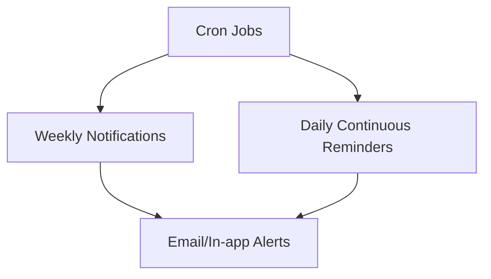

**Diagram sources**
- [scheduler.ts:1-294](file://workers/scheduler.ts#L1-L294)

**Section sources**
- [scheduler.ts:1-294](file://workers/scheduler.ts#L1-L294)

### Analytics: Participation, Revenue, Outcomes
- Financial analytics aggregate monthly revenue, compliance rates, campaign progress, and budget vs spent.
- Programme feedback analytics provide participation insights and outcome measurement through sentiment and NPS.

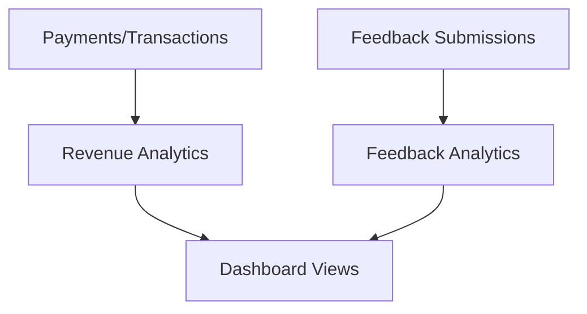

**Diagram sources**
- [analytics.ts:41-194](file://lib/actions/analytics.ts#L41-L194)
- [page.tsx (feedback analytics):146-554](file://app/dashboard/admin/programmes/[id]/feedback/page.tsx#L146-L554)

**Section sources**
- [analytics.ts:41-194](file://lib/actions/analytics.ts#L41-L194)
- [page.tsx (feedback analytics):146-554](file://app/dashboard/admin/programmes/[id]/feedback/page.tsx#L146-L554)

## Dependency Analysis
Key dependencies and relationships:
- Programme model depends on Organisation, User, Office, Official relations.
- Registrations depend on Programme, optional User/Member, and optional BulkGroup.
- Reports and Materials depend on Programme.
- Feedback submissions depend on Programme.
- Scheduler depends on Programme and Notification models.

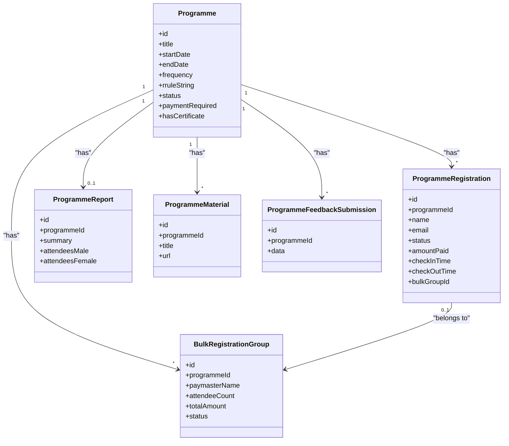

**Diagram sources**
- [schema.prisma:750-949](file://prisma/schema.prisma#L750-L949)

**Section sources**
- [schema.prisma:750-949](file://prisma/schema.prisma#L750-L949)

## Performance Considerations
- Recurrence generation: Use RRULE efficiently and cap occurrences to avoid excessive rows.
- Attendance validation: Enforce time windows server-side to minimize invalid scans.
- Bulk operations: Limit batch sizes and process payments asynchronously where possible.
- Certificate generation: Cache images and reuse base64 assets when feasible.
- Analytics queries: Add indexes on frequently filtered columns (e.g., organisationId, createdAt).

[No sources needed since this section provides general guidance]

## Troubleshooting Guide
Common issues and resolutions:
- Invalid attendance token: Ensure venue QR is refreshed and scanned within allowed window; verify attendanceWindow setting.
- Payment not verified: Confirm webhook/verify calls succeed; check reference parameters and network connectivity.
- Bulk claim link expired or used: Issue new link if necessary; ensure uniqueness of tokens.
- Materials not visible: Confirm uploads succeeded and metadata saved; re-fetch materials list.
- Feedback analytics incomplete: Validate feedback fields configuration and submission payloads.

**Section sources**
- [programmes.ts:33-190](file://lib/actions/programmes.ts#L33-L190)
- [verify route.ts:70-95](file://app/api/payments/verify/route.ts#L70-L95)
- [programme-bulk.ts:214-277](file://lib/actions/programme-bulk.ts#L214-L277)
- [programme-materials-manager.tsx:1-196](file://components/admin/programmes/programme-materials-manager.tsx#L1-L196)

## Conclusion
The TMC Portal program management system provides a comprehensive solution for scheduling, registering, and tracking attendance for events at scale. It supports flexible recurrence, robust payment workflows, secure QR-based attendance, materials distribution, feedback analytics, and certificate generation. Bulk operations and automated notifications streamline administration, while analytics enable informed decision-making. The architecture balances usability with extensibility, allowing integrations with calendar systems, email marketing tools, and external scheduling platforms.

[No sources needed since this section summarizes without analyzing specific files]

## Appendices

### Appendix A: Key Endpoints and Flows
- Create/update programmes and instances: server actions in programmes.ts
- Record attendance: server actions and attendance pages
- Generate certificates: API route under programmes/registrations/[id]/certificate
- Verify payments: API route under payments/verify
- Bulk registration: server actions in programme-bulk.ts

**Section sources**
- [programmes.ts:29-1547](file://lib/actions/programmes.ts#L29-L1547)
- [route.ts (certificate):1-261](file://app/api/programmes/registrations/[id]/certificate/route.ts#L1-L261)
- [verify route.ts:70-95](file://app/api/payments/verify/route.ts#L70-L95)
- [programme-bulk.ts:48-277](file://lib/actions/programme-bulk.ts#L48-L277)

### Appendix B: Recurrence Examples
- Weekly: FREQ=WEEKLY
- Monthly first Saturday: FREQ=MONTHLY;BYDAY=SA;BYSETPOS=1
- Custom multi-day patterns: RRULE string parsed by RRULE library

**Section sources**
- [programmes.ts:566-665](file://lib/actions/programmes.ts#L566-L665)
- [meetings.ts:57-84](file://lib/actions/meetings.ts#L57-L84)