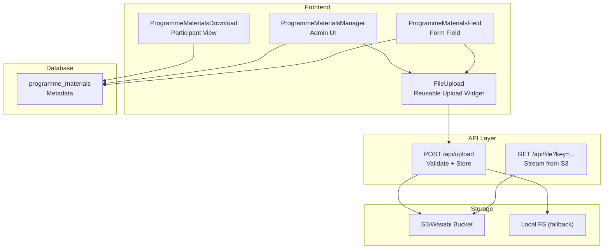
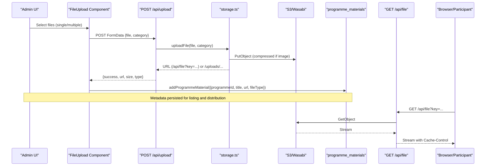
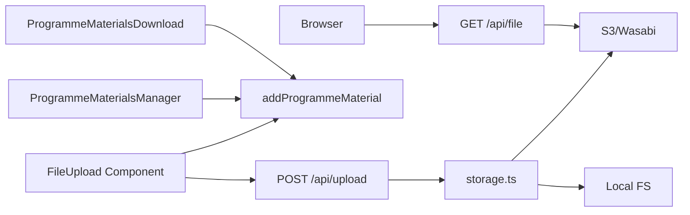
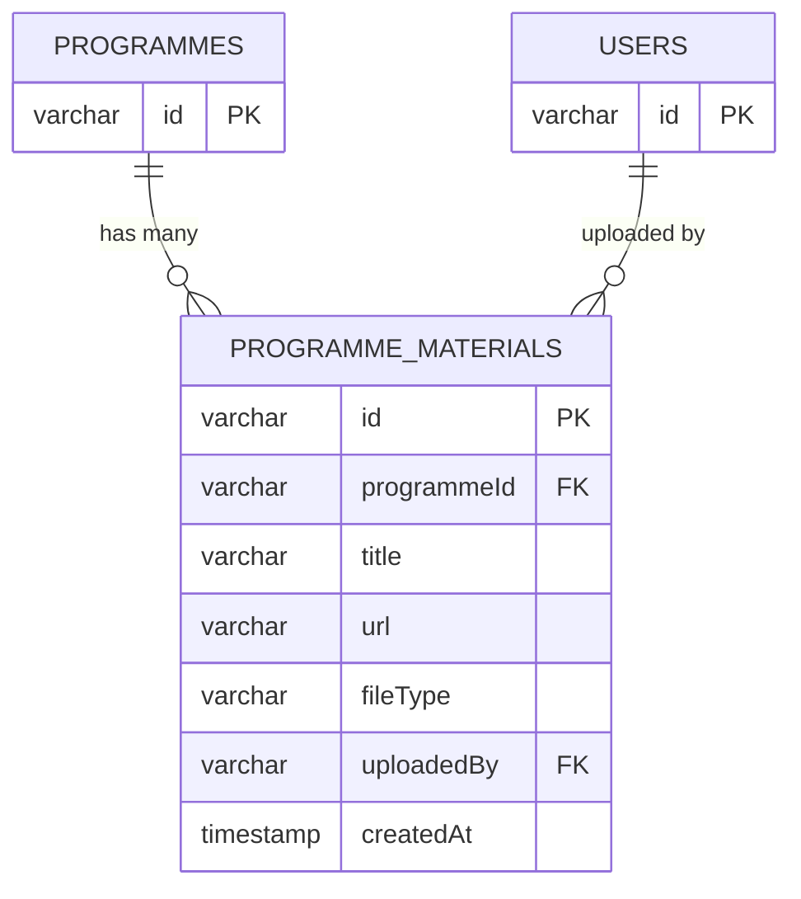

# Program Materials & Resources

<cite>
**Referenced Files in This Document**
- [route.ts](file://app/api/upload/route.ts)
- [route.ts](file://app/api/file/route.ts)
- [storage.ts](file://lib/storage.ts)
- [programme-materials-manager.tsx](file://components/admin/programmes/programme-materials-manager.tsx)
- [programme-materials-field.tsx](file://components/admin/programmes/programme-materials-field.tsx)
- [programme-materials-download.tsx](file://components/programme/programme-materials-download.tsx)
- [file-upload.tsx](file://components/ui/file-upload.tsx)
- [schema.ts](file://lib/db/schema.ts)
- [programmes.ts](file://lib/actions/programmes.ts)
- [nginx_tmcng.conf](file://nginx_tmcng.conf)
- [sw.ts](file://app/sw.ts)
</cite>

## Table of Contents
1. Introduction
2. Project Structure
3. Core Components
4. Architecture Overview
5. Detailed Component Analysis
6. Dependency Analysis
7. Performance Considerations
8. Troubleshooting Guide
9. Conclusion
10. Appendices

## Introduction
This document explains how the system manages program materials and resources, including uploading documents, presentations, videos, and multimedia content associated with programmes. It covers categorization, storage, access control considerations, download permissions, versioning strategies, preview capabilities, mobile-friendly access, storage management, file size limits, bandwidth optimization, CDN integration, caching, collaborative editing workflows, and distribution mechanisms.

## Project Structure
The program materials feature spans server APIs for uploads and streaming, a reusable upload UI component, admin interfaces to manage materials per programme, client-side download lists, database schema for material metadata, and infrastructure for storage and caching.

**Diagram sources**
- [programme-materials-manager.tsx:1-196](file://components/admin/programmes/programme-materials-manager.tsx#L1-L196)
- [programme-materials-field.tsx:1-42](file://components/admin/programmes/programme-materials-field.tsx#L1-L42)
- [programme-materials-download.tsx:1-43](file://components/programme/programme-materials-download.tsx#L1-L43)
- [file-upload.tsx:1-142](file://components/ui/file-upload.tsx#L1-L142)
- [route.ts:1-66](file://app/api/upload/route.ts#L1-L66)
- [route.ts:1-61](file://app/api/file/route.ts#L1-L61)
- [storage.ts:1-100](file://lib/storage.ts#L1-L100)
- [schema.ts:1176-1185](file://lib/db/schema.ts#L1176-L1185)

**Section sources**
- [programme-materials-manager.tsx:1-196](file://components/admin/programmes/programme-materials-manager.tsx#L1-L196)
- [programme-materials-field.tsx:1-42](file://components/admin/programmes/programme-materials-field.tsx#L1-L42)
- [programme-materials-download.tsx:1-43](file://components/programme/programme-materials-download.tsx#L1-L43)
- [file-upload.tsx:1-142](file://components/ui/file-upload.tsx#L1-L142)
- [route.ts:1-66](file://app/api/upload/route.ts#L1-L66)
- [route.ts:1-61](file://app/api/file/route.ts#L1-L61)
- [storage.ts:1-100](file://lib/storage.ts#L1-L100)
- [schema.ts:1176-1185](file://lib/db/schema.ts#L1176-L1185)

## Core Components
- File upload API: Validates file type and size, sanitizes category, compresses images, stores to S3 or local filesystem, returns a URL.
- File streaming API: Streams files from S3 with cache headers for performance.
- Storage utility: Handles image compression, naming, and writes to S3 or local fallback; returns either a proxy URL or direct path.
- Admin UI components: Add, list, and delete programme materials; support multiple uploads and auto-title from filenames.
- Participant UI: Lists downloadable materials for a programme.
- Database schema: Stores material metadata linked to programmes and uploader.

Key responsibilities:
- Validation and safety: Allowed MIME types/extensions, max size, sanitized categories.
- Optimization: Image compression to WebP with EXIF rotation and resize.
- Access control: Material URLs are proxied via /api/file when using private S3 buckets; public static assets served by nginx.
- Versioning: Timestamped filenames ensure new uploads create new versions without overwriting.
- Mobile-friendly: Reusable upload widget supports multiple files and responsive UI.

**Section sources**
- [route.ts:1-66](file://app/api/upload/route.ts#L1-L66)
- [route.ts:1-61](file://app/api/file/route.ts#L1-L61)
- [storage.ts:1-100](file://lib/storage.ts#L1-L100)
- [programme-materials-manager.tsx:1-196](file://components/admin/programmes/programme-materials-manager.tsx#L1-L196)
- [programme-materials-field.tsx:1-42](file://components/admin/programmes/programme-materials-field.tsx#L1-L42)
- [programme-materials-download.tsx:1-43](file://components/programme/programme-materials-download.tsx#L1-L43)
- [schema.ts:1176-1185](file://lib/db/schema.ts#L1176-L1185)

## Architecture Overview
End-to-end flow for uploading and accessing programme materials:

**Diagram sources**
- [file-upload.tsx:1-142](file://components/ui/file-upload.tsx#L1-L142)
- [route.ts:1-66](file://app/api/upload/route.ts#L1-L66)
- [storage.ts:1-100](file://lib/storage.ts#L1-L100)
- [route.ts:1-61](file://app/api/file/route.ts#L1-L61)
- [programmes.ts:2062-2099](file://lib/actions/programmes.ts#L2062-L2099)

## Detailed Component Analysis

### Upload API: POST /api/upload
- Accepts multipart form data with file and optional category.
- Enforces maximum file size (e.g., 50MB).
- Validates allowed MIME types and extensions for documents, archives, images, audio, video.
- Sanitizes category to prevent directory traversal while allowing subdirectories.
- Delegates to storage utility for processing and persistence.
- Returns success payload with URL, size, and type.

Operational notes:
- Category defaults to “others” if not provided.
- Errors return appropriate status codes with messages.

**Section sources**
- [route.ts:1-66](file://app/api/upload/route.ts#L1-L66)

### Streaming API: GET /api/file
- Reads query parameter key and streams the object from S3/Wasabi.
- Sets Content-Type based on stored metadata.
- Applies long-lived cache headers for immutable assets.
- Returns 404 if object is missing; logs errors and returns 500 on failures.

Security note:
- When S3 bucket is private, this endpoint acts as an authorized proxy, preventing direct public exposure.

**Section sources**
- [route.ts:1-61](file://app/api/file/route.ts#L1-L61)

### Storage Utility: uploadFile
- Converts File to Buffer and optionally compresses images to WebP with EXIF rotation and resizing.
- Generates unique filename with timestamp and sanitized base name.
- Writes to S3/Wasabi if configured; otherwise falls back to local filesystem under public/uploads.
- Returns a secure proxy URL for S3 objects or a direct path for local uploads.

Optimization details:
- Image compression can be skipped via environment flag.
- Content type updated to image/webp after compression.

**Section sources**
- [storage.ts:1-100](file://lib/storage.ts#L1-L100)

### Admin UI: Programme Materials Manager
- Loads existing materials for a programme.
- Adds single or multiple materials with titles derived from filenames.
- Deletes materials with confirmation.
- Uses toast notifications for feedback and re-fetches lists on changes.

Collaboration hints:
- Multiple upload enables batch operations by admins.
- Title and type fields allow basic categorization.

**Section sources**
- [programme-materials-manager.tsx:1-196](file://components/admin/programmes/programme-materials-manager.tsx#L1-L196)

### Form Field: Programme Materials Field
- Integrates with react-hook-form field arrays to dynamically add materials during programme creation/editing.
- Supports multiple file selection and appends entries with auto-generated titles.

**Section sources**
- [programme-materials-field.tsx:1-42](file://components/admin/programmes/programme-materials-field.tsx#L1-L42)

### Participant UI: Programme Materials Download
- Fetches materials for a programme and renders a list of downloadable links.
- Opens files in new tabs; suitable for mobile and desktop.

Access control:
- If URLs point to /api/file, access is controlled at the streaming endpoint level.

**Section sources**
- [programme-materials-download.tsx:1-43](file://components/programme/programme-materials-download.tsx#L1-L43)

### Database Schema: programme_materials
- Fields include id, programmeId, title, url, fileType, uploadedBy, createdAt.
- Foreign keys link to programmes and users.
- Supports cascade deletion when programmes are removed.

Versioning strategy:
- New uploads generate unique filenames with timestamps; no overwrite occurs.

**Section sources**
- [schema.ts:1176-1185](file://lib/db/schema.ts#L1176-L1185)

### Server Actions: Programme Materials CRUD
- addProgrammeMaterial: Inserts material metadata into the database.
- getProgrammeMaterials: Retrieves materials for a given programme.
- deleteProgrammeMaterial: Removes a material record.

These actions are invoked by admin UI components to persist and manage materials.

**Section sources**
- [programmes.ts:2062-2099](file://lib/actions/programmes.ts#L2062-L2099)

### Nginx Static Assets and Caching
- Serves local uploads under /uploads with long expiration and immutable cache headers.
- Proxy passes other requests to the Next.js server.

Bandwidth optimization:
- Long cache lifetimes reduce repeated downloads for static assets.

**Section sources**
- [nginx_tmcng.conf:9-14](file://nginx_tmcng.conf#L9-L14)

### Service Worker Caching
- Uses Serwist to precache and runtime-cache default routes.
- Excludes specific POST requests and pages from caching to avoid stale state.

Mobile-friendly:
- Improves offline resilience and load times for repeat visits.

**Section sources**
- [sw.ts:1-32](file://app/sw.ts#L1-L32)

## Dependency Analysis
High-level dependencies between components:

**Diagram sources**
- [file-upload.tsx:1-142](file://components/ui/file-upload.tsx#L1-L142)
- [route.ts:1-66](file://app/api/upload/route.ts#L1-L66)
- [storage.ts:1-100](file://lib/storage.ts#L1-L100)
- [route.ts:1-61](file://app/api/file/route.ts#L1-L61)
- [programme-materials-manager.tsx:1-196](file://components/admin/programmes/programme-materials-manager.tsx#L1-L196)
- [programme-materials-download.tsx:1-43](file://components/programme/programme-materials-download.tsx#L1-L43)
- [programmes.ts:2062-2099](file://lib/actions/programmes.ts#L2062-L2099)

**Section sources**
- [file-upload.tsx:1-142](file://components/ui/file-upload.tsx#L1-L142)
- [route.ts:1-66](file://app/api/upload/route.ts#L1-L66)
- [storage.ts:1-100](file://lib/storage.ts#L1-L100)
- [route.ts:1-61](file://app/api/file/route.ts#L1-L61)
- [programme-materials-manager.tsx:1-196](file://components/admin/programmes/programme-materials-manager.tsx#L1-L196)
- [programme-materials-download.tsx:1-43](file://components/programme/programme-materials-download.tsx#L1-L43)
- [programmes.ts:2062-2099](file://lib/actions/programmes.ts#L2062-L2099)

## Performance Considerations
- Image compression: Images are resized and converted to WebP to reduce bandwidth and improve load times. Compression can be disabled via environment variable when needed.
- File size limits: Upload API enforces a maximum size to protect server resources.
- Streaming with cache headers: The file streaming endpoint sets immutable cache headers to leverage browser and CDN caches.
- Static asset caching: Nginx serves local uploads with long-lived cache headers.
- Service worker: Runtime caching improves perceived performance on repeat visits.

Recommendations:
- Use CDN in front of S3/Wasabi for global low-latency delivery.
- Configure CDN cache rules to honor immutable cache headers.
- Monitor upload sizes and adjust limits based on typical content mix.
- Enable CDN origin shielding and edge caching for large media.

[No sources needed since this section provides general guidance]

## Troubleshooting Guide
Common issues and resolutions:
- Upload rejected due to unsupported type: Ensure file MIME type or extension is allowed by the upload API.
- File too large: Reduce file size or adjust limits if necessary.
- S3 not configured: Verify environment variables for region, bucket, credentials, and endpoint.
- 404 when downloading: Confirm the key exists and the streaming endpoint is reachable.
- Local fallback path not accessible: Check nginx configuration for /uploads alias and permissions.

Error handling locations:
- Upload API returns error responses for validation and processing failures.
- Streaming API returns 404 for missing objects and logs internal errors.

**Section sources**
- [route.ts:1-66](file://app/api/upload/route.ts#L1-L66)
- [route.ts:1-61](file://app/api/file/route.ts#L1-L61)

## Conclusion
The program materials system provides a robust pipeline for uploading, storing, and distributing programme-related content. It supports multiple file types, enforces size and type constraints, optimizes images, and offers both cloud and local storage options. Admin tools enable easy management, while participant views provide straightforward access. With streaming, caching, and service worker support, the system balances performance and reliability. For advanced scenarios, integrate a CDN and implement access controls at the streaming endpoint to restrict downloads based on user roles or programme participation.

[No sources needed since this section summarizes without analyzing specific files]

## Appendices

### Data Model: Programme Materials

**Diagram sources**
- [schema.ts:1176-1185](file://lib/db/schema.ts#L1176-L1185)

### Access Control Notes
- Current implementation uses URLs that may be public or proxied through /api/file.
- To enforce role-based access, apply authorization checks within the streaming endpoint before serving files.
- Alternatively, sign URLs at the storage provider level for time-limited access.

[No sources needed since this section provides general guidance]

### Collaborative Editing and Review
- The current system focuses on material storage and distribution.
- For collaborative editing, consider integrating a document editor that syncs to the same storage backend and updates material URLs upon save.
- Implement review workflows by adding status fields to materials and gating visibility until approved.

[No sources needed since this section provides general guidance]