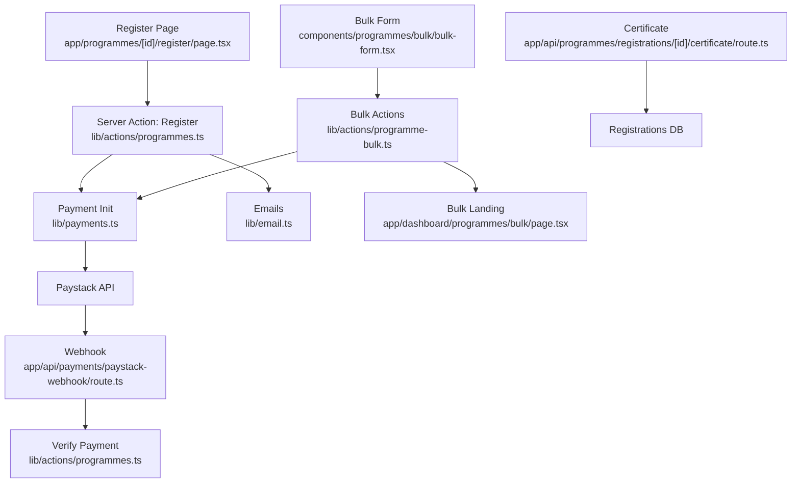
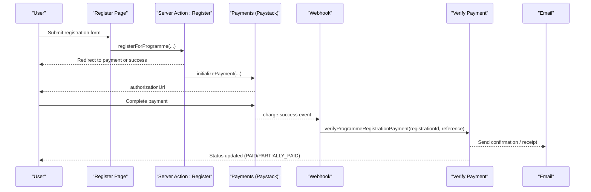
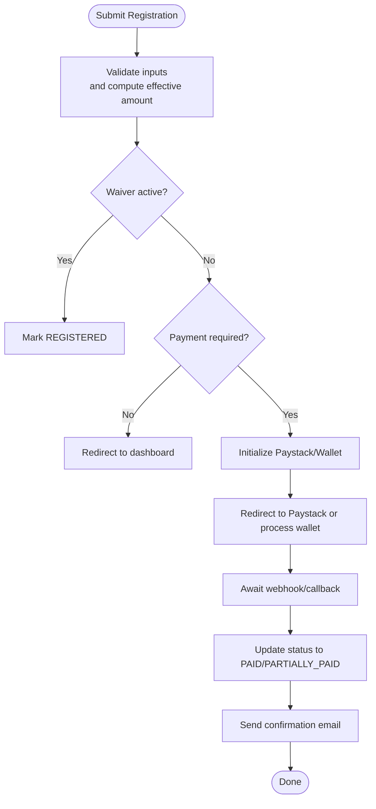
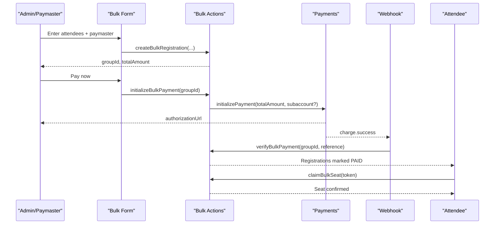
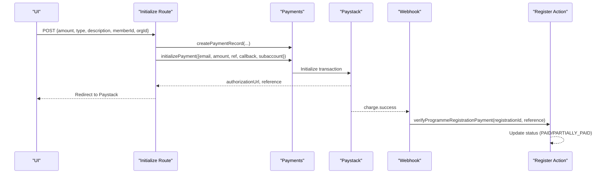
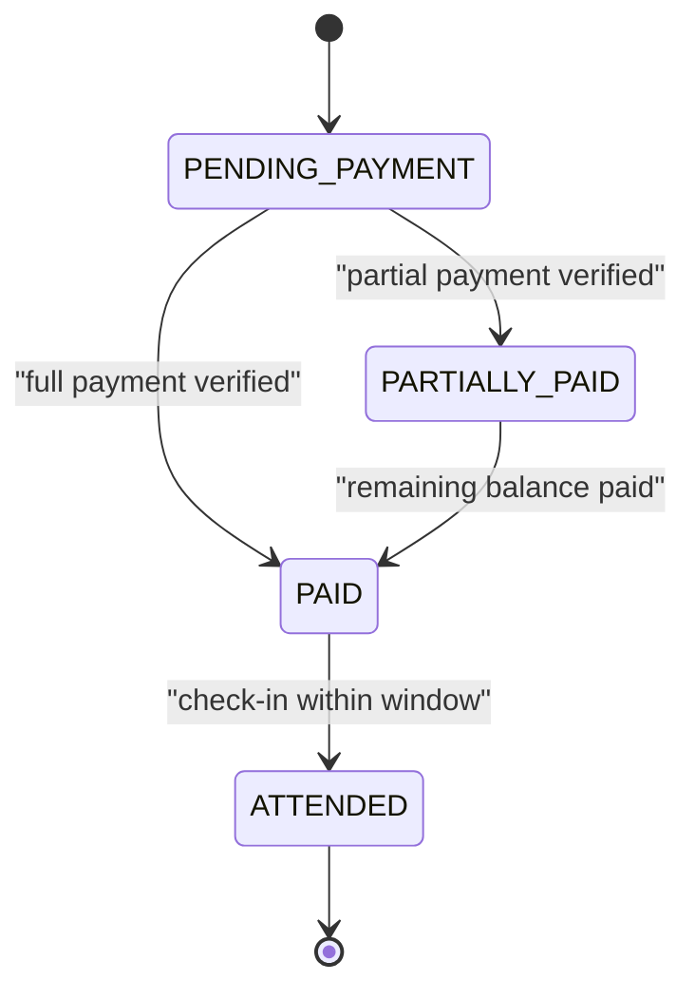
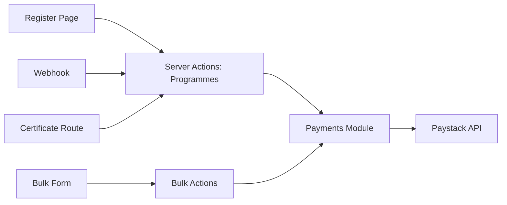

# Registration & Enrollment System

<cite>
**Referenced Files in This Document**
- [programmes.ts](file://lib/actions/programmes.ts)
- [programme-bulk.ts](file://lib/actions/programme-bulk.ts)
- [payments.ts](file://lib/payments.ts)
- [initialize route](file://app/api/payments/initialize/route.ts)
- [paystack webhook](file://app/api/payments/paystack-webhook/route.ts)
- [register page](file://app/programmes/[id]/register/page.tsx)
- [bulk form](file://components/programmes/bulk/bulk-form.tsx)
- [bulk landing](file://app/dashboard/programmes/bulk/page.tsx)
- [certificate route](file://app/api/programmes/registrations/[id]/certificate/route.ts)
- [email templates](file://lib/email.ts)
- [seed settings](file://scripts/seed-settings.ts)
- [member apply](file://app/api/members/apply/route.ts)
- [member profile](file://app/dashboard/member/profile/page.tsx)
</cite>

## Table of Contents
1. Introduction
2. Project Structure
3. Core Components
4. Architecture Overview
5. Detailed Component Analysis
6. Dependency Analysis
7. Performance Considerations
8. Troubleshooting Guide
9. Conclusion
10. Appendices

## Introduction
This document explains the program registration and enrollment system, covering individual and group registrations, participant data collection, payment integration with Paystack (including early bird pricing, installments, and subaccount routing), registration status management, bulk registration via CSV-like paste, verification workflows, confirmation emails, digital ticket/certificate generation, limits, waitlist considerations, cancellation policies, and integration with member profiles and organization membership verification.

## Project Structure
The registration system spans server actions, API routes, UI components, and email utilities:
- Server actions handle registration creation, payment initialization, attendance, and bulk operations
- API routes initialize payments and process webhooks
- UI pages render registration forms and bulk registration flows
- Email utilities provide templates for confirmations and verifications
- Member and profile endpoints support membership verification and linking

**Diagram sources**
- [register page:1-511](file://app/programmes/[id]/register/page.tsx#L1-L511)
- [programmes.ts:1-800](file://lib/actions/programmes.ts#L1-L800)
- [payments.ts:1-248](file://lib/payments.ts#L1-L248)
- [paystack webhook:1-42](file://app/api/payments/paystack-webhook/route.ts#L1-L42)
- [bulk form:1-146](file://components/programmes/bulk/bulk-form.tsx#L1-L146)
- [programme-bulk.ts:1-278](file://lib/actions/programme-bulk.ts#L1-L278)
- [bulk landing:1-50](file://app/dashboard/programmes/bulk/page.tsx#L1-L50)
- [certificate route:232-260](file://app/api/programmes/registrations/[id]/certificate/route.ts#L232-L260)

**Section sources**
- [register page:1-511](file://app/programmes/[id]/register/page.tsx#L1-L511)
- [programmes.ts:1-800](file://lib/actions/programmes.ts#L1-L800)
- [programme-bulk.ts:1-278](file://lib/actions/programme-bulk.ts#L1-L278)
- [payments.ts:1-248](file://lib/payments.ts#L1-L248)
- [paystack webhook:1-42](file://app/api/payments/paystack-webhook/route.ts#L1-L42)
- [bulk form:1-146](file://components/programmes/bulk/bulk-form.tsx#L1-L146)
- [bulk landing:1-50](file://app/dashboard/programmes/bulk/page.tsx#L1-L50)
- [certificate route:232-260](file://app/api/programmes/registrations/[id]/certificate/route.ts#L232-L260)

## Core Components
- Individual registration form and flow: collects name, email, phone, gender, address, country/state/LGA, optional tier and amount; supports waivers and installment minimums; integrates with wallet or Paystack
- Bulk registration: creates a group, generates per-attendee claim tokens, initializes one group payment, and allows attendees to complete their details later
- Payment integration: initializes Paystack transactions, verifies payments, records inflows, and supports subaccount routing per organization or programme
- Attendance and verification: QR/static token check-in/out, status transitions, and waiver handling
- Digital tickets/certificates: PDF certificate generation for eligible programmes
- Member integration: links registrations to members/users and supports membership application and profile views

**Section sources**
- [register page:1-511](file://app/programmes/[id]/register/page.tsx#L1-L511)
- [programme-bulk.ts:1-278](file://lib/actions/programme-bulk.ts#L1-L278)
- [payments.ts:1-248](file://lib/payments.ts#L1-L248)
- [programmes.ts:1-800](file://lib/actions/programmes.ts#L1-L800)
- [certificate route:232-260](file://app/api/programmes/registrations/[id]/certificate/route.ts#L232-L260)
- [member apply:70-172](file://app/api/members/apply/route.ts#L70-L172)
- [member profile:1-30](file://app/dashboard/member/profile/page.tsx#L1-L30)

## Architecture Overview
The system orchestrates user input, server-side validation, payment processing, and post-payment updates through a clear sequence of events.

**Diagram sources**
- [register page:85-171](file://app/programmes/[id]/register/page.tsx#L85-L171)
- [programmes.ts:1343-1402](file://lib/actions/programmes.ts#L1343-L1402)
- [payments.ts:18-58](file://lib/payments.ts#L18-L58)
- [paystack webhook:7-42](file://app/api/payments/paystack-webhook/route.ts#L7-L42)
- [programmes.ts:1405-1420](file://lib/actions/programmes.ts#L1405-L1420)

## Detailed Component Analysis

### Individual Registration Workflow
- Data collected: name, email, phone, gender, address, country, state, LGA, optional registration tier, and initial amountPaid
- Early bird pricing is applied when within deadline; tiers can override base amounts
- Installment support enforces a minimum first payment if enabled
- Waiver codes allow offline-preverified registrations without payment
- On submission:
  - If free or waived: mark registered and redirect to dashboard
  - If payment required: initialize Paystack or use wallet balance
  - Existing registrations are detected and redirected to slip view

**Diagram sources**
- [register page:85-171](file://app/programmes/[id]/register/page.tsx#L85-L171)
- [programmes.ts:1343-1402](file://lib/actions/programmes.ts#L1343-L1402)
- [programmes.ts:1405-1420](file://lib/actions/programmes.ts#L1405-L1420)

**Section sources**
- [register page:1-511](file://app/programmes/[id]/register/page.tsx#L1-L511)
- [programmes.ts:1343-1420](file://lib/actions/programmes.ts#L1343-L1420)

### Group/Bulk Registration Workflow
- Admin or authorized user creates a bulk group by entering paymaster info and attendee rows (supports paste from CSV-like text)
- For each attendee, a registration row is created with a unique claim token and status based on payment requirement
- One group-level payment is initialized; after success, all registrations in the group are marked PAID with locked per-attendee amount
- Attendees receive a link to claim their seat and optionally update personal details

**Diagram sources**
- [bulk form:16-146](file://components/programmes/bulk/bulk-form.tsx#L16-L146)
- [programme-bulk.ts:37-149](file://lib/actions/programme-bulk.ts#L37-L149)
- [programme-bulk.ts:154-208](file://lib/actions/programme-bulk.ts#L154-L208)
- [programme-bulk.ts:214-239](file://lib/actions/programme-bulk.ts#L214-L239)

**Section sources**
- [bulk form:16-146](file://components/programmes/bulk/bulk-form.tsx#L16-L146)
- [programme-bulk.ts:37-239](file://lib/actions/programme-bulk.ts#L37-L239)
- [bulk landing:16-50](file://app/dashboard/programmes/bulk/page.tsx#L16-L50)

### Payment Integration with Paystack
- Initialization:
  - Creates a payment record and calls Paystack with amount, email, callback URL, metadata, and optional subaccount
  - Subaccount resolution uses organization-level code or programme-level code for routing funds
- Verification:
  - Webhook validates signature and triggers verification for programme registrations
  - Verification updates registration status based on paid vs total amount, supporting partial payments
- Finance recording:
  - Successful payments insert finance inflow records tied to organization and category

**Diagram sources**
- [initialize route:11-85](file://app/api/payments/initialize/route.ts#L11-L85)
- [payments.ts:18-58](file://lib/payments.ts#L18-L58)
- [paystack webhook:7-42](file://app/api/payments/paystack-webhook/route.ts#L7-L42)
- [programmes.ts:1405-1420](file://lib/actions/programmes.ts#L1405-L1420)

**Section sources**
- [initialize route:11-85](file://app/api/payments/initialize/route.ts#L11-L85)
- [payments.ts:18-96](file://lib/payments.ts#L18-L96)
- [paystack webhook:7-42](file://app/api/payments/paystack-webhook/route.ts#L7-L42)
- [programmes.ts:1405-1420](file://lib/actions/programmes.ts#L1405-L1420)

### Registration Status Management
- States include PENDING_PAYMENT, PARTIALLY_PAID, PAID, REGISTERED, ATTENDED
- Transitions:
  - PENDING_PAYMENT → PARTIALLY_PAID or PAID upon successful payment verification
  - PAID → ATTENDED upon check-in within allowed window
- Attendance enforcement:
  - Requires valid time window and paid status
  - Supports static/dynamic tokens and self-recorded attendance

**Diagram sources**
- [programmes.ts:33-97](file://lib/actions/programmes.ts#L33-L97)
- [programmes.ts:1405-1420](file://lib/actions/programmes.ts#L1405-L1420)

**Section sources**
- [programmes.ts:33-97](file://lib/actions/programmes.ts#L33-L97)
- [programmes.ts:1405-1420](file://lib/actions/programmes.ts#L1405-L1420)

### Bulk Registration Capabilities
- CSV-like paste: supports pasting lines with Name, Email, Phone separated by commas or tabs
- Limits: maximum 500 attendees per bulk group
- Per-attendee claim tokens enable later profile completion
- Group payment locks per-attendee amount and marks all registrations PAID upon success

**Section sources**
- [bulk form:36-43](file://components/programmes/bulk/bulk-form.tsx#L36-L43)
- [programme-bulk.ts:48-51](file://lib/actions/programme-bulk.ts#L48-L51)
- [programme-bulk.ts:85-109](file://lib/actions/programme-bulk.ts#L85-L109)
- [programme-bulk.ts:154-208](file://lib/actions/programme-bulk.ts#L154-L208)

### Registration Verification and Confirmation Emails
- Verification:
  - Webhook signature verification ensures authenticity
  - Programmatic verification updates statuses and records payments
- Confirmation emails:
  - Templates exist for verification and notifications
  - Registration-related emails can be sent using the email utility

**Section sources**
- [paystack webhook:7-42](file://app/api/payments/paystack-webhook/route.ts#L7-L42)
- [email templates:171-199](file://lib/email.ts#L171-L199)
- [seed settings:231-252](file://scripts/seed-settings.ts#L231-L252)

### Digital Ticket/Certificate Generation
- Certificates are generated as PDFs for eligible programmes and returned as downloadable attachments
- Includes signatures and partner branding where configured

**Section sources**
- [certificate route:232-260](file://app/api/programmes/registrations/[id]/certificate/route.ts#L232-L260)

### Integration with Member Profiles and Organization Membership
- Registration can auto-fill user details when logged in and link to member profiles
- Membership application flow creates pending memberships linked to organizations
- Profile pages display membership status and organization context

**Section sources**
- [register page:72-81](file://app/programmes/[id]/register/page.tsx#L72-L81)
- [member apply:70-172](file://app/api/members/apply/route.ts#L70-L172)
- [member profile:15-30](file://app/dashboard/member/profile/page.tsx#L15-L30)

## Dependency Analysis
Key dependencies and coupling:
- Register page depends on server actions for registration and payment initialization
- Server actions depend on payments module for Paystack interactions and database schemas
- Webhook depends on server action verification logic
- Bulk flow depends on bulk actions and payments module
- Certificate generation depends on registration and programme data

**Diagram sources**
- [register page:1-511](file://app/programmes/[id]/register/page.tsx#L1-L511)
- [programmes.ts:1-800](file://lib/actions/programmes.ts#L1-L800)
- [payments.ts:1-248](file://lib/payments.ts#L1-L248)
- [paystack webhook:1-42](file://app/api/payments/paystack-webhook/route.ts#L1-L42)
- [bulk form:1-146](file://components/programmes/bulk/bulk-form.tsx#L1-L146)
- [programme-bulk.ts:1-278](file://lib/actions/programme-bulk.ts#L1-L278)
- [certificate route:232-260](file://app/api/programmes/registrations/[id]/certificate/route.ts#L232-L260)

**Section sources**
- [register page:1-511](file://app/programmes/[id]/register/page.tsx#L1-L511)
- [programmes.ts:1-800](file://lib/actions/programmes.ts#L1-L800)
- [programme-bulk.ts:1-278](file://lib/actions/programme-bulk.ts#L1-L278)
- [payments.ts:1-248](file://lib/payments.ts#L1-L248)
- [paystack webhook:1-42](file://app/api/payments/paystack-webhook/route.ts#L1-L42)
- [bulk form:1-146](file://components/programmes/bulk/bulk-form.tsx#L1-L146)
- [certificate route:232-260](file://app/api/programmes/registrations/[id]/certificate/route.ts#L232-L260)

## Performance Considerations
- Batch operations:
  - Bulk registration creates multiple registrations in a loop; consider batching inserts for large groups
- Payment verification:
  - Webhook handlers should be idempotent and fast; avoid heavy computations during verification
- Database queries:
  - Use selective columns and indexes for frequent lookups (e.g., registration by email and programme)
- Email sending:
  - Offload email dispatch to background workers to reduce request latency

[No sources needed since this section provides general guidance]

## Troubleshooting Guide
Common issues and resolutions:
- Invalid webhook signature:
  - Ensure correct secret key and payload hashing; reject invalid signatures
- Payment not updating status:
  - Verify that metadata includes registrationId and that verification function is invoked
- Attendance blocked:
  - Check time window and paid status; ensure check-in occurs within allowed hours
- Bulk group payment fails:
  - Confirm subaccount configuration and organization bank details; retry initialization
- Duplicate registrations:
  - Enforce uniqueness checks by email and programme before creating new rows

**Section sources**
- [paystack webhook:7-42](file://app/api/payments/paystack-webhook/route.ts#L7-L42)
- [programmes.ts:33-97](file://lib/actions/programmes.ts#L33-L97)
- [programme-bulk.ts:154-208](file://lib/actions/programme-bulk.ts#L154-L208)

## Conclusion
The registration and enrollment system provides robust individual and group registration flows with flexible payment options, early bird pricing, installment support, and secure Paystack integration. It supports attendance verification, digital certificates, bulk operations, and member profile integration. Proper error handling, idempotent webhooks, and performance optimizations ensure reliability at scale.

[No sources needed since this section summarizes without analyzing specific files]

## Appendices

### Example: Registration Form Fields
- Name, Email, Phone, Gender, Address, Country, State, LGA, Registration Tier, Amount Paid (if applicable)

**Section sources**
- [register page:41-52](file://app/programmes/[id]/register/page.tsx#L41-L52)
- [register page:242-373](file://app/programmes/[id]/register/page.tsx#L242-L373)

### Example: Payment Flow Steps
- Initialize payment with amount, email, callback, metadata, and subaccount
- Redirect to Paystack
- Handle webhook and verify payment
- Update registration status and send confirmation

**Section sources**
- [initialize route:11-85](file://app/api/payments/initialize/route.ts#L11-L85)
- [payments.ts:18-58](file://lib/payments.ts#L18-L58)
- [paystack webhook:7-42](file://app/api/payments/paystack-webhook/route.ts#L7-L42)
- [programmes.ts:1405-1420](file://lib/actions/programmes.ts#L1405-L1420)

### Example: Automated Confirmation
- Email templates for verification and notifications
- Registration confirmations can be sent using the email utility

**Section sources**
- [email templates:171-199](file://lib/email.ts#L171-L199)
- [seed settings:231-252](file://scripts/seed-settings.ts#L231-L252)