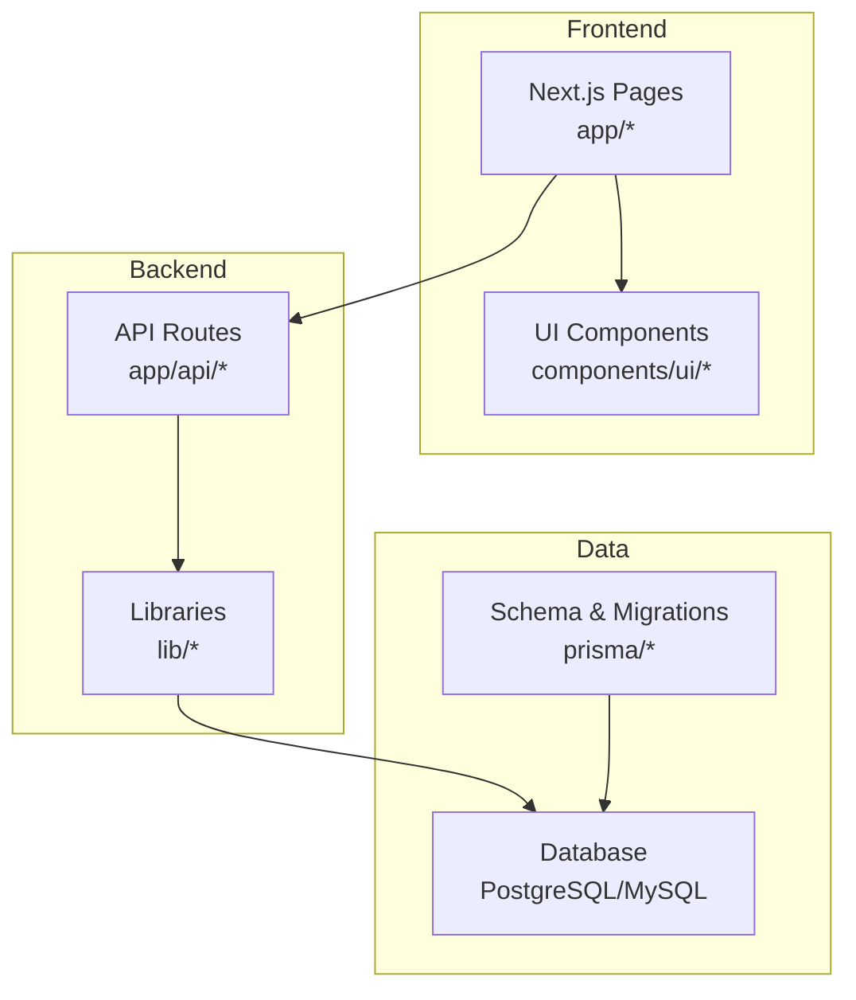
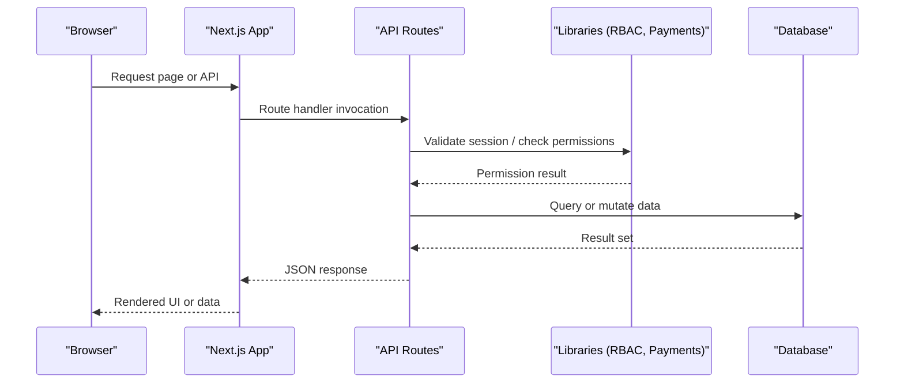
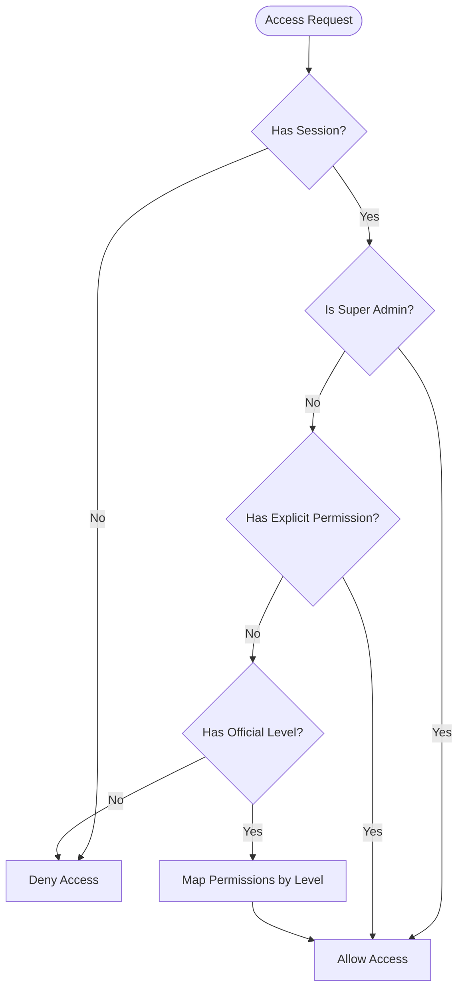
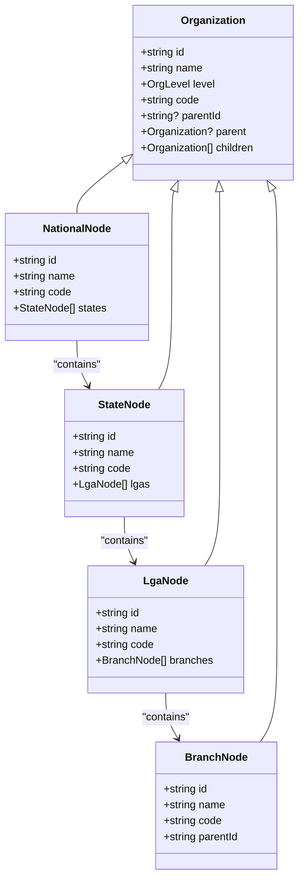
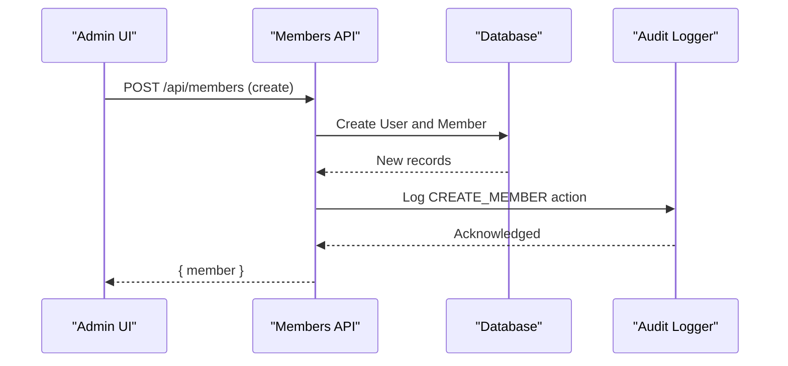
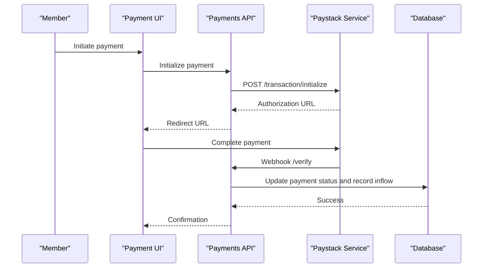
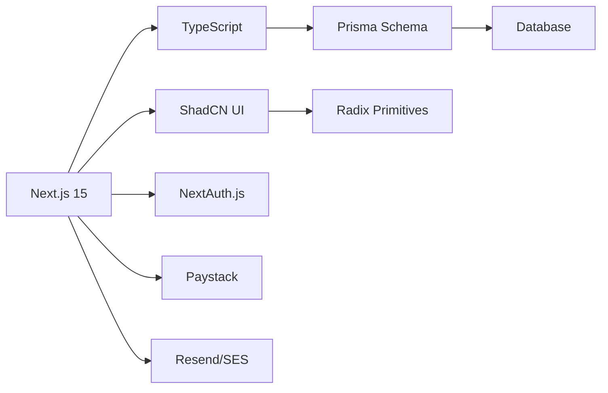

# Project Overview

<cite>
**Referenced Files in This Document**
- [README.md](file://README.md)
- [package.json](file://package.json)
- [prisma/schema.prisma](file://prisma/schema.prisma)
- [app/layout.tsx](file://app/layout.tsx)
- [lib/auth.config.ts](file://lib/auth.config.ts)
- [lib/rbac.ts](file://lib/rbac.ts)
- [lib/payments.ts](file://lib/payments.ts)
- [app/api/members/route.ts](file://app/api/members/route.ts)
- [components/ui/button.tsx](file://components/ui/button.tsx)
- [lib/org-helper.ts](file://lib/org-helper.ts)
- [components/admin/organizations/organization-tree.tsx](file://components/admin/organizations/organization-tree.tsx)
- [PROJECT_SUMMARY.md](file://PROJECT_SUMMARY.md)
</cite>

## Table of Contents
1. [Introduction](#introduction)
2. [Project Structure](#project-structure)
3. [Core Components](#core-components)
4. [Architecture Overview](#architecture-overview)
5. [Detailed Component Analysis](#detailed-component-analysis)
6. [Dependency Analysis](#dependency-analysis)
7. [Performance Considerations](#performance-considerations)
8. [Troubleshooting Guide](#troubleshooting-guide)
9. [Conclusion](#conclusion)

## Introduction
The TMC Portal is a full-stack enterprise membership and governance automation system designed for Islamic organizations that operate with a hierarchical structure: National → State → Local (including Local Government and Branch levels). It provides role-based access control, member management, payment integration, document handling, audit logging, and a modern user interface to support day-to-day governance and administration across jurisdictions.

Target audience includes national bodies, state chapters, local government chapters, and branch offices that need centralized oversight, standardized processes, and transparent reporting. The system uses terminology consistent with the codebase such as jurisdiction, officials, members, and organizations to reflect real-world organizational structures.

Key capabilities include:
- Hierarchical organization management across multiple jurisdiction levels
- Role-based access control with permissions scoped by jurisdiction
- Member lifecycle management from application to active status
- Payment processing via Paystack for membership fees, donations, and program fees
- Modern UI built with Next.js 15, TypeScript, Tailwind CSS, and ShadCN UI components
- Audit trails and email delivery tracking for accountability

This overview serves both beginners seeking to understand what the system does and experienced developers evaluating its architecture and technology choices.

**Section sources**
- [README.md:1-28](file://README.md#L1-L28)
- [PROJECT_SUMMARY.md:1-20](file://PROJECT_SUMMARY.md#L1-L20)

## Project Structure
The project follows a modern Next.js App Router layout with clear separation between API routes, pages, shared components, and server-side utilities. Key directories include:
- app/: Next.js pages and API routes
- components/: Reusable UI and feature-specific components
- lib/: Core libraries for authentication, RBAC, payments, and utilities
- prisma/: Database schema and migrations
- scripts/: Utility and maintenance scripts
- workers/: Background tasks (e.g., email worker)

**Diagram sources**
- [app/layout.tsx:20-63](file://app/layout.tsx#L20-L63)
- [package.json:17-102](file://package.json#L17-L102)
- [prisma/schema.prisma:12-205](file://prisma/schema.prisma#L12-L205)

**Section sources**
- [README.md:82-102](file://README.md#L82-L102)
- [PROJECT_SUMMARY.md:56-94](file://PROJECT_SUMMARY.md#L56-L94)

## Core Components
The system’s core revolves around four pillars:
- Authentication and Authorization: NextAuth.js configuration and JWT sessions with role-based access control
- Organization and Jurisdiction Management: Hierarchical models for National, State, Local Government, and Branch levels
- Member and Official Management: Profiles, statuses, approvals, and roles within jurisdictions
- Payments and Finance: Paystack integration for fee collection, verification, and financial recording

Technology stack highlights:
- Framework: Next.js 15 (App Router)
- Language: TypeScript
- Database: PostgreSQL (schema defined), MySQL driver configured in runtime
- ORM: Prisma
- Styling: Tailwind CSS
- UI Components: ShadCN UI (Radix-based primitives)
- Auth: NextAuth.js v5
- Payments: Paystack
- Email: Resend/Amazon SES

These components work together to provide a cohesive platform for managing multi-tiered Islamic organizations with robust governance features.

**Section sources**
- [README.md:16-28](file://README.md#L16-L28)
- [package.json:17-102](file://package.json#L17-L102)
- [prisma/schema.prisma:125-205](file://prisma/schema.prisma#L125-L205)

## Architecture Overview
The TMC Portal employs a layered architecture:
- Presentation Layer: Next.js pages and ShadCN UI components render responsive dashboards and public pages
- API Layer: Route handlers enforce authentication and authorization, orchestrate business logic, and interact with data services
- Service Layer: Libraries encapsulate domain logic (RBAC, payments, audit logging)
- Data Layer: Prisma schema defines entities; database stores persistent data

**Diagram sources**
- [app/api/members/route.ts:11-76](file://app/api/members/route.ts#L11-L76)
- [lib/rbac.ts:37-56](file://lib/rbac.ts#L37-L56)
- [lib/payments.ts:18-58](file://lib/payments.ts#L18-L58)

## Detailed Component Analysis

### Authentication and Session Management
- NextAuth.js v5 is configured with JWT strategy and custom sign-in page routing
- Root layout initializes providers and integrates analytics and chat widgets
- Configuration centralizes trust host, secret, session strategy, and sign-in page path

Practical example:
- Users authenticate via the sign-in page and receive JWT sessions used throughout protected routes and API calls

**Section sources**
- [lib/auth.config.ts:1-12](file://lib/auth.config.ts#L1-L12)
- [app/layout.tsx:42-63](file://app/layout.tsx#L42-L63)

### Role-Based Access Control (RBAC)
- RBAC enforces permissions based on user roles and jurisdiction levels
- Functions check explicit permissions, official level, and super admin privileges
- Helpers require authentication and specific permissions before allowing actions

Practical example:
- A State Admin can create and update members but cannot delete admins at other jurisdictions unless explicitly permitted

**Diagram sources**
- [lib/rbac.ts:37-56](file://lib/rbac.ts#L37-L56)
- [lib/rbac.ts:58-143](file://lib/rbac.ts#L58-L143)

**Section sources**
- [lib/rbac.ts:37-194](file://lib/rbac.ts#L37-L194)

### Organization and Jurisdiction Management
- Hierarchical organization model supports National, State, Local Government, and Branch levels
- Tree utilities build nested structures for UI and administrative operations
- Admin UI renders collapsible trees with edit/delete actions per node

Practical example:
- Administrators can visualize and manage the entire hierarchy, creating states under national headquarters and LGAs under states

**Diagram sources**
- [prisma/schema.prisma:125-205](file://prisma/schema.prisma#L125-L205)
- [lib/org-helper.ts:5-36](file://lib/org-helper.ts#L5-L36)
- [components/admin/organizations/organization-tree.tsx:32-35](file://components/admin/organizations/organization-tree.tsx#L32-L35)

**Section sources**
- [lib/org-helper.ts:38-98](file://lib/org-helper.ts#L38-L98)
- [components/admin/organizations/organization-tree.tsx:77-196](file://components/admin/organizations/organization-tree.tsx#L77-L196)

### Member Management API
- Members are created with hashed passwords, unique IDs, and assigned to an organization
- Retrieval supports filtering by organization and status with pagination
- Audit logs record creation events for compliance

Practical example:
- An official creates a new member profile, assigns them to their jurisdiction, and generates a unique membership ID based on organization code and count

**Diagram sources**
- [app/api/members/route.ts:78-197](file://app/api/members/route.ts#L78-L197)

**Section sources**
- [app/api/members/route.ts:11-76](file://app/api/members/route.ts#L11-L76)
- [app/api/members/route.ts:78-197](file://app/api/members/route.ts#L78-L197)

### Payment Integration
- Paystack integration handles initialization, verification, and webhook updates
- Payment records link to users, members, campaigns, and organizations
- Successful payments update campaign totals and record inflows in finance transactions

Practical example:
- A member pays membership fees; the system initializes a Paystack transaction, verifies success, updates the payment status, and records the inflow for the organization

**Diagram sources**
- [lib/payments.ts:18-58](file://lib/payments.ts#L18-L58)
- [lib/payments.ts:60-96](file://lib/payments.ts#L60-L96)
- [lib/payments.ts:100-190](file://lib/payments.ts#L100-L190)

**Section sources**
- [lib/payments.ts:18-248](file://lib/payments.ts#L18-L248)

### UI Components and Theming
- ShadCN UI components provide accessible, themeable primitives like buttons, dialogs, and tables
- Button component uses Radix primitives and class-variance-authority for variants and sizes
- Global styles and metadata are set in the root layout for SEO and PWA support

Practical example:
- Dashboards use consistent button variants and sizes across admin and member interfaces, ensuring accessibility and brand consistency

**Section sources**
- [components/ui/button.tsx:1-63](file://components/ui/button.tsx#L1-L63)
- [app/layout.tsx:20-63](file://app/layout.tsx#L20-L63)

## Dependency Analysis
The system’s dependencies align with its architecture:
- Next.js 15 drives routing and server-side rendering
- TypeScript ensures type safety across frontend and backend
- Prisma models define relationships among users, organizations, members, officials, and payments
- ShadCN UI leverages Radix primitives for accessibility and customization
- Paystack SDKs handle payment flows securely
- Resend/SES manages email notifications

**Diagram sources**
- [package.json:17-102](file://package.json#L17-L102)
- [prisma/schema.prisma:12-205](file://prisma/schema.prisma#L12-L205)

**Section sources**
- [package.json:17-102](file://package.json#L17-L102)
- [README.md:16-28](file://README.md#L16-L28)

## Performance Considerations
- Use pagination and selective field retrieval in API endpoints to reduce payload size
- Cache frequently accessed organization trees and navigation items where appropriate
- Optimize database queries with indexes on commonly filtered fields (e.g., organizationId, status)
- Defer heavy computations to background workers (e.g., email sending, report generation)
- Leverage Next.js caching strategies and server components for efficient rendering

[No sources needed since this section provides general guidance]

## Troubleshooting Guide
Common issues and resolutions:
- Authentication failures: Verify NextAuth configuration and environment variables (secret, URL)
- Permission errors: Ensure roles and permissions are correctly assigned and jurisdiction-scoped
- Payment discrepancies: Confirm Paystack keys and webhook handling; check payment status transitions
- Database connectivity: Validate connection strings and run migrations if schema drift occurs
- UI rendering problems: Check Tailwind and ShadCN setup; ensure global CSS and theme provider are initialized

**Section sources**
- [lib/auth.config.ts:1-12](file://lib/auth.config.ts#L1-L12)
- [lib/rbac.ts:162-194](file://lib/rbac.ts#L162-L194)
- [lib/payments.ts:18-96](file://lib/payments.ts#L18-L96)
- [app/layout.tsx:42-63](file://app/layout.tsx#L42-L63)

## Conclusion
The TMC Portal delivers a comprehensive, enterprise-grade solution for Islamic organizations requiring structured governance and membership automation. Its hierarchical design, robust RBAC, integrated payments, and modern UI make it suitable for national bodies, state chapters, and local jurisdictions. Developers can extend the system using well-defined APIs, typed schemas, and modular components while maintaining security and auditability.

[No sources needed since this section summarizes without analyzing specific files]