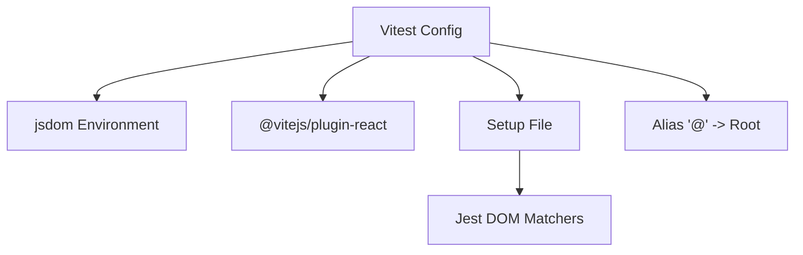
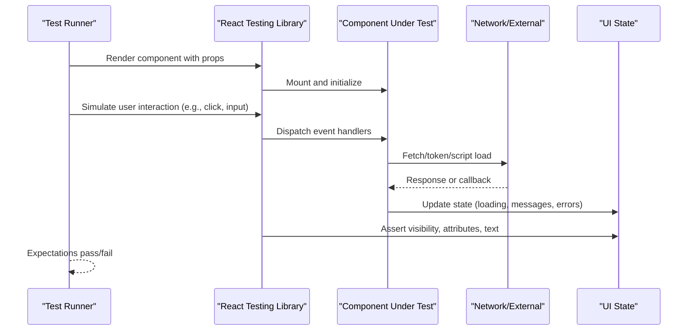
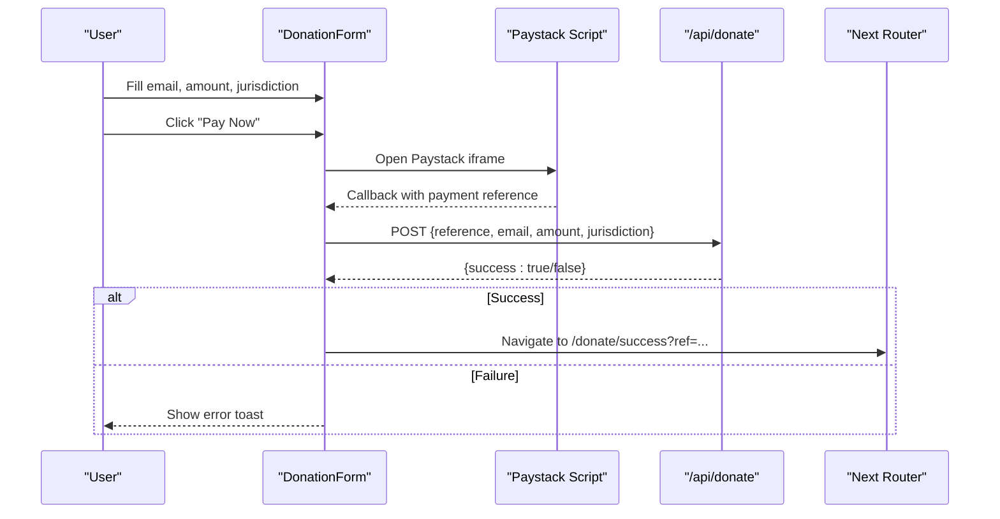
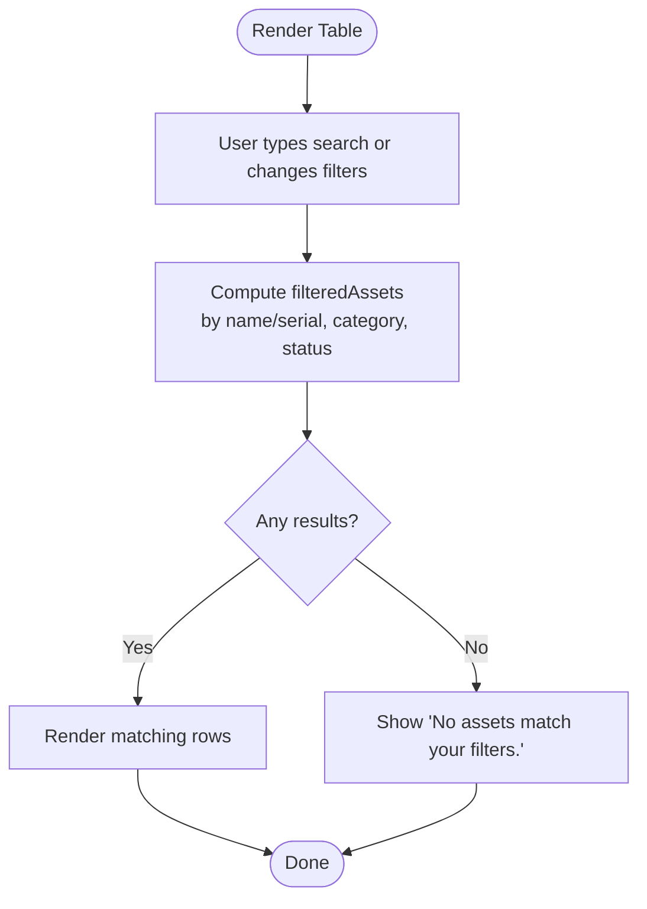
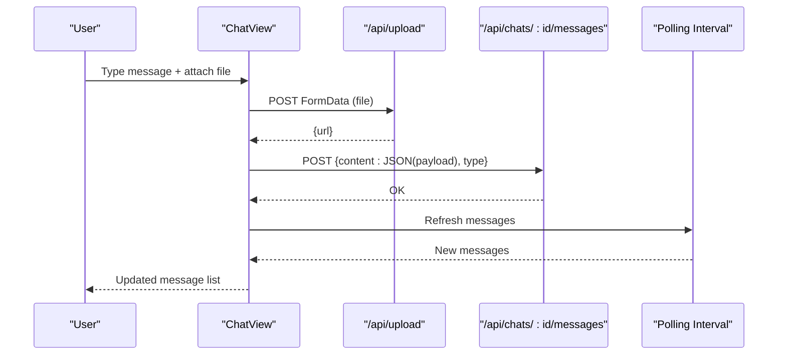
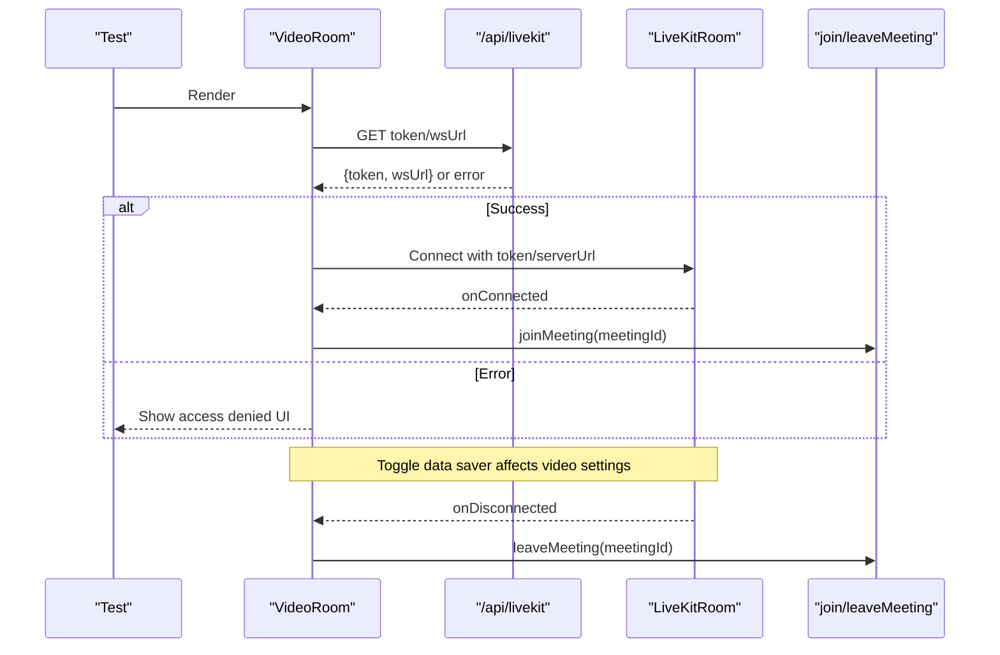
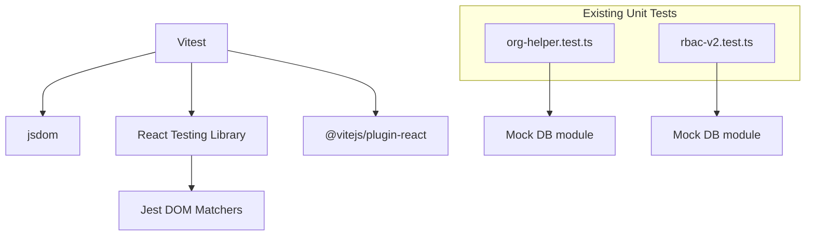

# Component Testing & UI Testing

<cite>
**Referenced Files in This Document**
- [package.json](file://package.json)
- [vitest.config.ts](file://vitest.config.ts)
- [vitest.setup.ts](file://vitest.setup.ts)
- [donation-form.tsx](file://components/donation/donation-form.tsx)
- [assets-table.tsx](file://components/admin/assets/assets-table.tsx)
- [chat-view.tsx](file://components/chat/chat-view.tsx)
- [video-room.tsx](file://components/meetings/video-room.tsx)
- [org-helper.test.ts](file://lib/org-helper.test.ts)
- [rbac-v2.test.ts](file://lib/rbac-v2.test.ts)
</cite>

## Table of Contents
1. Introduction
2. Project Structure
3. Core Components
4. Architecture Overview
5. Detailed Component Analysis
6. Dependency Analysis
7. Performance Considerations
8. Troubleshooting Guide
9. Conclusion
10. Appendices

## Introduction
This document provides a comprehensive guide to component and UI testing for the TMC Portal using React Testing Library with Vitest and jsdom. It focuses on testing complex UI components such as forms, modals, tables, and real-time features. You will learn strategies for simulating user interactions, validating form submissions, asserting state changes, and verifying lifecycle events. The guide includes practical examples for admin dashboard components, donation flows, meeting room interfaces, and chat functionality. It also covers mocking context providers, hooks, and external dependencies, plus guidance for responsive design, accessibility, cross-browser compatibility, performance testing for large datasets and real-time updates, and utilities for simulating network requests and third-party integrations.

## Project Structure
The project uses Vitest with a jsdom environment and React plugin for component tests. A global setup file adds custom matchers from Jest DOM for assertions like toBeInTheDocument and toHaveAttribute. An alias resolves the @ path to the repository root for consistent imports in tests.

**Diagram sources**
- [vitest.config.ts:1-17](file://vitest.config.ts#L1-L17)
- [vitest.setup.ts:1-2](file://vitest.setup.ts#L1-L2)

**Section sources**
- [vitest.config.ts:1-17](file://vitest.config.ts#L1-L17)
- [vitest.setup.ts:1-2](file://vitest.setup.ts#L1-L2)
- [package.json:104-125](file://package.json#L104-L125)

## Core Components
This section outlines how to test key UI components that appear across the portal:

- Donation Form: Validates inputs, handles jurisdiction selection, integrates Paystack via script injection, and verifies server-side confirmation flow.
- Admin Assets Table: Tests search, category/status filters, empty states, and action buttons within table rows.
- Chat View: Simulates message sending, attachment upload, polling-based message refresh, and error handling.
- Video Room: Mocks token acquisition, LiveKit integration, data saver toggling, and connection/disconnection lifecycle.

Testing strategies include:
- Rendering components with required props and minimal context.
- Using fireEvent or userEvent for interactions (click, change, submit).
- Waiting for async operations with waitFor and screen queries.
- Mocking fetch and third-party scripts where needed.
- Asserting UI feedback via toasts, disabled states, and visible content.

**Section sources**
- [donation-form.tsx:1-211](file://components/donation/donation-form.tsx#L1-L211)
- [assets-table.tsx:1-139](file://components/admin/assets/assets-table.tsx#L1-L139)
- [chat-view.tsx:1-258](file://components/chat/chat-view.tsx#L1-L258)
- [video-room.tsx:1-135](file://components/meetings/video-room.tsx#L1-L135)

## Architecture Overview
The following diagram shows how a typical UI flow is tested end-to-end at the component level, focusing on user actions, side effects, and UI updates.

[No sources needed since this diagram shows conceptual workflow, not actual code structure]

## Detailed Component Analysis

### Donation Form Testing
Focus areas:
- Input validation and toast notifications for missing fields.
- Jurisdiction cascading selects (level/state/LGA/branch).
- Paystack script loading and iframe invocation.
- Server verification call after payment callback.
- Navigation to success page.

Recommended test scenarios:
- Submit without email/amount triggers an error toast and does not open payment.
- Selecting different jurisdictions updates dependent options correctly.
- After Paystack callback, a POST to /api/donate is made with correct payload.
- On successful verification, navigation occurs to /donate/success with reference query param.
- Loading spinner appears during submission and disables button.

Mocking strategy:
- Mock next/navigation router.push to assert navigation without side effects.
- Mock window.PaystackPop to simulate opening iframe and invoking callbacks.
- Mock fetch to verify POST to /api/donate and response handling.
- Use jest-dom matchers to assert toast presence if rendered into DOM.

Accessibility considerations:
- Ensure labels are associated with inputs/selects.
- Verify keyboard navigation through selects and form controls.
- Confirm focus management when opening/closing dialogs or showing toasts.

Performance notes:
- Avoid re-render loops by ensuring stable keys and memoization where applicable.
- Debounce or throttle heavy computations if added later.

**Section sources**
- [donation-form.tsx:1-211](file://components/donation/donation-form.tsx#L1-L211)

#### Donation Flow Sequence

**Diagram sources**
- [donation-form.tsx:38-103](file://components/donation/donation-form.tsx#L38-L103)
- [donation-form.tsx:112-116](file://components/donation/donation-form.tsx#L112-L116)

### Admin Assets Table Testing
Focus areas:
- Search by name or serial number.
- Filtering by category and status.
- Empty state messaging when no assets match.
- Actions per row (edit, delete, etc.).

Recommended test scenarios:
- Typing into search narrows visible rows accordingly.
- Changing category/status filters updates visible rows.
- When filtered result is empty, “No assets match your filters.” is visible.
- Row actions are present and clickable; assert their presence and behavior via mocked handlers.

Mocking strategy:
- Provide static assets array to avoid network calls.
- Mock any child components’ actions if they trigger side effects.

Accessibility considerations:
- Ensure table headers are semantically linked to columns.
- Verify badges and status text are readable by screen readers.

Performance notes:
- For large datasets, consider virtualized lists; test scroll behavior and item rendering.

**Section sources**
- [assets-table.tsx:1-139](file://components/admin/assets/assets-table.tsx#L1-L139)

#### Filter Logic Flowchart

**Diagram sources**
- [assets-table.tsx:21-28](file://components/admin/assets/assets-table.tsx#L21-L28)
- [assets-table.tsx:92-97](file://components/admin/assets/assets-table.tsx#L92-L97)

### Chat View Testing
Focus areas:
- Fetching messages on mount and periodic polling.
- Sending messages with optional attachments.
- Handling legacy encrypted messages.
- Error handling and toast notifications.

Recommended test scenarios:
- On mount, messages are fetched and displayed; participants list updated.
- Sending a message posts to /api/chats/{id}/messages and clears input.
- If an attachment is selected, it uploads to /api/upload before posting message.
- Polling interval updates messages periodically; assert new messages appear.
- Network errors show appropriate toasts and do not crash the UI.

Mocking strategy:
- Mock fetch to return messages and handle POST responses.
- Stub setInterval to control polling frequency in tests.
- Mock file input changes and FormData creation.

Accessibility considerations:
- Ensure message list is scrollable and accessible.
- Confirm aria-live regions or announcements for new messages if implemented.

Performance notes:
- Debounce or limit polling rate in production; test with controlled intervals.
- Optimize media rendering to avoid layout thrash.

**Section sources**
- [chat-view.tsx:1-258](file://components/chat/chat-view.tsx#L1-L258)

#### Message Send Sequence

**Diagram sources**
- [chat-view.tsx:68-124](file://components/chat/chat-view.tsx#L68-L124)
- [chat-view.tsx:29-65](file://components/chat/chat-view.tsx#L29-L65)

### Video Room Testing
Focus areas:
- Token acquisition from /api/livekit.
- LiveKitRoom integration with video/audio settings.
- Data saver mode toggling affecting resolution and encoding.
- Lifecycle hooks for join/leave meeting.

Recommended test scenarios:
- On mount, fetches token and wsUrl; displays loader while waiting.
- If token fetch fails, shows access denied UI with error message.
- Toggling data saver reduces video resolution and bitrate settings.
- On connected, joinMeeting is called; on disconnected, leaveMeeting is called.

Mocking strategy:
- Mock fetch to return token/wsUrl or error.
- Mock LiveKit components/hooks to avoid real connections.
- Mock joinMeeting/leaveMeeting actions to assert lifecycle calls.

Accessibility considerations:
- Ensure controls have proper labels and keyboard support.
- Provide clear error states for accessibility tools.

Performance notes:
- Validate adaptive streaming and bandwidth settings under test conditions.
- Avoid unnecessary re-renders when toggling data saver.

**Section sources**
- [video-room.tsx:1-135](file://components/meetings/video-room.tsx#L1-L135)

#### Video Room Lifecycle

**Diagram sources**
- [video-room.tsx:28-44](file://components/meetings/video-room.tsx#L28-L44)
- [video-room.tsx:83-124](file://components/meetings/video-room.tsx#L83-L124)

## Dependency Analysis
The testing stack relies on Vitest, jsdom, and React Testing Library. Existing unit tests demonstrate patterns for mocking modules and database interactions. These patterns can be extended to component tests for UI logic.

**Diagram sources**
- [vitest.config.ts:1-17](file://vitest.config.ts#L1-L17)
- [vitest.setup.ts:1-2](file://vitest.setup.ts#L1-L2)
- [org-helper.test.ts:1-69](file://lib/org-helper.test.ts#L1-L69)
- [rbac-v2.test.ts:1-177](file://lib/rbac-v2.test.ts#L1-L177)

**Section sources**
- [vitest.config.ts:1-17](file://vitest.config.ts#L1-L17)
- [vitest.setup.ts:1-2](file://vitest.setup.ts#L1-L2)
- [org-helper.test.ts:1-69](file://lib/org-helper.test.ts#L1-L69)
- [rbac-v2.test.ts:1-177](file://lib/rbac-v2.test.ts#L1-L177)

## Performance Considerations
- Large datasets: Prefer virtualized lists for tables; test scrolling and item rendering boundaries.
- Real-time updates: Control polling intervals in tests; ensure no memory leaks from timers.
- Media handling: Limit image/video sizes in tests; mock network responses to avoid heavy payloads.
- Re-renders: Use memoization and stable keys to minimize unnecessary renders; assert render counts if critical.
- Bandwidth optimization: Validate data saver toggles affect resolution/bitrate; test both modes.

[No sources needed since this section provides general guidance]

## Troubleshooting Guide
Common issues and resolutions:
- Third-party scripts not loaded: Mock script onLoad and window globals; assert scriptLoaded state transitions.
- Network failures: Mock fetch to return error responses; assert toast messages and UI states.
- Timers and intervals: Use fake timers to control polling; ensure cleanup in teardown.
- Context providers: Wrap components with necessary providers in tests; mock session/auth contexts.
- Accessibility mismatches: Use axe-core or similar tools to detect issues; fix label associations and roles.

**Section sources**
- [donation-form.tsx:34-36](file://components/donation/donation-form.tsx#L34-L36)
- [chat-view.tsx:29-65](file://components/chat/chat-view.tsx#L29-L65)
- [video-room.tsx:28-44](file://components/meetings/video-room.tsx#L28-L44)

## Conclusion
By leveraging Vitest, jsdom, and React Testing Library, you can build robust tests for complex UI components in the TMC Portal. Focus on user-centric assertions, thorough mocking of external dependencies, and attention to accessibility and performance. Apply the patterns demonstrated here to forms, tables, chat, and real-time features to maintain high quality and reliability across the application.

[No sources needed since this section summarizes without analyzing specific files]

## Appendices

### Testing Utilities and Patterns
- Simulating user actions: Use fireEvent or userEvent for clicks, inputs, and form submissions.
- Network requests: Mock fetch globally or per-test to control responses and assert calls.
- Third-party integrations: Mock window objects and external libraries (e.g., Paystack, LiveKit) to isolate component behavior.
- Context providers: Create minimal provider wrappers for tests; mock session, auth, and theme contexts.
- Responsive design: Render at different viewport sizes; assert layout changes and hidden/shown elements.
- Cross-browser compatibility: Run tests in jsdom; consider browser-based tests for edge cases if needed.

[No sources needed since this section provides general guidance]