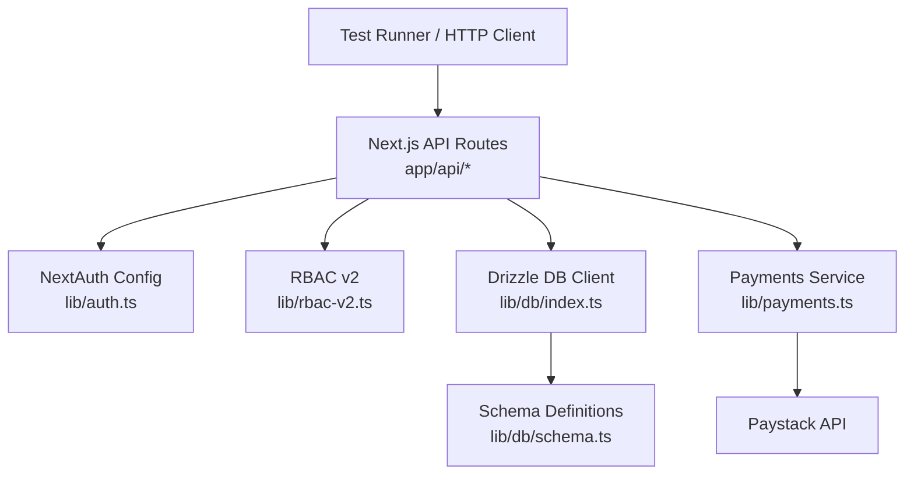
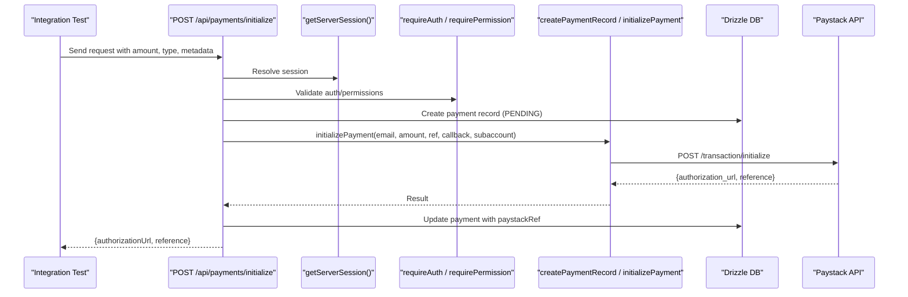
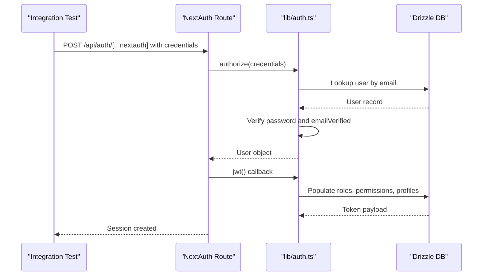
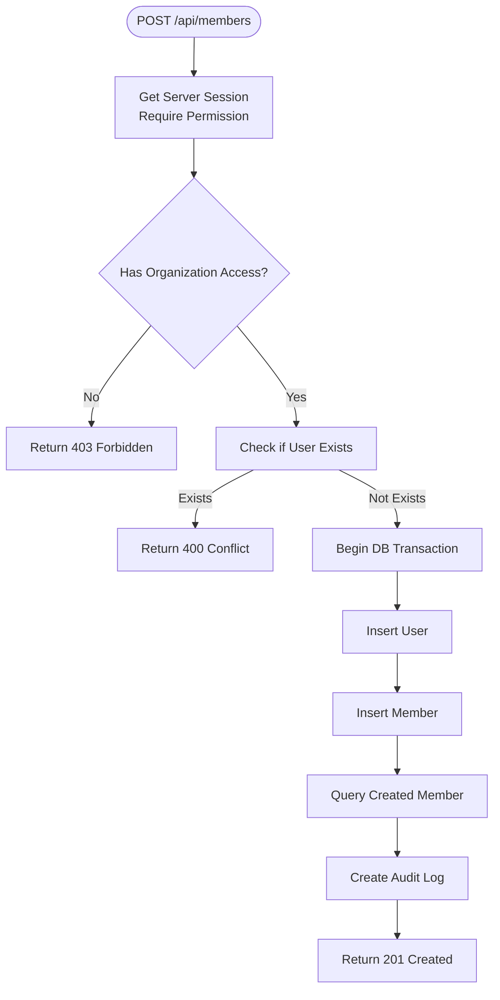
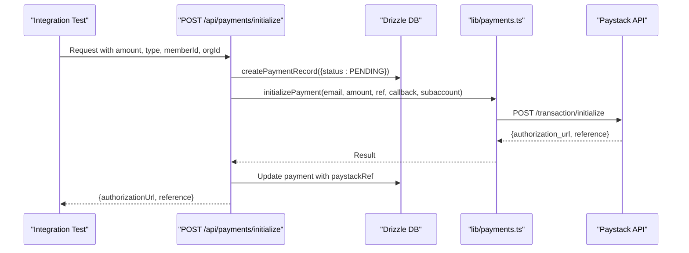
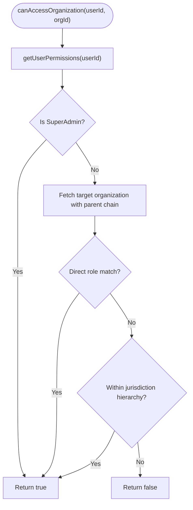
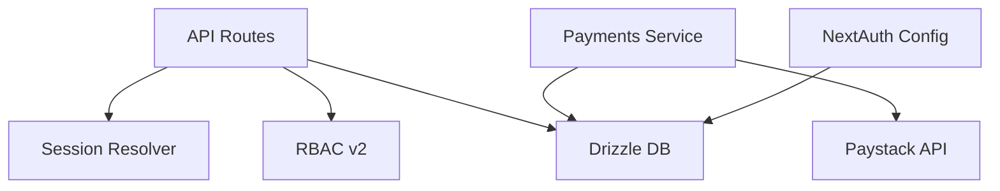

# Integration Testing & API Testing

<cite>
**Referenced Files in This Document**
- [route.ts](file://app/api/auth/[...nextauth]/route.ts)
- [auth.ts](file://lib/auth.ts)
- [index.ts](file://lib/db/index.ts)
- [schema.ts](file://lib/db/schema.ts)
- [signup route.ts](file://app/api/auth/signup/route.ts)
- [members route.ts](file://app/api/members/route.ts)
- [payments initialize route.ts](file://app/api/payments/initialize/route.ts)
- [payments.ts](file://lib/payments.ts)
- [rbac-v2.ts](file://lib/rbac-v2.ts)
- [rbac-v2.test.ts](file://lib/rbac-v2.test.ts)
- [vitest.config.ts](file://vitest.config.ts)
- [vitest.setup.ts](file://vitest.setup.ts)
</cite>

## Table of Contents
1. Introduction
2. Project Structure
3. Core Components
4. Architecture Overview
5. Detailed Component Analysis
6. Dependency Analysis
7. Performance Considerations
8. Troubleshooting Guide
9. Conclusion

## Introduction
This document provides a comprehensive integration testing guide for the TMC Portal with a focus on RESTful API endpoints under /api/*, authentication and authorization flows, database operations using Drizzle ORM, transaction handling, and data consistency verification. It includes strategies for testing complex workflows such as member registration, payment processing, and organization hierarchy operations, along with mock strategies for external services like Paystack payments, LiveKit video conferencing, and email services. Guidance is also provided for testing session management, role-based access control (RBAC), and performance considerations for parallel test execution.

## Project Structure
The TMC Portal exposes Next.js App Router API routes under app/api/* that implement business logic for authentication, membership, payments, and more. The application uses:
- NextAuth v5 for authentication and session management
- Drizzle ORM with MySQL for database access and schema definitions
- RBAC v2 for permission checks and jurisdiction-based access control
- Vitest for unit and integration tests with jsdom environment and aliases

**Diagram sources**
- [route.ts:1-8](file://app/api/auth/[...nextauth]/route.ts#L1-L8)
- [auth.ts:131-257](file://lib/auth.ts#L131-L257)
- [index.ts:1-17](file://lib/db/index.ts#L1-L17)
- [schema.ts:83-188](file://lib/db/schema.ts#L83-L188)
- [payments.ts:18-58](file://lib/payments.ts#L18-L58)

**Section sources**
- [route.ts:1-8](file://app/api/auth/[...nextauth]/route.ts#L1-L8)
- [auth.ts:131-257](file://lib/auth.ts#L131-L257)
- [index.ts:1-17](file://lib/db/index.ts#L1-L17)
- [schema.ts:83-188](file://lib/db/schema.ts#L83-L188)
- [vitest.config.ts:1-18](file://vitest.config.ts#L1-L18)
- [vitest.setup.ts:1-2](file://vitest.setup.ts#L1-L2)

## Core Components
- Authentication and Session Management
  - NextAuth handler at app/api/auth/[...nextauth] delegates to lib/auth configuration which sets up Drizzle adapter, credentials provider, JWT strategy, and token/session callbacks that enrich sessions with roles, permissions, and membership/official profiles.
- Authorization and RBAC
  - RBAC v2 provides functions to check permissions and organization access based on user roles and jurisdiction levels. API routes use requirePermission and canAccessOrganization to enforce access control.
- Database Access with Drizzle ORM
  - Centralized db client in lib/db/index.ts creates a pooled MySQL connection and exports drizzle instance with schema from lib/db/schema.ts. Schema defines tables and enums used across the system.
- Payment Processing
  - Payments service in lib/payments.ts initializes and verifies Paystack transactions, creates payment records, updates statuses, and records inflows into finance transactions.

Testing utilities and configuration:
- Vitest configured with jsdom environment and global helpers; setup file imports testing-library matchers.
- Existing unit tests demonstrate mocking patterns for DB modules and RBAC logic.

**Section sources**
- [route.ts:1-8](file://app/api/auth/[...nextauth]/route.ts#L1-L8)
- [auth.ts:131-257](file://lib/auth.ts#L131-L257)
- [rbac-v2.ts:141-337](file://lib/rbac-v2.ts#L141-L337)
- [index.ts:1-17](file://lib/db/index.ts#L1-L17)
- [schema.ts:83-188](file://lib/db/schema.ts#L83-L188)
- [payments.ts:18-190](file://lib/payments.ts#L18-L190)
- [vitest.config.ts:1-18](file://vitest.config.ts#L1-L18)
- [vitest.setup.ts:1-2](file://vitest.setup.ts#L1-L2)

## Architecture Overview
Integration tests should exercise end-to-end flows through API routes while isolating external dependencies via mocks. The following sequence illustrates a typical payment initialization flow:

**Diagram sources**
- [payments initialize route.ts:11-89](file://app/api/payments/initialize/route.ts#L11-L89)
- [payments.ts:18-58](file://lib/payments.ts#L18-L58)
- [payments.ts:100-131](file://lib/payments.ts#L100-L131)

**Section sources**
- [payments initialize route.ts:11-89](file://app/api/payments/initialize/route.ts#L11-L89)
- [payments.ts:18-190](file://lib/payments.ts#L18-L190)

## Detailed Component Analysis

### Authentication Flow Testing
- Endpoint: app/api/auth/[...nextauth]
- Behavior: Delegates to NextAuth handlers configured in lib/auth. Credentials provider validates email/password, enforces email verification, and returns user info. JWT strategy stores enriched token with roles, permissions, and profile details. Session callback populates session.user with roles, permissions, and membership/official context.
- Test Strategy:
  - Use a test client to call NextAuth endpoints (GET/POST) with valid/invalid credentials.
  - Verify session creation and enrichment by asserting presence of roles, permissions, and profile fields in subsequent requests.
  - Mock email sending to avoid real emails during signup/verification flows.
  - For impersonation flows, assert token updates when action is impersonate/revert_impersonate.

**Diagram sources**
- [route.ts:1-8](file://app/api/auth/[...nextauth]/route.ts#L1-L8)
- [auth.ts:146-257](file://lib/auth.ts#L146-L257)

**Section sources**
- [route.ts:1-8](file://app/api/auth/[...nextauth]/route.ts#L1-L8)
- [auth.ts:146-257](file://lib/auth.ts#L146-L257)

### Member Registration Workflow Testing
- Endpoints:
  - POST /api/auth/signup: Creates user, generates verification token, sends verification email, logs audit.
  - POST /api/members: Creates member within an organization, hashes password, generates unique member ID, wraps inserts in a transaction, logs audit.
- Business Logic Validation:
  - Input validation via Zod in signup route.
  - Duplicate email checks.
  - Organization access checks via RBAC before creating members.
  - Transactional integrity ensures both user and member are created or neither persists.
- Test Strategy:
  - Validate error responses for invalid payloads and duplicate emails.
  - Assert that verification tokens are stored and emails are sent (mocked).
  - For member creation, assert transaction behavior by verifying both user and member exist after success and do not exist after failure scenarios.
  - Verify audit logs are created for user signup and member creation.

**Diagram sources**
- [members route.ts:78-203](file://app/api/members/route.ts#L78-L203)

**Section sources**
- [signup route.ts:25-141](file://app/api/auth/signup/route.ts#L25-L141)
- [members route.ts:78-203](file://app/api/members/route.ts#L78-L203)

### Payment Processing Workflow Testing
- Endpoint: POST /api/payments/initialize
- Behavior: Requires authenticated session, resolves organization and optional subaccount, creates a pending payment record, initializes Paystack transaction, updates payment with Paystack reference, and logs audit.
- Test Strategy:
  - Mock Paystack API calls to return deterministic results for initialization and verification.
  - Assert payment record creation and update with correct references and timestamps.
  - Verify audit log entries for initialization actions.
  - Test subaccount routing by providing different organization IDs and asserting Paystack subaccount usage.

**Diagram sources**
- [payments initialize route.ts:11-89](file://app/api/payments/initialize/route.ts#L11-L89)
- [payments.ts:18-58](file://lib/payments.ts#L18-L58)
- [payments.ts:100-131](file://lib/payments.ts#L100-L131)

**Section sources**
- [payments initialize route.ts:11-89](file://app/api/payments/initialize/route.ts#L11-L89)
- [payments.ts:18-190](file://lib/payments.ts#L18-L190)

### Organization Hierarchy Operations Testing
- RBAC v2 enforces jurisdiction-based access control:
  - hasPermission checks user roles and permissions, granting SYSTEM-level superadmin access to all permissions.
  - canAccessOrganization traverses organization hierarchy to determine if a target organization is within the user’s jurisdiction.
- Test Strategy:
  - Mock DB queries to simulate various organization hierarchies and user roles.
  - Assert that users with appropriate roles can access child organizations but cannot access unrelated jurisdictions.
  - Validate that superadmin bypasses jurisdiction checks.

**Diagram sources**
- [rbac-v2.ts:170-259](file://lib/rbac-v2.ts#L170-L259)

**Section sources**
- [rbac-v2.ts:141-337](file://lib/rbac-v2.ts#L141-L337)
- [rbac-v2.test.ts:27-177](file://lib/rbac-v2.test.ts#L27-L177)

### External Service Mocking Strategies
- Paystack Payments:
  - Mock axios calls to https://api.paystack.co endpoints to return controlled responses for initialization, verification, and subaccount listing.
  - Validate that payment records are created and updated correctly with references and statuses.
- Email Services:
  - Mock sendEmail to avoid real emails during signup and verification flows.
  - Assert that correct templates and URLs are passed to the email function.
- LiveKit Video Conferencing:
  - Mock any LiveKit-related API calls (e.g., recording start/stop) to ensure deterministic test outcomes without requiring a live LiveKit server.
  - Validate that meeting recordings and shares are handled as expected in tests.

[No sources needed since this section provides general guidance]

### Testing Utilities and Fixtures
- Test Configuration:
  - Vitest uses jsdom environment and global helpers; setup file imports testing-library matchers.
  - Path alias @ maps to project root for consistent imports in tests.
- Mocking Patterns:
  - Use vi.mock to stub entire modules (e.g., DB module) and define fluent query methods returning resolved values.
  - Leverage existing tests in rbac-v2.test.ts as examples for mocking DB selections and assertions.
- Fixtures:
  - Create helper functions to generate test users, organizations, and members with realistic attributes.
  - Use transactions to roll back test data changes and maintain database isolation between tests.

**Section sources**
- [vitest.config.ts:1-18](file://vitest.config.ts#L1-L18)
- [vitest.setup.ts:1-2](file://vitest.setup.ts#L1-L2)
- [rbac-v2.test.ts:1-177](file://lib/rbac-v2.test.ts#L1-L177)

## Dependency Analysis
The integration points and dependencies relevant to testing include:
- API routes depend on session resolution, RBAC checks, and DB operations.
- Payments service depends on Paystack API and DB writes for payment records and finance transactions.
- Authentication depends on Drizzle adapter and token/session callbacks to enrich user context.

**Diagram sources**
- [payments initialize route.ts:11-89](file://app/api/payments/initialize/route.ts#L11-L89)
- [payments.ts:18-190](file://lib/payments.ts#L18-L190)
- [auth.ts:131-257](file://lib/auth.ts#L131-L257)

**Section sources**
- [payments initialize route.ts:11-89](file://app/api/payments/initialize/route.ts#L11-L89)
- [payments.ts:18-190](file://lib/payments.ts#L18-L190)
- [auth.ts:131-257](file://lib/auth.ts#L131-L257)

## Performance Considerations
- Parallel Execution:
  - Use Vitest’s parallel test runner to execute tests concurrently. Ensure each test uses isolated data via transactions or dedicated test databases to prevent interference.
  - Avoid shared mutable state; prefer fixtures and factories to create fresh data per test.
- Database Isolation:
  - Wrap test suites in transactions that rollback after each test to maintain clean state.
  - For integration tests hitting the actual database, consider using a separate test database instance or Dockerized MySQL container.
- External Service Mocks:
  - Mock network calls to reduce flakiness and speed up tests.
  - Use deterministic responses for Paystack, email, and LiveKit to avoid timeouts and rate limits.
- Assertion Efficiency:
  - Minimize unnecessary DB queries in tests; rely on mocked responses where possible.
  - Batch assertions to reduce overhead and improve readability.

[No sources needed since this section provides general guidance]

## Troubleshooting Guide
Common issues and debugging tips:
- Authentication Failures:
  - Verify credentials provider configuration and email verification status.
  - Check JWT callback errors and session population in logs.
- Authorization Errors:
  - Ensure RBAC permissions are correctly assigned and jurisdiction levels align with organization hierarchy.
  - Use requirePermission and canAccessOrganization to diagnose access denials.
- Payment Initialization Failures:
  - Confirm Paystack secret key configuration and network connectivity.
  - Validate payment record creation and updates; inspect audit logs for discrepancies.
- Database Transactions:
  - Inspect transaction boundaries in member creation to ensure atomicity.
  - Rollback test data to avoid contamination between tests.

**Section sources**
- [auth.ts:224-257](file://lib/auth.ts#L224-L257)
- [rbac-v2.ts:313-337](file://lib/rbac-v2.ts#L313-L337)
- [payments initialize route.ts:11-89](file://app/api/payments/initialize/route.ts#L11-L89)
- [members route.ts:139-186](file://app/api/members/route.ts#L139-L186)

## Conclusion
This integration testing guide outlines how to validate RESTful API endpoints, authentication and authorization flows, and database operations using Drizzle ORM in the TMC Portal. By leveraging Vitest, mocking external services, and enforcing transactional integrity, you can build robust tests for complex workflows such as member registration, payment processing, and organization hierarchy operations. Adhering to these strategies ensures reliable, maintainable, and performant integration tests that safeguard the portal’s core functionality.