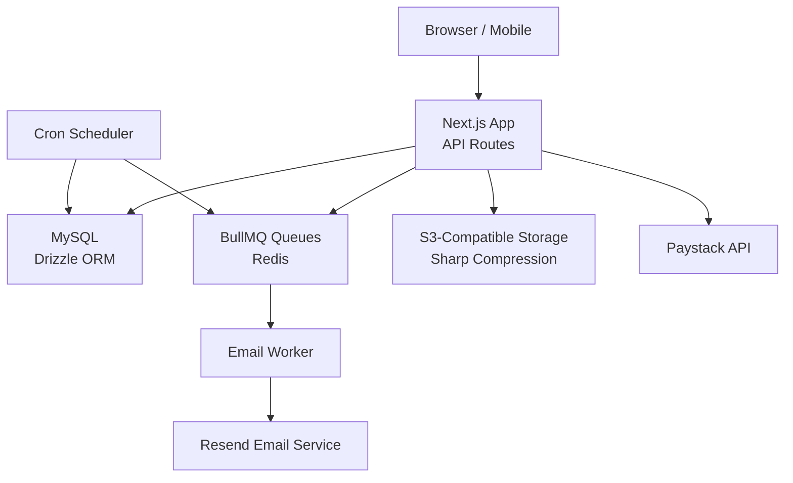
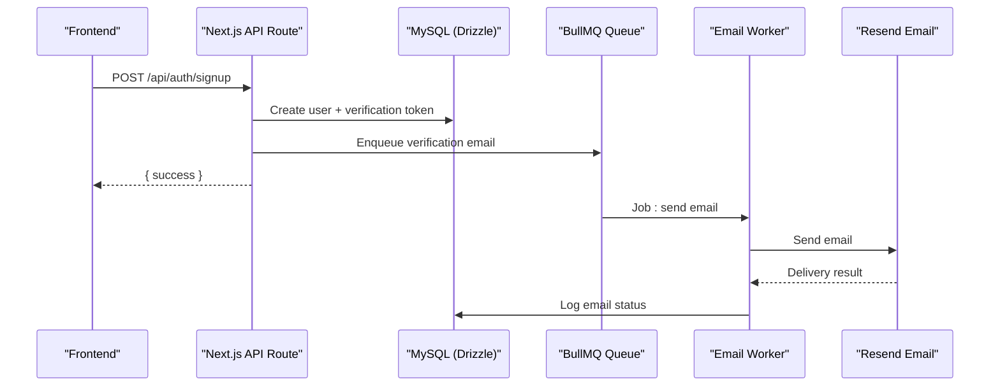
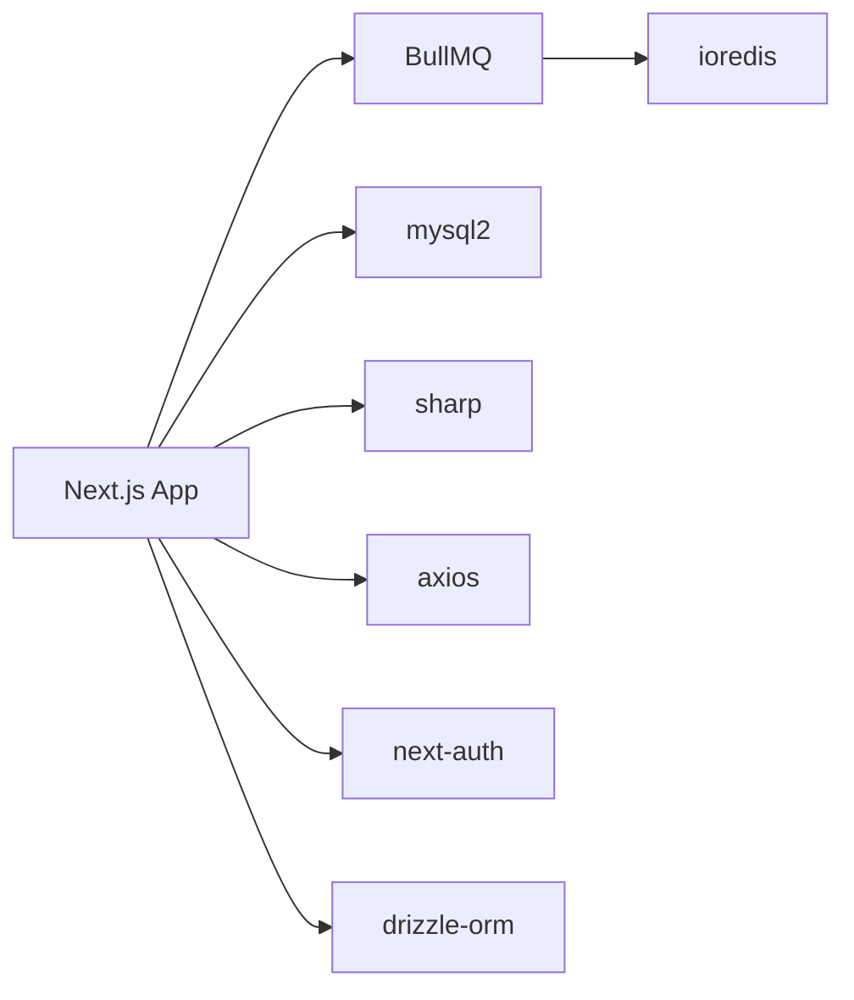

# Performance & Load Testing

<cite>
**Referenced Files in This Document**
- [package.json](file://package.json)
- [next.config.ts](file://next.config.ts)
- [lib/queue.ts](file://lib/queue.ts)
- [workers/email-worker.ts](file://workers/email-worker.ts)
- [workers/scheduler.ts](file://workers/scheduler.ts)
- [lib/redis.ts](file://lib/redis.ts)
- [lib/storage.ts](file://lib/storage.ts)
- [lib/payments.ts](file://lib/payments.ts)
- [app/api/auth/signup/route.ts](file://app/api/auth/signup/route.ts)
- [app/api/payments/initialize/route.ts](file://app/api/payments/initialize/route.ts)
- [app/api/members/apply/route.ts](file://app/api/members/apply/route.ts)
- [lib/email.ts](file://lib/email.ts)
- [lib/db/index.ts](file://lib/db/index.ts)
- [lib/db/schema.ts](file://lib/db/schema.ts)
- [drizzle/0004_add_programme_report_indexes.sql](file://drizzle/0004_add_programme_report_indexes.sql)
</cite>

## Table of Contents
1. Introduction
2. Project Structure
3. Core Components
4. Architecture Overview
5. Detailed Component Analysis
6. Dependency Analysis
7. Performance Considerations
8. Troubleshooting Guide
9. Conclusion
10. Appendices

## Introduction
This document provides a comprehensive performance and load testing guide for the TMC Portal, focusing on application scalability and optimization across database queries, API responses, frontend rendering, background jobs, email delivery, scheduled tasks, real-time features, file uploads, storage capacity, monitoring, caching, indexing, and CDN strategies. It includes methodologies to identify bottlenecks, stress-testing approaches for high-traffic scenarios (member registration spikes, payment processing loads, real-time communication), and profiling techniques for Next.js applications.

## Project Structure
The TMC Portal is a Next.js application with:
- API routes under app/api for authentication, payments, members, chats, livekit, uploads, etc.
- Background job processing via BullMQ queues and workers for emails and notifications.
- A cron-based scheduler for weekly/daily/monthly tasks.
- Database access through Drizzle ORM with MySQL.
- File storage via S3-compatible object storage with image compression using Sharp.
- Payment integration with Paystack.
- Redis-backed queues and connections.

**Diagram sources**
- [next.config.ts:11-39](file://next.config.ts#L11-L39)
- [lib/queue.ts:1-19](file://lib/queue.ts#L1-L19)
- [workers/email-worker.ts:1-32](file://workers/email-worker.ts#L1-L32)
- [workers/scheduler.ts:1-51](file://workers/scheduler.ts#L1-L51)
- [lib/storage.ts:1-100](file://lib/storage.ts#L1-L100)
- [lib/payments.ts:1-248](file://lib/payments.ts#L1-L248)
- [lib/db/index.ts:1-16](file://lib/db/index.ts#L1-L16)

**Section sources**
- [package.json:1-127](file://package.json#L1-L127)
- [next.config.ts:1-41](file://next.config.ts#L1-L41)

## Core Components
- API endpoints:
  - Member signup flow with validation, hashing, token generation, and email verification.
  - Payment initialization and verification flows integrating Paystack.
  - Membership application submission with organization resolution and metadata handling.
- Background processing:
  - BullMQ queues for email and notifications.
  - Email worker that sends emails via Resend and logs outcomes.
  - Cron scheduler for weekly program reminders, daily continuous reminders, monthly office report nudges, and automated backups.
- Storage:
  - S3-compatible upload with optional image compression and local fallback.
- Database:
  - Drizzle ORM with MySQL connection pooling.
  - Schema definitions including enums and tables for users, organizations, payments, etc.
  - Indexes for programme reports and related queries.

**Section sources**
- [app/api/auth/signup/route.ts:1-141](file://app/api/auth/signup/route.ts#L1-L141)
- [app/api/payments/initialize/route.ts:1-91](file://app/api/payments/initialize/route.ts#L1-L91)
- [app/api/members/apply/route.ts:1-223](file://app/api/members/apply/route.ts#L1-L223)
- [lib/queue.ts:1-19](file://lib/queue.ts#L1-L19)
- [workers/email-worker.ts:1-32](file://workers/email-worker.ts#L1-L32)
- [workers/scheduler.ts:1-337](file://workers/scheduler.ts#L1-L337)
- [lib/storage.ts:1-100](file://lib/storage.ts#L1-L100)
- [lib/db/index.ts:1-16](file://lib/db/index.ts#L1-L16)
- [lib/db/schema.ts:1-200](file://lib/db/schema.ts#L1-L200)
- [drizzle/0004_add_programme_report_indexes.sql:1-7](file://drizzle/0004_add_programme_report_indexes.sql#L1-L7)

## Architecture Overview
The system uses a layered architecture:
- Frontend requests hit Next.js API routes.
- Business logic performs validations, interacts with the database, external APIs (Paystack, Resend), and queues background jobs.
- Workers process queued jobs asynchronously, decoupling heavy operations from request paths.
- Scheduled tasks run periodically to send reminders, nudges, and perform backups.
- Storage handles file uploads with compression and returns proxy URLs or direct paths.

**Diagram sources**
- [app/api/auth/signup/route.ts:25-113](file://app/api/auth/signup/route.ts#L25-L113)
- [lib/email.ts:21-92](file://lib/email.ts#L21-L92)
- [lib/queue.ts:1-19](file://lib/queue.ts#L1-L19)
- [workers/email-worker.ts:10-24](file://workers/email-worker.ts#L10-L24)

**Section sources**
- [lib/email.ts:1-423](file://lib/email.ts#L1-L423)
- [lib/queue.ts:1-19](file://lib/queue.ts#L1-L19)
- [workers/email-worker.ts:1-32](file://workers/email-worker.ts#L1-L32)

## Detailed Component Analysis

### Member Registration Spike Load Testing
Focus areas:
- Validation overhead (Zod schema).
- Password hashing cost (bcrypt).
- Database writes (users, verification tokens).
- Email queueing and delivery throughput.

Methodology:
- Use a load generator (e.g., k6, Artillery) to simulate concurrent signups.
- Measure response times, error rates, and queue depth.
- Monitor DB connection pool saturation and query latency.
- Track email queue backlog and worker processing rate.

Optimization tips:
- Ensure proper DB indexes on frequently queried fields (email uniqueness).
- Tune bcrypt rounds based on CPU capacity.
- Scale email workers horizontally; monitor Redis memory and queue persistence.
- Consider rate limiting at the API layer during spikes.

**Section sources**
- [app/api/auth/signup/route.ts:15-113](file://app/api/auth/signup/route.ts#L15-L113)
- [lib/email.ts:21-92](file://lib/email.ts#L21-L92)
- [lib/queue.ts:1-19](file://lib/queue.ts#L1-L19)
- [workers/email-worker.ts:10-24](file://workers/email-worker.ts#L10-L24)

### Payment Processing Load Testing
Focus areas:
- Initialization and verification calls to Paystack.
- Database transactions for payment records and finance inflows.
- Audit logging and metadata handling.

Methodology:
- Simulate concurrent payment initializations and callbacks.
- Measure external API latency and retry behavior.
- Validate idempotency and duplicate prevention.
- Monitor DB write contention and transaction durations.

Optimization tips:
- Cache bank lists if frequently accessed.
- Implement retries with exponential backoff for Paystack calls.
- Batch updates where possible; ensure atomicity for financial records.
- Add indexes on payment references and timestamps for fast lookups.

**Section sources**
- [app/api/payments/initialize/route.ts:11-89](file://app/api/payments/initialize/route.ts#L11-L89)
- [lib/payments.ts:18-190](file://lib/payments.ts#L18-L190)

### Real-Time Communication Stress Testing
Focus areas:
- LiveKit integration for video/audio rooms.
- WebSocket scaling and media server capacity.
- Chat message throughput and persistence.

Methodology:
- Simulate many concurrent room participants.
- Measure signaling latency, media stream quality, and drop rates.
- Monitor LiveKit server metrics and resource usage.
- Test chat message bursts and persistence under load.

Optimization tips:
- Scale LiveKit nodes horizontally; use load balancers for signaling.
- Optimize client-side media settings (resolution, bitrate).
- Implement message batching and backpressure mechanisms.
- Monitor Redis pub/sub channels for chat events.

**Section sources**
- [package.json:79-80](file://package.json#L79-L80)
- [app/api/livekit/route.ts](file://app/api/livekit/route.ts)
- [app/api/chat/route.ts](file://app/api/chat/route.ts)

### Background Jobs and Scheduled Tasks
Focus areas:
- Weekly programme reminders, daily continuous reminders, monthly office report nudges.
- Automated backups triggered by scheduler.
- Email queue throughput and reliability.

Methodology:
- Simulate large datasets for programmes, registrations, and offices.
- Measure scheduler execution time and DB query performance.
- Monitor queue sizes, worker concurrency, and failure rates.
- Validate backup script execution and output integrity.

Optimization tips:
- Add DB indexes for date ranges and statuses used in queries.
- Paginate large result sets in schedulers to avoid memory pressure.
- Configure worker concurrency based on CPU and Redis capacity.
- Implement alerting on failed jobs and long-running tasks.

**Section sources**
- [workers/scheduler.ts:12-51](file://workers/scheduler.ts#L12-L51)
- [workers/scheduler.ts:53-197](file://workers/scheduler.ts#L53-L197)
- [workers/scheduler.ts:199-337](file://workers/scheduler.ts#L199-L337)
- [lib/queue.ts:1-19](file://lib/queue.ts#L1-L19)
- [lib/email.ts:21-92](file://lib/email.ts#L21-L92)

### File Uploads and Storage Capacity
Focus areas:
- Image compression with Sharp before upload.
- S3 vs local fallback behavior.
- Upload limits and throughput.

Methodology:
- Simulate concurrent large file uploads.
- Measure compression time, network transfer, and storage I/O.
- Monitor disk space and S3 bucket quotas.
- Validate returned URLs and access controls.

Optimization tips:
- Enable CDN for uploaded assets; configure cache headers.
- Set appropriate upload size limits per endpoint.
- Use multipart uploads for large files.
- Compress images selectively; consider adaptive quality based on device.

**Section sources**
- [lib/storage.ts:25-99](file://lib/storage.ts#L25-L99)
- [next.config.ts:20-36](file://next.config.ts#L20-L36)

### Database Query Optimization
Focus areas:
- Programme queries with date ranges and statuses.
- Organisation lookups and hierarchical resolution.
- Payment record creation and updates.

Methodology:
- Use EXPLAIN plans to analyze slow queries.
- Identify missing indexes and add them strategically.
- Reduce N+1 queries by batching or joining where appropriate.
- Monitor connection pool utilization and slow query logs.

Optimization tips:
- Add composite indexes for frequent filter combinations (e.g., organizationId, startDate, status).
- Use selective column projections to reduce payload size.
- Implement read replicas for reporting-heavy workloads.
- Cache hot reads with Redis where consistency allows.

**Section sources**
- [lib/db/index.ts:10-16](file://lib/db/index.ts#L10-L16)
- [lib/db/schema.ts:84-188](file://lib/db/schema.ts#L84-L188)
- [drizzle/0004_add_programme_report_indexes.sql:1-7](file://drizzle/0004_add_programme_report_indexes.sql#L1-L7)

### Frontend Rendering Performance
Focus areas:
- Next.js build configuration and static optimizations.
- Image handling and remote patterns.
- Service worker usage for caching.

Methodology:
- Profile page load times with Lighthouse and Web Vitals.
- Analyze bundle size and code splitting effectiveness.
- Measure Time to First Byte (TTFB) and Largest Contentful Paint (LCP).
- Validate service worker caching behavior.

Optimization tips:
- Keep images optimized; leverage CDN caching.
- Use dynamic imports for heavy components.
- Minimize server-side rendering for non-critical content.
- Configure cache-control headers appropriately.

**Section sources**
- [next.config.ts:11-39](file://next.config.ts#L11-L39)
- [package.json:6-12](file://package.json#L6-L12)

## Dependency Analysis
Key runtime dependencies impacting performance:
- BullMQ and ioredis for queuing and Redis connectivity.
- mysql2 driver for database connections.
- sharp for image processing.
- axios for HTTP calls to Paystack and other services.
- next-auth and drizzle-orm for auth and data access.

**Diagram sources**
- [package.json:66-83](file://package.json#L66-L83)

**Section sources**
- [package.json:17-102](file://package.json#L17-L102)

## Performance Considerations
- Concurrency and Scaling:
  - Horizontal scaling of Next.js instances behind a load balancer.
  - Increase worker concurrency for email and notification queues based on CPU and Redis capacity.
  - Use connection pooling for MySQL; tune pool size according to workload.
- Caching Strategies:
  - Cache frequent reads (e.g., organisation trees, settings) in Redis.
  - Use CDN for static assets and uploaded images; set appropriate cache lifetimes.
  - Implement application-level caching for expensive computations.
- Database Indexing:
  - Add composite indexes for common query patterns (e.g., programmes by organization and date range).
  - Monitor index usage and remove unused indexes to reduce write overhead.
- External API Limits:
  - Rate limit calls to Paystack and Resend; implement retries with backoff.
  - Cache bank lists and other stable reference data.
- Memory and CPU:
  - Profile Node.js processes to detect leaks and hot paths.
  - Offload CPU-intensive tasks (image compression) to separate workers or containers.
- Monitoring and Alerting:
  - Track queue depths, worker throughput, and error rates.
  - Alert on high DB latency, slow queries, and external API failures.
  - Monitor storage capacity and CDN cache hit ratios.

[No sources needed since this section provides general guidance]

## Troubleshooting Guide
Common issues and diagnostics:
- Email delivery failures:
  - Check Resend API key and logs; verify emailLogs entries for errors.
  - Inspect worker logs for exceptions and retry behavior.
- Payment initialization errors:
  - Validate Paystack keys and network connectivity.
  - Review audit logs and payment records for inconsistencies.
- Signup bottlenecks:
  - Monitor DB connection pool saturation and slow queries.
  - Verify unique constraints and indexing on email.
- Scheduler delays:
  - Ensure cron jobs are running; check logs for errors.
  - Validate queue health and worker availability.
- Storage upload failures:
  - Confirm S3 credentials and bucket policies.
  - Check disk space for local fallback and permissions.

**Section sources**
- [lib/email.ts:21-92](file://lib/email.ts#L21-L92)
- [workers/email-worker.ts:10-24](file://workers/email-worker.ts#L10-L24)
- [app/api/payments/initialize/route.ts:11-89](file://app/api/payments/initialize/route.ts#L11-L89)
- [app/api/auth/signup/route.ts:25-113](file://app/api/auth/signup/route.ts#L25-L113)
- [workers/scheduler.ts:12-51](file://workers/scheduler.ts#L12-L51)
- [lib/storage.ts:66-99](file://lib/storage.ts#L66-L99)

## Conclusion
To ensure the TMC Portal scales reliably under high traffic, focus on:
- Decoupling heavy operations via queues and workers.
- Optimizing database queries and adding strategic indexes.
- Implementing robust caching and CDN strategies.
- Profiling and monitoring end-to-end performance across API, background jobs, and storage.
- Stress-testing critical flows like member registration, payments, and real-time communication to validate capacity and resilience.

[No sources needed since this section summarizes without analyzing specific files]

## Appendices

### Load Testing Scenarios Checklist
- Member registration spikes:
  - Concurrent signups, email queue depth, DB write latency.
- Payment processing loads:
  - Concurrent initializations, callback handling, financial record updates.
- Real-time communication:
  - Concurrent room participants, signaling latency, media quality.
- Background jobs:
  - Scheduler execution time, queue throughput, failure rates.
- File uploads:
  - Concurrent uploads, compression time, storage capacity.

[No sources needed since this section provides general guidance]