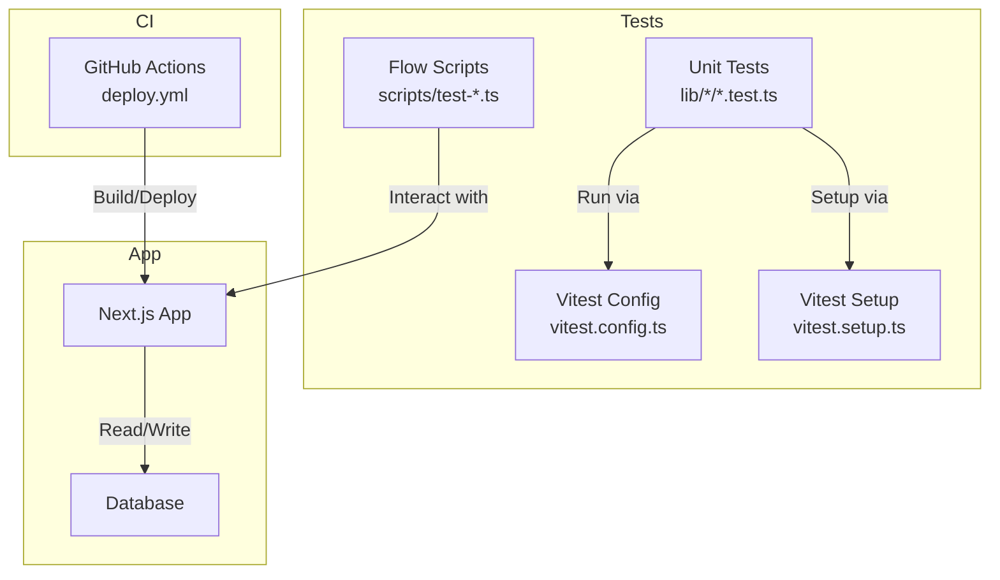
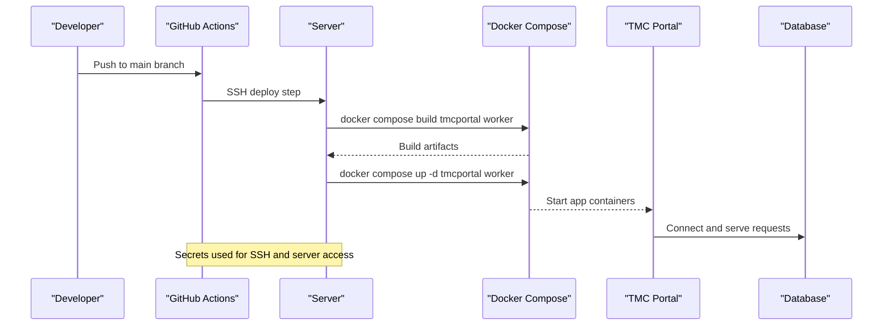
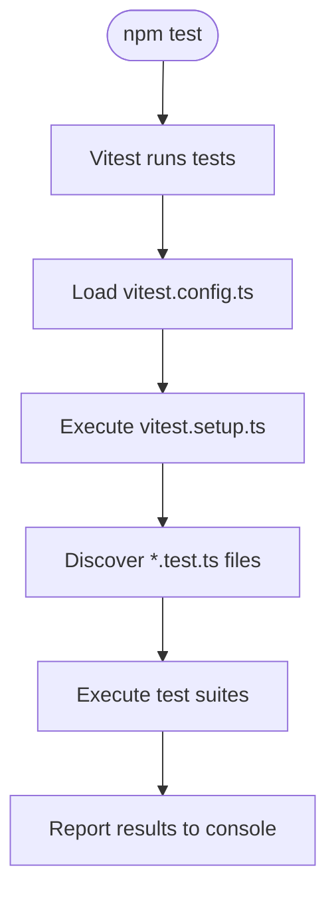
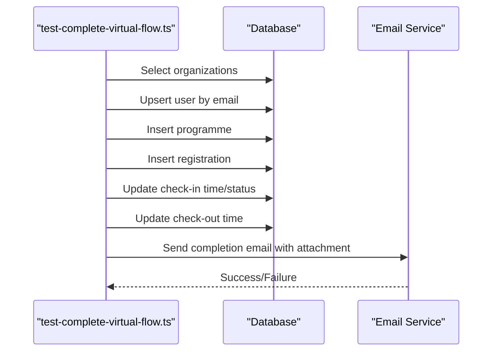
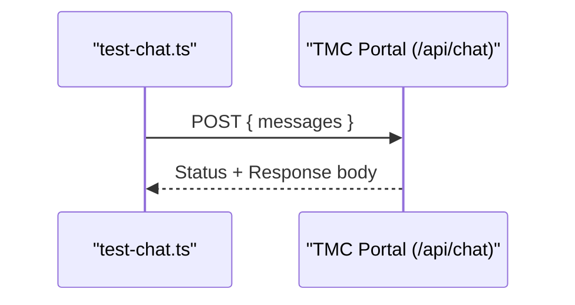
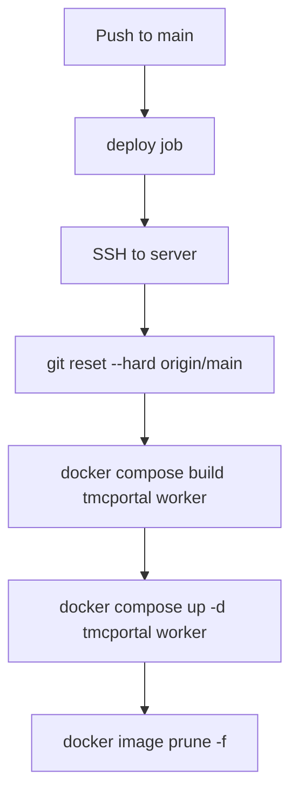
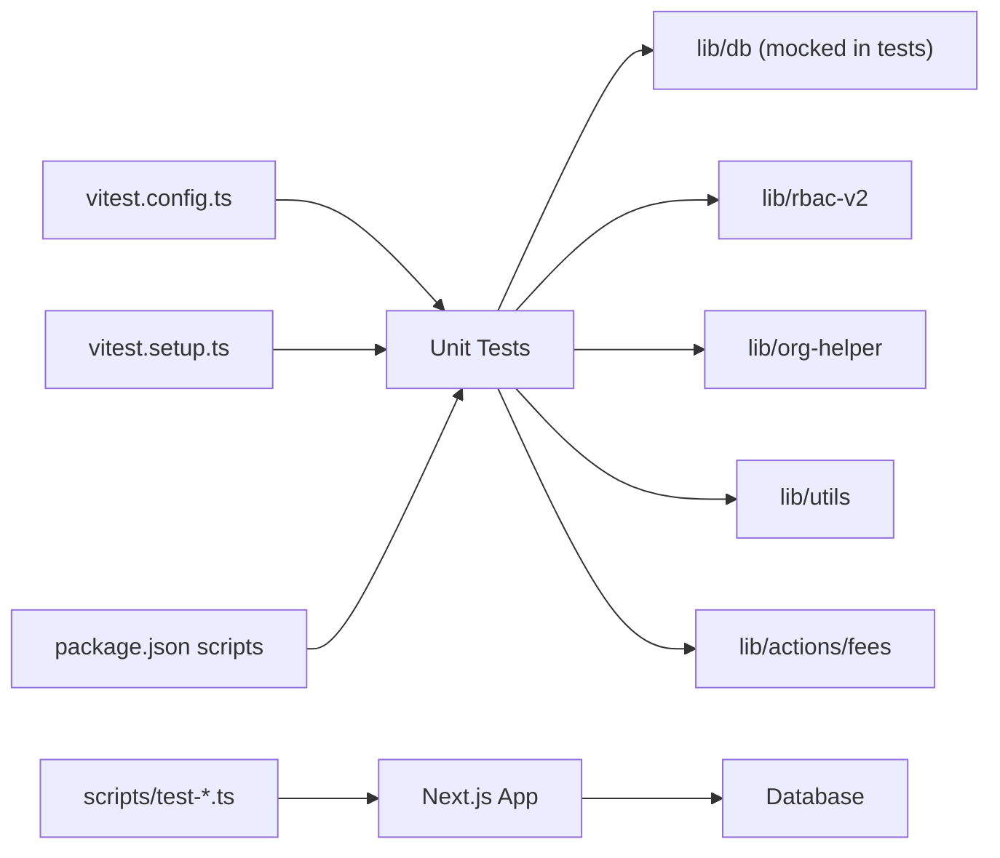

# Test Automation & CI Integration

<cite>
**Referenced Files in This Document**
- [deploy.yml](file://.github/workflows/deploy.yml)
- [vitest.config.ts](file://vitest.config.ts)
- [vitest.setup.ts](file://vitest.setup.ts)
- [package.json](file://package.json)
- [org-helper.test.ts](file://lib/org-helper.test.ts)
- [rbac-v2.test.ts](file://lib/rbac-v2.test.ts)
- [fees.test.ts](file://lib/actions/fees.test.ts)
- [utils.test.ts](file://lib/utils.test.ts)
- [test-complete-virtual-flow.ts](file://scripts/test-complete-virtual-flow.ts)
- [test-chat.ts](file://scripts/test-chat.ts)
- [DEPLOYMENT_GUIDE_SERVER.md](file://DEPLOYMENT_GUIDE_SERVER.md)
</cite>

## Table of Contents
1. [Introduction](#introduction)
2. [Project Structure](#project-structure)
3. [Core Components](#core-components)
4. [Architecture Overview](#architecture-overview)
5. [Detailed Component Analysis](#detailed-component-analysis)
6. [Dependency Analysis](#dependency-analysis)
7. [Performance Considerations](#performance-considerations)
8. [Troubleshooting Guide](#troubleshooting-guide)
9. [Conclusion](#conclusion)
10. [Appendices](#appendices)

## Introduction
This document provides comprehensive guidance for test automation and continuous integration for the TMC Portal. It explains how to set up automated test execution in GitHub Actions, including unit tests, integration tests, and end-to-end (E2E) flows. It also covers test orchestration strategies such as parallel execution, test data management, result reporting, environment variable management across environments, and security considerations for secrets and sensitive data.

## Project Structure
The repository includes:
- A GitHub Actions workflow for deployment
- Vitest configuration for unit testing with jsdom and React support
- Unit tests for core modules (RBAC, fees, utilities, organization helpers)
- Scripts that simulate complete user flows (virtual program registration, chat API)
- Deployment documentation describing environment variables required on the server

**Diagram sources**
- [deploy.yml:1-26](file://.github/workflows/deploy.yml#L1-L26)
- [vitest.config.ts:1-18](file://vitest.config.ts#L1-L18)
- [vitest.setup.ts:1-2](file://vitest.setup.ts#L1-L2)
- [package.json:5-12](file://package.json#L5-L12)

**Section sources**
- [deploy.yml:1-26](file://.github/workflows/deploy.yml#L1-L26)
- [vitest.config.ts:1-18](file://vitest.config.ts#L1-L18)
- [vitest.setup.ts:1-2](file://vitest.setup.ts#L1-L2)
- [package.json:5-12](file://package.json#L5-L12)

## Core Components
- Unit testing framework: Vitest configured with jsdom and React plugin; global setup file included.
- Test scripts: Node-based scripts to exercise full user flows against a running app instance.
- CI pipeline: GitHub Actions workflow that deploys to a server via SSH using Docker Compose.
- Environment configuration: Server-side .env documented in deployment guide.

Key responsibilities:
- vitest.config.ts: Defines test environment, globals, setup files, and path aliases.
- vitest.setup.ts: Adds DOM matchers for UI assertions.
- package.json: Provides npm scripts to run tests and other tooling.
- deploy.yml: Automates deployment to production/staging-like environments.

**Section sources**
- [vitest.config.ts:1-18](file://vitest.config.ts#L1-L18)
- [vitest.setup.ts:1-2](file://vitest.setup.ts#L1-L2)
- [package.json:5-12](file://package.json#L5-L12)
- [deploy.yml:1-26](file://.github/workflows/deploy.yml#L1-L26)

## Architecture Overview
The CI/CD and testing architecture integrates unit tests executed by Vitest and flow-based scripts that interact with the deployed application. The GitHub Actions workflow triggers on pushes to main branches and performs an SSH-based deployment using Docker Compose.

**Diagram sources**
- [deploy.yml:10-25](file://.github/workflows/deploy.yml#L10-L25)

**Section sources**
- [deploy.yml:1-26](file://.github/workflows/deploy.yml#L1-L26)

## Detailed Component Analysis

### Unit Testing with Vitest
- Configuration sets jsdom environment, enables globals, and registers a setup file for DOM matchers. Path alias “@” is resolved to the project root.
- Existing unit tests cover:
  - Organization helper tree building
  - RBAC v2 permission checks and authorization guards
  - Fee actions (create fee, record payment)
  - Utility functions (member ID generation, slugify, date formatting)

**Diagram sources**
- [vitest.config.ts:5-16](file://vitest.config.ts#L5-L16)
- [vitest.setup.ts:1-2](file://vitest.setup.ts#L1-L2)
- [package.json:11](file://package.json#L11)

**Section sources**
- [vitest.config.ts:1-18](file://vitest.config.ts#L1-L18)
- [vitest.setup.ts:1-2](file://vitest.setup.ts#L1-L2)
- [org-helper.test.ts:1-69](file://lib/org-helper.test.ts#L1-L69)
- [rbac-v2.test.ts:1-177](file://lib/rbac-v2.test.ts#L1-L177)
- [fees.test.ts:1-174](file://lib/actions/fees.test.ts#L1-L174)
- [utils.test.ts:1-42](file://lib/utils.test.ts#L1-L42)

### End-to-End Flow Scripts
- Virtual program registration flow script:
  - Creates or locates a user
  - Creates a sample programme
  - Registers a participant
  - Simulates check-in/check-out
  - Sends completion email with attachment
- Chat API smoke test:
  - POSTs a message to /api/chat and logs status and response length

**Diagram sources**
- [test-complete-virtual-flow.ts:7-106](file://scripts/test-complete-virtual-flow.ts#L7-L106)

**Diagram sources**
- [test-chat.ts:2-32](file://scripts/test-chat.ts#L2-L32)

**Section sources**
- [test-complete-virtual-flow.ts:1-107](file://scripts/test-complete-virtual-flow.ts#L1-L107)
- [test-chat.ts:1-33](file://scripts/test-chat.ts#L1-L33)

### CI Pipeline: GitHub Actions
- Triggers on push to master/main
- Deploys via SSH action to a server, resets to origin/main, builds images, and starts services with Docker Compose
- Uses secrets for server IP and SSH private key

**Diagram sources**
- [deploy.yml:3-25](file://.github/workflows/deploy.yml#L3-L25)

**Section sources**
- [deploy.yml:1-26](file://.github/workflows/deploy.yml#L1-L26)

## Dependency Analysis
- Tests depend on:
  - Vitest runtime and jsdom environment
  - Application modules under lib/ (e.g., rbac-v2, org-helper, utils, actions)
  - Database module via mocking where appropriate
- Flow scripts depend on:
  - Running Next.js app endpoints
  - Database connectivity
  - External services (email)

**Diagram sources**
- [vitest.config.ts:5-16](file://vitest.config.ts#L5-L16)
- [vitest.setup.ts:1-2](file://vitest.setup.ts#L1-L2)
- [package.json:5-12](file://package.json#L5-L12)
- [org-helper.test.ts:1-69](file://lib/org-helper.test.ts#L1-L69)
- [rbac-v2.test.ts:1-177](file://lib/rbac-v2.test.ts#L1-L177)
- [fees.test.ts:1-174](file://lib/actions/fees.test.ts#L1-L174)
- [utils.test.ts:1-42](file://lib/utils.test.ts#L1-L42)
- [test-complete-virtual-flow.ts:1-107](file://scripts/test-complete-virtual-flow.ts#L1-L107)
- [test-chat.ts:1-33](file://scripts/test-chat.ts#L1-L33)

**Section sources**
- [vitest.config.ts:1-18](file://vitest.config.ts#L1-L18)
- [vitest.setup.ts:1-2](file://vitest.setup.ts#L1-L2)
- [package.json:5-12](file://package.json#L5-L12)
- [org-helper.test.ts:1-69](file://lib/org-helper.test.ts#L1-L69)
- [rbac-v2.test.ts:1-177](file://lib/rbac-v2.test.ts#L1-L177)
- [fees.test.ts:1-174](file://lib/actions/fees.test.ts#L1-L174)
- [utils.test.ts:1-42](file://lib/utils.test.ts#L1-L42)
- [test-complete-virtual-flow.ts:1-107](file://scripts/test-complete-virtual-flow.ts#L1-L107)
- [test-chat.ts:1-33](file://scripts/test-chat.ts#L1-L33)

## Performance Considerations
- Parallel execution:
  - Vitest supports parallelization out of the box; configure workers if needed to speed up large suites.
  - Keep unit tests isolated and fast by mocking external dependencies (database, email).
- Test data management:
  - Use mocks for database interactions in unit tests to avoid I/O overhead.
  - For flow scripts, seed minimal data and clean up after runs to reduce churn.
- Reporting:
  - Leverage Vitest’s built-in reporters; consider adding JSON or JUnit reporters for CI aggregation.
- Resource allocation:
  - Ensure CI runners have sufficient CPU/memory for building Docker images and running tests.

[No sources needed since this section provides general guidance]

## Troubleshooting Guide
Common issues and resolutions:
- Missing environment variables:
  - Ensure DATABASE_URL and other required variables are present on the server per deployment guide.
- Database connectivity failures:
  - Verify network reachability and credentials; use existing scripts to diagnose DB state.
- Email service failures:
  - Flow scripts log success/failure; adjust retries or fallbacks accordingly.
- CI deployment failures:
  - Check SSH secrets and server availability; review Docker Compose logs on the server.

**Section sources**
- [DEPLOYMENT_GUIDE_SERVER.md:28-56](file://DEPLOYMENT_GUIDE_SERVER.md#L28-L56)
- [test-complete-virtual-flow.ts:75-99](file://scripts/test-complete-virtual-flow.ts#L75-L99)
- [test-chat.ts:4-29](file://scripts/test-chat.ts#L4-L29)

## Conclusion
The TMC Portal uses Vitest for unit testing and Node scripts for end-to-end flows. GitHub Actions automates deployment to a server via SSH and Docker Compose. To strengthen CI, add dedicated test jobs that execute unit and flow tests before deployment, manage environment variables securely with GitHub Secrets, and integrate reporting and notifications for faster feedback loops.

[No sources needed since this section summarizes without analyzing specific files]

## Appendices

### Setting Up Automated Tests in GitHub Actions
- Add a new job to run unit tests with Vitest and flow scripts against a test instance.
- Steps typically include:
  - Checkout code
  - Install dependencies
  - Configure environment variables from GitHub Secrets
  - Seed test database
  - Start app and background workers
  - Run unit tests and flow scripts
  - Upload test reports

[No sources needed since this section provides general guidance]

### Test Orchestration Strategies
- Parallelism:
  - Run independent unit tests concurrently.
  - Isolate E2E flows to avoid shared state conflicts.
- Test data:
  - Use deterministic seeds and unique identifiers per run.
  - Clean up created records at the end of each flow.
- Result reporting:
  - Export Vitest reports and attach to CI artifacts.
  - Integrate with CI notifications (e.g., Slack, email) on failure.

[No sources needed since this section provides general guidance]

### Environment Variables Management
- Required server variables include database URL, auth secret, and optional AI keys as documented in the deployment guide.
- In CI:
  - Store secrets in GitHub Secrets and inject them into the workflow.
  - Avoid committing secrets; use environment-specific files only in secure contexts.

**Section sources**
- [DEPLOYMENT_GUIDE_SERVER.md:28-56](file://DEPLOYMENT_GUIDE_SERVER.md#L28-L56)

### Security Considerations for Tests
- Never hardcode credentials; use environment variables and secrets.
- Mask sensitive output in logs.
- Rotate secrets regularly and limit access scopes.
- Prefer sandboxed databases for E2E flows.

[No sources needed since this section provides general guidance]