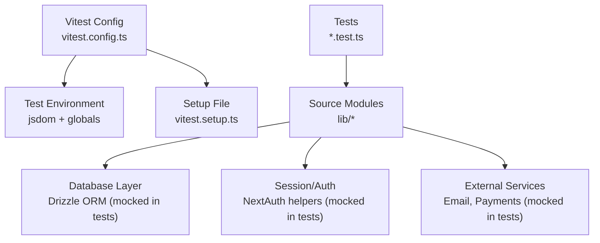
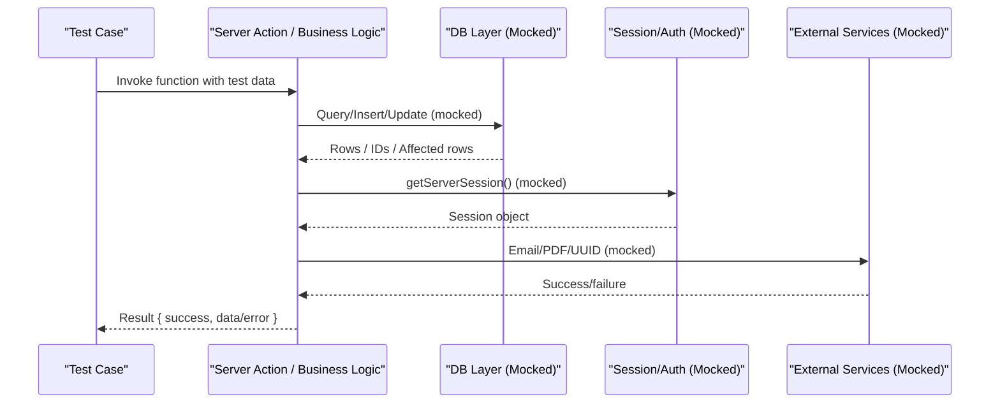
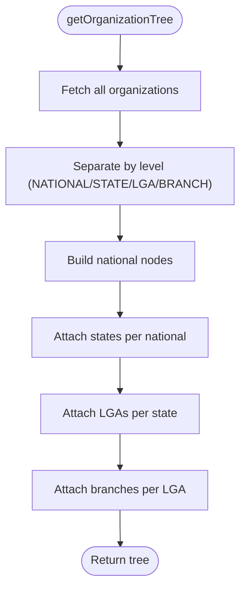
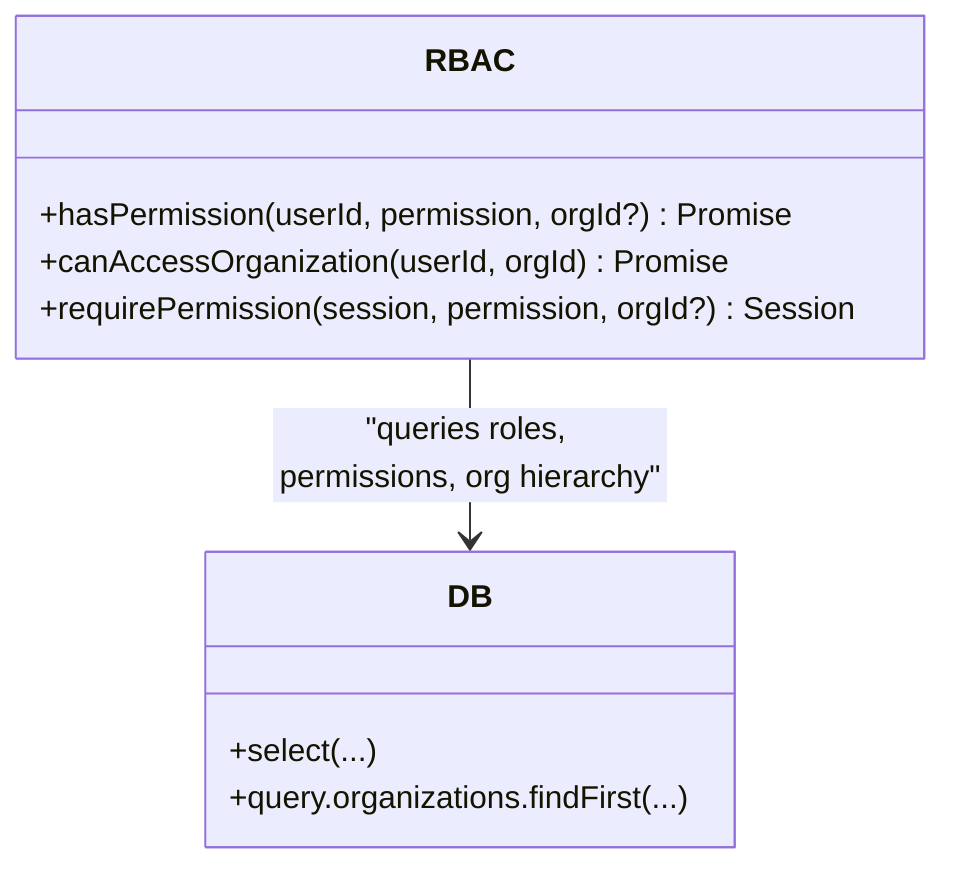
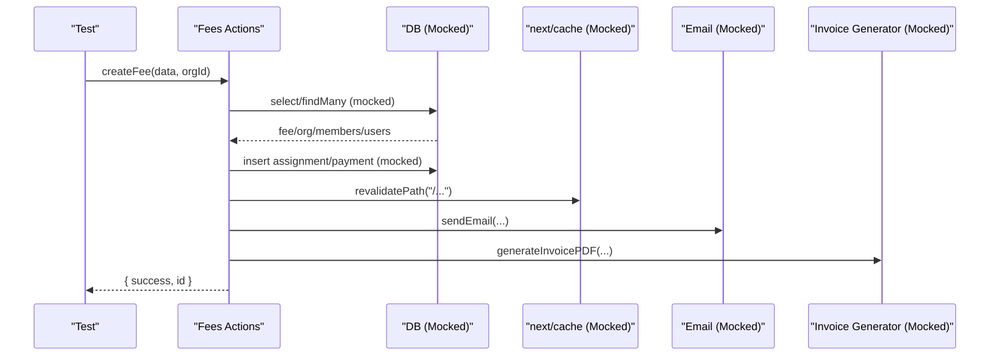
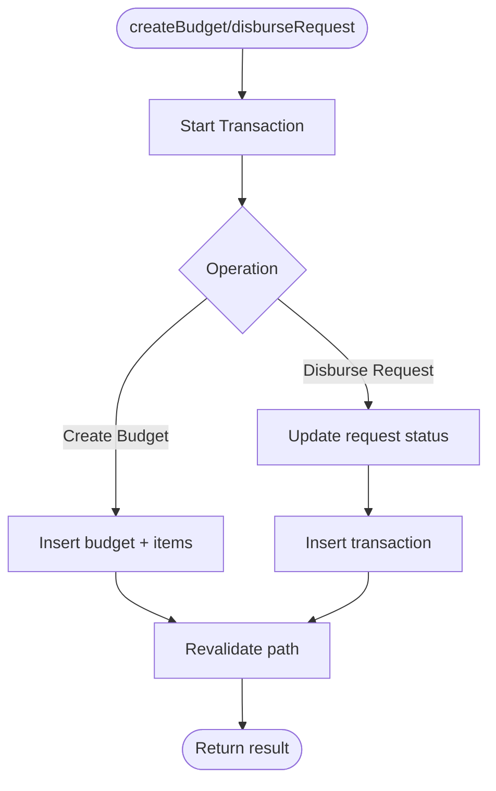
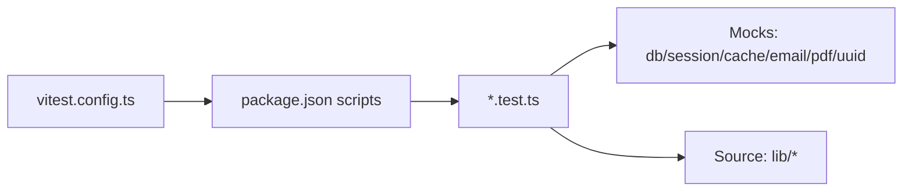

# Testing Strategy

<cite>
**Referenced Files in This Document**
- [vitest.config.ts](file://vitest.config.ts)
- [vitest.setup.ts](file://vitest.setup.ts)
- [package.json](file://package.json)
- [lib/org-helper.test.ts](file://lib/org-helper.test.ts)
- [lib/rbac-v2.test.ts](file://lib/rbac-v2.test.ts)
- [lib/utils.test.ts](file://lib/utils.test.ts)
- [lib/actions/fees.test.ts](file://lib/actions/fees.test.ts)
- [lib/actions/finance.test.ts](file://lib/actions/finance.test.ts)
- [lib/org-helper.ts](file://lib/org-helper.ts)
- [lib/rbac-v2.ts](file://lib/rbac-v2.ts)
- [lib/utils.ts](file://lib/utils.ts)
- [TESTING_GUIDE.md](file://TESTING_GUIDE.md)
</cite>

## Table of Contents
1. [Introduction](#introduction)
2. [Project Structure](#project-structure)
3. [Core Components](#core-components)
4. [Architecture Overview](#architecture-overview)
5. [Detailed Component Analysis](#detailed-component-analysis)
6. [Dependency Analysis](#dependency-analysis)
7. [Performance Considerations](#performance-considerations)
8. [Troubleshooting Guide](#troubleshooting-guide)
9. [Conclusion](#conclusion)
10. [Appendices](#appendices)

## Introduction
This document defines the testing strategy for the TMC Portal, focusing on unit testing with Vitest, integration testing patterns for database and API routes, and end-to-end testing guidance. It consolidates existing tests and establishes best practices for organization, naming conventions, mocking strategies, test data management, coverage reporting, CI integration, and performance testing. The goal is to ensure reliable, maintainable tests that validate business logic, RBAC permissions, payments, and UI components while keeping execution fast and deterministic.

## Project Structure
The project uses Vitest as the primary test runner with a jsdom environment for DOM-related tests. A global setup file initializes testing utilities. Tests are co-located next to their source modules using the .test.ts suffix.

**Diagram sources**
- [vitest.config.ts:5-16](file://vitest.config.ts#L5-L16)
- [vitest.setup.ts:1-2](file://vitest.setup.ts#L1-L2)

**Section sources**
- [vitest.config.ts:1-18](file://vitest.config.ts#L1-L18)
- [vitest.setup.ts:1-2](file://vitest.setup.ts#L1-L2)
- [package.json:5-12](file://package.json#L5-L12)

## Core Components
- Test runner and environment:
  - Vitest configured with jsdom, globals enabled, React plugin, and alias resolution for @ imports.
  - Global setup includes jest-dom matchers via testing-library.
- Existing unit tests:
  - Organization tree builder: validates hierarchical aggregation from flat DB results.
  - RBAC v2: permission checks, jurisdiction-based access, and session-based authorization.
  - Utilities: ID generation, slugification, date formatting.
  - Actions (server-side): fees and finance workflows with transactional behavior and side effects mocked.

Key patterns observed:
- Module-level mocking with vi.mock for DB, session, cache revalidation, email, PDF generation, and UUIDs.
- Fluent query chain mocking to simulate Drizzle ORM responses.
- beforeEach hooks to clear mocks and reset state between tests.
- Assertions on success/error shapes returned by server actions.

**Section sources**
- [vitest.config.ts:5-16](file://vitest.config.ts#L5-L16)
- [vitest.setup.ts:1-2](file://vitest.setup.ts#L1-L2)
- [lib/org-helper.test.ts:1-69](file://lib/org-helper.test.ts#L1-L69)
- [lib/rbac-v2.test.ts:1-177](file://lib/rbac-v2.test.ts#L1-L177)
- [lib/utils.test.ts:1-42](file://lib/utils.test.ts#L1-L42)
- [lib/actions/fees.test.ts:1-174](file://lib/actions/fees.test.ts#L1-L174)
- [lib/actions/finance.test.ts:1-152](file://lib/actions/finance.test.ts#L1-L152)

## Architecture Overview
The testing architecture centers around isolating units under test by mocking external dependencies (database, session, services). Server actions and business logic are tested with controlled inputs and expected outputs, including error paths and transaction flows. UI tests can leverage jsdom and testing-library for component interactions when needed.

**Diagram sources**
- [lib/actions/fees.test.ts:8-64](file://lib/actions/fees.test.ts#L8-L64)
- [lib/actions/finance.test.ts:8-42](file://lib/actions/finance.test.ts#L8-L42)

## Detailed Component Analysis

### Organization Tree Builder
- Purpose: Build a hierarchical organization structure from flat DB records.
- Test focus: Correct nesting of states, LGAs, and branches; handling empty datasets.
- Mocking: Database module is mocked to return predefined organization lists.

**Diagram sources**
- [lib/org-helper.ts:38-98](file://lib/org-helper.ts#L38-L98)

**Section sources**
- [lib/org-helper.test.ts:16-68](file://lib/org-helper.test.ts#L16-L68)
- [lib/org-helper.ts:38-98](file://lib/org-helper.ts#L38-L98)

### RBAC v2 Permissions and Jurisdiction
- Purpose: Determine user permissions and jurisdiction-based access to organizations.
- Test focus: SuperAdmin bypass, explicit permission checks, role-scoped access, and session-based authorization.
- Mocking: DB select chains and organization lookup are mocked to simulate various scenarios.

**Diagram sources**
- [lib/rbac-v2.ts:47-165](file://lib/rbac-v2.ts#L47-L165)
- [lib/rbac-v2.ts:170-259](file://lib/rbac-v2.ts#L170-L259)
- [lib/rbac-v2.ts:313-337](file://lib/rbac-v2.ts#L313-L337)

**Section sources**
- [lib/rbac-v2.test.ts:27-176](file://lib/rbac-v2.test.ts#L27-L176)
- [lib/rbac-v2.ts:47-165](file://lib/rbac-v2.ts#L47-L165)
- [lib/rbac-v2.ts:170-259](file://lib/rbac-v2.ts#L170-L259)
- [lib/rbac-v2.ts:313-337](file://lib/rbac-v2.ts#L313-L337)

### Utility Functions
- Purpose: Provide reusable helpers for formatting, IDs, and slugs.
- Test focus: Formatting correctness, edge cases like large sequences and special characters.

**Section sources**
- [lib/utils.test.ts:4-41](file://lib/utils.test.ts#L4-L41)
- [lib/utils.ts:8-36](file://lib/utils.ts#L8-L36)

### Fees Actions
- Purpose: Create fees, assign them to members, and record payments with validation and transactions.
- Test focus: Successful creation flow, payment amount validation, transaction usage, and side-effect mocks (email, PDF, cache revalidation).

**Diagram sources**
- [lib/actions/fees.test.ts:86-113](file://lib/actions/fees.test.ts#L86-L113)
- [lib/actions/fees.test.ts:116-171](file://lib/actions/fees.test.ts#L116-L171)

**Section sources**
- [lib/actions/fees.test.ts:1-174](file://lib/actions/fees.test.ts#L1-L174)

### Finance Actions
- Purpose: Manage budgets, fund requests, and financial summaries with transactional integrity.
- Test focus: Budget creation via transactions, disbursement workflow, summary calculations.

**Diagram sources**
- [lib/actions/finance.test.ts:49-79](file://lib/actions/finance.test.ts#L49-L79)
- [lib/actions/finance.test.ts:82-128](file://lib/actions/finance.test.ts#L82-L128)

**Section sources**
- [lib/actions/finance.test.ts:1-152](file://lib/actions/finance.test.ts#L1-L152)

## Dependency Analysis
- Test configuration depends on Vitest, jsdom, and React plugin.
- Tests depend on source modules and mock external layers (DB, session, cache, email, PDF, UUID).
- Cohesion: Each test file focuses on a specific domain (org helper, RBAC, utils, fees, finance).
- Coupling: Minimal coupling through well-defined mocks; changes in DB schema or service interfaces require targeted updates to mocks.

**Diagram sources**
- [vitest.config.ts:5-16](file://vitest.config.ts#L5-L16)
- [package.json:5-12](file://package.json#L5-L12)

**Section sources**
- [vitest.config.ts:5-16](file://vitest.config.ts#L5-L16)
- [package.json:5-12](file://package.json#L5-L12)

## Performance Considerations
- Keep tests fast by mocking I/O-bound operations (DB, network, filesystem).
- Use minimal mock data sets sufficient to cover branching logic.
- Avoid heavy DOM rendering unless necessary; prefer unit tests for pure functions.
- For integration tests, consider isolated databases or in-memory stores if feasible.
- Profile slow tests with Vitest’s built-in reporters and isolate flaky assertions.

[No sources needed since this section provides general guidance]

## Troubleshooting Guide
Common issues and resolutions based on existing tests and guides:
- Missing Prisma client or DB connection errors:
  - Ensure generated client exists and DB is reachable.
  - Validate DATABASE_URL and schema migrations.
- Email not sending:
  - Verify provider credentials; in development, emails may be logged to console.
- Verification link expired:
  - Use resend verification or create a new account.
- Password strength calculation issues:
  - Check browser console for errors and ensure correct import of strength logic.

**Section sources**
- [TESTING_GUIDE.md:201-248](file://TESTING_GUIDE.md#L201-L248)

## Conclusion
The TMC Portal’s testing strategy leverages Vitest with robust mocking to validate core business logic, RBAC permissions, and server actions. Existing tests demonstrate strong isolation of dependencies and clear assertions on outcomes. Expanding coverage to additional domains (auth flows, payments, RBAC edge cases), adding integration tests for API endpoints, and adopting E2E testing will further strengthen reliability. Adopting consistent naming, fixtures, and CI automation will streamline maintenance and improve confidence in releases.

[No sources needed since this section summarizes without analyzing specific files]

## Appendices

### Test Organization and Naming Conventions
- Co-locate tests with source files using .test.ts suffix.
- Group related tests with describe blocks mirroring module structure.
- Use descriptive it blocks that state expected behavior.

**Section sources**
- [lib/org-helper.test.ts:16-68](file://lib/org-helper.test.ts#L16-L68)
- [lib/rbac-v2.test.ts:27-176](file://lib/rbac-v2.test.ts#L27-L176)
- [lib/utils.test.ts:4-41](file://lib/utils.test.ts#L4-L41)

### Test Data Management Strategies
- Inline fixture objects within tests for small datasets.
- Centralize shared fixtures in dedicated files if reused across tests.
- Use vi.fn().mockResolvedValue/mockReturnValue to construct precise DB responses.

**Section sources**
- [lib/org-helper.test.ts:22-41](file://lib/org-helper.test.ts#L22-L41)
- [lib/rbac-v2.test.ts:17-25](file://lib/rbac-v2.test.ts#L17-L25)
- [lib/actions/fees.test.ts:72-83](file://lib/actions/fees.test.ts#L72-L83)

### Unit Testing Approaches
- Business logic: Isolate functions, mock DB/session/services, assert outputs and side effects.
- Utilities: Pure functions with deterministic inputs and outputs.
- Components: Use jsdom and testing-library for interaction tests when needed.

**Section sources**
- [lib/utils.test.ts:4-41](file://lib/utils.test.ts#L4-L41)
- [vitest.config.ts:5-16](file://vitest.config.ts#L5-L16)

### Integration Testing Guidance
- Database operations: Mock Drizzle queries to control outcomes; verify transaction calls and update/insert sequences.
- API endpoints: Simulate route handlers with session and RBAC checks; assert status codes and payloads.
- External services: Mock email providers, payment gateways, and PDF generators to avoid real network calls.

**Section sources**
- [lib/actions/fees.test.ts:8-64](file://lib/actions/fees.test.ts#L8-L64)
- [lib/actions/finance.test.ts:8-42](file://lib/actions/finance.test.ts#L8-L42)

### Authentication Flows, Payment Processing, and RBAC Examples
- Authentication: Follow manual steps in the guide; automate with E2E tools later.
- Payments: Validate minimum amounts, transaction usage, receipt generation, and cache invalidation.
- RBAC: Assert SuperAdmin bypass, explicit permission checks, and jurisdiction constraints.

**Section sources**
- [TESTING_GUIDE.md:56-191](file://TESTING_GUIDE.md#L56-L191)
- [lib/actions/fees.test.ts:116-171](file://lib/actions/fees.test.ts#L116-L171)
- [lib/rbac-v2.test.ts:32-104](file://lib/rbac-v2.test.ts#L32-L104)

### Coverage Requirements and Reporting
- Add a coverage reporter in Vitest config to track line/function/test coverage thresholds.
- Enforce minimum coverage in CI to prevent regressions.
- Use Vitest’s built-in report formats (text, json, html) for analysis.

[No sources needed since this section provides general guidance]

### Continuous Integration Testing
- Run vitest in CI pipelines on pull requests and main branch pushes.
- Parallelize test suites where possible; isolate slow tests.
- Fail builds on coverage threshold breaches or failing tests.

[No sources needed since this section provides general guidance]

### Performance, Load, and Stress Testing Methodologies
- Performance: Profile critical paths with Vitest reporters; minimize I/O in tests.
- Load/Stress: Use dedicated tools (e.g., k6, Artillery) outside Vitest to simulate concurrent users against API endpoints.
- Focus on realistic scenarios: auth, payments, RBAC checks, and high-throughput reads/writes.

[No sources needed since this section provides general guidance]

### Debugging Techniques and Profiling
- Use beforeEach to clear mocks and reset state to avoid cross-test pollution.
- Log intermediate values in tests to pinpoint failures.
- Leverage Vitest UI for interactive debugging and stack traces.

**Section sources**
- [lib/org-helper.test.ts:16-19](file://lib/org-helper.test.ts#L16-L19)
- [lib/rbac-v2.test.ts:27-30](file://lib/rbac-v2.test.ts#L27-L30)
- [lib/actions/fees.test.ts:66-70](file://lib/actions/fees.test.ts#L66-L70)