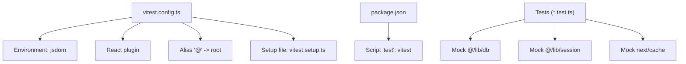
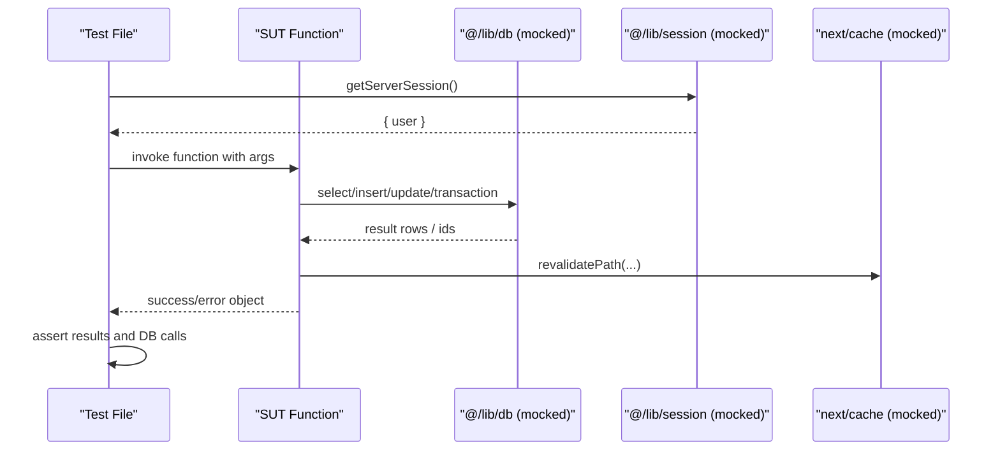
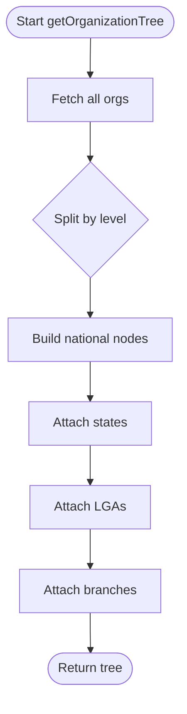
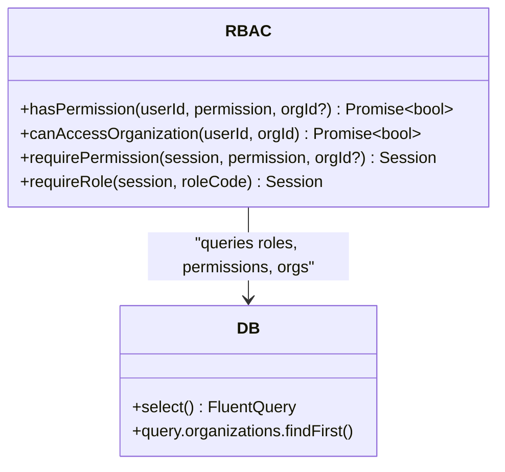
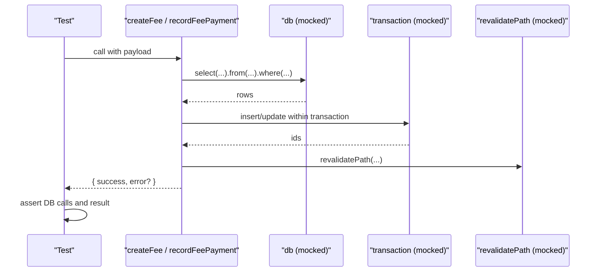
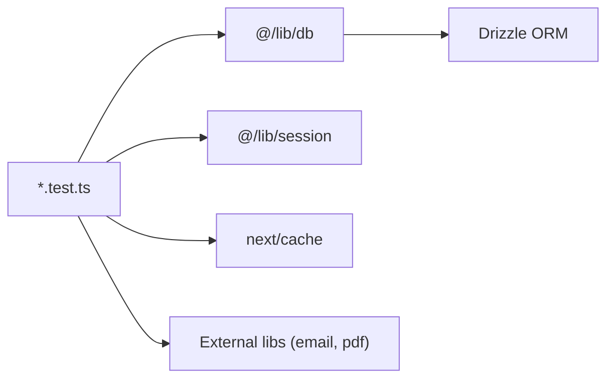

# Unit Testing & Test Frameworks

<cite>
**Referenced Files in This Document**
- [vitest.config.ts](file://vitest.config.ts)
- [vitest.setup.ts](file://vitest.setup.ts)
- [package.json](file://package.json)
- [lib/org-helper.test.ts](file://lib/org-helper.test.ts)
- [lib/rbac-v2.test.ts](file://lib/rbac-v2.test.ts)
- [lib/utils.test.ts](file://lib/utils.test.ts)
- [lib/actions/fees.test.ts](file://lib/actions/fees.test.ts)
- [lib/actions/finance.test.ts](file://lib/actions/finance.test.ts)
- [lib/actions/organization.test.ts](file://lib/actions/organization.test.ts)
- [lib/org-helper.ts](file://lib/org-helper.ts)
- [lib/rbac-v2.ts](file://lib/rbac-v2.ts)
- [lib/utils.ts](file://lib/utils.ts)
- [lib/db/index.ts](file://lib/db/index.ts)
</cite>

## Table of Contents
1. Introduction
2. Project Structure
3. Core Components
4. Architecture Overview
5. Detailed Component Analysis
6. Dependency Analysis
7. Performance Considerations
8. Troubleshooting Guide
9. Conclusion
10. Appendices

## Introduction
This document explains how unit testing is configured and used in the TMC Portal with Vitest. It covers the test runner configuration, environment setup, available test utilities, and patterns for mocking external dependencies, database interactions via Drizzle ORM, and service-layer functions. It also provides guidance on writing effective tests for business logic, utility modules, RBAC permissions, authentication flows, payment processing, and organization management, along with naming conventions, data management, assertions, coverage expectations, reporting integration, and debugging techniques.

## Project Structure
The project uses Vitest as the test runner with a JSDOM environment and React support. A minimal setup file extends Jest DOM matchers. Tests are colocated next to source files using the .test.ts suffix. The package scripts expose a simple command to run tests.

**Diagram sources**
- [vitest.config.ts:5-16](file://vitest.config.ts#L5-L16)
- [vitest.setup.ts:1-2](file://vitest.setup.ts#L1-L2)
- [package.json:5-12](file://package.json#L5-L12)

**Section sources**
- [vitest.config.ts:1-18](file://vitest.config.ts#L1-L18)
- [vitest.setup.ts:1-2](file://vitest.setup.ts#L1-L2)
- [package.json:1-127](file://package.json#L1-L127)

## Core Components
- Test runner and environment:
  - Vitest configured with jsdom environment, globals enabled, React plugin, and alias resolution for imports starting with @.
  - Setup file includes testing-library/jest-dom for enhanced assertions.
- Database layer:
  - Drizzle ORM client exported from lib/db/index.ts; tests mock this module to avoid real DB calls.
- Session layer:
  - getServerSession is mocked in action tests to simulate authenticated contexts.
- Next.js integrations:
  - next/cache revalidatePath is mocked to verify cache invalidation behavior without side effects.

Key implementation references:
- Vitest config and setup: [vitest.config.ts:5-16](file://vitest.config.ts#L5-L16), [vitest.setup.ts:1-2](file://vitest.setup.ts#L1-L2)
- DB client export: [lib/db/index.ts:1-16](file://lib/db/index.ts#L1-L16)
- Session usage in tests: [lib/actions/fees.test.ts:45-47](file://lib/actions/fees.test.ts#L45-L47), [lib/actions/finance.test.ts:36-38](file://lib/actions/finance.test.ts#L36-L38)
- Cache revalidation mocks: [lib/actions/fees.test.ts:49-51](file://lib/actions/fees.test.ts#L49-L51), [lib/actions/finance.test.ts:40-42](file://lib/actions/finance.test.ts#L40-L42)

**Section sources**
- [vitest.config.ts:1-18](file://vitest.config.ts#L1-L18)
- [vitest.setup.ts:1-2](file://vitest.setup.ts#L1-L2)
- [lib/db/index.ts:1-16](file://lib/db/index.ts#L1-L16)
- [lib/actions/fees.test.ts:1-65](file://lib/actions/fees.test.ts#L1-L65)
- [lib/actions/finance.test.ts:1-43](file://lib/actions/finance.test.ts#L1-L43)

## Architecture Overview
The testing architecture isolates business logic by mocking external dependencies (DB, session, cache, email, PDF generation). Tests focus on pure functions and service-layer actions, asserting outcomes and verifying that correct DB operations are invoked.

**Diagram sources**
- [lib/actions/fees.test.ts:8-65](file://lib/actions/fees.test.ts#L8-L65)
- [lib/actions/finance.test.ts:8-43](file://lib/actions/finance.test.ts#L8-L43)

## Detailed Component Analysis

### Organization Helper Tests
Purpose: Validate building an organization hierarchy from flat data returned by the database.

Patterns:
- Mock the entire db module and set up findMany to return sample organizations.
- Use beforeEach to clear mocks between tests.
- Assert tree structure lengths and names at each level.

**Diagram sources**
- [lib/org-helper.ts:38-98](file://lib/org-helper.ts#L38-L98)
- [lib/org-helper.test.ts:6-14](file://lib/org-helper.test.ts#L6-L14)

**Section sources**
- [lib/org-helper.test.ts:1-69](file://lib/org-helper.test.ts#L1-L69)
- [lib/org-helper.ts:1-118](file://lib/org-helper.ts#L1-L118)

### RBAC v2 Tests
Purpose: Verify permission checks, jurisdiction-based access control, and session-based requirement helpers.

Patterns:
- Mock the db module and provide a fluent select chain helper to simulate query results.
- Test SuperAdmin bypass, explicit permission matches, and missing permissions.
- Validate canAccessOrganization against parent-child hierarchies.
- Ensure requirePermission throws Unauthorized or Forbidden appropriately.

**Diagram sources**
- [lib/rbac-v2.ts:47-165](file://lib/rbac-v2.ts#L47-L165)
- [lib/rbac-v2.ts:170-259](file://lib/rbac-v2.ts#L170-L259)
- [lib/rbac-v2.ts:313-358](file://lib/rbac-v2.ts#L313-L358)
- [lib/rbac-v2.test.ts:18-25](file://lib/rbac-v2.test.ts#L18-L25)

**Section sources**
- [lib/rbac-v2.test.ts:1-177](file://lib/rbac-v2.test.ts#L1-L177)
- [lib/rbac-v2.ts:1-361](file://lib/rbac-v2.ts#L1-L361)

### Utility Tests
Purpose: Validate formatting and transformation helpers.

Patterns:
- Pure function assertions with deterministic inputs.
- For locale-dependent outputs, assert substrings rather than exact strings.

Examples covered:
- generateMemberId formatting with leading zeros.
- slugify normalization rules.
- formatDate output containing expected parts.

**Section sources**
- [lib/utils.test.ts:1-42](file://lib/utils.test.ts#L1-L42)
- [lib/utils.ts:1-37](file://lib/utils.ts#L1-L37)

### Fees Action Tests
Purpose: Test fee creation, assignment, and payment recording workflows.

Patterns:
- Mock DB with fluent select chains and transaction stubs.
- Mock session to simulate authenticated users.
- Mock invoice/receipt generators and email sender to avoid side effects.
- Assert success flags, DB calls, and cache revalidation.

**Diagram sources**
- [lib/actions/fees.test.ts:8-65](file://lib/actions/fees.test.ts#L8-L65)
- [lib/actions/fees.test.ts:85-173](file://lib/actions/fees.test.ts#L85-L173)

**Section sources**
- [lib/actions/fees.test.ts:1-174](file://lib/actions/fees.test.ts#L1-L174)

### Finance Action Tests
Purpose: Validate budget creation, request disbursement, and financial summary calculations.

Patterns:
- Mock transactions to capture multiple inserts/updates.
- Mock select chains to return requests and transactions.
- Assert revalidation paths and computed totals.

**Section sources**
- [lib/actions/finance.test.ts:1-152](file://lib/actions/finance.test.ts#L1-L152)

### Organization Action Tests
Purpose: Ensure CRUD operations enforce validation and constraints.

Patterns:
- Mock DB insert/update/delete and query methods.
- Simulate duplicate entry errors and child existence checks.
- Assert revalidation paths and error messages.

**Section sources**
- [lib/actions/organization.test.ts:1-116](file://lib/actions/organization.test.ts#L1-L116)

## Dependency Analysis
Tests depend on the following modules and rely on mocking to isolate behavior:
- @/lib/db: Drizzle ORM client; mocked to control query results and transaction execution.
- @/lib/session: Server session provider; mocked to simulate authenticated users.
- next/cache: Path revalidation; mocked to verify side effects without network/file system impact.
- External services (email, PDF): mocked to prevent real I/O.

**Diagram sources**
- [lib/actions/fees.test.ts:8-65](file://lib/actions/fees.test.ts#L8-L65)
- [lib/actions/finance.test.ts:8-43](file://lib/actions/finance.test.ts#L8-L43)
- [lib/actions/organization.test.ts:7-31](file://lib/actions/organization.test.ts#L7-L31)

**Section sources**
- [lib/actions/fees.test.ts:1-65](file://lib/actions/fees.test.ts#L1-L65)
- [lib/actions/finance.test.ts:1-43](file://lib/actions/finance.test.ts#L1-L43)
- [lib/actions/organization.test.ts:1-31](file://lib/actions/organization.test.ts#L1-L31)

## Performance Considerations
- Keep tests fast by mocking expensive operations (DB, network, file I/O).
- Use small, focused datasets in mocks to reduce memory overhead.
- Clear mocks in beforeEach to avoid cross-test state leakage.
- Prefer deterministic assertions over time- or locale-dependent values when possible.

[No sources needed since this section provides general guidance]

## Troubleshooting Guide
Common issues and resolutions:
- Module not found or path alias failures:
  - Ensure vitest.config.ts resolves '@' to the project root and tests import using '@/' prefixes consistently.
  - Reference: [vitest.config.ts:12-16](file://vitest.config.ts#L12-L16)
- Unexpected DB calls:
  - Confirm vi.mock for '@/lib/db' is applied before importing the SUT.
  - Reference: [lib/actions/fees.test.ts:8-43](file://lib/actions/fees.test.ts#L8-L43)
- Session-related errors:
  - Provide a valid session shape via getServerSession mock.
  - Reference: [lib/actions/fees.test.ts:45-47](file://lib/actions/fees.test.ts#L45-L47)
- Flaky date assertions:
  - Assert substrings or ranges instead of exact formatted strings due to locale differences.
  - Reference: [lib/utils.test.ts:31-40](file://lib/utils.test.ts#L31-L40)
- Transaction mocking:
  - Implement db.transaction to execute the callback and pass a mock tx object with insert/update methods.
  - Reference: [lib/actions/finance.test.ts:55-63](file://lib/actions/finance.test.ts#L55-L63)

**Section sources**
- [vitest.config.ts:12-16](file://vitest.config.ts#L12-L16)
- [lib/actions/fees.test.ts:8-47](file://lib/actions/fees.test.ts#L8-L47)
- [lib/utils.test.ts:31-40](file://lib/utils.test.ts#L31-L40)
- [lib/actions/finance.test.ts:55-63](file://lib/actions/finance.test.ts#L55-L63)

## Conclusion
The TMC Portal’s testing strategy centers on Vitest with a jsdom environment and React support, leveraging extensive mocking of DB, session, and Next.js integrations. Tests validate business logic, RBAC permissions, and service-layer actions while ensuring isolation and determinism. Follow the established patterns to write reliable, maintainable tests across the codebase.

[No sources needed since this section summarizes without analyzing specific files]

## Appendices

### How to Run Tests
- Execute tests via the npm script defined in package.json.

**Section sources**
- [package.json:5-12](file://package.json#L5-L12)

### Environment and Globals
- jsdom environment enables DOM APIs in tests.
- Global test functions (describe, it, expect) are enabled.
- Setup file adds extended matchers for DOM assertions.

**Section sources**
- [vitest.config.ts:5-11](file://vitest.config.ts#L5-L11)
- [vitest.setup.ts:1-2](file://vitest.setup.ts#L1-L2)

### Database Mocking Patterns with Drizzle
- Mock the db module and provide fluent select chains with from, join, where, orderBy, limit, offset.
- For transactions, implement db.transaction to accept a callback and supply a mock tx with insert/update methods.
- Reference examples:
  - Select chain helper: [lib/actions/fees.test.ts:72-83](file://lib/actions/fees.test.ts#L72-L83)
  - Transaction mock: [lib/actions/finance.test.ts:55-63](file://lib/actions/finance.test.ts#L55-L63)

**Section sources**
- [lib/actions/fees.test.ts:72-83](file://lib/actions/fees.test.ts#L72-L83)
- [lib/actions/finance.test.ts:55-63](file://lib/actions/finance.test.ts#L55-L63)

### Authentication Flow Testing
- Mock getServerSession to return a user object.
- Use requirePermission to assert authorization behavior in API routes or server functions.
- References:
  - Session mock: [lib/actions/fees.test.ts:45-47](file://lib/actions/fees.test.ts#L45-L47)
  - Permission enforcement: [lib/rbac-v2.ts:313-358](file://lib/rbac-v2.ts#L313-L358)

**Section sources**
- [lib/actions/fees.test.ts:45-47](file://lib/actions/fees.test.ts#L45-L47)
- [lib/rbac-v2.ts:313-358](file://lib/rbac-v2.ts#L313-L358)

### Payment Processing Logic Testing
- Mock DB queries for assignments and fees.
- Validate minimum payment amounts and transactional updates.
- References:
  - Minimum amount check: [lib/actions/fees.test.ts:116-131](file://lib/actions/fees.test.ts#L116-L131)
  - Transaction recording: [lib/actions/fees.test.ts:133-171](file://lib/actions/fees.test.ts#L133-L171)

**Section sources**
- [lib/actions/fees.test.ts:116-171](file://lib/actions/fees.test.ts#L116-L171)

### Organization Management Testing
- Validate required fields, duplicate handling, and hierarchical deletion constraints.
- References:
  - Required fields: [lib/actions/organization.test.ts:38-47](file://lib/actions/organization.test.ts#L38-L47)
  - Duplicate entries: [lib/actions/organization.test.ts:62-76](file://lib/actions/organization.test.ts#L62-L76)
  - Deletion constraints: [lib/actions/organization.test.ts:79-99](file://lib/actions/organization.test.ts#L79-L99)

**Section sources**
- [lib/actions/organization.test.ts:38-99](file://lib/actions/organization.test.ts#L38-L99)

### Naming Conventions, Data Management, and Assertions
- Naming:
  - Group related tests with describe blocks named after the feature/module.
  - Name individual tests to express expected behavior clearly.
- Test data:
  - Define small, focused fixtures inline or in helper functions.
  - Use beforeEach to reset mocks and state.
- Assertions:
  - Prefer precise assertions for IDs and booleans.
  - For locale-sensitive outputs, assert substrings or ranges.
- References:
  - beforeEach usage: [lib/org-helper.test.ts:17-19](file://lib/org-helper.test.ts#L17-L19), [lib/rbac-v2.test.ts:27-30](file://lib/rbac-v2.test.ts#L27-L30)
  - Locale-safe assertion: [lib/utils.test.ts:31-40](file://lib/utils.test.ts#L31-L40)

**Section sources**
- [lib/org-helper.test.ts:17-19](file://lib/org-helper.test.ts#L17-L19)
- [lib/rbac-v2.test.ts:27-30](file://lib/rbac-v2.test.ts#L27-L30)
- [lib/utils.test.ts:31-40](file://lib/utils.test.ts#L31-L40)

### Coverage Requirements and Reporting
- Current repository does not include coverage configuration or reporters in Vitest settings.
- To add coverage, configure Vitest coverage options and integrate with CI if desired.
- No existing coverage thresholds or reports are enforced in the current setup.

[No sources needed since this section provides general guidance]

### Debugging Techniques for Failing Tests
- Inspect mock call history to verify expected DB operations were invoked.
- Use console logs sparingly to trace flow during development.
- Isolate failing tests by running them individually.
- Ensure mocks are properly reset in beforeEach to avoid state leakage.

[No sources needed since this section provides general guidance]