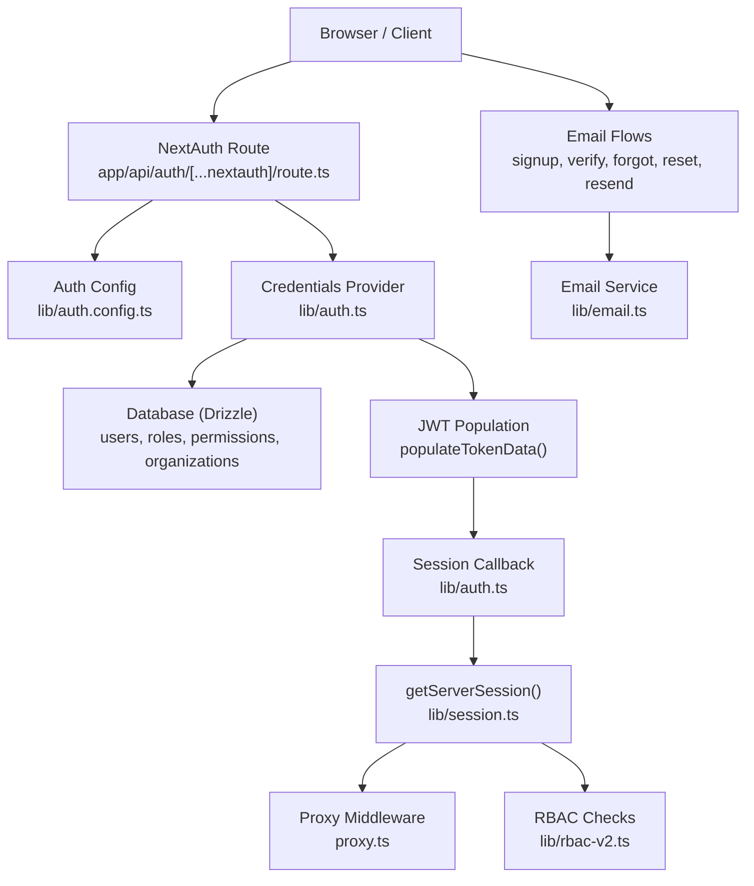
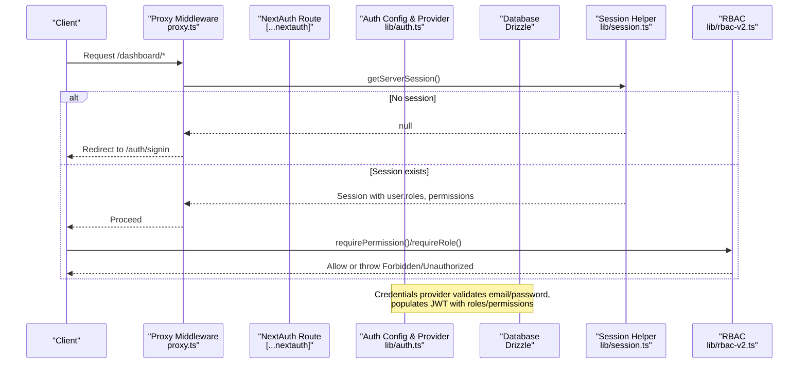
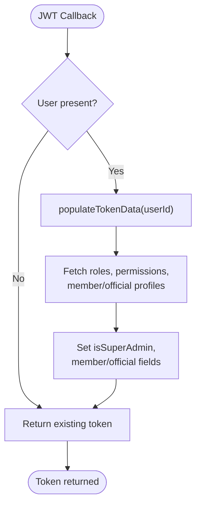
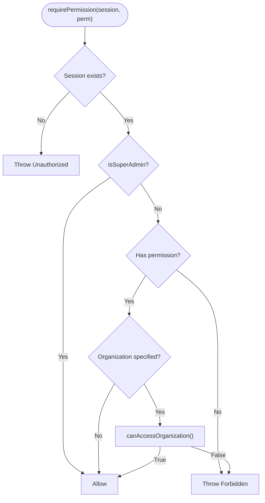
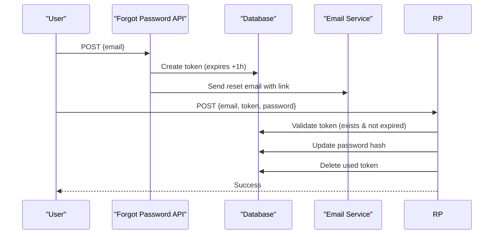
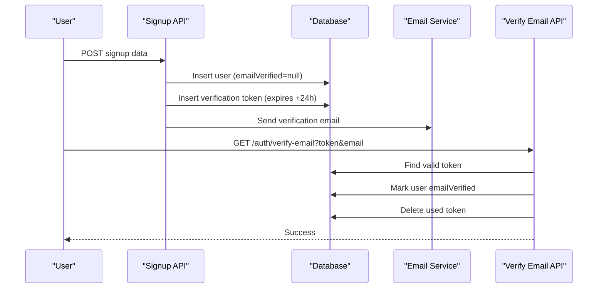
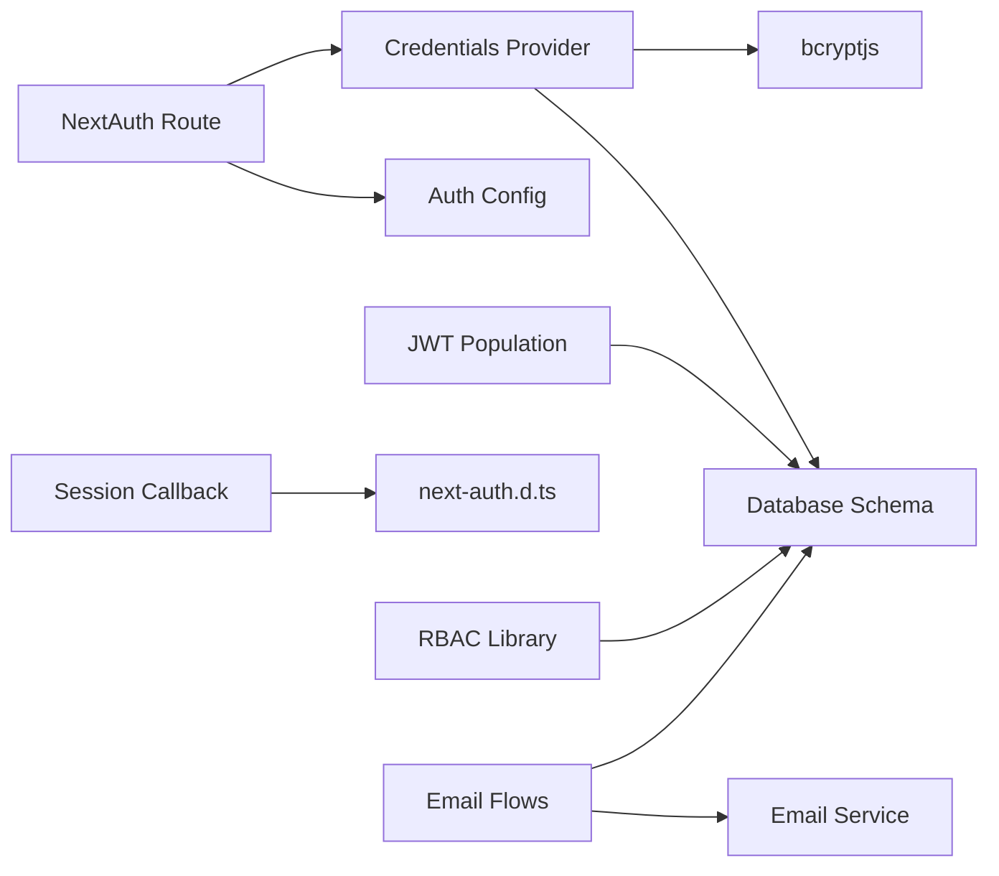

# Authentication & Authorization Problems

<cite>
**Referenced Files in This Document**
- [route.ts](file://app/api/auth/[...nextauth]/route.ts)
- [auth.config.ts](file://lib/auth.config.ts)
- [auth.ts](file://lib/auth.ts)
- [session.ts](file://lib/session.ts)
- [rbac-v2.ts](file://lib/rbac-v2.ts)
- [signup route.ts](file://app/api/auth/signup/route.ts)
- [forgot-password route.ts](file://app/api/auth/forgot-password/route.ts)
- [reset-password route.ts](file://app/api/auth/reset-password/route.ts)
- [verify-email route.ts](file://app/api/auth/verify-email/route.ts)
- [resend-verification route.ts](file://app/api/auth/resend-verification/route.ts)
- [email.ts](file://lib/email.ts)
- [proxy.ts](file://proxy.ts)
- [auth.ts (root)](file://auth.ts)
- [next-auth.d.ts](file://types/next-auth.d.ts)
- [debug-auth.ts](file://scripts/debug-auth.ts)
- [NEXTAUTH_V5_FIX.md](file://NEXTAUTH_V5_FIX.md)
</cite>

## Table of Contents
1. Introduction
2. Project Structure
3. Core Components
4. Architecture Overview
5. Detailed Component Analysis
6. Dependency Analysis
7. Performance Considerations
8. Troubleshooting Guide
9. Conclusion
10. Appendices

## Introduction
This document provides comprehensive troubleshooting guidance for authentication and authorization issues in the TMC Portal. It focuses on JWT token generation/validation, session management, cookie configuration, RBAC permissions, role assignments, jurisdiction-based access control, password reset workflows, email verification, multi-tenant conflicts, NextAuth v5 configuration errors, custom provider setup problems, credential validation failures, middleware debugging, session population issues, permission checking logic, common error patterns, and diagnostic techniques.

## Project Structure
The authentication system is built around NextAuth v5 with a JWT session strategy, Drizzle adapter, and a custom credentials provider. The key entry points are:
- NextAuth route handler at app/api/auth/[...nextauth]
- Auth configuration and providers in lib/auth.ts and lib/auth.config.ts
- Session helper in lib/session.ts
- RBAC utilities in lib/rbac-v2.ts
- Email flows in app/api/auth/* routes and lib/email.ts
- Proxy-based middleware in proxy.ts to protect dashboard routes



**Diagram sources**
- [route.ts:1-8](file://app/api/auth/[...nextauth]/route.ts#L1-L8)
- [auth.config.ts:1-12](file://lib/auth.config.ts#L1-L12)
- [auth.ts:131-256](file://lib/auth.ts#L131-L256)
- [session.ts:1-16](file://lib/session.ts#L1-L16)
- [rbac-v2.ts:1-361](file://lib/rbac-v2.ts#L1-L361)
- [signup route.ts:25-141](file://app/api/auth/signup/route.ts#L25-L141)
- [verify-email route.ts:7-63](file://app/api/auth/verify-email/route.ts#L7-L63)
- [forgot-password route.ts:11-77](file://app/api/auth/forgot-password/route.ts#L11-L77)
- [reset-password route.ts:10-59](file://app/api/auth/reset-password/route.ts#L10-L59)
- [resend-verification route.ts:8-67](file://app/api/auth/resend-verification/route.ts#L8-L67)
- [email.ts:21-92](file://lib/email.ts#L21-L92)
- [proxy.ts:1-51](file://proxy.ts#L1-L51)

**Section sources**
- [route.ts:1-8](file://app/api/auth/[...nextauth]/route.ts#L1-L8)
- [auth.config.ts:1-12](file://lib/auth.config.ts#L1-L12)
- [auth.ts:131-256](file://lib/auth.ts#L131-L256)
- [session.ts:1-16](file://lib/session.ts#L1-L16)
- [proxy.ts:1-51](file://proxy.ts#L1-L51)

## Core Components
- NextAuth v5 route handler: Exposes GET/POST handlers for authentication flows.
- Auth configuration: Sets JWT strategy, trustHost, secret, sign-in page, and placeholder providers.
- Credentials provider: Validates email/password, checks email verification, and returns user data.
- JWT population: Enriches token with roles, permissions, super-admin flag, member/official profiles, and jurisdiction context.
- Session callback: Populates session.user with roles, permissions, and profile fields.
- RBAC library: Provides permission and role checks, organization jurisdiction enforcement, and helpers for API routes.
- Email flows: Signup, verification, resend verification, forgot password, and reset password endpoints.
- Proxy middleware: Protects dashboard routes and redirects based on roles.

**Section sources**
- [auth.ts:131-256](file://lib/auth.ts#L131-L256)
- [rbac-v2.ts:141-360](file://lib/rbac-v2.ts#L141-L360)
- [signup route.ts:25-141](file://app/api/auth/signup/route.ts#L25-L141)
- [verify-email route.ts:7-63](file://app/api/auth/verify-email/route.ts#L7-L63)
- [forgot-password route.ts:11-77](file://app/api/auth/forgot-password/route.ts#L11-L77)
- [reset-password route.ts:10-59](file://app/api/auth/reset-password/route.ts#L10-L59)
- [resend-verification route.ts:8-67](file://app/api/auth/resend-verification/route.ts#L8-L67)
- [email.ts:21-92](file://lib/email.ts#L21-L92)
- [proxy.ts:1-51](file://proxy.ts#L1-L51)

## Architecture Overview
Authentication flow overview:
- Client requests protected resource.
- Proxy middleware checks session; if missing, redirects to sign-in.
- Sign-in uses credentials provider to validate user.
- On success, JWT is populated with roles, permissions, and profile data.
- Session callback enriches session.user for downstream use.
- API routes enforce permissions via RBAC helpers.



**Diagram sources**
- [proxy.ts:1-51](file://proxy.ts#L1-L51)
- [session.ts:1-16](file://lib/session.ts#L1-L16)
- [auth.ts:131-256](file://lib/auth.ts#L131-L256)
- [rbac-v2.ts:313-360](file://lib/rbac-v2.ts#L313-L360)

## Detailed Component Analysis

### JWT Generation and Validation
- JWT population occurs during the jwt callback by fetching roles, permissions, and profile data from the database and attaching them to the token.
- Super-admin detection sets an isSuperAdmin flag when any role has SYSTEM jurisdiction level.
- Impersonation support updates token fields when switching identities and reverts back to original admin.
- Common issues:
  - Missing AUTH_SECRET causes JWT signing/validation failures.
  - Incorrect NEXTAUTH_URL breaks verification/reset links and cookie domains.
  - Database joins failing due to schema mismatches result in empty roles/permissions in tokens.
  - TrustHost misconfiguration can cause cookie domain issues behind proxies.



**Diagram sources**
- [auth.ts:189-227](file://lib/auth.ts#L189-L227)
- [auth.ts:33-129](file://lib/auth.ts#L33-L129)

**Section sources**
- [auth.ts:33-129](file://lib/auth.ts#L33-L129)
- [auth.ts:189-227](file://lib/auth.ts#L189-L227)
- [auth.config.ts:1-12](file://lib/auth.config.ts#L1-L12)

### Session Management Failures
- getServerSession wraps auth() and logs errors; ensure it is awaited in all server-side contexts.
- Session callback maps token fields into session.user; if mapping fails, downstream components may see missing roles/permissions.
- Common issues:
  - Forgetting await on auth() leads to undefined sessions.
  - Session not populated due to JWT callback errors results in missing roles/permissions.
  - Cookie settings mismatch between dev/prod environments causing session loss across requests.

```mermaid
sequenceDiagram
participant H as "Handler"
participant SH as "getServerSession()"
participant NA as "NextAuth auth()"
participant CB as "Session Callback"
H->>SH : getServerSession()
SH->>NA : await auth()
NA-->>SH : Session object
SH->>CB : Map token -> session.user
CB-->>H : Session with roles/permissions
Note over H,CB : Errors logged; ensure await usage
```

**Diagram sources**
- [session.ts:1-16](file://lib/session.ts#L1-L16)
- [auth.ts:229-251](file://lib/auth.ts#L229-L251)

**Section sources**
- [session.ts:1-16](file://lib/session.ts#L1-L16)
- [auth.ts:229-251](file://lib/auth.ts#L229-L251)
- [NEXTAUTH_V5_FIX.md:71-86](file://NEXTAUTH_V5_FIX.md#L71-L86)

### Cookie Configuration Issues
- trustHost and secret must be correctly set for cookies to work behind reverse proxies or different domains.
- NEXTAUTH_URL must match the deployed domain to generate correct verification/reset links and cookie paths.
- If using HTTPS in production, ensure secure cookies are enabled and CORS/proxy headers are configured appropriately.

**Section sources**
- [auth.config.ts:1-12](file://lib/auth.config.ts#L1-L12)
- [NEXTAUTH_V5_FIX.md:71-86](file://NEXTAUTH_V5_FIX.md#L71-L86)

### RBAC Permission Errors and Role Assignment Problems
- requirePermission and requireRole enforce session-based checks; missing session throws Unauthorized, missing permission/role throws Forbidden.
- Super-admin bypass allows all permissions regardless of specific checks.
- Organization jurisdiction enforcement ensures users can only access resources within their hierarchy unless they have SYSTEM-level roles.
- Common issues:
  - Role not assigned or inactive results in missing permissions.
  - Expired role assignments cause access denial.
  - Jurisdiction mismatch prevents cross-organization access.



**Diagram sources**
- [rbac-v2.ts:313-360](file://lib/rbac-v2.ts#L313-L360)
- [rbac-v2.ts:141-213](file://lib/rbac-v2.ts#L141-L213)

**Section sources**
- [rbac-v2.ts:141-213](file://lib/rbac-v2.ts#L141-L213)
- [rbac-v2.ts:313-360](file://lib/rbac-v2.ts#L313-L360)

### Jurisdiction-Based Access Control Failures
- canAccessOrganization checks direct membership and hierarchical access up to several parent levels.
- Super-admin always allowed.
- Common issues:
  - Deep hierarchies beyond nested parent lookups may not be fully covered.
  - Misconfigured organization levels lead to incorrect access decisions.

**Section sources**
- [rbac-v2.ts:170-259](file://lib/rbac-v2.ts#L170-L259)

### Password Reset Workflow Issues
- Forgot password generates a time-bound token stored in verificationTokens and sends a reset link.
- Reset password validates token expiry, hashes new password, updates user, and deletes used token.
- Common issues:
  - Token expired or invalid returns error.
  - Email service misconfiguration prevents delivery.
  - NEXTAUTH_URL wrong produces broken reset links.



**Diagram sources**
- [forgot-password route.ts:11-77](file://app/api/auth/forgot-password/route.ts#L11-L77)
- [reset-password route.ts:10-59](file://app/api/auth/reset-password/route.ts#L10-L59)
- [email.ts:21-92](file://lib/email.ts#L21-L92)

**Section sources**
- [forgot-password route.ts:11-77](file://app/api/auth/forgot-password/route.ts#L11-L77)
- [reset-password route.ts:10-59](file://app/api/auth/reset-password/route.ts#L10-L59)
- [email.ts:21-92](file://lib/email.ts#L21-L92)

### Email Verification Problems
- Signup creates a verification token and sends an email with a link to verify the account.
- Verify email endpoint validates token and marks user as verified.
- Resend verification regenerates token and resends email.
- Common issues:
  - Token expired or missing parameters.
  - Email not delivered due to provider configuration.
  - User already verified blocks resend.



**Diagram sources**
- [signup route.ts:25-141](file://app/api/auth/signup/route.ts#L25-L141)
- [verify-email route.ts:7-63](file://app/api/auth/verify-email/route.ts#L7-L63)
- [resend-verification route.ts:8-67](file://app/api/auth/resend-verification/route.ts#L8-L67)
- [email.ts:21-92](file://lib/email.ts#L21-L92)

**Section sources**
- [signup route.ts:25-141](file://app/api/auth/signup/route.ts#L25-L141)
- [verify-email route.ts:7-63](file://app/api/auth/verify-email/route.ts#L7-L63)
- [resend-verification route.ts:8-67](file://app/api/auth/resend-verification/route.ts#L8-L67)
- [email.ts:21-92](file://lib/email.ts#L21-L92)

### Multi-Tenant Authentication Conflicts
- Roles are scoped to organizations; jurisdiction levels determine cross-org access.
- Ensure roles are assigned per organization and that jurisdiction levels align with organizational hierarchy.
- Use requirePermission with organizationId to enforce scope.

**Section sources**
- [rbac-v2.ts:141-213](file://lib/rbac-v2.ts#L141-L213)
- [auth.ts:33-129](file://lib/auth.ts#L33-L129)

### NextAuth v5 Configuration Errors
- Ensure auth() is awaited in all server-side calls.
- Confirm NextAuth route exports handlers and root auth module exports signIn/signOut/auth.
- Verify providers array is populated in lib/auth.ts to avoid missing credential provider.

**Section sources**
- [NEXTAUTH_V5_FIX.md:71-86](file://NEXTAUTH_V5_FIX.md#L71-L86)
- [auth.ts (root):1-5](file://auth.ts#L1-L5)
- [route.ts:1-8](file://app/api/auth/[...nextauth]/route.ts#L1-L8)
- [auth.ts:131-184](file://lib/auth.ts#L131-L184)

### Custom Provider Setup Problems
- Credentials provider requires email and password fields; ensure form submissions include these.
- authorize function must return user object or throw appropriate errors for invalid credentials.
- Ensure database queries match schema and handle missing users gracefully.

**Section sources**
- [auth.ts:140-183](file://lib/auth.ts#L140-L183)

### Credential Validation Failures
- Common errors:
  - User not found.
  - Account lacks password (OAuth-only).
  - Email not verified.
  - Incorrect password.
- Solutions:
  - Verify user existence and emailVerified status.
  - Ensure password hashing matches bcrypt expectations.
  - Provide clear error messages to guide users.

**Section sources**
- [auth.ts:146-183](file://lib/auth.ts#L146-L183)

### Debugging Techniques for Authentication Middleware and Session Population
- Use proxy middleware logging to confirm session presence and redirect behavior.
- Inspect session.user fields after session callback to ensure roles/permissions are populated.
- Run debug-auth script to check user existence, email verification, and password validity.

**Section sources**
- [proxy.ts:1-51](file://proxy.ts#L1-L51)
- [auth.ts:229-251](file://lib/auth.ts#L229-L251)
- [debug-auth.ts:1-68](file://scripts/debug-auth.ts#L1-L68)

### Permission Checking Logic
- requirePermission and requireRole provide fast path checks using session data; fallback to RBAC functions for deeper checks including jurisdiction.
- Super-admin bypass simplifies admin operations but must be carefully controlled.

**Section sources**
- [rbac-v2.ts:313-360](file://lib/rbac-v2.ts#L313-L360)
- [rbac-v2.ts:141-213](file://lib/rbac-v2.ts#L141-L213)

## Dependency Analysis
Key dependencies and relationships:
- NextAuth route depends on auth config and providers.
- Providers depend on database schema and bcrypt for password hashing.
- JWT population depends on roles, permissions, organizations, members, officials tables.
- Session callback depends on token structure defined in types.
- RBAC depends on database queries and organization hierarchy.
- Email flows depend on email service and verification tokens table.



**Diagram sources**
- [route.ts:1-8](file://app/api/auth/[...nextauth]/route.ts#L1-L8)
- [auth.config.ts:1-12](file://lib/auth.config.ts#L1-L12)
- [auth.ts:131-256](file://lib/auth.ts#L131-L256)
- [rbac-v2.ts:1-361](file://lib/rbac-v2.ts#L1-L361)
- [email.ts:21-92](file://lib/email.ts#L21-L92)
- [next-auth.d.ts:1-74](file://types/next-auth.d.ts#L1-L74)

**Section sources**
- [route.ts:1-8](file://app/api/auth/[...nextauth]/route.ts#L1-L8)
- [auth.ts:131-256](file://lib/auth.ts#L131-L256)
- [rbac-v2.ts:1-361](file://lib/rbac-v2.ts#L1-L361)
- [email.ts:21-92](file://lib/email.ts#L21-L92)
- [next-auth.d.ts:1-74](file://types/next-auth.d.ts#L1-L74)

## Performance Considerations
- Minimize database joins in JWT population; consider caching frequently accessed roles/permissions.
- Avoid deep recursive organization hierarchy lookups; limit parent traversal depth or implement efficient hierarchy queries.
- Use session-based permission checks where possible to reduce repeated DB calls.
- Ensure indexes on frequently queried columns (e.g., users.email, verificationTokens.token, userRoles.userId).

## Troubleshooting Guide

### Common Error Patterns and Fixes
- Unauthorized responses:
  - Cause: Missing session or failed middleware check.
  - Fix: Ensure getServerSession is awaited and proxy middleware is configured correctly.
- Invalid token errors:
  - Cause: Expired or malformed verification/reset tokens.
  - Fix: Regenerate tokens and verify NEXTAUTH_URL correctness.
- Role inheritance problems:
  - Cause: Jurisdiction mismatch or inactive roles.
  - Fix: Assign active roles with correct jurisdiction levels and organization scoping.

**Section sources**
- [proxy.ts:1-51](file://proxy.ts#L1-L51)
- [session.ts:1-16](file://lib/session.ts#L1-L16)
- [reset-password route.ts:10-59](file://app/api/auth/reset-password/route.ts#L10-L59)
- [rbac-v2.ts:141-213](file://lib/rbac-v2.ts#L141-L213)

### Diagnostic Tools and Log Analysis
- Use debug-auth script to inspect user records, email verification status, and password validity.
- Review email logs in the database to confirm delivery and errors.
- Enable proxy middleware logging to trace session presence and redirect behavior.
- Check console logs for JWT and session callback errors.

**Section sources**
- [debug-auth.ts:1-68](file://scripts/debug-auth.ts#L1-L68)
- [email.ts:21-92](file://lib/email.ts#L21-L92)
- [proxy.ts:1-51](file://proxy.ts#L1-L51)
- [auth.ts:223-251](file://lib/auth.ts#L223-L251)

### Step-by-Step Resolution Playbooks
- JWT generation/validation failures:
  - Verify AUTH_SECRET and NEXTAUTH_URL.
  - Confirm JWT callback populates roles/permissions without errors.
  - Check database schema integrity for roles, permissions, organizations.
- Session management failures:
  - Ensure await usage for auth() in all server-side code.
  - Validate session callback mapping and type definitions.
  - Inspect cookies and domain settings for consistency.
- RBAC permission errors:
  - Confirm roles are active and not expired.
  - Validate jurisdiction levels and organization hierarchy.
  - Use requirePermission with organizationId for scoped checks.
- Password reset workflow issues:
  - Verify token creation and expiration handling.
  - Check email service configuration and logs.
  - Ensure reset endpoint deletes used tokens.
- Email verification problems:
  - Confirm verification token generation and storage.
  - Validate verify-email endpoint logic and token deletion.
  - Check email templates and delivery logs.

**Section sources**
- [auth.ts:33-129](file://lib/auth.ts#L33-L129)
- [auth.ts:189-251](file://lib/auth.ts#L189-L251)
- [rbac-v2.ts:141-213](file://lib/rbac-v2.ts#L141-L213)
- [forgot-password route.ts:11-77](file://app/api/auth/forgot-password/route.ts#L11-L77)
- [reset-password route.ts:10-59](file://app/api/auth/reset-password/route.ts#L10-L59)
- [verify-email route.ts:7-63](file://app/api/auth/verify-email/route.ts#L7-L63)
- [email.ts:21-92](file://lib/email.ts#L21-L92)

## Conclusion
This document outlined the authentication and authorization architecture of the TMC Portal, focusing on JWT generation/validation, session management, RBAC, jurisdiction-based access control, and email workflows. By following the troubleshooting playbooks and leveraging diagnostic tools, teams can efficiently resolve common issues such as unauthorized responses, invalid tokens, and role inheritance problems. Ensuring correct configuration of NextAuth v5, proper session population, and robust RBAC checks will maintain secure and reliable access control across multi-tenant environments.

## Appendices

### Key File References
- NextAuth route handler: [route.ts:1-8](file://app/api/auth/[...nextauth]/route.ts#L1-L8)
- Auth configuration: [auth.config.ts:1-12](file://lib/auth.config.ts#L1-L12)
- Credentials provider and callbacks: [auth.ts:131-256](file://lib/auth.ts#L131-L256)
- Session helper: [session.ts:1-16](file://lib/session.ts#L1-L16)
- RBAC utilities: [rbac-v2.ts:1-361](file://lib/rbac-v2.ts#L1-L361)
- Email flows: [signup route.ts:25-141](file://app/api/auth/signup/route.ts#L25-L141), [verify-email route.ts:7-63](file://app/api/auth/verify-email/route.ts#L7-L63), [forgot-password route.ts:11-77](file://app/api/auth/forgot-password/route.ts#L11-L77), [reset-password route.ts:10-59](file://app/api/auth/reset-password/route.ts#L10-L59), [resend-verification route.ts:8-67](file://app/api/auth/resend-verification/route.ts#L8-L67)
- Email service: [email.ts:21-92](file://lib/email.ts#L21-L92)
- Proxy middleware: [proxy.ts:1-51](file://proxy.ts#L1-L51)
- Root auth module: [auth.ts (root):1-5](file://auth.ts#L1-L5)
- Type definitions: [next-auth.d.ts:1-74](file://types/next-auth.d.ts#L1-L74)
- Debug tool: [debug-auth.ts:1-68](file://scripts/debug-auth.ts#L1-L68)
- NextAuth v5 fix notes: [NEXTAUTH_V5_FIX.md:71-86](file://NEXTAUTH_V5_FIX.md#L71-L86)