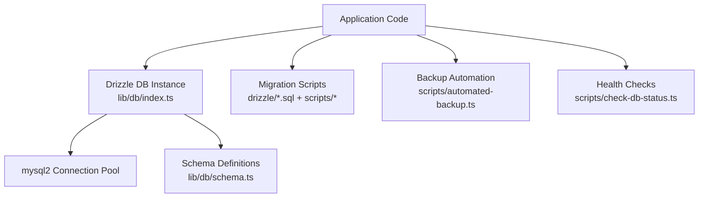
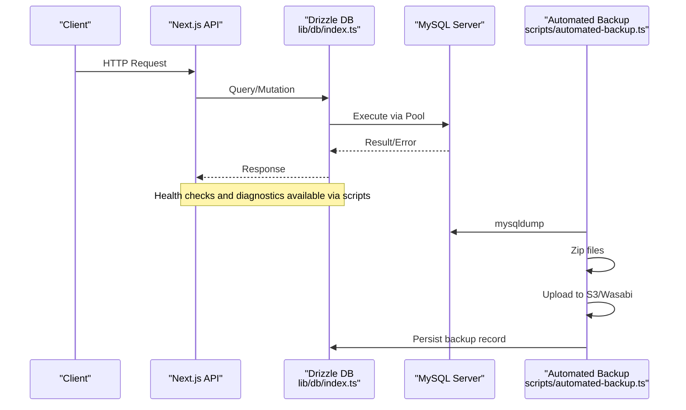
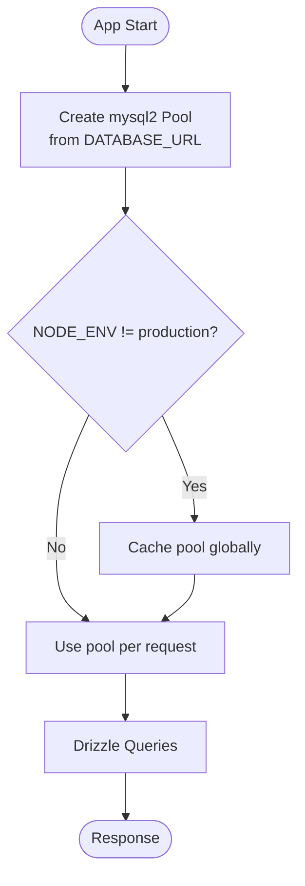
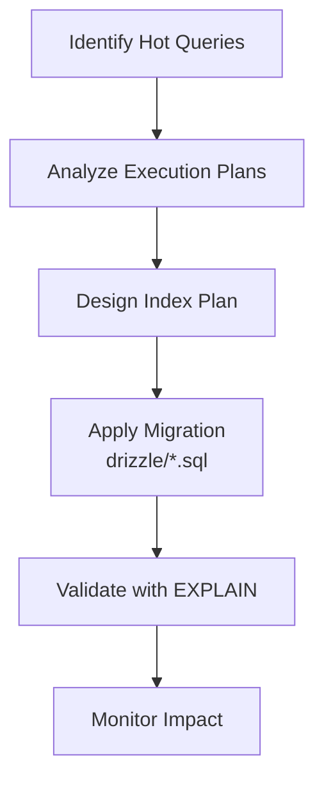
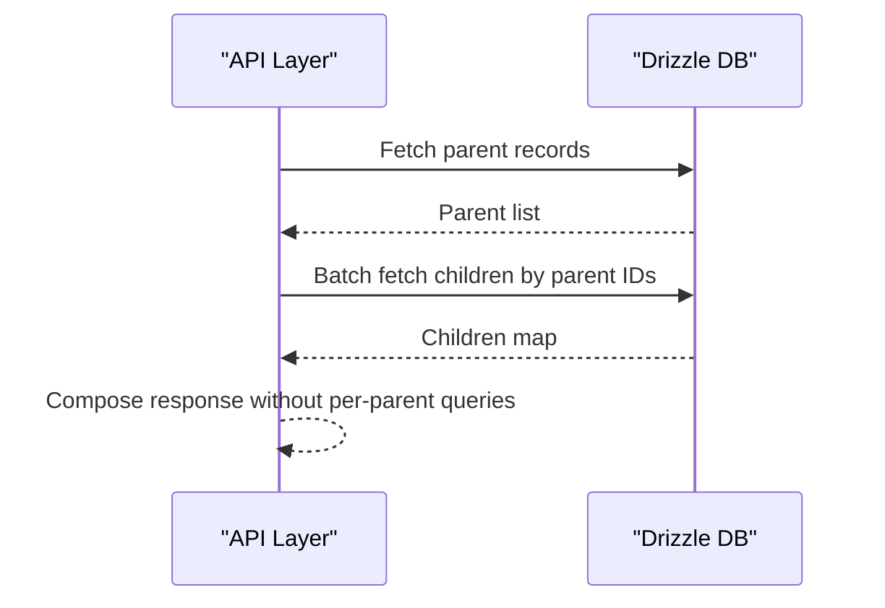
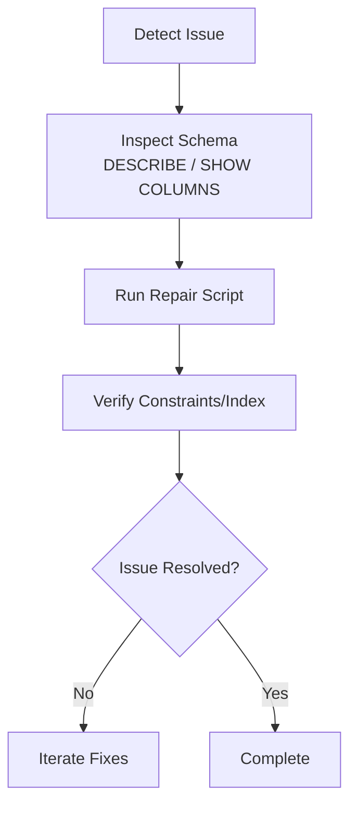
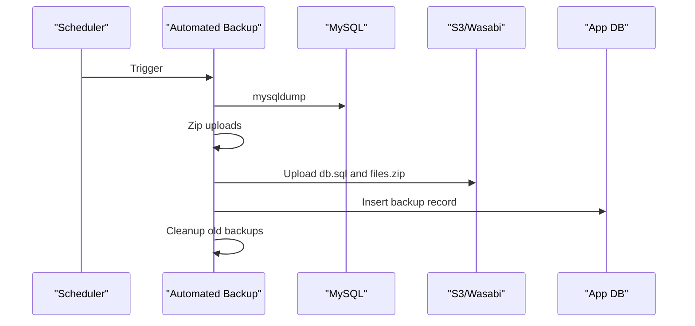
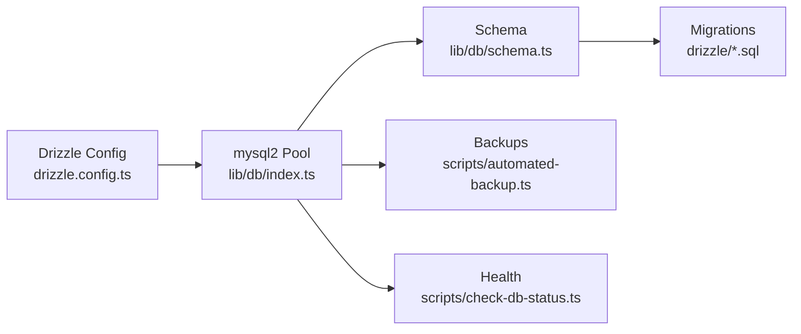

# Database & Performance Issues

<cite>
**Referenced Files in This Document**
- [drizzle.config.ts](file://drizzle.config.ts)
- [lib/db/index.ts](file://lib/db/index.ts)
- [lib/db/schema.ts](file://lib/db/schema.ts)
- [MYSQL_SETUP.md](file://MYSQL_SETUP.md)
- [scripts/check-db-status.ts](file://scripts/check-db-status.ts)
- [scripts/db-diagnose.js](file://scripts/db-diagnose.js)
- [scripts/db-repair.js](file://scripts/db-repair.js)
- [scripts/fix-cms-schema.ts](file://scripts/fix-cms-schema.ts)
- [scripts/fix-updated-at.ts](file://scripts/fix-updated-at.ts)
- [scripts/apply-migration.ts](file://scripts/apply-migration.ts)
- [scripts/run-raw.ts](file://scripts/run-raw.ts)
- [scripts/debug-db-mismatch.ts](file://scripts/debug-db-mismatch.ts)
- [scripts/automated-backup.ts](file://scripts/automated-backup.ts)
- [lib/actions/backup.ts](file://lib/actions/backup.ts)
- [scripts/create-backups-table.ts](file://scripts/create-backups-table.ts)
- [scripts/check-backups.ts](file://scripts/check-backups.ts)
- [drizzle/0004_add_programme_report_indexes.sql](file://drizzle/0004_add_programme_report_indexes.sql)
</cite>

## Table of Contents
1. Introduction
2. Project Structure
3. Core Components
4. Architecture Overview
5. Detailed Component Analysis
6. Dependency Analysis
7. Performance Considerations
8. Troubleshooting Guide
9. Conclusion
10. Appendices

## Introduction
This document provides comprehensive troubleshooting guidance for database and performance issues in the TMC Portal. It focuses on slow query identification, index optimization, connection pool tuning, Drizzle ORM best practices (including N+1 resolution), migration failures, MySQL configuration and storage engine considerations, backup/restore operations, memory usage optimization, caching effectiveness monitoring, query execution plan analysis, transaction deadlocks, foreign key constraint violations, data consistency checks, health checks, capacity planning, scaling strategies, read replicas, and sharding approaches for high-traffic scenarios.

## Project Structure
The TMC Portal uses:
- Drizzle ORM with a MySQL dialect for schema and queries
- A shared connection pool via mysql2/promise
- Migration scripts under drizzle/ and ad-hoc scripts for fixes and maintenance
- Backup automation to local archive and object storage (Wasabi/S3)
- Health check and diagnostic utilities

**Diagram sources**
- [lib/db/index.ts:1-17](file://lib/db/index.ts#L1-L17)
- [lib/db/schema.ts:1-120](file://lib/db/schema.ts#L1-L120)
- [drizzle/0004_add_programme_report_indexes.sql:1-7](file://drizzle/0004_add_programme_report_indexes.sql#L1-L7)
- [scripts/automated-backup.ts:1-30](file://scripts/automated-backup.ts#L1-L30)
- [scripts/check-db-status.ts:1-18](file://scripts/check-db-status.ts#L1-L18)

**Section sources**
- [drizzle.config.ts:1-14](file://drizzle.config.ts#L1-L14)
- [lib/db/index.ts:1-17](file://lib/db/index.ts#L1-L17)
- [lib/db/schema.ts:1-120](file://lib/db/schema.ts#L1-L120)

## Core Components
- Database connection and pool: configured via environment and exposed as a singleton Drizzle instance using mysql2/promise.
- Schema definitions: Drizzle tables, enums, relations, and indexes.
- Migration and fix scripts: SQL migrations and targeted schema repairs.
- Backup system: automated mysqldump, zip uploads, retention cleanup, and metadata persistence.
- Diagnostics: health checks, table/column introspection, and mismatch debugging.

**Section sources**
- [lib/db/index.ts:1-17](file://lib/db/index.ts#L1-L17)
- [lib/db/schema.ts:1-120](file://lib/db/schema.ts#L1-L120)
- [scripts/check-db-status.ts:1-18](file://scripts/check-db-status.ts#L1-L18)
- [scripts/db-diagnose.js:1-37](file://scripts/db-diagnose.js#L1-L37)
- [scripts/automated-backup.ts:1-30](file://scripts/automated-backup.ts#L1-L30)

## Architecture Overview
The application layer issues Drizzle queries against a MySQL database through a pooled connection. Migrations and fixes are applied via SQL scripts executed by Node scripts. Automated backups run periodically, capturing database dumps and file archives, then persisting metadata and cleaning up old artifacts.

**Diagram sources**
- [lib/db/index.ts:1-17](file://lib/db/index.ts#L1-L17)
- [scripts/automated-backup.ts:120-200](file://scripts/automated-backup.ts#L120-L200)

## Detailed Component Analysis

### Database Connection and Pool Tuning
- The Drizzle instance is created from a mysql2/promise pool configured with DATABASE_URL. In non-production environments, the pool is cached globally to avoid reinitialization.
- For production, ensure pool sizing matches expected concurrency and latency targets. Tune pool size, idle timeout, and connection lifecycle based on workload.

**Diagram sources**
- [lib/db/index.ts:6-16](file://lib/db/index.ts#L6-L16)

**Section sources**
- [lib/db/index.ts:1-17](file://lib/db/index.ts#L1-L17)

### Schema and Index Optimization
- The schema defines core entities and relationships. Indexes can be added via Drizzle or raw SQL migrations. An example index migration exists for programme reports rollups.
- Recommended indexing strategy:
  - Add composite indexes on frequently filtered/joined columns (e.g., organizationId + status + date ranges).
  - Ensure foreign key columns used in joins have appropriate indexes.
  - Avoid redundant or unused indexes that increase write overhead.

**Diagram sources**
- [drizzle/0004_add_programme_report_indexes.sql:1-7](file://drizzle/0004_add_programme_report_indexes.sql#L1-L7)

**Section sources**
- [lib/db/schema.ts:148-188](file://lib/db/schema.ts#L148-L188)
- [drizzle/0004_add_programme_report_indexes.sql:1-7](file://drizzle/0004_add_programme_report_indexes.sql#L1-L7)

### Drizzle ORM Query Optimization and N+1 Resolution
- Prefer batched reads and joins to avoid N+1 patterns when loading related entities.
- Use Drizzle relations and select with include patterns where applicable; otherwise, fetch related IDs first and perform a single IN query.
- For heavy aggregations, consider materialized views or snapshot tables updated by scheduled jobs.

[No sources needed since this diagram shows conceptual workflow, not actual code structure]

**Section sources**
- [lib/db/schema.ts:631-682](file://lib/db/schema.ts#L631-L682)

### Migration Failures and Schema Repairs
- Common issues: duplicate keys, missing constraints, incompatible column types, and charset/collation mismatches.
- Use targeted repair scripts to add constraints, drop/recreate indexes, and normalize timestamp defaults.
- Apply manual migrations carefully and verify idempotency.

**Diagram sources**
- [scripts/db-diagnose.js:1-37](file://scripts/db-diagnose.js#L1-L37)
- [scripts/fix-cms-schema.ts:64-86](file://scripts/fix-cms-schema.ts#L64-L86)
- [scripts/db-repair.js:32-65](file://scripts/db-repair.js#L32-L65)
- [scripts/fix-updated-at.ts:17-43](file://scripts/fix-updated-at.ts#L17-L43)
- [scripts/apply-migration.ts:1-28](file://scripts/apply-migration.ts#L1-L28)

**Section sources**
- [scripts/fix-cms-schema.ts:64-86](file://scripts/fix-cms-schema.ts#L64-L86)
- [scripts/db-repair.js:32-65](file://scripts/db-repair.js#L32-L65)
- [scripts/fix-updated-at.ts:17-43](file://scripts/fix-updated-at.ts#L17-L43)
- [scripts/apply-migration.ts:1-28](file://scripts/apply-migration.ts#L1-L28)

### Backup and Restore Operations
- Automated backups:
  - Dump database using mysqldump
  - Zip uploads directory
  - Upload to Wasabi/S3
  - Persist backup metadata in the backups table
  - Clean up old backups locally and in cloud based on retention policy
- Manual backups:
  - Triggered via server action, similar flow with temporary directories and cleanup
- Restore:
  - Retrieve database dump and files from storage
  - Recreate schema if necessary
  - Import dump into target database

**Diagram sources**
- [scripts/automated-backup.ts:120-200](file://scripts/automated-backup.ts#L120-L200)
- [lib/actions/backup.ts:104-148](file://lib/actions/backup.ts#L104-L148)
- [scripts/create-backups-table.ts:1-26](file://scripts/create-backups-table.ts#L1-L26)

**Section sources**
- [scripts/automated-backup.ts:31-84](file://scripts/automated-backup.ts#L31-L84)
- [scripts/automated-backup.ts:120-200](file://scripts/automated-backup.ts#L120-L200)
- [lib/actions/backup.ts:104-148](file://lib/actions/backup.ts#L104-L148)
- [scripts/create-backups-table.ts:1-26](file://scripts/create-backups-table.ts#L1-L26)
- [scripts/check-backups.ts:1-9](file://scripts/check-backups.ts#L1-L9)

### MySQL Configuration and Storage Engine
- Ensure MySQL is running and accessible; verify credentials and host/port.
- Confirm database name and connection string format.
- Validate storage engine (InnoDB recommended for transactions and foreign keys).
- Check character set and collation compatibility across tables.

**Section sources**
- [MYSQL_SETUP.md:1-127](file://MYSQL_SETUP.md#L1-L127)

### Memory Usage Optimization and Caching Effectiveness
- Reduce memory pressure by:
  - Limiting result sets and avoiding SELECT *
  - Using pagination and filtering at the database level
  - Batching writes and minimizing large JSON payloads
- Monitor cache effectiveness by:
  - Tracking hit rates and TTLs
  - Measuring latency before/after cache hits
  - Profiling hot paths to identify cache candidates

[No sources needed since this section provides general guidance]

### Query Execution Plan Analysis
- Use EXPLAIN to analyze query plans and identify full table scans or suboptimal joins.
- Validate new indexes improve plans and reduce cost.
- Revisit queries that trigger excessive row examinations.

[No sources needed since this section provides general guidance]

### Transaction Deadlocks and Foreign Key Constraint Violations
- Deadlocks:
  - Normalize lock ordering and keep transactions short
  - Retry logic with exponential backoff for transient deadlock errors
- Foreign key violations:
  - Ensure referential integrity before inserts/updates
  - Use repair scripts to add or fix constraints where needed

**Section sources**
- [scripts/fix-cms-schema.ts:64-86](file://scripts/fix-cms-schema.ts#L64-L86)
- [scripts/db-repair.js:32-65](file://scripts/db-repair.js#L32-L65)

### Data Consistency Issues
- Compare ORM results with raw SQL counts to detect discrepancies.
- Use diagnostic scripts to inspect schemas and validate data integrity.

**Section sources**
- [scripts/debug-db-mismatch.ts:1-24](file://scripts/debug-db-mismatch.ts#L1-L24)
- [scripts/db-diagnose.js:1-37](file://scripts/db-diagnose.js#L1-L37)

### Performance Monitoring Tools and Database Health Checks
- Health check script verifies connectivity and returns success/failure.
- Diagnostic scripts list tables and describe columns for quick inspection.

**Section sources**
- [scripts/check-db-status.ts:1-18](file://scripts/check-db-status.ts#L1-L18)
- [scripts/db-diagnose.js:1-37](file://scripts/db-diagnose.js#L1-L37)

### Capacity Planning, Scaling, Read Replicas, and Sharding
- Capacity planning:
  - Track growth of key tables and indexes
  - Monitor CPU, I/O, and connection utilization
- Scaling:
  - Vertical scaling: increase instance resources
  - Horizontal scaling: read replicas for read-heavy workloads
  - Sharding: partition by tenant or jurisdiction for very large datasets
- Read replicas:
  - Route read-only queries to replicas
  - Ensure replication lag is acceptable for your use case

[No sources needed since this section provides general guidance]

## Dependency Analysis
Key dependencies and their roles:
- Drizzle ORM depends on mysql2/promise for connections
- Schema drives migrations and relations
- Backup automation depends on external tools (mysqldump, zip) and S3/Wasabi SDK
- Health and diagnostic scripts depend on the same DB connection

**Diagram sources**
- [drizzle.config.ts:1-14](file://drizzle.config.ts#L1-L14)
- [lib/db/index.ts:1-17](file://lib/db/index.ts#L1-L17)
- [lib/db/schema.ts:1-120](file://lib/db/schema.ts#L1-L120)
- [scripts/automated-backup.ts:1-30](file://scripts/automated-backup.ts#L1-L30)
- [scripts/check-db-status.ts:1-18](file://scripts/check-db-status.ts#L1-L18)

**Section sources**
- [drizzle.config.ts:1-14](file://drizzle.config.ts#L1-L14)
- [lib/db/index.ts:1-17](file://lib/db/index.ts#L1-L17)

## Performance Considerations
- Optimize queries with proper indexes and selective filters
- Avoid N+1 by batching and joining
- Tune connection pool sizes and timeouts
- Use backups and retention policies to manage storage
- Monitor execution plans and adjust indexes accordingly

[No sources needed since this section provides general guidance]

## Troubleshooting Guide
- Slow queries:
  - Run EXPLAIN on suspected queries
  - Add or refine indexes based on filter/join patterns
  - Refactor queries to reduce rows examined
- Migration failures:
  - Inspect error messages and schema state
  - Apply targeted repair scripts to fix constraints/indexes
  - Re-run migrations after resolving conflicts
- Connection issues:
  - Use health check script to verify connectivity
  - Validate DATABASE_URL and MySQL service status
- Backup/restore:
  - Verify mysqldump and zip commands succeed
  - Confirm S3/Wasabi upload and permissions
  - Validate backup metadata and retention cleanup
- Data inconsistencies:
  - Compare ORM vs raw SQL counts
  - Inspect schemas and column types
  - Normalize timestamps and defaults

**Section sources**
- [scripts/check-db-status.ts:1-18](file://scripts/check-db-status.ts#L1-L18)
- [scripts/db-diagnose.js:1-37](file://scripts/db-diagnose.js#L1-L37)
- [scripts/fix-cms-schema.ts:64-86](file://scripts/fix-cms-schema.ts#L64-L86)
- [scripts/db-repair.js:32-65](file://scripts/db-repair.js#L32-L65)
- [scripts/fix-updated-at.ts:17-43](file://scripts/fix-updated-at.ts#L17-L43)
- [scripts/apply-migration.ts:1-28](file://scripts/apply-migration.ts#L1-L28)
- [scripts/debug-db-mismatch.ts:1-24](file://scripts/debug-db-mismatch.ts#L1-L24)
- [scripts/automated-backup.ts:120-200](file://scripts/automated-backup.ts#L120-L200)
- [lib/actions/backup.ts:104-148](file://lib/actions/backup.ts#L104-L148)

## Conclusion
By combining careful indexing, ORM query optimization, robust backup procedures, and systematic diagnostics, the TMC Portal can maintain high performance and reliability. Use the provided scripts to monitor health, diagnose issues, apply fixes, and automate backups. For high-traffic scenarios, consider scaling horizontally with read replicas and sharding strategies while continuously validating performance with execution plans and metrics.

## Appendices
- Environment setup and connection details for MySQL
- Example index migration for programme reports
- Backup automation flow and retention policy

**Section sources**
- [MYSQL_SETUP.md:1-127](file://MYSQL_SETUP.md#L1-L127)
- [drizzle/0004_add_programme_report_indexes.sql:1-7](file://drizzle/0004_add_programme_report_indexes.sql#L1-L7)
- [scripts/automated-backup.ts:31-84](file://scripts/automated-backup.ts#L31-L84)