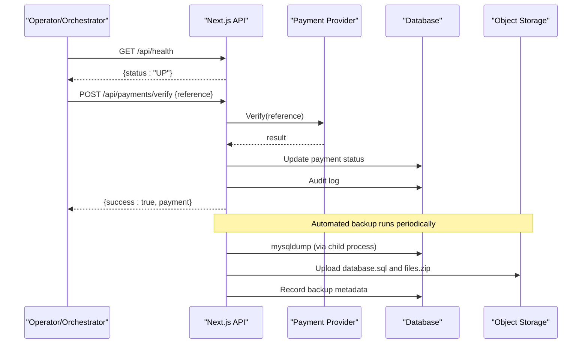
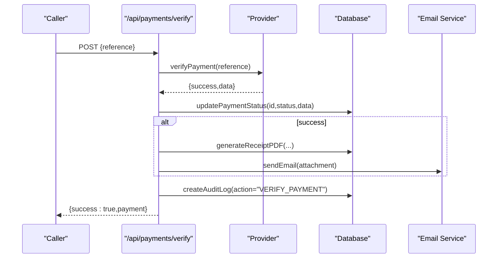
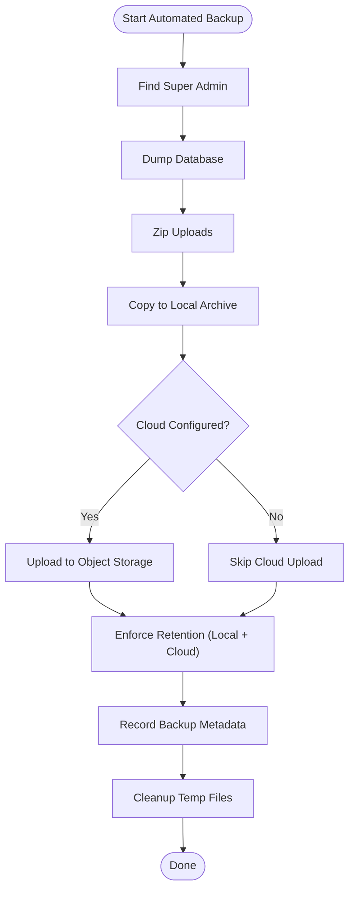
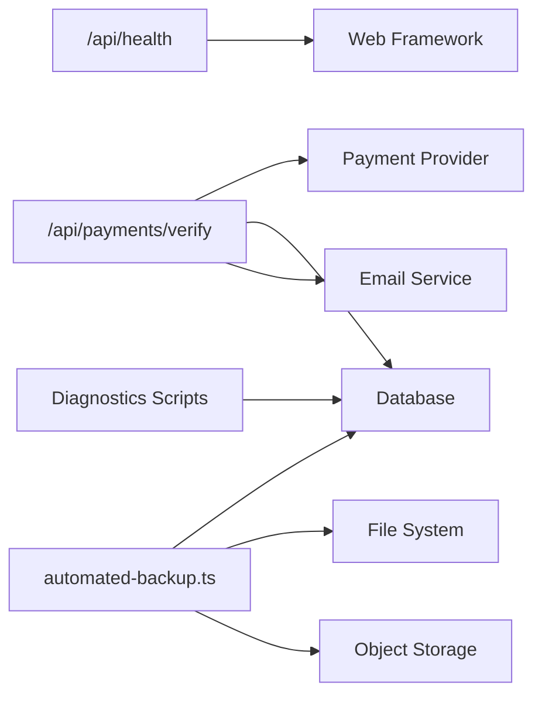

# Diagnostic Tools & Scripts

<cite>
**Referenced Files in This Document**
- [app/api/health/route.ts](file://app/api/health/route.ts)
- [app/api/payments/verify/route.ts](file://app/api/payments/verify/route.ts)
- [scripts/db-diagnose.js](file://scripts/db-diagnose.js)
- [scripts/check-db-status.ts](file://scripts/check-db-status.ts)
- [scripts/inspect-schema.ts](file://scripts/inspect-schema.ts)
- [scripts/debug-payments-schema.ts](file://scripts/debug-payments-schema.ts)
- [scripts/verify-schema.ts](file://scripts/verify-schema.ts)
- [scripts/test-db-error.ts](file://scripts/test-db-error.ts)
- [scripts/check-tables.ts](file://scripts/check-tables.ts)
- [scripts/debug-auth.ts](file://scripts/debug-auth.ts)
- [scripts/test-auth.ts](file://scripts/test-auth.ts)
- [scripts/check-backups.ts](file://scripts/check-backups.ts)
- [scripts/automated-backup.ts](file://scripts/automated-backup.ts)
- [scripts/inspect-data.ts](file://scripts/inspect-data.ts)
</cite>

## Table of Contents
1. Introduction
2. Project Structure
3. Core Components
4. Architecture Overview
5. Detailed Component Analysis
6. Dependency Analysis
7. Performance Considerations
8. Troubleshooting Guide
9. Conclusion
10. Appendices

## Introduction
This document provides comprehensive guidance for diagnosing and monitoring the TMC Portal using built-in scripts and endpoints. It covers database diagnostics, authentication testing, payment verification, schema validation, automated backups, and health checks. You will find step-by-step instructions to run diagnostic commands, interpret outputs, identify bottlenecks, analyze logs, and extend monitoring capabilities with custom tools.

## Project Structure
The diagnostic surface is split between:
- API endpoints for runtime health and operational checks (e.g., health, payments verification).
- CLI scripts under scripts/ for database connectivity, schema inspection, data queries, backup automation, and targeted debugging.

```mermaid
graph TB
subgraph "Runtime Endpoints"
H["GET /api/health"]
PV["POST /api/payments/verify"]
end
subgraph "CLI Diagnostics"
DBD["db-diagnose.js"]
CDB["check-db-status.ts"]
ISCH["inspect-schema.ts"]
DPS["debug-payments-schema.ts"]
VS["verify-schema.ts"]
TDBE["test-db-error.ts"]
CT["check-tables.ts"]
DA["debug-auth.ts"]
TA["test-auth.ts"]
CB["check-backups.ts"]
AB["automated-backup.ts"]
ID["inspect-data.ts"]
end
H --> |"Health check"| Ops["Operations"]
PV --> |"Verify payment"| Pay["Payments Service"]
DBD --> |"Connect + describe tables"| DB["Database"]
CDB --> |"Ping DB"| DB
ISCH --> |"DESCRIBE table"| DB
DPS --> |"SHOW COLUMNS"| DB
VS --> |"Prisma queries"| DB
TDBE --> |"Insert/Delete test row"| DB
CT --> |"SHOW TABLES + DESCRIBE"| DB
DA --> |"User lookup + bcrypt verify"| DB
TA --> |"Org/official lookups"| DB
CB --> |"List recent backups"| DB
AB --> |"mysqldump + S3 upload"| DB
ID --> |"Query jurisdiction codes"| DB
```

**Diagram sources**
- [app/api/health/route.ts:1-6](file://app/api/health/route.ts#L1-L6)
- [app/api/payments/verify/route.ts:1-96](file://app/api/payments/verify/route.ts#L1-L96)
- [scripts/db-diagnose.js:1-37](file://scripts/db-diagnose.js#L1-L37)
- [scripts/check-db-status.ts:1-18](file://scripts/check-db-status.ts#L1-L18)
- [scripts/inspect-schema.ts:1-21](file://scripts/inspect-schema.ts#L1-L21)
- [scripts/debug-payments-schema.ts:1-32](file://scripts/debug-payments-schema.ts#L1-L32)
- [scripts/verify-schema.ts:1-50](file://scripts/verify-schema.ts#L1-L50)
- [scripts/test-db-error.ts:1-15](file://scripts/test-db-error.ts#L1-L15)
- [scripts/check-tables.ts:1-57](file://scripts/check-tables.ts#L1-L57)
- [scripts/debug-auth.ts:1-68](file://scripts/debug-auth.ts#L1-L68)
- [scripts/test-auth.ts:1-58](file://scripts/test-auth.ts#L1-L58)
- [scripts/check-backups.ts:1-10](file://scripts/check-backups.ts#L1-L10)
- [scripts/automated-backup.ts:1-238](file://scripts/automated-backup.ts#L1-L238)
- [scripts/inspect-data.ts:1-26](file://scripts/inspect-data.ts#L1-L26)

**Section sources**
- [app/api/health/route.ts:1-6](file://app/api/health/route.ts#L1-L6)
- [scripts/db-diagnose.js:1-37](file://scripts/db-diagnose.js#L1-L37)
- [scripts/check-db-status.ts:1-18](file://scripts/check-db-status.ts#L1-L18)
- [scripts/inspect-schema.ts:1-21](file://scripts/inspect-schema.ts#L1-L21)
- [scripts/debug-payments-schema.ts:1-32](file://scripts/debug-payments-schema.ts#L1-L32)
- [scripts/verify-schema.ts:1-50](file://scripts/verify-schema.ts#L1-L50)
- [scripts/test-db-error.ts:1-15](file://scripts/test-db-error.ts#L1-L15)
- [scripts/check-tables.ts:1-57](file://scripts/check-tables.ts#L1-L57)
- [scripts/debug-auth.ts:1-68](file://scripts/debug-auth.ts#L1-L68)
- [scripts/test-auth.ts:1-58](file://scripts/test-auth.ts#L1-L58)
- [scripts/check-backups.ts:1-10](file://scripts/check-backups.ts#L1-L10)
- [scripts/automated-backup.ts:1-238](file://scripts/automated-backup.ts#L1-L238)
- [scripts/inspect-data.ts:1-26](file://scripts/inspect-data.ts#L1-L26)

## Core Components
- Health endpoint: A minimal GET endpoint returning a simple status JSON used by orchestrators or load balancers to probe service liveness.
- Payment verification endpoint: Accepts a reference, verifies against the payment provider, updates internal records, sends receipts, and logs audit events.
- Database diagnostics: Scripts that connect to the database, list tables, describe schemas, and execute targeted queries to validate connectivity and structure.
- Schema validation: Scripts that use Prisma or raw SQL to assert expected tables/columns exist and are queryable.
- Authentication diagnostics: Scripts to inspect user records, validate password hashes, and simulate session context for permission checks.
- Backup automation: Script that dumps the database, zips uploads, persists locally, uploads to object storage, enforces retention, and records metadata.
- Data inspection: Scripts to quickly read specific datasets (e.g., jurisdiction codes) for sanity checks.

**Section sources**
- [app/api/health/route.ts:1-6](file://app/api/health/route.ts#L1-L6)
- [app/api/payments/verify/route.ts:1-96](file://app/api/payments/verify/route.ts#L1-L96)
- [scripts/db-diagnose.js:1-37](file://scripts/db-diagnose.js#L1-L37)
- [scripts/inspect-schema.ts:1-21](file://scripts/inspect-schema.ts#L1-L21)
- [scripts/debug-payments-schema.ts:1-32](file://scripts/debug-payments-schema.ts#L1-L32)
- [scripts/verify-schema.ts:1-50](file://scripts/verify-schema.ts#L1-L50)
- [scripts/debug-auth.ts:1-68](file://scripts/debug-auth.ts#L1-L68)
- [scripts/test-auth.ts:1-58](file://scripts/test-auth.ts#L1-L58)
- [scripts/automated-backup.ts:1-238](file://scripts/automated-backup.ts#L1-L238)
- [scripts/inspect-data.ts:1-26](file://scripts/inspect-data.ts#L1-L26)

## Architecture Overview
The diagnostic architecture combines lightweight HTTP probes with robust CLI tools that interact directly with the database and external services. The health endpoint provides immediate feedback for orchestration systems. Payment verification integrates with an external provider and updates internal state while emitting audit logs and emails. Backup automation coordinates local and cloud persistence with retention policies.

**Diagram sources**
- [app/api/health/route.ts:1-6](file://app/api/health/route.ts#L1-L6)
- [app/api/payments/verify/route.ts:1-96](file://app/api/payments/verify/route.ts#L1-L96)
- [scripts/automated-backup.ts:1-238](file://scripts/automated-backup.ts#L1-L238)

## Detailed Component Analysis

### Health Check Endpoint
- Purpose: Provide a fast liveness probe for load balancers and orchestrators.
- Behavior: Returns a JSON response indicating the service is up.
- Usage: Call GET /api/health from your health checker; expect 200 with a status field.

**Section sources**
- [app/api/health/route.ts:1-6](file://app/api/health/route.ts#L1-L6)

### Payment Verification Endpoint
- Purpose: Verify a payment by reference, update internal records, send receipts, and log audits.
- Inputs: JSON body with a reference field.
- Flow:
  - Validate input.
  - Call external verification service.
  - Locate payment record and update status based on provider response.
  - Generate and email receipt if successful.
  - Create an audit log entry.
- Outputs: Success payload with payment details or error responses.

**Diagram sources**
- [app/api/payments/verify/route.ts:1-96](file://app/api/payments/verify/route.ts#L1-L96)

**Section sources**
- [app/api/payments/verify/route.ts:1-96](file://app/api/payments/verify/route.ts#L1-L96)

### Database Connectivity Diagnostics
- check-db-status.ts: Pings the database via a minimal query to confirm connectivity.
- db-diagnose.js: Connects to the database, lists tables, and describes selected tables to validate schema presence.
- check-tables.ts: Lists all tables and describes key tables to detect missing columns or mismatches.

Usage steps:
- Ensure environment variables (e.g., DATABASE_URL) are set.
- Run the script using Node/tsx as appropriate.
- Interpret output:
  - Successful connection and table listing indicate healthy DB access.
  - Errors in DESCRIBE indicate schema drift or missing tables.

**Section sources**
- [scripts/check-db-status.ts:1-18](file://scripts/check-db-status.ts#L1-L18)
- [scripts/db-diagnose.js:1-37](file://scripts/db-diagnose.js#L1-L37)
- [scripts/check-tables.ts:1-57](file://scripts/check-tables.ts#L1-L57)

### Schema Validation Tools
- verify-schema.ts: Uses Prisma to query known tables and fields to ensure they exist and are readable.
- inspect-schema.ts: Uses raw SQL to describe a table’s columns and prints the result for inspection.
- debug-payments-schema.ts: Inspects the payments table columns to validate expected fields.

Usage steps:
- Set required environment variables.
- Execute the script and review printed results.
- If errors occur, compare expected schema with actual output to identify mismatches.

**Section sources**
- [scripts/verify-schema.ts:1-50](file://scripts/verify-schema.ts#L1-L50)
- [scripts/inspect-schema.ts:1-21](file://scripts/inspect-schema.ts#L1-L21)
- [scripts/debug-payments-schema.ts:1-32](file://scripts/debug-payments-schema.ts#L1-L32)

### Authentication Testing
- debug-auth.ts:
  - Without arguments: lists recent users with key fields.
  - With email/password: locates user, confirms existence, checks for password presence, and verifies password hash.
- test-auth.ts:
  - Demonstrates building a session-like token from user/official/org data and performing a simple permission check.

Usage steps:
- Run without arguments to see sample users.
- Run with email and password to validate credentials and stored hash behavior.
- Use test-auth.ts to simulate authorization logic for a given user and organization.

**Section sources**
- [scripts/debug-auth.ts:1-68](file://scripts/debug-auth.ts#L1-L68)
- [scripts/test-auth.ts:1-58](file://scripts/test-auth.ts#L1-L58)

### Error Injection and Resilience Checks
- test-db-error.ts: Attempts a write operation to a system settings table and prints full error details if it fails. Useful for validating error handling paths and permissions.

Usage steps:
- Run the script to trigger a controlled write.
- Review the printed error object to understand failure modes (e.g., permissions, constraints).

**Section sources**
- [scripts/test-db-error.ts:1-15](file://scripts/test-db-error.ts#L1-L15)

### Automated Backups and Monitoring
- automated-backup.ts:
  - Dumps the database using mysqldump.
  - Zips application uploads.
  - Persists artifacts locally and uploads to object storage.
  - Enforces retention by deleting old backups locally and in the cloud.
  - Records backup metadata in the database.
  - Optionally triggers related maintenance tasks after completion.
- check-backups.ts: Lists recent backup records from the database for quick status checks.

Operational notes:
- Requires database credentials and object storage configuration.
- Retention policy is enforced both locally and in the cloud.
- Failure paths record failed backups for visibility.

**Diagram sources**
- [scripts/automated-backup.ts:1-238](file://scripts/automated-backup.ts#L1-L238)

**Section sources**
- [scripts/automated-backup.ts:1-238](file://scripts/automated-backup.ts#L1-L238)
- [scripts/check-backups.ts:1-10](file://scripts/check-backups.ts#L1-L10)

### Data Inspection Utilities
- inspect-data.ts: Queries jurisdiction codes for specific countries/states to validate reference data integrity.

Usage steps:
- Run the script to print country and state code mappings.
- Use output to confirm reference data consistency across environments.

**Section sources**
- [scripts/inspect-data.ts:1-26](file://scripts/inspect-data.ts#L1-L26)

## Dependency Analysis
Key dependencies and interactions:
- Health endpoint depends only on the web framework to return a static response.
- Payment verification depends on:
  - External payment provider API.
  - Database for reading/updating payment records and writing audit logs.
  - Email service for sending receipts.
- Backup automation depends on:
  - Database client and mysqldump binary availability.
  - File system for temporary and archive storage.
  - Object storage SDK for uploading artifacts.
- Schema and data scripts depend on environment configuration (DATABASE_URL, optional storage credentials).

**Diagram sources**
- [app/api/health/route.ts:1-6](file://app/api/health/route.ts#L1-L6)
- [app/api/payments/verify/route.ts:1-96](file://app/api/payments/verify/route.ts#L1-L96)
- [scripts/automated-backup.ts:1-238](file://scripts/automated-backup.ts#L1-L238)
- [scripts/check-db-status.ts:1-18](file://scripts/check-db-status.ts#L1-L18)
- [scripts/db-diagnose.js:1-37](file://scripts/db-diagnose.js#L1-L37)

**Section sources**
- [app/api/payments/verify/route.ts:1-96](file://app/api/payments/verify/route.ts#L1-L96)
- [scripts/automated-backup.ts:1-238](file://scripts/automated-backup.ts#L1-L238)

## Performance Considerations
- Prefer lightweight probes: Use the health endpoint for frequent liveness checks to minimize overhead.
- Avoid heavy operations in hot paths: Keep payment verification focused; offload expensive work (e.g., PDF generation) where possible.
- Database queries: Use targeted queries in scripts to reduce load during diagnostics.
- Backup scheduling: Schedule backups during low-traffic windows; ensure retention policies prevent unbounded growth.
- I/O bottlenecks: Monitor disk space for local archives and network throughput for cloud uploads.

[No sources needed since this section provides general guidance]

## Troubleshooting Guide

### Common Scenarios and Workflows

- Service outage detection
  - Call GET /api/health to confirm service responsiveness.
  - If down, check container/runtime logs and upstream dependencies.

- Database connectivity issues
  - Run check-db-status.ts to validate connectivity.
  - Use db-diagnose.js or check-tables.ts to list and describe tables.
  - If schema mismatch suspected, run inspect-schema.ts or debug-payments-schema.ts to compare actual columns with expectations.

- Authentication failures
  - Use debug-auth.ts to verify user existence and password hash correctness.
  - For authorization issues, run test-auth.ts to simulate session context and permission checks.

- Payment verification problems
  - Call POST /api/payments/verify with a valid reference.
  - Inspect returned error messages and audit logs.
  - Confirm external provider reachability and credentials.

- Data corruption or unexpected state
  - Use test-db-error.ts to exercise write paths and capture detailed errors.
  - Inspect relevant tables with check-tables.ts or inspect-schema.ts.
  - Validate reference data with inspect-data.ts.

- Backup failures
  - Run automated-backup.ts manually to reproduce issues.
  - Check local archive directory and object storage for uploaded artifacts.
  - Use check-backups.ts to review recorded backup metadata and statuses.

### Log Analysis Techniques
- Focus on error stacks and status codes returned by endpoints.
- Correlate timestamps across application logs, database logs, and external service logs.
- For backups, inspect console output for each stage (dump, zip, upload, retention) to pinpoint failures.

### Performance Profiling Methods
- Profile payment verification by measuring time-to-first-byte and total duration.
- Monitor database query performance using slow query logs and explain plans for heavy queries.
- Track backup durations and sizes to identify I/O bottlenecks.

**Section sources**
- [app/api/health/route.ts:1-6](file://app/api/health/route.ts#L1-L6)
- [scripts/check-db-status.ts:1-18](file://scripts/check-db-status.ts#L1-L18)
- [scripts/db-diagnose.js:1-37](file://scripts/db-diagnose.js#L1-L37)
- [scripts/check-tables.ts:1-57](file://scripts/check-tables.ts#L1-L57)
- [scripts/inspect-schema.ts:1-21](file://scripts/inspect-schema.ts#L1-L21)
- [scripts/debug-payments-schema.ts:1-32](file://scripts/debug-payments-schema.ts#L1-L32)
- [scripts/debug-auth.ts:1-68](file://scripts/debug-auth.ts#L1-L68)
- [scripts/test-auth.ts:1-58](file://scripts/test-auth.ts#L1-L58)
- [app/api/payments/verify/route.ts:1-96](file://app/api/payments/verify/route.ts#L1-L96)
- [scripts/test-db-error.ts:1-15](file://scripts/test-db-error.ts#L1-L15)
- [scripts/automated-backup.ts:1-238](file://scripts/automated-backup.ts#L1-L238)
- [scripts/check-backups.ts:1-10](file://scripts/check-backups.ts#L1-L10)

## Conclusion
The TMC Portal provides a practical set of diagnostic tools and monitoring endpoints to ensure operational reliability. Use the health endpoint for liveness checks, leverage scripts for database and schema validation, authenticate and authorize users with dedicated tools, verify payments end-to-end, and automate backups with retention policies. Combine these tools with structured log analysis and performance profiling to maintain system health and respond swiftly to incidents.

[No sources needed since this section summarizes without analyzing specific files]

## Appendices

### Step-by-Step Commands Reference
- Health check:
  - Invoke GET /api/health from your health checker.
- Database connectivity:
  - Run scripts/check-db-status.ts to ping the database.
- Schema inspection:
  - Run scripts/inspect-schema.ts to describe a table.
  - Run scripts/debug-payments-schema.ts to inspect payments columns.
  - Run scripts/verify-schema.ts to validate Prisma-accessible tables.
- Authentication testing:
  - Run scripts/debug-auth.ts without arguments to list recent users.
  - Run scripts/debug-auth.ts <email> <password> to verify credentials.
  - Run scripts/test-auth.ts to simulate session and permissions.
- Payment verification:
  - Call POST /api/payments/verify with { "reference": "<value>" }.
- Backup operations:
  - Run scripts/automated-backup.ts to perform a manual backup.
  - Run scripts/check-backups.ts to list recent backups.
- Data inspection:
  - Run scripts/inspect-data.ts to view jurisdiction codes.

**Section sources**
- [app/api/health/route.ts:1-6](file://app/api/health/route.ts#L1-L6)
- [scripts/check-db-status.ts:1-18](file://scripts/check-db-status.ts#L1-L18)
- [scripts/inspect-schema.ts:1-21](file://scripts/inspect-schema.ts#L1-L21)
- [scripts/debug-payments-schema.ts:1-32](file://scripts/debug-payments-schema.ts#L1-L32)
- [scripts/verify-schema.ts:1-50](file://scripts/verify-schema.ts#L1-L50)
- [scripts/debug-auth.ts:1-68](file://scripts/debug-auth.ts#L1-L68)
- [scripts/test-auth.ts:1-58](file://scripts/test-auth.ts#L1-L58)
- [app/api/payments/verify/route.ts:1-96](file://app/api/payments/verify/route.ts#L1-L96)
- [scripts/automated-backup.ts:1-238](file://scripts/automated-backup.ts#L1-L238)
- [scripts/check-backups.ts:1-10](file://scripts/check-backups.ts#L1-L10)
- [scripts/inspect-data.ts:1-26](file://scripts/inspect-data.ts#L1-L26)

### Custom Diagnostic Tool Template
To extend monitoring capabilities:
- Create a new script under scripts/ that connects to the database using existing configuration.
- Implement clear inputs (arguments or environment variables) and structured outputs (console logs or JSON).
- Include error handling with meaningful messages and exit codes.
- Add usage hints at the top of the script.
- Integrate with existing patterns (e.g., describe tables, run targeted queries, record metrics).

Example pattern references:
- Connection and query execution: [scripts/check-db-status.ts:1-18](file://scripts/check-db-status.ts#L1-L18)
- Raw SQL description: [scripts/inspect-schema.ts:1-21](file://scripts/inspect-schema.ts#L1-L21)
- Prisma-based validation: [scripts/verify-schema.ts:1-50](file://scripts/verify-schema.ts#L1-L50)

**Section sources**
- [scripts/check-db-status.ts:1-18](file://scripts/check-db-status.ts#L1-L18)
- [scripts/inspect-schema.ts:1-21](file://scripts/inspect-schema.ts#L1-L21)
- [scripts/verify-schema.ts:1-50](file://scripts/verify-schema.ts#L1-L50)