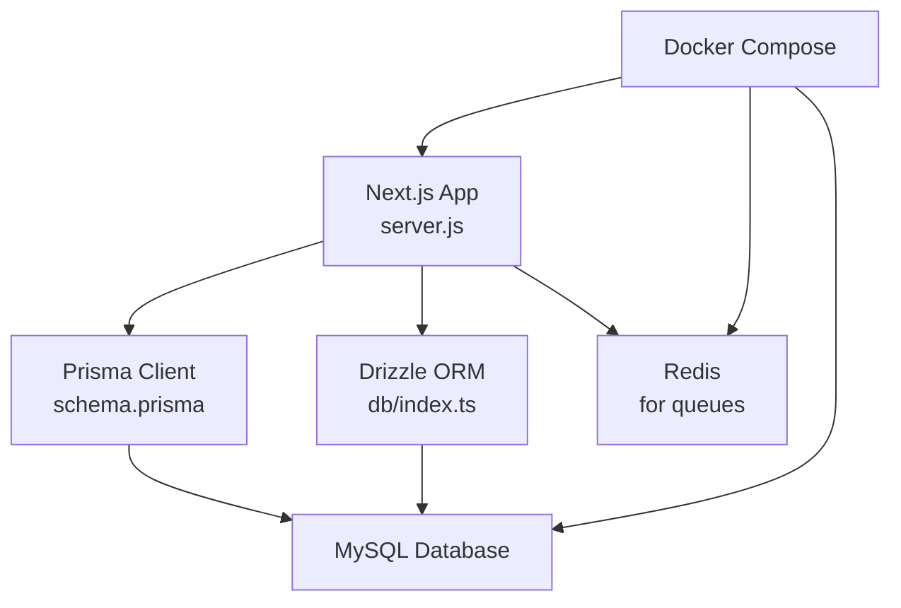
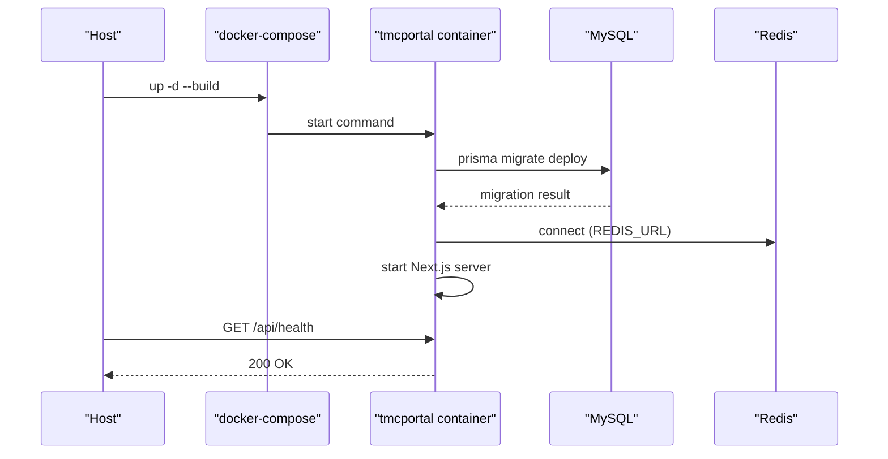

# Installation & Setup Issues

<cite>
**Referenced Files in This Document**
- [README.md](file://README.md)
- [SETUP.md](file://SETUP.md)
- [MYSQL_SETUP.md](file://MYSQL_SETUP.md)
- [DEPLOYMENT_GUIDE_SERVER.md](file://DEPLOYMENT_GUIDE_SERVER.md)
- [package.json](file://package.json)
- [Dockerfile](file://Dockerfile)
- [docker-compose.yml](file://docker-compose.yml)
- [next.config.ts](file://next.config.ts)
- [prisma/schema.prisma](file://prisma/schema.prisma)
- [prisma.config.js](file://prisma.config.js)
- [drizzle.config.ts](file://drizzle.config.ts)
- [lib/db/index.ts](file://lib/db/index.ts)
- [tsconfig.json](file://tsconfig.json)
</cite>

## Table of Contents
1. Introduction
2. Project Structure
3. Core Components
4. Architecture Overview
5. Detailed Component Analysis
6. Dependency Analysis
7. Performance Considerations
8. Troubleshooting Guide
9. Conclusion
10. Appendices

## Introduction
This document provides comprehensive troubleshooting for installation and setup issues in the TMC Portal. It focuses on database connectivity (MySQL), environment variables, missing dependencies, Node.js version compatibility, Docker networking and volumes, file permissions across operating systems and cloud environments, build and TypeScript compilation errors, Next.js configuration problems, known platform-specific issues, and verification steps to confirm successful installation and basic functionality.

## Project Structure
The project is a Next.js 15 application with Prisma and Drizzle ORM layers, MySQL as the primary database, Redis for background jobs, and Docker-based deployment. Key areas relevant to setup:
- Environment configuration via .env files and container env_file
- Database schema and migrations under prisma/ and drizzle/
- Build and runtime configuration in next.config.ts and Dockerfile
- Container orchestration and networking in docker-compose.yml

**Diagram sources**
- [docker-compose.yml:1-69](file://docker-compose.yml#L1-L69)
- [Dockerfile:1-95](file://Dockerfile#L1-L95)
- [next.config.ts:1-41](file://next.config.ts#L1-L41)
- [prisma/schema.prisma:1-12](file://prisma/schema.prisma#L1-L12)
- [lib/db/index.ts:1-17](file://lib/db/index.ts#L1-L17)

**Section sources**
- [README.md:16-37](file://README.md#L16-L37)
- [package.json:1-16](file://package.json#L1-L16)
- [docker-compose.yml:1-69](file://docker-compose.yml#L1-L69)
- [Dockerfile:1-95](file://Dockerfile#L1-L95)

## Core Components
- Database layer: Prisma (MySQL provider) and Drizzle ORM using mysql2 connection pooling
- Configuration: Prisma config via prisma.config.js; Drizzle config via drizzle.config.ts
- Runtime: Next.js standalone output with serverExternalPackages for @prisma/client
- Containers: Docker image built from node:20-bookworm-slim, exposing port 3000, healthcheck via /api/health
- Environment: DATABASE_URL, NEXTAUTH_* keys, PAYSTACK keys, REDIS_URL, NODE_ENV, PORT

**Section sources**
- [prisma/config.js:1-10](file://prisma.config.js#L1-L10)
- [drizzle.config.ts:1-14](file://drizzle.config.ts#L1-L14)
- [lib/db/index.ts:1-17](file://lib/db/index.ts#L1-L17)
- [next.config.ts:11-20](file://next.config.ts#L11-L20)
- [Dockerfile:4-11](file://Dockerfile#L4-L11)
- [docker-compose.yml:12-35](file://docker-compose.yml#L12-L35)

## Architecture Overview
The app runs inside a Docker container, connects to MySQL and Redis, and exposes HTTP on port 3000. Migrations are executed at startup via the compose command. The health endpoint is used by Docker to verify readiness.

**Diagram sources**
- [docker-compose.yml:21-35](file://docker-compose.yml#L21-L35)
- [Dockerfile:85-94](file://Dockerfile#L85-L94)

**Section sources**
- [DEPLOYMENT_GUIDE_SERVER.md:80-107](file://DEPLOYMENT_GUIDE_SERVER.md#L80-L107)
- [docker-compose.yml:12-35](file://docker-compose.yml#L12-L35)

## Detailed Component Analysis

### Database Connection (MySQL)
Symptoms:
- Cannot connect to database
- Migration failures
- Schema mismatch or type errors

Resolution steps:
- Verify DATABASE_URL format and credentials match your MySQL instance
- Ensure the target database exists and user has privileges
- Confirm network reachability from container to MySQL host
- If using containers, ensure both are on the same Docker network and use container name as host
- Run migrations explicitly after confirming connectivity
- Regenerate Prisma client if schema changed

Relevant configuration points:
- Prisma datasource provider set to MySQL
- Prisma config uses DATABASE_URL with fallback
- Drizzle uses DATABASE_URL via mysql2 pool
- Dockerfile installs default-mysql-client for CLI tools

**Section sources**
- [prisma/schema.prisma:8-10](file://prisma/schema.prisma#L8-L10)
- [prisma.config.js:1-10](file://prisma.config.js#L1-L10)
- [lib/db/index.ts:1-17](file://lib/db/index.ts#L1-L17)
- [MYSQL_SETUP.md:1-60](file://MYSQL_SETUP.md#L1-L60)
- [Dockerfile:8-11](file://Dockerfile#L8-L11)

### Connection Pooling and Database Health
- Drizzle creates a mysql2 pool using DATABASE_URL
- In development, the pool is cached globally to avoid reinitialization
- Ensure connection limits and timeouts align with your MySQL settings

**Section sources**
- [lib/db/index.ts:6-16](file://lib/db/index.ts#L6-L16)

### Schema Migration Failures
Common causes:
- Incorrect DATABASE_URL or credentials
- Missing database or insufficient privileges
- Network isolation between containers
- Running dev vs deploy migrations incorrectly

Resolution steps:
- Use migrate deploy in production and migrate dev in development
- Validate connectivity before running migrations
- Inspect migration logs and error messages
- Reset only when necessary and acceptable

**Section sources**
- [DEPLOYMENT_GUIDE_SERVER.md:92-107](file://DEPLOYMENT_GUIDE_SERVER.md#L92-L107)
- [MYSQL_SETUP.md:106-114](file://MYSQL_SETUP.md#L106-L114)

### Environment Variables Problems
Symptoms:
- Authentication fails
- Payments do not initialize
- Emails fail to send
- Build-time public keys missing

Checklist:
- DATABASE_URL must be correct and reachable
- NEXTAUTH_SECRET must be set and consistent
- NEXTAUTH_URL must match your domain or localhost during dev
- PAYSTACK_SECRET_KEY and PAYSTACK_PUBLIC_KEY must be present
- REDIS_URL must point to a reachable Redis instance
- For Docker, ensure env_file (.env.production) is mounted and contains all required values

Notes:
- Public keys may be passed as build args in Docker
- Some configs load .env.local then .env

**Section sources**
- [SETUP.md:10-23](file://SETUP.md#L10-L23)
- [DEPLOYMENT_GUIDE_SERVER.md:28-58](file://DEPLOYMENT_GUIDE_SERVER.md#L28-L58)
- [docker-compose.yml:14-22](file://docker-compose.yml#L14-L22)
- [drizzle.config.ts:1-5](file://drizzle.config.ts#L1-L5)
- [Dockerfile:36-43](file://Dockerfile#L36-L43)

### Missing Dependencies and Node.js Version Compatibility
- Base image uses node:20; ensure local toolchain matches or use Docker for consistency
- Install dependencies with npm install; consider legacy peer deps if conflicts occur
- Prisma and tsx are installed globally in the runtime image for migrations and workers

Actions:
- Use Node.js 18+ as per README; prefer Node 20 for parity with Docker
- Reinstall dependencies if lockfile mismatches occur
- Regenerate Prisma client after schema changes

**Section sources**
- [README.md:31-37](file://README.md#L31-L37)
- [Dockerfile:4-4](file://Dockerfile#L4-L4)
- [Dockerfile:23-24](file://Dockerfile#L23-L24)
- [Dockerfile:85-86](file://Dockerfile#L85-L86)
- [package.json:17-102](file://package.json#L17-L102)

### Docker Networking Problems
Symptoms:
- App cannot reach MySQL or Redis
- Port mapping conflicts
- Health checks failing

Resolutions:
- Ensure external network app_network exists and all services are attached
- Connect existing databases to app_network if they are outside compose
- Map ports carefully; change HOST_PORT if 3000 is taken
- Verify REDIS_URL points to redis service hostname

**Section sources**
- [DEPLOYMENT_GUIDE_SERVER.md:60-79](file://DEPLOYMENT_GUIDE_SERVER.md#L60-L79)
- [docker-compose.yml:27-35](file://docker-compose.yml#L27-L35)
- [docker-compose.yml:54-61](file://docker-compose.yml#L54-L61)

### Port Conflicts
- Default exposed port is 3000 inside container; map to different host port if needed
- Update Nginx proxy_pass accordingly

**Section sources**
- [docker-compose.yml:12-13](file://docker-compose.yml#L12-L13)
- [DEPLOYMENT_GUIDE_SERVER.md:142-144](file://DEPLOYMENT_GUIDE_SERVER.md#L142-L144)

### Volume Mounting Errors
- Uploads and backups directories are mounted into the container
- Ensure host paths exist and have appropriate permissions
- Scripts directory is mounted for ad-hoc execution

**Section sources**
- [docker-compose.yml:23-26](file://docker-compose.yml#L23-L26)

### File Permission Issues (Windows, Linux, macOS, Cloud)
- Dockerfile sets non-root user nextjs and owns key directories
- On Linux/macOS, ensure mounted volumes preserve ownership or adjust umask
- On Windows, avoid permission-denied errors by running Docker with proper user context and avoiding restrictive ACLs on shared folders
- In cloud VMs, ensure the user running Docker can read/write mounted volumes

Remediation:
- Recreate volumes with correct ownership
- Adjust chmod/chown on host directories before mounting
- Use named volumes where possible to avoid host permission issues

**Section sources**
- [Dockerfile:56-62](file://Dockerfile#L56-L62)
- [docker-compose.yml:23-26](file://docker-compose.yml#L23-L26)

### Build Failures and TypeScript Compilation Errors
Symptoms:
- Build fails due to Prisma client generation or module resolution
- TypeScript errors during build

Resolutions:
- Ensure Prisma client is generated before build
- Use webpack mode as configured; avoid Turbopack until compatible
- Check tsconfig includes/excludes and path aliases
- Clear .next cache if stale artifacts cause issues

**Section sources**
- [Dockerfile:36-46](file://Dockerfile#L36-L46)
- [next.config.ts:11-20](file://next.config.ts#L11-L20)
- [tsconfig.json:1-44](file://tsconfig.json#L1-L44)

### Next.js Configuration Problems
- Standalone output requires serverExternalPackages for native modules like @prisma/client
- Image remotePatterns must include storage hosts you use
- Service worker configuration is enabled in production

Fixes:
- Keep serverExternalPackages for @prisma/client
- Add any new image hosts to remotePatterns
- Disable SW in dev if needed

**Section sources**
- [next.config.ts:11-36](file://next.config.ts#L11-L36)

### Known Platform-Specific Issues and Workarounds
- MySQL array types: Permissions stored as JSON instead of arrays due to MySQL limitations
- Drizzle and Prisma coexistence: Ensure both configurations point to the same DATABASE_URL
- Node version differences: Prefer Node 20 to match Docker base image

Workarounds:
- Treat permissions fields as JSON arrays in code
- Align DATABASE_URL across Prisma and Drizzle
- Use Docker for consistent builds across platforms

**Section sources**
- [MYSQL_SETUP.md:21-33](file://MYSQL_SETUP.md#L21-L33)
- [prisma.config.js:6-8](file://prisma.config.js#L6-L8)
- [drizzle.config.ts:6-12](file://drizzle.config.ts#L6-L12)

## Dependency Analysis
Key runtime dependencies affecting setup:
- next@16.1.1 with webpack
- @prisma/client@7.2.0 and prisma@7.2.0
- mysql2@3.16.1 for Drizzle
- ioredis@5.9.2 for Redis client
- sharp for image processing (requires system libraries)

Potential issues:
- Native addons require system packages (e.g., sharp, openssl)
- Lockfile mismatches causing install failures
- Peer dependency conflicts resolved with legacy-peer-deps

**Section sources**
- [package.json:17-102](file://package.json#L17-L102)
- [Dockerfile:8-11](file://Dockerfile#L8-L11)
- [Dockerfile:23-24](file://Dockerfile#L23-L24)

## Performance Considerations
- Use connection pooling via mysql2 for Drizzle queries
- Avoid excessive rebuilds by caching node_modules in Docker layers
- Enable healthchecks to reduce restart loops
- Tune MySQL connection limits and timeouts based on workload

[No sources needed since this section provides general guidance]

## Troubleshooting Guide

### Database Connectivity Checklist
- Validate DATABASE_URL syntax and credentials
- Confirm MySQL service is running and accessible
- Ensure database exists and user has privileges
- For containers, attach DB to app_network and use container hostname

**Section sources**
- [MYSQL_SETUP.md:98-104](file://MYSQL_SETUP.md#L98-L104)
- [DEPLOYMENT_GUIDE_SERVER.md:60-79](file://DEPLOYMENT_GUIDE_SERVER.md#L60-L79)

### Migration Failures
- Use migrate deploy in production; migrate dev in development
- Inspect error output for schema incompatibilities
- Reset only if safe and necessary

**Section sources**
- [DEPLOYMENT_GUIDE_SERVER.md:92-107](file://DEPLOYMENT_GUIDE_SERVER.md#L92-L107)
- [MYSQL_SETUP.md:106-114](file://MYSQL_SETUP.md#L106-L114)

### Environment Variable Misconfiguration
- Verify all required variables are set in .env or env_file
- Ensure NEXTAUTH_URL matches the actual URL used by clients
- Confirm PAYSTACK keys and REDIS_URL are correct

**Section sources**
- [SETUP.md:10-23](file://SETUP.md#L10-L23)
- [DEPLOYMENT_GUIDE_SERVER.md:28-58](file://DEPLOYMENT_GUIDE_SERVER.md#L28-L58)

### Docker Networking and Ports
- Create and use app_network consistently
- Change host port mapping if 3000 is occupied
- Connect external services to app_network

**Section sources**
- [DEPLOYMENT_GUIDE_SERVER.md:60-79](file://DEPLOYMENT_GUIDE_SERVER.md#L60-L79)
- [docker-compose.yml:12-13](file://docker-compose.yml#L12-L13)

### Volumes and Permissions
- Ensure mounted directories exist and are writable
- Adjust ownership for non-root users in containers
- Prefer named volumes for persistence

**Section sources**
- [docker-compose.yml:23-26](file://docker-compose.yml#L23-L26)
- [Dockerfile:56-62](file://Dockerfile#L56-L62)

### Build and TypeScript Errors
- Generate Prisma client before building
- Use webpack mode as configured
- Review tsconfig paths and includes

**Section sources**
- [Dockerfile:36-46](file://Dockerfile#L36-L46)
- [next.config.ts:11-20](file://next.config.ts#L11-L20)
- [tsconfig.json:1-44](file://tsconfig.json#L1-L44)

### Verification Steps
- Health check: GET http://localhost:3000/api/health should return 200
- Migrations: Confirm tables created in MySQL
- Auth: Log in with an admin account created via seed or manual entry
- Payments: Initialize a test payment flow
- Email: Send a test email and check logs

**Section sources**
- [docker-compose.yml:31-35](file://docker-compose.yml#L31-L35)
- [DEPLOYMENT_GUIDE_SERVER.md:92-107](file://DEPLOYMENT_GUIDE_SERVER.md#L92-L107)
- [SETUP.md:48-53](file://SETUP.md#L48-L53)

## Conclusion
Successful installation of the TMC Portal hinges on correct environment configuration, reliable database connectivity, consistent Docker networking, and proper build steps. Follow the checklists above to diagnose and resolve common issues, and use the verification steps to confirm that the system is operational.

## Appendices

### Quick Start Commands
- Install dependencies and generate Prisma client
- Run migrations
- Start development server

**Section sources**
- [SETUP.md:5-33](file://SETUP.md#L5-L33)
- [README.md:46-78](file://README.md#L46-L78)